# 31.2.7 连接损伤行为


**产品：** Abaqus/Standard  Abaqus/Explicit  Abaqus/CAE  

##### **参考资料**

- ["连接器概述，" 第31.1.1节](pt06ch31s01abo28.md)
- ["连接行为，" 第31.2.1节](pt06ch31s02alm27.md)
- [*CONNECTOR BEHAVIOR](../key/key-link.md#usb-kws-mconnectorbehavior)
- [*CONNECTOR DAMAGE EVOLUTION](../key/key-link.md#usb-kws-mconnectordamageevol)
- [*CONNECTOR DAMAGE INITIATION](../key/key-link.md#usb-kws-mconnectordamageinit)
- [*CONNECTOR ELASTICITY](../key/key-link.md#usb-kws-mconnectorelasticity)
- [*CONNECTOR PLASTICITY](../key/key-link.md#usb-kws-mconnectorplasticity)
- [*CONNECTOR POTENTIAL](../key/key-link.md#usb-kws-mconnectorpotential)
- [*SECTION CONTROLS](../key/key-link.md#usb-kws-msectioncontrols)
- ["定义损伤，" Abaqus/CAE 用户指南第15.17.7节](../usi/usi-link.md#usi-itn-help-damage)

### 概述

连接损伤行为：
- 可在任何具有相对运动可用分量的连接器中指定；
- 可用于降低连接单元中的弹性、弹塑性或刚性塑性响应；
- 可使用基于力、基于运动或基于塑性运动的损伤起始准则来触发响应退化；
- 可使用（塑性）基于运动或基于能量的损伤演化定律来降低连接中的力响应；
- 可以用几个竞争损伤机制来定义；以及
- 仅可用作损伤起始点附近程度的指示器，而不会降低连接响应。

### 连接中的损伤公式

如果连接中的相对力或运动超过临界值，连接器开始发生不可逆损伤（退化）。随着额外加载，损伤进一步演化导致最终失效。如果发生损伤，连接分量 *i* 中的力响应将根据以下一般形式变化：

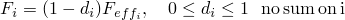

其中  是标量损伤变量， 是在没有损伤的情况下相对运动可用连接分量 *i* 中的响应（有效响应）。

要定义连接损伤机制，请指定以下内容：
- 损伤起始准则；以及
- 指定损伤变量 *d* 如何演化的损伤演化定律（可选）。

在损伤起始之前，*d* 的值为 0.0；因此，连接中的力响应不变。一旦损伤开始，如果指定了损伤演化，损伤变量将单调演化到最大值 1.0。当 *d* = 1.0 时，发生完全失效。

Abaqus 允许您指定最大退化值（默认值为 1.0）；当损伤变量达到此值时，损伤演化将停止，默认情况下将从网格中删除单元。或者，您可以指定损坏的连接单元保留在分析中，不再进行损伤演化。最大退化值用于评估分析剩余部分中的损伤刚度。此功能在 ["section controls" 中的 "控制材料损伤演化的单元删除和最大退化" 第27.1.4节](pt06ch27s01aus113.md#usb-elm-esectioncontrol-deletion) 中详细讨论。

### 定义连接损伤起始

当连接中的力或相对运动满足某些准则时，连接中的退化过程开始。有三种不同的准则类型可用于触发连接中的损伤：基于力的准则、基于塑性运动的准则或基于本构运动的准则。可以为每个分量独立（解耦）指定相对运动可用分量的连接损伤起始准则。或者，可以定义耦合连接中所有或部分相对运动可用分量的连接损伤起始准则。

损伤起始准则可以依赖于温度和场变量。有关将数据定义为温度和场变量函数的信息，请参见 ["输入语法规则，" 第1.2.1节](pt01ch01s02aus01.md)。

#### 基于力的损伤起始准则

默认情况下，损伤起始准则根据连接中的力/力矩指定。必须为起始所涉及的分量定义弹性或刚性连接行为。您提供力/力矩损伤起始值的下限（压缩）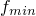 和上限（拉伸）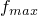。如果力超出由两个极限值指定的范围，则开始损伤。输出变量 CDIF 可用于监测损伤起始点的接近程度。

##### 定义解耦基于力的损伤起始

对于解耦基于力的损伤起始准则，将指定分量中的连接力与指定的极限值进行比较。当指定分量 *i* 中的力  首次超出范围时（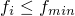 或 ），开始损伤。

| **输入文件用法：** | ``` [*CONNECTOR DAMAGE INITIATION](../key/key-link.md#usb-kws-mconnectordamageinit), COMPONENT=*component number*, CRITERION=FORCE (default), DEPENDENCIES=*n* ``` |
| --- | --- |

| **Abaqus/CAE 用法：** | 相互作用模块：连接截面编辑器：****添加****损伤****：**耦合**：**解耦**，**起始准则**：**力** |
| --- | --- |

##### 定义耦合基于力的损伤起始

对于耦合基于力的损伤起始准则，必须指定连接势能  以定义等效力大小（标量）。将等效力大小与指定的极限值进行比较以评估损伤起始。当等效力大小  首次超出范围时（ 或 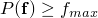），开始损伤。

| **输入文件用法：** | 使用以下选项： |
| --- | --- |
|  | ``` [*CONNECTOR DAMAGE INITIATION](../key/key-link.md#usb-kws-mconnectordamageinit), CRITERION=FORCE (default), DEPENDENCIES=*n* [*CONNECTOR POTENTIAL](../key/key-link.md#usb-kws-mconnectorpotential) ``` |

| **Abaqus/CAE 用法：** | 相互作用模块：连接截面编辑器：****添加****损伤****：**耦合**：**耦合**，**起始准则**：**力**，**起始势能** |
| --- | --- |

#### 基于塑性运动的损伤起始准则

损伤起始准则可以根据连接中的等效相对塑性运动指定。您提供将开始损伤的相对等效塑性位移/旋转作为相对等效塑性率的函数。输出变量 CDIP 可用于监测损伤起始点的接近程度。

##### 定义解耦塑性损伤起始

对于解耦弹塑性或刚性塑性损伤起始准则，必须在指定的相对运动分量中定义解耦连接塑性（参见 ["连接塑性行为，" 第31.2.6节](pt06ch31s02alm32.md)）。当由相关塑性定义定义的等效相对塑性运动首次大于指定极限值时，开始损伤。

| **输入文件用法：** | 使用以下选项： |
| --- | --- |
|  | ``` [*CONNECTOR DAMAGE INITIATION](../key/key-link.md#usb-kws-mconnectordamageinit), COMPONENT=*component number*, CRITERION=PLASTIC MOTION, DEPENDENCIES=*n* [*CONNECTOR PLASTICITY](../key/key-link.md#usb-kws-mconnectorplasticity), COMPONENT=*component number* *or* [*CONNECTOR PLASTICITY](../key/key-link.md#usb-kws-mconnectorplasticity) ``` |

| **Abaqus/CAE 用法：** | 相互作用模块：连接截面编辑器：****添加****损伤****：**起始准则**：**塑性运动**；****添加****塑性**** |
| --- | --- |

##### 定义耦合塑性损伤起始

对于耦合弹塑性或刚性塑性损伤起始准则，必须定义耦合连接塑性。耦合连接塑性函数中使用的连接势能定义了等效相对塑性运动。将此等效相对塑性运动与指定的极限值进行比较以评估损伤起始。开始损伤的等效相对塑性运动可以是模式混合比  的函数（参见 ["连接塑性行为，" 第31.2.6节](pt06ch31s02alm32.md)）。

| **输入文件用法：** | 使用以下选项： |
| --- | --- |
|  | ``` [*CONNECTOR DAMAGE INITIATION](../key/key-link.md#usb-kws-mconnectordamageinit), CRITERION=PLASTIC MOTION, DEPENDENCIES=*n* [*CONNECTOR PLASTICITY](../key/key-link.md#usb-kws-mconnectorplasticity) [*CONNECTOR POTENTIAL](../key/key-link.md#usb-kws-mconnectorpotential) ``` |

| **Abaqus/CAE 用法：** | 相互作用模块：连接截面编辑器：****添加****损伤****：**耦合**：**耦合**，**起始准则**：**塑性运动**；****添加****塑性****：**耦合**：**耦合**，**力势能** |
| --- | --- |

#### 基于本构运动的损伤起始准则

损伤起始准则可以根据连接中的相对本构位移/旋转指定。您提供本构位移/旋转损伤起始值的下限（压缩）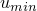 和上限（拉伸）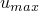。如果运动超出两个极限值指定的范围，则开始损伤。输出变量 CDIM 可用于监测损伤起始点的接近程度。

##### 定义解耦基于本构运动的损伤起始

对于解耦基于运动的损伤起始准则，将指定分量中的连接相对本构运动与指定的极限值进行比较。当指定分量 *i* 中的相对本构位移/旋转  首次超出范围时（ 或 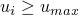），开始损伤。

| **输入文件用法：** | ``` [*CONNECTOR DAMAGE INITIATION](../key/key-link.md#usb-kws-mconnectordamageinit), COMPONENT=*component number*, CRITERION=MOTION, DEPENDENCIES=*n* ``` |
| --- | --- |

| **Abaqus/CAE 用法：** | 相互作用模块：连接截面编辑器：****添加****损伤****：**耦合**：**解耦**，**起始准则**：**运动** |
| --- | --- |

##### 定义耦合基于本构运动的损伤起始

对于耦合基于运动的损伤起始准则，必须指定连接势能 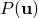 以定义等效运动大小（标量），其中  是连接中所有相对运动可用分量的集合。将等效运动大小与指定的极限值进行比较以评估损伤起始。当等效运动大小  首次超出范围时（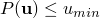 或 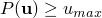），开始损伤。

| **输入文件用法：** | 使用以下选项： |
| --- | --- |
|  | ``` [*CONNECTOR DAMAGE INITIATION](../key/key-link.md#usb-kws-mconnectordamageinit), CRITERION=MOTION, DEPENDENCIES=*n* [*CONNECTOR POTENTIAL](../key/key-link.md#usb-kws-mconnectorpotential) ``` |

| **Abaqus/CAE 用法：** | 相互作用模块：连接截面编辑器：****添加****损伤****：**耦合**：**耦合**，**起始准则**：**运动**，**起始势能** |
| --- | --- |

### 定义连接损伤演化

连接损伤演化指定损伤变量的演化定律。演化后，连接响应将退化。损伤演化可以基于能量耗散准则或相对（塑性）运动。在基于运动的准则中，损伤变量 *d* 可以定义为相对运动的线性、指数或表格函数。

损伤演化定律可以依赖于温度和场变量。有关将数据定义为温度和场变量函数的信息，请参见 ["输入语法规则，" 第1.2.1节](pt01ch01s02aus01.md)。

#### 指定受影响分量

默认情况下（即未明确指定受影响的分量），只会损伤连接中的弹性/刚性或弹性/刚性塑性响应。摩擦、阻尼和止动器/锁行为导致的响应不会退化。对于解耦连接损伤机制（解耦损伤起始准则），只有指定的相对运动分量会发生损伤。对于耦合连接损伤起始，默认情况下选择将退化的分量如下：
- 如果使用基于力或基于本构运动的损伤起始准则，则将影响最终有助于损伤起始连接势能的内在可用分量（1到6）。
- 如果使用基于塑性运动的损伤起始准则，则将影响最终有助于耦合塑性定义中使用的连接势能的内在可用分量。

或者，您可以直接指定将受损伤演化定律影响的相对运动可用分量。在这种情况下，受影响分量中的整个连接响应（弹性/刚性塑性、摩擦、阻尼、约束力和力矩等）都将受到损伤。

| **输入文件用法：** | ``` [*CONNECTOR DAMAGE EVOLUTION](../key/key-link.md#usb-kws-mconnectordamageevol), AFFECTED COMPONENTS ``` |
| --- | --- |
|  | 第一条数据线标识将受到损伤的分量编号，连接损伤演化定义的附加数据从第二条数据线开始。 |

| **Abaqus/CAE 用法：** | 相互作用模块：连接截面编辑器：****添加****损伤****：**指定损伤演化**，**演化**，**指定受影响分量** |
| --- | --- |

#### 定义基于运动的线性损伤演化定律

此处以线性弹性为背景说明损伤演化定律的线性形式，尽管它可以在任何情况下使用。假设连接响应是线性弹性的，并且在损伤起始后需要线性损伤演化，如 [图31.2.7-1](pt06ch31s02alm33.md#usb-elm-econnectbehav-lindamevolve) 所示。

**图31.2.7-1** 线性弹性连接行为的线性损伤演化定律。


如果没有指定损伤，响应将是线性弹性的（一条通过原点的直线）。假设损伤已在点 I 开始，例如由基于力或基于运动的准则触发；此时相应的本构运动为 。如果连接器进一步加载使得本构运动增加到 ，则点 C 处的连接力响应变为 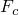。与有效响应 （无损伤的弹性响应）相比，响应降低了 。因此，。如果在点 C 发生卸载，则沿斜率 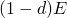 的卸载曲线进行。只要本构运动不超过 ，损伤变量 *d* 就保持在首次达到点 C 时获得的值不变。如果发生进一步加载，则发生进一步损伤，直到达到最终失效运动 （*d* = 1），并且连接分量失去承载任何载荷的能力。因此，一种可能的加载/卸载序列为 OICOC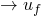。

线性损伤演化定律仅在线性弹性或刚性行为与可选理想塑性结合的情况下才能定义真正线性的损伤力响应。如果为受损分量定义了非线性弹性或带硬化的塑性，则会观察到近似线性的损伤响应。

##### 为基于力或基于本构运动的损伤起始准则定义线性演化定律

如果在分量 *i* 中使用解耦损伤起始准则，您可以指定最终失效时的本构相对运动  与损伤起始时的本构相对运动  之间的差值，在指定分量中（）。

如果使用耦合损伤起始准则，必须为损伤演化目的定义等效本构相对运动 。使用连接势能定义来定义 。您指定最终失效时的等效运动 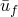 与损伤起始时的等效运动  之间的差值（）。

| **输入文件用法：** | 使用以下选项为解耦起始准则定义线性演化定律： |
| --- | --- |
|  | ``` [*CONNECTOR DAMAGE INITIATION](../key/key-link.md#usb-kws-mconnectordamageinit), COMPONENT=*component number*, CRITERION=FORCE or MOTION [*CONNECTOR DAMAGE EVOLUTION](../key/key-link.md#usb-kws-mconnectordamageevol), TYPE=MOTION, SOFTENING=LINEAR ``` 使用以下选项为耦合起始准则定义线性演化定律： ``` [*CONNECTOR DAMAGE INITIATION](../key/key-link.md#usb-kws-mconnectordamageinit), CRITERION=FORCE or MOTION [*CONNECTOR POTENTIAL](../key/key-link.md#usb-kws-mconnectorpotential) [*CONNECTOR DAMAGE EVOLUTION](../key/key-link.md#usb-kws-mconnectordamageevol), TYPE=MOTION, SOFTENING=LINEAR [*CONNECTOR POTENTIAL](../key/key-link.md#usb-kws-mconnectorpotential) ``` 第二个 [*CONNECTOR POTENTIAL](../key/key-link.md#usb-kws-mconnectorpotential) 选项定义 。 |

| **Abaqus/CAE 用法：** | 使用以下输入为解耦起始准则定义线性演化定律： |
| --- | --- |
|  | 相互作用模块：连接截面编辑器：****添加****损伤****：**耦合**：**解耦**，**起始准则**：**力**或**运动**；**指定损伤演化**，**演化类型**：**运动**，**演化软化**：**线性** 使用以下输入为耦合起始准则定义线性演化定律：相互作用模块：连接截面编辑器：****添加****损伤****：**耦合**：**耦合**，**起始准则**：**力**或**运动**；**指定损伤演化**，**演化类型**：**运动**，**演化软化**：**线性**；**起始势能**；**演化势能** |

##### 为基于塑性运动的损伤起始准则定义线性演化定律

您可以指定最终失效时的相关等效塑性相对运动 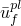 与损伤起始时的相关等效塑性相对运动  之间的差值（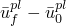），作为模式混合比  的函数，定义于 ["连接塑性行为，" 第31.2.6节](pt06ch31s02alm32.md)。等效塑性相对运动从相关塑性定义（耦合或解耦）计算。

| **输入文件用法：** | 使用以下选项： |
| --- | --- |
|  | ``` [*CONNECTOR DAMAGE INITIATION](../key/key-link.md#usb-kws-mconnectordamageinit), CRITERION=PLASTIC MOTION [*CONNECTOR DAMAGE EVOLUTION](../key/key-link.md#usb-kws-mconnectordamageevol), TYPE=MOTION, SOFTENING=LINEAR ``` |

| **Abaqus/CAE 用法：** | 相互作用模块：连接截面编辑器：****添加****损伤****：**起始准则**：**塑性运动**；**指定损伤演化**，**演化类型**：**运动**，**演化软化**：**线性** |
| --- | --- |

#### 定义基于运动的指数损伤演化定律

此处以带硬化的线性弹塑性响应为背景说明指数损伤演化定律，尽管它可以在任何情况下使用。特定连接分量中的力响应如 [图31.2.7-2](pt06ch31s02alm33.md#usb-elm-econnectbehav-expondamevolve) 所示。

**图31.2.7-2** 带硬化的线性弹塑性连接行为的指数损伤演化定律。

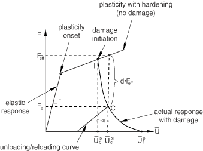

假设损伤在点 I 开始，由基于塑性运动的损伤起始准则触发。如果进一步加载直到点 C，则响应为 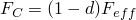。从点 C 卸载沿损伤弹性线（斜率 ）进行。在卸载/再加载时，损伤变量保持不变，直到再次达到点 C。进一步加载（超过点 C）导致响应进一步退化，直到达到最终失效点 （*d* = 1）。损伤变量 *d* 由以下方程给出：


只有使用线性弹性或理想塑性时，损伤响应才会呈现真正的指数形式。如果存在带硬化的塑性，则会获得近似的指数退化。

您指定最终失效和损伤起始之间的相对运动差值以及指数系数 。相对运动差值的解释与 ["定义基于运动的线性损伤演化定律"](pt06ch31s02alm33.md#usb-elm-econnectbehav-linevol) 中描述的方式相同，如下所示：
- 如果使用解耦基于力或基于本构运动的损伤起始准则，则指定最终失效和损伤起始之间指定分量 *i* 中相对运动  的差值。
- 如果使用耦合基于力或基于本构运动的损伤起始准则，则使用连接势能定义等效相对运动（）。指定最终失效和损伤起始之间相对运动  的差值。
- 如果使用基于塑性运动的损伤起始准则，则指定最终失效和损伤起始之间等效相对塑性运动  的差值。等效塑性相对运动从相关塑性定义计算。数据也可以是模式混合比  的函数。

在前两种情况中，损伤变量方程类似于上面针对基于塑性运动的损伤起始给出的方程，只是使用（等效）本构相对运动代替等效相对塑性运动。

| **输入文件用法：** | ``` [*CONNECTOR DAMAGE EVOLUTION](../key/key-link.md#usb-kws-mconnectordamageevol), TYPE=MOTION, SOFTENING=EXPONENTIAL ``` |
| --- | --- |

| **Abaqus/CAE 用法：** | 相互作用模块：连接截面编辑器：****添加****损伤****：**指定损伤演化**，**演化类型**：**运动**，**演化软化**：**指数** |
| --- | --- |

#### 定义基于运动的表格损伤演化定律

您也可以直接将损伤变量指定为最终失效相对运动与损伤起始相对运动之间差值的表格函数。相对运动差值的解释与 ["定义基于运动的线性损伤演化定律"](pt06ch31s02alm33.md#usb-elm-econnectbehav-linevol) 中描述的方式相同，如下所示：
- 如果使用解耦基于力或基于本构运动的损伤起始准则，则使用指定分量 *i* 中最终失效和损伤起始时的本构相对运动  之间的差值来定义表格数据。
- 如果使用耦合基于力或基于本构运动的损伤起始准则，则使用连接势能（）定义等效相对运动。最终失效和损伤起始之间相对运动  的差值用于定义表格数据。
- 如果使用基于塑性运动的损伤起始准则，则使用最终失效和损伤起始之间等效相对塑性运动 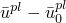 的差值。等效塑性相对运动从相关塑性定义计算。表格数据也可以是模式混合比  的函数。

| **输入文件用法：** | ``` [*CONNECTOR DAMAGE EVOLUTION](../key/key-link.md#usb-kws-mconnectordamageevol), TYPE=MOTION, SOFTENING=TABULAR, DEPENDENCIES=*n* ``` |
| --- | --- |

| **Abaqus/CAE 用法：** | 相互作用模块：连接截面编辑器：****添加****损伤****：**指定损伤演化**，**演化类型**：**运动**，**演化软化**：**表格** |
| --- | --- |

#### 使用损伤起始后耗散能定义损伤演化定律

此损伤演化定律以非线性弹性为背景说明，如 [图31.2.7-3](pt06ch31s02alm33.md#usb-elm-econnectbehav-energydamevolve) 所示。

**图31.2.7-3** 非线性弹性连接行为的损伤起始后耗散能演化定律。


例如，假设损伤在点 I 开始，此时本构相对运动为 ，由基于力或基于运动的损伤起始准则触发。点 C 处的响应为 。从点 C 卸载沿 CO 曲线进行，这是原始非线性弹性响应曲线（OE）按 () 因子缩小的结果。损伤在卸载/再加载曲线（COC）上保持不变，并且仅在加载超过点 C 时才增加。

如果将  指定为 0.0，则可在起始时指定瞬时失效。在所有其他情况下，最终失效（*d* = 1）将在无限运动中（理论上）发生，因为产生了渐近趋于零的类指数响应。当损伤耗散能达到 0.99 时，Abaqus 将设置 *d* = 1。

您指定最终失效时的损伤起始后耗散能 。如果使用基于塑性运动的起始准则，则  可以指定为模式混合比  的函数。

| **输入文件用法：** | ``` [*CONNECTOR DAMAGE EVOLUTION](../key/key-link.md#usb-kws-mconnectordamageevol), TYPE=ENERGY, DEPENDENCIES=*n* ``` |
| --- | --- |

| **Abaqus/CAE 用法：** | 相互作用模块：连接截面编辑器：****添加****损伤****：**指定损伤演化**，**演化类型**：**能量** |
| --- | --- |

### 使用多种损伤机制

对于每个相对运动可用分量，最多可以定义三个解耦损伤机制（连接损伤起始准则和连接损伤演化定律对），每种起始准则类型（力、运动和塑性运动）一个。此外，可以定义三个耦合损伤机制（每种起始准则类型一个）。耦合和解耦损伤定义可以组合；每个分量只有一个总体损伤变量用于损伤特定相对运动分量的响应。只有总体损伤会被输出。

#### 指定每个损伤机制的贡献

当为同一连接行为定义多个损伤机制时，您可以指定每个损伤机制对特定相对运动分量的总体损伤效应的贡献。默认情况下，与特定机制相关的损伤值将与为连接行为定义的任何其他损伤机制的损伤值进行比较，并且只有最大值将被考虑用于总体损伤。或者，您可以指定应以乘法方式组合与连接行为相关的损伤值，以获得总体损伤。有关说明，请参见下面的最后一个示例。

| **输入文件用法：** | 使用以下选项指定只有与特定连接行为相关的最大损伤值应贡献于总体损伤效应： |
| --- | --- |
|  | ``` [*CONNECTOR DAMAGE EVOLUTION](../key/key-link.md#usb-kws-mconnectordamageevol), DEGRADATION=MAXIMUM ``` 使用以下选项指定与特定连接行为相关的所有损伤值应以乘法方式贡献于总体损伤效应： ``` [*CONNECTOR DAMAGE EVOLUTION](../key/key-link.md#usb-kws-mconnectordamageevol), DEGRADATION=MULTIPLICATIVE ``` |

| **Abaqus/CAE 用法：** | 相互作用模块：连接截面编辑器：****添加****损伤****：**指定损伤演化**，**演化**，**退化**：**最大值**或**乘法** |
| --- | --- |

### 示例

以下示例说明了几种定义损伤机制的方法。

#### 解耦损伤

以下输入可用于定义简单的解耦损伤机制：

```
[*CONNECTOR ELASTICITY](../key/key-link.md#usb-kws-mconnectorelasticity), COMPONENT=1
[*CONNECTOR DAMAGE INITIATION](../key/key-link.md#usb-kws-mconnectordamageinit), COMPONENT=1, CRITERION=FORCE
*force_compress*, *force_tens*
[*CONNECTOR DAMAGE EVOLUTION](../key/key-link.md#usb-kws-mconnectordamageevol), TYPE=ENERGY
0.0
```

当分量 1 中的弹性力小于 *force_compress* 或大于 *force_tens* 时，开始损伤。只有分量 1 中的弹性响应会受到损伤。由于为损伤演化指定的耗散能为 0.0，损伤在起始后瞬间灾难性演化。

#### 带基于塑性损伤的耦合刚性塑性

参考 [图31.2.7-4](pt06ch31s02alm33.md#usb-elm-econnect-weldexample-damage) 中的点焊（其中耦合塑性在 ["连接塑性行为，" 第31.2.6节](pt06ch31s02alm32.md) 中定义），可以按如下方式指定基于塑性运动的损伤起始和演化以及对模式混合比的依赖：

**图31.2.7-4** 点焊连接。

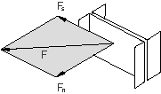

```
[*PARAMETER](../key/key-link.md#usb-kws-mparameter)
=0.25
=0.35
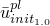=0.45
=0.75
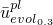=0.78
=0.82
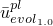=0.85
[*CONNECTOR DAMAGE INITIATION](../key/key-link.md#usb-kws-mconnectordamageinit), CRITERION=PLASTIC MOTION
, 0.0
, 0.5
, 1.0
[*CONNECTOR DAMAGE EVOLUTION](../key/key-link.md#usb-kws-mconnectordamageevol), TYPE=MOTION, SOFTENING=LINEAR
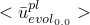, 0.0
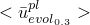, 0.3
, 0.5
, 1.0
```

数据线上的等效塑性相对运动由 ["连接塑性行为，" 第31.2.6节](pt06ch31s02alm32.md) 中说明的相关耦合塑性定义定义。对于损伤演化，应指定损伤起始后的等效塑性相对运动。所有数据线中的第二列表示模式混合比，定义于 ["连接塑性行为，" 第31.2.6节](pt06ch31s02alm32.md)。在这个特定情况下，模式混合比为 。0.0 处的数据点来自纯"剪切"实验，1.0 处的数据点来自纯"法向"实验。中间值的数据来自组合"剪切-法向"实验。

#### 带基于力损伤起始和基于运动损伤演化的耦合刚性塑性

参考 [图31.2.7-4](pt06ch31s02alm33.md#usb-elm-econnect-weldexample-damage) 中的点焊，并使用 ["连接单元的派生分量定义" 在 "连接耦合行为的函数，" 第31.2.4节](pt06ch31s02alm30.md#usb-elm-econnectbehav-derivedcomps) 中定义的派生分量 `normal` 和 `shear`，定义点焊损伤的另一种方法是使用：

```
[*PARAMETER](../key/key-link.md#usb-kws-mparameter)
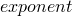=2
=0.85
=120.0
=115.0
[*CONNECTOR DAMAGE INITIATION](../key/key-link.md#usb-kws-mconnectordamageinit), CRITERION=FORCE
, 1.0
[*CONNECTOR POTENTIAL](../key/key-link.md#usb-kws-mconnectorpotential)
normal, 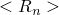
shear, 
** 
[*CONNECTOR DAMAGE EVOLUTION](../key/key-link.md#usb-kws-mconnectordamageevol), TYPE=MOTION, SOFTENING=EXPONENTIAL
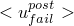, 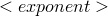
[*CONNECTOR POTENTIAL](../key/key-link.md#usb-kws-mconnectorpotential)
1
2
3
** 
```

当第一个连接势能定义定义的力大小超过指定值 1.0 时，开始损伤。第一个势能定义中的比例因子  和  在这种情况下用于定义在损伤起始时为 1.0 的力大小。选择基于运动的指数衰减损伤演化定律。第二个连接势能定义与连接损伤演化定义相关联，并定义连接中的等效运动 。当等效起始后运动 （其中 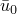 是  在损伤起始时）达到  时，发生最终失效。在这种情况下，所有分量（1到6）都受到影响，因为它们都最终有助于第一个连接势能定义（有关与 `normal` 和 `shear` 派生分量相关的具体定义，请参见 ["连接单元的派生分量定义" 在 "连接耦合行为的函数，" 第31.2.4节](pt06ch31s02alm30.md#usb-elm-econnectbehav-derivedcomps)）。

#### 带四个竞争损伤机制的弹塑性

此示例说明如何指定多个损伤机制对总体损伤效应的贡献，以及受损伤演化定律影响的相对运动分量。为简洁起见，未给出大多数数据线条目或参数。

```
** 第一个损伤机制：基于力的损伤起始
** 损伤变量 
[*CONNECTOR DAMAGE INITIATION](../key/key-link.md#usb-kws-mconnectordamageinit), COMPONENT=4, CRITERION=FORCE
[*CONNECTOR DAMAGE EVOLUTION](../key/key-link.md#usb-kws-mconnectordamageevol), TYPE=MOTION, SOFTENING=EXPONENTIAL, 
DEGRADATION=MAXIMUM, AFFECTED COMPONENTS
4, 6
**
** 第二个损伤机制：基于运动的损伤起始
** 损伤变量 
[*CONNECTOR DAMAGE INITIATION](../key/key-link.md#usb-kws-mconnectordamageinit), COMPONENT=4, CRITERION=MOTION
[*CONNECTOR DAMAGE EVOLUTION](../key/key-link.md#usb-kws-mconnectordamageevol), TYPE=MOTION, SOFTENING=LINEAR, 
DEGRADATION=MULTIPLICATIVE, AFFECTED COMPONENTS
1, 2, 6
**
** 第三个损伤机制：基于塑性运动的损伤起始
** 损伤变量 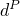
[*CONNECTOR DAMAGE INITIATION](../key/key-link.md#usb-kws-mconnectordamageinit), COMPONENT=4, 
CRITERION=PLASTIC MOTION
[*CONNECTOR DAMAGE EVOLUTION](../key/key-link.md#usb-kws-mconnectordamageevol), TYPE=MOTION, SOFTENING=TABULAR, 
DEGRADATION=MULTIPLICATIVE, AFFECTED COMPONENTS
1, 2
**
** 第四个损伤机制：耦合基于力的损伤起始
** 损伤变量 
[*CONNECTOR DAMAGE INITIATION](../key/key-link.md#usb-kws-mconnectordamageinit), CRITERION=FORCE
[*CONNECTOR POTENTIAL](../key/key-link.md#usb-kws-mconnectorpotential)
** 使用分量 1, 2, 3, 4, 5, 6
[*CONNECTOR DAMAGE EVOLUTION](../key/key-link.md#usb-kws-mconnectordamageevol), TYPE=ENERGY, DEGRADATION=MAXIMUM, 
AFFECTED COMPONENTS
1, 3, 4, 6
```

指定了四个损伤机制（连接损伤起始/连接损伤演化对）：三个解耦和一个耦合。每个损伤演化定义的第一行确定将受到该机制损伤的分量。特定分量中的总体损伤由影响该分量的所有机制的贡献决定。例如，分量 1 中的总体损伤  由第二、第三和第四个损伤机制确定，如下所示：


 和  使用乘法退化；因此，首先相乘：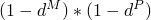。 使用最大退化，因此将  与  比较，并取最小值。

例如，假设在特定时间 *t*，=0.5，=0.3，=0.2，在时间 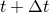，=0.6（唯一增加的值），而  和  保持不变。当使用所有三个损伤机制时，总体损伤变量比仅使用  机制时更快地接近最终损伤值：


而

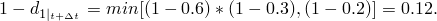

当  达到 0.0 时发生完全失效。

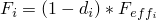，其中 *i* 指的是  相对运动可用分量。其他分量的总体损伤变量确定如下（基于每个损伤演化定律指定的受影响分量）：

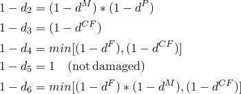

### Abaqus/Standard 中的最大退化和单元去除选择

您可以控制 Abaqus/Standard 如何处理严重损伤的连接单元。默认情况下，材料点处总体损伤变量的上限为 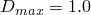。您可以减少此上限，如 ["section controls" 中的 "控制材料损伤演化的单元删除和最大退化" 第27.1.4节](pt06ch27s01aus113.md#usb-elm-esectioncontrol-deletion) 中所讨论的。

默认情况下，一旦至少一个分量中的总体损伤变量达到 ，连接单元就会被删除。详细信息请参见 ["section controls" 中的 "控制材料损伤演化的单元删除和最大退化" 第27.1.4节](pt06ch27s01aus113.md#usb-elm-esectioncontrol-deletion)。删除后，连接单元不再对后续变形提供任何阻力。

或者，您可以指定即使在总体损伤变量达到  后，连接单元也应保留在模型中。在这种情况下，一旦总体损伤变量达到 ，单元刚度就保持不变，为  乘以未损伤刚度。

### Abaqus/Standard 中的粘性正则化

损伤会导致连接单元中的软化响应，这通常会在隐式代码（如 Abaqus/Standard）中导致收敛困难。克服收敛困难的一种技术是通过引入粘性损伤变量 

其中  是在无粘性骨干模型中评估的损伤变量， 是表示松弛时间的粘性参数。粘性材料的损伤响应给定为

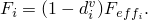

由于粘性正则化，阻尼损伤变量不完全遵守指定的演化定律（只有骨干损伤变量遵守）。

| **输入文件用法：** | ``` [*SECTION CONTROLS](../key/key-link.md#usb-kws-msectioncontrols), NAME=*name*, VISCOSITY= [*CONNECTOR SECTION](../key/key-link.md#usb-kws-mconnectorsection), CONTROLS=*name* ``` |
| --- | --- |

| **Abaqus/CAE 用法：** | Abaqus/CAE 不支持粘性正则化。 |
| --- | --- |

### 在线姓扰动过程中定义连接损伤行为

在线性扰动分析期间，不能起始损伤，损伤变量也不会演化。因此，在线性扰动步骤期间，损伤"冻结"在先前一般步骤结束时的状态。

### 输出

连接的可用 Abaqus 输出变量列在 ["Abaqus/Standard 输出变量标识符，" 第4.2.1节](pt02ch04s02abv01.md) 和 ["Abaqus/Explicit 输出变量标识符，" 第4.2.2节](pt02ch04s02xbv01.md) 中。在连接中定义损伤时，以下变量特别令人关注：

| CDMG | 连接总体损伤变量。 |
| --- | --- |

| CDIF | 基于力的连接损伤起始变量。除了与连接输出变量相关的通常六个分量外，CDIF 还包括标量 CDIFC，这是与耦合基于力的损伤起始准则相关的损伤起始准则值。 |
| --- | --- |

| CDIM | 基于运动的连接损伤起始变量。CDIM 包括标量 CDIMC，这是与耦合基于运动的损伤起始准则相关的损伤起始准则值。 |
| --- | --- |

| CDIP | 基于塑性运动的连接损伤起始变量。CDIP 包括标量 CDIPC，这是与耦合基于塑性运动的损伤起始准则相关的损伤起始准则值。 |
| --- | --- |

| ALLDMD | 损伤耗散的能量。 |
| --- | --- |

| ALLCD | 粘性正则化耗散的能量。 |
| --- | --- |


