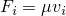

# 31.2.9 连接失效行为


**产品：** Abaqus/Standard  Abaqus/Explicit  Abaqus/CAE  

##### **参考资料**

- ["连接器概述，" 第31.1.1节](pt06ch31s01abo28.md)
- ["连接行为，" 第31.2.1节](pt06ch31s02alm27.md)
- [*CONNECTOR BEHAVIOR](../key/key-link.md#usb-kws-mconnectorbehavior)
- [*CONNECTOR FAILURE](../key/key-link.md#usb-kws-mconnectorfailure)
- ["定义失效，" Abaqus/CAE 用户指南第15.17.11节](../usi/usi-link.md#usi-itn-help-failure)

### 概述

连接失效行为：
- 可在 Abaqus/Standard 中任何具有相对运动可用分量的连接器中定义；
- 可在 Abaqus/Explicit 中任何连接器中定义；
- 可在 Abaqus/Standard 中用于在满足失效准则时使所有或指定的相对运动分量失效；
- 可在 Abaqus/Explicit 中用于在满足失效准则时使所有或指定的相对运动分量失效；
- 如果指定分量中的连接相对运动或连接力超出指定范围，可以被触发；以及
- 在大多数情况下，可被更复杂的连接损伤起始/演化行为取代（参见 ["连接损伤行为，" 第31.2.7节](pt06ch31s02alm33.md)）。

### 定义连接失效行为

典型的连接器可能在相对运动分量、力或力矩变得过大时断裂。Abaqus 提供了一种方法来定义哪些相对运动分量将断裂以及用于释放这些分量的准则。您可以选择失败准则所基于的相对运动分量。

在 Abaqus/Standard 中，连接失效可用于基于相对运动可用分量指定连接行为。在 Abaqus/Explicit 中，连接失效可用于基于约束以及相对运动可用分量指定连接行为。可以为连接中涉及的所有相对运动分量指定力或力矩的极限值。此外，对于具有相对运动可用分量的连接器，可以为与可用分量对应的相对位置指定极限值。

在 Abaqus/Standard 中，如果满足为所选相对运动分量指定的失效准则，则所有相对运动分量或单个可用分量失效。默认情况下，满足失效准则时，所有相对运动分量都被释放。在满足失效准则的增量期间，将移除连接单元中所有已释放分量的节点力贡献。

在 Abaqus/Explicit 中，如果满足为所选分量指定的失效准则，则所有分量或单个可用分量失效。默认情况下，满足失效准则时，所有分量都被释放。在满足失效准则的增量期间，将移除连接单元中所有已释放分量的节点力贡献。

| **输入文件用法：** | 使用以下选项定义连接失效： |
| --- | --- |
|  | ``` [*CONNECTOR BEHAVIOR](../key/key-link.md#usb-kws-mconnectorbehavior), NAME=*name* [*CONNECTOR FAILURE](../key/key-link.md#usb-kws-mconnectorfailure), COMPONENT=*component number*, RELEASE=ALL or *component number* ``` |

| **Abaqus/CAE 用法：** | 相互作用模块：连接截面编辑器：****添加****失效****：**分量：***component or components*，**释放**：**全部**或**指定***component* |
| --- | --- |

#### Abaqus/Standard 中的粘性阻尼

在 Abaqus/Standard 中，失效连接的突然释放可能导致收敛问题。为了避免收敛问题，您可以为分量添加粘性阻尼。分量中的阻尼力计算为 ，其中  是用户定义的阻尼系数， 是失效分量的速度。粘性阻尼仅在所选的相对运动可用分量被释放时应用。

| **输入文件用法：** | 使用以下选项在 Abaqus/Standard 中为失效分量添加粘性阻尼： |
| --- | --- |
|  | ``` [*SECTION CONTROLS](../key/key-link.md#usb-kws-msectioncontrols), NAME=*name*, VISCOSITY= [*CONNECTOR SECTION](../key/key-link.md#usb-kws-mconnectorsection), CONTROLS=*name* ``` |

| **Abaqus/CAE 用法：** | Abaqus/CAE 不支持粘性正则化。 |
| --- | --- |

### 示例

在 [图31.2.9-1](pt06ch31s02alm35.md#econnectorbehavior-shock-fail) 的示例中，假设如果减震器中的拉力超过 800.0 单位，则减震器会拉开。

**图31.2.9-1** 减震器的简化连接模型。


```
*...*
[*CONNECTOR BEHAVIOR](../key/key-link.md#usb-kws-mconnectorbehavior), NAME=sbehavior
[*CONNECTOR FAILURE](../key/key-link.md#usb-kws-mconnectorfailure), COMPONENT=1, RELEASE=ALL
, , , 800.0
```

### 输出

连接的可用 Abaqus 输出变量列在 ["Abaqus/Standard 输出变量标识符，" 第4.2.1节](pt02ch04s02abv01.md) 和 ["Abaqus/Explicit 输出变量标识符，" 第4.2.2节](pt02ch04s02xbv01.md) 中。在连接中定义失效时，以下输出变量特别令人关注：

| CFAILST | 连接失效状态的标志。 |
| --- | --- |

| ALLVD | 添加到失效分量的粘性阻尼所耗散的能量。 |
| --- | --- |

在任何给定时间和特定相对运动分量 *i*，如果连接器在该特定相对运动分量中失效（满足失效准则），则输出变量 CFAILST*i* 为 1。

如果在给定时间特定分量 *i* 未满足失效准则，则输出变量 CFAILST*i* 为 0。


