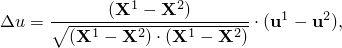
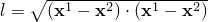
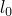
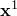
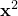
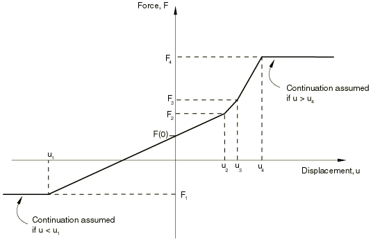
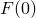

# 32.1.1 弹簧


**产品：** Abaqus/Standard  Abaqus/Explicit  Abaqus/CAE  

##### **参考资料**

- ["弹簧单元库，" 第32.1.2节](pt06ch32s01ael26.md)
- [*SPRING](../key/key-link.md#usb-kws-mspring)
- ["定义弹簧和阻尼器，" Abaqus/CAE 用户指南第37.1节](../usi/usi-link.md#usi-eng-springs-overview)

### 概述

弹簧单元：
- 可以将力与相对位移耦合；
- 在 Abaqus/Standard 中可以将力矩与相对旋转耦合；
- 可以是线性或非线性的；
- 如果是线性的，在直接解稳态动力学分析中可以依赖于频率；
- 可以依赖于温度和场变量；以及
- 可用于指定结构阻尼因子以形成弹簧刚度的虚部。

"力"和"位移"这两个术语贯穿弹簧单元的描述。当弹簧与位移自由度相关时，这些变量是弹簧中的力和相对位移。如果弹簧与旋转自由度相关，它们是扭转弹簧；这些变量将是弹簧传递的力矩和穿过弹簧的相对旋转。

在 Abaqus/Standard 中可以通过组合频率相关弹簧和频率相关阻尼器来建模粘弹性弹簧行为。

### 典型应用

弹簧单元用于模拟实际物理弹簧以及轴向或扭转组件的理想化。它们还可以模拟防止刚体运动的约束。

通过指定结构阻尼因子以形成弹簧刚度的虚部，它们也用于表示结构阻尼器。

### 选择合适的单元

SPRING1 和 SPRING2 单元仅在 Abaqus/Standard 中可用。SPRING1 在节点和地面之间，沿固定方向作用。SPRING2 在两个节点之间，沿固定方向作用。

SPRINGA 单元在 Abaqus/Standard 和 Abaqus/Explicit 中都可用。SPRINGA 在两个节点之间起作用，其作用线是连接两个节点的直线，因此作用线可以在大位移分析中旋转。

在 Abaqus 中任何弹簧单元中，弹簧行为都可以是线性或非线性的。

SPRING1 和 SPRING2 单元类型可以与位移或旋转自由度相关联（在后者情况下，作为扭转弹簧）。但是，在大位移分析中使用扭转弹簧需要仔细考虑节点处总旋转的定义；因此，连接单元（["连接器概述，" 第31.1.1节"](pt06ch31s01abo28.md)）通常是为大位移情况提供扭转弹簧的更好方法。

| **输入文件用法：** | 使用以下选项指定在节点和地面之间沿固定方向作用的弹簧单元： |
| --- | --- |
|  | ``` [*ELEMENT](../key/key-link.md#usb-kws-melement), TYPE=SPRING1 ``` 使用以下选项指定在两个节点之间沿固定方向作用的弹簧单元： ``` [*ELEMENT](../key/key-link.md#usb-kws-melement), TYPE=SPRING2 ``` 使用以下选项指定在两个节点之间其作用线为连接两个节点的直线的弹簧单元： ``` [*ELEMENT](../key/key-link.md#usb-kws-melement), TYPE=SPRINGA ``` |

| **Abaqus/CAE 用法：** | 属性或相互作用模块：****特殊****弹簧/阻尼器****创建****，然后选择以下之一：**连接到地面**：选择点：**弹簧刚度**切换开关（相当于 SPRING1）**连接两点**：选择点：**轴**：**指定固定方向**：切换开关**弹簧刚度**（相当于 SPRING2）**连接两点**：选择点：**轴**：**沿作用线**：切换开关**弹簧刚度**（相当于 SPRINGA） |
| --- | --- |

### Abaqus/Explicit 中的稳定性考虑

SPRINGA 单元在两个自由度之间引入刚度，而不引入相关质量。在显式动态过程中，这代表一个无条件不稳定的单元。弹簧所连接的节点必须从相邻单元中获得一些质量贡献；如果不满足此条件，Abaqus/Explicit 将发出错误消息。如果弹簧不是太硬（相对于相邻单元的刚度），由显式动力学过程（["显式动力学分析，" 第6.3.3节"](pt03ch06s03at08.md)）确定的稳定时间增量将足以确保计算的稳定性。

Abaqus/Explicit 在确定稳定时间增量时不使用弹簧。在分析的数据检查阶段，Abaqus/Explicit 计算网格中除弹簧单元外的所有单元的稳定时间增量最小值。然后，程序使用此最小稳定时间增量和每个弹簧的刚度来确定每个弹簧给出相同稳定时间增量所需的 mass。如果此质量相对于模型的质量过大，Abaqus/Explicit 将发出错误消息，指出弹簧相对于模型定义过硬。

### 相对位移定义

相对位移定义取决于单元类型。

#### SPRING1 单元

SPRING1 单元的相对位移是弹簧节点的第 *i* 个位移分量：


其中 *i* 如下所述定义，可以是局部方向（参见 ["为 SPRING1 和 SPRING2 单元定义作用方向"](pt06ch32s01alm37.md#usb-elm-espring-orient)）。

#### SPRING2 单元

SPRING2 单元的相对位移是弹簧第一个节点的第 *i* 个位移分量与弹簧第二个节点的第 *j* 个位移分量之间的差值：


其中 *i* 和 *j* 如下所述定义，可以是局部方向（参见 ["为 SPRING1 和 SPRING2 单元定义作用方向"](pt06ch32s01alm37.md#usb-elm-espring-orient)）。

重要的是要理解 SPRING2 单元根据上述相对位移方程的行为，因为该单元可能产生反直觉的结果。例如，以以下方式设置的 SPRING2 单元将是"压缩"弹簧：


如果节点位移使得  和 ，弹簧看起来处于压缩状态，而 SPRING2 单元中的力为正。要获得"拉伸"弹簧，SPRING2 单元应按以下方式设置：


#### SPRINGA 单元

对于几何线性分析，相对位移沿参考配置中 SPRINGA 单元的方向测量：



其中  是弹簧第一个节点的参考位置， 是其第二个节点的参考位置。

对于几何非线性分析，SPRINGA 单元的相对位移是弹簧在初始和当前配置之间长度的变化：


其中  是弹簧的当前长度， 是初始配置中 *l* 的值。这里  和  是弹簧节点当前位置。

在这两种情况下，SPRINGA 单元中的力在拉伸时为正。

### 定义弹簧行为

弹簧行为可以是线性或非线性的。在任何一种情况下，您都必须将弹簧行为与模型的某个区域相关联。

| **输入文件用法：** | ``` [*SPRING](../key/key-link.md#usb-kws-mspring), ELSET=*name* ``` |
| --- | --- |
|  | 其中 ELSET 参数指一组弹簧单元。 |

| **Abaqus/CAE 用法：** | 属性或相互作用模块：****特殊****弹簧/阻尼器****创建****：选择连接类型：选择点 |
| --- | --- |

#### 定义线性弹簧行为

通过指定恒定弹簧刚度（相对于位移的力）来定义线性弹簧行为。

弹簧刚度可以依赖于温度和场变量。有关将数据定义为温度和独立场变量函数的信息，请参见 ["输入语法规则，" 第1.2.1节"](pt01ch01s02aus01.md)。

对于直接解稳态动力学分析，弹簧刚度可以依赖于频率、温度和场变量。如果在任何其他 Abaqus/Standard 分析过程中指定了频率相关弹簧刚度，将使用给定最低频率的数据。

| **输入文件用法：** | ``` [*SPRING](../key/key-link.md#usb-kws-mspring), DEPENDENCIES=*n* *first data line* *spring stiffness*, *frequency*, *temperature*, *field variable 1*, etc. ... ``` |
| --- | --- |

| **Abaqus/CAE 用法：** | 在 Abaqus/CAE 中将弹簧定义为工程特征时，不支持将弹簧刚度定义为频率、温度和场变量的函数；相反，您可以定义具有弹簧状弹性行为的连接器（参见 ["连接弹性行为，" 第31.2.2节"](pt06ch31s02alm28.md)）。 |
| --- | --- |

#### 定义非线性弹簧行为

通过给出力-相对位移对来定义非线性弹簧行为。这些值应按相对位移升序给出，并且应提供足够宽的相对位移范围以便正确定义行为。Abaqus 假定力在给定范围外保持不变（这导致零刚度）（参见 [图32.1.1-1](pt06ch32s01alm37.md#espring-nonlinear-usb-elm-espring)）。

**图32.1.1-1** 非线性弹簧力-相对位移关系。



非线性弹簧中的初始力应作为  关系的一部分定义，在零相对位移处给出非零力 。

弹簧刚度可以依赖于温度和场变量。有关将数据定义为温度和独立场变量函数的信息，请参见 ["输入语法规则，" 第1.2.1节"](pt01ch01s02aus01.md)。

Abaqus/Explicit 会将数据正则化为以独立变量偶数间隔定义的表。在某些情况下，当力在独立变量（相对位移）的不均匀间隔定义且独立变量的范围相对于最小间隔较大时，Abaqus/Explicit 可能无法在合理数量的间隔中获得准确的数据正则化。在这种情况下，程序将在处理所有数据后停止，并显示错误消息，指出您必须重新定义材料数据。有关数据正则化的更详细讨论，请参见 ["材料数据定义，" 第21.1.2节"](pt05ch21s01aus109.md)。

| **输入文件用法：** | ``` [*SPRING](../key/key-link.md#usb-kws-mspring), NONLINEAR, DEPENDENCIES=*n* *first data line* *force*, *relative displacement*, *temperature*, *field variable 1*, etc. ... ``` |
| --- | --- |

| **Abaqus/CAE 用法：** | 在 Abaqus/CAE 中将弹簧定义为工程特征时，不支持定义非线性弹簧行为；相反，您可以定义具有弹簧状弹性行为的连接器（参见 ["连接弹性行为，" 第31.2.2节"](pt06ch31s02alm28.md)）。 |
| --- | --- |

### 为 SPRING1 和 SPRING2 单元定义作用方向

通过给出单元每个节点的自由度来定义 SPRING1 和 SPRING2 单元的作用方向。此自由度可以在局部坐标系中（["方向，" 第2.2.5节"](pt01ch02s02aus15.md)）。局部系统被认为是固定的：即使在大位移分析中，SPRING1 和 SPRING2 单元在整个分析过程中也沿固定方向作用。

| **输入文件用法：** | ``` [*SPRING](../key/key-link.md#usb-kws-mspring), ORIENTATION=*name* *dof at node 1*, *dof at node 2* ``` |
| --- | --- |

| **Abaqus/CAE 用法：** | 属性或相互作用模块：****特殊****弹簧/阻尼器****创建****，然后选择以下之一：**连接到地面**：选择点：**方向**：**编辑**：选择方向**连接两点**：选择点：**轴**：**指定固定方向**：**方向**：**编辑**：选择方向 |
| --- | --- |

### 定义具有复刚度的线性弹簧行为

弹簧可用于模拟结构阻尼器，这些阻尼器对形成单元结构阻尼矩阵的单元刚度的虚部有贡献。您指定特定自由度的弹簧刚度实部和结构阻尼因子 *s*。弹簧刚度的虚部计算为 ，表示结构阻尼。这些数据可以依赖于频率。

| **输入文件用法：** | ``` [*SPRING](../key/key-link.md#usb-kws-mspring), COMPLEX STIFFNESS *first data line* *real spring stiffness*, *structural damping factor*, *frequency* ``` |
| --- | --- |

| **Abaqus/CAE 用法：** | Abaqus/CAE 不支持具有复刚度的线性弹簧行为。 |
| --- | --- |


