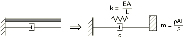
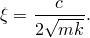
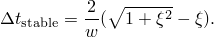
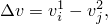
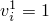
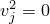
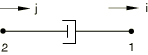

# 32.2.1 阻尼器


**产品：** Abaqus/Standard  Abaqus/Explicit  Abaqus/CAE  

##### **参考资料**

- ["阻尼器单元库，" 第32.2.2节](pt06ch32s02ael27.md)
- [*DASHPOT](../key/key-link.md#usb-kws-mdashpot)
- ["定义弹簧和阻尼器，" Abaqus/CAE 用户指南第37.1节](../usi/usi-link.md#usi-eng-springs-overview)

### 概述

阻尼器单元：
- 可以将力与相对速度耦合；
- 在 Abaqus/Standard 中可以将力矩与相对角速度耦合；
- 可以是线性或非线性的；
- 如果是线性的，在直接解稳态动力学分析中可以依赖于频率；
- 可以依赖于温度和场变量；以及
- 可用于任何应力分析过程。

"力"和"速度"这两个术语贯穿阻尼器单元的描述。当阻尼器与位移自由度相关时，这些变量是阻尼器中的力和相对速度。如果阻尼器与旋转自由度相关，它们是扭转阻尼器；这些变量将是阻尼器传递的力矩和穿过阻尼器的相对角速度。

在动态分析中，速度作为积分算子的一部分获得；在 Abaqus/Standard 准静态分析中，速度通过将位移增量除以时间增量获得。

### 典型应用

阻尼器用于建模相对速度相关的力或扭转阻力。它们还可以提供粘性能量耗散机制。

阻尼器在不适于使用修正 Riks 算法的非线性静态分析中通常很有用（参见 ["不稳定坍塌和后屈曲分析，" 第6.2.4节"](pt03ch06s02at03.md)，了解修正 Riks 算法的讨论），并且在使用自动时间步长算法时，因为配置中的突然变化可以通过阻尼器中产生的力来控制。在这种情况下，阻尼的大小必须与时间周期结合选择，以便有足够的阻尼来控制此类困难，但在获得稳定静态响应时阻尼力可以忽略。另请参见 Abaqus/Standard 中接触单元可用的接触阻尼（参见 ["接触阻尼，" 第37.1.3节"](pt09ch37s01aus167.md)）。

### 选择合适的单元

DASHPOT1 和 DASHPOT2 单元仅在 Abaqus/Standard 中可用。DASHPOT1 在指定自由度和地面之间。DASHPOT2 在两个指定自由度之间。

DASHPOTA 单元在 Abaqus/Standard 和 Abaqus/Explicit 中都可用。DASHPOTA 在两个节点之间，其作用线是连接两个节点的直线。

在这些单元中，阻尼器行为可以是线性或非线性的。

| **输入文件用法：** | 使用以下选项指定在指定自由度和地面之间的阻尼器单元： |
| --- | --- |
|  | ``` [*ELEMENT](../key/key-link.md#usb-kws-melement), TYPE=DASHPOT1 ``` 使用以下选项指定在两个自由度之间的阻尼器单元： ``` [*ELEMENT](../key/key-link.md#usb-kws-melement), TYPE=DASHPOT2 ``` 使用以下选项指定在两个节点之间其作用线为连接两个节点的直线的阻尼器单元： ``` [*ELEMENT](../key/key-link.md#usb-kws-melement), TYPE=DASHPOTA ``` |

| **Abaqus/CAE 用法：** | 属性或相互作用模块：****特殊****弹簧/阻尼器****创建****，然后选择以下之一：**连接到地面**：选择点：切换开关**阻尼系数**（相当于 DASHPOT1）**连接两点**：选择点：**轴**：**指定固定方向**：切换开关**阻尼系数**（相当于 DASHPOT2）**连接两点**：选择点：**轴**：**沿作用线**：切换开关**阻尼系数**（相当于 DASHPOTA） |
| --- | --- |

### Abaqus/Explicit 中的稳定性考虑

Abaqus/Explicit 在确定稳定时间步长时不考虑阻尼器；因此，在将阻尼器引入网格时应小心。

DASHPOTA 单元在两个自由度之间引入阻尼力，而不在这些自由度之间引入任何刚度，也不在节点处引入任何质量。这可能导致稳定时间增量减少。例如，考虑一个简单的桁架单元和阻尼器单元系统，如 [图32.2.1-1](pt06ch32s02alm38.md#edashpot-stability) 所示。

**图32.2.1-1** 一个简单的桁架和阻尼器系统。



此系统的动力学方程为


或


其中


和



弹簧-阻尼器系统的稳定时间增量为



随着阻尼系数 *c* 增加，稳定时间增量  将减小。

为避免稳定时间增量减少，阻尼器应与弹簧或桁架单元并联使用，其中弹簧或桁架单元的刚度选择使得阻尼器和弹簧或桁架的稳定时间增量大于 Abaqus/Explicit 计算的稳定临界时间增量。如果这需要具有不可接受力的弹簧或桁架，请直接为步骤指定时间增量大小（参见 ["显式动力学分析，" 第6.3.3节"](pt03ch06s03at08.md)）。

### 相对速度定义

相对速度定义取决于单元类型。

#### DASHPOT1 单元

DASHPOT1 单元的相对速度是阻尼器节点的第 *i* 个速度分量：


其中 *i* 如下所述定义，可以是局部方向（参见 ["为 DASHPOT1 和 DASHPOT2 单元定义作用方向"](pt06ch32s02alm38.md#usb-elm-edashpot-orient)")。

#### DASHPOT2 单元

DASHPOT2 单元的相对速度是阻尼器第一个节点的第 *i* 个速度分量与阻尼器第二个节点的第 *j* 个速度分量之间的差值：



其中 *i* 和 *j* 如下所述定义，可以是局部方向（参见 ["为 DASHPOT1 和 DASHPOT2 单元定义作用方向"](pt06ch32s02alm38.md#usb-elm-edashpot-orient)")。

重要的是要理解 DASHPOT2 单元根据上述相对位移方程的行为，因为该单元可能产生反直觉的结果。例如，以以下方式设置的 DASHPOT2 单元将是"压缩"阻尼器：


如果节点速度使得  和 ，阻尼器被压缩而阻尼器中的力为正。要获得"拉伸"阻尼器，DASHPOT2 单元应按以下方式设置：



#### DASHPOTA 单元

DASHPOTA 单元的相对速度是阻尼器第二个节点的速度与阻尼器第一个节点的速度之差，沿阻尼器当前轴的方向。

对于几何线性分析，


其中  是阻尼器第一个节点的参考位置， 是阻尼器第二个节点的参考位置， 是阻尼器的参考长度。

对于几何非线性分析，


其中  是阻尼器第一个节点的当前位置， 是阻尼器第二个节点的当前位置，*l* 是阻尼器的当前长度。

在这两种情况下，如果阻尼器正在伸长，则 DASHPOTA 单元中的力为正。

### 定义阻尼器行为

阻尼器行为可以是线性或非线性的。在任何一种情况下，您都必须将阻尼器行为与模型的某个区域相关联。

| **输入文件用法：** | ``` [*DASHPOT](../key/key-link.md#usb-kws-mdashpot), ELSET=*name* ``` |
| --- | --- |
|  | 其中 ELSET 参数指一组阻尼器单元。 |

| **Abaqus/CAE 用法：** | 属性或相互作用模块：****特殊****弹簧/阻尼器****创建****：选择连接类型：选择点 |
| --- | --- |

#### 线性阻尼器行为

通过指定恒定阻尼系数（相对于相对速度的力）来定义线性阻尼器行为。

阻尼系数可以依赖于温度和场变量。有关将数据定义为温度和独立场变量函数的信息，请参见 ["输入语法规则，" 第1.2.1节"](pt01ch01s02aus01.md)。

对于直接解稳态动力学分析，阻尼系数可以依赖于频率，温度和场变量。如果在任何其他 Abaqus/Standard 分析过程中指定了频率相关阻尼系数，将使用给定最低频率的数据。

| **输入文件用法：** | ``` [*DASHPOT](../key/key-link.md#usb-kws-mdashpot), DEPENDENCIES=*n* *first data line* *dashpot coefficient*, *frequency*, *temperature*, *field variable 1*, etc. ... ``` |
| --- | --- |

| **Abaqus/CAE 用法：** | 属性或相互作用模块：****特殊****弹簧/阻尼器****创建****：选择连接类型：选择点：**属性**：**阻尼系数**：*dashpot coefficient* |
| --- | --- |
|  | 在 Abaqus/CAE 中将阻尼器定义为工程特征时，不支持将阻尼系数定义为频率，温度和场变量的函数；相反，您可以定义具有阻尼器状阻尼行为的连接器（参见 ["连接阻尼行为，" 第31.2.3节"](pt06ch31s02alm29.md)）。 |

#### 非线性阻尼器行为

通过给出力-相对速度对来定义非线性阻尼器行为。这些值应按相对速度升序给出，并且应提供足够宽的相对速度范围以便正确定义行为。Abaqus 假定力在给定范围外保持不变（参见 [图32.2.1-2](pt06ch32s02alm38.md#edashpot-nonlinear)）。此外，曲线应通过原点。也就是说，力在零相对速度时应为零。

**图32.2.1-2** 非线性阻尼器力-相对速度关系。


阻尼系数可以依赖于温度和场变量。有关将数据定义为温度和独立场变量函数的信息，请参见 ["输入语法规则，" 第1.2.1节"](pt01ch01s02aus01.md)。

Abaqus/Explicit 会将数据正则化为以独立变量偶数间隔定义的表。在某些情况下，当力在独立变量（相对速度）的不均匀间隔定义且独立变量的范围相对于最小间隔较大时，Abaqus/Explicit 可能无法在合理数量的间隔中获得准确的数据正则化。在这种情况下，程序将在处理所有数据后停止，并显示错误消息，指出您必须重新定义材料数据。有关数据正则化的更详细讨论，请参见 ["材料数据定义，" 第21.1.2节"](pt05ch21s01aus109.md)。

| **输入文件用法：** | ``` [*DASHPOT](../key/key-link.md#usb-kws-mdashpot), NONLINEAR, DEPENDENCIES=*n* *first data line* *force*, *relative velocity*, *temperature*, *field variable 1*, etc. ... ``` |
| --- | --- |

| **Abaqus/CAE 用法：** | 在 Abaqus/CAE 中将阻尼器定义为工程特征时，不支持定义非线性阻尼器行为；相反，您可以定义具有阻尼器状阻尼行为的连接器（参见 ["连接阻尼行为，" 第31.2.3节"](pt06ch31s02alm29.md)）。 |
| --- | --- |

### 为 DASHPOT1 和 DASHPOT2 单元定义作用方向

通过给出单元每个节点的自由度来定义 DASHPOT1 和 DASHPOT2 单元的作用方向。此自由度可以在局部坐标系中（["方向，" 第2.2.5节"](pt01ch02s02aus15.md)）。此局部系统被认为是固定的：即使在大位移分析中，DASHPOT1 和 DASHPOT2 单元在整个分析过程中也沿固定方向作用。

| **输入文件用法：** | ``` [*DASHPOT](../key/key-link.md#usb-kws-mdashpot), ORIENTATION=*name* *dof at node 1*, *dof at node 2* ``` |
| --- | --- |

| **Abaqus/CAE 用法：** | 属性或相互作用模块：****特殊****弹簧/阻尼器****创建****，然后选择以下之一：**连接到地面**：选择点：**方向**：**编辑**：选择方向**连接两点**：选择点：**轴**：**指定固定方向**：**方向**：**编辑**：选择方向 |
| --- | --- |

### 子结构中的阻尼器

阻尼器不能用于子结构内部。您可以在子结构定义中或在使用级别定义 Rayleigh 阻尼以在子结构内部创建阻尼；有关更多信息，请参见 ["在使用子结构中定义子结构阻尼" 第10.1.1节"](pt04ch10s01aus58.md#usb-anl-asuperelements-damping)。


