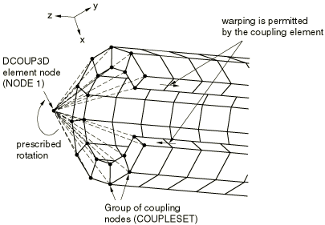

# 32.4.1 分布耦合单元


**产品：** Abaqus/Standard  

##### **参考资料**

- ["分布耦合单元库，" 第32.4.2节](pt06ch32s04ael29.md)
- [*DISTRIBUTING COUPLING](../key/key-link.md#usb-kws-mdistcoupling)

### 概述

分布耦合单元：
- 可用于将力和力矩从参考节点分布到节点集合；
- 可用于为节点集合规定平均位移和旋转；
- 可用于为节点集合分布质量；
- 可用于通过为每个耦合节点指定的权重因子来控制力和质量分布；
- 可用于在结构和实体单元之间创建柔性耦合；以及
- 可与二维或三维应力/位移单元一起使用。

如果不需要质量分布，首选的分布约束定义方法在 ["耦合约束，" 第35.3.2节"](pt08ch35s03aus133.md) 中描述。

### 典型应用

分布耦合单元约束耦合节点的运动到单元节点的平移和旋转。这种约束以平均值的方式强制执行，并以一种能够控制载荷传递的方式实现。这些特性使得分布耦合单元在许多应用中很有用：
- 该单元可用于在边界上规定位移和旋转条件，而这种情况下需要边界上节点之间的相对运动。这种情况的一个例子是，在预期会发生翘曲和/或端面内变形的结构末端施加扭转（参见 [图32.4.1-1](pt06ch32s04alm40.md#edistcoupling-rotate)）。
  **图32.4.1-1** DCOUP3D 单元用于在不约束面内运动的情况下对结构表面施加旋转。
  
- 该单元可用于通过参考节点的运动提供耦合节点运动的加权平均值。
- 该单元可用于分布载荷，其中载荷分布可以用转动惯量表达式来描述。这种情况的例子包括经典的螺栓模式和焊接模式载荷分布表达式。
- 该单元可用作两部分（结构-实体）之间的耦合以传递力和力矩。与 MPC 和运动学耦合约束相比，分布耦合单元可以被认为是一种更"柔性"的连接。

### 选择合适的单元

二维和三维分布耦合单元都可用。DCOUP2D 单元仅在全球 *X*–*Y* 平面中描述行为。DCOUP2D 单元可用于轴对称分析；但是，其使用需要在选择载荷分布权重因子时小心。例如，对结构的均匀轴向载荷分布需要按耦合节点半径的比例指定载荷分布权重因子。由于这些节点的半径随变形而变化，因此在大型位移分析中使用 DCOUP2D 将只能近似正确的载荷分布行为。

### 定义分布耦合

要定义分布耦合，您需要指定要分布载荷和质量的耦合节点，以及相应的分布权重。至少需要两个耦合节点。

| **输入文件用法：** | ``` [*DISTRIBUTING COUPLING](../key/key-link.md#usb-kws-mdistcoupling), ELSET=*name* *node number or node set, weight_factor_1* *node number or node set, weight_factor_2* ... ``` |
| --- | --- |

#### 示例

此示例（参见 [图32.4.1-1](pt06ch32s04alm40.md#edistcoupling-rotate)）说明了使用 DCOUP3D 单元对预期以一般方式变形的结构表面施加旋转的情况。在这种情况下，预期会发生翘曲和端面平面内的运动。

```
[*ELEMENT](../key/key-link.md#usb-kws-melement), TYPE=DCOUP3D, ELSET=ROTATEELEMENT
1001, 1
[*DISTRIBUTING COUPLING](../key/key-link.md#usb-kws-mdistcoupling), ELSET=ROTATEELEMENT
COUPLESET, 1.0
…
[*STEP](../key/key-link.md#usb-kws-hstep), NLGEOM
…
[*BOUNDARY](../key/key-link.md#usb-kws-hboundary)
1, 6, 6, 1.0
…
[*END STEP](../key/key-link.md#usb-kws-hendstep)
```

### 定义载荷分布

单元分布载荷，使得耦合节点上的力结果与单元节点上的力和力矩相等。对于多于几个耦合节点的情况，力的分布不仅仅由平衡决定，用户指定的权重因子用于定义分布。权重因子是无量纲的，在每个单元内归一化，使得所有权重因子的总和为一。因此，归一化权重因子描述了通过特定耦合节点传递的单元总力和力矩的比例。在仅传递力的情况下，通过节点传递的力的比例就是归一化权重因子。在力和力矩传递的一般情况下，力的分布遵循经典螺栓模式分析，其中权重因子可以被认为是特定螺栓横截面的面积。载荷分布的具体细节请参见 ["分布耦合单元，" Abaqus 理论指南第3.9.8节](../stm/stm-link.md#stm-elm-distcouplingelem)。

在 [图32.4.1-1](pt06ch32s04alm40.md#edistcoupling-rotate) 所示的示例中，选择的权重因子分布是均匀的，值为 1.0。对于所示的旋转，更准确的载荷分布应反映靠近槽边缘的节点上的剪切力将减小到零这一事实，这可以通过为靠近槽边缘的节点选择单独的权重因子来描述。如果单元上的载荷沿结构的轴向，则所示的均匀分布是合适的。对于不同加载模式需要不同权重因子分布描述的情况，可以使用具有不同单元节点和不同权重因子的多个分布耦合单元。

#### 共线耦合节点排列

分布耦合单元将单元节点处的力矩作为耦合节点之间的力分布来传递，即使这些节点具有旋转自由度。因此，当耦合节点排列共线时，该单元无法传递单元节点处力矩的所有分量。具体来说，与共线耦合节点排列平行的力矩分量将不会被传递。当出现这种情况时，会发出警告消息，标识单元无法传递力矩的轴。

#### 与非均匀网格一起使用

当分布耦合单元与连接到不同大小元素的耦合节点一起使用时，应在选择权重因子时小心。为节点选择的权重因子通常应与连接到该节点的单元大小成比例。

### 定义质量分布

质量分布与力分布类似；指定的单元质量按权重因子的比例分布到耦合节点。

| **输入文件用法：** | ``` [*DISTRIBUTING COUPLING](../key/key-link.md#usb-kws-mdistcoupling), ELSET=*name*, MASS=*total_element_mass* *node number or node set, weight_factor_1* *node number or node set, weight_factor_2* ... ``` |
| --- | --- |

### 输出

单元节点力（单元施加在单元节点和耦合节点上的力）可通过单元变量 NFORC 获取。单元动能可在动态过程中通过整个单元变量 ELKE 获取。


