# 32.5.3 使用内聚单元建模


**产品：** Abaqus/Standard  Abaqus/Explicit  Abaqus/CAE  

##### **参考资料**

- ["内聚单元：概述，" 第32.5.1节](pt06ch32s05abo29.md)
- ["选择内聚单元，" 第32.5.2节](pt06ch32s05alm41.md)
- [*COHESIVE SECTION](../key/key-link.md#usb-kws-mcohesivesection)
- [Abaqus/CAE 用户指南第21章，"粘合接头和粘合接口"](../usi/usi-link.md#usi-adv-cohesive)

### 概述

内聚单元：
- 用于模拟两个组件之间的粘合剂，每个组件可以是可变形或刚性的；
- 用于使用内聚区框架模拟界面剥离；
- 用于模拟垫片和/或小型粘合剂补丁；
- 可以通过共享节点、使用网格绑定约束或使用 MPC 类型 TIE 或 PIN 连接到相邻组件；以及
- 可以通过接触与垫片应用中的其他组件相互作用。

本节讨论可用于离散内聚区并将其组装成代表彼此粘合的多个组件的模型的技术。它还讨论了与内聚单元相关的几个常见建模问题。

### 使用内聚单元离散内聚区

内聚区必须通过厚度方向上的单层内聚单元进行离散。如果内聚区代表具有有限厚度的粘合材料，则可以使用该材料的连续宏观特性直接对内聚区的本构响应进行建模。或者，如果内聚区代表粘合界面上的无限薄粘合剂层，则更相关的是直接根据界面上的牵引力与界面两侧相对运动的关系来定义界面响应。最后，如果内聚区代表没有侧向约束的小型粘合剂补丁或垫片，单轴应力状态为这些单元的状态提供了良好的近似。Abaqus 为上述所有情况提供了建模能力。详细信息将在后面的章节中讨论。

### 将内聚单元连接到其他组件

内聚单元的顶面或底面中至少有一个必须约束到另一个组件。在大多数应用中，将内聚单元的两个面都绑定到相邻组件是合适的。如果内聚单元只有一个面被约束而另一个面是自由的，则由于缺乏薄膜刚度，内聚单元会表现出一个或（对于三维单元）多个奇异变形模式。奇异模式可以从一个内聚单元传播到相邻单元，但可以通过约束一系列内聚单元末端侧面上的节点来抑制。

在某些情况下，让内聚单元与相邻组件表面的单元共享节点是方便和合适的。更一般地，当内聚区中的网格与相邻组件的网格不匹配时，内聚单元可以绑定到其他组件。当使用内聚单元模拟垫片时，更合适的是在一侧绑定或共享节点，并在另一侧定义接触，如下所述。这将防止垫片受到拉应力。

#### 让内聚单元与其他单元共享节点

当内聚单元及其相邻部件具有匹配的网格时，可以通过简单共享节点将内聚单元连接到模型中的其他组件（参见 [图32.5.3-1](pt06ch32s05alm42.md#ecohesive-share-node)）。

**图32.5.3-1** 与其他 Abaqus 单元共享节点的内聚单元。


当这些单元用作粘合剂或模拟剥离时，此方法可用于从模型获取初始结果——更准确的局部结果（在剥离区）通常需要内聚区比周围组件的单元更精细。当这些单元用于模拟垫片时，当垫片与周围组件之间不发生摩擦滑动时，此方法是合适的。垫片应用中共享节点的方法将导致在连接到垫片的部件被拉开时垫片中产生拉应力。在内聚单元的一侧定义接触将避免这种拉应力。

#### 使用基于表面的绑定约束连接内聚单元与其他组件

如果两个相邻部件的网格不匹配，例如当内聚层中的离散水平与周围结构中的离散水平不同（通常更精细）时，内聚层的顶面和/或底面可以使用绑定约束绑定到周围结构（["网格绑定约束，" 第35.3.1节"](pt08ch35s03aus132.md)）。[图32.5.3-2](pt06ch32s05alm42.md#ecohesive-tied) 显示了为内聚层使用比相邻部件更精细的离散的示例。

**图32.5.3-2** 具有绑定约束的独立网格。


#### 内聚单元与其他组件之间的接触相互作用

对于涉及垫片的一些应用，在内聚单元的一侧定义接触是合适的（参见 [图32.5.3-3](pt06ch32s05alm42.md#ecohesive-contact-tied)）。

**图32.5.3-3** 内聚区一侧的接触相互作用。


接触可以使用 Abaqus/Explicit 中的通用接触算法（["在 Abaqus/Explicit 中定义通用接触相互作用，" 第36.4.1节"](pt09ch36s04aus155.md)）、Abaqus/Standard 中的接触对算法（["在 Abaqus/Standard 中定义接触对，" 第36.3.1节"](pt09ch36s03aus145.md)）或 Abaqus/Explicit 中的接触对算法（["在 Abaqus/Explicit 中定义接触对，" 第36.5.1节"](pt09ch36s05aus160.md)）来定义。如果使用纯主-从接触，通常内聚单元的表面应该是从属表面，相邻部件的表面应该是主表面。这种主从选择是基于内聚区通常由较软材料组成并具有更精细的离散。第二个考虑因素还表明，在涉及内聚单元的分析中经常使用不匹配的网格。如果使用不匹配的网格，则可能无法准确预测内聚单元上的压力分布；可能需要使用子模型（["子模型：概述，" 第10.2.1节"](pt04ch10s02aus60.md)）来获取准确的局部结果。

### 在大位移分析中使用内聚单元

内聚单元可用于大位移分析。包含内聚单元的组件可以经历有限位移以及有限旋转。

### 选择内聚单元本构响应的大类

如前所述，内聚单元可用于模拟有限厚度粘合剂、可以忽略的薄粘合剂层（用于剥离应用），以及垫片和/或小型粘合剂补丁。在定义内聚单元的截面属性时，必须选择这些广泛应用大类之一。每个选择的详细含义在 ["使用连续体方法定义内聚单元的本构响应，" 第32.5.5节"](pt06ch32s05alm44.md) 和 ["使用牵引-分离描述定义内聚单元的本构响应，" 第32.5.6节"](pt06ch32s05alm45.md) 中讨论。

| **输入文件用法：** | 使用以下选项使用基于连续体的本构响应模拟有限厚度粘合剂层： |
| --- | --- |
|  | ``` [*COHESIVE SECTION](../key/key-link.md#usb-kws-mcohesivesection), RESPONSE=CONTINUUM ``` 使用以下选项使用基于牵引-分离的响应模拟可以忽略的（几何）薄粘合剂层： ``` [*COHESIVE SECTION](../key/key-link.md#usb-kws-mcohesivesection), RESPONSE=TRACTION SEPARATION ``` 使用以下选项将内聚单元用作垫片和/或小型粘合剂补丁： ``` [*COHESIVE SECTION](../key/key-link.md#usb-kws-mcohesivesection), RESPONSE=GASKET ``` |

| **Abaqus/CAE 用法：** | 属性模块：**创建截面**：选择**其他**作为截面**类别**和**内聚**作为截面**类型**：**响应**：**连续体**、**牵引分离**或**垫片** |
| --- | --- |

### 为内聚单元分配材料行为

您将材料定义的名称分配给特定的单元集。该单元集的本构行为完全由内聚层的本构厚度（讨论于 ["定义内聚单元的初始几何" 第32.5.4节中的"指定本构厚度"](pt06ch32s05alm43.md#usb-elm-ecohesiveinit-thickmag)）和引用相同名称的材料属性定义。

内聚单元的本构行为可以基于 Abaqus 中提供的材料模型或用户定义的材料模型（参见 ["用户定义的机械材料行为，" 第26.7.1节"](pt05ch26s07abm69.md)）来定义。当内聚单元用于涉及有限厚度粘合剂的应用时，可以使用 Abaqus 中任何可用的材料模型，包括渐进损伤材料模型。对于涉及垫片和/或小型有限厚度粘合剂补丁的应用，可以使用与一维单元（如梁、桁架和钢筋）一起使用的任何材料模型，包括渐进损伤材料模型。更多详细信息，请参见 ["使用连续体方法定义内聚单元的本构响应，" 第32.5.5节"](pt06ch32s05alm44.md)。对于内聚单元的行为直接根据牵引力与分离的关系定义的应用，响应只能根据线性弹性关系（在牵引力和分离之间）以及渐进损伤来定义（参见 ["使用牵引-分离描述定义内聚单元的本构响应，" 第32.5.6节"](pt06ch32s05alm45.md)）。

要定义内聚单元的本构行为，您需要通过截面定义将材料模型的名称分配给特定的单元集。用户定义材料模型的实际材料模型在 Abaqus/Standard 的 [`UMAT`](../sub/sub-link.md#sub-xsl-umat) 或 Abaqus/Explicit 的 [`VUMAT`](../sub/sub-link.md#sub-xsl-vumat) 中定义。

| **输入文件用法：** | ``` [*COHESIVE SECTION](../key/key-link.md#usb-kws-mcohesivesection), ELSET=*name*, MATERIAL=*name* ``` |
| --- | --- |

| **Abaqus/CAE 用法：** | 属性模块：内聚截面编辑器：**材料**：*name* |
| --- | --- |

### 在耦合孔隙流体扩散/应力分析中使用内聚单元

带有或不带孔隙压力自由度的内聚单元可用于耦合孔隙流体扩散/应力分析。带有孔隙压力自由度的内聚单元仅在力学上作出贡献，并且当内聚单元打开时暴露的表面将不允许流体流动。

带有孔隙压力自由度的内聚单元提供更一般的响应，包括模拟间隙中切向流动和从间隙到相邻材料的泄漏流动的能力。这些单元在间隙内部有额外的孔隙压力节点，您可以选择显式定义这些节点或让 Abaqus/Standard 自动生成它们。

在典型应用中，您将为模型中的大多数内聚单元生成这些间隙内部节点。您可以按照 ["通过定义底面单元连通性和整数偏移量" 在 "定义内聚单元的初始几何" 第32.5.4节"](pt06ch32s05alm43.md#usb-elm-ecohesiveinit-offset) 中讨论的那样调用自动节点生成。

### 定义周围组件之间的接触

内聚单元用于将两个不同的组件粘合在一起。通常，内聚单元在张力和/或剪切中会完全退化。结果，最初由内聚单元粘合在一起的组件可能会相互接触。模拟这种接触的方法包括以下：
- 在某些情况下，这种接触可以由内聚单元本身处理。默认情况下，即使内聚单元对其他变形模式的阻力完全退化，它们仍保留对压缩的阻力。因此，即使内聚单元在张力和/或剪切中完全退化，内聚单元仍能抵抗周围组件的相互穿透。当内聚单元的顶面和底面在变形过程中相对彼此的切向位移不显著时，这种方法效果最佳。换句话说，要模拟上述情况，内聚单元的变形应限于"小滑动"。
- 另一种可能的方法是定义可能相互接触的周围组件表面之间的接触，并在内聚单元完全损坏后将其删除。因此，接触在整个分析过程中被建模。如果模型中内聚单元的几何厚度非常小或为零（内聚单元的几何厚度可能与定义内聚单元截面属性时指定的本构厚度不同——参见 ["定义内聚单元的初始几何" 第32.5.4节中的"指定本构厚度"](pt06ch32s05alm43.md#usb-elm-ecohesiveinit-thickmag)），则不建议使用此方法，因为接触将有效地对内聚层产生非物理压缩阻力，而内聚单元仍然活跃。如果建模摩擦接触，也可能存在非物理剪切力。这是 Abaqus/Explicit 中通用接触算法的默认行为。[图32.5.3-4](pt06ch32s05alm42.md#ecohesive-gencontact1)、[图32.5.3-5](pt06ch32s05alm42.md#ecohesive-gencontact2) 和 [图32.5.3-6](pt06ch32s05alm42.md#ecohesive-gencontact3) 显示了通用接触的默认表面。此表面：
  - 不受内聚单元与周围单元共享节点、被绑定在一起或未连接的影響；以及
  - 不包括内聚单元的面。
  **图32.5.3-4** 当内聚单元与周围单元共享节点时的默认表面。
  
  **图32.5.3-5** 当内聚单元绑定到周围单元时的默认表面。
  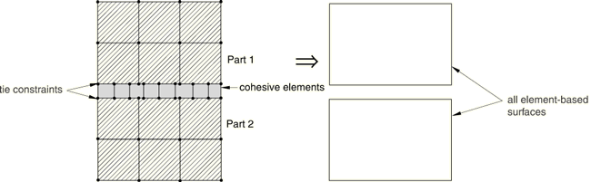
  **图32.5.3-6** 当内聚单元在一侧绑定并在另一侧通过接触相互作用时的默认表面。
  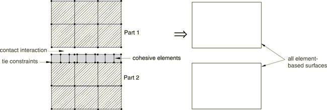
  [图32.5.3-7](pt06ch32s05alm42.md#ecohesive-gencontact4) 显示了当内聚单元的表面也添加到默认表面时的情况。Abaqus/Explicit 自动生成接触排除，以便通用接触算法避免考虑内聚单元底面与 Part 2 顶面之间的接触，因为这些表面绑定在一起。
  **图32.5.3-7** 当内聚单元在一侧绑定并在另一侧通过接触相互作用时，内聚单元的顶面和底面以及默认表面。
  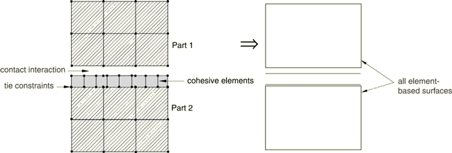

| **输入文件用法：** | 使用以下选项将内聚单元的顶面和底面添加到默认通用接触表面（内聚单元包含在单元集 *COH_ELEMS* 中）： |
| --- | --- |
|  | ``` [*SURFACE](../key/key-link.md#usb-kws-msurface), NAME=*DEFAULT_PLUS_COH* , *COH_ELEMS*, [*CONTACT](../key/key-link.md#usb-kws-hcontact) [*CONTACT INCLUSIONS](../key/key-link.md#usb-kws-hcontactinclusions) *DEFAULT_PLUS_COH*, ``` |

| **Abaqus/CAE 用法：** | 除 Sketch、Job 和 Visualization 之外的任何模块：****工具****表面****创建****：**名称：***default_plus_coh*：在视口中选择面 |
| --- | --- |
|  | 相互作用模块：**创建相互作用**：**通用接触（Explicit）**：**包含的表面对：选择的表面对：编辑**，选择左侧列中的表面，然后点击中间的箭头将它们转移到包含对的列表中 |
- 对于 Abaqus/Explicit 中的通用接触，另一种模拟周围结构之间接触的方法是仅在内聚单元完全退化并从模型中删除时才激活接触（参见 ["使用牵引-分离描述定义内聚单元的本构响应" 第32.5.6节中的"最大退化和单元去除选择"](pt06ch32s05alm45.md#usb-elm-ecohesivebehavior-deletion)）。对于这种方法，内聚单元必须与相邻单元共享节点，通用接触定义必须包括内聚单元顶面和底面上的表面，如图 [图32.5.3-8](pt06ch32s05alm42.md#ecohesive-gencontact5) 所示。由于内聚单元的每个表面面直接与相邻单元的表面面对立，当两个父单元都活跃时，通用接触算法不会认为这些面是活跃的。但是，如果内聚单元失效，相反的表面面变得活跃。
| **输入文件用法：** | 使用以下选项将内聚单元的顶面和底面包含在通用接触定义中（内聚单元包含在单元集 *COH_ELEMS* 中）： |
| --- | --- |
|  | ``` [*SURFACE](../key/key-link.md#usb-kws-msurface), NAME=*gc_surf* , *COH_ELEMS*, [*CONTACT](../key/key-link.md#usb-kws-hcontact) [*CONTACT INCLUSIONS](../key/key-link.md#usb-kws-hcontactinclusions) *gc_surf*, ``` |

| **Abaqus/CAE 用法：** | 除 Sketch、Job 和 Visualization 之外的任何模块：****工具****表面****创建****：**名称：***gc_surf*：在视口中选择面 |
| --- | --- |
|  | 相互作用模块：**创建相互作用**：**通用接触（Explicit）**：**包含的表面对：选择的表面对：编辑**，选择左侧列中的表面，然后点击中间的箭头将它们转移到包含对的列表中 |

**图32.5.3-8** 当内聚单元包含在表面定义中并使用侵蚀时，参与通用接触的表面。


### Abaqus/Explicit 中的稳定时间增量

Abaqus/Explicit 中内聚单元的稳定时间增量等于应力波穿过内聚层本构厚度  所需的时间 ：

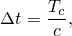

其中 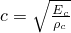 是波速，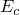 和  分别代表粘合材料的体积刚度和密度。根据波速表达式，稳定时间增量可以写为


对于本构响应根据牵引力与分离定义的情况，牵引力与分离关系的斜率为 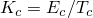，密度指定为单位面积质量而非单位体积质量：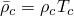（有关此问题的更多详细信息，请参见 ["使用牵引-分离描述定义内聚单元的本构响应，" 第32.5.6节"](pt06ch32s05alm45.md)）。因此，对于牵引-分离，时间增量的表达式变为

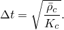

很常见的是，内聚单元的时间增量将显著小于模型中其他单元的时间增量，除非您采取一些行动来改变影响时间增量的因素之一。这需要您进行一些判断。以下讨论为控制不同材料响应定义方法的时间增量提供了一些建议。但是，在某些应用中，Abaqus/Standard 可能更可取，因为需要模拟薄而硬的内聚层而无需近似。

#### 本构响应使用连续体或单轴应力状态方法定义

对于使用连续体或单轴应力状态方法定义的本构响应，内聚单元与其他单元的稳定时间增量之比为

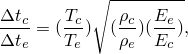

其中下标"c"和"e"分别代表内聚单元和周围单元。内聚层的厚度通常小于模型中其他单元的特征长度，因此量  通常很小。根号下的量将取决于所涉及的材料。对于钢组件之间的环氧粘合剂，根号下的量约为 unity。可以通过以下方式增加内聚单元的稳定时间增量：
- 人为增加本构厚度 ；
- 增加密度 ；
- 降低刚度 ；或
- 以上选项的某种组合。

在许多情况下，最有吸引力的选择是增加密度，这也称为质量缩放（["质量缩放，" 第11.6.1节"](pt04ch11s06aus74.md)）。但是，如果内聚区的厚度非常小，为达到合理的时间增量所需的质量缩放可能会显著影响结果。在这种情况下，除了进行一些质量缩放外，可能还需要人为降低内聚刚度。这种方法涉及使用可能与界面测量刚度不同的刚度；但是，如果峰值强度和断裂能保持不变，在许多情况下整体响应不会受到显著影响。

#### 本构响应使用牵引-分离描述定义

对于使用牵引-分离描述定义的本构响应，内聚单元与其他单元的稳定时间增量之比为

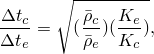

其中下标"c"和"e"分别代表内聚单元和周围单元。

确保内聚单元不会对稳定时间增量产生不利影响的一种方法是选择材料属性使得 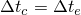，这意味着


例如，如果选择每单位面积的内聚单元刚度和密度使得

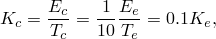


其中  表示相邻非内聚单元的特征长度。通过选择 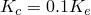，内聚层相对于周围单元的刚度将与 Abaqus/Explicit 中惩罚接触使用的默认刚度相似（相对于周围单元的等效一维刚度）。这种方法涉及使用可能与界面测量刚度不同的刚度；但是，如果峰值强度和断裂能保持不变，在许多情况下整体响应不会受到显著影响。

### Abaqus/Standard 中的收敛问题

在许多问题中，内聚单元建模为经历导致失效的渐进损伤。渐进损伤的建模涉及材料响应中的软化，这已知会导致隐式求解程序（如 Abaqus/Standard）中的收敛困难。在不稳定裂纹扩展期间，当可用能量高于材料的断裂韧性时，也可能发生收敛困难。有几种方法可用于帮助避免这些收敛问题。

#### 使用粘性正则化

Abaqus/Standard 提供了粘性正则化功能，有助于改善此类问题的收敛。此功能在 ["在 Abaqus/Standard 中的内聚单元、连接单元和可与渐进损伤演化模型一起使用的单元中使用粘性正则化" 第27.1.4节"section controls"](pt06ch27s01aus113.md#usb-elm-esectioncontrol-viscosity) 和 ["在 Abaqus/Standard 中使用粘性正则化" 第32.5.6节"使用牵引-分离描述定义内聚单元的本构响应"](pt06ch32s05alm45.md#usb-elm-ecohesivebehavior-regularize) 中详细讨论。

#### 使用自动稳定

帮助收敛行为的另一种方法是使用自动稳定（参见 ["静态应力分析，" 第6.2.2节"](pt03ch06s02at01.md) 和 ["求解非线性问题，" 第7.1.1节"](pt03ch07s01aus49.md)，了解更多详情），这在问题由于局部不稳定而不稳定时很有用。一般来说，如果使用足够的粘性正则化（通过粘性系数测量——参见 ["在 Abaqus/Standard 中使用粘性正则化" 第32.5.6节"使用牵引-分离描述定义内聚单元的本构响应"](pt06ch32s05alm45.md#usb-elm-ecohesivebehavior-regularize)，了解更多详情），则不需要使用自动稳定技术。在使用少量或不使用粘性正则化的问题中，自动稳定将改善收敛特性。

#### 使用非默认求解控制

使用非默认求解控制（参见 ["常用控制参数，" 第7.2.2节"](pt03ch07s02aus50.md) 和 ["非线性问题的收敛准则，" 第7.2.3节"](pt03ch07s02aus51.md)，了解更多详情）以及激活线搜索技术（["通过使用线搜索算法提高求解效率" 第7.2.3节"非线性问题的收敛准则"](pt03ch07s02aus51.md#usb-anl-aconvergcriteria-linesearch)）可能有助于提高求解效率。


