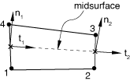
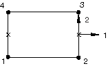

# 32.5.4 定义内聚单元的初始几何


**产品：** Abaqus/Standard  Abaqus/Explicit  Abaqus/CAE  

##### **参考资料**

- ["内聚单元：概述，" 第32.5.1节](pt06ch32s05abo29.md)
- [Abaqus/CAE 用户指南第21章，"粘合接头和粘合接口"](../usi/usi-link.md#usi-adv-cohesive)

### 概述

内聚单元的初始几何由以下定义：
- 由单元的节点连通性以及这些节点的位置；
- 由堆叠方向定义，可用于独立于节点连通性指定内聚单元的顶面和底面；以及
- 由初始本构厚度的幅值定义，可以对应于由节点位置和堆叠方向所暗示的几何厚度，也可以直接指定。

### 定义单元连通性

内聚单元的连通性与连续体单元的连通性类似；但是，将内聚单元视为由两个面（底面和顶面）组成会更方便，它们由内聚区厚度分隔。该单元在其底面上有节点，在其顶面上有相应的节点。孔隙压力内聚单元在间隙内部包含第三个中间面，用于模拟单元内的流体流动。

有三种方法可用于定义单元连通性。

#### 直接定义单元的完整连通性

可以直接给出内聚单元的完整连通性（参见 ["单元定义中的"定义内聚单元"，第2.2.1节"](pt01ch02s02aus11.md#usb-int-ielement-cohesive)）。

#### 通过定义底面单元连通性和整数偏移量

或者，您可以指定底面的连通性加上一个正整数偏移量（参见 ["单元定义中的"定义内聚单元"，第2.2.1节"](pt01ch02s02aus11.md#usb-int-ielement-cohesive)），该偏移量将用于确定剩余的内聚单元节点。

| **输入文件用法：** | ``` [*ELEMENT](../key/key-link.md#usb-kws-melement), OFFSET=*n* ``` |
| --- | --- |

| **Abaqus/CAE 用法：** | Abaqus/CAE 不支持单元偏移量。 |
| --- | --- |

##### 与位移内聚单元一起使用

整数偏移量将用于定义内聚单元顶面的节点编号。除非顶面的节点已通过节点定义直接分配了坐标（["节点定义，" 第2.1.1节"](pt01ch02s01aus05.md)），否则 Abaqus 将自动将顶面的节点定位为与底面的节点重合。

##### 与孔隙压力-位移内聚单元一起使用

当您仅定义底面节点时，整数偏移量将首先用于定义内聚单元顶面的节点编号，顶面节点的编号相对于底面节点编号偏移。整数偏移量将再次用于定义中间面节点编号的偏移，中间面节点的编号相对于顶面节点编号偏移。除非顶面的节点已通过节点定义直接分配了坐标（["节点定义，" 第2.1.1节"](pt01ch02s01aus05.md)），否则 Abaqus 将自动将顶面和中间面的节点定位为与底面的节点重合。

#### 通过定义底面和顶面单元连通性以及整数偏移量

对于孔隙压力内聚单元，您还可以指定底面和顶面的连通性加上一个正整数偏移量（参见 ["单元定义中的"定义内聚单元"，第2.2.1节"](pt01ch02s02aus11.md#usb-int-ielement-cohesive)），该偏移量将用于确定中间面内聚单元节点。

当您定义底面和顶面节点时，整数偏移量将用于定义中间面的节点编号，中间面节点的编号相对于底面节点编号偏移。除非中间面的节点已通过节点定义直接分配了坐标（["节点定义，" 第2.1.1节"](pt01ch02s01aus05.md)），否则 Abaqus 将自动将中间面的节点定位为位于底面和顶面节点的中点。

| **输入文件用法：** | ``` [*ELEMENT](../key/key-link.md#usb-kws-melement), OFFSET=*n* ``` |
| --- | --- |

| **Abaqus/CAE 用法：** | Abaqus/CAE 不支持单元偏移量。 |
| --- | --- |

### 指定二维单元的平面外厚度

对于二维内聚单元，需要平面外厚度。您可以在内聚截面定义中指定此附加信息；默认值为 1.0。

| **输入文件用法：** | ``` [*COHESIVE SECTION](../key/key-link.md#usb-kws-mcohesivesection) *first data line* *out-of-plane thickness* ``` |
| --- | --- |

| **Abaqus/CAE 用法：** | 属性模块：内聚截面编辑器：切换开关**平面外厚度：**并指定平面外厚度 |
| --- | --- |

### 指定本构厚度

您可以直接指定内聚单元的本构厚度，或者让 Abaqus 根据节点坐标计算它，使本构厚度等于几何厚度。默认行为取决于应用的性质。

如果内聚单元的几何厚度相对于其表面尺寸非常小，则从节点坐标计算的厚度可能不准确。在这种情况下，您可以在定义这些单元的截面属性时直接指定恒定厚度。

内聚单元的特征单元长度等于其本构厚度。特征单元长度在定义材料损伤演化时通常很有用（参见 ["渐进损伤和失效" 中的"网格依赖性"，第24.1.1节"](pt05ch24s01abo21.md#usb-mat-cdamageoverview-meshdep)）。

#### 当内聚单元响应基于连续体方法时

当内聚单元的响应基于连续体方法时，默认情况下，本构厚度由 Abaqus 根据节点坐标计算。您可以通过直接指定本构厚度来覆盖此默认值。

| **输入文件用法：** | 使用以下选项让 Abaqus 根据节点坐标计算厚度： |
| --- | --- |
|  | ``` [*COHESIVE SECTION](../key/key-link.md#usb-kws-mcohesivesection), RESPONSE=CONTINUUM, THICKNESS=GEOMETRY (default) ``` 使用以下选项直接指定厚度： ``` [*COHESIVE SECTION](../key/key-link.md#usb-kws-mcohesivesection), RESPONSE=CONTINUUM, THICKNESS=SPECIFIED *thickness (1.0 by default)* ``` |

| **Abaqus/CAE 用法：** | 属性模块：内聚截面编辑器：**响应**：**连续体**：**初始厚度**：**使用节点坐标**、**指定**：*thickness* 或**使用分析默认值** |
| --- | --- |

#### 当内聚单元响应基于牵引-分离方法时

当内聚单元的响应基于牵引-分离方法时，Abaqus 默认假定本构厚度等于一。此默认值的动机是，对于牵引-分离本构响应适用的那类应用，内聚单元的几何厚度通常等于（或非常接近）零。此默认选择确保标称应变等于相对分离位移（有关详细信息，请参见 ["使用牵引-分离描述定义内聚单元的本构响应，" 第32.5.6节"](pt06ch32s05alm45.md)）。您可以通过指定另一个值或指定本构厚度应等于几何厚度来覆盖此默认值。

| **输入文件用法：** | 使用以下选项直接指定厚度： |
| --- | --- |
|  | ``` [*COHESIVE SECTION](../key/key-link.md#usb-kws-mcohesivesection), RESPONSE=TRACTION SEPARATION, THICKNESS=SPECIFIED (default) *thickness (1.0 by default)* ``` 使用以下选项让 Abaqus 根据节点坐标计算厚度： ``` [*COHESIVE SECTION](../key/key-link.md#usb-kws-mcohesivesection), RESPONSE=TRACTION SEPARATION, THICKNESS=GEOMETRY ``` |

| **Abaqus/CAE 用法：** | 属性模块：内聚截面编辑器：**响应**：**牵引分离**：**初始厚度**：**指定**：*thickness*、**使用分析默认值**或**使用节点坐标** |
| --- | --- |

#### 当内聚单元响应基于单轴应力状态时

当内聚单元的响应基于单轴应力状态时，没有计算本构厚度的默认方法。您必须指明确定本构厚度的方法的选择。

| **输入文件用法：** | 使用以下选项指定厚度： |
| --- | --- |
|  | ``` [*COHESIVE SECTION](../key/key-link.md#usb-kws-mcohesivesection), RESPONSE=GASKET, THICKNESS=SPECIFIED *thickness (1.0 by default)* ``` 使用以下选项让 Abaqus 根据节点坐标计算厚度： ``` [*COHESIVE SECTION](../key/key-link.md#usb-kws-mcohesivesection), RESPONSE=GASKET, THICKNESS=GEOMETRY ``` |

| **Abaqus/CAE 用法：** | 属性模块：内聚截面编辑器：**响应**：**垫片**：**初始厚度**：**指定**：*thickness* 或**使用节点坐标** |
| --- | --- |

### 单元厚度方向定义

正确内聚单元的方向很重要，因为单元在厚度方向和面内方向的行为不同。默认情况下，三维内聚单元的顶面和底面如图 [图32.5.4-1](pt06ch32s05alm43.md#ecohesive-3d-stackori) 所示，二维和轴对称内聚单元的顶面和底面如图 [图32.5.4-2](pt06ch32s05alm43.md#ecohesive-2d-stackori) 所示。以下将讨论覆盖内聚单元默认方向的选择以及局部厚度方向和面内方向向量如何建立的解释。

**图32.5.4-1** 三维内聚单元的默认厚度方向。


**图32.5.4-2** 二维和轴对称内聚单元的默认厚度方向。


#### 将堆叠方向设置为等参方向

"堆叠方向"是指内聚单元的顶面和底面堆叠所在的等参方向。默认情况下，在三维内聚单元中，顶面和底面沿第三个等参方向堆叠；在二维和轴对称内聚单元中，沿第二个等参方向堆叠。您可以选择沿备用等参方向堆叠顶面和底面，适用于大多数单元类型（COH3D6 单元只能以第三个等参方向作为堆叠方向）。等参方向的选择取决于单元连通性。对于与网格无关的规范，请使用如下所述的基于方向的方法。三维内聚单元的等参方向选择如图 [图32.5.4-3](pt06ch32s05alm43.md#ecohesive-scon-stackdir) 所示。

**图32.5.4-3** COH3D8（左）和 COH3D6（右）单元的堆叠方向。


| **输入文件用法：** | 使用以下选项基于单元的等参方向定义单元顶面和底面： |
| --- | --- |
|  | ``` [*COHESIVE SECTION](../key/key-link.md#usb-kws-mcohesivesection), STACK DIRECTION=*n* ``` |

| **Abaqus/CAE 用法：** | 您不能在 Abaqus/CAE 中基于等参方向定义堆叠方向。堆叠方向将对应于上面讨论的默认值。 |
| --- | --- |

#### 基于用户定义的方向设置堆叠方向

您还可以通过用户定义的局部方向（["方向，" 第2.2.5节"](pt01ch02s02aus15.md)）来控制堆叠方向的方向。当您为内聚单元定义方向时，您还指定一个轴，局部1和2材料方向可围绕该轴旋转。该轴还定义了近似法线方向。堆叠方向将是与该近似法线最接近的单元等参方向（参见 [图32.5.4-4](pt06ch32s05alm43.md#ecohesive-stackori)）。

**图32.5.4-4** 说明使用圆柱系统定义堆叠方向的示例。


| **输入文件用法：** | 使用以下选项基于用户定义的方向定义单元厚度方向： |
| --- | --- |
|  | ``` [*COHESIVE SECTION](../key/key-link.md#usb-kws-mcohesivesection), STACK DIRECTION=ORIENTATION, ORIENTATION=*name* ``` |

| **Abaqus/CAE 用法：** | 您不能在 Abaqus/CAE 中基于方向定义堆叠方向。堆叠方向将对应于上面讨论的默认值。 |
| --- | --- |

#### 验证堆叠方向

在 Abaqus/CAE 中，可以使用堆叠方向查询工具直观验证堆叠方向（参见 ["理解查询工具集的作用，" Abaqus/CAE 用户指南第71.1节"](pt06ch71s01aus155.md)）。对于三维单元，Abaqus/CAE 将顶面着色为紫色，底面着色为棕色。对于二维和轴对称单元，箭头指示单元的方向。此外，Abaqus/CAE 高亮显示任何具有不一致方向的单元面和边缘。

或者，可以在 Abaqus/CAE 的 Visualization 模块中绘制材料轴，以验证3轴是否指向三维单元的期望法线方向；如果单元方向不当，则其中一个面内轴（1轴或2轴）将指向法线方向。对于二维和轴对称单元，堆叠方向与2轴材料方向一致。

#### 二维和轴对称单元的厚度方向计算

为了计算二维和轴对称单元的厚度方向，Abaqus 通过平均形成单元底面和顶面的节点对的坐标来形成中面。此中面穿过单元的积分点，对于底面和顶面的默认选择，如图 [图32.5.4-5](pt06ch32s05alm43.md#ecohesive-2d-axi-normal) 所示。对于每个积分点，Abaqus 计算由底面和顶面上给出的节点序列定义的切线方向。厚度方向然后通过平面外方向和切线方向的叉乘获得。

**图32.5.4-5** 二维或轴对称单元的厚度方向。



#### 三维单元的厚度方向计算

为了计算三维单元的厚度方向，Abaqus 通过平均形成单元底面和顶面的节点对的坐标来形成中面。此中面穿过单元的积分点，对于底面和顶面的默认选择，如图 [图32.5.4-6](pt06ch32s05alm43.md#ecohesive-3d-normal) 所示。Abaqus 将厚度方向计算为每个积分点处中面的法线；正方向通过使用右手定则绕单元底面或顶面上的节点获得。

**图32.5.4-6** 三维单元的厚度方向。


### 积分点处的局部方向

Abaqus 在每个积分点计算默认局部方向。局部方向用于输出描述内聚单元当前变形状态的所有量的详细信息。对于具有两个与三个局部方向的内聚单元，局部方向的详细信息将在下文分别讨论。

#### 二维和轴对称内聚单元的局部方向

二维和轴对称内聚单元的局部2方向对应于厚度方向，如上文 ["单元厚度方向定义"](pt06ch32s05alm43.md#usb-elm-ecohesiveinit-thickdir) 中讨论的那样计算。局部1方向定义使得局部1和2方向的叉乘给出平面外方向（参见 [图32.5.4-7](pt06ch32s05alm43.md#ecohesive-2d-axi-local-dir)）。对于给定堆叠方向，您不能修改这些单元的任一局部方向。这些单元的横向剪切行为在1-2平面中定义。

**图32.5.4-7** 二维和轴对称内聚单元的局部方向。



#### 三维内聚单元的局部方向

三维内聚单元的局部3方向对应于厚度方向，如上文 ["单元厚度方向定义"](pt06ch32s05alm43.md#usb-elm-ecohesiveinit-thickdir) 中讨论的那样计算，对于给定堆叠方向不能修改。局部1和2方向垂直于厚度方向，默认情况下由表面上局部方向的 Abaqus 标准约定定义（["约定，" 第1.2.2节"](pt01ch01s02aus02.md)）。三维内聚单元的默认局部方向如图 [图32.5.4-8](pt06ch32s05alm43.md#ecohesive-3d-local-dir) 所示。

**图32.5.4-8** 三维内聚单元的局部方向。


对于这些单元，横向剪切行为在局部1-3和2-3平面中定义。您可以使用局部方向定义（["方向，" 第2.2.5节"](pt01ch02s02aus15.md)）修改垂直于厚度方向的平面中三维内聚单元的局部1和2方向。

| **输入文件用法：** | ``` [*COHESIVE SECTION](../key/key-link.md#usb-kws-mcohesivesection), ELSET=*name*, ORIENTATION=*name* ``` |
| --- | --- |

| **Abaqus/CAE 用法：** | 属性模块：****分配****材料方向****：选择区域：选择方向 |
| --- | --- |


