# 32.5.6 使用牵引-分离描述定义内聚单元的本构响应


**产品：** Abaqus/Standard  Abaqus/Explicit  Abaqus/CAE  

##### **参考资料**

- ["内聚单元：概述，" 第32.5.1节](pt06ch32s05abo29.md)
- ["使用连续体方法定义内聚单元的本构响应，" 第32.5.5节](pt06ch32s05alm44.md)
- [*COHESIVE SECTION](../key/key-link.md#usb-kws-mcohesivesection)
- [*DAMAGE EVOLUTION](../key/key-link.md#usb-kws-mdamageevolution)
- [*DAMAGE INITIATION](../key/key-link.md#usb-kws-mdamageinitiation)
- ["定义损伤，" Abaqus/CAE 用户指南第12.9.3节](../usi/usi-link.md#usi-prp-mechanical-damage)
- [Abaqus/CAE 用户指南第21章，"粘合接头和粘合接口"](../usi/usi-link.md#usi-adv-cohesive)

### 概述

本节描述的功能主要用于界面厚度可以忽略不计的粘合界面。在这种情况下，可以直接根据牵引力与分离的关系来定义内聚层的本构响应，这可能很简单。如果界面粘合剂层具有有限厚度，并且可以获得粘合材料的宏观特性（如刚度和强度），则使用常规材料模型对响应进行建模可能更合适。本节讨论前一种方法，而后一种方法在 ["使用连续体方法定义内聚单元的本构响应，" 第32.5.5节"](pt06ch32s05alm44.md) 中讨论。

直接根据牵引-分离定律定义的内聚行为：
- 可用于直接根据牵引力与分离的关系来模拟复合材料中的界面剥离；
- 允许指定材料数据，如作为界面法向与剪切变形（模式混合）比率函数的断裂能；
- 假定在损伤前是线性弹性牵引-分离定律；
- 可与 Abaqus/Explicit 中的线性粘弹性结合使用（["Abaqus/Explicit 中牵引-分离弹性的粘弹性行为定义" 第22.7.1节"时域粘弹性"](pt05ch22s07abm12.md#usb-mat-ctimevisco-cohesive)）来描述率相关剥离行为；
- 假定单元的失效以材料刚度的渐进降解为特征，这由损伤过程驱动；
- 允许多个损伤机制；以及
- 可与 Abaqus/Standard 中的用户子程序 [`UMAT`](../sub/sub-link.md#sub-xsl-umat) 或 Abaqus/Explicit 中的 [`VUMAT`](../sub/sub-link.md#sub-xsl-vumat) 结合使用，以指定用户定义的牵引-分离定律。

### 根据牵引-分离定律定义本构响应

要直接根据牵引力与分离的关系定义内聚单元的本构响应，您需要在定义内聚单元的截面行为时选择牵引-分离响应。

| **输入文件用法：** | ``` [*COHESIVE SECTION](../key/key-link.md#usb-kws-mcohesivesection), RESPONSE=TRACTION SEPARATION ``` |
| --- | --- |

| **Abaqus/CAE 用法：** | 属性模块：**创建截面**：选择**其他**作为截面**类别**和**内聚**作为截面**类型**：**响应**：**牵引分离** |
| --- | --- |

### 线性弹性牵引-分离行为

Abaqus 中可用的牵引-分离模型假定初始线性弹性行为（参见 ["内聚单元的弹性定义" 第22.2.1节"线性弹性行为"](pt05ch22s02abm02.md#usb-mat-clinearelastic-traction)），然后是损伤的起始和演化。弹性行为以本构矩阵的形式编写，该矩阵将界面上的标称应力与标称应变联系起来。标称应力是力分量除以每个积分点处的原始面积，而标称应变是分离除以每个积分点处的原始厚度。如果指定了牵引-分离响应，默认的本构厚度值为 1.0，这确保标称应变等于分离（即顶面和底面的相对位移）。用于牵引-分离响应的本构厚度通常与几何厚度不同（通常接近或等于零）。有关如何修改本构厚度的讨论，请参见 ["定义内聚单元的初始几何" 第32.5.4节中的"指定本构厚度"](pt06ch32s05alm43.md#usb-elm-ecohesiveinit-thickmag)。

标称牵引应力向量  由三个分量（二维问题中为两个分量）组成：、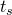 和（三维问题中），它们分别表示法向（沿三维的局部3方向和二维的局部2方向）和两个剪切牵引（沿三维的局部1和2方向以及二维的局部1方向）。相应的分离表示为 、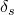 和 。用  表示内聚单元的原始厚度，标称应变可以定义为


然后弹性行为可以写为

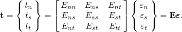

弹性矩阵提供了牵引向量和分离向量所有分量之间的完全耦合行为，并且可以依赖于温度和/或场变量。如果您希望在法向和剪切分量之间实现解耦行为，请将弹性矩阵中的非对角项设置为零。

可选地，对于解耦牵引行为，可以指定压缩因子；这确保压缩刚度等于指定因子乘以拉伸刚度 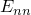。此因子仅影响法向分离牵引响应；剪切行为不受影响。

| **输入文件用法：** | 使用以下选项定义解耦牵引-分离行为： |
| --- | --- |
|  | ``` [*ELASTIC](../key/key-link.md#usb-kws-melastic), TYPE=TRACTION ``` 使用以下选项定义带压缩因子的解耦牵引-分离行为： ``` [*ELASTIC](../key/key-link.md#usb-kws-melastic), TYPE=TRACTION, COMPRESSION FACTOR=*f* ``` 使用以下选项定义耦合牵引-分离行为： ``` [*ELASTIC](../key/key-link.md#usb-kws-melastic), TYPE=COUPLED TRACTION ``` |

| **Abaqus/CAE 用法：** | 使用以下选项定义解耦牵引-分离行为： |
| --- | --- |
|  | 属性模块：材料编辑器：****机械****弹性****弹性****：**类型**：**牵引** 使用以下选项定义耦合牵引-分离行为：属性模块：材料编辑器：****机械****弹性****弹性****：**类型**：**耦合牵引** Abaqus/CAE 不支持为解耦牵引-分离行为指定压缩因子。 |

### 材料参数的解释

通过研究表示长度为 *L*、弹性刚度为 *E*、原始面积为 *A* 的桁架由于轴向载荷 *P* 而变形的方程，可以更好地理解牵引-分离模型的材料参数（如界面弹性刚度）：


该方程可以重写为


其中 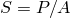 是标称应力，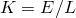 是将标称应力与位移联系起来的刚度。同样，桁架的总质量，假设密度为 ，由下式给出：


上述方程表明，如果适当重新解释刚度和密度，则可以用 1.0 替换实际长度 *L*（以确保应变与位移相同）。特别是，刚度为 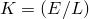，密度为 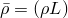，其中使用了桁架的真实长度。这些方程中的密度表示单位面积质量而非单位体积质量。

这些概念可以应用于初始厚度为  的内聚层。如果粘合材料具有刚度  和密度 ，则界面的刚度（将标称牵引与标称应变联系起来）由 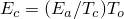 给出，界面的密度由  给出。如前所述，用于根据牵引力与分离关系建模响应的本构厚度  的默认选择为 1.0，无论内聚层的实际厚度如何。有了这个选择，标称应变等于相应的分离。当内聚层的本构厚度"人为地"设置为 1.0 时，理想情况下，您应该指定  和（如需要） 作为材料刚度和密度，分别使用内聚层的真实厚度计算。

上述公式为根据体积粘合剂材料的材料特性估算建模界面牵引-分离行为所需的参数提供了一种方法。当界面层厚度趋于零时，上述方程意味着刚度  趋于无穷大，密度  趋于零。这个刚度通常被选为惩罚参数。非常大的惩罚刚度对 Abaqus/Explicit 中的稳定时间增量有害，并可能导致 Abaqus/Standard 中单元算子的病态。 关于为 Abaqus/Explicit 分析选择界面的刚度和密度以使稳定时间增量不受不利影响的建议，请参见 ["使用内聚单元建模" 第32.5.3节中的"Abaqus/Explicit 中的稳定时间增量"](pt06ch32s05alm42.md#usb-elm-ecohesiveusage-stabletime)。

### 在 Abaqus/Explicit 中建模率相关牵引-分离行为

时域粘弹性可用于 Abaqus/Explicit 中对具有牵引-分离弹性的内聚单元进行率相关行为建模。法向和两个剪切标称牵引的演化方程采用以下形式：

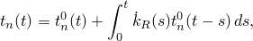

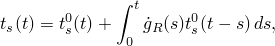


其中 、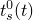 和  分别是时间 *t* 时法向和两个局部剪切方向中的瞬时标称牵引。函数  和  分别表示无量纲剪切和法向松弛模量。更多详细信息和用法信息请参见 ["Abaqus/Explicit 中牵引-分离弹性的粘弹性行为定义" 第22.7.1节"时域粘弹性"](pt05ch22s07abm12.md#usb-mat-ctimevisco-cohesive)。

您还可以将时域粘弹性与下一节中描述的渐进损伤和失效模型相结合。这种组合允许在初始弹性响应（损伤起始之前）期间以及损伤演化期间对率相关行为进行建模。

### 损伤建模

Abaqus/Standard 和 Abaqus/Explicit 都允许对响应根据牵引-分离定义的內聚层中的渐进损伤和失效进行建模。相比之下，只有 Abaqus/Explicit 允许对使用常规材料建模的内聚单元进行渐进损伤和失效建模（["使用连续体方法定义内聚单元的本构响应，" 第32.5.5节"](pt06ch32s05alm44.md)）。牵引-分离响应的损伤在与常规材料相同的通用框架内定义（参见 ["渐进损伤和失效，" 第24.1.1节"](pt05ch24s01abo21.md)）。这个通用框架允许同时作用于同一材料的几个损伤机制的组合。每个失效机制包括三个要素：损伤起始准则、损伤演化定律，以及在达到完全损伤状态时选择单元去除（或删除）。虽然这个通用框架对牵引-分离响应和常规材料是相同的，但如何定义各个要素的许多细节是不同的。因此，牵引-分离响应的损伤建模详细信息将在下文给出。

内聚单元的初始响应假定为如上所述的线性响应。但是，一旦满足损伤起始准则，材料损伤可以根据用户定义的损伤演化定律发生。[图32.5.6-1](pt06ch32s05alm45.md#ecohesive-traction-separation) 显示了具有失效机制的典型牵引-分离响应。如果指定了损伤起始准则而没有相应的损伤演化模型，Abaqus 将仅出于输出目的评估损伤起始准则；对内聚单元的响应没有影响（即不会发生损伤）。内聚层在纯压缩下不会发生损伤。

**图32.5.6-1** 典型牵引-分离响应。


### 损伤起始

顾名思义，损伤起始指的是材料点响应开始降解的过程。当应力和/或应变满足您指定的某些损伤起始准则时，降解过程开始。有几种损伤起始准则可用，将在下面讨论。每个损伤起始准则也有一个相关的输出变量来指示是否满足准则。值为 1 或更高表示已满足起始准则（有关详细信息，请参见 ["输出"](pt06ch32s05alm45.md#usb-elm-ecohesivebehavior-output)"）。没有相关演化定律的损伤起始准则仅影响输出。因此，您可以使用这些准则来评估材料发生损伤的倾向，而无需实际模拟损伤过程（即，无需实际指定损伤演化）。

在下面的讨论中，、 和  分别表示当变形分别为纯粹垂直于界面或纯粹沿第一或第二剪切方向时的标称应力峰值。同样，、 和 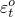 分别表示当变形分别为纯粹垂直于界面或纯粹沿第一或第二剪切方向时的标称应变峰值。具有初始本构厚度 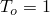，标称应变分量等于相应相对位移分量——、 和 ——在内聚层的顶面和底面之间。下面讨论中使用的符号 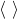 表示 Macaulay 括号，其通常的解释。Macaulay 括号用于表示纯压缩变形或应力状态不会引发损伤。

#### 最大标称应力准则

当最大标称应力比（如下式定义）达到 1 时，假定损伤开始。该准则可以表示为

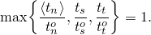

| **输入文件用法：** | ``` [*DAMAGE INITIATION](../key/key-link.md#usb-kws-mdamageinitiation), CRITERION=MAXS ``` |
| --- | --- |

| **Abaqus/CAE 用法：** | 属性模块：材料编辑器：****机械****牵引-分离定律损伤****Maxs 损伤**** |
| --- | --- |

#### 最大标称应变准则

当最大标称应变比（如下式定义）达到 1 时，假定损伤开始。该准则可以表示为

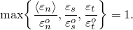

| **输入文件用法：** | ``` [*DAMAGE INITIATION](../key/key-link.md#usb-kws-mdamageinitiation), CRITERION=MAXE ``` |
| --- | --- |

| **Abaqus/CAE 用法：** | 属性模块：材料编辑器：****机械****牵引-分离定律损伤****Maxe 损伤**** |
| --- | --- |

#### 二次标称应力准则

当涉及标称应力比的二次相互作用函数（如下式定义）达到 1 时，假定损伤开始。该准则可以表示为


| **输入文件用法：** | ``` [*DAMAGE INITIATION](../key/key-link.md#usb-kws-mdamageinitiation), CRITERION=QUADS ``` |
| --- | --- |

| **Abaqus/CAE 用法：** | 属性模块：材料编辑器：****机械****牵引-分离定律损伤****Quads 损伤**** |
| --- | --- |

#### 二次标称应变准则

当涉及标称应变比的二次相互作用函数（如下式定义）达到 1 时，假定损伤开始。该准则可以表示为

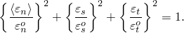

| **输入文件用法：** | ``` [*DAMAGE INITIATION](../key/key-link.md#usb-kws-mdamageinitiation), CRITERION=QUADE ``` |
| --- | --- |

| **Abaqus/CAE 用法：** | 属性模块：材料编辑器：****机械****牵引-分离定律损伤****Quade 损伤**** |
| --- | --- |

### 损伤演化

损伤演化定律描述了一旦达到相应的起始准则，材料刚度降解的速率。描述体积材料（与使用内聚单元建模的界面相反）损伤演化的通用框架在 ["延性金属的损伤演化和单元去除，" 第24.2.3节"](pt05ch24s02abm43.md) 中描述。从概念上讲，类似的 ideas 适用于描述具有本构响应的内聚单元的损伤演化，该响应根据牵引力与分离来描述；然而，许多细节是不同的。

标量损伤变量 *D* 表示材料中的整体损伤，并捕获所有 active 机制的组合效果。它最初值为 0。如果对损伤演化进行建模，则 *D* 在损伤起始后的进一步加载过程中单调地从 0 演化到 1。牵引-分离模型的应力分量受损伤影响，遵循


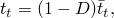

其中 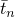、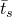 和  是弹性牵引-分离行为预测的当前应变（无损伤）下的应力分量。

为了描述界面法向和剪切变形组合下损伤的演化，引入有效位移（Camanho 和 Davila，2002）是有用的，定义为

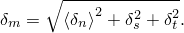

#### 混合模式定义

内聚区变形场的模式混合量化了法向和剪切变形的相对比例。Abaqus 使用三种模式混合度量：两种基于能量，一种基于牵引。您可以在指定损伤演化过程的模式依赖性时选择其中一种。设 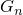、 和  分别为牵引及其在法向、第一和第二剪切方向上的共轭相对位移所做的功，定义 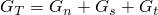，则基于能量的模式混合定义为：

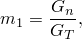


显然，上面定义的三个量中只有两个是独立的。定义量  来表示剪切牵引及其相应相对位移分量所做的总功的部分也是有用的。如后所述，Abaqus 要求您将与损伤演化相关的材料特性指定为 （或等效地  的函数。

Abaqus 根据变形历史（在积分点处）计算上述能量量 either based on the current state of deformation (nonaccumulative measure of energy) or。前一种方法在混合模式模拟中很有用，其中主要能量耗散机制与内聚区失效产生的新表面有关。这类问题通常利用线弹性断裂力学方法进行适当描述。后一种方法提供了定义模式混合的替代方法，在其他重要耗散机制也决定整体结构响应的情况下可能有用。

基于牵引分量的模式混合的相应定义由下式给出：

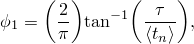


其中 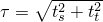 是有效剪切牵引的度量。上述定义中使用的角度度量（在被因子 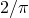 归一化之前）在 [图32.5.6-2](pt06ch32s05alm45.md#ecohesive-mode-mix-traction) 中说明。

**图32.5.6-2** 基于牵引的模式混合度量。

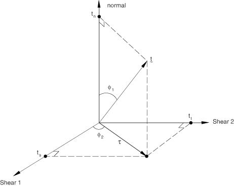

| **输入文件用法：** | 使用以下选项使用基于未累积能量的模式混合定义： |
| --- | --- |
|  | ``` [*DAMAGE EVOLUTION](../key/key-link.md#usb-kws-mdamageevolution), MODE MIX RATIO=ENERGY ``` 使用以下选项使用基于累积能量的模式混合定义： ``` [*DAMAGE EVOLUTION](../key/key-link.md#usb-kws-mdamageevolution), MODE MIX RATIO=ACCUMULATED ENERGY ``` 使用以下选项使用基于牵引的模式混合定义： ``` [*DAMAGE EVOLUTION](../key/key-link.md#usb-kws-mdamageevolution), MODE MIX RATIO=TRACTION ``` |

| **Abaqus/CAE 用法：** | 属性模块：材料编辑器：****机械****牵引-分离定律损伤****Quade 损伤****、**Maxe 损伤**、**Quads 损伤**或**Maxs 损伤**：****子选项****损伤演化****：**模式混合比：**能量**或**牵引** |
| --- | --- |
|  | Abaqus/CAE 不支持指定基于累积能量的模式混合定义。 |

##### 混合模式定义的比较

根据不同能量量和牵引定义的模式混合比 generally 可能会相当不同。以下示例说明了这一点。在能量方面，纯粹法向方向的变形是  和 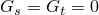 的情况，无论法向和剪切牵引的值如何。特别地，对于具有耦合牵引-分离行为的材料，纯粹法向变形时法向和剪切牵引都可能不为零。在这种情况下，基于能量的模式混合定义将表示纯粹法向变形，而基于牵引的定义将表明法向和剪切变形的混合。

当模式混合基于累积能量时，可能会在混合模式行为中引入人为的路径依赖性，这可能与例如基于线弹性断裂力学的预测不一致。因此，如果界面首先在纯粹法向变形模式下加载，卸载，然后在纯粹剪切变形模式下加载，则基于累积能量在上述变形路径结束时的模式混合比评估为（假设剪切变形仅在局部1方向）为  和 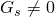。另一方面，基于未累积能量的模式混合比在上述变形路径结束时评估为  和 。

#### 损伤演化定义

损伤演化定义有两个部分。第一部分涉及指定完全失效时的有效位移 ，相对于损伤起始时的有效位移 ）。

**图32.5.6-3** 线性损伤演化。


损伤演化定义的第二个部分是指定损伤变量 *D* 在损伤起始和最终失效之间演化的性质。这可以通过定义线性或指数软化定律来完成，或者将 *D* 直接指定为相对于损伤起始时有效位移的有效位移的表格函数。上述材料数据通常是模式混合、温度和/或场变量的函数。

[图32.5.6-4](pt06ch32s05alm45.md#ecohesive-mixed-mode-response) 是内聚单元在具有各向同性剪切行为的牵引-分离响应中损伤起始和演化对模式混合依赖性的示意图。该图在垂直轴上显示牵引，在两个水平轴上显示法向和剪切分离的大小。两个垂直坐标平面中的无阴影三角形分别表示纯法向和纯剪切变形下的响应。所有中间垂直平面（包含垂直轴）表示具有不同模式混合的混合模式条件下的损伤响应。损伤演化数据对模式混合的依赖性可以以表格形式定义，或者对于基于能量的定义，以解析形式定义。以模式混合函数的形式指定损伤演化数据的方式将在本节后面讨论。

**图32.5.6-4** 内聚单元混合模式响应的说明。


损伤起始后的卸载始终假定沿指向牵引-分离平面原点的线性路径发生，如图 [图32.5.6-3](pt06ch32s05alm45.md#ecohesive-linear-softening) 所示。卸载后的重新加载也沿相同的线性路径发生，直到达到软化包络线（线 AB）。一旦达到软化包络线，进一步的重新加载沿此包络线发生，如 [图32.5.6-3](pt06ch32s05alm45.md#ecohesive-linear-softening) 中的箭头所示。

#### 基于有效位移的演化

您将数量 （即完全失效时的有效位移  相对于损伤起始时的有效位移 ，如图 [图32.5.6-3](pt06ch32s05alm45.md#ecohesive-linear-softening) 所示）指定为模式混合、温度和/或场变量的表格函数。此外，您还可以选择线性或指数软化定律，定义损伤变量 *D* 在损伤起始后和完全失效之间的详细演化（作为超过损伤起始的有效位移的函数）。或者，您可以不使用线性或指数软化，而是直接将损伤变量 *D* 指定为损伤起始后有效位移 ），Abaqus 使用损伤变量 *D* 的演化，在恒定模式混合、温度和场变量下的损伤演化情况下（reduce）简化为 Camanho 和 Davila（2002）提出的表达式，即：

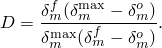

在前面的表达式和所有后续引用中， 指的是在加载历史期间达到的有效位移的最大值。在损伤起始和最终失效之间的材料点上恒定模式混合的假设对于涉及单调损伤（或单调断裂）的问题是常规的。

| **输入文件用法：** | 使用以下选项指定线性损伤演化： |
| --- | --- |
|  | ``` [*DAMAGE EVOLUTION](../key/key-link.md#usb-kws-mdamageevolution), TYPE=DISPLACEMENT, SOFTENING=LINEAR ``` |

| **Abaqus/CAE 用法：** | 属性模块：材料编辑器：****机械****牵引-分离定律损伤****Quade 损伤****、**Maxe 损伤**、**Quads 损伤**或**Maxs 损伤**：****子选项****损伤演化****：**类型**：**位移**：**软化**：**线性** |
| --- | --- |

##### 指数损伤演化

对于指数软化（参见 [图32.5.6-5](pt06ch32s05alm45.md#ecohesive-exponential-softening)），Abaqus 使用损伤变量 *D* 的演化，在恒定模式混合、温度和场变量下的损伤演化情况下简化为

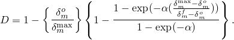

在上面的表达式中， 是定义损伤演化速率的无量纲材料参数， 是指数函数。

**图32.5.6-5** 指数损伤演化。


| **输入文件用法：** | 使用以下选项指定指数软化： |
| --- | --- |
|  | ``` [*DAMAGE EVOLUTION](../key/key-link.md#usb-kws-mdamageevolution), TYPE=DISPLACEMENT, SOFTENING=EXPONENTIAL ``` |

| **Abaqus/CAE 用法：** | 属性模块：材料编辑器：****机械****牵引-分离定律损伤****Quade 损伤****、**Maxe 损伤**、**Quads 损伤**或**Maxs 损伤**：****子选项****损伤演化****：**类型**：**位移**：**软化**：**指数** |
| --- | --- |

##### 表格损伤演化

对于表格软化，您可以直接以表格形式定义 *D* 的演化。*D* 必须指定为相对于损伤起始时有效位移的有效位移、模式混合、温度和/或场变量的函数。

| **输入文件用法：** | 使用以下选项以表格形式直接定义损伤变量： |
| --- | --- |
|  | ``` [*DAMAGE EVOLUTION](../key/key-link.md#usb-kws-mdamageevolution), TYPE=DISPLACEMENT, SOFTENING=TABULAR ``` |

| **Abaqus/CAE 用法：** | 属性模块：材料编辑器：****机械****牵引-分离定律损伤****Quade 损伤****、**Maxe 损伤**、**Quads 损伤**或**Maxs 损伤**：****子选项****损伤演化****：**类型**：**位移**：**软化**：**表格** |
| --- | --- |

#### 基于能量的演化

损伤演化可以根据损伤过程消耗的能量（也称为断裂能）来定义。断裂能等于牵引-分离曲线下的面积（参见 [图32.5.6-3](pt06ch32s05alm45.md#ecohesive-linear-softening)）。您将断裂能指定为材料特性，并选择线性或指数软化行为。Abaqus 确保线性或指数受损响应下的面积等于断裂能。

断裂能对模式混合的依赖性可以直接以表格形式指定，也可以使用如下所述的解析形式指定。当使用解析形式时，模式混合比假定基于能量定义。

##### 表格形式

定义断裂能对模式混合依赖性的最简单方法是直接以表格形式将其指定为模式混合的函数。

| **输入文件用法：** | 使用以下选项以表格形式指定断裂能作为模式混合的函数： |
| --- | --- |
|  | ``` [*DAMAGE EVOLUTION](../key/key-link.md#usb-kws-mdamageevolution), TYPE=ENERGY, MIXED MODE BEHAVIOR=TABULAR ``` |

| **Abaqus/CAE 用法：** | 属性模块：材料编辑器：****机械****牵引-分离定律损伤****Quade 损伤****、**Maxe 损伤**、**Quads 损伤**或**Maxs 损伤**：****子选项****损伤演化****：**类型**：**能量**：**混合模式行为**：**表格** |
| --- | --- |

##### 幂定律形式

断裂能对模式混合的依赖性可以基于幂定律断裂准则来定义。幂定律准则指出，混合模式条件下的失效受个别（法向和两个剪切）模式中导致失效所需能量的幂定律相互作用控制。它由下式给出：


当满足上述条件时，混合模式断裂能 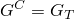。换句话说，

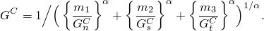

您指定数量 、 和 ，它们分别表示在法向、第一和第二剪切方向导致失效所需的关键断裂能。

| **输入文件用法：** | 使用以下选项使用解析幂定律断裂准则将断裂能定义为模式混合的函数： |
| --- | --- |
|  | ``` [*DAMAGE EVOLUTION](../key/key-link.md#usb-kws-mdamageevolution), TYPE=ENERGY, MIXED MODE BEHAVIOR=POWER LAW, POWER= ``` |

| **Abaqus/CAE 用法：** | 属性模块：材料编辑器：****机械****牵引-分离定律损伤****Quade 损伤****、**Maxe 损伤**、**Quads 损伤**或**Maxs 损伤**：****子选项****损伤演化****：**类型**：**能量**：**混合模式行为**：**幂定律**：切换开关**幂**并输入指数值 |
| --- | --- |

##### Benzeggagh-Kenane (BK) 形式

Benzeggagh-Kenane 断裂准则（Benzeggagh 和 Kenane，1996）在纯粹沿第一和第二剪切方向变形期间的关键断裂能相同时特别有用；即 。它由下式给出：

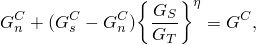

其中 、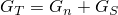 和  是材料参数。您指定 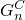、 和 。

| **输入文件用法：** | 使用以下选项使用解析 BK 断裂准则将断裂能定义为模式混合的函数： |
| --- | --- |
|  | ``` [*DAMAGE EVOLUTION](../key/key-link.md#usb-kws-mdamageevolution), TYPE=ENERGY, MIXED MODE BEHAVIOR=BK, POWER= ``` |

| **Abaqus/CAE 用法：** | 属性模块：材料编辑器：****机械****牵引-分离定律损伤****Quade 损伤****、**Maxe 损伤**、**Quads 损伤**或**Maxs 损伤**：****子选项****损伤演化****：**类型**：**能量**：**混合模式行为**：**Bk**：切换开关**幂**并输入指数值 |
| --- | --- |

##### 线性损伤演化

对于线性软化（参见 [图32.5.6-3](pt06ch32s05alm45.md#ecohesive-linear-softening)），Abaqus 使用损伤变量 *D* 的演化，简化为


其中 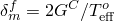，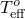 是损伤起始时的有效牵引。 指的是在加载历史期间达到的有效位移的最大值。

| **输入文件用法：** | 使用以下选项指定线性损伤演化： |
| --- | --- |
|  | ``` [*DAMAGE EVOLUTION](../key/key-link.md#usb-kws-mdamageevolution), TYPE=ENERGY, SOFTENING=LINEAR ``` |

| **Abaqus/CAE 用法：** | 属性模块：材料编辑器：****机械****牵引-分离定律损伤****Quade 损伤****、**Maxe 损伤**、**Quads 损伤**或**Maxs 损伤**：****子选项****损伤演化****：**类型**：**能量**：**软化**：**线性** |
| --- | --- |

##### 指数损伤演化

对于指数软化，Abaqus 使用损伤变量 *D* 的演化，简化为

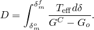

在上面的表达式中，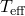 和  分别是有效牵引和有效位移。 是损伤起始时的弹性能。在这种情况下，牵引在损伤起始后可能不会立即下降，这与 [图32.5.6-5](pt06ch32s05alm45.md#ecohesive-exponential-softening) 中看到的不同。

| **输入文件用法：** | 使用以下选项指定指数软化： |
| --- | --- |
|  | ``` [*DAMAGE EVOLUTION](../key/key-link.md#usb-kws-mdamageevolution), TYPE=ENERGY, SOFTENING=EXPONENTIAL ``` |

| **Abaqus/CAE 用法：** | 属性模块：材料编辑器：****机械****牵引-分离定律损伤****Quade 损伤****、**Maxe 损伤**、**Quads 损伤**或**Maxs 损伤**：****子选项****损伤演化****：**类型**：**能量**：**软化**：**指数** |
| --- | --- |

#### 将损伤演化数据定义为模式混合的表格函数

如前所述，定义损伤演化的材料数据可以是模式混合的表格函数。在下文中，针对分别基于能量和牵引的模式混合定义概述了必须在 Abaqus 中定义这种依赖性的方式。在下面的讨论中，假定演化是根据能量定义的。对于基于有效位移的演化定义，可以做出类似的观察。

##### 基于能量的模式混合

对于基于能量的模式混合定义，在具有各向异性剪切变形的三维状态的最一般情况下，断裂能  必须定义为 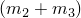 和 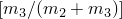 的函数。量 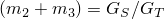 是剪切占总变形的比例的度量，而 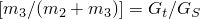 是第二剪切方向中占总剪切变形比例的度量。[图32.5.6-6](pt06ch32s05alm45.md#ecohesive-mode-mix-energy) 显示了断裂能 versus 模式混合行为的示意图。

**图32.5.6-6** 断裂能作为模式混合的函数。


纯法向和纯剪切变形在第一和第二剪切方向中的极限情况在 [图32.5.6-6](pt06ch32s05alm45.md#ecohesive-mode-mix-energy) 中分别用 、 和  表示。标记为"Modes n-s"、"Modes n-t"和"Modes s-t"的线分别显示了纯法向与第一方向纯剪切、纯法向与第二方向纯剪切以及第一和第二方向纯剪切之间行为的转变。一般来说， 必须指定为在各种固定的  值下  的函数。在下面的讨论中，我们将  与对应于固定  的  的数据集称为"数据块"。以下准则对将断裂能定义为模式混合的函数很有用：
- 对于二维问题， 只需要定义为 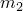（这种情况下为 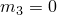）的函数。对应于  的数据列必须留空。因此，基本上只需要一个"数据块"。
- 对于具有各向同性剪切响应的三维问题，剪切行为由和  定义，而不是由  和 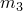 的单个值定义。因此，在这种情况下，单个"数据块"（对于  的"数据块"）也足以将断裂能定义为模式混合的函数。
- 在具有各向异性剪切行为的三维问题最一般的情况下，需要几个"数据块"。如前所述，每个"数据块"将包含在固定  值下  versus 。在每个"数据块"中， 可以在 *0* 到  之间变化。情况 （任何"数据块"中的第一个数据点）对应于纯法向模式，当  时永远不会实现（即，[图32.5.6-6](pt06ch32s05alm45.md#ecohesive-mode-mix-energy) 中线 OB 上唯一有效的点是 O，对应于纯法向变形）。然而，在将断裂能定义为模式混合函数的表格定义中，此数据点简单地用于设定一个极限，确保当从各种法向和剪切变形组合接近纯法向状态时，断裂能发生连续变化。因此，每个"数据块"中的第一个数据点的断裂能必须始终设置为等于纯法向变形模式中的断裂能（）。作为各向异性剪切情况的示例，假设您要输入三个"数据块"，对应于固定值 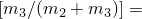 分别为 0.、0.2 和 1.0。对于三个"数据块"中的每一个，根据上面讨论的原因，第一个数据点必须是 。每个"数据块"中的其余数据点定义了断裂能随剪切变形比例增加的变化。

##### 基于牵引的模式混合

需要以  versus  和  的表格形式指定断裂能。因此， 需要指定为在各种固定的  值下  的函数。在这种情况下，"数据块"对应于在固定  值下  versus  的一组数据。在每个"数据块"中， 可以从 0（纯法向变形）到 1（纯剪切变形）变化。一个重要的限制是，每个数据块必须为  指定相同的断裂能值。此限制确保当牵引向量接近法线方向时，失效所需的能量不依赖于牵引向量在剪切平面上投影的方向（参见 [图32.5.6-2](pt06ch32s05alm45.md#ecohesive-mode-mix-traction)）。

#### 当多个准则活动时评估损伤

当对同一材料使用多个损伤起始准则和相关演化定义时，每个演化定义都会产生其自己的损伤变量 ，其中下标 *i* 表示第 *i* 个损伤系统。总体损伤变量 *D* 根据各个  计算，如 ["体积材料损伤演化和单元去除" 第24.2.3节"当多个准则活动时评估总体损伤"](pt05ch24s02abm43.md#usb-mat-cdamageevol-multcrit) 中所述。

### 最大退化和单元去除选择

您可以控制 Abaqus 处理严重损伤内聚单元的方式。默认情况下，材料点上总体损伤变量的上限为 。您可以按照 ["Section controls" 第27.1.4节"控制材料损伤演化的单元删除和最大退化"](pt06ch27s01aus113.md#usb-elm-esectioncontrol-deletion) 中讨论的那样减少此上限。您可以控制当损伤达到此限制时内聚单元发生的情况，如下所述。

默认情况下，一旦总体损伤变量在其所有材料点达到  并且其所有材料点都不处于压缩状态，除了孔隙压力内聚单元外，内聚单元将被移除（删除）。详细信息请参见 ["Section controls" 第27.1.4节"控制材料损伤演化的单元删除和最大退化"](pt06ch27s01aus113.md#usb-elm-esectioncontrol-deletion)。这种单元去除方法通常适用于对粘合和组件分离进行完全断裂建模。移除后，内聚单元对组件的后续穿透不提供任何阻力，因此可能需要在组件之间建模接触，如 ["使用内聚单元建模" 第32.5.3节"定义周围组件之间的接触"](pt06ch32s05alm42.md#usb-elm-ecohesiveusage-contact) 中所讨论的。

或者，您可以指定即使在总体损伤变量达到  后，内聚单元也应保留在模型中。在这种情况下，拉伸和/或剪切中的单元刚度保持不变（通过因子 1   相对于初始未损伤刚度降解）。如果内聚单元必须抵抗周围组件的相互穿透，即使它们在拉伸和/或剪切中完全退化（参见 ["使用内聚单元建模" 第32.5.3节"定义周围组件之间的接触"](pt06ch32s05alm42.md#usb-elm-ecohesiveusage-contact)），此选择是合适的。在 Abaqus/Explicit 中，建议您使用截面控制将线性和二次体积粘度参数的标度因子设置为零来抑制内聚单元的体积粘度（参见 ["Section controls，" 第27.1.4节"](pt06ch27s01aus113.md)）。

### 解耦横向剪切响应

可选的线性弹性横向剪切行为可以定义为内聚单元提供额外稳定性，特别是在损伤发生后。横向剪切行为假定与常规材料响应无关，不承受任何损伤。

| **输入文件用法：** | 使用以下选项： |
| --- | --- |
|  | ``` [*COHESIVE SECTION](../key/key-link.md#usb-kws-mcohesivesection), RESPONSE=TRACTION SEPARATION [*TRANSVERSE SHEAR STIFFNESS](../key/key-link.md#usb-kws-mtransshearstiff) ``` |

| **Abaqus/CAE 用法：** | Abaqus/CAE 不支持内聚截面的横向剪切行为。 |
| --- | --- |

### Abaqus/Standard 中的粘性正则化

表现出软化行为和刚度退化的材料模型通常会在隐式分析程序（如 Abaqus/Standard）中导致严重的收敛困难。克服这些收敛困难的一种常见技术是使用本构方程的粘性正则化，这会导致软化材料的切线刚度矩阵在足够小的时间增量下为正。

牵引-分离定律可以在 Abaqus/Standard 中通过允许应力超出牵引-分离定律设定的限制来进行粘性正则化。正则化过程涉及使用粘性刚度退化变量 ，其由演化方程定义：


其中  是表示粘性系统松弛时间的粘性参数，*D* 是在无粘性骨干模型中评估的退化变量。粘性材料的受损响应给出为


使用具有小粘性参数值（相对于特征时间增量较小）的粘性正则化通常有助于改善模型在软化状态下的收敛速度，而不会影响结果。基本思想是粘性系统的解放松到无粘性情况下的解，如 ，其中 *t* 代表时间。您可以指定粘性参数的值作为截面控制定义的一部分（参见 ["在 Abaqus/Standard 中与内聚单元、连接单元以及可与延性金属和纤维增强复合材料损伤演化模型一起使用的单元一起使用粘性正则化" 第27.1.4节"section controls"](pt06ch27s01aus113.md#usb-elm-esectioncontrol-viscosity)）。如果粘性参数不同于零，则刚度退化的输出结果指的是粘性值 。粘性参数的默认值为零，因此不执行粘性正则化。在 ["层合复合材料剥离分析" Abaqus 基准指南第2.7.1节](../bmk/bmk-link.md#bmk-elm-alfanodelamination) 和 ["拉伸下皮肤-桁条剥离分析" Abaqus 例题指南第1.4.5节](../exa/exa-link.md#exa-sta-skinflangedebond) 中讨论了使用粘性正则化改善剥离和脱粘问题收敛行为的问题。

整个模型或单元集上与粘性正则化相关的近似能量量可以使用输出变量 ALLCD 获取。

### 输出

除了 Abaqus 中可用的标准输出标识符（["Abaqus/Standard 输出变量标识符，" 第4.2.1节"](pt02ch04s02abv01.md) 和 ["Abaqus/Explicit 输出变量标识符，" 第4.2.2节"](pt02ch04s02xbv01.md)）外，以下变量对具有牵引-分离行为的内聚单元具有特殊含义：

| STATUS | 单元的状态（如果单元活跃则为 1.0，如果不活跃则为 0.0）。 |
| --- | --- |

| SDEG | 标量损伤变量 *D* 的总体值。 |
| --- | --- |

| DMICRT | 所有损伤起始准则分量。 |
| --- | --- |

| MAXSCRT | 分析期间材料点上标称应力损伤起始准则的最大值。评估为  |
| --- | --- |

| MAXECRT | 分析期间材料点上标称应变损伤起始准则的最大值。评估为  |
| --- | --- |

| MMIXDME | 损伤演化期间的模式混合比。评估为 。一般来说，它在给定积分点处随时间变化。在损伤起始之前，此变量设置为 。 |
| --- | --- |

| MMIXDMI | 损伤起始时的模式混合比。在积分点处首次损伤起始时评估为 。它在给定积分点处随时间保持不变。在损伤起始之前，此变量设置为 。 |
| --- | --- |

| QUADSCRT | 分析期间材料点上二次标称应力损伤起始准则的最大值。评估为  |
| --- | --- |

| QUADECRT | 分析期间材料点上二次标称应变损伤起始准则的最大值。评估为  |
| --- | --- |

| ALLCD | 与 Abaqus/Standard 中粘性正则化相关的整个模型或单元集上的近似能量量。相应的输出变量（如 CENER、ELCD 和 ECDDEN）分别表示积分点级别和单元级别的粘性正则化相关能量（最后一种量表示单元中单位体积的能量）。 |
| --- | --- |

对于上述指示某个损伤起始准则是否已满足的变量，值小于 1.0 表示准则未满足，而值为 1.0 或更高表示准则已满足。如果为此准则指定了损伤演化，则此变量的最大值不会超过 1.0。但是，如果未为起始准则指定损伤演化，则此变量可以具有大于 1.0 的值。变量超过 1.0 的程度可以被认为是该准则被违反程度的度量。

#### 其他参考

- Benzeggagh, M. L., and M. Kenane, "Measurement of Mixed-Mode Delamination Fracture Toughness of Unidirectional Glass/Epoxy Composites with Mixed-Mode Bending Apparatus," Composites Science and Technology, vol. 56, pp. 439--449, 1996.
- Camanho, P. P., and C. G. Davila, "Mixed-Mode Decohesion Finite Elements for the Simulation of Delamination in Composite Materials," NASA/TM-2002--211737, pp. 1--37, 2002.


