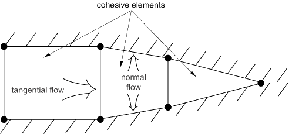
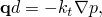
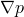
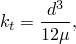
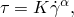
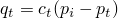
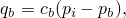

# 32.5.7 定义内聚元素间隙中流体的本构响应


**产品：** Abaqus/Standard  Abaqus/CAE

##### **参考文献**

- ["内聚元素：概述，" 第32.5.1节](pt06ch32s05abo29.md)
- ["使用牵引-分离描述定义内聚元素的本构响应，" 第32.5.6节](pt06ch32s05alm45.md)
- [*FLUID LEAKOFF](../key/key-link.md#usb-kws-mfluidleakoff)
- [*GAP FLOW](../key/key-link.md#usb-kws-mgapflow)
- [Abaqus/CAE 用户指南第21章，"粘接接头和粘接界面"](../usi/usi-link.md#usi-adv-cohesive)

### 概述

内聚元素流体流模型：
- 通常用于地质工程应用，必须保持间隙内和通过界面的流体流连续性；
- 使内聚元素表面上的流体压力贡献于其力学行为，从而可以模拟水力驱动断裂；
- 可以模拟内聚元素表面上的附加阻力层；并且
- 只能与牵引-分离行为结合使用。

本节描述的功能用于模拟孔隙压力内聚元素内部和表面上的流体流动。

### 定义孔隙流体属性

流体本构响应包括：
- 间隙内的切向流动，可用牛顿流体或幂律流体模型进行模拟；以及
- 穿过间隙的法向流动，可反映结垢或淤塞效应的影响。

元素中孔隙流体的流动模式如图32.5.7-1所示。

**图32.5.7-1** 内聚元素内的流动



流体被视为不可压缩，公式基于流动连续性方程，该方程考虑切向和法向流动以及内聚元素的开口速率。

### 指定流体流动属性

可以分别指定切向和法向流动属性。

#### 切向流动

默认情况下，内聚元素内没有孔隙流体的切向流动。要允许切向流动，需结合孔隙流体材料定义定义间隙流动属性。

##### 牛顿流体

对于牛顿流体，体积流率密度向量由下式给出



其中  是切向渗透率（对流体流动的阻力）， 是沿内聚元素的压力梯度， 是间隙开口。

在 Abaqus 中，间隙开口  定义为


其中  和  分别是当前和原始内聚元素几何厚度， 是初始间隙开口，默认值为0.002。

Abaqus 根据雷诺方程定义切向渗透率或流动阻力：



其中  是流体粘度， 是间隙开口。您也可以指定  值的上限。

| **输入文件用法：** | 使用以下选项直接定义初始间隙开口： |
| --- | --- |
|  | ``` [*SECTION CONTROLS](../key/key-link.md#usb-kws-msectioncontrols), INITIAL GAP OPENING ``` 使用以下选项定义牛顿流体中的切向流动： ``` [*GAP FLOW](../key/key-link.md#usb-kws-mgapflow), TYPE=NEWTONIAN, KMAX ``` |

| **Abaqus/CAE 用法：** | Abaqus/CAE 不支持初始间隙开口定义。 |
| --- | --- |
|  | Property 模块：material editor：****其他****孔隙流体****间隙流动****：类型：**牛顿**：开启**最大渗透率**并输入  的值 |

##### 幂律流体

对于幂律流体，本构关系定义为



其中  是剪切应力， 是剪切应变率， 是流体稠度系数， 是幂律系数。Abaqus 将切向体积流率密度定义为


其中  是间隙开口。

| **输入文件用法：** | [*GAP FLOW](../key/key-link.md#usb-kws-mgapflow), TYPE=POWER LAW |
| --- | --- |

| **Abaqus/CAE 用法：** | Property 模块：material editor：****其他****孔隙流体****间隙流动****：类型：**幂律** |
| --- | --- |

#### 穿过间隙表面的法向流动

可以通过为孔隙流体材料定义流体泄漏系数来允许法向流动。该系数定义内聚元素中间节点与其相邻表面节点之间的压力-流动关系。流体泄漏系数可以解释为内聚元素表面上一层有限厚度材料的渗透率，如图32.5.7-2所示。

**图32.5.7-2** 泄漏系数作为渗透层的解释


法向流动定义为



和



其中  和  分别是流入顶面和底面的流率， 是中间面压力， 和  分别是顶面和底面上的孔隙压力。

| **输入文件用法：** | [*FLUID LEAKOFF](../key/key-link.md#usb-kws-mfluidleakoff) |
| --- | --- |

| **Abaqus/CAE 用法：** | Property 模块：material editor：****其他****孔隙流体****流体泄漏****：类型：**系数** |
| --- | --- |

##### 将泄漏系数定义为温度和场变量的函数

可以选择将泄漏系数定义为温度和场变量的函数。

| **输入文件用法：** | [*FLUID LEAKOFF](../key/key-link.md#usb-kws-mfluidleakoff), DEPENDENCIES |
| --- | --- |

| **Abaqus/CAE 用法：** | Property 模块：material editor：****其他****孔隙流体****流体泄漏****：类型：**系数**：开启**使用温度相关数据**并选择场变量的数量。 |
| --- | --- |

##### 在用户子程序中定义泄漏系数

用户子程序 [`UFLUIDLEAKOFF`](../sub/sub-link.md#sub-xsl-ufluidleakoff) 也可用于定义更复杂的泄漏行为，包括通过使用解相关状态变量定义时间累积阻力或结垢的能力。

| **输入文件用法：** | [*FLUID LEAKOFF](../key/key-link.md#usb-kws-mfluidleakoff), USER |
| --- | --- |

| **Abaqus/CAE 用法：** | Property 模块：material editor：****其他****孔隙流体****流体泄漏****：类型：**用户** |
| --- | --- |

#### 切向和法向流动组合

[表32.5.7-1](pt06ch32s05alm46.md#ecohesivefluidtable) 显示了切向和法向流动的允许组合以及每种组合的效果。

**表32.5.7-1** 流动属性定义组合的效果。
|  | 已定义法向流动 | 未定义法向流动 |
| --- | --- | --- |
| 已定义切向流动 | 模拟切向和法向流动。 | 模拟切向流动。仅当元素闭合时，才在间隙中相邻节点之间强制执行孔隙压力连续性。否则，表面在法向上是不可渗透的。 |
| 未定义切向流动 | 模拟法向流动。 | 不模拟切向流动。始终在间隙中相邻节点之间强制执行孔隙压力连续性。 |

### 初始开口元素

当内聚元素的开口主要由流体进入间隙驱动时，您必须将一个或多个元素定义为初始开口，因为切向流动只能在内开口元素中进行。将初始开口元素识别为初始条件。

| **输入文件用法：** | [*INITIAL CONDITIONS](../key/key-link.md#usb-kws-minitialcond), TYPE=INITIAL GAP |
| --- | --- |

| **Abaqus/CAE 用法：** | Abaqus/CAE 不支持初始间隙定义。 |
| --- | --- |

### 非对称矩阵存储和求解的使用

孔隙压力内聚元素矩阵是非对称的；因此，可能需要非对称矩阵存储和求解来改善收敛（请参阅["Abaqus/Standard 中的矩阵存储和求解方案"中的"定义分析"部分，第6.1.2节](pt03ch06s01abo05.md#usb-anl-unsymm)）。

### 其他注意事项

在某些情况下，内聚元素流体属性的使用以及属性值可能会影响您的解决方案。

#### 较大的系数值

您必须确保切向渗透率或流体泄漏系数不会过大。如果任一系数比相邻连续体元素中的渗透率大几个数量级，可能会出现矩阵条件问题，导致求解器奇异性和不可靠的结果。

#### 在总孔隙压力模拟中的使用

如果使用总孔隙压力公式且静水压力梯度对间隙中的切向流动有显著贡献，则定义切向流动属性可能导致不准确的结果。如果对模型中的所有元素施加重力分布荷载，则会调用总孔隙压力公式。如果静水压力梯度（即重力向量）垂直于内聚元素，结果将是准确的。

### 输出

在内聚元素中启用流动时，以下输出变量可用：

| GFVR | 间隙流体体积流率。 |
| --- | --- |

| PFOPEN | 断裂开口。 |
| --- | --- |

| LEAKVRT | 元素顶部的泄漏流率。 |
| --- | --- |

| ALEAKVRT | 元素顶部的累积泄漏体积。 |
| --- | --- |

| LEAKVRB | 元素底部的泄漏流率。 |
| --- | --- |

| ALEAKVRB | 元素底部的累积泄漏体积。 |
| --- | --- |


