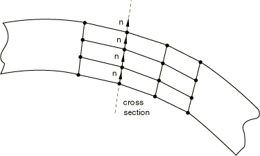
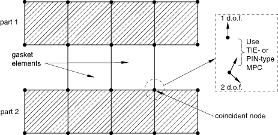
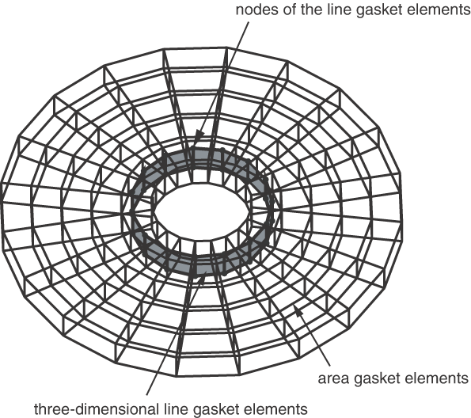

# 32.6.3 在模型中包含垫片单元

**产品：** Abaqus/Standard  Abaqus/CAE

##### **参考文献**

- ["垫片单元：概述，" 第32.6.1节](pt06ch32s06abo30.md)
- ["选择垫片单元，" 第32.6.2节](pt06ch32s06alm47.md)
- ["接触相互作用分析：概述，" 第36.1.1节](pt09ch36s01abo33.md)
- ["通用多点约束，" 第35.2.2节](pt08ch35s02aus130.md)
- [Abaqus/CAE 用户指南第32章，"垫片"](../usi/usi-link.md#usi-adv-gasket)

### 概述

垫片单元：
- 用于模拟两个组件之间的垫片和其他密封件，每个组件可以是可变形或刚性的；并且
- 通过共享节点、使用基于表面的绑定约束、使用 MPC 类型 TIE 或 PIN，或使用接触对连接到相邻组件。

本节讨论可用于离散化垫片并将其组装到代表多个组件（如内燃机）的模型中的技术。所描述的方法都适用于在其节点上具有所有位移自由度的垫片单元。在大多数情况下，它们也适用于仅具有厚度方向行为的垫片单元；例外情况将在本节后面讨论。

### 使用垫片单元离散化垫片

垫片通常是作为独立组件制造的。垫片行为通常通过对垫片进行压缩实验来测量。在这种情况下，垫片可以离散化为单层垫片单元。

垫片有时由多层材料制成。如果通过整个垫片的压缩测试获得垫片的行为，则垫片可以再次离散化为单层垫片单元。但是，如果通过构成垫片的每层材料的压缩测试获得垫片的行为，则垫片可以用相应的一组垫片单元层来离散化。

#### 使用多层垫片单元离散化垫片

如果在厚度方向上使用多层垫片单元且这些层在垫片平面中具有不同的单元布局，请使用基于表面的绑定约束、网格细化 MPC 或绑定接触对来连接垫片的不同层。如果使用绑定接触对，请为接触对指定调整区域深度 *a* 的正值（请参阅["调整 Abaqus/Standard 接触对中的初始表面位置并指定初始间隙，" 第36.3.5节](pt09ch36s03aus149.md)），以便在分析开始时所有从节点都被正确绑定。

### 在模型中将垫片组装到其他组件

将使用其节点上所有位移分量的垫片单元连接到模型中其他组件的最简单方法是定义网格，使得垫片单元可以与相邻组件表面上的单元共享节点。更一般地说，当垫片网格与相邻组件表面的网格不匹配时，或当使用仅考虑厚度方向行为的垫片单元时，垫片单元可以通过使用接触对连接到其他组件。

#### 使用接触对或基于表面的约束将垫片连接到其他组件

垫片通常由比相邻组件材料更软的材料组成。此外，垫片的网格通常比相邻部件的网格更细。这两个事实表明，垫片的接触表面应该是从属表面，相邻部件的接触表面应该是主表面。第二个考虑还表明，在涉及垫片的分析中通常会使用不匹配的网格。如果使用不匹配的网格，则可能无法准确预测压缩垫片上的压力分布；可能需要使用子模型（["子模型：概述，" 第10.2.1节](pt04ch10s02aus60.md)）来获得准确的局部结果。当使用基于表面的约束时，有两种技术可用于将垫片单元连接到模型中的其他部件。

##### 使用常规接触对和绑定接触对或基于表面的约束

当垫片膜行为未定义时需要此技术。在垫片的一侧使用绑定接触对（["在 Abaqus/Standard 中定义绑定接触，" 第36.3.7节](pt09ch36s03aus151.md)）或绑定约束（["网格绑定约束，" 第35.3.1节](pt08ch35s03aus132.md)），在另一侧使用常规接触对，如[图32.6.3-1](pt06ch32s06alm48.md#egasket-contact-tied)所示。

**图32.6.3-1** 使用接触对将垫片连接到其他部件

因为在垫片的一侧使用了常规接触对，所以如果围绕垫片的组件被拉开，垫片厚度方向不会产生拉应力。

为绑定接触对指定调整区域深度 *a* 的正值（请参阅["调整 Abaqus/Standard 接触对中的初始表面位置并指定初始间隙，" 第36.3.5节](pt09ch36s03aus149.md)），或者如有必要，为绑定约束指定位置容差（请参阅["网格绑定约束，" 第35.3.1节](pt08ch35s03aus132.md)），以便在分析开始时所有从节点都被正确绑定。此技术仅允许垫片一侧产生摩擦滑动。

##### 使用不允许分离的常规接触对和接触对

此技术允许垫片两侧都传递摩擦滑动。当为垫片定义了膜行为时推荐使用，因为它允许垫片膜由于考虑垫片两侧的摩擦效应而拉伸或收缩。应在垫片的一侧使用不允许表面分离的接触对或约束对（["接触压力-过盈关系，" 第37.1.2节](pt09ch37s01aus166.md)），在另一侧使用常规接触对，如[图32.6.3-2](pt06ch32s06alm48.md#egasket-contact-nosepara)所示。

**图32.6.3-2** 当定义垫片膜行为时将垫片连接到其他部件

为接触对指定调整区域深度 *a* 的正值（请参阅["调整 Abaqus/Standard 接触对中的初始表面位置并指定初始间隙，" 第36.3.5节](pt09ch36s03aus149.md)），以便在分析开始时表面处于接触状态。使用不允许分离的接触压力-过盈关系（请参阅["接触压力-过盈关系，" 第37.1.2节](pt09ch37s01aus166.md)），以便这些表面在分析过程中不会分离。此技术将防止垫片在其厚度方向的刚体模式。在摩擦力在垫片和相邻组件之间产生之前，您可能仍然需要防止垫片平面内的刚体模式。

#### 让垫片单元与其他单元共享节点

当垫片及其相邻部件具有匹配的网格时，可以通过简单地共享节点将垫片连接到模型中的其他组件（请参阅[图32.6.3-3](pt06ch32s06alm48.md#egasket-share-node)）。

**图32.6.3-3** 垫片单元与其他 Abaqus 单元共享节点

这种将垫片连接到其他组件的方法适用于垫片和其他组件之间不发生摩擦滑动的情况。无论垫片单元的膜行为是否定义，它都可以使用；但是，如果定义了垫片膜行为，使用接触对方法将产生更现实的结果，因为垫片与其相邻部件之间的膜刚度差异可能导致摩擦滑动。共享节点的方法也会导致在与垫片连接的部件被拉开时垫片产生一些小的拉应力，这是由于添加到垫片厚度方向行为的数值稳定技术（请参阅["直接使用垫片行为模型定义垫片行为，" 第32.6.6节](pt06ch32s06alm51.md)）。接触对方法将避免这种拉应力。此节点共享方法不能与仅考虑厚度方向行为的垫片单元一起使用。

### 使用仅模拟厚度方向行为的垫片单元

一般来说，前面讨论的建模技术可以与仅模拟厚度方向行为的垫片单元一起使用。但是，这些单元每个节点只有一个位移自由度，不能与在节点上具有所有位移自由度的单元共享节点。但是，它们可以与也仅模拟厚度方向行为的其他垫片单元共享节点。

#### 使用仅厚度方向行为单元离散化垫片

当沿垫片方向使用几层垫片单元离散化垫片时，建议属于垫片横截面的所有节点具有相同的厚度方向（请参阅[图32.6.3-4](pt06ch32s06alm48.md#egasket-layer-crosssection)）。如果厚度方向发生变化，将生成近似解，因为仅通过垫片厚度将力的大小从一个垫片单元传递到下一个单元。

**图32.6.3-4** 使用仅厚度方向行为的多层单元离散化垫片

#### 当选择仅厚度方向行为垫片单元时将垫片连接到其他组件

可以使用接触对将垫片网格连接到相邻组件，如上所述，但只能使用无摩擦、小滑动的接触。

MPC 类型 PIN 或 TIE 也可用于将垫片单元的一个自由度节点连接到也具有所有位移自由度活动的另一个重合节点（请参阅[图32.6.3-5](pt06ch32s06alm48.md#egasket-mpc-pin)）。Abaqus/Standard 自动将单个位移自由度节点约束到另一个节点的全局位移。

基于表面的绑定约束不能用于连接仅模拟厚度方向行为的垫片单元。

**图32.6.3-5** 使用 MPC 将仅厚度方向行为的垫片单元连接到其他部件

### 使用垫片单元时的其他注意事项

使用垫片单元时，有几种情况需要特殊考虑。

#### 在大位移分析中使用垫片单元

垫片单元是小应变、小位移单元。它们可以用于大位移分析。但是，垫片单元的局部方向不会随解更新，因此如果包含垫片单元的组件发生任何明显的旋转，将产生错误的结果。

#### 使用12节点垫片单元

这些单元主要用于相邻组件使用修改的10节点四面体单元（单元类型 C3D10M）建模时。当使用接触对方法时，此类单元也可以放置在其他三维固体连续体单元附近；但是，如果网格严重不匹配，解决方案可能有噪声。

#### 使用18节点垫片单元

这些单元旨在与21到27节点砖块单元共享节点。当使用接触对方法时，它们也可以连接到由21到27节点砖块单元组成的网格或由20节点砖块单元组成的网格。

Abaqus/Standard 允许自动生成18节点垫片单元中面节点的节点号和坐标，如果这些面是接触表面，类似于为定义接触表面的20节点砖块单元面生成面中节点的方式。如果在元素连接中保留节点17和18的条目为空，则会调用此功能。

#### 使用三维线垫片单元

三维线垫片单元通常用于模拟垫片中较窄、较厚的特征，例如孔周围的弹性体嵌件。在这种情况下显示了典型的网格（请参阅[图32.6.3-6](pt06ch32s06alm48.md#egasket-insert-line)）。垫片主要用三维面积单元离散化。嵌件用可能与面积单元连接或可能不连接的三维线单元建模。这些垫片单元使用两组接触对连接到周围组件，面积单元通常在垫片属性定义中指定初始间隙，以便较厚的嵌件在接触时比面积单元更早产生压力。

**图32.6.3-6** 使用三维线垫片单元模拟垫片中嵌件的典型用法

如果使用在其节点上具有所有位移自由度的三维线垫片单元来离散化垫片，并且这些单元的局部3方向在所有节点上都相同（当所有单元位于一个平面时就是这种情况），则这些单元的节点可以在局部3方向上移动而不会在单元中产生任何应变（请参阅["直接使用垫片行为模型定义垫片行为，" 第32.6.6节](pt06ch32s06alm51.md)，了解三维线单元局部方向的更多详细信息）。在这种情况下，您应确保这些单元在局部3方向上被正确约束。

