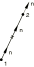
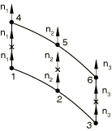
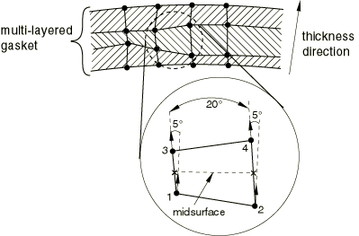
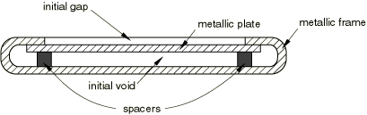

# 32.6.4 定义垫片单元的初始几何


**产品：** Abaqus/Standard  Abaqus/CAE

##### **参考文献**

- ["垫片单元：概述，" 第32.6.1节](pt06ch32s06abo30.md)
- [*GASKET SECTION](../key/key-link.md#usb-kws-mgasketsection)
- ["创建垫片截面，" Abaqus/CAE 用户指南第12.13.15节](../usi/usi-link.md#usi-prp-section-gasket)

### 概述

初始垫片几何：
- 由元素的节点坐标定义；并且
- 也由厚度方向和初始厚度定义，每个都可以由 Abaqus/Standard 计算或用户定义。

### 定义单元几何

垫片单元基本上由两个表面（底面和顶面）组成，由垫片厚度分隔。元素在其底面和顶面上都有节点。

有两种方法可用于定义单元几何。

#### 通过定义单元的节点

您可以通过定义所有单元节点的坐标来定义垫片单元的几何。您可以定义具有恒定或变化厚度的单元。如果垫片单元与其表面尺寸相比非常薄，则从节点坐标计算的单元厚度可能不准确。在这种情况下，您可以直接指定恒定厚度。

#### 通过定义单元的底面

您可以仅指定垫片单元底面上节点列表以及将用于定义垫片单元顶面对应节点的正偏移编号。Abaqus/Standard 将创建顶面节点与底面节点重合，除非顶面节点已被分配坐标。如果底面和顶面节点重合，则必须指定垫片单元的厚度。

#### 指定单元厚度

您可以将垫片单元厚度指定为其截面属性定义的一部分。

| **输入文件用法：** | ``` [*GASKET SECTION](../key/key-link.md#usb-kws-mgasketsection) *thickness* ``` |
| --- | --- |

| **Abaqus/CAE 用法：** | Property 模块：**Create Section**：选择**其他**作为截面**类别**和**垫片**作为截面**类型**：**初始厚度：指定：** *thickness* |
| --- | --- |

#### 指定单元几何所需的额外数量

对于三维面积单元，单元几何完全由顶面和底面的位置以及单元厚度定义。对于二维和三维链接单元（每个面上有一个节点的两个节点单元），您应指定单元的横截面积。对于轴对称链接单元，您应指定单元的宽度。对于一般二维单元，需要面外厚度。对于三维线单元，您还应指定单元的宽度。此附加信息作为垫片截面属性定义的一部分指定；如果未指定但需要，则假定其值为1.0。

| **输入文件用法：** | ``` [*GASKET SECTION](../key/key-link.md#usb-kws-mgasketsection) , , , *additional geometric data (cross-sectional area, width, or out-of-plane thickness)* ``` |
| --- | --- |

| **Abaqus/CAE 用法：** | Property 模块：**Create Section**：选择**其他**作为截面**类别**和**垫片**作为截面**类型**：**横截面积、宽度或面外厚度：** *additional geometric data* |
| --- | --- |

### 默认单元厚度方向定义

垫片通常被制造为在其厚度方向上具有期望的行为。因此，准确定义垫片单元的厚度方向非常重要。Abaqus/Standard 默认计算这些方向。Abaqus/Standard 使用的方法取决于垫片单元类型。

#### 链接单元

Abaqus/Standard 通过从节点2的坐标减去节点1的坐标来计算二维、三维或轴对称链接单元的厚度方向，如[图32.6.4-1](pt06ch32s06alm49.md#egasket-link-normal)所示。然后将计算的厚度方向分配给每个节点。如果垫片单元非常薄，厚度方向可能无法准确预测。您可以覆盖此方向，如下面["显式指定厚度方向](pt06ch32s06alm49.md#usb-elm-egasketinit-thicknessdir-specify)"中所述。

**图32.6.4-1** 链接单元的厚度方向



#### 二维和轴对称单元

为了计算二维和轴对称单元的厚度方向，Abaqus/Standard 通过平均形成单元底面和顶面的节点对的坐标来形成中面。此中面穿过单元的积分点，如[图32.6.4-2](pt06ch32s06alm49.md#egasket-2d-axi-normal)所示。对于每个积分点，Abaqus/Standard 计算一条切线，其方向由底面和顶面上给出的节点序列定义。然后通过面外方向和切线方向的叉积获得厚度方向。在每个积分点计算的厚度方向被分配给积分点两侧的节点。

**图32.6.4-2** 二维或轴对称单元的厚度方向


#### 三维面积单元

为了计算三维面积单元的厚度方向，Abaqus/Standard 通过平均形成单元底面和顶面的节点对的坐标来形成中面。此中面穿过单元的积分点，如[图32.6.4-3](pt06ch32s06alm49.md#egasket-3d-normal)所示。Abaqus/Standard 计算中面在每个积分点处的厚度方向；正方向通过使用右手定则绕着底面或顶面上单元节点的顺序获得。在每个积分点计算的厚度方向被分配给积分点两侧的节点。

**图32.6.4-3** 三维面积单元的厚度方向


#### 三维线单元

为了计算三维线单元的厚度方向，Abaqus/Standard 通过差分与积分点关联的单元表面节点的坐标来计算线单元在每个积分点处的厚度方向。厚度方向将从底面节点指向顶面节点。在每个积分点计算的厚度方向被分配给积分点两侧的节点（请参阅[图32.6.4-4](pt06ch32s06alm49.md#egasket-3d-line-normal)）。

**图32.6.4-4** 三维线单元的厚度方向



如果垫片单元非常薄，厚度方向的计算可能不准确。您可以覆盖此定义，如下面["显式指定厚度方向](pt06ch32s06alm49.md#usb-elm-egasketinit-thicknessdir-specify)"中所述。

### 创建平滑垫片

垫片单元可用于单层或堆叠多层（请参阅["在模型中包含垫片单元，" 第32.6.3节](pt06ch32s06alm48.md)，了解更多详细信息）。在逐个单元的基础上计算的垫片单元节点处的厚度方向在由两个或更多垫片单元共享的节点处进行平均。此平均过程确保如果垫片不是平面的，即使垫片已被单元离散化，它也具有平滑变化的厚度方向。您必须确保单元的连接性使得厚度方向不会从一个单元到下一个单元反转。一旦平均过程完成，给定单元节点处的厚度方向可能沿垫片中面和穿过其厚度发生显著变化，如[图32.6.4-5](pt06ch32s06alm49.md#egasket-normal-avg)所示。单元任何节点处的厚度方向在方向上的变化不应超过20。此外，穿过厚度方向关联的两个节点的厚度方向在方向上的变化不应超过5。当不满足此类条件时，Abaqus/Standard 将需要重新网格化垫片。

**图32.6.4-5** 平均过程的结果



#### 显式指定厚度方向

对于上述平均过程不令人满意的情况，提供了两种方法来指定垫片单元的厚度方向。

##### 作为垫片截面定义的一部分指定厚度方向

您可以将厚度方向的分量指定为垫片截面定义的一部分。在这种情况下，使用此截面定义的所有垫片单元的节点被分配相同的厚度方向。在元素间共享的节点处，元素上指定的厚度方向将被平均。

| **输入文件用法：** | ``` [*GASKET SECTION](../key/key-link.md#usb-kws-mgasketsection) , , , , *component 1*, *component 2*, *component 3* ``` |
| --- | --- |

| **Abaqus/CAE 用法：** | 您不能在 Abaqus/CAE 中指定垫片厚度方向。 |
| --- | --- |

##### 通过在节点处指定法线方向来指定厚度方向

您可以通过为与积分点关联的元素底面上节点的法线方向来定义垫片单元在特定积分点处的厚度方向（请参阅["节点处的法线定义，" 第2.1.4节](pt01ch02s01aus08.md)）。如果此节点属于多个单元，厚度方向将不会被平均。指定在底面节点的厚度方向也将被分配给与同一积分点关联的顶面节点。如果顶面节点属于多个单元，此厚度方向将不会被平均；但是，如果它是另一个单元的底面节点，您可以通过在此节点指定法线来覆盖此厚度方向。只有在垫片厚度方向上堆叠垫片单元时才会出现最后一种情况。如果使用此方法在同一节点处指定了冲突的厚度方向，Abaqus/Standard 将发出错误消息。使用此方法指定的厚度方向将覆盖在垫片截面定义的一部分中指定的任何厚度方向。

| **输入文件用法：** | ``` [*NORMAL](../key/key-link.md#usb-kws-mnormal) ``` |
| --- | --- |

| **Abaqus/CAE 用法：** | 用户指定的节点法线在 Abaqus/CAE 中不受支持。 |
| --- | --- |

#### 创建折叠线

可以通过创建具有重合节点的垫片并使用 MPC 类型 TIE 或 PIN（["通用多点约束，" 第35.2.2节](pt08ch35s02aus130.md)）来约束这些节点的位移来引入垫片中的折叠线。但是，在垫片分析中很少需要折叠线，因为几乎所有垫片都是用平滑变化的表面制造的。

#### 验证厚度方向

可以通过检查分析输入文件处理器输出来检查厚度方向定义。在数据（`.dat`）文件中的 `GASKET THICKNESS DIRECTIONS` 下列出在垫片单元节点处获得的厚度方向的方向余弦。

### 指定垫片单元厚度方向的初始间隙和初始空隙

垫片在其贯穿厚度方向上的构造可能很复杂；例如，某些汽车垫片通常由几层金属和/或弹性体嵌件组成，并且在垫片被压缩之前各层可能不会全部接触。垫片中的层间空间在 Abaqus 中称为初始空隙。初始空隙仅用于计算热应变和蠕变应变。垫片表面几何也可能使压力仅在垫片被压缩一定量后才会产生。在 Abaqus 中，将垫片压缩到产生压力所需的闭合量称为初始间隙。[图32.6.4-6](pt06ch32s06alm49.md#egasket-init-gap-void) 显示了典型垫片中初始间隙和初始空隙的示意图。您可以将初始间隙和初始空隙都指定为垫片截面属性定义的一部分。元素的初始厚度应包括初始间隙和初始空隙。

**图32.6.4-6** 典型垫片中初始间隙和初始空隙的示意图



| **输入文件用法：** | ``` [*GASKET SECTION](../key/key-link.md#usb-kws-mgasketsection) , *initial gap*, *initial void* ``` |
| --- | --- |

| **Abaqus/CAE 用法：** | Property 模块：**Create Section**：选择**其他**作为截面**类别**和**垫片**作为截面**类型**：**初始间隙：** *initial gap*，**初始空隙：** *initial void* |
| --- | --- |

### 无支撑垫片单元的稳定性

延伸到相邻组件外部的垫片单元（无支撑垫片单元）可能存在问题，应避免。如果垫片单元完全或部分无支撑，可能导致不正确的面积产生不正确的刚度，并且可能在方程求解器中出现数值奇异问题。轻微延伸（由网格生成中的数值舍入引起）通常不会造成问题，因为 Abaqus/Standard 自动将主表面略微扩展到模型边缘之外。数值问题可能发生在垫片的切线方向（如果使用通用垫片单元且未指定膜刚度）以及垫片的法线方向。垫片法线方向的数值奇异问题可以通过用小的 artificial stiffness 稳定单元来处理。默认情况下，Abaqus/Standard 自动向所有类型的垫片单元（链接单元除外）应用小的稳定刚度（约等于厚度方向初始压缩刚度的109倍）。对于无支撑垫片单元中持续的数值奇异问题，可以考虑以下治疗方法。首先，确保指定了足够的膜弹性。其次，为垫片截面指定更高的人工刚度值。如果问题仍然存在，考虑进行修剪、"剥皮"和使用 MPC（请参阅["通用多点约束，" 第35.2.2节](pt08ch35s02aus130.md)）。

| **输入文件用法：** | 使用以下选项更改垫片截面的 artificial stiffness： |
| --- | --- |
|  | ``` [*GASKET SECTION](../key/key-link.md#usb-kws-mgasketsection), STABILIZATION STIFFNESS=*stiffness_value* ``` |

| **Abaqus/CAE 用法：** | 使用以下选项更改垫片截面的 artificial stiffness： |
| --- | --- |
|  | Property 模块：**Create Section**：选择**其他**作为截面**类别**和**垫片**作为截面**类型**：**稳定刚度：指定：** *stiffness_value* |


