# 32.6.6 直接使用垫片行为模型定义垫片行为


**产品：** Abaqus/Standard  Abaqus/CAE

##### **参考文献**

- ["垫片单元：概述，" 第32.6.1节](pt06ch32s06abo30.md)
- ["定义垫片单元的初始几何，" 第32.6.4节](pt06ch32s06alm49.md)
- ["定义垫片行为，" Abaqus/CAE 用户指南第12.12.4节](../usi/usi-link.md#usi-prp-other-gasket)

### 概述

由垫片行为模型定义的垫片行为：
- 只能以非耦合厚度方向、膜和横向剪切行为的形式指定；
- 可以在厚度方向上是非线性弹性与损伤或非线性弹性-塑性；
- 可以在使用率无关弹性-塑性建模时考虑厚度方向的蠕变效应；
- 可以在使用弹性-损伤建模时考虑厚度方向的动态刚度和阻尼特性；
- 在膜和横向剪切方向上是线性弹性的；并且
- 可以考虑厚度和膜方向的热效应。

### 为垫片单元分配垫片行为

要通过垫片行为模型定义垫片行为，必须将垫片截面定义分配给模型的区域，并将垫片行为定义的名称分配给垫片截面定义。该区域的垫片行为完全由引用相同名称的垫片行为定义指定的属性定义。

| **输入文件用法：** | 使用以下两个选项通过垫片行为模型定义垫片行为： |
| --- | --- |
|  | ``` [*GASKET SECTION](../key/key-link.md#usb-kws-mgasketsection), ELSET=*name*, BEHAVIOR=*name* [*GASKET BEHAVIOR](../key/key-link.md#usb-kws-mgasketbehavior), NAME=*name* ``` |

| **Abaqus/CAE 用法：** | Property 模块：material editor：**名称：** *name*，为在****其他****垫片******Create Section**：选择**其他**作为截面**类别**和**垫片**作为截面**类型**：**材料：** *name* |
| --- | --- |

### 指定垫片行为

厚度方向、横向剪切和膜行为被定义为非耦合的。每个行为都独立指定。

您必须指定厚度方向行为。您可以指定多个厚度方向行为来定义加载和卸载特性。当厚度方向行为定义为力或单位长度力与闭合的关系时，可以获得平均接触压力输出。

对于在其节点上具有所有位移自由度的垫片单元，横向剪切和膜行为是可选的。您可以定义其中一种或两种行为。

当热和率相关效应很重要时，可以为垫片定义热膨胀和蠕变行为；用户子程序 [`UEXPAN`](../sub/sub-link.md#sub-xsl-uexpan) 和 [`CREEP`](../sub/sub-link.md#sub-xsl-creep) 可用于定义这些行为。

您不能为垫片单元指定密度，因为它们没有质量矩阵。

| **输入文件用法：** | 使用前两个选项和以下任何选项来指定垫片行为： |
| --- | --- |
|  | ``` [*GASKET BEHAVIOR](../key/key-link.md#usb-kws-mgasketbehavior), NAME=*name* [*GASKET THICKNESS BEHAVIOR](../key/key-link.md#usb-kws-mgasketnormal) [*GASKET ELASTICITY](../key/key-link.md#usb-kws-mgasketelastic) [*GASKET CONTACT AREA](../key/key-link.md#usb-kws-mgasketcontactarea) [*EXPANSION](../key/key-link.md#usb-kws-mexpansion) [*CREEP](../key/key-link.md#usb-kws-mcreep) [*DEPVAR](../key/key-link.md#usb-kws-mdepvar) [*USER OUTPUT VARIABLES](../key/key-link.md#usb-kws-museroutputvar) ``` 可以在 [*GASKET THICKNESS BEHAVIOR](../key/key-link.md#usb-kws-mgasketnormal) 选项之后重复使用，以定义厚度方向行为的加载和卸载特性。可以在 [*GASKET ELASTICITY](../key/key-link.md#usb-kws-mgasketelastic) 选项之后重复使用，以定义横向剪切和膜行为。其他选项在单个行为定义中不能重复。这些选项的指定顺序不重要，但它们必须立即出现在 [*GASKET BEHAVIOR](../key/key-link.md#usb-kws-mgasketbehavior) 选项之后。 |

| **Abaqus/CAE 用法：** | 使用第一个选项和以下任何选项来指定垫片行为： |
| --- | --- |
|  | Property 模块：material editor：****其他****垫片****垫片厚度行为********其他****垫片****垫片横向剪切弹性****和/或**垫片 ****膜弹性******机械****膨胀******机械****塑性****蠕变******常规****Depvar******常规****用户输出变量** |

### 定义垫片的厚度方向行为

为了定义垫片的厚度方向行为，Abaqus/Standard 提供了带损伤的非线性弹性模型和带蠕变效应考虑可能的非线性弹性-塑性模型。也可以考虑厚度方向的热效应。

Abaqus/Standard 将厚度方向变形测量为垫片单元底面和顶面之间的闭合；因此，厚度方向行为必须始终以闭合来定义。闭合是弹性闭合、塑性闭合、蠕变闭合、热闭合以及厚度方向上任何初始间隙的总和。如下所述，该行为可以定义为压力与闭合、力与闭合或单位长度力与闭合的关系。在所有情况下，厚度方向行为都可以定义为温度和/或场变量的函数。

| **输入文件用法：** | ``` [*GASKET THICKNESS BEHAVIOR](../key/key-link.md#usb-kws-mgasketnormal), DEPENDENCIES ``` |
| --- | --- |

| **Abaqus/CAE 用法：** | Property 模块：material editor：****其他****垫片****垫片厚度行为**** |
| --- | --- |

#### 选择用于定义厚度方向行为的单位系统

厚度方向行为可以以压力与闭合、力与闭合或单位长度力与闭合来定义。

##### 将厚度方向行为规定为压力与闭合

您可以为所有垫片单元类型以压力和闭合定义厚度方向行为。压力可用于输出或可视化。

| **输入文件用法：** | ``` [*GASKET THICKNESS BEHAVIOR](../key/key-link.md#usb-kws-mgasketnormal), VARIABLE=STRESS ``` |
| --- | --- |

| **Abaqus/CAE 用法：** | Property 模块：material editor：****其他****垫片****垫片厚度行为****：**单位：应力** |
| --- | --- |

##### 将厚度方向行为规定为力或单位长度力与闭合

您只能为链接单元和三维线单元以力和闭合定义厚度方向行为。此方法适用于垫片在1-2或1-3平面中的横截面随变形变化很大的情况，因为用完整的二维或三维模型来模拟这种变形成本太高。在这种情况下，只要变形以力或单位长度力（请参阅[图32.6.6-1](pt06ch32s06alm51.md#egasket-complex-def)）来量化，使用链接单元或三维线单元的模型可以给出有意义的答案。

**图32.6.6-1** 使用链接或三维线单元模拟复杂变形


使用二维或三维链接单元时，必须将厚度方向行为定义为力与闭合。使用轴对称链接单元或三维线单元时，必须将厚度方向行为定义为单位长度力与闭合。

| **输入文件用法：** | ``` [*GASKET THICKNESS BEHAVIOR](../key/key-link.md#usb-kws-mgasketnormal), VARIABLE=FORCE ``` |
| --- | --- |

| **Abaqus/CAE 用法：** | Property 模块：material editor：****其他****垫片****垫片厚度行为****：**单位：力** |
| --- | --- |

#### 定义带损伤的非线性弹性模型

带损伤的非线性弹性模型如图32.6.6-2所示。

**图32.6.6-2** 带损伤的弹性模型

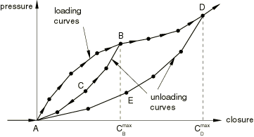

当垫片被压缩时，压力（或力或单位长度力）沿加载曲线给出的路径变化。如果垫片被卸载，例如在点 *B*，压力沿卸载曲线 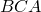 变化。卸载后重新加载遵循卸载曲线 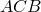，直到闭合变得大于 ，之后加载路径遵循加载曲线 。图中所示的箭头说明了此模型的加载/卸载路径。

##### 定义加载曲线

要以分段线性的形式定义加载曲线，您需要提供压力与弹性闭合的数据点，从点 *A* 开始。对于负弹性闭合，模型给出零压力（或力）。对于大于最后一个用户指定闭合的闭合，压力-闭合关系基于从用户指定数据计算的最后一个斜率外推。

| **输入文件用法：** | ``` [*GASKET THICKNESS BEHAVIOR](../key/key-link.md#usb-kws-mgasketnormal), TYPE=DAMAGE, DIRECTION=LOADING ``` |
| --- | --- |

| **Abaqus/CAE 用法：** | Property 模块：material editor：****其他****垫片****垫片厚度行为****：**类型：损伤**，**加载** |
| --- | --- |

##### 定义卸载曲线

要定义卸载曲线（、 等），您需要提供给定最大闭合（、 等）以下的压力（或力）与弹性闭合的数据点。您可以指定任意数量的卸载曲线。每个卸载曲线始终从点 *A* 开始，即零弹性闭合时零压力的点，因为损伤弹性模型不允许任何永久变形。如果从未指定卸载曲线的最大闭合进行卸载，则从相邻卸载曲线插值得到卸载。卸载曲线以归一化形式存储，以便它们在单位应力的单位弹性闭合处与加载曲线相交，并且在这些归一化曲线之间进行插值。如果未指定卸载曲线，加载/卸载将遵循加载曲线。

| **输入文件用法：** | ``` [*GASKET THICKNESS BEHAVIOR](../key/key-link.md#usb-kws-mgasketnormal), TYPE=DAMAGE, DIRECTION=UNLOADING ``` |
| --- | --- |

| **Abaqus/CAE 用法：** | Property 模块：material editor：****其他****垫片****垫片厚度行为****：**类型：损伤**，**卸载**，开启**包含用户指定的卸载曲线** |
| --- | --- |

##### 为具有初始间隙的单元定义行为

对于垫片中的载荷在垫片被压缩后不立即增加的情况（请参阅[图32.6.6-3](pt06ch32s06alm51.md#egasket-elastic-damage-gap)），您可以在垫片截面属性定义中指定初始间隙（请参阅["定义垫片单元的初始几何，" 第32.6.4节](pt06ch32s06alm49.md)），并定义就好像不存在初始间隙一样的加载/卸载曲线（图32.6.6-2的情况）。当许多垫片单元引用相同的垫片行为且唯一区别是初始间隙时，此方法很方便。

**图32.6.6-3** 带损伤和初始间隙的弹性模型

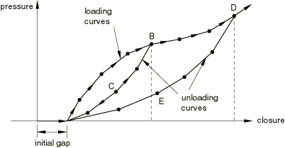

#### 定义非线性弹性-塑性模型

非线性弹性-塑性模型如图32.6.6-4所示。

**图32.6.6-4** 弹性-塑性模型


当垫片被压缩时，压力（或力）沿加载曲线 ）进行。卸载假定完全是弹性的。曲线  卸载曲线上的点 *D* 处的闭合量代表塑性闭合。卸载后重新加载遵循相同的曲线 ，直到垫片屈服，之后遵循加载曲线 。塑性变形一直持续到加载曲线上最后一个点 *M*。超过点 *M*，曲线  用于加载和卸载；此行为代表压碎垫片的行为，假定完全是弹性的，可以以分段线性的方式指定，甚至超过点 *M*。图中所示的箭头说明了弹性-塑性模型的加载/卸载路径。

Abaqus/Standard 将自动转换曲线，使卸载曲线成为给定塑性闭合的压力（或力）与弹性闭合的曲线。加载曲线将转换为在零塑性闭合处定义的弹性加载/卸载曲线（曲线的  部分）和屈服曲线（曲线的  部分）。默认情况下，屈服的开始（点 *B*）将在加载曲线从点 *A* 到点 *M* 移动时记录的 最大斜率下降10% 时获得。Abaqus/Standard 提供两种替代方法来覆盖此确定屈服开始的默认方法（见下文）。如果仅提供加载曲线，卸载将基于曲线 ，与塑性水平无关。

##### 定义加载曲线

要以分段线性的形式定义加载曲线，您需要提供压力（或力或单位长度力）与闭合（其中闭合代表弹性加塑性闭合）的数据点，从点 *A* 开始。给出的最后一个闭合值表示垫片假定被压碎时的闭合（[图32.6.6-4](pt06ch32s06alm51.md#egasket-elasto-plastic) 中的点 *M*）；此时，达到最大永久变形。对于负闭合，模型给出零压力（或力）。

要覆盖确定屈服开始的默认方法，您可以指定斜率下降的值（而不是默认的10%）或屈服开始的闭合值。指定的值必须对应于加载曲线上斜率下降的点。

| **输入文件用法：** | 使用以下选项定义加载曲线并使用确定屈服开始的默认方法： |
| --- | --- |
|  | ``` [*GASKET THICKNESS BEHAVIOR](../key/key-link.md#usb-kws-mgasketnormal), TYPE=ELASTIC-PLASTIC, DIRECTION=LOADING ``` 使用以下选项定义加载曲线并指定确定屈服开始的非默认斜率下降值： ``` [*GASKET THICKNESS BEHAVIOR](../key/key-link.md#usb-kws-mgasketnormal), TYPE=ELASTIC-PLASTIC, DIRECTION=LOADING, SLOPE DROP=*drop* ``` 使用以下选项定义加载曲线并指定确定屈服开始的闭合值： ``` [*GASKET THICKNESS BEHAVIOR](../key/key-link.md#usb-kws-mgasketnormal), TYPE=ELASTIC-PLASTIC, DIRECTION=LOADING, YIELD ONSET=*closure_value* ``` |

| **Abaqus/CAE 用法：** | Property 模块：material editor：****其他****垫片****垫片厚度行为****：**类型：弹性-塑性**，**加载**，**屈服开始方法：相对斜率下降** *drop* 或**屈服开始方法：闭合值** *closure_value* |
| --- | --- |

##### 定义卸载曲线

要定义卸载曲线（、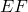 等），您需要为每个给定塑性闭合（点 *D*、*F* 等处的闭合）以递增的闭合值提供压力（或力或单位长度力）与闭合（弹性加塑性）的数据点。您可以指定任意数量的卸载曲线。如果从未指定卸载曲线的塑性闭合进行卸载，则从相邻卸载曲线插值得到卸载曲线。如果未指定卸载曲线，卸载假定遵循类似于加载曲线初始非线性弹性段的曲线。卸载曲线以归一化形式存储，以便它们在单位应力的单位弹性闭合处与屈服曲线相交，并且在这些归一化曲线之间进行插值。

如果加载曲线在屈服开始后包含高度非线性行为，则插值卸载可能会给出不合理的行为（例如，插值卸载路径越过用户定义的加载曲线）。您应指定尽可能多的用户定义卸载曲线，以创建插值卸载响应适当的区域。例如，[图32.6.6-5](pt06ch32s06alm51.md#egasket-ep-unloading) 说明加载曲线在屈服开始后很长时间内包含硬化斜率的急剧下降。

**图32.6.6-5** 具有复杂加载曲线的弹性-塑性行为

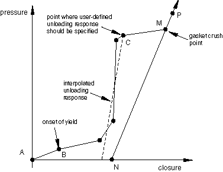

在这种情况下，仅在垫片压碎点（加载数据结束处）指定一个卸载曲线是不够的。如果要从点 *C* 卸载，卸载路径将越过加载路径。至少需要一条额外的卸载曲线，在硬化斜率急剧下降之后，以防止插值卸载路径越过加载曲线。

| **输入文件用法：** | ``` [*GASKET THICKNESS BEHAVIOR](../key/key-link.md#usb-kws-mgasketnormal), TYPE=ELASTIC-PLASTIC, DIRECTION=UNLOADING ``` |
| --- | --- |

| **Abaqus/CAE 用法：** | Property 模块：material editor：****其他****垫片****垫片厚度行为****：**类型：弹性-塑性**，**卸载**，开启**包含用户指定的卸载曲线** |
| --- | --- |

##### 为具有初始间隙的单元定义行为

对于垫片中的载荷在垫片被压缩后不立即增加的情况（请参阅[图32.6.6-6](pt06ch32s06alm51.md#egasket-elasto-plastic-gap)），您可以在垫片截面属性定义中指定初始间隙（请参阅["定义垫片单元的初始几何，" 第32.6.4节](pt06ch32s06alm49.md)），并定义就好像不存在初始间隙一样的加载/卸载曲线（图32.6.6-4的情况）。当许多垫片单元引用相同的垫片行为且唯一区别是初始间隙时，此方法很方便。

**图32.6.6-6** 带初始间隙的弹性-塑性模型

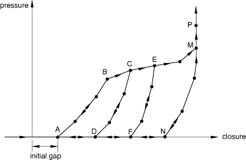

#### 厚度方向行为的数值稳定

上述损伤和弹性-塑性模型在零压力时具有零刚度。为了克服由此零刚度引起的数值问题，当从指定垫片厚度行为获得的压力为零时，Abaqus/Standard 自动在垫片厚度方向添加小的刚度（默认情况下，等于初始压缩刚度的103倍）。这种数值稳定性确保垫片单元在完全卸载时始终返回到其无应力厚度。因此，如果垫片表面被拉开，将从稳定过程产生小的力。您可以更改默认刚度。

| **输入文件用法：** | ``` [*GASKET THICKNESS BEHAVIOR](../key/key-link.md#usb-kws-mgasketnormal), DIRECTION=LOADING, TENSILE STIFFNESS FACTOR=*factor* ``` |
| --- | --- |

| **Abaqus/CAE 用法：** | Property 模块：material editor：****其他****垫片****垫片厚度行为****：**加载**，**拉伸刚度因子：** *factor* |
| --- | --- |

### 定义垫片的横向剪切行为

您可以定义垫片的弹性横向剪切刚度。Abaqus/Standard 测量垫片单元底面和顶面之间沿局部2或3方向的相对位移来定义垫片中的横向剪切。因此，您应始终将弹性横向刚度定义为应力（或力或单位长度力）每单位位移。您可以将刚度指定为温度和场变量的函数。对于1-2平面中的剪切和1-3平面中的剪切，使用相同的刚度。对于每组温度和/或场变量，如果未明确定义横向剪切行为，则将使用垫片厚度方向行为初始加载曲线的第一个斜率来计算横向剪切刚度。

| **输入文件用法：** | ``` [*GASKET ELASTICITY](../key/key-link.md#usb-kws-mgasketelastic), COMPONENT=TRANSVERSE SHEAR, DEPENDENCIES ``` |
| --- | --- |

| **Abaqus/CAE 用法：** | Property 模块：material editor：****其他****垫片****垫片横向剪切弹性**** |
| --- | --- |

#### 选择用于定义横向剪切行为的单位系统

横向剪切刚度以应力每单位位移、力每单位位移或单位长度力每单位位移的单位定义。用于定义横向剪切行为的单位系统必须与用于厚度方向行为的单位系统一致。

##### 以应力每单位位移的单位提供刚度

您可以为所有垫片单元类型以应力每单位位移的单位定义横向剪切刚度。刚度将用于计算横向剪切应力，可用于输出或可视化。

| **输入文件用法：** | ``` [*GASKET ELASTICITY](../key/key-link.md#usb-kws-mgasketelastic), COMPONENT=TRANSVERSE SHEAR, VARIABLE=STRESS ``` |
| --- | --- |

| **Abaqus/CAE 用法：** | Property 模块：material editor：****其他****垫片****垫片横向剪切弹性****：**单位：应力** |
| --- | --- |

##### 以其他单位提供刚度

您只能为链接单元和三维线单元以力（或单位长度力）每单位位移的单位定义横向剪切刚度。此方法适用于垫片在1-2或1-3平面中的横截面随变形变化很大的情况，因为用完整的二维或三维模型来模拟这种变形机制成本太高，如前所述。

使用二维或三维链接单元时，必须以力每单位位移的单位指定刚度。Abaqus/Standard 将使用此刚度计算横向剪切力，可用于输出或可视化。使用轴对称链接单元和三维线单元时，必须以单位长度力每单位位移的单位指定刚度。Abaqus/Standard 将使用此刚度计算单位长度横向剪切力，可用于输出或可视化。

| **输入文件用法：** | ``` [*GASKET ELASTICITY](../key/key-link.md#usb-kws-mgasketelastic), COMPONENT=TRANSVERSE SHEAR, VARIABLE=FORCE ``` |
| --- | --- |

| **Abaqus/CAE 用法：** | Property 模块：material editor：****其他****垫片****垫片横向剪切弹性****：**单位：力** |
| --- | --- |

### 定义垫片的膜行为

您可以通过给出杨氏模量和泊松比来定义垫片的线性弹性行为。这些数据可以作为温度和/或场变量的函数提供。如果未指定垫片的线性弹性行为，则垫片没有膜刚度。在这种情况下，您必须确保单元的节点在垫片厚度方向的正交方向上被充分约束。

| **输入文件用法：** | ``` [*GASKET ELASTICITY](../key/key-link.md#usb-kws-mgasketelastic), COMPONENT=MEMBRANE, DEPENDENCIES ``` |
| --- | --- |

| **Abaqus/CAE 用法：** | Property 模块：material editor：****其他****垫片****垫片膜弹性**** |
| --- | --- |

### 为膜和厚度方向行为定义热膨胀

您可以定义各向同性热膨胀，为膜和厚度方向行为指定相同的热膨胀系数。

或者，您可以定义正交各向异性热膨胀来指定三个不同的热膨胀系数。第一个系数将适用于垫片厚度方向的热膨胀；其他两个系数将分别适用于垫片在局部2和3方向上的膨胀。

膜热应变 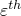 的获得如["热膨胀，" 第26.1.2节](pt05ch26s01abm52.md)中所述。Abaqus/Standard 计算厚度方向的闭合如下


以便"机械"闭合由下式获得

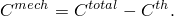

您可以将初始间隙和初始空隙指定为垫片截面定义的一部分；初始厚度直接从垫片单元的节点坐标获得，或者您可以将其指定为垫片截面定义的一部分（请参阅["定义垫片单元的初始几何，" 第32.6.4节](pt06ch32s06alm49.md)）。

如果使用用户子程序 [`UEXPAN`](../sub/sub-link.md#sub-xsl-uexpan) 来定义垫片的热膨胀，则必须在子程序中提供增量热应变。热闭合将从厚度方向的热应变获得，如上所述。

| **输入文件用法：** | 使用以下任一选项直接定义热膨胀： |
| --- | --- |
|  | ``` [*EXPANSION](../key/key-link.md#usb-kws-mexpansion), TYPE=ISO [*EXPANSION](../key/key-link.md#usb-kws-mexpansion), TYPE=ORTHO ``` 使用以下任一选项在用户子程序 [`UEXPAN`](../sub/sub-link.md#sub-xsl-uexpan) 中定义热膨胀： ``` [*EXPANSION](../key/key-link.md#usb-kws-mexpansion), TYPE=ISO, USER [*EXPANSION](../key/key-link.md#usb-kws-mexpansion), TYPE=ORTHO, USER ``` |

| **Abaqus/CAE 用法：** | Property 模块：material editor：****机械****膨胀****：**使用用户子程序 UEXPAN**（可选） |
| --- | --- |

### 为厚度方向行为定义蠕变行为

只有当使用弹性-塑性模型（请参阅上面的["定义非线性弹性-塑性模型](pt06ch32s06alm51.md#usb-elm-egasketbehavior-thickness-elastplast)"）时，才能定义垫片厚度方向的蠕变行为。蠕变闭合速率将获得为


其中 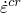 如["率相关塑性：蠕变和膨胀，" 第23.2.4节](pt05ch23s02abm20.md)中所述获得。您可以将初始间隙和初始空隙指定为垫片截面定义的一部分；初始厚度直接从垫片单元的节点坐标获得，或者您可以将其指定为垫片截面定义的一部分（请参阅["定义垫片单元的初始几何，" 第32.6.4节](pt06ch32s06alm49.md)）。

如果使用用户子程序 [`CREEP`](../sub/sub-link.md#sub-xsl-creep) 来定义垫片的率相关厚度方向响应，则必须在子程序中提供压缩蠕变应变增量。蠕变闭合将从蠕变应变获得，如上所述。

| **输入文件用法：** | 使用以下选项直接定义蠕变行为： |
| --- | --- |
|  | ``` [*CREEP](../key/key-link.md#usb-kws-mcreep) ``` 使用以下选项在用户子程序 [`CREEP`](../sub/sub-link.md#sub-xsl-creep) 中定义蠕变行为： ``` [*CREEP](../key/key-link.md#usb-kws-mcreep), LAW=USER ``` |

| **Abaqus/CAE 用法：** | Property 模块：material editor：****机械****塑性****蠕变****：**定律：用户定义**（可选） |
| --- | --- |

### 为厚度方向行为定义粘弹性行为

只有当使用弹性-损伤模型（请参阅上面的["定义带损伤的非线性弹性模型](pt06ch32s06alm51.md#usb-elm-egasketbehavior-thickness-elastdamage)"）时，才能定义垫片厚度方向的粘弹性行为。仅支持频域粘弹性行为。此行为对于模拟汽车部件（如垫片）在某些预加载基态周围的稳态动态响应很有用，例如在非线性密封分析结束时获得的响应，以确定系统的噪声-振动-粗糙度（NVH）特性。

在非线性密封分析步骤期间，频域粘弹性行为被忽略，材料响应由材料的长期弹性特性决定。人们普遍认为（Zubeck and Marlow, 2002），汽车部件（如垫片和垫圈）的动态刚度和阻尼特性随激励频率以及预载水平而变化。这些结构特性也取决于垫片的几何形状和约束水平。此功能允许直接指定这些动态特性，即厚度方向的等效存储和损耗模量，作为激励频率和预载水平的表格函数。预载由基态下所需稳态动态响应所对应的闭合量来量化。

在确定垫片的动态响应时，长期弹性响应假定由带损伤的非线性弹性模型定义。稳态动态响应假定是这个弹性损伤行为在一定闭合值下的基态的扰动。粘弹性响应可以使用两种方法指定，如下所述。

#### 直接指定属性

第一种方法涉及直接（表格）指定厚度方向损耗和存储模量，作为不同闭合水平下激励频率的函数。

| **输入文件用法：** | ``` [*VISCOELASTIC](../key/key-link.md#usb-kws-mviscoelast), TYPE=TRACTION, PRELOAD=UNIAXIAL ``` |
| --- | --- |

| **Abaqus/CAE 用法：** | Property 模块：material editor：****机械****弹性****粘弹性****：**域：频率**和**频率：表格** |
| --- | --- |

#### 以比率形式指定属性

第二种方法允许指定厚度方向存储模量和损耗模量与长期厚度方向弹性模量的比率。这些比率可以指定为激励频率的表格函数，但假定与闭合量无关。任何给定闭合水平下的实际存储或损耗模量通过将适当比率乘以当前闭合值（基态的）的长期弹性模量来计算。请参阅["频域粘弹性，" 第22.7.2节](pt05ch22s07abm13.md)，了解在连续体材料粘弹性特性背景下第二种方法的总结（这里使用的方法只是那里给出的更通用方法的一维特例）。

| **输入文件用法：** | ``` [*VISCOELASTIC](../key/key-link.md#usb-kws-mviscoelast), TYPE=TRACTION ``` |
| --- | --- |

| **Abaqus/CAE 用法：** | Property 模块：material editor：****机械****弹性****粘弹性****：**域：频率**和**频率：表格** |
| --- | --- |

### 定义平均接触压力输出的接触面积

当垫片的厚度方向行为以力或单位长度力与闭合来定义时，Abaqus/Standard 将提供厚度方向力或单位长度力作为输出变量 S11。在这种情况下，您可以定义接触宽度或接触面积与闭合的关系曲线，该曲线将用于在每个积分点获得平均"接触"压力作为输出变量 CS11。此平均压力考虑了由于垫片变形而发生的接触面积变化，如[图32.6.6-1](pt06ch32s06alm51.md#egasket-complex-def)所示。输入此曲线的闭合对应于总机械闭合，定义为弹性、塑性和蠕变闭合的总和。

当使用二维和三维链接垫片单元时，应以表格形式指定接触面积与机械闭合的关系。当使用轴对称链接和三维线单元时，应以表格形式指定接触宽度与机械闭合的关系。典型曲线如图32.6.6-7所示。

**图32.6.6-7** 用于平均压力输出的接触面积与机械闭合的规格

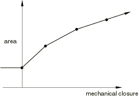

您必须指定零闭合时的面积，然后是递增闭合时的面积。当机械闭合为负时，面积是恒定的，如果闭合达到大于最后一个用户指定闭合的值，则从最后两个用户指定数据点计算的斜率外推。面积与闭合曲线可以作为温度和场变量的函数提供。

| **输入文件用法：** | ``` [*GASKET CONTACT AREA](../key/key-link.md#usb-kws-mgasketcontactarea), DEPENDENCIES ``` |
| --- | --- |

| **Abaqus/CAE 用法：** | Property 模块：material editor：****其他****垫片****垫片厚度行为****：**单位：力**，****子选项****接触面积**** |
| --- | --- |

### 直接定义的垫片行为的具体输出

输出变量 E 通常在 Abaqus/Standard 中用于输出应变。对于由垫片行为模型定义行为的垫片单元，此输出变量具有位移和膜应变单位的厚度方向和横向剪切分量。输出变量 NE 用于输出有效应变。有效应变分量计算如下：


输出变量 THE、PE 或 CE 也可以用于垫片单元分别输出广义热应变、塑性应变或蠕变应变。

对于所有应力/应变输出变量，11分量指的是贯穿厚度方向；22、33和23分量分别指两个直接和一个剪切膜分量；其余12和13分量指横向剪切分量。有关这些定义的详细信息，请参阅["垫片单元：概述，" 第32.6.1节](pt06ch32s06abo30.md)。

弹性应变能（输出变量 ALLSE）的输出还包括由于损伤或塑性变化而导致的能量。因此，此能量通常不可完全恢复。

#### 额外参考

- Zubeck, M. W., and R. S. Marlow, "Local-Global Finite Element Analysis for Cam Cover Noise Reduction," Society of Automotive Engineering, Inc., no.SAE 2003--01--1725, 2003.


