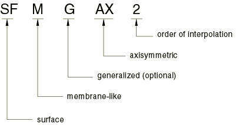
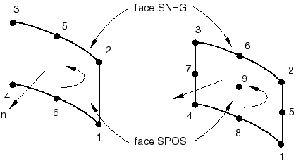

# 32.7.1 表面单元


**产品：** Abaqus/Standard  Abaqus/Explicit  Abaqus/CAE  Abaqus/Aqua

##### **参考文献**

- ["通用表面单元库，" 第32.7.2节](pt06ch32s07ael36.md)
- ["圆柱表面单元库，" 第32.7.3节](pt06ch32s07ael37.md)
- ["轴对称表面单元库，" 第32.7.4节](pt06ch32s07ael38.md)
- [*SURFACE SECTION](../key/key-link.md#usb-kws-msurfacesection)
- ["创建表面截面，" Abaqus/CAE 用户指南第12.13.9节](../usi/usi-link.md#usi-prp-section-surface)

### 概述

表面单元：
- 像膜单元一样定义——作为空间中的表面；
- 没有固有刚度；
- 可能具有单位面积质量；
- 可用于定义刚体；
- 可用于定义表面和基于表面的绑定约束；
- 像零厚度膜单元一样行为；
- 可与钢筋层一起使用；
- 可以嵌入固体单元中；
- 只能传递面内力；并且
- 没有弯曲刚度或横向剪切刚度。

### 典型应用

表面单元在几种特殊建模情况下很有用：
- 它们用于承载钢筋层以表示固体结构中的薄加强组件。钢筋层的刚度和质量被添加到表面单元（请参阅["定义钢筋，" 第2.2.3节](pt01ch02s02aus13.md)）。增强的表面单元也可以嵌入"宿主"固体单元中（请参阅["嵌入单元，" 第35.4.1节](pt08ch35s04aus136.md)）。
- 它们用于将附加质量引入模型，以单位面积质量的形式；例如，将燃料罐中的燃料质量扩散到罐表面，特别是当罐用固体单元建模时。
- 它们用于指定约束中使用的表面，当该表面没有结构特性时。
- 当与基于表面的绑定约束结合使用时，它们用于指定分布表面载荷，如入射波载荷，作用于梁单元。
- 在 Abaqus/Explicit 中（当与基于表面的绑定约束结合使用时），它们可用于在梁单元上指定复杂表面以进行一般接触。用于强制接触约束的罚弹簧刚度大致与表面节点的质量成比例。如果表面节点没有质量，则不会强制执行接触。
- 在 Abaqus/Explicit 中，它们可用于定义表面流体腔（surface-based fluid cavity）的全部或部分边界（例如，请参阅["流体静力流体单元：模拟空气弹簧，" Abaqus 例题指南第1.1.9节](../exa/exa-link.md#exa-sta-hydrofluidairspring)）。
- 在 Abaqus/Aqua 分析中，它们可用于可视化重力波。

### 选择适当的单元

除了在 Abaqus/Standard 和 Abaqus/Explicit 中都可用的通用表面单元外，Abaqus/Standard 中还提供圆柱表面单元和轴对称表面单元。

#### 通用表面单元

通用表面单元应用于三维模型，其中结构的变形可以在三个维度上演化。

#### 圆柱表面单元

Abaqus/Standard 中提供圆柱表面单元，用于精确建模具有圆形几何形状的结构区域，例如轮胎。这些单元利用三角函数在圆周方向上插值位移，并在面内方向使用常规等参数插值。它们在圆周方向上使用三个节点，可以跨越0到180之间的段。面内方向有一阶和二阶插值的单元可用。

元素的几何形状通过在全球笛卡尔坐标系中指定节点坐标来定义。

这些单元可以与常规表面单元使用相同的网格。它们也可以嵌入通用固体和圆柱单元中。

#### 轴对称表面单元

Abaqus/Standard 中提供的轴对称表面单元分为两类：不允许绕对称轴扭转的单元和允许扭转的单元。这些单元分别称为常规和广义轴对称表面单元。

广义轴对称表面单元（带扭转的轴对称表面单元）允许载荷的周向分量，这可能导致绕对称轴的扭转。周向载荷分量与周向坐标  无关。由于载荷对周向坐标没有依赖性，变形是轴对称的。

广义轴对称表面单元不能用于动态或特征频率提取过程。

### 命名约定

表面单元的命名约定取决于单元维数。

#### 通用表面单元

Abaqus 中的通用表面单元命名如下：


例如，SFM3D4R 是具有减缩积分的三维4节点表面单元。

#### 圆柱表面单元

Abaqus/Standard 中的圆柱表面单元命名如下：


例如，SFMCL6 是具有圆周插值的6节点圆柱表面单元。

#### 轴对称表面单元

Abaqus/Standard 中的轴对称表面单元命名如下：



例如，SFMAX2 是常规二次插值表面单元。

### 单元法线定义

表面单元的"顶"表面是沿正法线方向的表面，用于接触定义时称为 SPOS 面。"底"表面是沿法线负方向的表面，用于接触定义时称为 SNEG 面。

#### 通用表面单元

对于通用表面单元，正法线方向由元素定义中指定节点的顺序绕节点时的右手定则定义。请参阅[图32.7.1-1](pt06ch32s07alm52.md#esurface-gen-normal)。

**图32.7.1-1** 通用表面单元的正法线


#### 圆柱表面单元

正法线方向由元素定义中指定节点的顺序绕节点时的右手定则定义。请参阅[图32.7.1-2](pt06ch32s07alm52.md#esurface-cyl-normal)。

**图32.7.1-2** 圆柱表面单元的正法线



#### 轴对称表面单元

对于轴对称表面单元，正法线由从节点1到节点2的方向逆时针旋转90度定义。请参阅[图32.7.1-3](pt06ch32s07alm52.md#esurface-axi-normal)。

**图32.7.1-3** 轴对称表面单元的正法线


### 定义单元的截面属性

您必须将表面截面属性与模型的区域相关联。

| **输入文件用法：** | ``` [*SURFACE SECTION](../key/key-link.md#usb-kws-msurfacesection), ELSET=*name* ``` |
| --- | --- |
|  | 其中 ELSET 参数引用一组表面单元。 |

| **Abaqus/CAE 用法：** | Property 模块：**Create Section**：选择**Shell**作为截面**类别**和**Surface**作为截面**类型** ****Assign****Section****：选择区域 |
| --- | --- |

#### 使用表面单元承载钢筋层

您可以定义由表面单元承载的钢筋层。钢筋层引起的刚度和质量被添加到表面单元。

| **输入文件用法：** | 使用以下两个选项： |
| --- | --- |
|  | ``` [*SURFACE SECTION](../key/key-link.md#usb-kws-msurfacesection), ELSET=*name* [*REBAR LAYER](../key/key-link.md#usb-kws-mrebarlayer) ``` |

| **Abaqus/CAE 用法：** | Property 模块：**Create Section**：选择**Shell**作为截面**类别**和**Surface**作为截面**类型**，**钢筋层** |
| --- | --- |

#### 使用表面单元将附加质量引入模型

您可以定义由表面单元承载的单位面积质量。

| **输入文件用法：** | ``` [*SURFACE SECTION](../key/key-link.md#usb-kws-msurfacesection), ELSET=*name*, DENSITY=*number* ``` |
| --- | --- |

| **Abaqus/CAE 用法：** | Property 模块：**Create Section**：选择**Shell**作为截面**类别**和**Surface**作为截面**类型**，开启**Density**：*number* |
| --- | --- |

#### 在约束中使用表面单元

表面单元可用于在 Abaqus 中定义表面，此表面可用于基于表面的绑定约束（请参阅["网格绑定约束，" 第35.3.1节](pt08ch35s03aus132.md)）。

| **输入文件用法：** | 使用以下选项： |
| --- | --- |
|  | ``` [*SURFACE](../key/key-link.md#usb-kws-msurface), NAME=*surface_name* [*TIE](../key/key-link.md#usb-kws-mtie), NAME=*name* *surface_name*, *master_name* ``` |

| **Abaqus/CAE 用法：** | 在 Abaqus/CAE 中，当系统提示您选择表面时，您可以直接在视口中选择一个或多个面。此外，您可以使用 Surface 工具将面和边的集合定义为表面。 |
| --- | --- |
|  | Interaction 模块：**Create Constraint**：**Tie** |

#### 使用表面单元可视化重力波

您可以定义位于静水高度处的表面单元集，以在 Abaqus/Aqua 分析期间可视化重力波。

| **输入文件用法：** | ``` [*SURFACE SECTION](../key/key-link.md#usb-kws-msurfacesection), ELSET=*name*, AQUAVISUALIZATION=YES ``` |
| --- | --- |

| **Abaqus/CAE 用法：** | 在 Abaqus/CAE 中不支持指定用于可视化的波浪表面。 |
| --- | --- |


