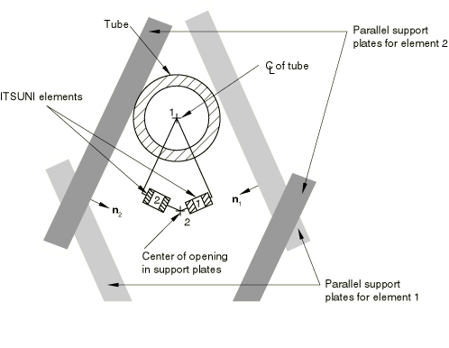

# 32.8.1 管支撑单元


**产品：** Abaqus/Standard

##### **参考文献**

- ["管支撑单元库，" 第32.8.2节](pt06ch32s08ael39.md)
- [*ITS](../key/key-link.md#usb-kws-mits)
- [*DASHPOT](../key/key-link.md#usb-kws-mdashpot)
- [*FRICTION](../key/key-link.md#usb-kws-hfriction)
- [*SPRING](../key/key-link.md#usb-kws-mspring)

### 概述

管支撑单元：
- 用于模拟管与紧密相邻的管支撑之间的相互作用，适用于管与支撑之间可能发生间歇性接触的情况；并且
- 由弹簧/摩擦连杆（用于模拟管与支撑之间的直接接触）和并联阻尼器（用于模拟管与支撑之间环形空间中流体的影响）组成，如[图32.8.1-1](pt06ch32s08alm53.md#eits-elem-behav)所示。

元素公式的详细信息可在["管支撑单元，" Abaqus 理论指南第3.9.4节](../stm/stm-link.md#stm-elm-tubetubeelem)中找到。

### 典型应用

ITSCYL 元素可用于模拟钻孔支撑（请参阅[图32.8.1-2](pt06ch32s08alm53.md#eits-drilled-hole)）。

多个 ITSUNI 元素可以连接到代表管的梁单元的同一节点，以模拟由一系列直线段组成的管支撑的情况，如"蛋盒"设计（请参阅[图32.8.1-3](pt06ch32s08alm53.md#eits-egg-crate)）。

### 选择适当的单元

提供了两种类型的管支撑单元。

#### ITSUNI 单元

ITSUNI 是一个"单向"单元，始终在空间中的固定方向上作用。元素的一个节点必须位于管的轴线上，管用梁单元建模；另一个节点必须位于两个平行支撑板之间的等距位置。支撑板内置于 ITSUNI 元素定义中。

**图32.8.1-1** 管支撑单元行为


#### ITSCYL 单元

ITSCYL 是一个"圆柱"单元，可用于模拟圆形管与圆形孔之间的相互作用。元素的一个节点必须位于管的轴线上，管用梁单元建模；另一个节点必须位于圆形管支撑板孔的中心。圆孔内置于 ITSCYL 元素定义中。

**图32.8.1-2** ITSCYL 单元用于钻孔支撑


**图32.8.1-3** ITSUNI 单元用于"蛋盒"支撑



### 定义 ITS 单元的行为

您需要定义管的直径和其他定义 ITS 元素的几何量。您必须将这些量与一组 ITS 元素相关联。此外，您必须定义构成管支撑单元的弹簧、摩擦连杆和阻尼器的行为。

ITS 元素的弹簧行为如图32.8.1-4所示。元素中的相对位移是从管和支撑板孔完全对齐的位置测量的——当元素的节点位于同一位置时。如[图32.8.1-4](pt06ch32s08alm53.md#tube-tube-elem)所示，ITS 元素的弹簧行为相对于分配的弹簧定义进行了修改，以考虑当元素节点位于同一位置时管与支撑之间的任何间隙。当管与支撑之间没有接触时，弹簧不传递任何力；当管与支撑接触时，力随着管壁的变形而增加。此力可以建模为管轴线与支撑孔中心之间相对位移的线性或非线性函数。

如果管直径大于零且孔尺寸大于零，则管与支撑之间的摩擦将在管节点处产生力矩。ITS 元素任何将承受力矩的节点应满足以下至少一个条件：
- 该节点应与能够承受力矩的梁或其他单元相关联；
- 节点旋转应通过边界条件设置为零。

| **输入文件用法：** | 使用以下选项定义 ITS 单元的行为： |
| --- | --- |
|  | ``` [*ITS](../key/key-link.md#usb-kws-mits), ELSET=*name* [*DASHPOT](../key/key-link.md#usb-kws-mdashpot) [*SPRING](../key/key-link.md#usb-kws-mspring) [*FRICTION](../key/key-link.md#usb-kws-hfriction) ``` |

**图32.8.1-4** ITS 单元中模拟间隙和管扁平化的非线性弹簧行为


