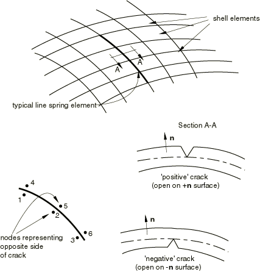

# 32.9.1 用于建模壳体中部分穿透裂纹的线弹簧单元


**产品：** Abaqus/Standard

##### **参考文献**

- ["线弹簧单元库，" 第32.9.2节](pt06ch32s09ael40.md)
- [*SHELL SECTION](../key/key-link.md#usb-kws-mshellsection)
- [*SURFACE FLAW](../key/key-link.md#usb-kws-msurfaceflaw)

### 概述

线弹簧单元：
- 用于低成本评估壳体中的部分穿透裂纹（缺陷）；
- 与壳单元一起使用；
- 可与弹性或弹塑性（等向强化，冯·米塞斯屈服）材料行为一起使用；
- 不包括热应变效应；
- 仅适用于小位移分析（不包括大旋转效应）；
- 在线性扰动步骤中不可用；
- 使用相当重要的近似（特别是弹塑性情况），因此应谨慎使用；
- 对于裂纹深度小于壳厚度2%或大于95%的情况不提供有用的结果；并且
- 在缺陷末端或缺陷深度随位置快速变化的地点不会提供准确的结果，因为这些区域的解具有三维性质。

### 典型应用

线弹簧单元对壳体中的部分穿透裂纹进行低成本评估。其基本概念是这些单元将局部解（由裂纹尖端的奇异性主导）引入未裂纹几何形状的壳模型。这是通过允许模型沿裂纹线具有额外的自由度来实现的，该自由度由线弹簧单元提供，如图32.9.1-1所示。

**图32.9.1-1** 线弹簧模型



线弹簧相对于这些额外自由度的柔度将局部解嵌入全局响应中。从与该柔度共轭的相对位移和旋转，Abaqus/Standard 计算并打印出线弹簧单元积分点处的 J 积分，以及线性情况下的应力强度因子。因为单元很简单，所以分析并不比未裂纹几何形状的壳分析贵多少。结果对许多常见应用提供可接受的精度。

有关这些单元背后理论的详细信息，请参阅["线弹簧单元，" Abaqus 理论指南第3.9.5节](../stm/stm-link.md#stm-elm-linesprings)。

### 选择适当的单元

提供了两个版本的单元——两者都旨在与二阶壳单元（S8R、S8R5、S9R5）一起使用。线弹簧单元 LS6 用于一般情况，而线弹簧单元 LS3S 用于缺陷位于对称平面上且仅对对称平面的一侧进行建模的情况。

### 定义单元的截面属性

您必须将壳截面属性与一组线弹簧单元相关联。

| **输入文件用法：** | ``` [*SHELL SECTION](../key/key-link.md#usb-kws-mshellsection), ELSET=*name* ``` |
| --- | --- |

#### 定义恒定截面厚度

您可以将恒定截面厚度定义为线弹簧单元的壳截面定义的一部分。

| **输入文件用法：** | ``` [*SHELL SECTION](../key/key-link.md#usb-kws-mshellsection) *shell thickness* ``` |
| --- | --- |

#### 定义可变截面厚度

或者，您可以定义具有连续变化厚度的线弹簧单元，并在节点处指定线弹簧单元的厚度。在这种情况下，您指定的任何恒定截面厚度都将被忽略，线弹簧厚度将从节点插值（请参阅["节点厚度，" 第2.1.3节](pt01ch02s01aus07.md)）。必须在连接到元素的所有节点处定义厚度。

| **输入文件用法：** | 使用以下两个选项： |
| --- | --- |
|  | ``` [*SHELL SECTION](../key/key-link.md#usb-kws-mshellsection), NODAL THICKNESS [*NODAL THICKNESS](../key/key-link.md#usb-kws-mnodalthickness) ``` |

#### 为一组线弹簧单元分配材料定义

您必须将材料定义与每个壳截面定义相关联。

线弹簧单元可与各向同性弹性或弹塑性（等向强化，冯·米塞斯屈服）材料行为一起使用（["线性弹性行为，" 第22.2.1节](pt05ch22s02abm02.md)和["经典金属塑性，" 第23.2.1节](pt05ch23s02abm17.md)）；这些是与之相关的唯一材料行为定义。弹性行为必须是各向同性的。塑性仅包含在I型（裂纹张开）响应中；弹塑性分析仅在I型行为主导时才是准确的。

整个截面必须使用相同的材料：不能使用线弹簧定义分层截面。线弹簧单元中不包括热应变效应；但是，大部分热应变发生在壳中，因此在许多情况下这并不重要（在线弹簧所做的近似范围内）。

| **输入文件用法：** | ``` [*SHELL SECTION](../key/key-link.md#usb-kws-mshellsection), ELSET=*name*, MATERIAL=*name* ``` |
| --- | --- |

### 定义缺陷

缺陷通过沿裂纹前缘在每个节点处指定其深度来定义。您必须识别裂纹是否源自壳的正表面或负表面（正表面位于壳中面沿表面法线正距离的位置，如图32.9.1-1所示）。

在表面缺陷深度非常小或为零的点上，线弹簧单元的柔度也非常小。为了避免将小柔度反演形成刚度时出现数值问题，Abaqus/Standard 使用的最小表面缺陷深度为线弹簧单元指定厚度的2%，即使您指定了更小的表面缺陷深度。如果您想将表面缺陷深度为零的两个节点约束为具有相同的位移，您应该用线性约束方程或多点约束将节点绑定在一起（["运动约束：概述，" 第35.1.1节](pt08ch35s01abo32.md)）。这通常不是必需的。

| **输入文件用法：** | ``` [*SURFACE FLAW](../key/key-link.md#usb-kws-msurfaceflaw), SIDE=POSITIVE or NEGATIVE *node number or node set label*, *crack depth* ... ``` |
| --- | --- |

### 定义包含缺陷的壳模型

您必须在截面定义中指定壳的未裂纹厚度。缺陷处壳的几何形状（坐标和表面法线）以常规方式给出。

### 包括裂纹面上压力载荷的影响

裂纹通常出现在承受压力的表面上；要包括此类载荷对裂纹面的影响，提供了合适的分布载荷类型。这些载荷类型不适用于弹塑性线弹簧，因为为压力计算的节点等效力基于仅在线性弹性情况下有效的叠加方法。

### J 积分输出

如果材料仅是线性弹性的，则输出 J 积分值和应力强度因子；对于弹塑性情况，还提供局部值  和  以及它们之和到单个 J 值。在这种情况下，仅当  远大于  时，J 值才会有可接受的精度。请参阅["线弹簧单元，" Abaqus 理论指南第3.9.5节](../stm/stm-link.md#stm-elm-linesprings)，了解更多详细信息。


