# 32.10.1 弹塑性关节


**产品：** Abaqus/Aqua

##### **参考文献**

- [*EPJOINT](../key/key-link.md#usb-kws-mepjoint)
- ["弹塑性关节单元库，" 第32.10.2节](pt06ch32s10ael41.md)

### 概述

JOINT2D 和 JOINT3D 单元：
- 仅在与 Abaqus/Standard 结合使用的 Abaqus/Aqua 中可用（["Abaqus/Aqua 分析，" 第6.11.1节](pt03ch06s11at30.md)）；
- 可用于模拟结构构件之间的柔性关节或桩靴与海底之间的相互作用；
- 仅对小位移和旋转有效；并且
- 可以是纯弹性或弹塑性的。

### 弹塑性关节单元

Abaqus/Standard 提供 JOINT2D 和 JOINT3D 单元，用于模拟结构构件之间或结构构件与固定支撑之间的关节。它们可用于 Abaqus/Aqua 分析中，模拟海上应用中 jack-up 基础分析中"桩靴"与海底之间的相互作用。

关节有两个节点。如果关节位于结构构件与固定支撑之间，则其中一个节点应被完全约束（使用边界条件）。

#### 运动学和局部坐标系

关节的变形通过关节"应变"来表征，即关节节点之间的相对位移和旋转。关节必须与用户定义的局部方向系统相关联（请参阅["方向，" 第2.2.5节](pt01ch02s02aus15.md)），该系统由三个正交方向定义：、 和 。

当关节因两个节点的相对伸长或旋转而变形时，它通过向节点施加大小相等方向相反的力和/或力矩来响应。这些力和力矩，或关节"应力"，可以是"应变"的线性（弹性）或非线性（弹塑性）函数，这取决于关节使用的本构模型类型。

应力和应变命名如图32.10.1-1所示。正应力表示拉力；正应变表示伸长。

**图32.10.1-1** 关节单元的局部轴定义


即使请求了几何非线性分析（["几何非线性"在"常规和线性扰动过程，" 第6.1.3节](pt03ch06s01aus44.md#usb-anl-alinearnonlinear-nlgeom)），单元运动学也是在小相对位移和小旋转的假设下定义的；因此，当这些假设被违反时，不应使用这些单元。如果需要大旋转且没有塑性，可以使用 JOINTC 单元（请参阅["柔性关节单元，" 第32.3.1节](pt06ch32s03alm39.md)）。

"拉伸"应变通过以下方式定义


"弯曲"应变通过以下方式定义

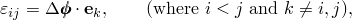

其中

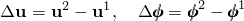

分别是关节两个节点的相对位移和相对旋转。

对于二维单元，仅存在轴向应变 、 和弯曲应变 。对于三维单元，所有六个分量都存在。

| **输入文件用法：** | 使用以下选项将局部方向系统与弹塑性关节单元相关联： |
| --- | --- |
|  | ``` [*EPJOINT](../key/key-link.md#usb-kws-mepjoint), ORIENTATION=*name* ``` |

#### 关节本构模型

关节弹性的弹性模量可以通过两种方式之一输入。您可以指定力/力矩与弹性伸长之间的一般各向异性关系。或者，您可以输入特定于桩靴的模量；弹性刚度矩阵是对角的，取决于土壤表面处桩靴的直径 D，如果定义了桩靴塑性且桩靴是锥形的，则该直径可以变化。有关详细信息，请参阅下面的["关节弹性模型](pt06ch32s10alm55.md#usb-elm-eepjoint-elasticity)"。

提供了三种关节塑性模型。其中两种特定于桩靴。第三种是用于结构关节或构件的抛物线模型。请参阅下面的["关节塑性](pt06ch32s10alm55.md#usb-elm-eepjoint-plasticity)"。

如果包含塑性，则假定塑性发生在局部1-2平面中，因此唯一的非零塑性应变为 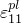、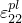 和 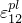。假定3方向上的塑性可以忽略。在三维模型中，1-2平面外的应变产生纯弹性响应。

如果使用结构关节或构件的抛物线塑性模型，则1方向是沿构件的轴向，而2方向是横向（请参阅[图32.10.1-1](pt06ch32s10alm55.md#eepjoint-local-axis)）。在桩靴塑性模型中，1方向是垂直方向，2方向是可能发生塑性伸长的水平方向。在三维模型中，3方向是仅能发生弹性伸长的水平方向。

可以使用弹性模型和塑性模型的任何组合。例如，通常桩靴弹性模量将与桩靴塑性一起使用，但允许使用一般模量与桩靴塑性。

如果在三维模型中使用塑性，则不允许通过弹性模量在1-2平面中的应变或应力（、）与剩余的平面外应变（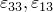、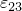）之间进行耦合。因此，在这种情况下，许多一般弹性模量必须设置为零。

| **输入文件用法：** | 在相关的 [*EPJOINT](../key/key-link.md#usb-kws-mepjoint) 选项之后立即使用以下一个或两个选项来定义关节本构模型： |
| --- | --- |
|  | ``` [*JOINT ELASTICITY](../key/key-link.md#usb-kws-mjointelastic) [*JOINT PLASTICITY](../key/key-link.md#usb-kws-mjointplastic) ``` |

#### 方向

在定义局部方向和节点编号时必须小心，以确保节点2相对于节点1在局部轴正1方向上的运动对应于伸长。如果局部方向或单元节点编号的指定不正确，可能会在塑性分析中产生错误的结果，因为压缩将被解释为伸长。

如果必须将其中一个节点固定以表示地面，最方便的方法是让该节点成为元素的第一个节点；然后伸长由元素节点2沿局部正1方向的运动表示。如果以这种方式建模桩靴，则局部1方向应该是海底的外向法线。对于使用 Abaqus/Aqua 结构载荷的二维分析，此方向必须是全局 y 方向。

对于使用 Abaqus/Aqua 结构载荷的三维分析，局部1方向应指向全局 z 方向。如果使用塑性，则应设置局部2方向，使1-2平面是最大变形的平面。

| **输入文件用法：** | 使用以下方向定义用第一个节点固定的桩靴建模： |
| --- | --- |
|  | ``` [*ORIENTATION](../key/key-link.md#usb-kws-morientation), NAME=*name*, TYPE=RECTANGULAR 0, 1, 0, 1, 0, 0 ``` 对于使用塑性的三维 Abaqus/Aqua 分析，使用以下方向定义： ``` [*ORIENTATION](../key/key-link.md#usb-kws-morientation), NAME=*name*, TYPE=RECTANGULAR 0, 0, 1, *x*, *y*, 0 ``` 其中（*x*, *y*, 0）定义局部2方向。 |

### 桩靴几何形状

如果使用桩靴弹性或桩靴塑性，则必须指定定义桩靴几何形状的常数。如果既没有桩靴弹性也没有桩靴塑性，则整个桩靴截面定义无效。

桩靴如图32.10.1-1所示，可以是锥形底座或平底座。桩靴几何形状由 （圆柱部分的直径）和 （锥形部分的平面角）定义，其中 。您可以通过省略  的指定或为  指定0或180的值来指定平底座桩靴。

| **输入文件用法：** | ``` [*EPJOINT](../key/key-link.md#usb-kws-mepjoint), SECTION=SPUD CAN ,  ``` |
| --- | --- |

### 桩靴初始嵌入

如果定义了桩靴塑性，或者存在桩靴弹性且桩靴是锥形的，则必须指定桩靴的初始嵌入 。

嵌入可以直接指定，也可以通过指定"预载荷"来产生嵌入，如下所述。不允许同时指定嵌入和预载荷。如果给出了嵌入或预载荷，则可以在分析开始时的数据文件中检查嵌入和等效预载荷（在塑性情况下）。

在分析的任何时刻，桩靴的总（塑性）嵌入为 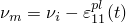，其中  是从分析开始到时间 *t* 之间的塑性嵌入。（此公式中的负号反映了 Abaqus 中应变的符号约定，即拉应变为正。对于桩靴塑性， 通常为压缩，即为负。）关节可以是纯弹性的，此时 ，因此  始终成立。

桩靴锥形部分的高度由 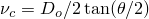 给出。土壤表面处桩靴的有效直径 *D* 定义为

1. 对于平底座桩靴：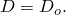
2. 对于锥底座桩靴：
   1. 锥形部分部分穿透（）：
   2. 穿透超过锥-柱过渡（）：

土壤表面处桩靴的当前面积 *A* 通过 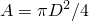 定义。对于带塑性的锥形桩靴，有效直径可以在整个分析过程中变化。

如果桩靴是圆柱形的且未定义桩靴塑性，则嵌入无效且不需要。

#### 直接指定嵌入

可以使用初始条件直接指定嵌入值（请参阅["Abaqus/Standard 和 Abaqus/Explicit 中的初始条件，" 第34.2.1节](pt07ch34s02aus116.md)）。

| **输入文件用法：** | ``` [*INITIAL CONDITIONS](../key/key-link.md#usb-kws-minitialcond), TYPE=SPUD EMBEDMENT ``` |
| --- | --- |

#### 指定桩靴预载荷

如果定义了桩靴塑性，您可以指定初始压缩容量（"预载荷"）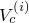，而不是嵌入。在这种情况下，Abaqus/Aqua 将使用硬化定律计算应用预载荷时随之产生的塑性嵌入。

预载荷初始条件仅用于计算初始塑性嵌入；桩靴在此初始塑性嵌入处开始分析，处于零应变和零应力状态，并假定预载荷已被移除。您必须通过历史定义中的载荷施加任何操作垂直载荷。

| **输入文件用法：** | ``` [*INITIAL CONDITIONS](../key/key-link.md#usb-kws-minitialcond), TYPE=SPUD PRELOAD ``` |
| --- | --- |

#### 弹性桩靴分析中的嵌入

如果桩靴模型是纯弹性的，则桩靴几何形状仅用于计算桩靴弹性的桩靴嵌入直径。仅当桩靴是锥形时，才需要此计算的嵌入。

### 输出

元素局部系统中的力和力矩输出可通过"应力"输出变量 S 获得。伸长和相对旋转可通过"应变"输出变量 E 获得。弹性和塑性应变可通过输出变量 EE 和 PE 获得。对于桩靴，自分析开始以来的塑性嵌入可通过塑性应变的垂直分量 PE11 获得，通常为负，表示压缩；总垂直嵌入 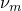 可通过输出变量 PEEQ 获得。元素节点力（元素放置在其节点上的力，在全局系统中）可通过元素变量 NFORC 获得。

### 关节弹性模型

JOINT2D 和 JOINT3D 单元的弹性载荷-位移行为通过弹性弹簧刚度表征，这些刚度组装形成弹性单元刚度矩阵。可以指定特殊的桩靴对角模量，或者可以指定完全填充的（一般）弹性模量。

#### 桩靴模量

可以为二维或三维单元指定桩靴模量。

##### 二维桩靴模量

二维桩靴的弹性刚度为


其中


是垂直弹性弹簧刚度，；

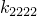

是水平弹性弹簧刚度，；


是弯曲弹性弹簧刚度，；

其中 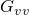、 和  分别是垂直、水平和旋转位移的等效弹性剪切模量； 是土壤的泊松比（建议值：砂为0.2，粘土为0.5）。

| **输入文件用法：** | ``` [*JOINT ELASTICITY](../key/key-link.md#usb-kws-mjointelastic), MODULI=SPUD CAN, NDIM=2 ``` |
| --- | --- |

##### 三维桩靴模量

对于三维桩靴，模量为


其中


是垂直弹性弹簧刚度，；


是水平弹性弹簧刚度，；

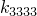

是水平弹性弹簧刚度，；


是弯曲弹性弹簧刚度，；


是弯曲弹性弹簧刚度，；

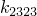

是扭转弹性弹簧刚度，；

其中 、、 和  与之前相同， 是用户指定的扭转刚度值。

通过应变  和  对1-2平面外的应变在三维模型中产生纯弹性响应，而不考虑塑性。与这些应变相关的模量假定不受塑性影响，因此 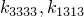 和  基于初始嵌入直径，而其他模量取决于当前嵌入直径。

| **输入文件用法：** | ``` [*JOINT ELASTICITY](../key/key-link.md#usb-kws-mjointelastic), MODULI=SPUD CAN, NDIM=3 ``` |
| --- | --- |

#### 一般模量

可以为二维或三维单元指定一般模量。

##### 二维一般模量

对于二维情况，需要六个独立的弹性模量。应力-应变关系如下：


| **输入文件用法：** | ``` [*JOINT ELASTICITY](../key/key-link.md#usb-kws-mjointelastic), MODULI=GENERAL, NDIM=2 ``` |
| --- | --- |

##### 三维一般模量

对于三维情况，需要21个独立的弹性模量。应力-应变关系如下：


| **输入文件用法：** | ``` [*JOINT ELASTICITY](../key/key-link.md#usb-kws-mjointelastic), MODULI=GENERAL, NDIM=3 ``` |
| --- | --- |

### 关节塑性

在下文中， 和  分别表示垂直*压缩*载荷、1-2平面中的水平载荷和局部1-2平面中的弯矩。

如果定义塑性，关节可以轴向、水平或旋转屈服。应力线性依赖于弹性应变。对于锥形桩靴，弹性模量可以依赖于塑性（通过表面直径 *D*）。

模型是率无关的，屈服方程形式为


其中 *f* 是屈服函数， 是一组硬化参数，在这些模型中它们依赖于总垂直塑性嵌入 ；*f* 的形式和  的定义决定了塑性模型的类型。

流动规则要求塑性流动方向与流动势 *g* 的等值线垂直。所有这些模型都假定相关流动（屈服表面顶点处除外，如下所述）。

#### 屈服面

三种可用的塑性模型都使用抛物线屈服面。每个都在1方向上的应力有一个压缩极限和一个拉伸极限，分别称为 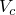 和 ；对于粘土模型， 为零。 和  的符号约定是使它们始终为正；因此， 始终满足

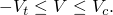

屈服面最方便在  空间中绘制，其中  是归一化压缩垂直载荷，定义为

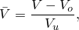

其中  是 *V* 的极限弹性范围的中值， 是 *V* 的极限范围的长度。因此，归一化载荷始终在范围内


其中 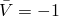 表示拉伸极限 ，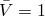 表示压缩极限 。 是归一化等效水平载荷，通过以下方式定义


其中 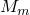 和 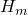 分别是弯矩和水平屈服应力。归一化弯矩和归一化水平力通过  和 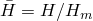 定义。

每个模型在  空间中的归一化屈服函数通过以下方式定义


是一条抛物线，如图32.10.1-2所示。三个归一化应力 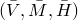 空间中的屈服面是这条抛物线的旋转曲面。

**图32.10.1-2** 屈服面和流动势等值线


#### 流动势

流动势与屈服函数相同（相关流动），除了在屈服函数有尖角的地方对流动势进行了一些平滑处理。

屈服面有尖角，因此在屈服面与  轴相交的点上法线不唯一。

为了避免这些尖点处流动方向不确定的问题，Abaqus/Standard 使用流动势，其等值线在顶点区域是圆形的，如图32.10.1-2中顶点详图所示。这种圆形是通过在  处将椭圆段拟合到流动势等值线来实现的。

#### 塑性方程的积分

Abaqus/Aqua 对塑性方程使用完全隐式积分。对于这些塑性模型，相应的切线刚度是非对称的。默认情况下，在全局牛顿循环中使用对称化切线。如果收敛速度看起来很差，您可能会从对该步骤使用非对称矩阵存储和求解方案中获益（请参阅["定义分析，" 第6.1.2节](pt03ch06s01abo05.md)）。

#### 关节塑性模型

三种模型的不同之处仅在于 、、 和  的定义以及硬化定义。我们以文献中给出的形式介绍每个模型的屈服函数，而不是归一化形式。通过识别  和  其中  和  是决定屈服函数几何形状的常数系数。 和 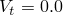 的特殊情况给出 Osborne 等人提出的屈服函数。
2. 工作硬化方程：
   1. 平底座桩靴：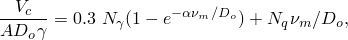 其中  是土壤单位重量； 是实验确定的常数； 和 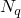 是经典承载能力系数，可计算为：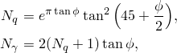 其中  是土壤摩擦角。
   2. 锥底座桩靴：
      1. 锥形部分部分穿透：
      2. 穿透超过锥-柱过渡：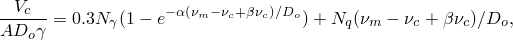 其中  是一个"锥形等效系数"。

常数  和  基于以下从离心机数据推导的经验关系：

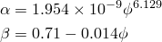

其中土壤摩擦角  以度为单位。

砂模型屈服函数可以通过使用 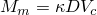 和 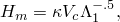 转化为归一化形式，其中 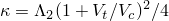。对于 Osborne 等人的模型，。

此模型需要非零初始嵌入或等效预载荷。

| **输入文件用法：** | ``` [*JOINT PLASTICITY](../key/key-link.md#usb-kws-mjointplastic), TYPE=SAND ``` |
| --- | --- |

##### 粘土模型

1. 屈服函数：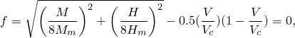 其中  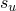 是粘土的不排水剪切强度； 是桩靴嵌入部分的高程面积，通过以下方式定义：
   1. 平底座桩靴：
   2. 锥底座桩靴：
      1. 锥形部分穿透：
      2. 穿透超过锥-柱过渡：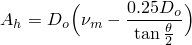
2. 工作硬化方程：
   1. 平底座桩靴：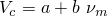
   2. 锥底座桩靴：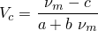 其中  和 *c* 是用户定义的经验常数。

此模型在拉伸  时屈服强度为零，需要非零初始嵌入或等效预载荷。

| **输入文件用法：** | ``` [*JOINT PLASTICITY](../key/key-link.md#usb-kws-mjointplastic), TYPE=CLAY ``` |
| --- | --- |

##### 用于结构关节/构件的抛物线模型

1. 屈服函数：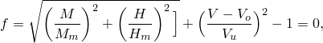 其中  分别是水平和弯矩容量。
2. 工作硬化：假定没有工作硬化（模型是理想塑性的）。

| **输入文件用法：** | ``` [*JOINT PLASTICITY](../key/key-link.md#usb-kws-mjointplastic), TYPE=MEMBER ``` |
| --- | --- |

#### 塑性分析问题

由于在桩靴塑性模型中假定相关流动，只要在  时遇到屈服面，就会发生拉伸垂直塑性应变。不需要垂直力本身是拉伸的才会发生拉伸塑性屈服；拉伸塑性屈服可以发生在屈服面上 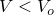 的任何部分。桩靴模型在此拉伸塑性屈服期间软化；如果模型的其他部分支撑不足，可能会发生不稳定性，分析可能无法收敛。当发生这种情况时，桩靴可能正在从海底抬起。

为了更容易诊断可能由此类问题引起的分析问题，在以下情况下会将消息打印到消息文件：如果桩靴发生拉伸塑性屈服，如果屈服发生在抛物线屈服面顶部附近（），那里几乎没有硬化，或者如果桩靴的嵌入变得小于初始嵌入的10%。这些消息在给定步骤中不会打印超过一次。

如果应变增量过大，塑性算法可能会在迭代中失败。通过请求将塑性算法问题的详细打印输出到消息文件，可以获得一些帮助诊断关节单元中失败的详细信息（请参阅["Abaqus/Standard 消息文件"在"输出，" 第4.1.1节](pt02ch04s01aus38.md#usb-out-ooutput-message-std)）。


