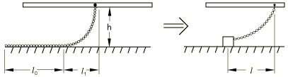
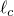
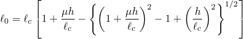
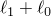
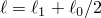

# 32.11.1 拖链


**产品：** Abaqus/Standard

##### **参考文献**

- ["拖链单元库，" 第32.11.2节](pt06ch32s11ael42.md)
- [*DRAG CHAIN](../key/key-link.md#usb-kws-mdragchain)
- [*RIGID SURFACE](../key/key-link.md#usb-kws-mrigidsurf)

### 概述

拖链单元：
- 用于模拟拖链对海底的影响，用于近底弯曲模拟建模；并且
- 可用于二维或三维问题。

### 典型应用

拖链建模为海底上的集中重量，与其和管道上连接点之间的链条（请参阅[图32.11.1-1](pt06ch32s11alm56.md#edragchain-model)）。

**图32.11.1-1** 拖链模型



给定总长度为 、单位长度重量 *w* 以及与海底之间的摩擦系数  的均匀拖链，连接点在海底上方高度 *h* 处，在滑动时海底上的链条长度  由下式给出



悬垂长度的水平投影  为


因此，等效模型应有摩擦极限 。滑动时的水平长度  可以取从  到  的任何值。与实验比较表明，取此长度为  是合理的选择。

当管道连接点直接位于重量上方时，拖链单元不会提供水平力或水平刚度；此位置假定为初始条件。当管道相对于海底移动时，拖链在管道上引起的水平力反对相对运动并逐渐增加（使用悬链线方程的近似来将力与偏移量  关联），直到拖链滑动（当力达到摩擦极限时）。高度 *h* 假定相对于  很小。

### 选择适当的单元

提供了二维和三维拖链单元。

DRAG2D 单元假定海底是平坦的且平行于管道移动的平面；因此，海底不需要明确建模。

DRAG3D 单元要求海底定义为解析刚体表面，该表面必须平坦且平行于全局（*X*, *Y*）平面，并在整个分析过程中被认为是固定的。

#### 为三维拖链定义海底

海底定义为解析刚体表面。此表面定义用于根据管道节点与海底表面位置之间的分离来确定链条是否接触海底。有关详细信息，请参阅["解析刚体表面定义，" 第2.3.4节](pt01ch02s03aus19.md)。

由于海底被认为是固定的，因此必须将边界条件应用于海底表面的刚体参考节点，该节点也是 DRAG3D 元素的第二个节点。

| **输入文件用法：** | 使用以下选项为 DRAG3D 元素定义海底表面： |
| --- | --- |
|  | ``` [*RIGID SURFACE](../key/key-link.md#usb-kws-mrigidsurf) ``` 在以部件实例组装定义的模型中，定义海底的刚体表面定义必须出现在与拖链元素相同的部件定义中。 |

### 定义拖链行为

对于 DRAG2D 元素，您指定连接点与集中重量之间的最大水平长度 。在此长度下，重量将开始在海底上滑动。此外，您指定滑动时重量与海底之间的水平力（即摩擦极限）。

对于 DRAG3D 元素，您指定链条的总长度、摩擦系数和链条的单位长度重量。

您必须将拖链行为与一组拖链元素相关联。

| **输入文件用法：** | ``` [*DRAG CHAIN](../key/key-link.md#usb-kws-mdragchain), ELSET=*name* *drag chain data* ``` |
| --- | --- |


