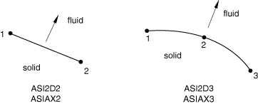

# 32.13.1 声学界面单元


**产品：** Abaqus/Standard  Abaqus/CAE

##### **参考文献**

- ["声学界面单元库，" 第32.13.2节](pt06ch32s13ael44.md)
- ["声学、冲击和耦合声-结构分析，" 第6.10.1节](pt03ch06s10at29.md)
- [*INTERFACE](../key/key-link.md#usb-kws-minterface)
- ["创建声学界面截面，" Abaqus/CAE 用户指南第12.13.18节](../usi/usi-link.md#usi-prp-section-acoustic-interface)

### 概述

声学界面单元：
- 可用于将声学流体模型与包含连续体或结构单元的结构模型耦合；
- 将结构模型表面的加速度与声学介质中的压力耦合；
- 可用于动态和稳态动态过程；
- 必须用声学单元和结构（或固体）单元共享的节点来定义；
- 仅能用于小位移模拟，不适用于非线性或静水流体-结构相互作用；
- 如果使用子空间迭代特征求解器，在特征频率提取分析中会被忽略；并且
- 如有需要，可以退化为三角形单元。

对于大多数问题，["网格绑定约束，" 第35.3.1节](pt08ch35s03aus132.md)和["在 Abaqus/Standard 中定义绑定接触，" 第36.3.7节](pt09ch36s03aus151.md)中所述的基于表面的声-结构功能提供了更通用和易于使用的方法来模拟声学流体与结构之间的相互作用。用户指定的声学界面单元以基于表面过程的便利性为代价，让您对耦合规格有更大的控制权。

### 典型应用

声学界面单元用于固体结构运动影响声学流体中压力的模拟，例如汽车车架振动在乘客舱中产生噪音的情况；或者流体中压力影响相邻结构的情况，例如容器内流体的小振幅晃动影响其响应的情况。

用户指定的声学界面单元也适用于仅包含声学介质的问题，因为它们允许您直接在声学界面单元的节点上指定位移、速度或加速度边界条件。然而，在此应用中，您必须注意切向位移未与流体耦合。因此，如果这些节点在切向方向上未受约束，则可能出现涉及位移自由度的零能模式。当声学界面单元用于耦合流体和固体单元时，不会出现此问题，因为固体具有刚度和惯性。

### 选择适当的单元

底层声学单元和结构单元的阶数通常决定了应使用哪个声学界面单元。通用声学界面单元 ASI1 可用于任何耦合声-结构模拟；但是，它通常仅与声学链接单元（AC1D2 和 AC1D3）一起使用。

### 定义声学-结构界面的法线方向

声学界面单元的连接性和右手定则定义了声学-结构界面的法线方向，如["声学界面单元库，" 第32.13.2节](pt06ch32s13ael44.md)所示。非常重要的是，此法线指向声学流体内部，如图32.13.1-1和图32.13.1-2所示。ASI1 声学界面单元是一个例外，您必须定义法线方向。

**图32.13.1-1** 二维和轴对称声学-结构界面单元的法线方向



**图32.13.1-2** 三维声学-结构界面单元的法线方向


### 定义声学界面单元的截面属性

您必须将声学界面截面定义与一组声学界面单元相关联。对于三维和轴对称声学界面单元，必须使用此截面定义，即使这些单元没有用户定义的几何属性。

| **输入文件用法：** | ``` [*INTERFACE](../key/key-link.md#usb-kws-minterface), ELSET=*element_set_name* ``` |
| --- | --- |

| **Abaqus/CAE 用法：** | Property 模块：**Create Section**：选择**其他**作为截面**类别**和**Acoustic interface**作为截面**类型******Assign****Section****：选择区域 |
| --- | --- |

#### 定义与 ASI1 单元关联的几何属性

ASI1 单元由单个节点组成。Abaqus/Standard 无法计算与这些单元关联的表面积，因此您必须提供此信息。如果未给出准确的表面积，Abaqus/Standard 可能会在声学-结构界面计算出不正确的加速度或声学流体压力。

此外，Abaqus/Standard 无法计算与这些单元关联的界面法线方向。您必须提供这些单元界面法线在全球笛卡尔坐标系中的方向余弦。

| **输入文件用法：** | ``` [*INTERFACE](../key/key-link.md#usb-kws-minterface) *surface area*, *X*-direction cosine*, *Y*-direction cosine*, *Z*-direction cosine* ``` |
| --- | --- |

| **Abaqus/CAE 用法：** | Abaqus/CAE 不支持通用声学界面截面。 |
| --- | --- |

#### 为平面声学界面单元定义厚度

您可以指定平面声学界面单元的厚度。默认值为单位厚度。

| **输入文件用法：** | ``` [*INTERFACE](../key/key-link.md#usb-kws-minterface) *thickness* ``` |
| --- | --- |

| **Abaqus/CAE 用法：** | Property 模块：**Create Section**：选择**其他**作为截面**类别**和**Acoustic interface**作为截面**类型**：**平面应力/应变厚度**：*thickness* |
| --- | --- |

### 在不同插值阶数的单元形成声学-结构界面时使用声学界面单元

通常假定对声学流体网格和结构网格（至少在界面表面上）使用相同阶数的插值。如果不是这种情况，必须在沿声学-结构界面的节点上施加合适的多点约束（MPC），以保持压力（MPC 类型 P LINEAR）或位移场（MPC 类型 LINEAR）中的兼容性。


