# 32.15.1 用户定义单元


**产品：** Abaqus/Standard  Abaqus/Explicit

##### **参考文献**

- ["用户定义单元库，" 第32.15.2节](pt06ch32s15ael46.md)
- ["UEL，" Abaqus 用户子程序参考指南第1.1.28节](../sub/sub-link.md#sub-rtn-uuel)
- ["UELMAT，" Abaqus 用户子程序参考指南第1.1.29节](../sub/sub-link.md#sub-rtn-uuelmat)
- ["VUEL，" Abaqus 用户子程序参考指南第1.2.12节](../sub/sub-link.md#sub-rtn-uexpuel)
- ["访问 Abaqus 热材料，" Abaqus 用户子程序参考指南第2.1.18节](../sub/sub-link.md#sub-utl-ugetmaterialht)
- ["访问 Abaqus 材料，" Abaqus 用户子程序参考指南第2.1.17节](../sub/sub-link.md#sub-utl-ugetmaterialmech)
- [*MATRIX](../key/key-link.md#usb-kws-mmatrix)
- [*UEL PROPERTY](../key/key-link.md#usb-kws-muelproperty)
- [*USER ELEMENT](../key/key-link.md#usb-kws-muserelement)

### 概述

用户定义单元：
- 可以是表示模型几何部分的常规有限单元；
- 可以是反馈链接，根据模型中其他点的位移、速度等的值为某些点提供力；
- 可用于求解非标准自由度方程；
- 可以是线性或非线性的；并且
- 可以访问 Abaqus 材料库中选定的材料。

### 为用户定义单元分配单元类型键

您必须为用户定义单元分配单元类型键。在 Abaqus/Standard 中，单元类型键必须采用 U*n* 的形式，在 Abaqus/Explicit 中采用 VU*n* 的形式，其中 *n* 是唯一标识单元类型的正整数。例如，您可以定义单元类型 U1、U2、U3、VU1、VU7 等。在 Abaqus/Standard 中 *n* 必须小于10000；而在 Abaqus/Explicit 中 *n* 必须小于9000。

单元类型键用于在单元定义中标识单元。对于通用用户单元，标识符的整数部分在用户子程序 [`UEL`](../sub/sub-link.md#sub-xsl-uel)、[`UELMAT`](../sub/sub-link.md#sub-xsl-uelmat) 和 [`VUEL`](../sub/sub-link.md#sub-xsl-vuel) 中提供，以便您可以区分不同的单元类型。

| **输入文件用法：** | ``` [*USER ELEMENT](../key/key-link.md#usb-kws-muserelement), TYPE=*element_type* ``` |
| --- | --- |

### 调用用户定义单元

用户定义单元的调用方式与原生 Abaqus 单元相同：您指定单元类型 U*n* 或 VU*n*，并定义与每个单元关联的单元编号和节点（请参阅["在 Abaqus 中定义模型，" 第1.3.1节](pt01ch01s03aus03.md)）。用户单元可以以常规方式分配到单元集，以便交叉引用单元属性定义、输出请求、分布载荷规格等。

材料定义（["材料数据定义，" 第21.1.2节](pt05ch21s01aus109.md)）仅与 Abaqus/Standard 中的用户定义单元相关。如果为用户定义单元分配了材料（["为用户单元分配 Abaqus 材料](pt06ch32s15alm60.md#usb-elm-euserelem-material)"）"，将使用用户子程序 [`UELMAT`](../sub/sub-link.md#sub-xsl-uelmat) 来定义单元响应。用户子程序 [`UELMAT`](../sub/sub-link.md#sub-xsl-uelmat) 允许访问选定的 Abaqus 材料。如果未指定材料定义，则所有材料行为必须在用户子程序 [`UEL`](../sub/sub-link.md#sub-xsl-uel) 和 [`VUEL`](../sub/sub-link.md#sub-xsl-vuel) 中基于用户定义的材料常量和与单元关联并在相同子程序中计算的对解相关的状态变量来定义。对于线性用户单元，所有材料行为必须通过用户定义的刚度矩阵来定义。

| **输入文件用法：** | 使用以下选项调用用户定义单元： |
| --- | --- |
|  | ``` [*USER ELEMENT](../key/key-link.md#usb-kws-muserelement), TYPE=*element_type* [*ELEMENT](../key/key-link.md#usb-kws-melement), TYPE=*element_type* ``` |

### 定义节点处的活动自由度

可以定义任意数量的用户单元类型并在模型中使用。每个用户单元可以有任意数量的节点，每个节点上单元使用一组指定的自由度。激活的自由度应遵循 Abaqus 约定（["约定，" 第1.2.2节](pt01ch01s02aus02.md)）。在 Abaqus/Standard 中这很重要，因为收敛准则基于自由度编号。在 Abaqus/Explicit 中，激活的自由度必须遵循 Abaqus 约定，因为这些是唯一可以更新的自由度。

Abaqus 在与用户单元传递信息时始终在全局系统中工作。因此，用户单元的刚度、质量等应始终相对于其节点处的全局方向定义，即使对这些节点应用了局部变换（["变换坐标系，" 第2.1.5节](pt01ch02s01aus09.md)）。

您定义用户单元上变量的排序。标准和推荐的排序方式是：第一个节点处的自由度首先出现，然后是第二个节点处的自由度，依此类推。例如，假设用户定义的单元类型是一个具有三个节点的平面梁。该单元在其第一个和最后一个节点使用自由度1、2和6（、 和 ），在其第二个（中间）节点使用自由度1和2。在这种情况下，单元上变量的排序为：

| 单元变量编号 | 节点 | 自由度 |
| --- | --- | --- |
| 1 | 1 | 1 |
| 2 | 1 | 2 |
| 3 | 1 | 6 |
| 4 | 2 | 1 |
| 5 | 2 | 2 |
| 6 | 3 | 1 |
| 7 | 3 | 2 |
| 8 | 3 | 6 |

这种排序在大多数情况下使用。但是，如果您定义的单元矩阵的自由度不是按此方式排序的，您可以按如下所述更改自由度的排序。

您指定元素每个节点处的活动自由度。如果元素所有节点处的自由度相同，您只需指定一次自由度列表。否则，每次节点处的自由度与先前节点处的自由度不同时，您都要指定一个新的自由度列表。因此，元素的不同节点可以使用不同的自由度；当元素用于耦合场问题时，这尤其有用，例如，其某些节点只有位移自由度，而其他节点有位移和温度自由度。此方法将产生单元变量的排序，使得第一个节点处的所有自由度首先出现，然后是第二个节点处的自由度，依此类推。

在 Abaqus/Standard 中，有两种方式可以不同地定义排序自由度的单元变量编号。

由于用户单元在定义元素的节点连接性时可以接受重复的节点编号，因此可以声明元素每个自由度有一个节点。例如，如果元素是用于应力分析的平面3节点三角形，它有三个节点，每个节点有自由度1和2。如果所有自由度1要首先出现在单元变量中，则可以用六个节点定义元素，其中前三个节点有自由度1，而节点4-6有自由度2。单元变量排序如下：

| 单元变量编号 | 节点 | 自由度 |
| --- | --- | --- |
| 1 | 1 | 1 |
| 2 | 2 | 1 |
| 3 | 3 | 1 |
| 4 | 4 | 2 |
| 5 | 5 | 2 |
| 6 | 6 | 2 |

或者，用户单元变量可以定义为你任意排序单元上的自由度。您为元素第一个节点指定一个自由度列表。具有小于下一个指定自由度列表的节点连接性编号的所有节点将具有第一个自由度列表。第二个自由度列表将用于所有节点，直到定义新列表等。如果遇到新的自由度列表，其节点连接性编号小于或等于前一个列表的编号，则前一个列表的自由度将被分配到元素的最后一个节点。可以通过使用空的（空白）自由度列表指定节点连接性编号来在元素最后一个节点之前停止此自由度的生成。

#### 示例

上述过程继续使用此新列表根据新节点和自由度定义附加自由度。例如，考虑一个3节点梁，在节点1和3有自由度1、2和6，在节点2（中间节点）有自由度1和2。要按1、2、6的顺序排序自由度，可以使用以下输入：

```
[*USER ELEMENT](../key/key-link.md#usb-kws-muserelement)
1
1, 2
1, 6
2,
3, 6
```

在这种情况下，单元上变量的排序为：

| 单元变量编号 | 节点 | 自由度 |
| --- | --- | --- |
| 1 | 1 | 1 |
| 2 | 2 | 1 |
| 3 | 3 | 1 |
| 4 | 1 | 2 |
| 5 | 2 | 2 |
| 6 | 3 | 2 |
| 7 | 1 | 6 |
| 8 | 3 | 6 |

#### Abaqus/Explicit 中激活自由度的要求

对于类型 VU*n* 的用户单元，激活自由度有以下额外要求：
- 只能激活1到6、8和11这些自由度，因为这些是 Abaqus/Explicit 中唯一可以更新的自由度编号。（在 Abaqus/Standard 中可以使用1到30的自由度。）
- 如果在一个节点处激活了一个平移自由度，则该节点处必须激活到指定最大坐标数为止的所有平移自由度；此外，节点处的平移自由度必须按顺序连续。
- 在三维分析中，如果在一个节点处激活了一个旋转自由度，则必须按顺序连续激活所有三个旋转自由度。

例如，如果您定义一个4节点三维用户单元，在第一个和第四个节点有平移和旋转，第二个节点仅有温度，第三个节点有平移和温度，可以使用以下输入：
```
[*USER ELEMENT](../key/key-link.md#usb-kws-muserelement)
1,2,3,4,5,6
2,11
3,1,2,3,11
4,1,2,3,4,5,6
```

#### 几何非线性分析中的旋转更新

如果在几何非线性分析中在节点处使用了所有三个旋转自由度（4、5和6），Abaqus 假定这些旋转是有限旋转。在这种情况下，这些自由度的增量值不是简单添加到总值中：而是使用四元数更新公式。类似地，校正不是简单添加到增量值中。更新过程在["旋转变量，" Abaqus 理论指南第1.3.1节](../stm/stm-link.md#stm-int-rotationvars)中有描述，并在["约定，" 第1.2.2节](pt01ch01s02aus02.md)中提及。

为避免在 Abaqus/Standard 几何非线性分析中的旋转更新，您可以在元素的节点连接性中定义重复的节点编号，使得每个节点处的自由度列表中至少缺少自由度4、5或6之一。

### 在 Abaqus/CAE 中可视化用户定义单元

Abaqus/CAE 不支持绘制用户单元。但是，如果用户单元包含位移自由度，它们可以覆盖标准单元；可以显示这些标准单元的模型图，让您看到用户单元的形状。如果需要用户单元的变形网格图，覆盖标准单元的材料属性必须选择为不因包含它们而改变解决方案。如果使用此技术，用户单元的节点将绑定到标准单元的节点。因此，用户单元中的自由度1、2和3必须对应于标准单元节点处的位移自由度。

### 在 Abaqus/Standard 中定义线性用户单元

线性用户单元只能 在 Abaqus/Standard 中定义。在最简单的情况下，线性用户单元可以定义为刚度矩阵，如果需要，还可以定义为质量矩阵。这些矩阵可以从结果文件读取或直接定义。

#### 从 Abaqus/Standard 结果文件读取单元矩阵

要从 Abaqus/Standard 结果文件读取单元矩阵，您必须在先前分析中将刚度和/或质量矩阵作为单元矩阵输出（["Abaqus/Standard 中的单元矩阵输出"在"输出，" 第4.1.1节](pt02ch04s01aus38.md#usb-out-ooutput-elemmatrix)）或子结构矩阵输出（["将恢复矩阵、缩减刚度矩阵、质量矩阵、载荷情况向量和重力向量写入文件"在"定义子结构，" 第10.1.2节](pt04ch10s01aus59.md#usb-anl-asuperelementdef-output)）写入结果文件。

您必须指定矩阵对应的单元编号 *n* 或子结构标识符 Z*n*。对于以部件实例组装定义的模型（["定义组装，" 第2.10.1节](pt01ch02s10aus28.md)），写入结果文件的单元编号是 Abaqus/Standard 生成的内部编号（请参阅["输出，" 第4.1.1节](pt02ch04s01aus38.md)）。这些内部编号与原始单元编号和部件实例名称之间的映射在写出单元矩阵输出的分析的数据文件中提供。

此外，对于单元矩阵输出，您必须指定写出单元矩阵的步骤编号和增量编号。如果使用在生成期间输出矩阵的子结构，则不需要这些项。

| **输入文件用法：** | ``` [*USER ELEMENT](../key/key-link.md#usb-kws-muserelement), FILE=*name*, OLD ELEMENT=*n* or Z*n*, STEP=*n*, INCREMENT=*n* ``` |
| --- | --- |

#### 通过直接指定矩阵定义线性用户单元

如果您直接定义刚度和/或质量矩阵，必须指定与元素关联的节点数。

| **输入文件用法：** | ``` [*USER ELEMENT](../key/key-link.md#usb-kws-muserelement), LINEAR, NODES=*n* ``` |
| --- | --- |

##### 定义单元矩阵是否对称

如果单元矩阵不对称，您可以请求 Abaqus/Standard 使用其非对称方程求解能力（请参阅["定义分析，" 第6.1.2节](pt03ch06s01abo05.md)）。

| **输入文件用法：** | ``` [*USER ELEMENT](../key/key-link.md#usb-kws-muserelement), LINEAR, NODES=*n*, UNSYMM ``` |
| --- | --- |

##### 定义质量或刚度矩阵

您分别定义单元质量矩阵和单元刚度矩阵。如果单元是热传导单元，"刚度矩阵"是传导矩阵，"质量矩阵"是比热矩阵。

您可以为单元定义一个矩阵（质量或刚度）或两种类型的矩阵。

您可以从文件读取质量和/或刚度矩阵，或直接定义它们。在这两种情况下，Abaqus/Standard 每行读取四个值，使用 F20 格式。此格式确保以足够的精度读取数据。以 E20.14 格式写入的数据可以在此格式下读取。

从矩阵的第一列开始。为每一列开始新的一行。如果您未指定单元矩阵是非对称的，则从每列顶部到对角项仅给出矩阵项：不给出对角线以下的项。如果您指定单元矩阵是非对称的，则给出每列中的所有项，从列顶部开始。

| **输入文件用法：** | 使用以下选项定义单元质量矩阵： |
| --- | --- |
|  | ``` [*MATRIX](../key/key-link.md#usb-kws-mmatrix), TYPE=MASS ``` 使用以下选项定义单元刚度矩阵： ``` [*MATRIX](../key/key-link.md#usb-kws-mmatrix), TYPE=STIFFNESS ``` 使用以下选项从文件读取单元质量或刚度矩阵： ``` [*MATRIX](../key/key-link.md#usb-kws-mmatrix), TYPE=MASS or STIFFNESS, INPUT=*file_name* ``` 例如，如果矩阵是对称的，应使用以下数据行： ```                      Etc. ``` 如果矩阵是非对称的，应使用以下数据行： ```         … …,      Etc. ``` 其中 *m* 是矩阵的大小， 是矩阵中第 *i* 行第 *j* 列的项。 |

##### 几何非线性分析

当线性用户单元用于几何非线性分析时提供的刚度矩阵不会更新以考虑任何非线性效应，如有限旋转。

#### 定义单元属性

您必须将属性定义与每个用户单元相关联，即使线性用户单元没有关联属性值（除了瑞利阻尼系数）。

| **输入文件用法：** | 使用以下选项将属性定义与用户单元集关联： |
| --- | --- |
|  | ``` [*UEL PROPERTY](../key/key-link.md#usb-kws-muelproperty), ELSET=*name* ``` |

##### 为直接积分动态分析定义瑞利阻尼

您可以为直接积分动态分析（["使用直接积分的隐式动态分析，" 第6.3.2节](pt03ch06s03at07.md)）定义线性用户单元的瑞利阻尼系数。瑞利阻尼系数定义为


其中  是阻尼矩阵， 是质量矩阵， 是刚度矩阵， 和  是用户指定的阻尼系数。请参阅["材料阻尼，" 第26.1.1节](pt05ch26s01abm51.md)，了解更多关于瑞利阻尼的信息。

| **输入文件用法：** | ``` [*UEL PROPERTY](../key/key-link.md#usb-kws-muelproperty), ELSET=*name*, ALPHA=, BETA= ``` |
| --- | --- |

#### 定义载荷

您可以使用集中载荷和集中通量以常规方式对线性用户定义单元的节点施加点载荷、力矩、通量等（["集中载荷，" 第34.4.2节](pt07ch34s04aus121.md)和["热载荷，" 第34.4.4节](pt07ch34s04aus123.md)）。

不能为线性用户定义单元定义分布载荷和通量。

### 定义通用用户单元

通用用户单元在 Abaqus/Standard 的用户子程序 [`UEL`](../sub/sub-link.md#sub-xsl-uel) 和 [`UELMAT`](../sub/sub-link.md#sub-xsl-uelmat) 中以及 Abaqus/Explicit 的用户子程序 [`VUEL`](../sub/sub-link.md#sub-xsl-vuel) 中定义。*仅推荐高级用户在用户子程序中实现用户单元。*

#### 定义与单元关联的节点数

您必须指定与通用用户单元关联的节点数。您可以定义不连接到其他单元的"内部"节点。

| **输入文件用法：** | ``` [*USER ELEMENT](../key/key-link.md#usb-kws-muserelement), NODES=*n* ``` |
| --- | --- |

#### 定义单元矩阵是否在 Abaqus/Standard 中对称

如果元素对整体牛顿方法的雅可比算子矩阵的贡献不对称（即单元矩阵不对称），您可以请求 Abaqus/Standard 使用其非对称方程求解能力（请参阅["定义分析，" 第6.1.2节](pt03ch06s01abo05.md)）。

| **输入文件用法：** | ``` [*USER ELEMENT](../key/key-link.md#usb-kws-muserelement), NODES=*n*, UNSYMM ``` |
| --- | --- |

#### 定义任何节点点所需的最大坐标数

您可以定义在用户子程序 [`UEL`](../sub/sub-link.md#sub-xsl-uel)、[`UELMAT`](../sub/sub-link.md#sub-xsl-uelmat) 或 [`VUEL`](../sub/sub-link.md#sub-xsl-vuel) 中元素任何节点点所需的最大坐标数。Abaqus 为此类元素关联的所有节点分配存储此数量坐标值的空间。每个节点的默认最大坐标数为1。

Abaqus 将把最大坐标数更改为您指定的值或小于或等于3的用户单元最大活动自由度的最大值。例如，如果您指定最大坐标数为1，而用户单元的活动自由度为2、3和6，则最大坐标数将更改为3。如果您指定最大坐标数为2，而用户单元的活动自由度为11和12，则最大坐标数将保持为2。

| **输入文件用法：** | ``` [*USER ELEMENT](../key/key-link.md#usb-kws-muserelement), COORDINATES=*n* ``` |
| --- | --- |

#### 定义单元属性

您可以定义与特定用户单元关联的属性数量，然后指定它们的数值。

##### 指定所需的属性值数量

可以定义任意数量的属性用于形成通用用户单元。您可以指定所需的整数属性值数量 *n* 和所需的实数（浮点）属性值数量 *m*；所需的总数值是这两个数字的和。所需的整数属性值默认数量为0，所需的实数属性值默认数量为0。

整数属性值可在用户子程序 [`UEL`](../sub/sub-link.md#sub-xsl-uel)、[`UELMAT`](../sub/sub-link.md#sub-xsl-uelmat) 和 [`VUEL`](../sub/sub-link.md#sub-xsl-vuel) 中用作标志、索引、计数器等。实数（浮点）属性值的例子是梁或杆的横截面积、壳的厚度，以及定义单元材料行为的材料属性。

| **输入文件用法：** | ``` [*USER ELEMENT](../key/key-link.md#usb-kws-muserelement), I PROPERTIES=*n*, PROPERTIES=*m* ``` |
| --- | --- |

##### 指定元素属性的数值

您必须将用户单元属性定义与每个用户定义单元相关联，即使不需要属性值。属性定义中指定的属性值在每次为指定单元集中的用户单元调用子程序时传递到用户子程序 [`UEL`](../sub/sub-link.md#sub-xsl-uel)、[`UELMAT`](../sub/sub-link.md#sub-xsl-uelmat) 和 [`VUEL`](../sub/sub-link.md#sub-xsl-vuel)。

| **输入文件用法：** | 使用以下选项将属性定义与用户单元集关联： |
| --- | --- |
|  | ``` [*UEL PROPERTY](../key/key-link.md#usb-kws-muelproperty), ELSET=*name* ``` 要定义属性值，首先在数据行上输入所有浮点值，然后立即输入整数值。所有数据行应输入八个值，最后一行可能少于八个值。 |

##### 为用户单元分配 Abaqus 材料

如果从用户单元访问 Abaqus 材料库，则必须定义材料并将其分配给用户单元。

| **输入文件用法：** | 使用以下选项将材料与用户单元关联： |
| --- | --- |
|  | ``` [*UEL PROPERTY](../key/key-link.md#usb-kws-muelproperty), MATERIAL=*name* ``` 如果使用此选项，则必须使用用户子程序 [`UELMAT`](../sub/sub-link.md#sub-xsl-uelmat) 来定义单元对模型的贡献。否则，必须使用用户子程序 [`UEL`](../sub/sub-link.md#sub-xsl-uel)。 |

##### 分配方向定义

如果从用户单元访问 Abaqus 材料库，您可以将材料方向定义（["方向，" 第2.2.5节](pt01ch02s02aus15.md)）与用户单元关联。方向定义为材料计算指定了元素中的局部坐标系。局部坐标系假定在给定元素中是均匀的，基于元素质心处的坐标。

| **输入文件用法：** | 使用以下选项将方向定义与用户单元关联： |
| --- | --- |
|  | ``` [*UEL PROPERTY](../key/key-link.md#usb-kws-muelproperty), ORIENTATION=*name* ``` |

##### 指定单元类型

如果从用户单元访问 Abaqus 材料库，则必须指定单元类型。

| **输入文件用法：** | 使用以下选项定义应力/位移或热传导分析中的三维单元： |
| --- | --- |
|  | ``` [*USER ELEMENT](../key/key-link.md#usb-kws-muserelement), TENSOR=THREED ``` 使用以下选项定义热传导分析中的二维单元： ``` [*USER ELEMENT](../key/key-link.md#usb-kws-muserelement), TENSOR=TWOD ``` 使用以下选项定义应力/位移分析中的平面应变单元： ``` [*USER ELEMENT](../key/key-link.md#usb-kws-muserelement), TENSOR=PSTRAIN ``` 使用以下选项定义应力/位移分析中的平面应力单元： ``` [*USER ELEMENT](../key/key-link.md#usb-kws-muserelement), TENSOR=PSTRESS ``` |

##### 指定积分点数量

如果从用户单元访问 Abaqus 材料库，则必须指定积分点数量。

| **输入文件用法：** | 使用以下选项指定积分点数量： |
| --- | --- |
|  | ``` [*USER ELEMENT](../key/key-link.md#usb-kws-muserelement), INTEGRATION=*n* ``` |

#### 定义必须存储在单元内的解相关变量数量

您可以定义必须存储在通用用户单元内的解相关状态变量的数量。默认变量数为1。

这些变量的例子是应变、应力、截面力以及其他状态变量（例如，塑性模型中的硬化度量），用于单元内的计算。这些变量允许相当一般的非线性运动和材料行为建模。这些解相关状态变量必须在用户子程序 [`UEL`](../sub/sub-link.md#sub-xsl-uel)、[`UELMAT`](../sub/sub-link.md#sub-xsl-uelmat) 和 [`VUEL`](../sub/sub-link.md#sub-xsl-vuel) 中计算和更新。

例如，假设单元有四个数值积分点，您希望在每个积分点存储应变、应力、非弹性应变和用于定义材料状态的标量硬化变量。假设单元是三维实体，因此每个积分点有六个应力和应变分量。那么，与每个此类单元关联的解相关变量数量为4 × (6 × 3 + 1) = 76。

| **输入文件用法：** | ``` [*USER ELEMENT](../key/key-link.md#usb-kws-muserelement), VARIABLES=*n* ``` |
| --- | --- |

#### 在用户子程序 [`UEL`](../sub/sub-link.md#sub-xsl-uel) 中定义单元对模型的贡献

对于 Abaqus/Standard 中的通用用户单元，可以对用户子程序 [`UEL`](../sub/sub-link.md#sub-xsl-uel) 进行编码以定义单元对模型的贡献。每当需要用户定义单元的任何信息时，Abaqus/Standard 都会调用此例程。在每次这样的调用中，Abaqus/Standard 提供节点坐标的值以及与单元关联的所有自由度的所有解相关节点变量（位移、增量位移、速度、加速度等）的值，以及单元关联的解相关状态变量在当前增量开始时的值。Abaqus/Standard 还提供与此单元关联的所有用户定义属性的值以及指示用户子程序必须执行哪些功能的控制标志数组。根据此控制标志集，子程序必须定义单元对残差向量的贡献，定义单元对雅可比（刚度）矩阵的贡献，更新与单元关联的解相关状态变量，形成质量矩阵，等等。通常，在对例程的单次调用中必须执行其中几个功能。

#### 使用用户子程序 [`UEL`](../sub/sub-link.md#sub-xsl-uel) 的单元公式

单元在通用分析步骤中对模型的主要贡献是它提供依赖于节点变量  和单元内解相关状态变量 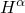 的节点力 ：

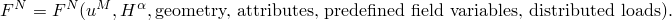

这里我们使用"力"这个术语来表示与基本节点变量共轭的量：当关联的自由度是物理位移时是物理力，当关联的自由度是旋转时是力矩，当它是温度值时是热通量，等等。 中力的符号使外力提供正的节点力值，而由单元中的应力、内部热通量等引起的"内部"力提供负的节点力值。例如，在承受表面牵引  和体积力 （应力为 、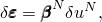

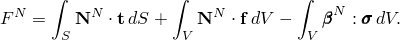

在通用过程中，Abaqus/Standard 通过牛顿法求解整体方程组：

| *求解* | , |
| --- | --- |
| *设置* | , |
| *迭代* |  |

其中 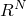 是自由度 *N* 处的残差，

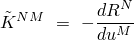

是雅可比矩阵。

在这些迭代期间，您必须定义 ，即单元对残差  的贡献，以及

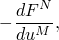

即单元对雅可比 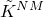 的贡献。通过写全导数 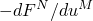，我们意味着单元对  的贡献应包括  对  的所有直接和间接依赖。例如， 通常依赖于 ；因此， 将包括如下项


##### 瞬态分析过程中的使用

在瞬态热传递和动态分析等过程中，问题还涉及节点自由度变化率的时间积分。Abaqus/Standard 用于各种过程的时间积分方案在 [Abaqus 理论指南](../stm/stm-link.md#stm) 中有更详细的描述。例如，在瞬态热传递分析中，使用后向差分法：

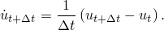

因此，如果  依赖于  和 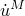（如果用户单元包含热能存储，则会是这种情况），雅可比贡献应包括项

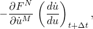

其中 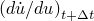 根据时间积分过程定义为 。

在所有 Abaqus/Standard 对一阶问题进行时间积分的情况下， 从不被存储，因为它们可以容易地作为  获得，其中 。但是，对于动态系统的直接隐式积分（请参阅["隐式动态分析，" Abaqus 理论指南第2.4.1节](../stm/stm-link.md#stm-anl-dynamics)），Abaqus/Standard 需要存储  和 。因此，这些值被传递到子程序 [`UEL`](../sub/sub-link.md#sub-xsl-uel)。如果用户单元包含依赖于这些时间导数（阻尼和惯性效应）的效应，其雅可比贡献将包括


对于 Hilber-Hughes-Taylor 格式


其中  和  是积分方案的（Newmark）参数。对于后向欧拉时间积分，相同的表达式适用，其中  和  等于1。项 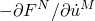 是单元的阻尼矩阵，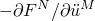 是其质量矩阵。

Hilber-Hughes-Taylor 格式将整体动态平衡方程写为


其中  是自由度 *N* 处的总力，不包括达朗贝尔（惯性）力。 通常被称为"静态残差"。因此，如果要将用户单元与 Hilber-Hughes-Taylor 时间积分一起使用，单元对整体残差  的贡献必须以相同的方式公式化。由于 Abaqus/Standard 仅在调用 [`UEL`](../sub/sub-link.md#sub-xsl-uel) 的时间点提供信息，这意味着每次调用 [`UEL`](../sub/sub-link.md#sub-xsl-uel) 时，必须使用  数组恢复 （如果需要半增量残差计算，则还需要 ，其中  表示前一个增量开始时的 ），并存储 （如果需要半增量残差计算，则还有 ）供下一个增量使用。如果动态步骤的数值阻尼控制参数  设置为零，则可以避免此复杂性；即，如果使用梯形法则积分动态方程（请参阅["使用直接积分的隐式动态分析，" 第6.3.2节](pt03ch06s03at07.md)，了解详细信息）。使用后向欧拉时间积分算子也可以避免此复杂性，因为在步骤结束时强制执行动态平衡。

如果在单元中使用了解相关状态变量（），则必须在此类变量的子程序 [`UEL`](../sub/sub-link.md#sub-xsl-uel) 中编码合适的时间积分方法。与标准 Abaqus/Standard 单元不共享的任何相关  可以通过任何合适的技术进行时间积分。如果在这种情况下需要在特定时间点存储 、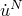 等的值，可以使用解相关状态变量数组  来实现此目的。Abaqus/Standard 仍将使用其时间积分器关联的公式计算并存储  和  的值，但不需要使用这些值。为了确保准确、稳定的时间积分，您可以控制 Abaqus/Standard 使用的时间增量大小。

##### 使用拉格朗日乘数定义的约束

应避免使用拉格朗日乘数引入约束，因为 Abaqus/Standard 无法检测此类变量并通过正确排序方程来避免特征求解器问题。

#### 在用户子程序 [`UELMAT`](../sub/sub-link.md#sub-xsl-uelmat) 中定义单元对模型的贡献

或者，对于 Abaqus/Standard 中的通用用户单元，可以对用户子程序 [`UELMAT`](../sub/sub-link.md#sub-xsl-uelmat) 进行编码以定义单元对模型的贡献。用户子程序 [`UELMAT`](../sub/sub-link.md#sub-xsl-uelmat) 是用户子程序 [`UEL`](../sub/sub-link.md#sub-xsl-uel) 的增强版本；因此，为用户子程序 [`UEL`](../sub/sub-link.md#sub-xsl-uel)提供的所有信息也对用户子程序 [`UELMAT`](../sub/sub-link.md#sub-xsl-uelmat) 有效。增强功能允许您从 [`UELMAT`](../sub/sub-link.md#sub-xsl-uelmat)访问 Abaqus 材料库中的某些材料模型。[`UELMAT`](../sub/sub-link.md#sub-xsl-uelmat) 仅适用于 [`UEL`](../sub/sub-link.md#sub-xsl-uel) 可用过程的子集：
- 静态；
- 直接积分动态；
- 频率提取；
- 稳态解耦热传递；和
- 瞬态解耦热传递。

如果为用户单元分配了 Abaqus 材料模型（请参阅上面的["为用户单元分配 Abaqus 材料](pt06ch32s15alm60.md#usb-elm-euserelem-material)"），则将调用用户子程序 [`UELMAT`](../sub/sub-link.md#sub-xsl-uelmat)；否则，将调用用户子程序 [`UEL`](../sub/sub-link.md#sub-xsl-uel)。

#### 从用户子程序 [`UELMAT`](../sub/sub-link.md#sub-xsl-uelmat) 访问 Abaqus 材料

Abaqus 允许您从用户子程序 [`UELMAT`](../sub/sub-link.md#sub-xsl-uelmat)访问 Abaqus 材料库中的某些材料模型。材料模型通过实用程序 `MATERIAL_LIB_MECH` 和 `MATERIAL_LIB_HT` 访问（["访问 Abaqus 热材料，" Abaqus 用户子程序参考指南第2.1.18节](../sub/sub-link.md#sub-utl-ugetmaterialht)和["访问 Abaqus 材料，" Abaqus 用户子程序参考指南第2.1.17节](../sub/sub-link.md#sub-utl-ugetmaterialmech)）。每次使用设置为需要计算右手边向量和单元雅可比值的标志调用用户子程序 [`UELMAT`](../sub/sub-link.md#sub-xsl-uelmat)时，必须为每个积分点调用材料库，其中积分点数量在单元定义中指定（["指定积分点数量"在"用户定义单元，" 第32.15.1节](pt06ch32s15alm60.md#usb-elm-euserelem-integration)）。可以从用户子程序 [`UELMAT`](../sub/sub-link.md#sub-xsl-uelmat)访问的材料模型有：
- 线性弹性模型；
- 超弹性模型；
- Ramberg-Osgood 模型；
- 经典金属塑性模型（米塞斯和希尔）；
- 扩展 Drucker-Prager 模型；
- 修正 Drucker-Prager/Cap 塑性模型；
- 多孔金属塑性模型；
- 弹性体泡沫材料模型；和
- 可压碎泡沫塑性模型。

#### 在用户子程序 [`VUEL`](../sub/sub-link.md#sub-xsl-vuel) 中定义单元对模型的贡献

对于 Abaqus/Explicit 中的通用用户单元，必须对用户子程序 [`VUEL`](../sub/sub-link.md#sub-xsl-vuel) 进行编码以定义单元对模型的贡献。每当需要用户定义单元的任何信息时，Abaqus/Explicit 都会调用此例程。在每次这样的调用中，Abaqus/Explicit 提供节点坐标的值以及与单元关联的所有自由度的所有解相关节点变量（位移、速度、加速度等）的值，以及单元关联的解相关状态变量在当前增量开始时的值。增量位移是在先前增量中获得的值。Abaqus/Explicit 还提供与此单元关联的所有用户定义属性的值以及指示用户子程序必须执行哪些功能的控制标志数组。根据此控制标志集，子程序必须定义单元对内部或外部力/通量向量的贡献，形成质量/容量矩阵，更新与单元关联的解相关状态变量，等等。

单元对模型的主要贡献是它提供依赖于节点变量 、节点变量速率  以及单元内解相关状态变量  的节点力 ：

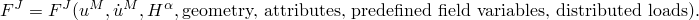

此外，可以定义单元质量矩阵 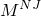。可选地，您还可以定义由于指定分布载荷导致的单元外部载荷贡献。在每个增量中，Abaqus/Explicit 使用以下方式求解增量结束时的加速度


其中  是施加的载荷向量。然后使用中心差分法对解（速度、位移）进行时间积分

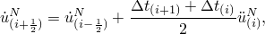

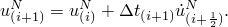

对于耦合温度/位移单元，温度在增量开始时使用


计算，其中 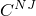 是集中电容矩阵， 是施加的节点源， 是内部通量向量。温度使用显式前向差分积分规则进行时间积分，

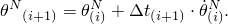

更多详细信息可在["显式动态分析，" 第6.3.3节](pt03ch06s03at08.md)和["完全耦合热应力分析，" 第6.5.3节](pt03ch06s05at19.md)中找到。 中定义的力的符号使外力提供正的节点力值，而由应力、阻尼效应、内部热通量等在单元中引起的"内部"力提供负的节点力值。体积粘度引起的内力取决于元素的缩放质量。必要的信息（体积粘度常量和质量缩放因子）被传递到用户子程序中。

##### 定义质量矩阵的要求

如["显式动态分析，" 第6.3.3节](pt03ch06s03at08.md)中所述，使显式时间积分方法高效的原因在于质量反转过程非常有效。这是因为质量矩阵中的大多数非零项位于对角位置。唯一的例外是三维分析中旋转自由度的情况，此时在每个节点处可以定义各向异性转动惯量（对称3×3张量）。在这些情况下，质量矩阵中的一些非零项可能在对角线外；但反转过程是局部的，因此非常有效。用户子程序 [`VUEL`](../sub/sub-link.md#sub-xsl-vuel) 中定义的质量矩阵必须遵守这些要求，详见["VUEL，" Abaqus 用户子程序参考指南第1.2.12节](../sub/sub-link.md#sub-rtn-uexpuel)。如果您指定零质量矩阵或完全跳过质量矩阵的定义，Abaqus/Explicit 将发出错误消息。

定义现实的质量矩阵不是强制的，但强烈建议。如果您选择不使用用户子程序定义现实的质量矩阵，则必须在与用户单元关联的所有节点和所有自由度处提供现实的质量、转动惯量、热容量等。这可以通过各种方式完成，例如在节点处定义质量和转动惯量单元，或通过将用户单元连接到指定了密度、热容量等的其他单元。

质量仅在分析开始时计算一次。因此，用户单元的质量在分析过程中不能任意改变。如果必要，质量缩放将相应应用以确保请求的时间增量。

##### 稳定时间增量的定义

由于中心差分算子是有条件稳定的，Abaqus/Explicit 中的时间增量必须略小于稳定时间增量。您必须为用户单元提供稳定时间增量的准确估计。此标量值高度依赖于单元公式，在用户子程序内部可能需要复杂的编码才能获得可靠的估计。保守估计将减少整个分析的时间增量大小，从而导致更长的分析时间。

#### 定义载荷

您可以使用集中载荷和集中通量以常规方式对通用用户定义单元的节点施加点载荷、力矩、通量等（["集中载荷，" 第34.4.2节](pt07ch34s04aus121.md)和["热载荷，" 第34.4.4节](pt07ch34s04aus123.md)。

您也可以为通用用户定义单元定义分布载荷和通量（["分布载荷，" 第34.4.3节](pt07ch34s04aus122.md)和["热载荷，" 第34.4.4节](pt07ch34s04aus123.md)）。这些载荷需要载荷类型键。对于用户定义单元，您可以定义形式为 U*n* 的载荷类型键，在 Abaqus/Standard 中还可以是 U*n*NU，其中 *n* 是任何正整数。

如果载荷类型键的形式为 U*n*，则载荷大小直接定义，并遵循关于其作为时间函数的幅值变化的 standard Abaqus 约定。在 Abaqus/Standard 中，如果载荷键的形式为 U*n*NU，所有载荷定义将在子程序 [`UEL`](../sub/link/sub-link.md#sub-xsl-uel) 和 [`UELMAT`](../sub/sub-link.md#sub-xsl-uelmat) 内部完成。每次 Abaqus/Standard 调用子程序 [`UEL`](../sub/sub-link.md#sub-xsl-uel) 或 [`UELMAT`](../sub/sub-link.md#sub-xsl-uelmat)时，它告诉子程序当前有多少分布载荷/通量处于活动状态。对于类型 U*n* 的每个活动载荷或通量，Abaqus/Standard 会给出载荷的当前大小和当前增量大小。子程序 [`UEL`](../sub/sub-link.md#sub-xsl-uel) 或 [`UELMAT`](../sub/sub-link.md#sub-xsl-uelmat) 中的编码必须将载荷分配到一致的等效节点力，如有必要，还须提供其对雅可比矩阵——"载荷刚度矩阵"的贡献。

在 Abaqus/Explicit 中，只能使用形式为 U*n* 的载荷键，且仅能用于分布载荷（但是，热通量可以在子程序 [`VUEL`](../sub/sub-link.md#sub-xsl-vuel) 中定义）。每次 Abaqus/Explicit 调用子程序 [`VUEL`](../sub/sub-link.md#sub-xsl-vuel)时，它告诉子程序当前哪个载荷编号处于活动状态以及载荷的当前大小。子程序 [`VUEL`](../sub/sub-link.md#sub-xsl-vuel) 中的编码必须将载荷分配到一致的等效节点力。

#### 定义输出

所有要输出的量必须保存为解相关状态变量。在 Abaqus/Standard 中，解相关状态变量可以使用输出变量标识符 SDV 打印或写入结果文件（["Abaqus/Standard 输出变量标识符，" 第4.2.1节](pt02ch04s02abv01.md)）。

属于用户单元的解相关状态变量分量在 Abaqus/CAE 中不可用。您可以将输出以表格格式写入单独的文件，这些文件可以在 Abaqus/CAE 中访问以生成历史输出。

#### 定义波运动数据

在用户子程序 [`UEL`](../sub/sub-link.md#sub-xsl-uel)中提供了一个实用程序 `GETWAVE`，用于访问为 Abaqus/Aqua 分析定义的波运动数据（["Abaqus/Aqua 分析，" 第6.11.1节](pt03ch06s11at30.md)）。此实用程序在["在 Abaqus/Aqua 分析中获取波运动数据，" Abaqus 用户子程序参考指南第2.1.13节](../sub/sub-link.md#sub-utl-uwavekinematic) 中讨论，其中定义了 `GETWAVE` 的参数及其使用语法。

#### 在接触中的使用

只能在用户定义单元上创建基于节点的表面（["基于节点的表面定义，" 第2.3.3节](pt01ch02s03aus18.md)）。因此，这些单元只能用于定义接触分析中的从属表面。在 Abaqus/Explicit 中，用户单元不会自动包含在一般接触算法中。可以使用这些节点定义基于节点的表面，然后将其包含在一般接触定义中。

#### 用户单元的导入

用户单元不能从 Abaqus/Standard 分析导入到 Abaqus/Explicit 分析，反之亦然。可以在两个产品中定义等效的用户单元来克服此限制。但是，与这些单元关联的状态变量不会被传递。


