# 34.1.2 幅值曲线


**产品：** Abaqus/Standard  Abaqus/Explicit  Abaqus/CFD  Abaqus/CAE

##### **参考**

- ["规定条件：概述，" 第34.1.1节"](pt07ch34s01abo31.md)
- [*AMPLITUDE*](../key/key-link.md#usb-kws-mamplitude)
- [Abaqus/CAE用户指南第57章，"幅值工具集"](../usi/usi-link.md#usi-amp)

### 概述

幅值曲线：
- 允许在整歩（使用步时间）或整分析（使用总时间）过程中给出载荷、位移及其他规定变量的任意时间（或频率）变化；
- 可以定义为数学函数（如正弦变化）、时间点系列值（如地震记录的数字化加速度-时间记录）、通过用户子程序自定义的定义，或者在Abaqus/Standard中定义为基于解相关变量（如超塑性成型问题中的最大蠕变应变率）计算的值；并且
- 可以通过名称被任意数量的边界条件、载荷和预定义场引用。

### 幅值曲线

默认情况下，载荷、边界条件和预定义场的值在整个步中随时间线性变化（斜坡函数），或者立即施加并在整歩中保持恒定（阶跃函数）——见["定义分析，" 第6.1.2节"](pt03ch06s01abo05.md)。然而，许多问题需要更精细的定义。例如，不同的幅值曲线可用于为不同载荷指定不同的时间变化。一个常见的例子是热载荷和机械载荷瞬态的组合：通常在步中温度和机械载荷具有不同的时间变化。不同的幅值曲线可用于指定这些时间变化。

其他例子包括地震载荷下的动力分析，其中幅值曲线可用于指定加速度随时间的变化；以及水下冲击分析，其中幅值曲线用于指定入射压力分布。

幅值定义为模型数据（即不依赖于步）。每个幅值曲线必须命名；然后从载荷、边界条件或预定义场定义中引用此名称（见["规定条件：概述，" 第34.1.1节"](pt07ch34s01abo31.md)）。

| **输入文件用法：** | ``` [*AMPLITUDE*](../key/key-link.md#usb-kws-mamplitude), NAME=*name* ``` |
| --- | --- |

| **Abaqus/CAE用法：** | 载荷或交互模块：**创建幅值**：**名称：** *name* |
| --- | --- |

### 定义时间周期

每个幅值曲线是时间或频率的函数。定义为频率函数的幅值用于["直接求解稳态动力分析，" 第6.3.4节"](pt03ch06s03at09.md)、["基于模态的稳态动力分析，" 第6.3.8节"](pt03ch06s03at13.md)和["涡流分析，" 第6.7.5节"](pt03ch06s07at24.md)。

定义为时间函数的幅值可以用**步时间**（默认）或**总时间**给出。这些时间度量在["约定，" 第1.2.2节"](pt01ch01s02aus02.md)中定义。

| **输入文件用法：** | 使用以下选项之一： |
| --- | --- |
|  | ``` [*AMPLITUDE*](../key/key-link.md#usb-kws-mamplitude), NAME=*name*, TIME=STEP TIME (default) [*AMPLITUDE*](../key/key-link.md#usb-kws-mamplitude), NAME=*name*, TIME=TOTAL TIME ``` |

| **Abaqus/CAE用法：** | 载荷或交互模块：**创建幅值**：任意类型：**时间跨度：** 步时间或总时间 |
| --- | --- |

#### 在后续步中幅值引用的延续

如果边界条件、载荷或预定义场引用了幅值曲线，并且规定条件未在后续步中重新定义，则适用以下规则：
- 如果相关幅值以总时间形式给出，则规定条件继续遵循幅值定义。
- 如果没有关联的幅值，或者幅值以步时间形式给出，则规定条件保持在上一歩结束时的幅值。

### 指定相对或绝对数据

您可以为幅值曲线选择指定相对或绝对幅值。

#### 相对数据

默认情况下，您给出的是幅值作为规定条件定义中给出的参考幅值的倍数（或分数）。当相同的变化适用于不同载荷类型时，此方法特别有用。

| **输入文件用法：** | ``` [*AMPLITUDE*](../key/key-link.md#usb-kws-mamplitude), NAME=*name*, VALUE=RELATIVE ``` |
| --- | --- |

| **Abaqus/CAE用法：** | Abaqus/CAE中的幅值始终是相对的。 |
| --- | --- |

#### 绝对数据

或者，您可以直接给出绝对幅值。使用此方法时，规定条件定义中给出的值将被忽略。

绝对幅值通常不应用于定义梁或壳单元节点上的温度或预定义场变量，因为这些值会与截面上的梯度或多个梯度（默认截面定义；见["使用在分析过程中集成的梁截面定义截面行为，" 第29.3.6节"](pt06ch29s03alm11.md)以及["使用在分析过程中集成的壳截面定义截面行为，" 第29.6.5节"](pt06ch29s06alm19.md)）。由于温度场和预定义场中给出的值被忽略，绝对幅值将用于定义温度和梯度以及场和梯度。

| **输入文件用法：** | ``` [*AMPLITUDE*](../key/key-link.md#usb-kws-mamplitude), NAME=*name*, VALUE=ABSOLUTE ``` |
| --- | --- |

| **Abaqus/CAE用法：** | Abaqus/CAE不支持绝对幅值。 |
| --- | --- |

### 定义幅值数据

幅值随时间的变化可以通过多种方式指定。幅值随频率的变化只能以表格或等间距形式给出。

#### 定义表格数据

选择表格定义方法（默认）将幅值曲线定义为时间刻度上方便点处的值表。Abaqus根据需要在线性插值这些值。默认情况下，在Abaqus/Standard中，如果必须计算函数的时间导数，则在时间导数不连续的时间点处应用一些平滑处理。相比之下，在Abaqus/Explicit中默认不应用平滑（除了与有限时间增量相关的固有平滑）。您可以修改默认平滑值（平滑处理在下面"将幅值定义与边界条件一起使用"下详细讨论）；或者，可以定义平滑阶跃幅值曲线（见下文"定义平滑阶跃数据"）。

如果幅值变化剧烈——例如地震中的地面加速度——您必须确保分析中使用的时间增量足够小，以准确捕获幅值变化，因为Abaqus仅在与所用增量对应的时间点对幅值定义进行采样。

如果步中的分析时间小于表中数据存在的最早时间，则Abaqus对所有小于最早表格时间的步时间应用表中的最早值。类似地，如果分析持续到超过表中定义最后时间的时间，则对所有后续时间应用表中的最后值。

[图34.1.2-1](pt07ch34s01aus115.md#pamplitude-tabular)中显示了表格输入的几个示例。

| **输入文件用法：** | ``` [*AMPLITUDE*](../key/key-link.md#usb-kws-mamplitude), NAME=*name*, DEFINITION=TABULAR ``` |
| --- | --- |

| **Abaqus/CAE用法：** | 载荷或交互模块：**创建幅值**：**表格** |
| --- | --- |

**图34.1.2-1** 表格幅值定义示例。

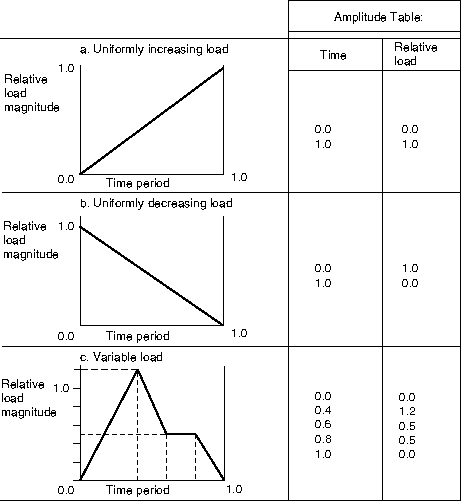

#### 定义等间距数据

选择等间距定义方法，给出在指定时间开始处固定时间间隔的幅值列表。Abaqus在每个时间间隔之间线性插值。您必须指定给出幅值数据的固定时间（或频率）间隔 。您还可以指定给出第一个幅值的时间（或最低频率）；默认值为 =0.0。

如果步中的分析时间小于表中数据存在的最早时间，则Abaqus对所有小于最早表格时间的步时间应用表中的最早值。类似地，如果分析持续到超过表中定义最后时间的时间，则对所有后续时间应用表中的最后值。

| **输入文件用法：** | ``` [*AMPLITUDE*](../key/key-link.md#usb-kws-mamplitude), NAME=*name*, DEFINITION=EQUALLY SPACED, FIXED INTERVAL=, BEGIN= ``` |
| --- | --- |

| **Abaqus/CAE用法：** | 载荷或交互模块：**创建幅值**：**等间距**：**固定间隔：**  |
|  | 第一个幅值给出的时间（或最低频率）在第一个表格单元格中指示。 |

#### 定义周期数据

选择周期定义方法，将幅值 *a* 定义为傅里叶级数：

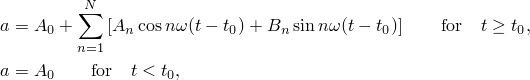

其中 、*N*、、、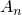和 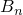、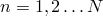 是用户定义的常数。[图34.1.2-2](pt07ch34s01aus115.md#pamplitude-periodic)中显示了一种这种形式的输入示例。

| **输入文件用法：** | ``` [*AMPLITUDE*](../key/key-link.md#usb-kws-mamplitude), NAME=*name*, DEFINITION=PERIODIC ``` |
| --- | --- |

| **Abaqus/CAE用法：** | 载荷或交互模块：**创建幅值**：**周期** |
| --- | --- |

**图34.1.2-2** 周期幅值定义示例。


#### 定义调制数据

选择调制定义方法，将幅值 *a* 定义为


其中 、*A*、、 和  是用户定义的常数。[图34.1.2-3](pt07ch34s01aus115.md#pamplitude-modulated)中显示了一种这种形式的输入示例。

| **输入文件用法：** | ``` [*AMPLITUDE*](../key/key-link.md#usb-kws-mamplitude), NAME=*name*, DEFINITION=MODULATED ``` |
| --- | --- |

| **Abaqus/CAE用法：** | 载荷或交互模块：**创建幅值**：**调制** |
| --- | --- |

**图34.1.2-3** 调制幅值定义示例。


#### 定义指数衰减

选择指数衰减定义方法，将幅值 *a* 定义为


其中 、*A*、 和  是用户定义的常数。[图34.1.2-4](pt07ch34s01aus115.md#pamplitude-decay)中显示了一种这种形式的输入示例。

| **输入文件用法：** | ``` [*AMPLITUDE*](../key/key-link.md#usb-kws-mamplitude), NAME=*name*, DEFINITION=DECAY ``` |
| --- | --- |

| **Abaqus/CAE用法：** | 载荷或交互模块：**创建幅值**：**衰减** |
| --- | --- |

**图34.1.2-4** 指数衰减幅值定义示例。


#### 定义平滑阶跃数据

Abaqus/Standard和Abaqus/Explicit可以根据平滑阶跃数据计算幅值。选择平滑阶跃定义方法，在两个连续数据点  和 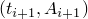 之间将幅值 *a* 定义为

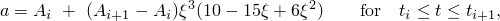

其中 。上述函数使得  在 、 在 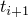，并且 *a* 的一阶和二阶导数在  和  处为零。此定义旨在平滑地从一个幅值增加到或下降到另一个幅值。

幅值 *a* 被定义为


其中 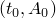 和 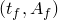 分别是第一个和最后一个数据点。

[图34.1.2-5](pt07ch34s01aus115.md#pamp-smooth-step1)和[图34.1.2-6](pt07ch34s01aus115.md#pamp-smooth-step2)中显示了这种输入形式的示例。此定义不能用于在一组数据点之间平滑插值；即，此定义不能用于曲线拟合。

| **输入文件用法：** | ``` [*AMPLITUDE*](../key/key-link.md#usb-kws-mamplitude), NAME=*name*, DEFINITION=SMOOTH STEP ``` |
| --- | --- |

| **Abaqus/CAE用法：** | 载荷或交互模块：**创建幅值**：**平滑阶跃** |
| --- | --- |

**图34.1.2-5** 带两个数据点的平滑阶跃幅值定义示例。

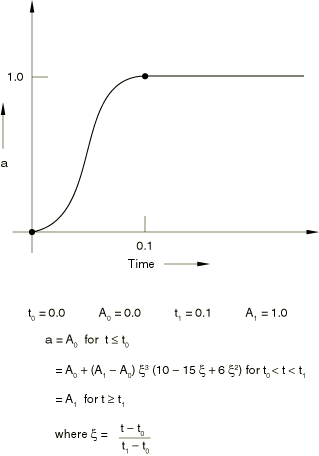

**图34.1.2-6** 带多个数据点的平滑阶跃幅值定义示例。


#### 为超塑性成型分析定义解相关幅值

Abaqus/Standard可以根据解相关变量计算幅值。选择解相关定义方法创建解相关幅值曲线。数据由初始值、最小值和最大值组成。幅值从初始值开始，然后根据求解进度进行修改，但受最小值和最大值限制。最大值通常是用于结束分析的控制机制。此方法与超塑性成型分析的蠕变应变率控制一起使用（见["率相关塑性：蠕变和膨胀，" 第23.2.4节"](pt05ch23s02abm20.md)）。

| **输入文件用法：** | ``` [*AMPLITUDE*](../key/key-link.md#usb-kws-mamplitude), NAME=*name*, DEFINITION=SOLUTION DEPENDENT ``` |
| --- | --- |

| **Abaqus/CAE用法：** | 载荷或交互模块：**创建幅值**：**解相关** |
| --- | --- |

#### 为水下爆炸定义气泡载荷幅值

在Abaqus中有两个接口可用于施加入射波载荷（见["声学和冲击载荷，" 第34.4.6节"](pt07ch34s04aus125.md#usb-prc-pacoustic-incidentwave)中的"外部源的入射波载荷"）。对于任一接口，气泡动力学可以使用Abaqus内部的模型来描述。["声学和冲击载荷，" 第34.4.6节"](pt07ch34s04aus125.md#usb-prc-pacoustic-bubble)中"为球形入射波载荷定义气泡载荷"讨论了这个内置力学模型以及定义气泡行为的参数。相关理论细节在["入射膨胀波场的载荷，" Abaqus理论指南第6.3.1节"](../stm/stm-link.md#stm-ldc-undexloads)中描述。

入射波载荷的首选接口使用UNDEX炸药特性定义指定气泡动力学（见["声学和冲击载荷，" 第34.4.6节"](pt07ch34s04aus125.md#usb-prc-pacoustic-bubble)中的"为球形入射波载荷定义气泡载荷"）。入射波载荷的替代接口使用本节中描述的气泡定义来定义气泡载荷幅值。

[图34.1.2-7](pt07ch34s01aus115.md#pamp-bubble-load)中显示了一个气泡幅值定义示例，具有以下输入数据。


| **输入文件用法：** | ``` [*AMPLITUDE*](../key/key-link.md#usb-kws-mamplitude), NAME=*name*, DEFINITION=BUBBLE ``` |
| --- | --- |

| **Abaqus/CAE用法：** | Abaqus/CAE不支持气泡幅值。但是，在交互模块中使用UNDEX炸药特性定义支持水下爆炸的气泡载荷。 |
| --- | --- |

**图34.1.2-7** 气泡幅值定义示例：（a）气泡半径和（b）气泡中心在流体表面下的深度。


#### 通过用户子程序定义幅值

选择用户定义方法，通过在用户子程序[`UAMP`](../sub/sub-link.md#sub-xsl-uamp)（Abaqus/Standard）或[`VUAMP`](../sub/sub-link.md#sub-xsl-vuamp)（Abaqus/Explicit）中编码来定义幅值曲线。您定义幅值函数在时间中的值，以及（可选）所寻求函数的导数和积分的值，如["UAMP，" Abaqus用户子程序参考指南第1.1.19节"](../sub/sub-link.md#sub-rtn-uuamp)和["VUAMP，" Abaqus用户子程序参考指南第1.2.8节"](../sub/sub-link.md#sub-rtn-uexpamp)中所述。

您可以使用任意数量的属性来计算幅值，并且您可以使用可以为每个幅值定义独立更新的任意数量的状态变量。

在Abaqus/Standard中，复杂特征值提取、线性动力过程以及以物理自由度直接计算响应的稳态动力分析不支持用户定义的幅值。

此外，解相关传感器可用于定义用户自定义幅值。传感器可以通过其名称标识，两个工具程序允许在用户子程序内提取当前传感器值（见["获取传感器信息，" Abaqus用户子程序参考指南第2.1.16节"](../sub/sub-link.md#sub-utl-ugetsensor)）。["Abaqus实例问题指南》第4.1.2节"](../exa/exa-link.md#exa-mec-crank)中的"曲柄机构"举例说明如何使用此功能实现简单的控制/逻辑模型。

| **输入文件用法：** | ``` [*AMPLITUDE*](../key/key-link.md#usb-kws-mamplitude), NAME=*name*, DEFINITION=USER, PROPERTIES=*m*, VARIABLES=*n* ``` |
| --- | --- |

| **Abaqus/CAE用法：** | 载荷或交互模块：**创建幅值**：**用户**：**变量数：** *n* |
|  | 用户定义的幅值属性在Abaqus/CAE中不支持。 |

### 通过协同仿真定义执行器幅值

执行器幅值的当前值可以在任何给定时间从与逻辑建模程序的协同仿真中导入（见["协同仿真：概述，" 第17.1.1节"](pt04ch17s01abo17.md)）。执行器幅值定义上指定的名称用作协同仿真目的的执行器名称。因此，在给定时间，每个执行器关联一个实数——幅值的当前值。与任何幅值定义一样，用户指定的名称可以与任何可以引用幅值的Abaqus功能结合使用。

| **输入文件用法：** | ``` [*AMPLITUDE*](../key/key-link.md#usb-kws-mamplitude), NAME=*name*, DEFINITION=ACTUATOR ``` |
| --- | --- |

| **Abaqus/CAE用法：** | 载荷或交互模块：**创建幅值**：**执行器** |
| --- | --- |

### 将幅值定义与边界条件一起使用

当使用幅值曲线来规定模型变量的边界条件（通过从边界条件定义引用幅值）时，该变量的一阶和二阶时间导数可能也需要。例如，在直接积分动力分析步中，位移时间历史可以通过幅值变化来定义；在这种情况下，Abaqus必须计算相应的速度和加速度。

当位移时间历史由分段线性幅值变化定义时（表格或等间距幅值定义），相应的速度是分段常量的，加速度在幅值定义表中每个时间间隔结束时可能是无限的，如[图34.1.2-8](pt07ch34s01aus115.md#pamplitude-smoothing)(a)所示。这种行为是不合理的。（在Abaqus/Explicit中，幅值曲线的时间导数通常基于有限差分，如 ，因此与时间离散化相关联一些固有平滑。）

您可以通过平滑将分段线性位移变化修改为分段线性和分段二次变化的组合。平滑确保速度在幅值定义的时间周期内连续变化，并且加速度不再有奇点，如[图34.1.2-8](pt07ch34s01aus115.md#pamplitude-smoothing)(b)所示。

**图34.1.2-8** 分段线性位移定义。

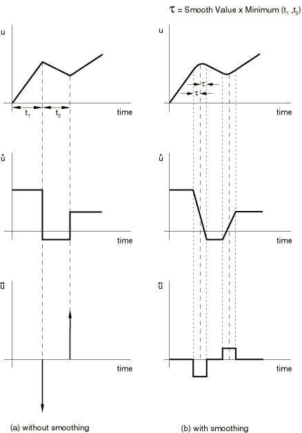

当速度时间历史由分段线性幅值变化定义时，相应的加速度是分段常量的。平滑可用于将分段线性速度变化修改为分段线和分段二次变化的组合。平滑确保加速度在幅值定义的时间周期内连续变化。

您指定 *t*——在每个时间点前后，分段线性时间变化被平滑二次时间变化替换的时间间隔分数。默认情况下，Abaqus/Standard中 *t*=0.25；Abaqus/Explicit中默认 *t*=0.0。允许范围为 0.0  *t*  0.5。对于包含大时间间隔的幅值定义，建议使用0.05的值以避免与指定定义的严重偏离。

在Abaqus/Explicit中，如果使用幅值曲线指定位移跳跃（即，使用幅值函数定义的起始位移不对应于该时间的位移），则此位移跳跃将被忽略。在Abaqus/Explicit中，边界条件以增量方式使用幅值曲线的斜率来强制执行。为了避免在Abaqus/Explicit中未使用平滑时可能产生的"嘈杂"解，最好指定节点的 velocity 历史而不是位移历史（见["Abaqus/Standard和Abaqus/Explicit中的边界条件，" 第34.3.1节"](pt07ch34s03aus118.md)）。

当幅值定义与不需要时间导数求值的规定条件一起使用时（例如，集中载荷、分布载荷、温度场等，或者是静态分析），平滑的使用将被忽略。

当使用平滑阶跃幅值曲线定义位移时间历史时，速度和加速度在每个指定的数据点处将为零，尽管平均速度和加速度很可能非零。因此，此幅值定义应仅用于定义（平滑）阶跃函数。

| **输入文件用法：** | 使用以下选项之一： |
| --- | --- |
|  | ``` [*AMPLITUDE*](../key/key-link.md#usb-kws-mamplitude), NAME=*name*, DEFINITION=TABULAR, SMOOTH=*t* [*AMPLITUDE*](../key/key-link.md#usb-kws-mamplitude), NAME=*name*, DEFINITION=EQUALLY SPACED, SMOOTH=*t* ``` |

| **Abaqus/CAE用法：** | 载荷或交互模块：**创建幅值**：选择**表格**或**等间距**：**平滑：指定：** *t* |
| --- | --- |

### 在模态动力学中将幅值定义与二次基座运动一起使用

当使用幅值曲线在模态动力学过程中将模型变量的规定条件规定为二次基座运动时（通过在模态动力学过程中从基座运动定义引用幅值），该变量的一阶或二阶时间导数可能也需要。例如，在模态动力学过程中的二次基座运动可以定义位移时间历史。在这种情况下，Abaqus必须计算相应的加速度。

模态动力学过程使用对分段线性力的响应的精确解。因此，二次基座运动定义被施加为分段线性加速度历史。当使用位移型或速度型基座运动来定义位移或速度时间历史，并且使用表格、等间距、周期、调制或指数衰减定义的幅值变化时，基于表格数据（在与模态动力学过程中使用的时间值评估的幅值数据）计算算法加速度。在任何时间增量结束时，如果幅值曲线在该增量上是线性的，在前一增量上也是线性的，并且两个增量上的幅值变化斜率相等，则此算法加速度再现位移时间历史的精确位移和速度，或速度时间历史的精确速度。

当使用平滑阶跃幅值曲线定义位移时间历史时，速度和加速度在每个指定的数据点处将为零，尽管平均速度和加速度很可能非零。因此，此幅值定义应仅用于定义（平滑）阶跃函数。

### 定义多个幅值曲线

您可以定义任意数量的幅值曲线，并从任何载荷、边界条件或预定义场定义中引用它们。例如，一个幅值曲线可用于指定一组节点的速度，而另一个幅值曲线可用于指定物体上压力载荷的幅值。但是，如果速度和压力遵循相同的时间历史，则它们都可以引用相同的幅值曲线。在Abaqus/Standard中有一个例外：每个步中只能有一个活动解相关幅值（用于超塑性成型）。

### 缩放和偏移幅值曲线

定义幅值时，可以对时间和幅值进行缩放和偏移。例如，当您的幅值数据需要转换为其他单位系统时，或者当您重用现有幅值数据来定义相似幅值曲线时，这可能会有所帮助。如果同时应用缩放和偏移，则首先对幅值进行缩放然后偏移。幅值偏移和缩放适用于除解相关、气泡和用户之外的所有幅值定义类型；对于执行器幅值定义类型，仅支持幅值幅值的缩放和偏移。

| **输入文件用法：** | ``` [*AMPLITUDE*](../key/key-link.md#usb-kws-mamplitude), NAME=*name*, SHIFTX=*shiftx_value*, SHIFTY=*shifty_value*, SCALEX=*scalex_value*, SCALEY=*scaley_value* ``` |
| --- | --- |

| **Abaqus/CAE用法：** | Abaqus/CAE不支持幅值曲线的缩放和偏移。 |
| --- | --- |

### 从备用文件读取数据

幅值曲线的数据可以包含在单独的文件中。

| **输入文件用法：** | ``` [*AMPLITUDE*](../key/key-link.md#usb-kws-mamplitude), NAME=*name*, INPUT=*file_name* ``` |
|  | 如果省略INPUT参数，则假定数据行跟在关键字行之后。 |

| **Abaqus/CAE用法：** | 载荷或交互模块：**创建幅值**：任意类型：按住鼠标光标放在数据表上时点击鼠标按钮3，然后选择**从文件读取** |
| --- | --- |

### Abaqus/Standard中的基线校正

当使用幅值定义来定义时域中的加速度历史（例如，地震的地震记录）时，加速度通过时间积分可能导致事件结束时出现相对较大的位移。这种行为通常是由于仪器误差或采样频率不足以捕获实际加速度历史造成的。在Abaqus/Standard中，可以使用"基线校正"来补偿。

基线校正方法允许修改加速度历史，以最小化从给定加速度的时间积分获得的位移的整体漂移。它仅与表格或等间距幅值定义相关。

基线校正只能在直接积分动力分析中作为加速度边界条件引用时，或在模态动力学中作为加速度基座运动引用时定义。

| **输入文件用法：** | 使用以下两个选项来包括基线校正： |
| --- | --- |
|  | ``` [*AMPLITUDE*](../key/key-link.md#usb-kws-mamplitude), DEFINITION=TABULAR or EQUALLY SPACED [*BASELINE CORRECTION*](../key/key-link.md#usb-kws-mbasecorrection) ``` [*BASELINE CORRECTION*](../key/key-link.md#usb-kws-mbasecorrection)选项必须紧跟在[*AMPLITUDE*](../key/key-link.md#usb-kws-mamplitude)选项的数据行之后。 |

| **Abaqus/CAE用法：** | 载荷或交互模块：**创建幅值**：选择**表格**或**等间距**：**基线校正** |
| --- | --- |

#### 基线校正的效果

通过在加速度定义中添加加速度时间的二次变化来修改加速度。选择二次变化以在每个校正间隔内最小化均方速度。可以为幅值定义内的不同校正间隔添加不同的二次变化。或者，整个幅值历史可用作单个校正间隔。

使用更多校正间隔可以在牺牲更多修改给定加速度轨迹的情况下更好地控制位移中的任何"漂移"。无论哪种情况，修改从幅值变化的开始开始，并假设该时间的初始速度为零。

基线校正技术在["加速度记录的基线校正，" Abaqus理论指南第6.1.2节"](../stm/stm-link.md#stm-ldc-baselinecorr)中详细描述。


