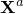
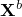
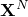
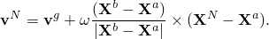

# 34.2.1 Abaqus/Standard和Abaqus/Explicit中的初始条件


**产品：** Abaqus/Standard  Abaqus/Explicit  Abaqus/CAE

##### **参考**

- ["规定条件：概述，" 第34.1.1节"](pt07ch34s01abo31.md)
- [*INITIAL CONDITIONS*](../key/key-link.md#usb-kws-minitialcond)
- ["使用预定义场编辑器，" Abaqus/CAE用户指南第16.11节"](../usi/usi-link.md#usi-lbi-iceditors)

### 概述

初始条件为特定节点或元素（如适用）指定。数据可以直接提供；可以在外部输入文件中提供；或者，在某些情况下，可以通过用户子程序或从先前Abaqus分析的结果或输出数据库文件提供。

如果未指定初始条件，则除多孔金属塑性模型中的相对密度为1.0外，所有初始条件均为零。

### 指定正在定义的初始条件类型

可以根据要执行的分析指定各种类型的初始条件。每种初始条件类型在下面按字母顺序解释。

#### 定义初始声学静压力

在Abaqus/Explicit中，您可以在声学节点上定义初始声学静压力值。这些值应对应于静态平衡，在分析过程中不能更改。您可以在模型中的两个参考位置指定初始声学静压力，Abaqus/Explicit将这些数据线性插值到指定节点集中的声学节点。线性插值基于每个节点到由两个参考节点定义的直线的投影位置。如果仅给出一个参考位置的值，则假定初始声学静压力是均匀的。初始声学静压力仅在声学介质能够发生空化的情况下评估空化条件时使用（见["声学介质，" 第26.3.1节"](pt05ch26s03abm58.md)）。

| **输入文件用法：** | ``` [*INITIAL CONDITIONS*](../key/key-link.md#usb-kws-minitialcond), TYPE=ACOUSTIC STATIC PRESSURE ``` |
| --- | --- |

| **Abaqus/CAE用法：** | Abaqus/CAE不支持初始声学静压力。 |
| --- | --- |

#### 定义初始归一化浓度

在Abaqus/Standard中，您可以定义归一化浓度值，用于质量扩散分析中的扩散元素（见["质量扩散分析，" 第6.9.1节"](pt03ch06s09at28.md)）。

| **输入文件用法：** | ``` [*INITIAL CONDITIONS*](../key/key-link.md#usb-kws-minitialcond), TYPE=CONCENTRATION ``` |
| --- | --- |

| **Abaqus/CAE用法：** | Abaqus/CAE不支持初始归一化浓度。 |
| --- | --- |

#### 定义初始粘接接触表面

在Abaqus/Standard中，您可以定义初始粘接或部分粘接的接触表面。这种类型的初始条件旨在与裂纹扩展功能一起使用（见["裂纹扩展分析，" 第11.4.3节"](pt04ch11s04aus69.md)）。指定的表面必须是不同的；这种类型的初始条件不能用于自接触。

如果未激活裂纹扩展功能，则表面的粘接部分不会分离。在这种情况下，定义初始粘接接触表面与定义tied接触具有相同的效果，在整个分析过程中在两个表面之间产生永久粘接（["在Abaqus/Standard中定义tied接触，" 第36.3.7节"](pt09ch36s03aus151.md)）。

| **输入文件用法：** | ``` [*INITIAL CONDITIONS*](../key/key-link.md#usb-kws-minitialcond), TYPE=CONTACT ``` |
| --- | --- |

| **Abaqus/CAE用法：** | Abaqus/CAE不支持初始粘接表面。 |
| --- | --- |

#### 定义初始损伤起始

您可以为延性、剪切以及Mschenborn和Sonne成形极限图损伤起始标准定义损伤起始测量的初始值（["延性金属的损伤起始，" 第24.2.2节"](pt05ch24s02abm42.md)）。此功能在以下情况下特别有用：金属成形操作在一个分析中完成，然后是单独的分析，对成形的金属零件进行进一步变形。第一个分析结束时的损伤起始测量可以直接指定为第二个分析的初始条件。

模拟损伤起始初始条件的替代但近似的方法是指定等效塑性应变的初始值。Abaqus根据指定的初始等效塑性应变计算损伤起始测量，假设应变路径在初始（未变形）状态和最终（变形）状态之间是线性的。这种近似不适用于在应变空间中显著偏离线性的变形路径。

| **输入文件用法：** | 使用以下选项为延性损伤起始标准指定损伤起始测量： |
| --- | --- |
|  | ``` [*INITIAL CONDITIONS*](../key/key-link.md#usb-kws-minitialcond), TYPE=DAMAGE INITIATION, CRITERION=DUCTILE ``` 使用以下选项为剪切损伤起始标准指定损伤起始测量： ``` [*INITIAL CONDITIONS*](../key/key-link.md#usb-kws-minitialcond), TYPE=DAMAGE INITIATION, CRITERION=SHEAR ``` 使用以下选项为Mschenborn和Sonne成形极限图损伤起始标准指定损伤起始测量： ``` [*INITIAL CONDITIONS*](../key/key-link.md#usb-kws-minitialcond), TYPE=DAMAGE INITIATION, CRITERION=MSFLD ``` |

| **Abaqus/CAE用法：** | Abaqus/CAE不支持定义损伤起始测量的初始值。 |
| --- | --- |

##### 为钢筋定义初始损伤起始

对于延性和剪切损伤起始标准，也可以为元素内的钢筋定义损伤起始的初始值（见["将钢筋定义为元素属性，" 第2.2.4节"](pt01ch02s02aus14.md)）。

| **输入文件用法：** | ``` [*INITIAL CONDITIONS*](../key/key-link.md#usb-kws-minitialcond), TYPE=DAMAGE INITIATION, REBAR ``` |
| --- | --- |

| **Abaqus/CAE用法：** | Abaqus/CAE不支持钢筋的初始损伤起始。 |
| --- | --- |

##### 定义在壳单元厚度上变化的初始损伤起始

对于延性和剪切损伤起始标准，可以为壳单元厚度上的每个截面点定义损伤起始的初始值。

| **输入文件用法：** | ``` [*INITIAL CONDITIONS*](../key/key-link.md#usb-kws-minitialcond), TYPE=DAMAGE INITIATION, SECTION POINTS ``` |
| --- | --- |

| **Abaqus/CAE用法：** | Abaqus/CAE不支持定义在壳单元厚度上变化的初始损伤起始。 |
| --- | --- |

#### 定义富集特征的初始位置

您可以在Abaqus/Standard分析中指定富集特征（如裂纹）的初始位置（见["使用扩展有限元方法将不连续性建模为富集特征，" 第10.7.1节"](pt04ch10s07at36.md)）。通常每个节点需要两个带符号的距离函数来描述裂纹位置，包括裂纹尖端的位置。第一个带符号的距离函数描述裂纹表面，而第二个用于构建正交表面，使得两个表面的交线定义裂纹前缘。第一个带符号的距离函数仅分配给被裂纹穿过的元素的节点，而第二个仅分配给包含裂纹尖端的元素的节点。由于裂纹完全由节点数据描述，因此不需要裂纹的显式表示。

| **输入文件用法：** | ``` [*INITIAL CONDITIONS*](../key/key-link.md#usb-kws-minitialcond), TYPE=ENRICHMENT ``` |
| --- | --- |

| **Abaqus/CAE用法：** | 交互模块：裂纹编辑器：**裂纹位置**：**指定**：选择区域 |
| --- | --- |

#### 定义预定义场变量的初始值

您可以定义预定义场变量的初始值。这些值可以在分析期间更改（见["预定义场，" 第34.6.1节"](pt07ch34s06aus128.md)）。

您必须指定正在定义的场变量编号 *n*。可以使用任意数量的场变量；每个必须连续编号（1、2、3等）。重复初始条件定义，使用不同的场变量编号，为多个场变量定义初始条件。默认值为 *n*=1。

初始场变量值的定义必须与截面定义和相邻元素兼容，如["预定义场，" 第34.6.1节"](pt07ch34s06aus128.md)中所述。

| **输入文件用法：** | ``` [*INITIAL CONDITIONS*](../key/key-link.md#usb-kws-minitialcond), TYPE=FIELD, VARIABLE=*n* ``` |
| --- | --- |

| **Abaqus/CAE用法：** | Abaqus/CAE不支持初始预定义场变量。 |
| --- | --- |

##### 使用用户指定结果文件中的节点温度记录初始化预定义场变量

您可以使用先前Abaqus分析的输出数据库文件中特定步和增量的节点温度记录来定义预定义场变量的初始值（见["预定义场，" 第34.6.1节"](pt07ch34s06aus128.md)）。先前分析中的零件（`.prt`）文件需要用于从结果文件读取预定义场变量的初始值（["定义装配，" 第2.10.1节"](pt01ch02s10aus28.md)）。先前模型和当前模型必须始终基于零件实例的装配来定义。

| **输入文件用法：** | ``` [*INITIAL CONDITIONS*](../key/key-link.md#usb-kws-minitialcond), TYPE=FIELD, VARIABLE=*n*, FILE=*file*, STEP=*step*, INC=*inc* ``` |
| --- | --- |

| **Abaqus/CAE用法：** | Abaqus/CAE不支持初始预定义场变量。 |
| --- | --- |

##### 使用用户指定输出数据库文件中的标量节点输出定义初始预定义场变量

您可以使用先前Abaqus/Standard分析的输出数据库文件中特定步和增量的标量节点输出变量来定义预定义场变量的初始值。可用于初始化预定义场的标量节点输出变量列表，请参阅["预定义场，" 第34.6.1节"](pt07ch34s06aus128.md)。

先前分析中的零件（`.prt`）文件需要用于从输出数据库文件读取初始值（见["定义装配，" 第2.10.1节"](pt01ch02s10aus28.md)）。先前模型和当前模型必须始终基于零件实例的装配来定义；节点编号必须相同，零件实例命名必须相同。

文件扩展名是可选的；但是，只能使用输出数据库文件。

| **输入文件用法：** | ``` [*INITIAL CONDITIONS*](../key/key-link.md#usb-kws-minitialcond), TYPE=FIELD, VARIABLE=*n*, FILE=*file*, OUTPUT VARIABLE=*scalar nodal output variable*, STEP=*step*, INC=*inc* ``` |
| --- | --- |

| **Abaqus/CAE用法：** | Abaqus/CAE不支持初始预定义场变量。 |
| --- | --- |

##### 通过从用户指定输出数据库文件中的标量节点输出变量插值来为不同网格定义初始预定义场变量

当一个分析的网格与后续分析的网格不同时，Abaqus可以插值标量节点输出变量（使用原始分析的未变形网格）到您选择的预定义场变量。可用于定义预定义场变量的支持标量节点输出变量列表，请参阅["预定义场，" 第34.6.1节"](pt07ch34s06aus128.md)。当网格匹配但节点编号或零件实例命名在分析之间不同时，也可以使用此技术。Abaqus自动查找`.odb`扩展名。如果该分析模型基于零件实例的装配定义，则需要先前分析的零件（`.prt`）文件（见["定义装配，" 第2.10.1节"](pt01ch02s10aus28.md)）。

| **输入文件用法：** | ``` [*INITIAL CONDITIONS*](../key/key-link.md#usb-kws-minitialcond), TYPE=FIELD, VARIABLE=*n*, OUTPUT VARIABLE=*scalar nodal output variable*, INTERPOLATE, FILE=*file*, STEP=*step*, INC=*inc* ``` |
| --- | --- |

| **Abaqus/CAE用法：** | Abaqus/CAE不支持初始预定义场变量。 |
| --- | --- |

#### 定义流体填充结构中的初始流体压力

您可以为流体填充结构规定初始压力（见["表面流体空腔：概述，" 第11.5.1节"](pt04ch11s05aus70.md)）。

请勿使用这种类型的初始条件在Abaqus/Standard中定义多孔介质中的初始条件；而应使用初始孔隙流体压力（见下文）。

| **输入文件用法：** | ``` [*INITIAL CONDITIONS*](../key/key-link.md#usb-kws-minitialcond), TYPE=FLUID PRESSURE ``` |
| --- | --- |

| **Abaqus/CAE用法：** | 载荷模块：**创建预定义场**：**步：初始**，为**类别**选择**其他**，为**所选步的类型**选择**流体空腔压力**；选择流体空腔相互作用；**流体空腔压力**：*压力* |
| --- | --- |

#### 定义用于塑性硬化的状态变量的初始值

您可以规定等效塑性应变的初始值，如果相关，还可为使用金属塑性（["非弹性行为，" 第23.1.1节"](pt05ch23s01abo20.md)）或多孔 Drucker-Prager（["扩展Drucker-Prager模型，" 第23.3.1节"](pt05ch23s03abm30.md)）材料模型的元素规定初始背应力张量。这些初始量旨在用于处于加工硬化状态的材料；可以直接定义或通过用户子程序[`HARDINI`](../sub/sub-link.md#sub-xsl-hardini)定义。您还可以为使用可压碎泡沫材料模型与体积硬化（["可压碎泡沫塑性模型，" 第23.3.5节"](pt05ch23s03abm34.md)）的元素规定体积压缩塑性应变  的初始值。

您还可以为非线性 kinematic 硬化模型指定多个背应力。可选地，您可以使用完整张量格式指定 kinematic 偏移张量（背应力），无论初始条件应用到的元素类型如何。

| **输入文件用法：** | ``` [*INITIAL CONDITIONS*](../key/key-link.md#usb-kws-minitialcond), TYPE=HARDENING, NUMBER BACKSTRESSES=*n*, FULL TENSOR ``` |
| --- | --- |

| **Abaqus/CAE用法：** | 载荷模块：**创建预定义场**：**步：初始**，为**类别**选择**机械**，为**所选步的类型**选择**硬化**；选择区域；**背应力数量**：*n* |
| --- | --- |

##### 为钢筋定义硬化参数

也可以为元素内的钢筋定义硬化参数。钢筋在["将钢筋定义为元素属性，" 第2.2.4节"](pt01ch02s02aus14.md)中讨论。

| **输入文件用法：** | ``` [*INITIAL CONDITIONS*](../key/key-link.md#usb-kws-minitialcond), TYPE=HARDENING, REBAR ``` |
| --- | --- |

| **Abaqus/CAE用法：** | 载荷模块：**创建预定义场**：**步：初始**，为**类别**选择**机械**，为**所选步的类型**选择**硬化**；选择区域；**定义：钢筋** |
| --- | --- |

##### 在用户子程序[`HARDINI`](../sub/sub-link.md#sub-xsl-hardini)中定义硬化参数

对于复杂情况，在Abaqus/Standard中可以使用用户子程序[`HARDINI`](../sub/sub-link.md#sub-xsl-hardini)定义初始加工硬化。在这种情况下，Abaqus/Standard将在分析开始时为模型中的每个材料点调用子程序。然后您可以将每个点的初始条件定义为坐标、元素编号等的函数。

| **输入文件用法：** | ``` [*INITIAL CONDITIONS*](../key/key-link.md#usb-kws-minitialcond), TYPE=HARDENING, USER ``` |
| --- | --- |

| **Abaqus/CAE用法：** | 载荷模块：**创建预定义场**：**步：初始**，为**类别**选择**机械**，为**所选步的类型**选择**硬化**；选择区域；**定义：用户定义** |
| --- | --- |

#### 定义用于切向流体流动的初始开放元素

您可以指定用于切向流体流动的初始开放孔隙压力内聚元素（见["定义流体在内聚元素间隙中的本构响应，" 第32.5.7节"](pt06ch32s05alm46.md)）。

| **输入文件用法：** | ``` [*INITIAL CONDITIONS*](../key/key-link.md#usb-kws-minitialcond), TYPE=INITIAL GAP ``` |
| --- | --- |

| **Abaqus/CAE用法：** | Abaqus/CAE不支持初始间隙。 |
| --- | --- |

#### 定义强制对流热传递元素中的初始质量流率

在Abaqus/Standard中，您可以定义通过强制对流热传递元素的初始质量流率。您可以指定预定义质量流率场，以便在分析步中改变质量流率的值（见["非耦合热传递分析，" 第6.5.2节"](pt03ch06s05at18.md)）。

| **输入文件用法：** | ``` [*INITIAL CONDITIONS*](../key/key-link.md#usb-kws-minitialcond), TYPE=MASS FLOW RATE ``` |
| --- | --- |

| **Abaqus/CAE用法：** | Abaqus/CAE不支持初始质量流率。 |
| --- | --- |

#### 定义塑性应变的初始值

您可以为使用金属塑性（["非弹性行为，" 第23.1.1节"](pt05ch23s01abo20.md)）或多孔 Drucker-Prager（["扩展Drucker-Prager模型，" 第23.3.1节"](pt05ch23s03abm30.md)）材料模型的元素定义初始塑性应变场。指定的塑性应变值将均匀应用于元素，除非在壳元素的厚度上每个截面点定义。

如果定义了局部坐标系（见["方向，" 第2.2.5节"](pt01ch02s02aus15.md)），则必须以局部系统给出塑性应变分量。

| **输入文件用法：** | ``` [*INITIAL CONDITIONS*](../key/key-link.md#usb-kws-minitialcond), TYPE=PLASTIC STRAIN ``` |
| --- | --- |

| **Abaqus/CAE用法：** | Abaqus/CAE不支持初始塑性应变条件。 |
| --- | --- |

##### 为钢筋定义初始塑性应变

也可以为元素内的钢筋定义应力的初始值（见["将钢筋定义为元素属性，" 第2.2.4节"](pt01ch02s02aus14.md)）。

| **输入文件用法：** | ``` [*INITIAL CONDITIONS*](../key/key-link.md#usb-kws-minitialcond), TYPE=PLASTIC STRAIN, REBAR ``` |
| --- | --- |

| **Abaqus/CAE用法：** | Abaqus/CAE不支持初始塑性应变条件。 |
| --- | --- |

#### 在多孔介质中定义初始孔隙流体压力

在Abaqus/Standard中，您可以为耦合孔隙流体扩散/应力分析中的节点定义初始孔隙压力 （见["耦合孔隙流体扩散和应力分析，" 第6.8.1节"](pt03ch06s08at26.md)）。初始孔隙压力可以直接定义为与高程相关的函数，或通过用户子程序[`UPOREP`](../sub/sub-link.md#sub-xsl-uporep)定义。

##### 与高程相关的初始孔隙压力

当为特定节点集规定与高程相关的孔隙压力时，假定垂直方向（三维和轴对称模型中为*z*方向，二维模型中为*y*方向）中的孔隙压力随该垂直坐标线性变化。您必须给出两组孔隙压力和高程值来定义整个节点集中的孔隙压力分布。仅输入第一个孔隙压力值（省略第二个孔隙压力值和高程值）可定义恒定孔隙压力分布。

| **输入文件用法：** | ``` [*INITIAL CONDITIONS*](../key/key-link.md#usb-kws-minitialcond), TYPE=PORE PRESSURE ``` |
| --- | --- |

| **Abaqus/CAE用法：** | 载荷模块：**创建预定义场**：**步：初始**：为**类别**选择**其他**，为**所选步的类型**选择**孔隙压力**；选择区域；**点1分布：均匀**或选择分析场 |
| --- | --- |

##### 在用户子程序[`UPOREP`](../sub/sub-link.md#sub-xsl-uporep)中定义初始孔隙压力

对于复杂情况，初始孔隙压力值可以通过用户子程序[`UPOREP`](../sub/sub-link.md#sub-xsl-uporep)定义。在这种情况下，Abaqus/Standard将在分析开始时为模型中的所有节点调用子程序[`UPOREP`](../sub/sub-link.md#sub-xsl-uporep)。您可以将每个节点的初始孔隙压力定义为坐标、节点编号等的函数。

| **输入文件用法：** | ``` [*INITIAL CONDITIONS*](../key/key-link.md#usb-kws-minitialcond), TYPE=PORE PRESSURE, USER ``` |
| --- | --- |

| **Abaqus/CAE用法：** | 载荷模块：**创建预定义场**：**步：初始**：为**类别**选择**其他**，为**所选步的类型**选择**孔隙压力**；选择区域；**点1分布：用户定义** |
| --- | --- |

##### 使用用户指定输出数据库文件中的节点孔隙压力输出定义初始孔隙压力值

您可以使用先前Abaqus/Standard分析的输出数据库（`.odb`）文件中特定步和增量的节点孔隙压力输出变量来定义初始孔隙压力值。文件扩展名是可选的；但是，只能使用输出数据库文件。

对于相同的网格孔隙压力映射，先前模型和当前模型必须一致定义，包括节点编号，在两个模型中必须相同。如果模型基于零件实例的装配定义，则零件实例命名必须相同。

| **输入文件用法：** | ``` [*INITIAL CONDITIONS*](../key/key-link.md#usb-kws-minitialcond), TYPE=PORE PRESSURE, FILE=*file*, STEP=*step*, INC=*inc* ``` |
| --- | --- |

| **Abaqus/CAE用法：** | 载荷模块：**创建预定义场**：**步：初始**：为**类别**选择**其他**，为**所选步的类型**选择**孔隙压力**；选择区域；**点1分布：从输出数据库文件** |
| --- | --- |

##### 为用户指定输出数据库文件中不同的孔隙压力映射值插值初始孔隙压力值

对于不同的网格孔隙压力映射，需要插值。您还可以通过指定源区域（以元素集的形式从中插值孔隙压力）和目标区域（以节点集的形式将孔隙压力映射到其上）来限制插值区域。

| **输入文件用法：** | ``` [*INITIAL CONDITIONS*](../key/key-link.md#usb-kws-minitialcond), TYPE=PORE PRESSURE, FILE=*file*, INTERPOLATE, STEP=*step*, INC=*inc* [*INITIAL CONDITIONS*](../key/key-link.md#usb-kws-minitialcond), TYPE=PORE PRESSURE, FILE=*file*, INTERPOLATE, STEP=*step*, INC=*inc*, DRIVING ELSETS ``` |
| --- | --- |

| **Abaqus/CAE用法：** | 您不能在Abaqus/CAE中指定要插值孔隙压力的区域。 |
| --- | --- |

#### 在质量扩散分析中定义初始压力应力

在Abaqus/Standard中，您可以指定质量扩散分析中节点处的初始压力应力 （见["质量扩散分析，" 第6.9.1节"](pt03ch06s09at28.md)）。

| **输入文件用法：** | ``` [*INITIAL CONDITIONS*](../key/key-link.md#usb-kws-minitialcond), TYPE=PRESSURE STRESS ``` |
| --- | --- |

| **Abaqus/CAE用法：** | Abaqus/CAE不支持初始压力应力。 |
| --- | --- |

##### 从用户指定结果文件定义初始压力应力

您可以将压力应力的初始值定义为先前Abaqus/Standard应力/位移分析结果文件中特定步和增量存在的值（见["预定义场，" 第34.6.1节"](pt07ch34s06aus128.md)）。使用`.fil`文件扩展名是可选的。当先前模型或当前模型基于零件实例的装配定义时，无法从结果文件读取初始压力应力值（["定义装配，" 第2.10.1节"](pt01ch02s10aus28.md)）。

| **输入文件用法：** | ``` [*INITIAL CONDITIONS*](../key/key-link.md#usb-kws-minitialcond), TYPE=PRESSURE STRESS, FILE=*file*, STEP=*step*, INC=*inc* ``` |
| --- | --- |

| **Abaqus/CAE用法：** | Abaqus/CAE不支持初始压力应力。 |
| --- | --- |

#### 在多孔介质中定义初始孔隙比

在Abaqus/Standard中，您可以指定多孔介质节点处孔隙比*e*的初始值（见["耦合孔隙流体扩散和应力分析，" 第6.8.1节"](pt03ch06s08at26.md)）。初始孔隙比可以直接定义为与高程相关的函数，通过从先前输出数据库文件插值，或通过用户子程序[`VOIDRI`](../sub/sub-link.md#sub-xsl-voidri)定义。

##### 与高程相关的初始孔隙比

当为特定节点集规定与高程相关的孔隙比时，假定垂直方向（三维和轴对称模型中为*z*方向，二维模型中为*y*方向）中的孔隙比随该垂直坐标线性变化。当为具有完全积分一阶元素的区域指定孔隙比时，孔隙比的节点值被插值到元素质心，并假定在元素中为常量。您必须提供两组孔隙比和高程值来定义整个节点集中的孔隙比分布。仅输入第一个孔隙比值（省略第二个孔隙比值和高程值）可定义恒定孔隙比分布。

| **输入文件用法：** | ``` [*INITIAL CONDITIONS*](../key/key-link.md#usb-kws-minitialcond), TYPE=RATIO ``` |
| --- | --- |

| **Abaqus/CAE用法：** | 载荷模块：**创建预定义场**：**步：初始**：为**类别**选择**其他**，为**所选步的类型**选择**孔隙比**；选择区域；**点1分布：均匀**或选择分析场 |
| --- | --- |

##### 从用户指定输出数据库定义孔隙比

您可以从先前Abaqus/Standard土壤分析的输出数据库（`.odb`）文件中定义初始孔隙比，其中孔隙比被请求为输出。

| **输入文件用法：** | ``` [*INITIAL CONDITIONS*](../key/key-link.md#usb-kws-minitialcond), TYPE=RATIO, FILE=*file*, STEP=*step*, INC=*inc* ``` |
| --- | --- |

| **Abaqus/CAE用法：** | 载荷模块：**创建预定义场**：**步：初始**：为**类别**选择**其他**，为**所选步的类型**选择**孔隙比**；选择区域；**点1分布：从输出数据库文件** |
| --- | --- |

##### 从用户指定输出数据库中的值插值初始孔隙比

当您从先前Abaqus/Standard土壤分析的输出数据库（`.odb`）文件定义初始孔隙比时，您还可以通过指定源区域（以元素集的形式从中插值孔隙比）和目标区域（以节点集的形式将孔隙比映射到其上）来限制插值区域。

| **输入文件用法：** | ``` [*INITIAL CONDITIONS*](../key/key-link.md#usb-kws-minitialcond), TYPE=RATIO, INTERPOLATE, FILE=*file*, STEP=*step*, INC=*inc*, DRIVING ELSETS ``` |
| --- | --- |

| **Abaqus/CAE用法：** | 您不能在Abaqus/CAE中指定要插值孔隙比的区域。 |
| --- | --- |

##### 在用户子程序[`VOIDRI`](../sub/sub-link.md#sub-xsl-voidri)中定义孔隙比

对于复杂情况，孔隙比初始值可以通过用户子程序[`VOIDRI`](../sub/sub-link.md#sub-xsl-voidri)定义。在这种情况下，Abaqus/Standard将在分析开始时为模型中的每个材料积分点调用子程序[`VOIDRI`](../sub/sub-link.md#sub-xsl-voidri)。然后您可以将每个点的初始孔隙比定义为坐标、元素编号等的函数。

| **输入文件用法：** | ``` [*INITIAL CONDITIONS*](../key/key-link.md#usb-kws-minitialcond), TYPE=RATIO, USER ``` |
| --- | --- |

| **Abaqus/CAE用法：** | 载荷模块：**创建预定义场**：**步：初始**：为**类别**选择**其他**，为**所选步的类型**选择**孔隙比**；选择区域；**点1分布：用户定义** |
| --- | --- |

#### 为膜元素定义参考网格

在Abaqus/Explicit中，您可以为膜元素指定参考网格（初始度量）。这在有限元安全气囊仿真中通常用于对由安全气囊折叠过程产生的褶皱进行建模。平面网格可能适用于无应力参考配置，但初始状态可能需要相应的折叠网格定义折叠状态。定义与初始配置不同的参考配置可能导致基于材料定义的初始配置中的非零应力和应变。如果为元素指定了参考网格，则为同一元素指定的任何初始应力或应变条件都将被忽略。

如果在膜元素中定义了钢筋层，则参考配置中定义的角度方向将被更新，以在初始配置中获得相同的方向。

您可以使用元素编号和每个元素中节点的坐标，或使用节点编号和节点的坐标来定义参考网格。必须为两种方法指定元素中所有节点的坐标，以便为该元素提供有效的初始条件。这两种替代方案是互斥的。

| **输入文件用法：** | 使用元素编号和元素所有节点的坐标指定参考网格： |
| --- | --- |
|  | ``` [*INITIAL CONDITIONS*](../key/key-link.md#usb-kws-minitialcond), TYPE=REF COORDINATE ``` 使用节点编号和节点坐标指定参考网格： ``` [*INITIAL CONDITIONS*](../key/key-link.md#usb-kws-minitialcond), TYPE=NODE REF COORDINATE ``` |

| **Abaqus/CAE用法：** | Abaqus/CAE不支持为膜元素指定参考网格。 |
| --- | --- |

#### 定义初始相对密度

您可以为多孔金属塑性材料模型（见["多孔金属塑性，" 第23.2.9节"](pt05ch23s02abm25.md)）或状态方程（见["状态方程，" 第25.2.1节"](pt05ch25s02abm50.md)）指定相对密度场的初始值。

| **输入文件用法：** | ``` [*INITIAL CONDITIONS*](../key/key-link.md#usb-kws-minitialcond), TYPE=RELATIVE DENSITY ``` |
| --- | --- |

| **Abaqus/CAE用法：** | Abaqus/CAE不支持初始相对密度。 |
| --- | --- |

#### 定义初始角速度和线速度

您可以规定以角速度和线速度表示的初始速度。这种类型的初始条件通常用于定义旋转机器组件的初始速度，如喷气发动机。初始速度通过给出角速度 、旋转轴（从点 *a* 在  到点 *b* 在  定义）和线速度  来指定。则在  处节点 *N* 的初始速度为



| **输入文件用法：** | ``` [*INITIAL CONDITIONS*](../key/key-link.md#usb-kws-minitialcond), TYPE=ROTATING VELOCITY ``` |
| --- | --- |

| **Abaqus/CAE用法：** | 载荷模块：**创建预定义场**：**步：初始**：为**类别**选择**机械**，为**所选步的类型**选择**速度** |
| --- | --- |

#### 为多孔介质定义初始饱和度

在Abaqus/Standard中，您可以为耦合孔隙流体扩散/应力分析中的元素定义初始饱和度*s*（见["耦合孔隙流体扩散和应力分析，" 第6.8.1节"](pt03ch06s08at26.md)）。

| **输入文件用法：** | ``` [*INITIAL CONDITIONS*](../key/key-link.md#usb-kws-minitialcond), TYPE=SATURATION ``` |
| --- | --- |

| **Abaqus/CAE用法：** | 载荷模块：**创建预定义场**：**步：初始**：为**类别**选择**其他**，为**所选步的类型**选择**饱和度** |
| --- | --- |

#### 定义解相关状态变量的初始值

您可以定义解相关状态变量的初始值（见["用户子程序：概述，" 第18.1.1节"](pt04ch18s01aus104.md)）。初始值可以直接定义，或者在Abaqus/Standard中通过用户子程序[`SDVINI`](../sub/sub-link.md#sub-xsl-sdvini)定义。直接给出的值将均匀应用于元素。

| **输入文件用法：** | ``` [*INITIAL CONDITIONS*](../key/key-link.md#usb-kws-minitialcond), TYPE=SOLUTION ``` |
| --- | --- |

| **Abaqus/CAE用法：** | Abaqus/CAE不支持初始解相关变量。 |
| --- | --- |

##### 为钢筋定义解相关状态变量的初始值

也可以为元素内的钢筋定义解相关变量的初始值。钢筋在["将钢筋定义为元素属性，" 第2.2.4节"](pt01ch02s02aus14.md)中讨论。

| **输入文件用法：** | ``` [*INITIAL CONDITIONS*](../key/key-link.md#usb-kws-minitialcond), TYPE=SOLUTION, REBAR ``` |
| --- | --- |

| **Abaqus/CAE用法：** | Abaqus/CAE不支持初始解相关状态变量。 |
| --- | --- |

##### 在用户子程序[`SDVINI`](../sub/sub-link.md#sub-xsl-sdvini)中定义解相关状态变量的初始值

对于复杂情况，在Abaqus/Standard中可以使用用户子程序[`SDVINI`](../sub/sub-link.md#sub-xsl-sdvini)定义解相关状态变量的初始值。在这种情况下，Abaqus/Standard将在分析开始时为模型中的每个材料积分点调用子程序[`SDVINI`](../sub/sub-link.md#sub-xsl-sdvini)。然后您可以将每个点的所有解相关状态变量定义为坐标、元素编号等的函数。

| **输入文件用法：** | ``` [*INITIAL CONDITIONS*](../key/key-link.md#usb-kws-minitialcond), TYPE=SOLUTION, USER ``` |
| --- | --- |

| **Abaqus/CAE用法：** | Abaqus/CAE不支持用户子程序[`SDVINI`](../sub/sub-link.md#sub-xsl-sdvini)。 |
| --- | --- |

#### 为状态方程定义初始比能

在Abaqus/Explicit中，您可以为状态方程指定比能的初始值（见["状态方程，" 第25.2.1节"](pt05ch25s02abm50.md)）。

| **输入文件用法：** | ``` [*INITIAL CONDITIONS*](../key/key-link.md#usb-kws-minitialcond), TYPE=SPECIFIC ENERGY ``` |
| --- | --- |

| **Abaqus/CAE用法：** | Abaqus/CAE不支持初始比能。 |
| --- | --- |

#### 定义插桩靴嵌入或插桩靴预载荷

在Abaqus/Standard中，您可以定义插桩靴的初始嵌入。或者，您可以定义插桩靴的初始垂直预载荷（见["弹塑性关节，" 第32.10.1节"](pt06ch32s10alm55.md)）。

| **输入文件用法：** | 使用以下选项之一： |
| --- | --- |
|  | ``` [*INITIAL CONDITIONS*](../key/key-link.md#usb-kws-minitialcond), TYPE=SPUD EMBEDMENT [*INITIAL CONDITIONS*](../key/key-link.md#usb-kws-minitialcond), TYPE=SPUD PRELOAD ``` |

| **Abaqus/CAE用法：** | Abaqus/CAE不支持初始插桩靴嵌入和预载荷。 |
| --- | --- |

#### 定义初始应力

您可以定义初始应力场。初始应力可以直接定义，或者在Abaqus/Standard中通过用户子程序[`SIGINI`](../sub/sub-link.md#sub-xsl-sigini)定义。直接给出的应力值将均匀应用于元素，除非在壳元素的厚度上每个截面点定义。

如果定义了局部坐标系（见["方向，" 第2.2.5节"](pt01ch02s02aus15.md)），则必须以局部系统给出应力。

在土壤（多孔介质）问题中，应给出初始有效应力；关于在多孔介质中定义初始条件，请参阅["耦合孔隙流体扩散和应力分析，" 第6.8.1节"](pt03ch06s08at26.md)。

如果梁元素或壳元素的截面属性由一般截面定义，则初始应力值将作为初始截面力和力矩应用。对于梁，初始条件只能为轴向力、弯矩和扭矩指定。对于壳，初始条件只能为膜力、弯矩和扭矩指定。在壳和梁中，都不能为横向剪切力规定初始条件。

不能为弹簧元素定义初始应力场。关于在弹簧元素中定义初始力，请参阅["弹簧，" 第32.1.1节"](pt06ch32s01alm37.md)。

不能为使用织物材料的元素定义初始应力场。但是，可以通过定义参考网格在由膜元素组成的织物材料中引入初始应力和应变状态（见上文["为膜元素定义参考网格"](pt07ch34s02aus116.md#usb-prc-pinitialcond-refmesh)）。

| **输入文件用法：** | ``` [*INITIAL CONDITIONS*](../key/key-link.md#usb-kws-minitialcond), TYPE=STRESS ``` |
| --- | --- |

| **Abaqus/CAE用法：** | 载荷模块：**创建预定义场**：**步：初始**：为**类别**选择**机械**，为**所选步的类型**选择**应力** |
| --- | --- |

##### 为钢筋定义初始应力

也可以为元素内的钢筋定义应力的初始值（见["将钢筋定义为元素属性，" 第2.2.4节"](pt01ch02s02aus14.md)）。

| **输入文件用法：** | ``` [*INITIAL CONDITIONS*](../key/key-link.md#usb-kws-minitialcond), TYPE=STRESS, REBAR ``` |
| --- | --- |

| **Abaqus/CAE用法：** | Abaqus/CAE不支持钢筋的初始应力。 |
| --- | --- |

##### 定义在壳单元厚度上变化的初始应力

可以为壳单元厚度上的每个截面点定义应力的初始值。

| **输入文件用法：** | ``` [*INITIAL CONDITIONS*](../key/key-link.md#usb-kws-minitialcond), TYPE=STRESS, SECTION POINTS ``` |
| --- | --- |

| **Abaqus/CAE用法：** | Abaqus/CAE不支持定义在壳单元厚度上变化的初始应力。 |
| --- | --- |

##### 在用户子程序[`SIGINI`](../sub/sub-link.md#sub-xsl-sigini)中定义初始应力

对于复杂情况（如弯头元素），在Abaqus/Standard中可以通过用户子程序[`SIGINI`](../sub/sub-link.md#sub-xsl-sigini)定义初始应力场。在这种情况下，Abaqus/Standard将在分析开始时为模型中的每个材料计算点调用子程序[`SIGINI`](../sub/sub-link.md#sub-xsl-sigini)。然后您可以将每个点的所有活动应力分量定义为坐标、元素编号等的函数。

| **输入文件用法：** | ``` [*INITIAL CONDITIONS*](../key/key-link.md#usb-kws-minitialcond), TYPE=STRESS, USER ``` |
| --- | --- |

| **Abaqus/CAE用法：** | Abaqus/CAE不支持用户子程序[`SIGINI`](../sub/sub-link.md#sub-xsl-sigini)。 |
| --- | --- |

##### 使用用户指定输出数据库文件中的应力输出定义初始应力

您可以使用先前Abaqus/Standard分析的输出数据库（`.odb`）文件中特定步和增量的应力输出变量来定义初始应力。

在这种情况下，先前模型和当前模型必须一致定义。元素编号和元素类型在两个模型中必须相同。如果模型基于零件实例的装配定义，则零件实例命名必须相同。

文件扩展名是可选的；但是，只能使用输出数据库文件。

| **输入文件用法：** | ``` [*INITIAL CONDITIONS*](../key/key-link.md#usb-kws-minitialcond), TYPE=STRESS, FILE=*file*, STEP=*step*, INC=*inc* ``` |
| --- | --- |

| **Abaqus/CAE用法：** | 载荷模块：**创建预定义场**：**步：初始**：为**类别**选择**机械**，为**所选步的类型**选择**应力**；选择区域；**规范：从输出数据库文件** |
| --- | --- |

##### 在Abaqus/Standard中建立平衡

当在Abaqus/Standard中给出初始应力时（包括钢筋混凝土中的预应力或将旧解插值到新网格上），初始应力状态可能不是有限元模型的精确平衡状态。因此，应包括一个初始步以允许Abaqus/Standard检查平衡并在必要时进行迭代以实现平衡。

在土壤分析中（即，对于包含孔隙流体压力作为变量的元素的模型），应使用geostatic应力场过程（["Geostatic应力状态，" 第6.8.2节"](pt03ch06s08at27.md)）进行平衡步。的任何初始载荷（如geostatic重力载荷）应包含在此步定义中，有助于初始平衡。此步中指定的初始时间增量和总时间应相同。初始应力在时间为零时完全施加；如果能够实现平衡，此步将在一增量中收敛。因此，增量没有好处。

要为所有其他分析实现平衡，应使用静态过程（["静态应力分析，" 第6.2.2节"](pt03ch06s02at01.md)）的第一个步。建议您指定初始时间增量等于此步中指定的总时间，以便Abaqus/Standard将尝试在一增量中找到平衡。默认情况下，Abaqus/Standard在第一步中会随时间线性减小不平衡应力。这允许Abaqus/Standard，如果不能在一增量中找到平衡，则使用自动增量。这种 ramping 的实现方式如下：

1. 在每个材料点定义一组附加的人工应力。这些应力大小等于初始应力，但符号相反。材料点应力与这些人工应力的总和在步开始时产生零内力。
2. 这些内部人工应力在第一步中随时间线性 ramp 掉。因此，在步结束时，人工应力已被完全移除，材料中的剩余应力将处于平衡状态。

您可以通过在初始条件上使用阶跃变化来强制Abaqus/Standard在一增量中实现平衡，而不是在整个步中 ramp 应力。如果Abaqus/Standard无法在一增量中实现平衡，分析将终止。

如果平衡步不收敛，则表明初始应力状态与施加的载荷相差甚远，以至于会产生相当大的变形。这通常不是初始应力状态的意图；因此，建议您重新检查指定的初始应力和载荷。

| **输入文件用法：** | 使用以下选项之一指定如何解决不平衡应力： |
| --- | --- |
|  | ``` [*INITIAL CONDITIONS*](../key/key-link.md#usb-kws-minitialcond), TYPE=STRESS, UNBALANCED STRESS=RAMP (default) [*INITIAL CONDITIONS*](../key/key-link.md#usb-kws-minitialcond), TYPE=STRESS, UNBALANCED STRESS=STEP ``` |

| **Abaqus/CAE用法：** | Abaqus/CAE不支持初始平衡应力。 |
| --- | --- |

##### 在Abaqus/Explicit中建立平衡

Abaqus/Explicit在计算节点初始加速度时考虑了初始应力、载荷和初始配置中的边界条件。对于初始静态问题，指定的边界条件、初始应力和初始载荷应与静态平衡一致。否则，解决方案可能有噪音。可以通过引入带有临时粘性载荷的虚拟步来减少噪音，以尝试重新建立静态平衡。或者，您可以引入一个初始短步，其中所有自由度都用边界条件固定（所有初始载荷应包含在此初始步中）；在第二步中，释放除实际边界条件外的所有条件。

#### 定义与高程相关的（geostatic）初始应力

您可以定义与高程相关的初始应力。当为特定元素集规定geostatic应力状态时，假定垂直方向（三维和轴对称模型中为*z*方向，二维模型中为*y*方向）中的应力随该垂直坐标（分段）线性变化。

对于垂直应力分量，您必须给出两组应力和高程值来定义整个元素集中的应力。对于位于给定两个高程之间的材料点，Abaqus将使用线性插值来确定初始应力；对于位于给定两个高程之外的点，Abaqus将使用线性外推。此外，通过输入一个或两个"侧向应力系数"给出水平（侧向）应力分量，这定义了侧向直接应力分量为该点垂直应力乘以系数值。在轴对称情况下，只使用一个侧向应力系数值，因此只需要输入一个值。

Geostatic初始应力仅适用于连续体元素。在Abaqus/Standard中，应在用户子程序[`SIGINI`](../sub/sub-link.md#sub-xsl-sigini)中为梁和壳指定与高程相关的初始应力，如前所述。在Abaqus/Explicit中，不能为梁和壳指定与高程相关的初始应力。

最初规定的geostatic应力状态应与施加的载荷（如重力）和边界条件平衡。应包括一个初始步以允许Abaqus在此插值完成后检查平衡；请参阅上文关于应用初始应力场时建立平衡的讨论。

| **输入文件用法：** | ``` [*INITIAL CONDITIONS*](../key/key-link.md#usb-kws-minitialcond), TYPE=STRESS, GEOSTATIC ``` |
| --- | --- |

| **Abaqus/CAE用法：** | 载荷模块：**创建预定义场**：**步：初始**：为**类别**选择**机械**，为**所选步的类型**选择**Geostatic应力** |
| --- | --- |

#### 定义初始温度

您可以在热传递或应力/位移元素的节点上定义初始温度。应力/位移元素的温度可以在分析期间更改（见["预定义场，" 第34.6.1节"](pt07ch34s06aus128.md)）。

初始温度值的定义必须与元素的截面定义和相邻元素兼容，如["预定义场，" 第34.6.1节"](pt07ch34s06aus128.md)中所述。

| **输入文件用法：** | ``` [*INITIAL CONDITIONS*](../key/key-link.md#usb-kws-minitialcond), TYPE=TEMPERATURE ``` |
| --- | --- |

| **Abaqus/CAE用法：** | 载荷模块：**创建预定义场**：**步：初始**：为**类别**选择**其他**，为**所选步的类型**选择**温度** |
| --- | --- |

##### 从用户指定结果或输出数据库文件定义初始温度

您可以将初始温度定义为先前Abaqus/Standard热传递分析的输出数据库文件中特定步和增量存在的节点温度值（见["预定义场，" 第34.6.1节"](pt07ch34s06aus128.md)）。

先前分析中的零件（`.prt`）文件需要用于从结果或输出数据库文件读取初始温度（见["定义装配，" 第2.10.1节"](pt01ch02s10aus28.md)）。先前模型和当前模型必须始终基于零件实例的装配来定义；节点编号必须相同，零件实例命名必须相同。

文件扩展名是可选的；但是，如果同时存在结果文件和输出数据库文件，则将使用结果文件。

| **输入文件用法：** | ``` [*INITIAL CONDITIONS*](../key/key-link.md#usb-kws-minitialcond), TYPE=TEMPERATURE, FILE=*file*, STEP=*step*, INC=*inc* ``` |
| --- | --- |

| **Abaqus/CAE用法：** | 载荷模块：**创建预定义场**：**步：初始**：为**类别**选择**其他**，为**所选步的类型**选择**温度**：选择区域：**分布：从结果或输出数据库文件**，**文件名：** *file*，**步：** *step*，**增量：** *inc* |
| --- | --- |

##### 为不同网格从用户指定结果或输出数据库文件插值初始温度

当热传递分析的网格与后续应力/位移分析的网格不同时，Abaqus可以将温度值从热传递模型中的节点插值到当前节点温度。此技术也可以用于网格匹配但节点编号或零件实例命名在分析之间不同的情况。只能使用输出数据库文件中的温度进行插值；Abaqus将自动查找`.odb`扩展名。如果该分析模型基于零件实例的装配定义，则需要先前分析的零件（`.prt`）文件（见["定义装配，" 第2.10.1节"](pt01ch02s10aus28.md)）。

| **输入文件用法：** | ``` [*INITIAL CONDITIONS*](../key/key-link.md#usb-kws-minitialcond), TYPE=TEMPERATURE, INTERPOLATE, FILE=*file*, STEP=*step*, INC=*inc* ``` |
| --- | --- |

| **Abaqus/CAE用法：** | 载荷模块：**创建预定义场**：**步：*analysis_step*：为**类别**选择**其他**，为**所选步的类型**选择**温度**：选择区域：**分布：从结果或输出数据库文件**，**文件名：** *file*，**网格兼容性：不兼容** |
| --- | --- |

##### 使用用户指定区域为不同网格插值初始温度

当热传递分析中元素区域接近或接触时，不同网格插值功能可能导致温度关联不明确。例如，考虑当前模型中的一个节点位于或接近热传递模型中两个相邻部件之间的边界，并且这些部件中的温度不同。在插值时，Abaqus将从热传递分析中识别该节点对应的父元素。此父元素识别使用基于容差的搜索方法完成。因此，在此示例中，父元素可能在任一相邻部件中找到，导致该节点处的温度定义不明确。您可以通过指定要从中插值温度的源区域来消除这种歧义。源区域指热传递分析，以元素集形式指定。目标区域指当前分析，以节点集形式指定。

| **输入文件用法：** | ``` [*INITIAL CONDITIONS*](../key/key-link.md#usb-kws-minitialcond), TYPE=TEMPERATURE, INTERPOLATE, FILE=*file*, STEP=*step*, INC=*inc*, DRIVING ELSETS ``` |
| --- | --- |

| **Abaqus/CAE用法：** | 您不能在Abaqus/CAE中指定要插值温度的区域。 |
| --- | --- |

##### 为仅在元素阶数不同的网格从用户指定结果或输出数据库文件插值初始温度

如果网格的唯一差异是元素阶数（热传递模型中为一阶元素，应力/位移模型中为二阶元素），则在Abaqus/Standard中，您可以指示二阶元素中节点的温度从使用一阶元素的先前热传递分析的结果或输出数据库文件中角节点温度插值。您必须确保角节点温度不是通过直接数据输入和从结果或输出数据库文件读取的混合方式定义的，因为这可能导致不现实的温度场。实际上，从热传递分析生成并在整个网格的应力分析期间从结果或输出数据库文件读取的温度的中间节点计算功能最有用。一旦激活中间节点功能，该功能将在分析的其余部分保持活动状态，包括为在分析期间改变温度的预定义温度字段定义。一般插值和中间节点功能是互斥的。

| **输入文件用法：** | ``` [*INITIAL CONDITIONS*](../key/key-link.md#usb-kws-minitialcond), TYPE=TEMPERATURE, MIDSIDE, FILE=*file*, STEP=*step*, INC=*inc* ``` |
| --- | --- |

| **Abaqus/CAE用法：** | 载荷模块：**创建预定义场**：**步：初始**：为**类别**选择**其他**，为**所选步的类型**选择**温度**：选择区域：**分布：从结果或输出数据库文件**，**文件名：** *file*，**步：** *step*，**增量：** *inc*，**网格兼容性：兼容**，并打开**插值中间节点** |
| --- | --- |

#### 为指定自由度定义初始速度

您可以为指定自由度定义初始速度。当为动力分析给出初始速度时，它们应与模型上的所有约束一致，特别是随时间变化的边界条件。Abaqus将确保它们与边界条件以及多点约束和方程约束一致，但不会检查与内部约束（如材料不可压缩性）的一致性。如有冲突，边界条件优先于初始条件。

无论使用何种局部变换，初始速度都必须以全局方向定义（["变换坐标系，" 第2.1.5节"](pt01ch02s01aus09.md)）。

| **输入文件用法：** | ``` [*INITIAL CONDITIONS*](../key/key-link.md#usb-kws-minitialcond), TYPE=VELOCITY ``` |
| --- | --- |

| **Abaqus/CAE用法：** | 载荷模块：**创建预定义场**：**步：初始**：为**类别**选择**机械**，为**所选步的类型**选择**速度** |
| --- | --- |

#### 为Eulerian元素定义初始体积分数

您可以定义初始体积分数以在Abaqus/Explicit中的Eulerian元素内创建材料。默认情况下，这些元素充满空隙。见["Eulerian分析中的初始条件，" 第14.1.1节"](pt04ch14s01aus90.md#usb-anl-aeuleriananal-ics)，了解初始化Eulerian材料的策略描述。

| **输入文件用法：** | ``` [*INITIAL CONDITIONS*](../key/key-link.md#usb-kws-minitialcond), TYPE=VOLUME FRACTION ``` |
| --- | --- |

| **Abaqus/CAE用法：** | 载荷模块：**创建预定义场**：**步：初始**：为**类别**选择**其他**，为**所选步的类型**选择**材料分配** |
| --- | --- |

### 从外部文件读取输入数据

初始条件定义的输入数据可以包含在单独的文件中。见["输入语法规则，" 第1.2.1节"](pt01ch01s02aus01.md)，了解此类文件名的语法。

| **输入文件用法：** | ``` [*INITIAL CONDITIONS*](../key/key-link.md#usb-kws-minitialcond), INPUT=*file_name* ``` |
| --- | --- |

| **Abaqus/CAE用法：** | 您不能在Abaqus/CAE中从单独文件读取初始条件。 |
| --- | --- |

### 与运动约束的一致性

Abaqus不确保初始条件与除速度外的节点量的多点约束或方程约束一致（见["通用多点约束，" 第35.2.2节"](pt08ch35s02aus130.md)和["线性约束方程，" 第35.2.1节"](pt08ch35s02aus129.md)）。初始条件（如热传递分析中的温度、土壤分析中的孔隙压力或声学分析中的声压）必须被规定为与约束这些量的任何多点约束或方程约束一致。

### 空间插值方法

当您使用在不同网格之间插值的方法定义初始条件时，Abaqus通过从旧网格中的节点到新网格中的节点插值结果进行操作。对于每个节点：

1. 找到该节点所在的元素（在旧网格中），并获得该节点在该元素中的位置。（此过程假定新网格中的所有节点都在旧网格的边界内；如果不是这样，将发出警告消息。）
2. 然后将初始条件值从该元素（在旧网格中）的节点插值到新节点。


