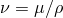
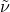
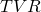
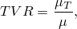
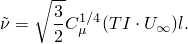
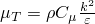
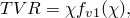
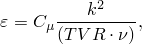
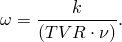
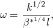

# 34.2.2 Abaqus/CFD中的初始条件


**产品：** Abaqus/CFD  Abaqus/CAE

##### **参考**

- ["规定条件：概述，" 第34.1.1节"](pt07ch34s01abo31.md)
- [*INITIAL CONDITIONS*](../key/key-link.md#usb-kws-minitialcond)
- ["使用预定义场编辑器，" Abaqus/CAE用户指南第16.11节"](../usi/usi-link.md#usi-lbi-iceditors)

### 概述

在Abaqus/CFD中，使用元素集指定流体流动仿真的初始条件。

### 定义初始速度

您可以定义元素中的初始流体流动速度；但是，如果省略此类条件，则假定默认值为零。初始速度必须以全局方向定义，无论是否使用局部变换（见["变换坐标系，" 第2.1.5节"](pt01ch02s01aus09.md)）。

对于不可压缩流动，Abaqus/CFD自动使用用户定义的边界条件，并测试指定的初始速度以确保初始速度场无散度且速度边界条件与初始速度场兼容。如果不是，Abaqus/CFD会将初始速度投影到无散度子空间，从而产生定义良好的不可压缩Navier-Stokes问题的初始条件。因此，在某些情况下，用户指定的初始速度可能被无散度且与速度边界条件匹配的速度覆盖。

| **输入文件用法：** | ``` [*INITIAL CONDITIONS*](../key/key-link.md#usb-kws-minitialcond), TYPE=VELOCITY, ELEMENT AVERAGE ``` |
| --- | --- |

| **Abaqus/CAE用法：** | 载荷模块：**创建预定义场**：**步：初始**：**类别：****流体**：**流体速度** |
| --- | --- |

### 定义初始密度

您可以定义元素中的初始流体密度。但是，如果省略初始条件，则假定材料密度定义为默认值（见["密度，" 第21.2.1节"](pt05ch21s02abm01.md)）。类似地，如果在不包括所有流体元素的元素集上指定了初始密度，则对于不包含在元素集中的那些元素，假定材料密度为默认值。

| **输入文件用法：** | ``` [*INITIAL CONDITIONS*](../key/key-link.md#usb-kws-minitialcond), TYPE=DENSITY, ELEMENT AVERAGE ``` |
| --- | --- |

| **Abaqus/CAE用法：** | 载荷模块：**创建预定义场**：**步：初始**：**类别：****流体**：**流体密度** |
| --- | --- |

### 不可压缩流体流动的初始压力

对于不可压缩流动，不需要规定初始压力条件，因为初始压力场是根据初始速度场和边界条件自动计算的。这样做是为了确保不可压缩流动的适当起始条件。

### 定义初始温度

如果求解能量方程，则必须定义元素中的初始流体温度。

| **输入文件用法：** | ``` [*INITIAL CONDITIONS*](../key/key-link.md#usb-kws-minitialcond), TYPE=TEMPERATURE, ELEMENT AVERAGE ``` |
| --- | --- |

| **Abaqus/CAE用法：** | 载荷模块：**创建预定义场**：**步：初始**：**类别：****流体**：**流体热能** |
| --- | --- |

### 直接定义初始Spalart-Allmaras湍流涡粘度

您可以直接定义用于Spalart-Allmaras湍流模型的初始湍流涡粘度 。建议使用动力粘度的三到五倍的值。动力粘度是分子粘度与密度之比（）。有关更多信息，请参阅["粘度，" 第26.1.4节"](pt05ch26s01abm54.md)

| **输入文件用法：** | ``` [*INITIAL CONDITIONS*](../key/key-link.md#usb-kws-minitialcond), TYPE=TURBNU, ELEMENT AVERAGE ``` |
| --- | --- |

| **Abaqus/CAE用法：** | 载荷模块：**创建预定义场**：**步：初始**：**类别：****流体**：**流体湍流**；**涡粘度**： |
| --- | --- |

### 直接定义初始k

您可以直接定义用于*k*–和*k*–湍流模型的初始湍动能*k*。

| **输入文件用法：** | ``` [*INITIAL CONDITIONS*](../key/key-link.md#usb-kws-minitialcond), TYPE=TURBKE, ELEMENT AVERAGE ``` |
| --- | --- |

| **Abaqus/CAE用法：** | 使用以下选项为*k*– RNG湍流模型指定初始湍动能： |
| --- | --- |
|  | 载荷模块：**创建预定义场**：**步：初始**：**类别：****流体**：**流体湍流**；**湍动能**：*k* Abaqus/CAE不支持*k*–可实现和*k*–湍流模型。 |

### 直接定义初始epsilon

您可以直接定义用于*k*–湍流模型的初始湍动能耗散率 。

| **输入文件用法：** | ``` [*INITIAL CONDITIONS*](../key/key-link.md#usb-kws-minitialcond), TYPE=TURBEPS, ELEMENT AVERAGE ``` |
| --- | --- |

| **Abaqus/CAE用法：** | 使用以下选项为*k*– RNG湍流模型指定初始湍动能耗散率： |
| --- | --- |
|  | 载荷模块：**创建预定义场**：**步：初始**：**类别：****流体**：**流体湍流**；**耗散率**： Abaqus/CAE不支持*k*–可实现湍流模型。 |

### 直接定义初始omega

您可以直接定义用于*k*–湍流模型的初始比能耗散率 。

| **输入文件用法：** | ``` [*INITIAL CONDITIONS*](../key/key-link.md#usb-kws-minitialcond), TYPE=TURBOMEGA, ELEMENT AVERAGE ``` |
| --- | --- |

| **Abaqus/CAE用法：** | Abaqus/CAE不支持*k*–湍流模型。 |
| --- | --- |

### 定义初始湍流强度

您可以为*k*–、*k*–和Spalart-Allmaras湍流模型定义初始湍流强度 。

| **输入文件用法：** | ``` [*INITIAL CONDITIONS*](../key/key-link.md#usb-kws-minitialcond), TYPE=TURBINTENSITY, ELEMENT AVERAGE ``` |
| --- | --- |

| **Abaqus/CAE用法：** | Abaqus/CAE不支持定义初始湍流强度。 |
| --- | --- |

### 定义初始湍流长度尺度

您可以为*k*–、*k*–和Spalart-Allmaras湍流模型定义初始湍流长度尺度 。

| **输入文件用法：** | ``` [*INITIAL CONDITIONS*](../key/key-link.md#usb-kws-minitialcond), TYPE=TURBLENGTHSCALE, ELEMENT AVERAGE ``` |
| --- | --- |

| **Abaqus/CAE用法：** | Abaqus/CAE不支持定义初始湍流长度尺度。 |
| --- | --- |

### 定义初始特征速度尺度

您可以为*k*–、*k*–和Spalart-Allmaras湍流模型定义初始特征速度尺度 。

| **输入文件用法：** | ``` [*INITIAL CONDITIONS*](../key/key-link.md#usb-kws-minitialcond), TYPE=TURBVELOCITYSCALE, ELEMENT AVERAGE ``` |
| --- | --- |

| **Abaqus/CAE用法：** | Abaqus/CAE不支持定义初始特征速度尺度。 |
| --- | --- |

### 定义初始涡与分子粘度比

您可以为*k*–、*k*–和Spalart-Allmaras湍流模型定义初始涡与分子粘度比 。涡与分子粘度比定义为



其中  是涡粘度， 是分子粘度。有关粘度更多信息请参阅["粘度，" 第26.1.4节"](pt05ch26s01abm54.md)。

| **输入文件用法：** | ``` [*INITIAL CONDITIONS*](../key/key-link.md#usb-kws-minitialcond), TYPE=TURBVISCOSITYRATIO, ELEMENT AVERAGE ``` |
| --- | --- |

| **Abaqus/CAE用法：** | Abaqus/CAE不支持定义初始涡与分子粘度比。 |
| --- | --- |

### 从湍流属性定义初始Spalart-Allmaras湍流涡粘度

您可以使用上述湍流属性指定初始Spalart-Allmaras湍流涡粘度 。

#### 使用湍流强度、湍流长度尺度和特征速度尺度

 的值从指定的湍流强度 、湍流长度尺度  和问题的特征速度  得到，如



 是在 *k*– 模型中用于计算涡粘度的模型系数（）；它在Spalart-Allmaras模型中不存在。但是，标准 *k*–  被包括在内，以在湍流强度、速度尺度和长度尺度用于指定初始湍流条件时保持湍流模型之间的一致性。需要特征速度尺度以避免初始速度场为零的情况。

#### 使用涡与分子粘度比

Abaqus/CFD求解以下方程以使用涡与分子粘度比获取  的值：




其中 。

### 使用湍流强度和特征速度尺度定义初始k

对于 *k*– 和 *k*– 湍流模型的初始湍动能 *k*，使用湍流强度  和特征速度尺度  获得。一旦这些量如上定义，湍动能内部计算为


### 从湍流属性定义初始epsilon

您可以使用上述湍流属性为 *k*– 湍流模型指定初始能耗散率。

#### 使用初始k和涡与分子粘度比

初始  可以使用初始 *k* 和涡与分子粘度比  指定。一旦这些量定义，能耗散率内部计算为



其中  是湍流模型系数， 是流体动力粘度（）。

#### 使用初始k和湍流长度尺度

初始  可以使用初始 *k* 和湍流长度尺度  指定。一旦这些量定义，能耗散率内部计算为


其中  是湍流模型系数。

### 从湍流属性定义初始omega

您可以使用上述湍流属性为 *k*– 湍流模型指定初始比能耗散率。

#### 使用初始k和涡与分子粘度比

初始  可以使用初始 *k* 和涡与分子粘度比  指定。一旦这些量定义，比能耗散率内部计算为



#### 使用初始k和湍流长度尺度

初始  可以使用初始 *k* 和湍流长度尺度  指定。一旦这些量定义，比能耗散率内部计算为



其中  是湍流模型系数。


