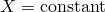
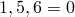
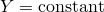
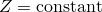
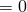
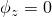

# 34.3.1 Abaqus/Standard和Abaqus/Explicit中的边界条件


**产品：** Abaqus/Standard  Abaqus/Explicit  Abaqus/CAE

##### **参考**

- ["在Abaqus中定义模型，" 第1.3.1节"](pt01ch01s03aus03.md)
- ["规定条件：概述，" 第34.1.1节"](pt07ch34s01abo31.md)
- ["VDISP，" Abaqus用户子程序参考指南第1.2.1节"](../sub/sub-link.md#sub-rtn-uexpdisp)
- ["DISP，" Abaqus用户子程序参考指南第1.1.4节"](../sub/sub-link.md#sub-rtn-udisp)
- [*BOUNDARY*](../key/key-link.md#usb-kws-hboundary)
- ["使用边界条件编辑器，" Abaqus/CAE用户指南第16.10节"](../usi/usi-link.md#usi-lbi-bceditors)

### 概述

边界条件：
- 可用于规定所有基本解变量（位移、转角、翘曲幅值、流体压力、孔隙压力、温度、电势、归一化浓度、声压或连接器材料流动）在节点处的值；
- 可以作为"模型"输入数据给出（在Abaqus/CAE中的初始步中）来定义零值边界条件；
- 可以作为"历史"输入数据给出（在分析步中）来添加、修改或移除零值或非零边界条件；并且
- 可以通过子程序[`DISP`](../sub/sub-link.md#sub-xsl-disp)（Abaqus/Standard）和[`VDISP`](../sub/sub-link.md#sub-xsl-vdisp)（Abaqus/Explicit）由用户定义。

连接器单元中的相对运动可以类似于边界条件的方式规定。详见["连接器驱动，" 第31.1.3节"](pt06ch31s01alm26.md)。

### 将边界条件规定为模型数据

只有零值边界条件可以规定为模型数据（即在Abaqus/CAE中的初始步中）。您可以使用"直接"格式或"类型"格式指定数据。如下所述，"类型"格式是规定应力/位移分析中常见边界条件类型的便捷方式。其他所有分析类型必须使用"直接"格式。

对于"直接"和"类型"格式，您需要指定边界条件应用的模型区域以及被约束的自由度。（关于Abaqus中使用的自由度编号，请参阅["约定，" 第1.2.2节"](pt01ch01s02aus02.md)。）

规定为模型数据的边界条件可以在分析步中修改或移除。

| **输入文件用法：** | ``` [*BOUNDARY*](../key/key-link.md#usb-kws-hboundary) ``` |
| --- | --- |
|  | 可以使用任意数量的数据行来指定边界条件，在应力/位移分析中，"直接"和"类型"格式都可以与单个[*BOUNDARY*](../key/key-link.md#usb-kws-hboundary)选项一起使用。 |

| **Abaqus/CAE用法：** | 载荷模块：**创建边界条件**：**步：初始** |
| --- | --- |

#### 使用直接格式

您可以选择直接输入要约束的自由度。

| **输入文件用法：** | 可以指定单个自由度或一系列自由度的第一个和最后一个。 |
| --- | --- |
|  | ``` [*BOUNDARY*](../key/key-link.md#usb-kws-hboundary) *node or node set*, *degree of freedom* [*BOUNDARY*](../key/key-link.md#usb-kws-hboundary) *node or node set*, *first degree of freedom*, *last degree of freedom* ``` 例如，``` [*BOUNDARY*](../key/key-link.md#usb-kws-hboundary) EDGE, 1 ``` 表示节点集`EDGE`中的所有节点在自由度1上被约束（），而数据行``` EDGE, 1, 4 ```表示节点集`EDGE`中的所有节点在自由度1到4上被约束（、、、）。 |

| **Abaqus/CAE用法：** | 载荷模块：**创建边界条件**：**步：初始** |
|  | 使用以下选项之一：**类别：机械**；**位移/转角**、**速度/角速度**或**加速度/角加速度**；选择区域并切换自由度假 |
|  | **类别：电气/磁**；**电势**；选择区域 |
|  | **类别：其他**；**温度**、**孔隙压力**、**质量浓度**、**声压**或**连接器材料流动**；选择区域 |
|  | 如果为壳区域指定温度边界条件，可以输入多个自由度，从11到31（含）。 |

#### 在应力/位移分析中使用"类型"格式

可以指定边界条件的类型而不是自由度。以下边界条件"类型"在Abaqus/Standard和Abaqus/Explicit中都可用：

| XSYMM | 关于平面  的对称（自由度 ）。 |
| --- | --- |
| YSYMM | 关于平面  的对称（自由度 ）。 |
| ZSYMM | 关于平面  的对称（自由度 ）。 |
| ENCASTRE | 完全固定（自由度 ）。 |
| PINNED | 铰接（自由度 ）。 |

以下边界条件类型仅在Abaqus/Standard中可用：

| XASYMM | 关于平面  的反对称（自由度2、3、4 ）。 |
| --- | --- |
| YASYMM | 关于平面  的反对称（自由度1、3、5 ）。 |
| ZASYMM | 关于平面  的反对称（自由度1、2、6 ）。 |

**注意：**当在涉及有限转动的分析的节点上规定边界条件时，应至少约束两个转动自由度。否则，节点上的规定转动可能不是您所期望的。因此，在涉及有限转动的问题中通常不应使用反对称边界条件。

| NOWARP | 防止节点处肘部截面的翘曲。 |
| --- | --- |
| NOOVAL | 防止节点处肘部截面的椭圆化。 |
| NODEFORM | 防止节点处所有截面变形（翘曲、椭圆化和均匀径向膨胀）。 |

NOWARP、NOOVAL和NODEFORM类型仅适用于肘部元素（["具有变形截面的管道和弯头：肘部元素，" 第29.5.1节"](pt06ch29s05alm15.md)）。

例如，将类型XSYMM的边界条件应用于节点集`EDGE`，表示节点集位于垂直于*X*轴的对称平面上（如果是节点变换，则为全局*X*轴或局部*X*轴）。此边界条件与在节点集`EDGE`中的自由度1、5和6上使用直接格式应用边界条件相同，因为关于平面*X*=常数对称意味着 、 和 。

一旦使用"类型"边界条件作为模型数据约束了某个自由度，就不能通过使用"直接"格式的边界条件作为模型数据来修改该约束；这样修改约束只会产生一个错误消息，指示模型数据中存在冲突的边界条件。

| **输入文件用法：** | ``` [*BOUNDARY*](../key/key-link.md#usb-kws-hboundary) *node or node set*, *boundary condition type* ``` |
| --- | --- |

| **Abaqus/CAE用法：** | 载荷模块：**创建边界条件**：**步：初始**：**对称/反对称/固定**：选择区域并切换边界条件类型 |
| --- | --- |

#### 在富集元素的虚节点处规定边界条件

富集元素的虚节点可以与实节点重合，也可以位于两个实角节点之间的元素边缘上（见["使用扩展有限元方法将不连续性建模为富集特征，" 第10.7.1节"](pt04ch10s07at36.md)）。对于与实节点重合的虚节点，可以使用实节点的节点编号指定边界条件。对于位于元素边缘上并具有孔隙压力自由度的虚节点，可以通过两个实角节点编号来识别边界条件。

| **输入文件用法：** | 使用以下选项在最初与指定实节点重合的虚节点处指定边界条件： |
| --- | --- |
|  | ``` [*BOUNDARY*](../key/key-link.md#usb-kws-hboundary), PHANTOM=NODE *node number*, *first degree of freedom*, *last degree of freedom* ``` 使用以下选项在位于元素边缘的虚节点处指定边界条件： ``` [*BOUNDARY*](../key/key-link.md#usb-kws-hboundary), PHANTOM=EDGE *first corner node number*, *second corner node number*, *first degree of freedom*, *last degree of freedom* ``` |

| **Abaqus/CAE用法：** | Abaqus/CAE不支持在富集元素的虚节点处规定边界条件。 |
| --- | --- |

### 将边界条件规定为历史数据

边界条件可以使用"直接"或"类型"格式在分析步中规定。与模型数据边界条件一样，"类型"格式只能在应力/位移分析中使用；而"直接"格式可以用于所有分析类型。

使用"直接"格式时，边界条件可以定义为变量的总值，或者在应力/位移分析中，定义为变量速度或加速度的值。

可以在步中定义任意数量的边界条件。

| **输入文件用法：** | ``` [*BOUNDARY*](../key/key-link.md#usb-kws-hboundary) ``` |
| --- | --- |

| **Abaqus/CAE用法：** | 载荷模块：**创建边界条件**：**步：*analysis_step*** |
| --- | --- |

#### 使用直接格式

指定边界条件应用的模型区域、要规定的自由度（如适用，请参阅["约定，" 第1.2.2节"](pt01ch01s02aus02.md)了解Abaqus中使用的自由度编号）以及边界条件的幅值。如果省略幅值，则与指定零幅值相同。

在应力/位移分析中，您可以规定速度历史或加速度历史。默认是位移历史。

| **输入文件用法：** | 使用以下选项之一来规定位移历史： |
| --- | --- |
|  | ``` [*BOUNDARY*](../key/key-link.md#usb-kws-hboundary) or [*BOUNDARY*](../key/key-link.md#usb-kws-hboundary), TYPE=DISPLACEMENT *node or node set*, *degree of freedom*, *magnitude* *node or node set*, *first degree of freedom*, *last degree of freedom*, *magnitude* ``` 使用以下选项来规定速度历史（数据行与上面相同）： ``` [*BOUNDARY*](../key/key-link.md#usb-kws-hboundary), TYPE=VELOCITY ``` 使用以下选项来规定加速度历史（数据行与上面相同）： ``` [*BOUNDARY*](../key/key-link.md#usb-kws-hboundary), TYPE=ACCELERATION ``` 例如，``` [*BOUNDARY*](../key/key-link.md#usb-kws-hboundary), TYPE=VELOCITY EDGE, 1, 1, 0.5 ```表示节点集`EDGE`中的所有节点在自由度1（）上具有0.5的规定速度幅值。 |

| **Abaqus/CAE用法：** | 载荷模块：**创建边界条件**：**步：*analysis_step***： |
|  | 选择以下类别和类型之一：**类别：机械**；**位移/转角**；选择区域；**分布：均匀**或选择分析场或离散场；切换自由度假；*幅值* |
|  | **类别：机械**；**速度/角速度**或**加速度/角加速度**；选择区域；**分布：均匀**或选择分析场；切换自由度假；*幅值* |
|  | **类别：电气/磁**；**电势**；选择区域；**分布：均匀**或选择分析场；**方法：指定幅值**；*幅值* |
|  | **类别：其他**；**温度**、**孔隙压力**、**质量浓度**、**声压**或**连接器材料流动**；选择区域；**分布：均匀**或选择分析场；**方法：指定幅值**；*幅值* |
|  | 如果为壳区域指定温度边界条件，可以输入多个自由度，从11到31（含）。 |

#### 规定位移

在Abaqus/Standard中，您可以规定位移跳跃。例如，位移型边界条件用于在节点集`EDGE`的节点上施加自由度1（）中0.5的规定位移幅值。在第二步中，可以通过在节点集`EDGE`上施加自由度1中1.0的规定位移幅值，将这些节点再移动0.5个长度单位（总位移为1.0）。在下一步中指定自由度1中0（或省略幅值）的规定位移幅值，将使节点集`EDGE`中的节点返回到其原始位置。

相比之下，Abaqus/Explicit不允许位移和转角的跳跃。位移和转角自由度中的位移边界条件使用幅值曲线的斜率以增量方式强制执行（见下文）。如果没有指定幅值，Abaqus/Explicit将忽略用户提供的位移值并强制执行零速度边界条件。

位移必须在步之间保持连续。如果指定了幅值曲线，在使用步时间进行幅值定义时，可以在步边界上指定位移跳跃，但这不是有效的。Abaqus/Explicit将忽略此类位移跳跃（如果已指定）。

#### 在应力/位移分析中使用"类型"格式

可以（作为历史数据）指定边界条件的类型而不是自由度，方式与上述模型数据讨论的方式相同。作为历史数据可用的边界条件"类型"与作为模型数据可用的类型相同。

一旦使用"类型"边界条件作为历史数据约束了某个自由度，就不能通过使用"直接"格式的边界条件来修改该约束。只有在移除所有先前应用的"类型"格式边界条件后，才能使用"直接"格式重新定义该约束。

| **输入文件用法：** | ``` [*BOUNDARY*](../key/key-link.md#usb-kws-hboundary) *node or node set*, *boundary condition type* ``` |
| --- | --- |

| **Abaqus/CAE用法：** | 载荷模块：**创建边界条件**：**步：*analysis_step***：**对称/反对称/固定**：选择区域并切换边界条件类型 |
| --- | --- |

#### 在富集元素的虚节点处规定边界条件

您可以按照上述模型数据讨论的方式作为历史数据在虚节点处指定边界条件（见["使用扩展有限元方法将不连续性建模为富集特征，" 第10.7.1节"](pt04ch10s07at36.md)，了解更多关于富集元件的信息）。要指定非零边界条件，请输入实际幅值。

| **输入文件用法：** | 使用以下选项在最初与指定实节点重合的虚节点处指定边界条件： |
| --- | --- |
|  | ``` [*BOUNDARY*](../key/key-link.md#usb-kws-hboundary), PHANTOM=NODE *node number*, *first degree of freedom*, *last degree of freedom*, *magnitude* ``` 使用以下选项在位于元素边缘的虚节点处指定边界条件： ``` [*BOUNDARY*](../key/key-link.md#usb-kws-hboundary), PHANTOM=EDGE *first corner node number*, *second corner node number*, *first degree of freedom*, *last degree of freedom*, *magnitude* ``` |

| **Abaqus/CAE用法：** | Abaqus/CAE不支持在富集元素的虚节点处规定边界条件。 |
| --- | --- |

### 定义随时间变化的边界条件

基本解变量、速度或加速度的规定幅值可以在步中随时间变化，方法是参照幅值定义（["幅值曲线，" 第34.1.2节"](pt07ch34s01aus115.md)）。

当在动力或模态动力分析中将幅值定义与边界条件一起使用时，约束变量的一阶和二阶时间导数可能是不连续的。例如，Abaqus将从给定的位移边界条件计算相应的速度和加速度。

默认情况下，Abaqus/Standard将对幅值曲线进行平滑处理，以使规定边界条件的导数为有限值。您必须确保平滑后的应用值是正确的。

Abaqus/Explicit不会对不连续幅值曲线应用默认平滑处理。为了避免在Abaqus/Explicit中可能因不连续性而产生的"嘈杂"解决方案，最好指定节点的速度历史而不是位移历史。见["幅值曲线，" 第34.1.2节"](pt07ch34s01aus115.md)。

| **输入文件用法：** | 使用以下两个选项： |
| --- | --- |
|  | ``` [*AMPLITUDE*](../key/key-link.md#usb-kws-mamplitude), NAME=*name* [*BOUNDARY*](../key/key-link.md#usb-kws-hboundary), AMPLITUDE=*name* ``` |

| **Abaqus/CAE用法：** | 载荷或交互模块：**创建幅值**：**名称**：*amplitude_name* |
|  | 载荷模块：**创建边界条件**：**步：*analysis_step***：***boundary condition***；**幅值**：*amplitude_name* |
| --- | --- |

### 通过用户子程序定义边界条件

如果基于幅值演化的边界条件不够，您可以在用户子程序中自己定义它。为此，Abaqus/Standard提供了例程[`DISP`](../sub/sub-link.md#sub-xsl-disp)；而Abaqus/Explicit提供了例程[`VDISP`](../sub/sub-link.md#sub-xsl-vdisp)。边界条件应用的区域和约束的自由度作为边界条件定义的一部分指定。实际边界条件在该用户例程内根据这些例程中提供的变量设置（见[`DISP`](../sub/sub-link.md#sub-xsl-disp)的["DISP，" Abaqus用户子程序参考指南第1.1.4节"](../sub/sub-link.md#sub-rtn-udisp)和[`VDISP`](../sub/sub-link.md#sub-xsl-vdisp)的["VDISP，" Abaqus用户子程序参考指南第1.2.1节"](../sub/sub-link.md#sub-rtn-uexpdisp)）。

Abaqus/Standard允许为用户定义的边界条件指定幅值和参考幅值定义，您可以在[`DISP`](../sub/sub-link.md#sub-xsl-disp)例程中覆盖基于幅值的边界值。而Abaqus/Explicit忽略参考幅值，但将幅值作为参数传递给用户例程[`VDISP`](../sub/sub-link.md#sub-xsl-vdisp)，您可以定义边界条件为非零值。

| **输入文件用法：** | ``` [*BOUNDARY*](../key/key-link.md#usb-kws-hboundary), USER ``` |
| --- | --- |

| **Abaqus/CAE用法：** | 载荷模块：**创建边界条件**：**步：*analysis_step***；***boundary condition***；**分布：用户定义** |
| --- | --- |

### 边界条件传播

默认情况下，所有在先前通用分析步中定义的边界条件在后续通用步或后续连续线性扰动步中保持不变。边界条件不会在线性扰动步之间传播。您定义的是相对于先前存在的边界条件在给定步中有效的边界条件。在每个新步中，可以修改现有边界条件并指定其他边界条件。或者，您可以释放步中所有先前应用的边界条件并指定新的边界条件。在这种情况下，必须重新指定要保留的任何边界条件。

#### 修改边界条件

当您修改现有边界条件时，必须以与先前完全相同的方式指定节点或节点集。例如，如果在一个步中为节点集指定了边界条件，而在另一个步中为包含在该集中的单个节点指定了边界条件，Abaqus会发出错误。您必须移除边界条件并重新指定才能更改节点或节点集的指定方式。

| **输入文件用法：** | 使用以下选项之一来修改现有边界条件或指定附加边界条件： |
| --- | --- |
|  | ``` [*BOUNDARY*](../key/key-link.md#usb-kws-hboundary) [*BOUNDARY*](../key/key-link.md#usb-kws-hboundary), OP=MOD ``` |

| **Abaqus/CAE用法：** | 载荷模块：**创建边界条件**或**边界条件管理器**：**编辑** |
| --- | --- |

#### 移除边界条件

如果您选择在某个步中移除任何边界条件，则不会从先前的通用步传播边界条件。因此，必须在此步中重新指定有效的所有边界条件。此规则的一个例外是特征值屈曲预测过程，如["特征值屈曲预测，" 第6.2.3节"](pt03ch06s02at02.md)中所述。

将边界条件设置为零与移除它不一样。

| **输入文件用法：** | 使用以下选项释放所有先前应用的边界条件并指定新的边界条件： |
| --- | --- |
|  | ``` [*BOUNDARY*](../key/key-link.md#usb-kws-hboundary), OP=NEW ``` 如果在任何[*BOUNDARY*](../key/key-link.md#usb-kws-hboundary)选项上使用了OP=NEW参数，则必须在该步中的所有[*BOUNDARY*](../key/key-link.md#usb-kws-hboundary)选项上使用它。 |

| **Abaqus/CAE用法：** | 使用以下选项在步中移除边界条件： |
| --- | --- |
|  | 载荷模块：**边界条件管理器**：**停用** Abaqus/CAE自动重新指定在此步中应保持有效的任何边界条件。 |
| --- | --- |

### 在Abaqus/Standard分析中固定点的自由度

在Abaqus/Standard中，您可以"冻结"指定自由度，使其保持上一个通用分析步的最终值。指定零速度或零加速度边界条件与分别为位移或速度固定自由度具有相同的效果。

| **输入文件用法：** | ``` [*BOUNDARY*](../key/key-link.md#usb-kws-hboundary), FIXED ``` |
| --- | --- |
|  | 如果在同一步中有任何其他带有OP=NEW参数的[*BOUNDARY*](../key/key-link.md#usb-kws-hboundary)选项，则必须将OP=NEW参数与FIXED参数一起使用。边界条件的任何幅值都被忽略。如果FIXED参数用于分析的第一步，则它被忽略。 |

| **Abaqus/CAE用法：** | 载荷模块；**创建边界条件**；**步：*analysis_step***；***boundary condition***；**方法**：**固定在当前位置**（仅在存在先前的通用分析步时可用） |
| --- | --- |

### 在线姓扰动步中规定边界条件

在线姓扰动步（["通用和线性扰动过程，" 第6.1.3节"](pt03ch06s01aus44.md)）中，规定边界条件的幅值应作为关于基态的扰动幅值给出。在模型定义中给出的边界条件始终被视为基态的一部分，即使第一步是线性扰动步。在线性扰动步中给出的边界条件不会影响后续步。

如果扰动步不包含边界条件定义，则在基态中被约束/规定的自由度将在扰动步中被约束，并具有零扰动幅值。要规定非零扰动幅值，您必须修改现有边界条件。您还可以在基态中未约束的自由度上修复和规定扰动幅值。

如果在基态中被约束/规定的自由度被释放，则必须重新指定要保留的所有约束，并记住所有幅值将被解释为扰动。

将自由度固定在上一个通用分析步的最终值（见上一讨论）具有与修改现有边界条件使其对所有指定自由度具有零扰动幅值相同的效果。

可以通过指定适当的边界条件找到对称结构的反对称屈曲模式（见["特征值屈曲预测，" 第6.2.3节"](pt03ch06s02at02.md)）。

#### 在边界条件中规定实部和虚部

在稳态动力和矩阵生成过程中，边界条件可以使用实部或虚部规定（见["直接求解稳态动力分析，" 第6.3.4节"](pt03ch06s03at09.md)和["生成矩阵，" 第10.3.1节"](pt04ch10s03at32.md)）。如果为某个自由度规定了实部（而未明确规定虚部），则虚部被视为零。类似地，如果规定了虚部（而未规定实部），则实部被视为零。

#### 在模态叠加过程中规定运动

在模态叠加过程（["动力分析过程：概述，" 第6.3.1节"](pt03ch06s03abo07.md)）中，不能直接使用边界条件定义规定位移。相反，边界条件在频率提取步中被分组到基中。然后，在模态叠加步中规定每个基的运动。详见["自然频率提取，" 第6.3.5节"](pt03ch06s03at10.md)和["瞬态模态动力分析，" 第6.3.7节"](pt03ch06s03at12.md)。

| **输入文件用法：** | ``` [*BOUNDARY*](../key/key-link.md#usb-kws-hboundary), BASE NAME [*BASE MOTION*](../key/key-link.md#usb-kws-hbasemotion) ``` |
| --- | --- |

| **Abaqus/CAE用法：** | 载荷模块；**创建边界条件**；**步：*modal_dynamic_step*、*steady-state_dynamic_step*或*random_response_step***；**类别：机械**；**所选步的类型：****位移基座运动**或**速度基座运动**或**加速度基座运动** |
| --- | --- |

### 子建模

当使用子建模技术时，子模型中边界条件的幅值可以通过从全局模型文件输出结果中插值规定自由度值来定义。详见["基于节点的子建模，" 第10.2.2节"](pt04ch10s02aus61.md)。

### 规定大转动

关于不同旋转轴的顺序有限转动是不可加的，这使得此类转动的直接指定具有挑战性。通过规定转动速度与时间的关系来施加有限转动边界条件要简单得多。关于转动自由度的讨论以及演示为什么速度型边界条件更适合指定有限转动边界条件的多步有限转动示例，请参阅["约定，" 第1.2.2节"](pt01ch01s02aus02.md)。

当使用速度型边界条件来规定转动时，定义以角速度给出，而不是总转动。如果角速度与非线性幅值相关联，Abaqus将计算规定转动增量为开始和结束时的规定角速度的平均值，乘以时间增量。

在Abaqus/Explicit中，引用幅值曲线的位移型边界条件使用幅值曲线值的有限差分计算的时间增量上的平均速度有效地强制执行为速度边界条件。与规定位移一样（见上文"规定位移"），Abaqus/Explicit不允许转动跳跃。

在Abaqus/Standard中，仅约束一个转动分量分量的位移型边界条件实际上可能对解没有影响，因为两个未约束的转动自由度可以组合起来覆盖该约束。

#### 示例：使用速度型边界条件规定转动

例如，如果在静态步中需要在*z*轴周围进行  的转动，而不在*x*和*y*轴周围转动，请使用1.0的步时间（作为静态步定义的一部分指定），并定义速度型边界条件为自由度4和5指定零速度，为自由度6指定恒定角速度 。由于静态过程中速度型边界条件的默认变化是阶跃，速度将在步中保持恒定。或者，可以使用幅值引用来指定步中所需的变化。

```
[*BOUNDARY*](../key/key-link.md#usb-kws-hboundary), TYPE=VELOCITY
NODE, 4
NODE, 5
NODE, 6, 6, 18.84955592
```

如果在下一步中，同一节点应在全局*x*轴周围有额外的  弧度的转动，请使用另一个步时间为1.0的静态步，再次定义速度型边界条件为自由度5和6指定零速度，为自由度4指定恒定角速度 。

```
[*BOUNDARY*](../key/key-link.md#usb-kws-hboundary), TYPE=VELOCITY
NODE, 4, 4, 1.570796327
NODE, 5
NODE, 6
```

### 在轴对称模型上规定径向运动

轴对称模型中任何节点的径向坐标必须为正。因此，您必须确保任何规定的边界条件不违反此条件。


