# 34.4.3 分布载荷


**产品：** Abaqus/Standard  Abaqus/Explicit  Abaqus/CFD  Abaqus/CAE

##### **参考**

- ["施加载荷：概述，" 第34.4.1节"](pt07ch34s04aus120.md)
- [*DLOAD*](../key/key-link.md#usb-kws-hdload)
- [*DSLOAD*](../key/key-link.md#usb-kws-hdsload)
- ["定义压力载荷，" Abaqus/CAE用户指南第16.9.3节"](../usi/usi-link.md#usi-lbi-loadeditors-pressure)
- ["定义壳边缘载荷，" Abaqus/CAE用户指南第16.9.4节"](../usi/usi-link.md#usi-lbi-loadeditors-shelledge)
- ["定义表面牵引载荷，" Abaqus/CAE用户指南第16.9.5节"](../usi/usi-link.md#usi-lbi-loadeditors-surfacetraction)
- ["定义管道压力载荷，" Abaqus/CAE用户指南第16.9.6节"](../usi/usi-link.md#usi-lbi-loadeditors-pipepressure)
- ["定义体力，" Abaqus/CAE用户指南第16.9.7节"](../usi/usi-link.md#usi-lbi-loadeditors-bodyforce)
- ["定义线载荷，" Abaqus/CAE用户指南第16.9.8节"](../usi/usi-link.md#usi-lbi-loadeditors-line)
- ["定义重力载荷，" Abaqus/CAE用户指南第16.9.9节"](../usi/usi-link.md#usi-lbi-loadeditors-gravity)
- ["定义旋转体力，" Abaqus/CAE用户指南第16.9.11节"](../usi/usi-link.md#usi-lbi-loadeditors-rotate)
- ["定义多孔阻力体力，" Abaqus/CAE用户指南第16.9.24节"](../usi/usi-link.md#usi-lbi-loadeditors-porousdrag)

### 概述

分布载荷：
- 可以在元素面、元素体或元素边缘上规定；
- 可以在几何表面或几何边缘上规定；
- 需要指定适当的分布载荷类型——请参阅[第六部分，"单元"](pt06.md)，了解特定单元可用的分布载荷类型定义；并且
- 可以是跟随类型，在几何非线性分析中可以旋转，并导致刚度矩阵的额外（通常是非对称）贡献，这通常称为载荷刚度。

这些载荷可以使用的过程在["规定条件：概述，" 第34.1.1节"](pt07ch34s01abo31.md)中概述。请参阅["施加载荷：概述，" 第34.4.1节"](pt07ch34s04aus120.md)，了解适用于所有载荷类型的一般信息。

跟随载荷在["跟随表面载荷"](pt07ch34s04aus122.md#usb-prc-ploaddistributed-surface-follower)"和["跟随边缘和线载荷"](pt07ch34s04aus122.md#usb-prc-ploaddistributed-edgeline-follower)"中进一步讨论。跟随载荷对载荷刚度的贡献在["改善大位移隐式分析收敛速率"](pt07ch34s04aus122.md#usb-prc-ploaddistributed-rateofconvergence)中讨论。

在稳态动力分析中，可以施加实部和虚部分布载荷（详见["直接求解稳态动力分析，" 第6.3.4节"](pt03ch06s03at09.md)和["基于模态的稳态动力分析，" 第6.3.8节"](pt03ch06s03at13.md)）。

入射波载荷用于为与波通过声学介质传播相关的特殊情况施加分布载荷。惯性 relief 用于在Abaqus/Standard中施加基于惯性的载荷。这些载荷类型在["声学和冲击载荷，" 第34.4.6节"](pt07ch34s04aus125.md)和["惯性relief，" 第11.1.1节"](pt04ch11s01at37.md)中讨论。Abaqus/Aqua载荷类型在["Abaqus/Aqua分析，" 第6.11.1节"](pt03ch06s11at30.md)中讨论。

### 定义随时间变化的分布载荷

分布载荷的规定幅值可以随步中时间按照幅值定义变化，如["规定条件：概述，" 第34.1.1节"](pt07ch34s01abo31.md)中所述。如果不同载荷需要不同的变化，每个载荷可以引用自己的幅值定义。

### 修改分布载荷

如["施加载荷：概述，" 第34.4.1节"](pt07ch34s04aus120.md)中所述，可以添加、修改或移除分布载荷。

### 改善大位移隐式分析收敛速率

在Abaqus/Standard的大位移分析中，某些分布载荷类型引入非对称载荷刚度矩阵项。例如包括静水压力、具有自由边缘的表面上的压力、Coriolis力、旋转加速度力以及建模为跟随载荷的分布边缘载荷和表面牵引。在这种情况下，使用分析步的非对称矩阵存储和求解方案可以提高平衡迭代的收敛速率。见["定义分析，" 第6.1.2节"](pt03ch06s01abo05.md)，了解非对称矩阵存储和求解方案的更多信息。

### 在用户子程序中定义分布载荷

非均匀分布载荷（如*X*方向的非均匀体力）可以通过Abaqus/Standard中的用户子程序[`DLOAD`](../sub/sub-link.md#sub-xsl-dload)或Abaqus/Explicit中的[`VDLOAD`](../sub/sub-link.md#sub-xsl-vdload)定义。当在用户子程序[`VDLOAD`](../sub/sub-link.md#sub-xsl-vdload)中定义的非均匀载荷使用幅值引用时，幅值函数的当前值在分析的每个时间增量传递给用户子程序。[`DLOAD`](../sub/sub-link.md#sub-xsl-dload)和[`VDLOAD`](../sub/sub-link.md#sub-xsl-vdload)不适用于表面牵引、边缘牵引或边缘力矩。

在Abaqus/Standard中，非均匀分布表面牵引、边缘牵引和边缘力矩可以通过用户子程序[`UTRACLOAD`](../sub/sub-link.md#sub-xsl-utracload)定义。用户子程序[`UTRACLOAD`](../sub/sub-link.md#sub-xsl-utracload)允许您为表面牵引、边缘牵引和边缘力矩定义非均匀幅值，以及为一般表面牵引、剪切牵引和一般边缘牵引定义非均匀载荷方向。

Abaqus/Explicit目前不支持非均匀分布表面牵引、边缘牵引和边缘力矩。

使用用户子程序时，外部功仅基于分布载荷的当前幅值计算，因为分布载荷的增量值未定义。

### 指定分布载荷应用的区域

如["施加载荷：概述，" 第34.4.1节"](pt07ch34s04aus120.md)中所讨论，分布载荷可以定义为基于元素或基于表面。基于元素的分布载荷可以在元素体、元素表面或元素边缘上规定。基于表面的分布载荷可以直接施加在几何表面或几何边缘上。

可以定义三种类型的分布载荷：体力、表面载荷和边缘载荷。分布体力始终是基于元素的。分布表面载荷和分布边缘载荷可以是基于元素的或基于表面的。[表34.4.3-1](pt07ch34s04aus122.md#usb-prc-ploaddistributed-region-table)总结了每种载荷类型可以规定在其上的区域。在Abaqus/CAE中，通过在视口中选择区域或从表面列表中选择来指定分布载荷。在Abaqus输入文件中，根据载荷施加的区域类型使用不同的选项，如下节所示。

**表34.4.3–1** 不同载荷类型可以规定在其上的区域。

| 载荷类型 | 载荷定义 | 输入文件区域 | Abaqus/CAE区域 |
| --- | --- | --- | --- |
| 体力 | 基于元素 | 元素体 | 体积体 |
| 表面载荷 | 基于元素 | 元素表面 | 定义为几何面或元素面集合的表面（不包括分析刚性表面） |
| | 基于表面 | 基于元素的几何表面 |
| 边缘载荷（包括梁线载荷） | 基于元素 | 元素边缘 | 定义为几何边缘或元素边缘集合的表面 |
| | 基于表面 | 基于边缘的几何表面 |

### 体力

体力（如重力、离心力、Coriolis力和旋转加速度载荷）作为基于元素的载荷施加。体力的单位是每单位体积的力。

[表34.4.3-2](pt07ch34s04aus122.md#bodyloadlabels)列出了Abaqus中所有可用的分布体力类型及其对应的载荷类型标签。

**表34.4.3–2** 分布体力类型。

| 载荷描述 | 基于元素载荷的载荷类型标签 | Abaqus/CAE载荷类型 |
| --- | --- | --- |
| 全局*X*、*Y*和*Z*方向的体力 | BX、BY、BZ | **体力** |
| 全局*X*、*Y*和*Z*方向的非均匀体力 | BXNU、BYNU、BZNU | **体力** |
| 径向和轴向方向的体力（仅适用于轴对称元素） | BR、BZ |
| 径向和轴向方向的非均匀体力（仅适用于轴对称元素） | BRNU、BZNU |
| 全局*X*、*Y*和*Z*方向的粘性体力（仅在Abaqus/Explicit中可用） | VBF | 不支持 |
| 全局*X*、*Y*和*Z*方向的滞止体力（仅在Abaqus/Explicit中可用） | SBF |
| 重力载荷 | GRAV | **重力** |
| 离心载荷（幅值输入为 ，其中  是每单位体积的质量密度， 是角速度） | CENT | 不支持 |
| 离心载荷（幅值输入为 ，其中  是角速度） | CENTRIF | **旋转体力** |
| Coriolis力 | CORIO | **Coriolis力** |
| 旋转加速度载荷 | ROTA | **旋转体力** |
| 转子动力学载荷 | ROTDYNF | 不支持 |
| 多孔阻力载荷（输入为介质孔隙率） | PDBF | **多孔阻力体力** |

#### 指定一般体力

您可以在全局*X*、*Y*或*Z*方向上指定任何单元的体力。您可以在径向或轴向方向为轴对称单元指定体力。

| **输入文件用法：** | 使用以下选项定义全局*X*、*Y*或*Z*方向的体力： |
| --- | --- |
|  | ``` [*DLOAD*](../key/key-link.md#usb-kws-hdload) *element number or element set*, *load type label*, *magnitude* ``` 其中*load type label*为BX、BY、BZ、BXNU、BYNU或BZNU。使用以下选项在轴对称单元的径向或轴向方向定义体力： ``` [*DLOAD*](../key/key-link.md#usb-kws-hdload) *element number or element set*, *load type label*, *magnitude* ``` 其中*load type label*为BR、BZ、BRNU或BZNU。 |

| **Abaqus/CAE用法：** | 载荷模块：**创建载荷**：为**类别**选择**机械**，为**所选步的类型**选择**体力** |
| --- | --- |

#### 在Abaqus/Explicit中指定粘性体力载荷

粘性体力载荷定义为


其中  是施加到体的粘性力； 是粘度，作为载荷的幅值给出； 是施加力的点的速度；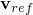 是参考节点的速度； 是单元体积。

粘性体力载荷可以被认为是质量比例阻尼的一种形式，因为它对元素给出与质量成比例的阻尼贡献，前提是系数  选择为与材料密度  相乘的小值（见["材料阻尼，" 第26.1.1节"](pt05ch26s01abm51.md)）。粘性体力载荷提供了一种定义与相对速度和步相关阻尼系数的质量比例阻尼的替代方法。

| **输入文件用法：** | 使用以下选项定义粘性体力载荷： |
| --- | --- |
|  | ``` [*DLOAD*](../key/key-link.md#usb-kws-hdload), REF NODE=*reference_node* *element number or element set*, VBF, *magnitude* ``` |

| **Abaqus/CAE用法：** | Abaqus/CAE不支持粘性体力载荷。 |
| --- | --- |

#### 在Abaqus/Explicit中指定滞止体力载荷

滞止体力载荷定义为


其中  是施加到体的滞止体力； 是系数，作为载荷的幅值给出； 是施加力的点的速度； 是参考节点的速度； 是单元体积。系数  应该非常小以避免过度阻尼和稳定时间增量的急剧下降。

| **输入文件用法：** | 使用以下选项定义滞止体力载荷： |
| --- | --- |
|  | ``` [*DLOAD*](../key/key-link.md#usb-kws-hdload), REF NODE=*reference_node* *element number or element set*, SBF, *magnitude* ``` |

| **Abaqus/CAE用法：** | Abaqus/CAE不支持滞止体力载荷。 |
| --- | --- |

#### 指定重力载荷

重力载荷（固定方向上的均匀加速度）通过使用重力分布载荷类型并给出重力常数作为载荷的幅值来指定。重力场的方向通过在分布载荷定义中给出重力向量的分量来指定。Abaqus使用用户指定的材料密度（见["密度，" 第21.2.1节"](pt05ch21s02abm01.md)），连同幅值和方向，来计算载荷。重力的幅值可以随步中时间按照幅值定义变化，如["规定条件：概述，" 第34.1.1节"](pt07ch34s01abo31.md)中所述。但是，重力场的方向始终在步开始时施加，并在步中保持固定。

您无需像其他分布载荷的规范中通常那样指定元素或元素集。Abaqus/Standard和Abaqus/Explicit自动收集所有对质量有贡献的元素（包括点质量元素但不包括刚性元素）在名为`_Whole_Model_Gravity_Elset`的元素集中，并将重力载荷施加到此元素集中的元素。Abaqus/CFD将重力载荷施加到所有用户定义的元素。

在Abaqus/CFD中，重力载荷定义与浮力驱动流动中使用的Boussinesq型体力一起使用的重力向量。您必须为不可压缩流动激活能量方程，并定义热膨胀以指定体积热膨胀系数（见["不可压缩流体动力学分析，" 第6.6.2节"](pt03ch06s06aus48.md)和["热膨胀，" 第26.1.2节"中的"Abaqus/CFD中浮力的计算"](pt05ch26s01abm52.md#usb-mat-cthermalbuoyancy)）。重力载荷只能与能量方程结合使用，如果没有能量方程则会被忽略；无需能量方程即可为不可压缩流动定义一般体力。

当重力载荷与子结构一起使用时，必须定义密度，并在创建子结构时计算单位重力载荷向量（见["定义子结构，" 第10.1.2节"](pt04ch10s01aus59.md)）。

| **输入文件用法：** | 使用以下选项定义重力载荷： |
| --- | --- |
|  | ``` [*DLOAD*](../key/key-link.md#usb-kws-hdload) *element number or element set*, GRAV, *gravity constant*, *comp1, comp2, comp3* ``` |

| **Abaqus/CAE用法：** | 载荷模块：**创建载荷**：为**类别**选择**机械**，为**所选步的类型**选择**重力** |
| --- | --- |

#### 在Abaqus/Standard中指定由于模型旋转产生的载荷

离心载荷、Coriolis力、旋转加速度和转子动力学载荷可以通过在基于元素的分布载荷定义中指定适当的分布载荷类型在Abaqus/Standard中施加。这些载荷选项主要用于在使用直接积分隐式动力学（["动态应力/位移分析，" 第6.3节"](pt03ch06s03.md)）以外的分析中复制动态载荷。在隐式动态过程中，由于旋转产生的惯性载荷自然地由于运动方程而产生。在隐式动态分析中施加分布离心载荷、Coriolis载荷、旋转加速度和转子动力学载荷可能导致非物理载荷，应谨慎使用。

##### 离心载荷

离心载荷幅值可以指定为 ，其中  是弧度/时间的角速度。Abaqus/Standard使用指定的材料密度（见["密度，" 第21.2.1节"](pt05ch21s02abm01.md)），连同载荷幅值和旋转轴来计算载荷。或者，离心载荷幅值可以给出为 ，其中  是材料密度（每单位体积的质量）或对于壳元素的每单位面积质量或对于梁元素的每单位长度质量， 是弧度/时间的角速度。这种类型的离心载荷公式不考虑大的体积变化。两种离心载荷类型将为一阶元素产生略微不同的局部结果； 使用一致性质量矩阵， 在计算载荷力和载荷刚度时使用集中质量矩阵。

离心载荷的幅值可以随步中时间按照幅值定义变化，如["规定条件：概述，" 第34.1.1节"](pt07ch34s01abo31.md)中所述。但是，结构围绕旋转的轴的位置和方向（通过给出轴上的点和轴方向来定义）始终在步开始时施加，并在步中保持固定。

| **输入文件用法：** | 使用以下选项之一定义离心载荷： |
| --- | --- |
|  | ``` [*DLOAD*](../key/key-link.md#usb-kws-hdload) *element number or element set*, CENTRIF, , *coord1, coord2, coord3, comp1,* *comp2, comp3* [*DLOAD*](../key/key-link.md#usb-kws-hdload) *element number or element set*, CENT, , *coord1, coord2, coord3, comp1, * *comp2, comp3* ``` |

| **Abaqus/CAE用法：** | 载荷模块：**创建载荷**：为**类别**选择**机械**，为**所选步的类型**选择**旋转体力**：**载荷效应：离心** |
| --- | --- |

##### Coriolis力

Coriolis力通过指定Coriolis分布载荷类型并将载荷幅值给出为  来定义，其中  是固体和壳元素的材料密度（每单位体积的质量）或梁元素的每单位长度质量， 是弧度/时间的角速度。Coriolis载荷的幅值可以随步中时间按照幅值定义变化，如["规定条件：概述，" 第34.1.1节"](pt07ch34s01abo31.md)中所述。但是，结构围绕旋转的轴的位置和方向（通过给出轴上的点和轴方向来定义）始终在步开始时施加，并在步中保持固定。

在静态分析中，Abaqus通过将增量位移除以当前时间增量来计算Coriolis载荷中的平移速度项。

Coriolis载荷公式不考虑大的体积变化。

| **输入文件用法：** | 使用以下选项定义Coriolis载荷： |
| --- | --- |
|  | ``` [*DLOAD*](../key/key-link.md#usb-kws-hdload) *element number or element set*, CORIO, , *coord1, coord2, coord3, * *comp1, comp2, comp3* ``` |

| **Abaqus/CAE用法：** | 载荷模块：**创建载荷**：为**类别**选择**机械**，为**所选步的类型**选择**Coriolis力** |
| --- | --- |

##### 旋转加速度载荷

旋转加速度载荷通过指定旋转加速度分布载荷类型并将旋转加速度幅值 （弧度/时间2）给出，包括任何进动效应。必须通过给出轴上的点和轴方向来定义旋转加速度轴。Abaqus/Standard使用指定的材料密度（见["密度，" 第21.2.1节"](pt05ch21s02abm01.md)），连同旋转加速度幅值和旋转加速度轴来计算载荷。载荷的幅值可以随步中时间按照幅值定义变化，如["规定条件：概述，" 第34.1.1节"](pt07ch34s01abo31.md)中所述。但是，结构围绕旋转的轴的位置和方向始终在步开始时施加，并在步中保持固定。

旋转加速度载荷不适用于轴对称元素。

| **输入文件用法：** | 使用以下选项定义旋转加速度载荷： |
| --- | --- |
|  | ``` [*DLOAD*](../key/key-link.md#usb-kws-hdload) *element number or element set*, ROTA, , *coord1, coord2, coord3, * *comp1, comp2, comp3* ``` |

| **Abaqus/CAE用法：** | 载荷模块：**创建载荷**：为**类别**选择**机械**，为**所选步的类型**选择**旋转体力**：**载荷效应：旋转加速度** |
| --- | --- |

##### 在Abaqus/Standard中指定一般刚体加速度载荷

在Abaqus/Standard中，可以通过结合重力、离心（）和旋转加速度载荷类型来指定一般刚体加速度载荷。

##### 固定参考系中的转子动力学载荷

转子动力学载荷可用于研究在固定参考系中围绕其对称轴旋转的三维轴对称结构（如混合能量存储系统中的飞轮）的振动响应（见[Genta, 2005](pt07ch34s04aus122.md#ploaddistributed-genta)）。这与上面讨论的以旋转坐标系公式化的离心载荷、Coriolis力和旋转加速度载荷形成对比。因此，转子动力学载荷不旨在与其他这些动态载荷类型结合使用。

转子动力学载荷的预期工作流程是在非线性静态步中定义载荷，以建立与旋转体相关的离心载荷效应和载荷刚度项。然后，非线性静态步可以跟随一系列线性动态分析，如复杂特征值提取和/或子空间或直接求解稳态动力分析，以研究由陀螺力矩引起的复杂动态行为，如临界速度、不平衡响应和旋转结构中的旋涡现象。您不需要在线性动态分析中重新定义转子动力学载荷——载荷定义从非线性静态步延续。在线性动态步中，陀螺矩阵的贡献是非对称的；因此，在这些步期间必须使用非对称矩阵存储，如["定义分析，" 第6.1.2节"](pt03ch06s01abo05.md)中所述。

转子动力学载荷仅适用于三维轴对称体的模型；您必须确保满足此建模假设。转子动力学载荷支持所有三维连续体和圆柱单元、壳单元、膜单元、圆柱膜单元、梁单元和旋转惯性单元。定义为载荷一部分的旋转轴必须是结构的对称轴。因此，梁单元必须与对称轴对齐。此外，每个加载旋转惯性单元的一个主方向必须与对称轴对齐，旋转惯性单元的惯性分量必须关于此轴对称。可以在同一步中建模围绕不同轴旋转的多个旋转结构。旋转结构也可以连接到非轴对称、非旋转结构（如轴承或支撑结构）。

转子动力学载荷通过指定弧度/时间的角速度  来定义。转子动力学载荷的幅值可以随步中时间按照幅值定义变化，如["规定条件：概述，" 第34.1.1节"](pt07ch34s01abo31.md)中所述。但是，结构围绕旋转的轴的位置和方向（通过给出轴上的点和轴方向来定义）始终在步开始时施加，并在步中保持固定。

| **输入文件用法：** | 使用以下选项定义转子动力学载荷： |
| --- | --- |
|  | ``` [*DLOAD*](../key/key-link.md#usb-kws-hdload) *element number or element set*, ROTDYNF, , *coord1, coord2, coord3, * *comp1, comp2, comp3* ``` |

| **Abaqus/CAE用法：** | Abaqus/CAE不支持基于元素的转子动力学载荷。 |
| --- | --- |

#### 在Abaqus/CFD中指定多孔阻力体力载荷

在Abaqus/CFD中，多孔阻力载荷定义了流过多孔介质的阻力（Darcy和惯性阻力）体力（见["不可压缩流体动力学分析，" 第6.6.2节"](pt03ch06s06aus48.md)）。如果激活了多孔阻力体力，则必须定义介质的渗透率（见["渗透率，" 第26.6.2节"](pt05ch26s06abm64.md)）。此外，如果为涉及热传递的多孔流动问题激活了不可压缩流动能量方程，则必须使用流体截面定义定义多孔介质的固体和流体相的属性。多孔阻力载荷通过指定无量纲孔隙率 （流体与多孔介质总体积之比）来定义。

| **输入文件用法：** | 使用以下选项定义多孔阻力体力载荷： |
| --- | --- |
|  | ``` [*DLOAD*](../key/key-link.md#usb-kws-hdload) *element number or element set*, PDBF, *porosity* ``` |

| **Abaqus/CAE用法：** | 载荷模块：**创建载荷**：为**类别**选择**流体**，为**所选步的类型**选择**多孔阻力体力** |
| --- | --- |

### 表面牵引和压力载荷

一般或剪切表面牵引和压力载荷可以作为基于元素或基于表面的分布载荷施加在Abaqus中。这些载荷的单位是每单位面积的力。

[表34.4.3-3](pt07ch34s04aus122.md#surfaceloadlabels)列出了Abaqus中所有可用的分布表面载荷类型及其对应的载荷类型标签。[第六部分，"单元"](pt06.md)列出了特定单元可用的分布表面载荷类型以及每种载荷类型的Abaqus/CAE载荷支持。对于某些基于元素的载荷，您必须在载荷类型标签中标识规定载荷的元素面（例如，用于连续体元素的P*n*或P*n*NU）。

**表34.4.3–3** 分布表面载荷类型。

| 载荷描述 | 基于元素载荷的载荷类型标签 | 基于表面载荷的载荷类型标签 | Abaqus/CAE载荷类型 |
| --- | --- | --- | --- |
| 一般表面牵引 | TRVEC*n*、TRVEC | TRVEC | **表面牵引** |
| 剪切表面牵引 | TRSHR*n*、TRSHR | TRSHR |
| 非均匀一般表面牵引 | TRVEC*n*NU、TRVECNU | TRVECNU | **表面牵引**（仅基于表面载荷） |
| 非均匀剪切表面牵引 | TRSHR*n*NU、TRSHRNU | TRSHRNU |
| 压力 | P*n*、P | P | **压力** |
| 非均匀压力 | P*n*NU、PNU | PNU | **压力**（仅基于表面载荷） |
| 静水压力（仅在Abaqus/Standard中可用） | HP*n*、HP | HP |
| 粘性压力（仅在Abaqus/Explicit中可用） | VP*n*、VP | VP |
| 滞止压力（仅在Abaqus/Explicit中可用） | SP*n*、SP | SP |
| 静水内压和外压（仅适用于PIPE和ELBOW元素） | HPI、HPE | N/A | **管道压力** |
| 均匀内压和外压（仅适用于PIPE和ELBOW元素） | PI、PE | N/A |
| 非均匀内压和外压（仅适用于PIPE和ELBOW元素） | PINU、PENU | N/A |

#### 跟随表面载荷

顾名思义，*跟随*表面载荷的作用线在几何非线性分析中随表面旋转。这与*非跟随*载荷相反，后者始终以固定全局方向作用。

除了一般表面牵引外，[表34.4.3-3](pt07ch34s04aus122.md#surfaceloadlabels)中列出的所有分布表面载荷都建模为跟随载荷。[表34.4.3-3](pt07ch34s04aus122.md#surfaceloadlabels)中列出的静水和粘性压力始终在当前配置中垂直于表面作用，剪切牵引始终在当前配置中切向于表面作用，内和外管道压力跟随管道元素的运动。

一般表面牵引可以指定为跟随或非跟随载荷。在几何线性分析中，跟随和非跟随载荷之间没有区别，因为身体的配置保持固定。跟随和非跟随一般表面牵引之间的区别将在下一节通过示例说明。

| **输入文件用法：** | 使用以下选项之一将一般表面牵引定义为跟随载荷（默认）： |
| --- | --- |
|  | ``` [*DLOAD*](../key/key-link.md#usb-kws-hdload), FOLLOWER=YES [*DSLOAD*](../key/key-link.md#usb-kws-hdsload), FOLLOWER=YES ``` 使用以下选项之一将一般表面牵引定义为非跟随载荷： ``` [*DLOAD*](../key/key-link.md#usb-kws-hdload), FOLLOWER=NO [*DSLOAD*](../key/key-link.md#usb-kws-hdsload), FOLLOWER=NO ``` |

| **Abaqus/CAE用法：** | 载荷模块：**创建载荷**：为**类别**选择**机械**，为**所选步的类型**选择**表面牵引**：**牵引：一般**，打开或关闭**跟随旋转** |
| --- | --- |

#### 指定一般表面牵引

一般表面牵引允许您指定作用在表面*S*上的表面牵引 。合力  通过对*S*积分  计算：

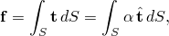

其中  是幅值， 是载荷的方向。要定义一般表面牵引，您必须同时指定载荷幅值  和相对于参考配置的方向 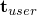。幅值和方向也可以在用户子程序[`UTRACLOAD`](../sub/sub-link.md#sub-xsl-utracload)中指定。Abaqus对指定的牵引方向进行归一化，因此它们不影响载荷的幅值：


| **输入文件用法：** | 使用以下选项之一定义一般表面牵引： |
| --- | --- |
|  | ``` [*DLOAD*](../key/key-link.md#usb-kws-hdload) *element number or element set*, *load type label*, *magnitude*, *direction components* ``` 其中*load type label*为TRVEC*n*、TRVEC、TRVEC*n*NU或TRVECNU。 ``` [*DSLOAD*](../key/key-link.md#usb-kws-hdsload) *surface name*, TRVEC or TRVECNU, *magnitude*, *direction components* ``` |

| **Abaqus/CAE用法：** | 使用以下输入定义基于元素的一般表面牵引： |
| --- | --- |
|  | 载荷模块：**创建载荷**：为**类别**选择**机械**，为**所选步的类型**选择**表面牵引**：**牵引：一般**，**分布**：选择分析场 |
|  | 使用以下输入定义基于表面的一般表面牵引： |
|  | 载荷模块：**创建载荷**：为**类别**选择**机械**，为**所选步的类型**选择**表面牵引**：**牵引：一般**，**分布**：**均匀**或**用户定义** |
|  | Abaqus/CAE不支持非均匀基于元素的一般表面牵引。 |
| --- | --- |

##### 使用局部坐标系定义方向向量

默认情况下，牵引向量的分量是相对于全局方向指定的。您也可以为这些牵引的方向分量引用局部坐标系（见["方向，" 第2.2.5节"](pt01ch02s02aus15.md)）。有关使用局部坐标系定义剪切方向的示例，请参阅下面的["示例：使用局部坐标系定义剪切方向"](pt07ch34s04aus122.md#usb-prc-ploaddistributed-localcsys)。当对二维实体元素施加的牵引使用局部坐标系时，必须确保载荷的非零分量仅在*X*和*Y*方向。不支持第三方向（平面应变和平面应力元素的*Z*方向，轴对称元素的  方向）的牵引载荷。

| **输入文件用法：** | 使用以下选项之一指定局部坐标系： |
| --- | --- |
|  | ``` [*DLOAD*](../key/key-link.md#usb-kws-hdload), ORIENTATION=*name* [*DSLOAD*](../key/key-link.md#usb-kws-hdsload), ORIENTATION=*name* ``` |

| **Abaqus/CAE用法：** | 载荷模块：**创建载荷**：为**类别**选择**机械**，为**所选步的类型**选择**表面牵引**：选择**CSYS：拾取**并点击**编辑**拾取局部坐标系，或选择**CSYS：用户定义**输入定义局部坐标系的用户子程序名称 |
| --- | --- |

##### 牵引向量方向的旋转

牵引载荷在几何线性分析中或如果在几何非线性分析中指定了非跟随载荷，则以固定方向 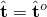 作用（包括关于几何非线性基态的扰动步）。

如果在几何非线性分析中指定了跟随载荷，则牵引载荷使用以下算法随表面刚体旋转。Abaqus将参考配置牵引向量 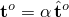 分解为两个分量：法向分量，

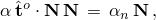

和切向分量，

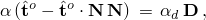

其中  是参考表面法向， 是 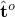 到参考表面的投影单位向量。则在当前配置中的应用牵引计算为

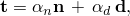

其中  是表面在当前配置中的法向， 是  旋转到当前表面上的图像；即，，其中  是从局部二维表面变形梯度  的极分解得到的标准旋转张量。

##### 跟随和非跟随牵引示例

以下两个示例说明在几何非线性分析中施加跟随和非跟随牵引的区别。两个示例都引用单个4节点平面应变单元（单元1）。在第一个示例的第一步中，跟随牵引载荷施加在单元1的面1上，非跟随牵引载荷施加在单元1的面2上。单元在第一步中刚体旋转90°，然后在第二步中再旋转90°。如图[图34.4.3-1](pt07ch34s04aus122.md#traction-example1)所示，跟随牵引随面1旋转，而面2上的非跟随牵引始终沿全局*x*方向作用。

**图34.4.3–1** 几何非线性分析中的跟随和非跟随牵引载荷，第一步施加载荷：（a）第一步开始；（b）第一步结束，第二步开始；（c）第二步结束。

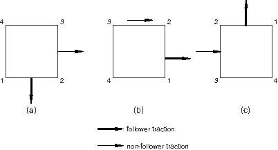

```
[*STEP*](../key/key-link.md#usb-kws-hstep), NLGEOM
 Step 1 - Rotate square 90 degrees
...
[*DLOAD*](../key/key-link.md#usb-kws-hdload), FOLLOWER=YES
 1, TRVEC1, 1., 0., -1., 0.
[*DLOAD*](../key/key-link.md#usb-kws-hdload), FOLLOWER=NO
 1, TRVEC2, 1., 1., 0., 0.
[*END STEP*](../key/key-link.md#usb-kws-hendstep)
[*STEP*](../key/key-link.md#usb-kws-hstep), NLGEOM
 Step 2 - Rotate square another 90 degrees
...
[*END STEP*](../key/key-link.md#usb-kws-hendstep)
```

在第二个示例中，单元在第一步中旋转90°，不施加载荷。在第二步中，跟随牵引载荷施加在面1上，非跟随牵引载荷施加在面2上。然后单元再刚体旋转90°。跟随载荷的方向是相对于原始配置指定的。如图[图34.4.3-2](pt07ch34s04aus122.md#traction-example2)所示，跟随牵引随面1旋转，而面2上的非跟随牵引始终沿全局*x*方向作用。

**图34.4.3–2** 几何非线性分析中的跟随和非跟随牵引载荷，第二步施加载荷：（a）第一步开始；（b）第一步结束，第二步开始；（c）第二步结束。

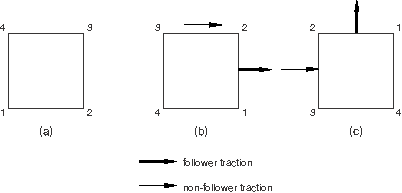

```
[*STEP*](../key/key-link.md#usb-kws-hstep), NLGEOM
 Step 1 - Rotate square 90 degrees
...
[*END STEP*](../key/key-link.md#usb-kws-hendstep)
[*STEP*](../key/key-link.md#usb-kws-hstep), NLGEOM
 Step 2 - Rotate square another 90 degrees
[*DLOAD*](../key/key-link.md#usb-kws-hdload), FOLLOWER=YES
 1, TRVEC1, 1., 0., -1., 0.
[*DLOAD*](../key/key-link.md#usb-kws-hdload), FOLLOWER=NO
 1, TRVEC2, 1., 1., 0., 0.
...
[*END STEP*](../key/key-link.md#usb-kws-hendstep)
```

#### 指定剪切表面牵引

剪切表面牵引允许您指定每单位面积的作用于表面*S*的切向力 。合力  通过对*S*积分  计算：


其中  是幅值， 是载荷方向的单位向量。要定义剪切表面牵引，您必须提供载荷的幅值  和方向 。幅值和方向向量也可以在用户子程序[`UTRACLOAD`](../sub/sub-link.md#sub-xsl-utracload)中指定。

Abaqus首先通过将用户指定的向量  投影到*参考*配置的表面上修改牵引方向，


其中  是参考表面法向。然后规定的牵引沿计算的牵引方向  切向于表面作用：


因此，在  垂直于参考表面的任何点处都不施加剪切牵引载荷。

剪切牵引载荷在几何线性分析中以固定方向  作用。在几何非线性分析中（包括关于几何非线性基态的扰动步），剪切牵引向量将刚体旋转；即，，其中  是从局部二维表面变形梯度  的极分解得到的标准旋转张量。

| **输入文件用法：** | 使用以下选项之一定义剪切表面牵引： |
| --- | --- |
|  | ``` [*DLOAD*](../key/key-link.md#usb-kws-hdload) *element number or element set*, *load type label*, *magnitude*, *direction components* ``` 其中*load type label*为TRSHR*n*、TRSHR、TRSHR*n*NU或TRSHRNU。 ``` [*DSLOAD*](../key/key-link.md#usb-kws-hdsload) *surface name*, TRSHR or TRSHRNU, *magnitude*, *direction components* ``` |

| **Abaqus/CAE用法：** | 使用以下输入定义基于元素的剪切表面牵引： |
| --- | --- |
|  | 载荷模块：**创建载荷**：为**类别**选择**机械**，为**所选步的类型**选择**表面牵引**：**牵引：剪切**，**分布**：选择分析场 |
|  | 使用以下输入定义基于表面的剪切表面牵引： |
|  | 载荷模块：**创建载荷**：为**类别**选择**机械**，为**所选步的类型**选择**表面牵引**：**牵引：剪切**，**分布**：**均匀**或**用户定义** |
|  | Abaqus/CAE不支持非均匀基于元素的剪切表面牵引。 |
| --- | --- |

##### 使用局部坐标系定义方向向量

默认情况下，剪切牵引向量的分量是相对于全局方向指定的。您也可以为这些牵引的方向分量引用局部坐标系（见["方向，" 第2.2.5节"](pt01ch02s02aus15.md)）。

| **输入文件用法：** | 使用以下选项之一指定局部坐标系： |
| --- | --- |
|  | ``` [*DLOAD*](../key/key-link.md#usb-kws-hdload), ORIENTATION=*name* [*DSLOAD*](../key/key-link.md#usb-kws-hdsload), ORIENTATION=*name* ``` |

| **Abaqus/CAE用法：** | 载荷模块：**创建载荷**：为**类别**选择**机械**，为**所选步的类型**选择**表面牵引**：选择**CSYS：拾取**并点击**编辑**拾取局部坐标系，或选择**CSYS：用户定义**输入定义局部坐标系的用户子程序名称 |
| --- | --- |

##### 示例：使用局部坐标系定义剪切方向

有时使用局部坐标系给出剪切和一般牵引方向很方便。以下两个示例说明使用全局坐标和局部圆柱坐标系指定圆柱上剪切牵引方向。圆柱的对称轴与全局*z*轴重合。名为`SURFA`的表面已在圆柱外部定义。

在第一个示例中，剪切牵引方向  以全局坐标给出。使用全局坐标的所得剪切牵引方向如图[图34.4.3-3](pt07ch34s04aus122.md#sheartract-orient)(a)所示。

**图34.4.3–3** 使用全局坐标（a）和局部圆柱坐标系（b）指定的剪切牵引。


```
[*STEP*](../key/key-link.md#usb-kws-hstep)
 Step 1 - Specify shear directions in global coordinates
...
[*DSLOAD*](../key/key-link.md#usb-kws-hdsload)
 SURFA, TRSHR, 1., 0., 1., 0.
...
[*END STEP*](../key/key-link.md#usb-kws-hendstep)
```

在第二个示例中，剪切牵引方向  相对于局部圆柱坐标系给出，其轴与圆柱轴重合。使用局部圆柱坐标系的所得剪切牵引方向如图[图34.4.3-3](pt07ch34s04aus122.md#sheartract-orient)(b)所示。

```
[*ORIENTATION*](../key/key-link.md#usb-kws-morientation), NAME=CYLIN, SYSTEM=CYLINDRICAL
 0., 0., 0., 0., 0., 1.
...
[*STEP*](../key/key-link.md#usb-kws-hstep)
 Step 1 - Specify shear directions in local cylindrical coordinates
...
[*DSLOAD*](../key/key-link.md#usb-kws-hdsload), ORIENTATION=CYLIN
 SURFA, TRSHR, 1., 0., 1., 0.
...
[*END STEP*](../key/key-link.md#usb-kws-hendstep)
```

#### 由于表面牵引产生的合力

您可以通过指定是否保持恒定合力来选择是在当前配置还是参考配置上对表面牵引进行积分。

通常，恒定合力方法最适用于合力的幅值不应随表面积变化的情况。但是，由您决定哪种方法最适合您的分析。使用恒定合力的分析示例见["分布牵引和边缘载荷，" Abaqus验证指南第1.4.18节"](../ver/ver-link.md#ver-elm-tractandedgeloads)。

##### 选择不保持恒定合力

如果您选择不保持恒定合力，则牵引向量在当前配置的表面上积分，该表面在几何非线性分析中通常会变形。默认情况下，所有表面牵引都在当前配置的表面上积分。

| **输入文件用法：** | 使用以下选项之一： |
| --- | --- |
|  | ``` [*DLOAD*](../key/key-link.md#usb-kws-hdload), CONSTANT RESULTANT=NO [*DSLOAD*](../key/key-link.md#usb-kws-hdsload), CONSTANT RESULTANT=NO ``` |

| **Abaqus/CAE用法：** | 载荷模块：**创建载荷**：为**类别**选择**机械**，为**所选步的类型**选择**表面牵引**：**牵引按每单位变形面积定义** |
| --- | --- |

##### 保持恒定合力

如果您选择保持恒定合力，则牵引向量在参考配置的表面上积分，然后保持恒定。

| **输入文件用法：** | 使用以下选项之一： |
| --- | --- |
|  | ``` [*DLOAD*](../key/key-link.md#usb-kws-hdload), CONSTANT RESULTANT=YES [*DSLOAD*](../key/key-link.md#usb-kws-hdsload), CONSTANT RESULTANT=YES ``` |

| **Abaqus/CAE用法：** | 载荷模块：**创建载荷**：为**类别**选择**机械**，为**所选步的类型**选择**表面牵引**：**牵引按每单位未变形面积定义** |
| --- | --- |

##### 示例

恒定合力方法在用已知恒定合力模拟分布载荷时具有某些优点。考虑在几何非线性分析中模拟均匀静载荷，幅值*p*，作用在法向为  方向的平板上（[图34.4.3-4](pt07ch34s04aus122.md#dead-tract-load)）。

**图34.4.3–4** 平板上的静载荷。


这样的模型可用于模拟平坦屋顶上的雪载荷。雪载荷可以建模为分布式静牵引载荷 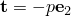。设  和*S*分别表示参考和当前配置中平板的总表面积。如果没有恒定合力，则板上总积分载荷  为


在这种情况下，均匀牵引导致合力载荷随平板表面积增加，这不符合固定雪载荷。如果使用恒定合力方法，板上总积分载荷为


在这种情况下，均匀牵引导致等于参考配置中压力乘以表面积的合力，这更符合问题本身。

#### 指定压力载荷

分布压力载荷可以在任何二维、三维或轴对称单元上指定。静水压力载荷可以在Abaqus/Standard中的二维、三维和轴对称单元上指定。粘性和滞止压力载荷可以在Abaqus/Explicit中的任何单元上指定。

##### 分布压力载荷

分布压力载荷可以在任何单元上指定。对于梁单元，正施加的压力导致沿截面局部方向或全局方向（以指定者为准）的力向量。对于常规壳单元，力向量沿元素SPOS法向指向。对于具有显式标识面的连续体实体或连续体壳单元，力向量指向该面外向法线。分布压力载荷不支持管道和弯头单元。

分布压力载荷可以在跨越元素形成的表面上指定；正施加的压力导致沿局部表面法向指向的力向量。

| **输入文件用法：** | 使用以下选项之一定义压力载荷： |
| --- | --- |
|  | ``` [*DLOAD*](../key/key-link.md#usb-kws-hdload) *element number or element set*, *load type label*, *magnitude* ``` 其中*load type label*为P*n*、P、P*n*NU或PNU。 ``` [*DSLOAD*](../key/key-link.md#usb-kws-hdsload) *surface name*, P or PNU, *magnitude* ``` |

| **Abaqus/CAE用法：** | 使用以下输入定义基于元素的压力载荷： |
| --- | --- |
|  | 载荷模块：**创建载荷**：为**类别**选择**机械**，为**所选步的类型**选择**压力**：**分布**：选择分析场或离散场 |
|  | 使用以下输入定义基于表面的压力载荷： |
|  | 载荷模块：**创建载荷**：为**类别**选择**机械**，为**所选步的类型**选择**压力**：**均匀**或**用户定义** |
|  | Abaqus/CAE不支持非均匀基于元素的压力载荷。 |
| --- | --- |

##### Abaqus/Standard中二维、三维和轴对称单元上的静水压力载荷

要在Abaqus/Standard中定义静水压力，请在基于元素或基于表面的分布载荷定义中给出零压力水平（[图34.4.3-5](pt07ch34s04aus122.md#pload-hydrostatic)中的点*a*）和定义静水压力的水平（[图34.4.3-5](pt07ch34s04aus122.md#pload-hydrostatic)中的点*b*）的*Z*坐标。对于零压力水平以上的水平，静水压力为零。

**图34.4.3–5** 静水压力分布。

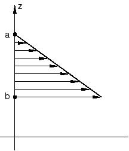

在平面单元中，静水压头在*Y*方向；对于轴对称单元，*Z*方向是第二坐标。

| **输入文件用法：** | 使用以下选项之一定义静水压力载荷： |
| --- | --- |
|  | ``` [*DLOAD*](../key/key-link.md#usb-kws-hdload) *element number or element set*, HP*n* or HP, *magnitude*, *Z*-coordinate of point *a*, *Z*-coordinate of point *b* [*DSLOAD*](../key/key-link.md#usb-kws-hdsload) *surface name*, HP, *magnitude*, *Z*-coordinate of point *a*, *Z*-coordinate of point *b* ``` |

| **Abaqus/CAE用法：** | 使用以下输入定义基于表面的静水压力载荷： |
| --- | --- |
|  | 载荷模块：**创建载荷**：为**类别**选择**机械**，为**所选步的类型**选择**压力**：**分布：静水压** |
|  | Abaqus/CAE不支持基于元素的静水压力载荷。 |
| --- | --- |

##### Abaqus/Explicit中的粘性压力载荷

粘性压力载荷定义为


其中*p*是施加到体的压力； 是粘度，作为载荷的幅值给出； 是表面上施加压力点的速度； 是参考节点的速度； 是元素在同一位置处的单位外向法线。

粘性压力载荷最常应用于结构问题，当您想要阻尼动态效应并因此以最少的增量数达到静态平衡时。一个常见的例子是确定成形后钣金产品的回弹，在这种情况下，粘性压力将施加到定义钣金的壳单元的面。选择  的适当值对于有效使用此技术很重要。

要计算 ，考虑["无限单元，" 第28.3.1节"](pt06ch28s03alm03.md)中描述的无限连续单元。在显式动力学中，这些单元通过施加粘性正压力来实现无限边界条件，其中系数  由  给出； 是表面处材料的密度， 是材料中膨胀波速度的值（无限连续单元还施加粘性剪切牵引）。对于各向同性线弹性材料

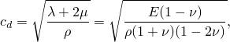

其中  和  是Lam常数，*E*是杨氏模量， 是泊松比。这种粘性压力系数的选择代表了一种阻尼水平，其中穿过自由表面的压力波被吸收，没有能量反射回有限元网格内部。

对于典型的结构问题，吸收所有能量是不可取的（如同无限单元中一样）。通常  设置为  的一个小百分比（约1或2%），作为最小化持续动态效应的有效方法。 系数应为正值。

| **输入文件用法：** | 使用以下选项之一定义粘性压力载荷： |
| --- | --- |
|  | ``` [*DLOAD*](../key/key-link.md#usb-kws-hdload), REF NODE=*reference_node* *element number or element set*, VP*n* or VP, *magnitude* [*DSLOAD*](../key/key-link.md#usb-kws-hdsload), REF NODE=*reference_node* *surface name*, VP, *magnitude* ``` |

| **Abaqus/CAE用法：** | 使用以下输入定义基于表面的粘性压力载荷： |
| --- | --- |
|  | 载荷模块：**创建载荷**：为**类别**选择**机械**，为**所选步的类型**选择**压力**：**分布：粘性**，打开或关闭**从参考点确定速度** |
|  | Abaqus/CAE不支持基于元素的粘性压力载荷。 |
| --- | --- |

##### Abaqus/Explicit中的滞止压力载荷

滞止压力载荷定义为


其中  是施加到体的滞止压力； 是系数，作为载荷的幅值给出； 是表面上施加压力点的速度； 是元素在同一位置处的单位外向法线； 是参考节点的速度。系数  应该非常小以避免过度阻尼和稳定时间增量的急剧下降。

| **输入文件用法：** | 使用以下选项之一定义滞止压力载荷： |
| --- | --- |
|  | ``` [*DLOAD*](../key/key-link.md#usb-kws-hdload), REF NODE=*reference_node* *element number or element set*, SP*n* or SP, *magnitude* [*DSLOAD*](../key/key-link.md#usb-kws-hdsload), REF NODE=*reference_node* *element number or element set*, SP, *magnitude* ``` |

| **Abaqus/CAE用法：** | 使用以下输入定义基于表面的滞止压力载荷： |
| --- | --- |
|  | 载荷模块：**创建载荷**：为**类别**选择**机械**，为**所选步的类型**选择**压力**：**分布：滞止**，打开或关闭**从参考点确定速度** |
|  | Abaqus/CAE不支持基于元素的滞止压力载荷。 |
| --- | --- |

##### 管道和弯头单元上的压力

您可以在管道或弯头单元上指定外压、内压、外静水压或内静水压。当施加压力载荷时，必须在基于元素的分布载荷定义中指定有效的外径或内径。

载荷结果包括元素端部的压力：Abaqus假设封闭端条件。封闭端条件正确地模拟了管道交叉处、紧密弯头、转角和横截面变化处的载荷；在直线段和平滑弯头中，相邻元素的端载荷相互抵消。如果要建模开放端条件，应在开放端添加补偿点载荷。在管道和梁单元的混合物建模管道时会出现必须施加此类端载荷的情况。在这种情况下，封闭端条件会产生物理上不存在的力在管道和梁元素之间的过渡处。不建议对管道进行这种混合建模。

对于承受压力载荷的管道单元，可以通过请求输出变量ESF1获得由于压力载荷产生的有效轴向力（见["梁单元库，" 第29.3.8节"](pt06ch29s03ael14.md)）。

| **输入文件用法：** | 使用以下选项在管道或弯头单元上定义外压载荷： |
| --- | --- |
|  | ``` [*DLOAD*](../key/key-link.md#usb-kws-hdload) *element number or element set*, PE or PENU, *magnitude*, *effective outer diameter* ``` 使用以下选项在管道或弯头单元上定义内压载荷： ``` [*DLOAD*](../key/key-link.md#usb-kws-hdload) *element number or element set*, PI or PINU, *magnitude*, *effective inner diameter* ``` 使用以下选项在管道或弯头单元上定义外静水压载荷： ``` [*DLOAD*](../key/key-link.md#usb-kws-hdload) *element number or element set*, HPE, *magnitude*, *effective outer diameter* ``` 使用以下选项在管道或弯头单元上定义内静水压载荷： ``` [*DLOAD*](../key/key-link.md#usb-kws-hdload) *element number or element set*, HPI, *magnitude*, *effective inner diameter* ``` |

| **Abaqus/CAE用法：** | 使用以下输入在管道或弯头单元上定义外压或内压载荷： |
| --- | --- |
|  | 载荷模块：**创建载荷**：为**类别**选择**机械**，为**所选步的类型**选择**管道压力**：**侧**：**外部**或**内部**，**分布**：**均匀**、**用户定义**或选择分析场 |
|  | 使用以下输入在管道或弯头单元上定义外或内静水压载荷： |
|  | 载荷模块：**创建载荷**：为**类别**选择**机械**，为**所选步的类型**选择**管道压力**：**侧**：**外部**或**内部**，**分布：静水压** |
| --- | --- |

#### 在平面应力单元上定义分布表面载荷

平面应力理论假定在大应变分析中平面应力单元的体积保持恒定。当分布表面载荷施加到平面应力单元的边缘时，考虑边缘的当前长度和方向进行载荷分布，但不考虑当前厚度；使用原始厚度。

只有通过在边缘使用三维单元才能避免此限制，以便在加载时识别厚度的变化；需要适当的方程约束（["线性约束方程，" 第35.2.1节"](pt08ch35s02aus129.md)）使这些元素的平面内位移相等。沿着边缘的三维单元可以通过使用壳-实体耦合约束连接到内部壳单元（详见["壳-实体耦合，" 第35.3.3节"](pt08ch35s03aus134.md)）。

### 壳单元上的边缘牵引和力矩以及梁单元上的线载荷

分布边缘牵引（一般、剪切、法向或横向）和边缘力矩可以作为基于元素或基于表面的分布载荷施加在Abaqus的壳单元上。边缘牵引的单位是每单位长度的力。边缘力矩的单位是每单位长度的扭矩。除了一般边缘牵引外，所有边缘牵引和力矩都忽略对局部坐标系的引用。

分布线载荷可以作为基于元素的分布载荷施加在Abaqus的梁单元上。线载荷的单位是每单位长度的力。

[表34.4.3-4](pt07ch34s04aus122.md#edgeloadlabels)列出了Abaqus中所有可用的分布边缘和线载荷类型及其对应的载荷类型标签。[第六部分，"单元"](pt06.md)列出了特定单元可用的分布边缘和线载荷类型以及每种载荷类型的Abaqus/CAE载荷支持。对于施加到壳单元的基于元素的载荷，您必须在载荷类型标签中标识规定载荷的元素边缘（例如，EDLD*n*或EDLD*n*NU）。

#### 跟随边缘和线载荷

顾名思义，*跟随*边缘或线载荷的作用线在几何非线性分析中随边缘或线旋转。这与*非跟随*载荷相反，后者始终以固定全局方向作用。

除了一般边缘牵引和梁单元全局方向每单位长度的力外，[表34.4.3-4](pt07ch34s04aus122.md#edgeloadlabels)中列出的所有边缘和线载荷都建模为跟随载荷。[表34.4.3-4](pt07ch34s04aus122.md#edgeloadlabels)中列出的法向、剪切和横向边缘载荷在当前配置中分别沿法向、剪切和横向方向作用（见[图34.4.3-6](pt07ch34s04aus122.md#edge-loads)）。边缘力矩始终在当前配置中绕壳边缘作用。梁单元局部方向每单位长度的力随梁单元旋转。

**表34.4.3–4** 分布边缘载荷类型。

| 载荷描述 | 基于元素载荷的载荷类型标签 | 基于表面载荷的载荷类型标签 | Abaqus/CAE载荷类型 |
| --- | --- | --- | --- |
| 一般边缘牵引 | EDLD*n* | EDLD | **壳边缘载荷** |
| 法向边缘牵引 | EDNOR*n* | EDNOR |
| 剪切边缘牵引 | EDSHR*n* | EDSHR |
| 横向边缘牵引 | EDTRA*n* | EDTRA |
| 边缘力矩 | EDMOM*n* | EDMOM |
| 非均匀一般边缘牵引 | EDLD*n*NU | EDLDNU | **壳边缘载荷**（仅基于表面载荷） |
| 非均匀法向边缘牵引 | EDNOR*n*NU | EDNORNU |
| 非均匀剪切边缘牵引 | EDSHR*n*NU | EDSHRNU |
| 非均匀横向边缘牵引 | EDTRA*n*NU | EDTRANU |
| 非均匀边缘力矩 | EDMOM*n*NU | EDMOMNU |
| 全局*X*、*Y*和*Z*方向每单位长度的力（仅适用于梁单元） | PX、PY、PZ | N/A | **线载荷** |
| 全局*X*、*Y*和*Z*方向每单位长度的非均匀力（仅适用于梁单元） | PXNU、PYNU、PZNU | N/A |
| 梁局部1和2方向每单位长度的力（仅适用于梁单元） | P1、P2 | N/A |
| 梁局部1和2方向每单位长度的非均匀力（仅适用于梁单元） | P1NU、P2NU | N/A |

**图34.4.3–6** 正边缘载荷。


梁单元全局方向每单位长度的力始终是非跟随载荷。

一般边缘牵引可以指定为跟随或非跟随载荷。在几何线性分析中，跟随和非跟随载荷之间没有区别，因为身体的配置保持固定。

| **输入文件用法：** | 使用以下选项之一将一般边缘牵引定义为跟随载荷（默认）： |
| --- | --- |
|  | ``` [*DLOAD*](../key/key-link.md#usb-kws-hdload), FOLLOWER=YES [*DSLOAD*](../key/key-link.md#usb-kws-hdsload), FOLLOWER=YES ``` 使用以下选项之一将一般边缘牵引定义为非跟随载荷： ``` [*DLOAD*](../key/key-link.md#usb-kws-hdload), FOLLOWER=NO [*DSLOAD*](../key/key-link.md#usb-kws-hdsload), FOLLOWER=NO ``` |

| **Abaqus/CAE用法：** | 载荷模块：**创建载荷**：为**类别**选择**机械**，为**所选步的类型**选择**壳边缘载荷**：**牵引：一般**，打开或关闭**跟随旋转** |
| --- | --- |

#### 指定一般边缘牵引

一般边缘牵引允许您指定作用在壳边缘*L*上的边缘载荷 。合力  通过对*L*积分  计算：


要定义一般边缘牵引，您必须为载荷提供幅值  和方向 。Abaqus对指定的载荷方向进行归一化；因此，它们不影响载荷的幅值。

如果指定了非均匀一般边缘牵引，则必须在用户子程序[`UTRACLOAD`](../sub/sub-link.md#sub-xsl-utracload)中指定幅值  和方向 。

| **输入文件用法：** | 使用以下选项之一定义一般边缘牵引： |
| --- | --- |
|  | ``` [*DLOAD*](../key/key-link.md#usb-kws-hdload) *element number or element set*, EDLD*n* or EDLD*n*NU, *magnitude*, *direction components* [*DSLOAD*](../key/key-link.md#usb-kws-hdsload) *surface name*, EDLD or EDLDNU, *magnitude*, *direction components* ``` |

| **Abaqus/CAE用法：** | 使用以下输入定义基于元素的一般边缘牵引： |
| --- | --- |
|  | 载荷模块：**创建载荷**：为**类别**选择**机械**，为**所选步的类型**选择**壳边缘载荷**：**牵引：一般**，**分布**：选择分析场 |
|  | 使用以下输入定义基于表面的一般边缘牵引： |
|  | 载荷模块：**创建载荷**：为**类别**选择**机械**，为**所选步的类型**选择**壳边缘载荷**：**牵引：一般**，**分布**：**均匀**或**用户定义** |
|  | Abaqus/CAE不支持非均匀基于元素的一般边缘牵引。 |
| --- | --- |

##### 载荷向量的旋转

在几何线性分析中，边缘载荷  沿固定方向作用

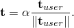

如果在几何非线性分析中指定了非跟随载荷（包括关于几何非线性基态的扰动步），边缘载荷  沿固定方向定义


如果在几何非线性分析中指定了跟随载荷（包括关于几何非线性基态的扰动步），则分量必须相对于参考配置定义。参考边缘牵引定义为

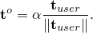

应用边缘牵引  通过将  刚体旋转到当前边缘上来计算。

##### 使用局部坐标系定义方向向量

默认情况下，边缘牵引向量的分量是相对于全局方向指定的。您也可以为这些牵引的方向分量引用局部坐标系（见["方向，" 第2.2.5节"](pt01ch02s02aus15.md)）。

| **输入文件用法：** | 使用以下选项之一指定局部坐标系： |
| --- | --- |
|  | ``` [*DLOAD*](../key/key-link.md#usb-kws-hdload), ORIENTATION=*name* [*DSLOAD*](../key/key-link.md#usb-kws-hdsload), ORIENTATION=*name* ``` |

| **Abaqus/CAE用法：** | 载荷模块：**创建载荷**：为**类别**选择**机械**，为**所选步的类型**选择**壳边缘载荷**：选择**CSYS：拾取**并点击**编辑**拾取局部坐标系，或选择**CSYS：用户定义**输入定义局部坐标系的用户子程序名称 |
| --- | --- |

#### 指定剪切、法向和横向边缘牵引

剪切、法向和横向边缘牵引的加载方向由底层元素确定。正剪切边缘牵引沿元素连通性确定的壳边缘正向作用。正法向边缘牵引沿壳平面内向方向作用。正横向边缘牵引沿与面元法线相反的方向作用。正剪切、法向和横向边缘牵引的方向如图[图34.4.3-6](pt07ch34s04aus122.md#edge-loads)所示。

要定义剪切、法向或横向边缘牵引，您必须为载荷提供幅值 。

如果指定了非均匀剪切、法向或横向边缘牵引，则必须在用户子程序[`UTRACLOAD`](../sub/sub-link.md#sub-xsl-utracload)中指定幅值 。

在几何线性步中，剪切、法向和横向边缘牵引沿壳的切向、法向和横向方向作用，如图[图34.4.3-6](pt07ch34s04aus122.md#edge-loads)所示。在几何非线性分析中，剪切、法向和横向边缘牵引随壳边缘旋转，因此它们始终沿壳的切向、法向和横向方向作用，如图[图34.4.3-6](pt07ch34s04aus122.md#edge-loads)所示。

| **输入文件用法：** | 使用以下选项之一定义有向边缘牵引： |
| --- | --- |
|  | ``` [*DLOAD*](../key/key-link.md#usb-kws-hdload) *element number or element set*, *directed edge traction label*, *magnitude* [*DSLOAD*](../key/key-link.md#usb-kws-hdsload) *surface name*, *directed edge traction label*, *magnitude* ``` 对于基于元素的载荷，*directed edge traction label*可以是用于剪切边缘牵引的EDSHR*n*或EDSHR*n*NU，用于法向边缘牵引的EDNOR*n*或EDNOR*n*NU，或用于横向边缘牵引的EDTRA*n*或EDTRA*n*NU。对于基于表面的载荷，*directed edge traction label*可以是用于剪切边缘牵引的EDSHR或EDSHRNU，用于法向边缘牵引的EDNOR或EDNORNU，或用于横向边缘牵引的EDTRA或EDTRANU。 |

| **Abaqus/CAE用法：** | 使用以下输入定义基于元素的有向边缘牵引： |
| --- | --- |
|  | 载荷模块：**创建载荷**；为**类别**选择**机械**，为**所选步的类型**选择**壳边缘载荷**；**牵引：法向**、**横向**或**剪切**；**分布**：选择分析场 |
|  | 使用以下输入定义基于表面的有向边缘牵引： |
|  | 载荷模块：**创建载荷**；为**类别**选择**机械**，为**所选步的类型**选择**壳边缘载荷**；**牵引：法向**、**横向**或**剪切**；**分布**：**均匀**或**用户定义** |
|  | Abaqus/CAE不支持非均匀基于元素的有向边缘牵引。 |
| --- | --- |

#### 指定边缘力矩

边缘力矩绕壳边缘作用，正方向由元素连通性确定。正边缘力矩的方向如图[图34.4.3-7](pt07ch34s04aus122.md#edge-moments)所示。

**图34.4.3–7** 正边缘力矩。

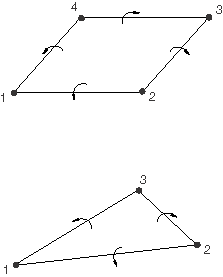

要定义分布边缘力矩，您必须为载荷提供幅值 。

如果指定了非均匀边缘力矩，则必须在用户子程序[`UTRACLOAD`](../sub/sub-link.md#sub-xsl-utracload)中指定幅值 。

边缘力矩在几何线性和非线性分析中始终在当前壳边缘处作用。

在几何线性步中，边缘力矩如图[图34.4.3-7](pt07ch34s04aus122.md#edge-moments)所示绕壳边缘作用。在几何非线性分析中，边缘力矩始终如图[图34.4.3-7](pt07ch34s04aus122.md#edge-moments)所示绕壳边缘作用。

| **输入文件用法：** | 使用以下选项之一定义边缘力矩： |
| --- | --- |
|  | ``` [*DLOAD*](../key/key-link.md#usb-kws-hdload) *element number or element set*, EDMOM*n* or EDMOM*n*NU, *magnitude* [*DSLOAD*](../key/key-link.md#usb-kws-hdsload) *surface name*, EDMOM or EDMOMNU, *magnitude* ``` |

| **Abaqus/CAE用法：** | 使用以下输入定义基于元素的边缘力矩： |
| --- | --- |
|  | 载荷模块：**创建载荷**：为**类别**选择**机械**，为**所选步的类型**选择**壳边缘载荷**：**牵引：力矩**，**分布**：选择分析场 |
|  | 使用以下输入定义基于表面的边缘力矩： |
|  | 载荷模块：**创建载荷**：为**类别**选择**机械**，为**所选步的类型**选择**壳边缘载荷**：**牵引：力矩**，**分布**：**均匀**或**用户定义** |
|  | Abaqus/CAE不支持非均匀基于元素的边缘力矩。 |
| --- | --- |

#### 由于边缘牵引和力矩产生的合力

您可以通过指定是否保持恒定合力来选择是在当前配置还是参考配置上对边缘牵引和力矩进行积分。通常，恒定合力方法最适用于合力的幅值不应随边缘长度变化的分析。但是，由您决定哪种方法最适合您的分析。

##### 选择不保持恒定合力

如果您选择不保持恒定合力，则边缘牵引或力矩在当前边缘上积分，该边缘在几何非线性分析中会改变长度。

| **输入文件用法：** | 使用以下选项之一： |
| --- | --- |
|  | ``` [*DLOAD*](../key/key-link.md#usb-kws-hdload), CONSTANT RESULTANT=NO [*DSLOAD*](../key/key-link.md#usb-kws-hdsload), CONSTANT RESULTANT=NO ``` |

| **Abaqus/CAE用法：** | 载荷模块：**创建载荷**：为**类别**选择**机械**，为**所选步的类型**选择**壳边缘载荷**：**牵引按每单位变形面积定义** |
| --- | --- |

##### 保持恒定合力

如果您选择保持恒定合力，则边缘牵引或力矩在参考配置的边缘上积分，其长度为常数。

| **输入文件用法：** | 使用以下选项之一： |
| --- | --- |
|  | ``` [*DLOAD*](../key/key-link.md#usb-kws-hdload), CONSTANT RESULTANT=YES [*DSLOAD*](../key/key-link.md#usb-kws-hdsload), CONSTANT RESULTANT=YES ``` |

| **Abaqus/CAE用法：** | 载荷模块：**创建载荷**：为**类别**选择**机械**，为**所选步的类型**选择**壳边缘载荷**：**牵引按每单位未变形面积定义** |
| --- | --- |

#### 在梁单元上指定线载荷

您可以在全局*X*、*Y*或*Z*方向为梁单元指定线载荷。此外，您可以在梁局部1或2方向为梁单元指定线载荷。

| **输入文件用法：** | 使用以下选项在梁单元上定义全局*X*、*Y*或*Z*方向的每单位长度力： |
| --- | --- |
|  | ``` [*DLOAD*](../key/key-link.md#usb-kws-hdload) *element number or element set*, *load type label*, *magnitude* ``` 其中*load type label*为PX、PY、PZ、PXNU、PYNU或PZNU。使用以下选项在梁局部1或2方向定义每单位长度力： ``` [*DLOAD*](../key/key-link.md#usb-kws-hdload) *element number or element set*, *load type label*, *magnitude* ``` 其中*load type label*为P1、P2、P1NU或P2NU。 |

| **Abaqus/CAE用法：** | 载荷模块：**创建载荷**：为**类别**选择**机械**，为**所选步的类型**选择**线载荷** |
| --- | --- |

#### 其他参考

- Genta, G., *Dynamics of Rotating Systems, *Springer, 2005.
