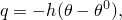
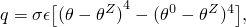
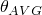

# 34.4.4 热载荷


**产品：** Abaqus/Standard  Abaqus/Explicit  Abaqus/CFD  Abaqus/CAE

##### **参考**

- ["施加载荷：概述，" 第34.4.1节"](pt07ch34s04aus120.md)
- [*CFLUX*](../key/key-link.md#usb-kws-hcflux)
- [*DFLUX*](../key/key-link.md#usb-kws-hdflux)
- [*DSFLUX*](../key/key-link.md#usb-kws-hdsflux)
- [*CFILM*](../key/key-link.md#usb-kws-hcfilm)
- [*FILM*](../key/key-link.md#usb-kws-hfilm)
- [*SFILM*](../key/key-link.md#usb-kws-hsfilm)
- [*FILM PROPERTY*](../key/key-link.md#usb-kws-mfilmproperty)
- [*CRADIATE*](../key/key-link.md#usb-kws-hcradiate)
- [*RADIATE*](../key/key-link.md#usb-kws-hradiate)
- [*SRADIATE*](../key/key-link.md#usb-kws-hsradiate)
- ["定义集中热通量，" Abaqus/CAE用户指南第16.9.19节"](../usi/usi-link.md#usi-lbi-loadeditors-concheatflux)
- ["定义体热通量，" Abaqus/CAE用户指南第16.9.18节"](../usi/usi-link.md#usi-lbi-loadeditors-bodyheatflux)
- ["定义表面热通量，" Abaqus/CAE用户指南第16.9.17节"](../usi/usi-link.md#usi-lbi-loadeditors-surfheatflux)
- ["定义流体壁面边界条件，" Abaqus/CAE用户指南第16.10.12节"](../usi/usi-link.md#usi-lbi-bceditors-fluid-wall)
- ["定义表面膜条件相互作用，" Abaqus/CAE用户指南第15.13.22节"](../usi/usi-link.md#usi-itn-help-film)
- ["定义集中膜条件相互作用，" Abaqus/CAE用户指南第15.13.23节"](../usi/usi-link.md#usi-itn-help-cfilm)
- ["定义表面辐射相互作用，" Abaqus/CAE用户指南第15.13.24节"](../usi/usi-link.md#usi-itn-help-radiation)
- ["定义集中辐射相互作用，" Abaqus/CAE用户指南第15.13.25节"](../usi/usi-link.md#usi-itn-help-cradiation)

### 概述

热载荷可以施加在热传递分析、完全耦合温度-位移分析、完全耦合热电结构分析和耦合热电分析中，如["规定条件：概述，" 第34.1.1节"](pt07ch34s01abo31.md)中所述。以下类型的热载荷可用：
- 在节点上规定的集中热通量。
- 在元素面或表面上规定的分布热通量。
- 每单位体积的体热通量。
- 在节点上、元素面上或表面上规定的边界对流。
- 在节点上、元素面上或表面上规定的边界辐射。

见["施加载荷：概述，" 第34.4.1节"](pt07ch34s04aus120.md)，了解适用于所有载荷类型的一般信息。

### 热辐射建模

可以使用Abaqus建模以下类型的辐射热交换：
- 非凹表面与非反射环境之间的交换。这种类型的辐射使用在节点上、元素面上或表面上规定的边界辐射载荷建模，如下所述。
- 彼此接近且表面温度梯度不大的两个表面之间的交换。这种类型的辐射使用间隙辐射功能建模，如["热接触属性，" 第37.2.1节"](pt09ch37s02aus174.md)中所述。
- 构成空腔的表面之间的交换。这种类型的辐射使用Abaqus/Standard中可用的空腔辐射功能建模，如["空腔辐射，" 第41.1.1节"](pt09ch41s01aus187.md)中所述，或者通过["规定平均温度辐射条件"](pt07ch34s04aus123.md#usb-prc-pthermal-approxcav)中所述的平均温度辐射条件建模。

### 直接规定热通量

集中热通量可以在节点（或节点集）上规定。分布热通量可以在元素面或表面上定义。

#### 指定集中热通量

默认情况下，集中热通量施加到自由度11。对于壳热传递元素，可以通过指定自由度11、12、13等通过壳厚度规定集中热通量。壳元素厚度方向的温度变化在["选择壳单元，" 第29.6.2节"](pt06ch29s06alm16.md)中描述。

| **输入文件用法：** | ``` [*CFLUX*](../key/key-link.md#usb-kws-hcflux) *node number or node set name*, *degree of freedom*, *heat flux magnitude* ``` |
| --- | --- |

| **Abaqus/CAE用法：** | 载荷模块：**创建载荷**：为**类别**选择**热**，为**所选步的类型**选择**集中热通量**：选择区域：**幅值**：*热通量幅值* |
| --- | --- |

#### 从用户指定文件定义集中节点通量的值

您可以使用先前Abaqus分析输出数据库（`.odb`）文件中特定步和增量的节点通量输出来定义节点通量。原始分析的零件（`.prt`）文件在从输出数据库文件读取数据时也需要。在这种情况下，先前模型和当前模型必须一致定义，包括节点编号，在两个模型中必须相同。如果模型基于零件实例的装配定义，则零件实例命名必须相同。

| **输入文件用法：** | ``` [*CFLUX*](../key/key-link.md#usb-kws-hcflux), FILE=file, STEP=step, INC=inc ``` |
| --- | --- |

| **Abaqus/CAE用法：** | Abaqus/CAE不支持从用户指定文件定义集中节点通量的值。 |
| --- | --- |

#### 指定基于元素的分布热通量

您可以指定基于元素的分布表面通量（在元素面上）或体通量（每单位体积的通量）。对于表面通量，您必须在通量标签中标识规定通量的元素面（例如，S*n*或S*n*NU用于连续体元素）。可用的分布通量类型取决于元素类型。[第六部分，"单元"](pt06.md)列出了特定单元可用的分布通量。

| **输入文件用法：** | ``` [*DFLUX*](../key/key-link.md#usb-kws-hdflux) *element number or element set name*, *load type label*, *flux magnitude* ``` |
| --- | --- |
|  | 其中*load type label*为S*n*、SPOS、SNEG、S1、S2或BF |

| **Abaqus/CAE用法：** | 使用以下输入定义分布表面通量： |
| --- | --- |
|  | 载荷模块：**创建载荷**：为**类别**选择**热**，为**所选步的类型**选择**表面热通量**：选择区域：**分布**：选择分析场，**幅值**：*通量幅值* |
|  | 使用以下输入定义分布体通量： |
|  | 载荷模块：**创建载荷**：为**类别**选择**热**，为**所选步的类型**选择**体热通量**：选择区域：**分布**：**均匀**或选择分析场，**幅值**：*通量幅值* |
| --- | --- |

#### 指定基于表面的分布热通量

当您在表面上指定分布表面通量时，包含单元和面信息的表面按["基于单元的表面定义，" 第2.3.2节"](pt01ch02s03aus17.md)所述定义。您必须指定表面名称、热通量标签和热通量幅值。

| **输入文件用法：** | ``` [*DSFLUX*](../key/key-link.md#usb-kws-hdsflux) *surface name*, S, *flux magnitude* ``` |
| --- | --- |

| **Abaqus/CAE用法：** | 使用以下输入指定基于表面的分布热通量： |
| --- | --- |
|  | 载荷模块：**创建载荷**：为**类别**选择**热**，为**所选步的类型**选择**表面热通量**：选择区域：**分布**：**均匀**，**幅值**：*通量幅值* |
|  | 使用以下输入在Abaqus/CFD中指定基于表面的分布壁面热通量： |
|  | 载荷模块：**创建边界条件**：**步**：***flow_step***：为**类别**选择**流体**，为**所选步的类型**选择**流体壁面条件**：选择区域：**热能**：**指定**：**热通量**，**幅值**：*通量幅值* |
| --- | --- |

#### 修改或移除热通量

如["施加载荷：概述，" 第34.4.1节"](pt07ch34s04aus120.md)中所述，可以添加、修改或移除热通量。

#### 指定随时间变化的热通量

集中或分布热通量的幅值可以通过引用幅值曲线来控制。如果不同通量需要不同的幅值变化，可以重复通量定义，每个引用自己的幅值曲线。见["规定条件：概述，" 第34.1.1节"](pt07ch34s01abo31.md)和["幅值曲线，" 第34.1.2节"](pt07ch34s01aus115.md)，了解更多详情。

#### 在用户子程序中定义非均匀分布热通量

在Abaqus/Standard中，非均匀分布通量（基于元素或基于表面）可以在用户子程序[`DFLUX`](../sub/sub-link.md#sub-xsl-dflux)中定义。指定的参考幅值将作为`FLUX(1)`传递到用户子程序[`DFLUX`](../sub/sub-link.md#sub-xsl-dflux)。如果省略幅值，则`FLUX(1)`将作为零传递。

| **输入文件用法：** | 使用以下选项定义非均匀基于元素的热通量： |
| --- | --- |
|  | ``` [*DFLUX*](../key/key-link.md#usb-kws-hdflux) *element number or element set name*, *load type label*, *flux magnitude* ``` 其中*load type label*为S*n*NU、SPOSNU、SNEGNU、S1NU、S2NU或BFNU。使用以下选项定义非均匀基于表面的热通量： ``` [*DSFLUX*](../key/key-link.md#usb-kws-hdsflux) *surface name*, SNU, *flux magnitude* ``` 例如，对于一般热传递壳单元（["三维常规壳单元库，" 第29.6.7节"](pt06ch29s06ael17.md)），可以在壳单元100的顶面（SPOS）上施加10.0每单位面积的均匀表面通量： ``` [*DFLUX*](../key/key-link.md#usb-kws-hdflux) 100, SPOS, 10.0 ``` 当（非均匀）通量幅值的变化通过用户子程序[`DFLUX`](../sub/sub-link.md#sub-xsl-dflux)定义时，使用分布通量类型标签SPOSNU。 ``` [*DFLUX*](../key/key-link.md#usb-kws-hdflux) 100, SPOSNU, *magnitude* ``` |

| **Abaqus/CAE用法：** | 使用以下输入定义非均匀基于元素的体通量： |
| --- | --- |
|  | 载荷模块：**创建载荷**：为**类别**选择**热**，为**所选步的类型**选择**体热通量**：选择区域：**分布：用户定义**，**幅值**：*通量幅值* |
|  | 使用以下输入定义非均匀基于表面的热通量： |
|  | 载荷模块：**创建载荷**：为**类别**选择**热**，为**所选步的类型**选择**表面热通量**：选择区域：**分布：用户定义**，**幅值**：*通量幅值* |
|  | Abaqus/CAE不支持非均匀基于元素的分布表面通量。 |
| --- | --- |

### 规定边界对流

由对流引起的表面热通量由下式控制



其中

*q*

是穿过表面的热通量，

*h*

是参考薄膜系数，


是表面上该点的温度，和


是参考汇温度值。

对流引起的热通量可以在元素面上、表面或节点上定义。

#### 指定基于元素的膜条件

您可以在元素面上定义汇温度值  和薄膜系数 *h*。对流应用于二维中的元素边缘和三维中的元素面。膜所放置的元素边缘或面由膜载荷类型标签标识，取决于元素类型（见[第六部分，"单元"](pt06.md)）。您必须指定元素编号或元素集名称、膜载荷类型标签、汇温度和薄膜系数。

| **输入文件用法：** | ``` [*FILM*](../key/key-link.md#usb-kws-hfilm) *element number or element set name*, *film load type label*, , *h* ``` |
| --- | --- |

| **Abaqus/CAE用法：** | Abaqus/CAE仅支持基于元素的膜条件的薄膜系数。 |
| --- | --- |
|  | 交互模块：**创建相互作用**：**表面膜条件**：选择区域：**定义**：选择分析场：**薄膜系数：** *h* |
| --- | --- |

#### 指定基于表面的膜条件

您可以在表面上定义汇温度值  和薄膜系数 *h*。按["基于单元的表面定义，" 第2.3.2节"](pt01ch02s03aus17.md)定义包含单元和面信息的表面。您必须指定表面名称、膜载荷类型、汇温度和薄膜系数。

| **输入文件用法：** | ``` [*SFILM*](../key/key-link.md#usb-kws-hsfilm) *surface name*, F or FNU, , *h* ``` |
| --- | --- |

| **Abaqus/CAE用法：** | 交互模块：**创建相互作用**：**表面膜条件**：选择区域：**定义**：**嵌入系数**或**用户定义**：**薄膜系数：** *h* 和**汇温度：**  |
| --- | --- |

#### 指定基于节点的膜条件

基于节点的膜条件要求您为指定节点编号或节点集定义节点面积；汇温度值 ；和薄膜系数 *h*。相关自由度为11。对于与自由度11以外的膜相关的壳类型元素，您可以为约束到壳节点适当自由度的重复节点指定集中膜，方法是使用方程约束（见["线性约束方程，" 第35.2.1节"](pt08ch35s02aus129.md)）。

| **输入文件用法：** | ``` [*CFILM*](../key/key-link.md#usb-kws-hcfilm) *node number or node set name*, *nodal area*, , *h* ``` |
| --- | --- |

| **Abaqus/CAE用法：** | 交互模块：**创建相互作用**：**集中膜条件**：选择区域：**定义**：**嵌入系数**、**用户定义**或选择分析场：**相关节点面积：** *nodal area*，**薄膜系数：** *h*，**汇温度：**  |
| --- | --- |

#### 指定温度和场变量相关膜条件

如果薄膜系数是温度的函数，您可以单独指定膜属性数据，并在膜条件定义中指定属性表名称而不是薄膜系数。

您可以指定多个膜属性表来定义薄膜系数 *h* 作为表面温度和/或场变量函数的不同变化。每个膜属性表必须命名。此名称被膜条件定义引用。

可以在重启步中定义新的膜属性表。如果遇到同名膜属性表，则忽略第二个定义。

| **输入文件用法：** | 对于基于元素的膜条件，使用以下选项： |
| --- | --- |
|  | ``` [*FILM PROPERTY*](../key/key-link.md#usb-kws-mfilmproperty), NAME=*film property table name* [*FILM*](../key/key-link.md#usb-kws-hfilm) *element number or element set name*, *film load type label*, , *film property table name* ``` 对于基于表面的膜条件，使用以下选项： ``` [*FILM PROPERTY*](../key/key-link.md#usb-kws-mfilmproperty), NAME=*film property table name* [*SFILM*](../key/key-link.md#usb-kws-hsfilm) *surface name*, F, , *film property table name* ``` 对于基于节点的膜条件，使用以下选项： ``` [*FILM PROPERTY*](../key/key-link.md#usb-kws-mfilmproperty), NAME=*film property table name* [*CFILM*](../key/key/link.md#usb-kws-hcfilm) *node number or node set name*, *nodal area*, , *film property table name* ``` [*FILM PROPERTY*](../key/key-link.md#usb-kws-mfilmproperty)选项必须出现在输入文件的模型定义部分。 |

| **Abaqus/CAE用法：** | 交互模块：**创建相互作用属性**：**名称**：*film property table name* 和**膜****条件** |
|  | **创建相互作用**：**表面膜条件**或**集中膜条件**：选择区域：**定义：属性参考**和**膜相互作用属性**：*film property table name* |
| --- | --- |

#### 修改或移除膜条件

如["施加载荷：概述，" 第34.4.1节"](pt07ch34s04aus120.md)中所述，可以添加、修改或移除膜条件。

#### 指定随时间变化的膜条件

对于均匀膜，汇温度和薄膜系数都可以通过引用幅值定义随时间变化。一个幅值曲线定义汇温度  随时间的变化。另一个幅值曲线定义薄膜系数 *h* 随时间的变化。见["规定条件：概述，" 第34.1.1节"](pt07ch34s01abo31.md)和["幅值曲线，" 第34.1.2节"](pt07ch34s01aus115.md)，了解更多详情。

| **输入文件用法：** | 使用以下选项定义随时间变化的膜条件： |
| --- | --- |
|  | ``` [*AMPLITUDE*](../key/key-link.md#usb-kws-mamplitude), NAME=*temp_amp* [*AMPLITUDE*](../key/key-link.md#usb-kws-mamplitude), NAME=*h_amp* [*FILM*](../key/key-link.md#usb-kws-hfilm), AMPLITUDE=*temp_amp*, FILM AMPLITUDE=*h_amp* [*SFILM*](../key/key-link.md#usb-kws-hsfilm), AMPLITUDE=*temp_amp*, FILM AMPLITUDE=*h_amp* [*CFILM*](../key/key-link.md#usb-kws-hcfilm), AMPLITUDE=*temp_amp*, FILM AMPLITUDE=*h_amp* ``` |

| **Abaqus/CAE用法：** | 使用以下输入定义随时间变化的膜条件。如果选择分析场来定义相互作用，分析场仅影响薄膜系数。 |
| --- | --- |
|  | 交互模块：**创建幅值**：**名称：** *h_amp* |
|  | **创建幅值**：**名称：** *temp_amp* |
|  | **创建相互作用**：**表面膜条件**或**集中膜条件**：选择区域：**定义**：**嵌入系数**或选择分析场：**薄膜系数幅值**：*h_amp* 和**汇幅值**：*temp_amp* |
| --- | --- |

#### 示例

对于单元3的面2，可以定义均匀、随时间变化的膜条件：

```
[*AMPLITUDE*](../key/key-link.md#usb-kws-mamplitude), NAME=sink
 0.0, 0.5, 1.0, 0.9
[*AMPLITUDE*](../key/key-link.md#usb-kws-mamplitude), NAME=famp
 0.0, 1.0, 1.0, 22.0
 …
[*STEP*](../key/key-link.md#usb-kws-hstep)
** 对于Abaqus/Standard分析：
[*HEAT TRANSFER*](../key/key-link.md#usb-kws-hheattrans)
** 对于Abaqus/Explicit分析：
[*DYNAMIC TEMPERATURE-DISPLACEMENT*](../key/key-link.md#usb-kws-hexpdynamicthermal), EXPLICIT
 …
[*FILM*](../key/key-link.md#usb-kws-hfilm), AMPLITUDE=sink, FILM AMPLITUDE=famp
 3, F2, 90.0, 2.0
```

对于单元3的面2，可以定义均匀、温度相关薄膜系数和随时间变化的汇温度：

```
[*AMPLITUDE*](../key/key-link.md#usb-kws-mamplitude), NAME=sink
0.0, 0.5, 1.0, 0.9
[*FILM PROPERTY*](../key/key-link.md#usb-kws-mfilmproperty), NAME=filmp
 2.0,  80.0
 2.3,  90.0
 8.5, 180.0
 …
[*STEP*](../key/key-link.md#usb-kws-hstep)
** 对于Abaqus/Standard分析：
[*HEAT TRANSFER*](../key/key-link.md#usb-kws-hheattrans)
** 对于Abaqus/Explicit分析：
[*DYNAMIC TEMPERATURE-DISPLACEMENT*](../key/key-link.md#usb-kws-hexpdynamicthermal), EXPLICIT
 …
[*FILM*](../key/key-link.md#usb-kws-hfilm), AMPLITUDE=sink
 3, F2, 90.0, filmp
```

对于节点2（节点面积为50），可以定义均匀、温度相关薄膜系数和随时间变化的汇温度：

```
[*AMPLITUDE*](../key/key-link.md#usb-kws-mamplitude), NAME=sink
0.0, 0.5, 1.0, 0.9
[*FILM PROPERTY*](../key/key-link.md#usb-kws-mfilmproperty), NAME=filmp
 2.0,  80.0
 2.3,  90.0
 8.5, 180.0
 …
[*STEP*](../key/key-link.md#usb-kws-hstep)
** 对于Abaqus/Standard分析：
[*HEAT TRANSFER*](../key/key-link.md#usb-kws-hheattrans)
** 对于Abaqus/Explicit分析：
[*DYNAMIC TEMPERATURE-DISPLACEMENT*](../key/key-link.md#usb-kws-hexpdynamicthermal), EXPLICIT
 …
[*CFILM*](../key/key-link.md#usb-kws-hcfilm), AMPLITUDE=sink,
 2, 50, 90.0, filmp
```

#### 在用户子程序中定义非均匀膜条件

在Abaqus/Standard中，非均匀薄膜系数可以作为位置、时间、温度等的函数在用户子程序[`FILM`](../sub/sub-link.md#sub-xsl-film)中定义为基于元素、基于表面以及基于节点的膜条件。如果规定非均匀膜，则忽略幅值引用。

| **输入文件用法：** | 使用以下选项为基于元素的膜条件定义非均匀薄膜系数： |
| --- | --- |
|  | ``` [*FILM*](../key/key-link.md#usb-kws-hfilm) *element number or element set name*, F*n*NU ``` 使用以下选项为基于表面的膜条件定义非均匀薄膜系数： ``` [*SFILM*](../key/key-link.md#usb-kws-hsfilm) *surface name*, FNU ``` 使用以下选项为基于节点的膜条件定义非均匀薄膜系数： ``` [*CFILM*](../key/key-link.md#usb-kws-hcfilm), USER *node number or node set name*, *nodal area* ``` |

| **Abaqus/CAE用法：** | Abaqus/CAE不支持定义非均匀薄膜系数的基于元素膜条件。但是，可以使用基于表面膜条件获得类似功能。使用以下选项为基于表面的膜条件定义非均匀薄膜系数： |
| --- | --- |
|  | 交互模块：**创建相互作用**：**表面膜条件**：选择区域：**定义**：**用户定义** |
|  | 使用以下选项为基于节点的膜条件定义非均匀薄膜系数： |
|  | 交互模块：**创建相互作用**：**集中膜条件**：选择区域：**定义**：**用户定义** |
| --- | --- |

### 规定边界辐射

辐射到环境的表面热通量由下式控制



其中

*q*

是穿过表面的热通量，


是表面的发射率，


是Stefan-Boltzmann常数，


是表面上该点的温度，


是环境温度值，和


是所使用温度标度上绝对零的值。

辐射引起的热通量可以在元素面上、表面或节点上定义。

#### 指定基于元素的辐射

要在热传递或耦合温度-位移步定义中指定基于元素的辐射，您必须提供环境温度值  和表面发射率 。辐射应用于二维中的元素边缘和三维中的元素面。辐射发生的元素边缘或面由辐射类型标签标识，取决于元素类型（见[第六部分，"单元"](pt06.md)）。

| **输入文件用法：** | ``` [*RADIATE*](../key/key-link.md#usb-kws-hradiate) *element number or element set name*, R*n*, ,  ``` |
| --- | --- |

| **Abaqus/CAE用法：** | 交互模块：**创建相互作用**：**表面辐射**：选择区域：**辐射类型：****到环境**，**发射率分布：**选择分析场，**发射率：** ，**环境温度：**  |
| --- | --- |

#### 指定到环境的基于表面的辐射

您可以将辐射应用到表面而不是单个元素面。按["基于单元的表面定义，" 第2.3.2节"](pt01ch02s03aus17.md)定义包含单元和面信息的表面。您必须指定表面名称；辐射载荷类型标签R（对于壳为RPOS、RNEG）；环境温度值 ；和表面发射率 。

| **输入文件用法：** | ``` [*SRADIATE*](../key/key-link.md#usb-kws-hsradiate) *surface name*, R, ,  ``` |
| --- | --- |

| **Abaqus/CAE用法：** | 交互模块：**创建相互作用**：**表面辐射**：选择区域：**辐射类型：****到环境**，**发射率分布：** **均匀**，**发射率：** ，**环境温度：**  |
| --- | --- |

#### 指定到环境的基于节点的辐射

要在热传递或耦合温度-位移步定义中指定基于节点的辐射，您必须为指定节点编号或节点集提供节点面积；环境温度值 ；和表面发射率 。相关自由度为11。对于与自由度11以外的集中辐射相关的壳元素，您可以为约束到壳节点适当自由度的重复节点指定所需数据，方法是使用方程约束。

| **输入文件用法：** | ``` [*CRADIATE*](../key/key-link.md#usb-kws-hcradiate) *node number or node set name*, *nodal area*, ,  ``` |
| --- | --- |

| **Abaqus/CAE用法：** | 交互模块：**创建相互作用**：**到环境的集中辐射**：选择区域：**相关节点面积：****发射率：**  和**环境温度：**  |
| --- | --- |

#### 指定随时间变化的辐射

可以通过引用幅值定义来改变环境温度  在步中随时间变化。见["施加载荷：概述，" 第34.4.1节"](pt07ch34s04aus120.md)和["幅值曲线，" 第34.1.2节"](pt07ch34s01aus115.md)，了解更多详情。

#### 规定平均温度辐射条件

平均温度辐射条件是空腔辐射问题的近似，其中到面元单位面积的辐射通量为


表面平均温度



计算为


空腔中的平均温度在每个增量开始时计算，并在增量期间保持恒定。因此，平均温度辐射条件在一定程度上依赖于增量大小，您需要确保所使用的增量大小适合您的模型。如果您看到增量中温度变化很大，可能需要减小增量大小。

| **输入文件用法：** | 使用以下选项在表面上定义平均温度辐射条件： |
| --- | --- |
|  | ``` [*SRADIATE*](../key/key-link.md#usb-kws-hsradiate) *surface name*, AVG, ,  ``` |

| **Abaqus/CAE用法：** | 交互模块：**创建相互作用**：**表面辐射**：选择表面区域：**辐射类型：****空腔近似（仅3D）**，**发射率：**  |
| --- | --- |

#### 指定绝对零的值

您可以指定所使用温度标度上绝对零的值 ；您必须将此值指定为模型数据。默认情况下，绝对零值为0.0。

| **输入文件用法：** | ``` [*PHYSICAL CONSTANTS*](../key/key-link.md#usb-kws-mphysicalconsts), ABSOLUTE ZERO= ``` |
| --- | --- |

| **Abaqus/CAE用法：** | 任何模块：****模型********编辑属性********model_name*****: **绝对零温度：**  |
| --- | --- |

#### 指定Stefan-Boltzmann常数的值

如果规定了边界辐射，则必须指定Stefan-Boltzmann常数 ；此值必须指定为模型数据。

| **输入文件用法：** | ``` [*PHYSICAL CONSTANTS*](../key/key-link.md#usb-kws-mphysicalconsts), STEFAN BOLTZMANN= ``` |
| --- | --- |

| **Abaqus/CAE用法：** | 任何模块：****模型********编辑属性********model_name*****: **Stefan-Boltzmann常数：**  |
| --- | --- |

#### 修改或移除边界辐射

如["施加载荷：概述，" 第34.4.1节"](pt07ch34s04aus120.md)中所述，可以添加、修改或移除边界辐射条件。


