# 34.4.6 声学和冲击载荷


**产品：** Abaqus/Standard  Abaqus/Explicit  Abaqus/CAE

##### **参考**

- ["施加载荷：概述，" 第34.4.1节"](pt07ch34s04aus120.md)
- ["声学、冲击和耦合声学-结构分析，" 第6.10.1节"](pt03ch06s10at29.md)
- [*AMPLITUDE*](../key/key-link.md#usb-kws-mamplitude)
- [*BOUNDARY*](../key/key-link.md#usb-kws-hboundary)
- [*CLOAD*](../key/key-link.md#usb-kws-hcload)
- [*CONWEP CHARGE PROPERTY*](../key/key-link.md#usb-kws-mconwepchargeproperty)
- [*IMPEDANCE*](../key/key-link.md#usb-kws-himpedance)
- [*IMPEDANCE PROPERTY*](../key/key-link.md#usb-kws-mimpedanceprop)
- [*INCIDENT WAVE*](../key/key-link.md#usb-kws-hincidentwave)
- [*INCIDENT WAVE FLUID PROPERTY*](../key/key-link.md#usb-kws-mincidentwavefluid)
- [*INCIDENT WAVE INTERACTION*](../key/key-link.md#usb-kws-hincidentwaveinteraction)
- [*INCIDENT WAVE INTERACTION PROPERTY*](../key/key-link.md#usb-kws-mincidentwaveinteractionproperty)
- [*INCIDENT WAVE PROPERTY*](../key/key-link.md#usb-kws-mincidentwaveproperty)
- [*INCIDENT WAVE REFLECTION*](../key/key-link.md#usb-kws-hincidentwavereflection)
- [*SIMPEDANCE*](../key/key-link.md#usb-kws-hsimpedance)
- [*UNDEX CHARGE PROPERTY*](../key/key-link.md#usb-kws-mundexchargeproperty)
- ["定义声阻抗，" Abaqus/CAE用户指南第15.13.17节"](../usi/usi-link.md#usi-itn-help-acoustic-imped)
- ["定义入射波，" Abaqus/CAE用户指南第15.13.18节"](../usi/usi-link.md#usi-itn-help-incident-wave)
- ["定义声阻抗相互作用属性，" Abaqus/CAE用户指南第15.14.6节"](../usi/usi-link.md#usi-itn-help-prop-acoustic-imp)
- ["定义入射波相互作用属性，" Abaqus/CAE用户指南第15.14.7节"](../usi/usi-link.md#usi-itn-help-prop-incident-wave)

### 概述

声学载荷仅能施加在瞬态或稳态动力学分析过程中。以下类型的声学载荷可用：
- 在单元表面或表面上定义的边界阻抗。
- 外部问题（如在无限大声学介质中振动的结构）中的非反射辐射边界。
- 在声学单元节点上规定的集中压力共轭载荷。
- 通过声学介质传播的入射波在声学和固体表面上随时间和空间变化的 pressure loading。

### 规定边界阻抗

边界阻抗规定了声学介质压力与边界上法向运动之间的关系。例如，这种条件用于考虑重力场中的小幅"晃动"效应，或者考虑声学介质与固定刚性壁或结构之间可压缩的、可能耗散的衬层（如地毯）的影响。

声学介质表面任意点处的阻抗边界条件由下式控制

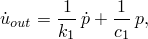

其中


是声学介质表面外向法向方向的声学粒子速度，

*p*

是声学压力，


是声学压力随时间的变化率，


是压力与表面法向位移之间的比例系数，以及


是压力与表面法向速度之间的比例系数。

这个模型可以概念化为一个弹簧和阻尼器串联，放置在声学介质和刚性壁之间。弹簧和阻尼器参数分别为和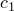，定义为每单位界面面积的值。这些反应性声学边界可以对声学介质中的压力分布产生显著影响，特别是如果选择系数和使边界具有能量吸收特性。如果在声学网格的表面上没有指定阻抗、载荷或流体-固体耦合，则假定该表面的加速度为零。这等同于在该边界处存在刚性壁。

如果使用具有强吸收特性的反应性声学边界，则不建议使用基于子空间的稳态动力学过程。由于特征频率提取步骤中没有考虑的影响，特征模态的形状可能与精确解显著不同。

#### 自由表面晃动

要在重力场中建模自由表面的小幅"晃动"，请设置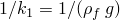和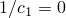，其中是流体密度，*g*是重力加速度（假定指向表面法向）。这个关系适用于小体积拖曳。

#### 声学-结构界面

阻抗边界条件也可以放置在声学-结构界面上。在这种情况下，边界条件可以概念化为一个弹簧和阻尼器串联，放置在声学介质和结构之间。外向速度的表达式仍然成立，其中是边界处声学介质的速度，是声学介质的外向法向。

#### 稳态动力学

在稳态动力学分析中，外向速度的表达式可以写成复数形式

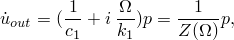

其中是圆频率（弧度/秒），我们定义

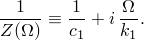

项是边界的复数导纳，是它的复数阻抗。因此，通过指定参数和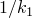，可以为给定频率输入所需的复数阻抗或导纳值。

#### 指定阻抗条件

您可以在阻抗属性表中指定阻抗系数数据。您可以用导纳参数和来描述阻抗表，或者用阻抗的实部和虚部来描述。在后一种情况下，Abaqus将用户定义的阻抗数据表转换为分析用的导纳参数形式。

表中的参数可以在一系列频率上指定。所需的值仅在稳态谐响应分析中从表中插值；对于其他分析类型，仅使用第一个表项。阻抗属性表的名称引用自基于表面或基于单元的阻抗定义。在Abaqus/CAE中，阻抗条件始终基于表面；表面可以定义为几何面和几何边缘的集合，也可以定义为单元面和单元边缘的集合。

在稳态动力学分析中，您不能在施加入射波载荷的表面上指定阻抗条件。

| **输入文件用法：** | 使用以下选项使用导纳参数表指定阻抗（默认）： |
| --- | --- |
| | ``` [*IMPEDANCE PROPERTY*](../key/key-link.md#usb-kws-mimpedanceprop), NAME=*阻抗属性表名称*, DATA=ADMITTANCE ``` 使用以下选项使用阻抗的实部和虚部表指定阻抗： ``` [*IMPEDANCE PROPERTY*](../key/key-link.md#usb-kws-mimpedanceprop), NAME=*阻抗属性表名称*, DATA=IMPEDANCE ``` |

| **Abaqus/CAE用法：** | 使用以下输入使用导纳参数表指定阻抗： |
| --- | --- |
| | 相互作用模块：**创建相互作用属性**：**名称**：*阻抗属性表名称*和**声阻抗**：**数据类型**：**导纳** 使用以下输入使用阻抗的实部和虚部表指定阻抗：相互作用模块：**创建相互作用属性**：**名称**：*阻抗属性表名称*和**声阻抗**：**数据类型**：**阻抗** |

##### 指定基于表面的阻抗条件

您可以在表面上定义阻抗条件。阻抗应用于二维单元边缘和三维单元表面。基于单元的表面（见["基于单元的表面定义，" 第2.3.2节"](pt01ch02s03aus17.md)）包含单元和面信息。

| **输入文件用法：** | ``` [*SIMPEDANCE*](../key/key-link.md#usb-kws-hsimpedance), PROPERTY=*阻抗属性表名称* *表面名称* ``` |
| --- | --- |

| **Abaqus/CAE用法：** | 相互作用模块：**创建相互作用**：**声阻抗**：选择表面：**定义**：**表格**，**声阻抗属性**：*阻抗属性表名称* |
| --- | --- |

##### 指定基于单元的阻抗条件

或者，您可以在单元表面上定义阻抗条件。阻抗应用于二维单元边缘和三维单元表面。放置阻抗的单元边缘或表面由阻抗载荷类型标识，取决于单元类型（见[第六部分，"单元"](pt06.md)"）。

| **输入文件用法：** | ``` [*IMPEDANCE*](../key/key-link.md#usb-kws-himpedance), PROPERTY=*阻抗属性表名称* *单元编号或集名称*, *阻抗载荷类型标签* ``` |
| --- | --- |

| **Abaqus/CAE用法：** | 基于单元的阻抗条件在Abaqus/CAE中不受支持。但是，可以使用基于表面的阻抗条件获得类似功能。 |
| --- | --- |

#### 修改或移除阻抗条件

阻抗条件可以按照["施加载荷：概述，" 第34.4.1节"](pt07ch34s04aus120.md)中所述进行添加、修改或移除。

### 外部问题的辐射边界

通常对在无限大声学介质中振动的结构等外部问题感兴趣。这样的问题可以通过使用声学单元对结构和简单几何表面（位于远离结构的位置）之间的区域进行建模，并在此表面上施加辐射（非反射）边界条件来处理。辐射边界条件是近似的，因此外部声学分析中的误差不仅受通常的有限元离散化误差控制，还受近似辐射条件误差的控制。在Abaqus中，辐射边界条件在它们变得无限远离辐射结构的极限情况下收敛于精确条件。实际上，当表面至少距离结构在最低感兴趣频率的一个半波长时，这些辐射条件提供准确的结果。

除平面波吸收条件且体积拖曳为零的情况外，Abaqus/Standard中的阻抗参数是频率相关的。频率相关参数用于直接解和基于子空间的稳态动力学过程。在直接时间积分过程中，使用常数和的零拖曳值。当拖曳较小时，这些值将给出良好结果。（这里的小体积拖曳意味着，其中是声学介质的密度，是圆激励频率或声波频率。）

如果存在非反射（也称为安静）边界，则直接解稳态动力学过程（["直接解稳态动力学分析，" 第6.3.4节"](pt03ch06s03at09.md)）必须同时包含实部和复数项，因为非反射边界代表系统中的一种阻尼。

几种辐射边界条件被实现为阻抗边界条件的特殊情况。公式的详细信息在["耦合声学-结构介质分析，" Abaqus理论指南第2.9.1节"](../stm/stm-link.md#stm-anl-acouststruct)中给出。

基于单元的阻抗条件在Abaqus/CAE中不受支持。但是，可以使用基于表面的阻抗条件获得类似功能。

#### 平面非反射边界条件

Abaqus中可用的最简单的非反射边界条件假定平面波正入射到外部表面上。这个平面边界条件忽略了边界的曲率以及模拟中的波可能以任意角度撞击边界的可能性。平面非反射条件提供了一个近似：声学波通过这样的边界传输时，只有少量能量反射回声学介质。如果边界远离主要声学扰动且与主波传播方向相当正交，则反射的能量很小。因此，如果要解决外部（无界域）问题，非反射边界应该放置得足够远离声源，使得正入射波的假设足够准确。例如，这个条件将用于消声器的排气端。

| **输入文件用法：** | 使用以下任一选项（默认）： |
| --- | --- |
| | ``` [*SIMPEDANCE*](../key/key-link.md#usb-kws-hsimpedance), NONREFLECTING=PLANAR [*IMPEDANCE*](../key/key-link.md#usb-kws-himpedance), NONREFLECTING=PLANAR ``` |

| **Abaqus/CAE用法：** | 使用以下输入指定基于表面的平面非反射边界条件： |
| --- | --- |
| | 相互作用模块：**创建相互作用**：**声阻抗**：选择表面：**定义**：**非反射**，**非反射类型**：**平面** |

#### 改进的平面波非反射边界条件

为了使平面非反射边界条件准确，平面波必须正入射到平面边界上。然而，入射角通常是预先未知的。Abaqus中提供了对任意入射角的平面波精确的辐射边界条件。辐射边界可以有任意形状。此边界阻抗仅在瞬态动力学中实现。

| **输入文件用法：** | 使用以下任一选项： |
| --- | --- |
| | ``` [*SIMPEDANCE*](../key/key-link.md#usb-kws-hsimpedance), NONREFLECTING=IMPROVED [*IMPEDANCE*](../key/key-link.md#usb-kws-himpedance), NONREFLECTING=IMPROVED ``` |

| **Abaqus/CAE用法：** | 使用以下输入指定基于表面的改进平面非反射边界条件： |
| --- | --- |
| | 相互作用模块：**创建相互作用**：**声阻抗**：选择表面：**定义**：**非反射**，**非反射类型**：**改进平面** |

#### 基于几何形状的非反射边界条件

在Abaqus中实现了四种其他类型的吸收边界条件，考虑辐射边界的几何形状：圆形、球形、椭圆形和长球面。如果非反射表面具有简单的凸形状且靠近声源，这些边界条件比平面非反射条件提供更好的性能。通过定义基于单元或基于表面阻抗描述所需的几何参数来选择各种类型的吸收边界。

几何参数影响非反射表面阻抗。要指定二维圆形或三维直圆柱的非反射边界，必须指定圆的半径。要指定非反射球形边界条件，必须指定球的半径。要指定二维椭圆形或三维直椭圆柱的非反射边界条件，或指定长球面边界条件，必须指定辐射表面的形状、位置和方向。指定表面形状的两个参数是半长轴和离心率。椭圆或长球面的半长轴*a*类似于球的半径：它是表面上任意两点之间连接线段长度的二分之一。半短轴*b*是表面上与半长轴线正交的最长线段长度的二分之一。离心率定义为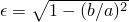。

参见["球体在呼吸模式下的声辐射阻抗，" Abaqus基准指南第1.11.3节](../bmk/bmk-link.md#bmk-anl-acousticimpsphere)和["无限声学介质中的声学-结构相互作用，" Abaqus基准指南第1.11.4节](../bmk/bmk-link.md#bmk-anl-acouststructabsbc)，了解显示这些条件使用的基准问题。

| **输入文件用法：** | 使用以下选项之一： |
| --- | --- |
| | ``` [*SIMPEDANCE*](../key/key-link.md#usb-kws-hsimpedance), NONREFLECTING=CIRCULAR [*SIMPEDANCE*](../key/key-link.md#usb-kws-hsimpedance), NONREFLECTING=SPHERICAL [*SIMPEDANCE*](../key/key-link.md#usb-kws-hsimpedance), NONREFLECTING=ELLIPTICAL [*SIMPEDANCE*](../key/key-link.md#usb-kws-hsimpedance), NONREFLECTING=PROLATE SPHEROIDAL ``` 在每种情况下，[*IMPEDANCE*](../key/key-link.md#usb-kws-himpedance)基于单元的选项可以用来替代[*SIMPEDANCE*](../key/key-link.md#usb-kws-hsimpedance)。 |

| **Abaqus/CAE用法：** | 使用以下输入指定基于表面的几何非反射边界条件： |
| --- | --- |
| | 相互作用模块：**创建相互作用**：**声阻抗**：选择表面：**定义**：**非反射**，**非反射类型**：**圆形**、**球形**、**椭圆形**或**长球面** |

##### 在同一问题中组合不同的辐射条件

由于不同形状的辐射边界条件在空间上是局部的，不涉及无限外部域的离散化，外部边界可以由几种形状的组合组成。然后可以将适当的边界条件应用到边界的每个部分。例如，圆柱可以用半球终止（见["消声器的完全和顺序耦合声学-结构分析，" Abaqus例题问题指南第9.1.1节](../exa/exa-link.md#exa-aco-muffler)），或者椭圆柱可以用长球面半体终止。如果表面之间的边界在斜率和位移上都是连续的，则这种建模技术最有效，尽管这不是必需的。

### 集中压力共轭载荷

声学单元上的分布"载荷"可以解释为每单位密度的法向压力梯度（单位质量的力或加速度的量纲）。在Abaqus中使用时，施加的分布载荷必须在表面面积上积分，得到具有单位质量力乘面积（体积加速度）量纲的量。对于频域分析和体积拖曳为零的瞬态动力学分析，此声学载荷等于边界上流体的体积加速度。例如，水平扁平刚性板垂直振荡会对声学流体施加加速度，声学"载荷"等于此加速度乘以板的表面积。然而，对于存在体积拖曳的瞬态动力学公式，规定的"载荷"略有不同。它也是单位质量的力乘面积；但这个力效应部分损失到体积拖曳，因此边界上流体的体积加速度减小。注意到体积拖曳和瞬态动力学的特殊情况，通常将声学"载荷"称为体积加速度还是方便的。

可以通过在位于声学介质边界的声学单元节点上对自由度8施加正集中载荷来施加内向体积加速度。在Abaqus/Standard中，您可以指定载荷的同相（实）部分（默认）和异相（虚）部分。在声学单元表面上，应将内向粒子加速度（瞬态动力学中单位质量的力）聚集到代表表面上内向体积加速度的节点集中载荷，方式与将表面上的压力聚集到应力/位移单元上的节点力相同。

| **输入文件用法：** | 使用以下选项定义载荷的实部： |
| --- | --- |
| | ``` [*CLOAD*](../key/key-link.md#usb-kws-hcload), REAL ``` 使用以下选项定义载荷的虚部： ``` [*CLOAD*](../key/key-link.md#usb-kws-hcload), IMAGINARY ``` |

| **Abaqus/CAE用法：** | 载荷模块：**创建载荷**：为**类别**选择**声学**，为**所选步的类型**选择**内向体积加速度** |
| --- | --- |

### 由外部源引起的入射波载荷

Abaqus提供了一种用于外部波源载荷的分布载荷类型。可以定义单个球形单极子或单个或弥散平面源，使感兴趣的流体和固体区域受到入射波场的作用。由爆炸或声源产生的波从声源传播，撞击并越过结构，在结构表面产生随时间和空间变化的载荷。在流体中，压力场受到结构反射和发射以及声源本身入射场的影响。声学和/或固体网格上的入射波载荷取决于源节点的位置、传播流体的属性以及在参考（" standoff"）节点上指定的时间历史或频率依赖性，如图34.4.6-1所示。

**图34.4.6-1** 入射波载荷模型。

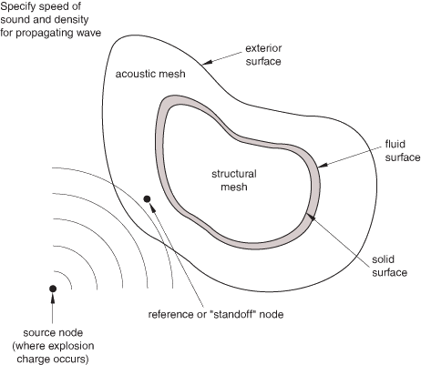

在Abaqus中，入射波载荷可以使用几种不同的建模方法，需要不同的方法来施加入射波载荷。对于仅涉及固体和结构元素的问题（例如，入射波场是由于空气中的波），波载荷大致像分布表面载荷一样施加。这可能适用于分析车辆或建筑物上的空气冲击载荷（见["示例：结构上的空气冲击载荷"](pt07ch34s04aus125.md#usb-prc-pacoustic-incidentwave-airblast)，如图34.4.6-6所示）。在Abaqus/Explicit中，CONWEP模型可用于对固体和结构元件进行空气冲击载荷施加，无需对流体介质进行建模。["CONWEP冲击载荷下夹层板的变形，" Abaqus例题问题指南第9.1.9节](../exa/exa-link.md#exa-aco-conwepsandwichplate)是冲击载荷问题的一个示例。

入射波载荷（CONWEP载荷除外）也可以施加到梁结构上；这是船舶鞭击分析和受冲击载荷的钢结构建筑分析的常用建模方法。入射波载荷可以施加在二维或三维梁单元上定义的表面上。但是，入射波载荷仅能施加在三维梁上用于定义了梁流体惯性的瞬态动力学分析。入射波载荷不能在框架单元、线弹簧单元、三维开截面梁单元或三维欧拉-伯努利梁上定义。

在水下爆炸分析中（例如，受到水下爆炸载荷作用的船舶或潜水器，如图34.4.6-4和图34.4.6-5所示），流体也使用有限元模型进行离散化，以捕捉流体刚度和惯性的影响。对于同时涉及固体和声学元素的问题，声学压力场存在两种公式。第一种，声学单元可用于对介质中的总压力进行建模，包括入射场和整个系统响应的影响。第二种，声学单元仅用于对介质对波载荷的响应进行建模，而不是波脉冲本身。前者将被称为"总波"公式，后者称为"散射波"公式。

入射波相互作用也用于对结构或声域上的声场进行建模。结构散射的声场或通过结构传输的声音可能是令人感兴趣的。通常，使用散射公式和稳态动力学过程来建模声音散射和传输问题。瞬态过程也可以使用，方式类似于水下爆炸分析问题。

#### 散射波和总波公式

总波公式和散射波公式之间的区别仅在施加入射波载荷时才相关。总波公式比散射波公式更类似于结构载荷：声学介质的边界被指定为加载表面，并施加随时间变化的载荷，在声学介质中产生响应。此响应等于声学介质中的总声压。散射波公式利用了声学介质是线性的这一事实，介质中的响应可以分解为入射波和散射场的和。当声学介质可能因流体空化而变得非线性时，必须使用总波公式（见["入射膨胀波场的载荷，" Abaqus理论指南第6.3.1节"](../stm/stm-link.md#stm-ldc-undexloads)）。

[表34.4.6-1](pt07ch34s04aus125.md#pacoustic-supported)描述了每种公式支持的过程类型。

**表34.4.6-1** 散射波和总波公式支持的过程。

| 过程 | 散射 | 总波 |
| --- | --- | --- |
| 稳态动力学 | 是 | 否 |
| 瞬态 | 是 | 是 |

##### 散射波公式

当流体的力学行为可以描述为线性时，观察到的总声压可以分解为两个分量：已知的入射波和由入射波与结构和/或流体边界相互作用产生的"散射"波。当这种叠加适用时，直接求解"散射"波场是常见做法。使用散射波公式时，声学节点上的压力被定义为总压力的仅散射部分。在这种情况下，声学-结构界面上的声学和固体表面都应该加载。

在稳态动力学过程中使用入射波载荷时，必须使用散射波公式。

| **输入文件用法：** | 使用以下选项指定散射波公式（默认）： |
| --- | --- |
| | ``` [*ACOUSTIC WAVE FORMULATION*](../key/key-link.md#usb-kws-macousticwaveform), TYPE=SCATTERED WAVE ``` |

| **Abaqus/CAE用法：** | 任何模块：**模型****编辑属性*****模型名称***。切换**指定声波公式**：选择**散射波** |
| --- | --- |

##### 总波公式

总波公式（见["耦合声学-结构介质分析，" Abaqus理论指南第2.9.1节"](../stm/stm-link.md#stm-anl-acouststruct)）特别适用于声学介质可能发生空化，使流体力学行为变为非线性的情况。当问题包含曲线边界或有限范围边界且规定压力历史时，也应该使用它。在这种情况下，只有外部声学表面应该用入射波加载，声源必须位于流体模型外部。外部声学边界上可能存在的任何阻抗或非反射条件仅适用于声学解的不包括规定入射波场的部分（即，只有散射场受非反射条件约束）。因此，施加的入射波载荷将进入问题域，不受外部声学表面上非反射条件的影响。

在总波公式中，声学压力自由度代表总动态声压，包括入射波和散射波的贡献，在Abaqus/Explicit中还包括流体空化的动态效应。压力自由度不包括声学静压力，后者可以指定为初始条件（见["在Abaqus/Standard和Abaqus/Explicit中定义初始声学静压力" in "Abaqus/Standard和Abaqus/Explicit中的初始条件，" 第34.2.1节"](pt07ch34s02aus116.md#usb-prc-pinitialcond-acousticstaticpressure)）。此声学静压力仅用于确定声学单元节点的空化状态，不会在它们共同的润湿界面处对声学或结构网格施加任何静态载荷。它不适用于使用Abaqus/Standard的分析。

| **输入文件用法：** | 使用以下选项指定总波公式： |
| --- | --- |
| | ``` [*ACOUSTIC WAVE FORMULATION*](../key/key-link.md#usb-kws-macousticwaveform), TYPE=TOTAL WAVE ``` |

| **Abaqus/CAE用法：** | 任何模块：**模型****编辑属性*****模型名称***。切换**指定声波公式**：选择**总波** |
| --- | --- |

#### 声学场的初始化

对于瞬态动力学，当总波公式与位于声学有限元域内部的入射波standoff点一起使用时，声学解初始化为入射波的值。这在分析的第一个直接积分动力学步开始时自动执行，仅针对基于压力的入射波幅值定义；在重启分析中，步从初始分析的开始计数。这种初始化不仅节省计算时间，而且施加的入射波载荷没有明显的数值耗散或畸变。在初始化阶段，考虑第一个动力学分析步中的所有入射波载荷定义，所有声学单元节点初始化为零时刻的入射波场。用不同源位置指定的入射波载荷被计为声学节点初始化的单独载荷定义。在初始化阶段也会考虑入射波载荷的任何反射。

#### 描述入射波载荷

要使用入射波载荷，必须定义以下内容：
- 建立入射波方向和其他属性的信息；
- 在某个参考（"standoff"）点处声源脉冲的时间历史或频率依赖性；
- 要加载的流体和/或固体表面；和
- 问题域外部的任何反射平面，如水下爆炸研究中的海床，它将入射波反射到问题域上。

在Abaqus中有两个接口可用于施加入射波载荷：一个在Abaqus/CAE中支持的首选接口，以及一个在先前版本中可用但在Abaqus/CAE中不支持的替代接口。首选接口在概念上与替代接口相同，使用基本相同的数据。首选接口选项包括"相互作用"一词，以区别于替代接口的入射波和入射波属性选项。除非另有说明，本节中的讨论适用于两个接口。首选接口的用法包含在讨论中；替代接口的用法在下面的["替代入射波载荷接口"](pt07ch34s04aus125.md#usb-prc-pacoustic-incidentwave-alt)中描述。参阅本节末尾讨论的示例问题，了解使用首选接口指定入射波载荷的方式。

##### 规定几何属性和入射波速度

您必须为每个规定的入射波引用属性定义。Abaqus中的入射波载荷可以是平面波、球面波或弥散场。您可以在入射波属性定义中选择平面入射波（默认）、球面入射波或弥散场。

平面入射波在空间中传播时保持恒定幅值；因此，传播速度和方向是定义的关键参数。速度在入射波相互作用属性定义中定义，方向由您作为入射波相互作用的一部分定义的源点和standoff点位置确定。

对于球面入射波定义，波的幅值随空间衰减。默认情况下，球面波的幅值与到源的距离成反比；这种行为称为"声学"传播。对于首选接口，您可以修改默认传播行为来定义入射波场的空间衰减。 dimensionless常数、和用于定义空间衰减，作为源点到加载点之间的距离以及源点到standoff点之间的距离的函数：


有关广义空间衰减公式的详细信息，请参阅["入射膨胀波场的载荷，" Abaqus理论指南第6.3.1节"](../stm/stm-link.md#stm-ldc-undexloads)。

在Abaqus中，入射波相互作用可用于模拟弥放入射场。弥放场的特征是在混响空间或其他情况下，来自许多方向的波撞击表面。例如，混响室在声学测试设施中故意建造，用于声音传输损耗测量。Abaqus中使用的弥放场模型如图34.4.6-2所示，允许您指定种子数个确定性入射平面波沿分布在一个半球上的矢量传播，使得每单位立体角的入射功率近似于弥放入射场。

**图34.4.6-2** 弥放载荷模型。

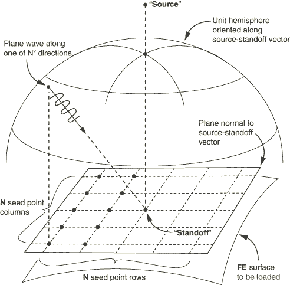

入射载荷作用的流体和固体表面在入射波载荷定义中指定。传入波载荷进一步由其源点和参考（"standoff"）点位置描述，在该点指定波幅值。有关如何指定这些表面和standoff点的信息，请参阅下面的["识别入射波载荷的流体和固体表面"](pt07ch34s04aus125.md#usb-prc-pacoustic-incidentwave-surfaces)"和["standoff点"](pt07ch34s04aus125.md#usb-prc-pacoustic-incidentwave-standoff)。对于平面波，指定的源点和standoff点位置用于定义波传播方向。

入射波的速度通过为承载入射波的声学介质提供属性来规定。这些指定属性应与用声学单元离散的流体属性一致。

对于首选接口，您必须为入射波定义源点和standoff点对应的节点；必须为每个入射波定义指定节点编号或集名称。节点集名称（如果使用）必须仅包含一个节点。源节点和standoff节点都不应连接到模型中的任何单元。

| **输入文件用法：** | ``` [*INCIDENT WAVE INTERACTION PROPERTY*](../key/key-link.md#usb-kws-mincidentwaveinteractionproperty), NAME=*波属性名称*, TYPE=PLANE或SPHERE *声速, 流体质量密度, A, B, C* [*INCIDENT WAVE INTERACTION*](../key/key-link.md#usb-kws-hincidentwaveinteraction), PROPERTY=*波属性名称* *流体表面名称*, *源节点*, *standoff节点*, *参考幅值* ``` |
| --- | --- |
| | 常数*A*、*B*和*C*仅适用于具有广义空间衰减传播的球面入射波。 ``` [*INCIDENT WAVE INTERACTION PROPERTY*](../key/key-link.md#usb-kws-mincidentwaveinteractionproperty), NAME=*波属性名称*, TYPE=DIFFUSE *声速, 流体质量密度* [*INCIDENT WAVE INTERACTION*](../key/key-link.md#usb-kws-hincidentwaveinteraction), PROPERTY=*波属性名称* *流体表面名称*, *源节点*, *standoff节点*, *参考幅值, N* ``` 种子数*N*生成以standoff点为中心的半球上分布方向的入射平面波。 |

| **Abaqus/CAE用法：** | 相互作用模块：**创建相互作用属性**：**名称**：*波属性名称*和**入射波**，**流体中的声速**：*声速*，**流体密度**：*流体质量密度* |
| --- | --- |
| | 选择以下定义之一：**定义**：**平面** **定义**：**球面**，**传播模型**：**声学** **定义**：**球面**，**传播模型**：**广义衰减**，输入**A**、**B**和**C**的值 **定义**：**弥放**，**种子数**：*N* **创建相互作用**：**入射波**：选择源点，选择standoff点，选择区域：**波属性**：*波属性名称*，**参考幅值**：*参考幅值* |

##### 识别入射波载荷的流体和固体表面

在散射波公式中，入射波载荷必须在所有反射入射波的流体和固体表面上规定，但有两个例外：
- 直接使用边界条件规定压力值的流体表面；和
- 具有对称条件的流体表面（对称必须对载荷和几何都成立）。

在流体-固体界面问题中，两个表面都必须在散射公式的入射波载荷定义中指定。见["示例：靠近自由表面的潜艇"](pt07ch34s04aus125.md#usb-prc-pacoustic-incidentwave-subfreesurface)，如图34.4.6-4所示。

当指定了基于总压力的公式时，入射波载荷仅需规定在与排除在模型之外的无限区域接壤的流体表面上。通常，这些表面规定有非反射辐射条件，实现确保辐射条件仅在建模域的散射响应上强制执行，而不是在入射波本身。见["示例：靠近自由表面的潜艇"](pt07ch34s04aus125.md#usb-prc-pacoustic-incidentwave-subfreesurface)和["示例：水面船"](pt07ch34s04aus125.md#usb-prc-pacoustic-incidentwave-surfaceship)，分别如图34.4.6-4和图34.4.6-5所示。

在某些问题中，例如空气中的冲击载荷，您可能决定需要建模结构上的冲击波载荷，但周围流体介质本身不需要。在这些问题中，入射波载荷仅规定在固体表面上，因为流体介质未被建模。在这些问题中，散射波公式和总波公式之间处理入射波载荷的区别不相关，因为对流体介质中的波传播不感兴趣。

##### standoff点

在瞬态分析中，standoff点是一个参考点，用于指定脉冲载荷时间历史：它是假定用户定义的脉冲历史适用且没有时间延迟、相移或扩展损失的点。在使用离散平面或球面源的稳态分析中，standoff点是入射场具有零相位的点。

在瞬态分析中，应定义standoff点，使其比模型中会反射入射波的任何表面上的点更靠近源。这样做可以确保所有这些表面上的点都将用源指定的时间历史加载，且分析在波超过任何这些表面部分之前开始。为了节省分析时间，standoff点通常位于入射波首先偏转的固体表面或附近（见["示例：靠近自由表面的潜艇"](pt07ch34s04aus125.md#usb-prc-pacoustic-incidentwave-subfreesurface)，如图34.4.6-4所示）。但是，standoff点是分析中的一个固定点：如果加载表面在入射波载荷开始之前由于先前的分析步或几何调整而移动，表面可能会包围指定的standoff点。应注意定义一个standoff点，使其在载荷开始时保持比任何加载表面上的点更靠近入射波源点。

当使用总波公式且入射波载荷在第一步中以压力历史的形式规定时，Abaqus自动将声学节点处的压力和压力速率初始化为基于入射波载荷的值。这允许声学分析在零时刻使入射波部分传播到问题域中开始，并假定这种传播以可忽略的任何体积耗散源（如流体拖曳）的影响进行。当以压力值形式规定入射波载荷时，上面给出的选择standoff点的建议对总波公式也有效。但是，当以加速度值形式规定入射波载荷时，不执行自动初始化，standoff点应位于模型外部流体边界附近，使得standoff点比外部边界上的任何点更靠近源。见["示例：靠近自由表面的潜艇"](pt07ch34s04aus125.md#usb-prc-pacoustic-incidentwave-subfreesurface)和["示例：水面船"](pt07ch34s04aus125.md#usb-prc-pacoustic-incidentwave-surfaceship)，分别如图34.4.6-4和图34.4.6-5所示。

在稳态分析中，standoff点的角色有些不同。当入射波相互作用属性为平面或球面类型时，您在standoff点定义幅值的实部和虚部。分别地，指定的实部和虚部入射波在standoff点被认为具有零相位（结合，这两个波可能等价于在standoff点具有非零相位的单个波）。加载表面上的每个位置都有施加压力或声学牵引的相移，对应于加载点与standoff点之间的传播时间差异。这意味着例如，在standoff点具有纯实值的入射波在加载表面上所有其他点产生实部和虚部牵引。

当入射波为弥放类型时，standoff点和源点的角色主要是将加载表面相对于传入混响场的方向定位。用于弥放入射波载荷的模型应用一组确定性地定义为平面波的集合，其方向定义为连接standoff点和位于半球上一系列点的矢量。该半球以standoff点为中心，其顶点是源点。该系列点根据指定种子和在半球上排列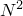个点的确定性算法设置。该算法集中这些点，使得弥放场模型中的入射波集中在正入射处，倾斜角度的波较少。指定的幅值和参考幅值在个入射波之间平均分配。弥放模型中入射波所在的半球的方向对所有加载表面上的点是相同的——它不随表面上的局部法向矢量变化。

##### 定义源脉冲的幅值

对于瞬态分析，用户指定的时间历史是在standoff点观察到的：加载表面上一点的历史根据波类型和该点相对于standoff点的位置计算。声源脉冲的时间历史可以以流体压力值或流体粒子加速度值的形式定义。压力时间历史可用于任何类型的单元，如声学单元、结构单元或固体单元；加速度时间历史仅适用于声学单元。在任何一种情况下，都为任何给定的入射波加载表面指定参考幅值，并指定由幅值曲线定义的时间历史数据表的引用。参考幅值随幅值定义随时间变化。

对于稳态动力学分析，作为入射波相互作用定义的一部分规定的幅值定义被解释为在standoff点处波的频率依赖性。

目前，以流体粒子加速度历史形式描述的源脉冲仅限于在瞬态分析中作用在流体表面上的平面入射波。此外，如果在同一个流体表面上与入射波载荷一起规定了阻抗条件，则源脉冲限于压力历史类型，即使对于平面入射波。以压力历史形式表示的源脉冲没有这些限制；即，基于压力历史的入射波载荷可用于流体或固体表面，有或没有阻抗，可用于平面和球面入射波。

当使用压力值指定源脉冲并应用于流体表面时，压力梯度被计算并作为这些表面上的压力共轭载荷施加。因此，希望将脉冲幅值定义为从零开始，特别是当关注流体中的空化时。如果结构响应是主要关注点且正在使用散射公式，则可以在绑定到声学网格的结构节点上施加额外的集中载荷来应对压力幅值的初始跳跃，对应于入射波压力幅值的初始跳跃。显然，任何给定结构节点上的额外载荷应从入射波首次到达该结构节点的实例起生效。但是，流体中的散射波解仍需要仔细解释考虑初始跳跃。

| **输入文件用法：** | 使用以下选项以流体压力值的形式定义时间历史： |
| --- | --- |
| | ``` [*INCIDENT WAVE INTERACTION*](../key/key-link.md#usb-kws-hincidentwaveinteraction), PRESSURE AMPLITUDE=*幅值数据表名称* *固体或流体表面名称*, *源节点*, *standoff节点*, *参考幅值* ``` 使用以下选项以流体粒子加速度值的形式定义时间历史： ``` [*INCIDENT WAVE INTERACTION*](../key/key-link.md#usb-kws-hincidentwaveinteraction), ACCELERATION AMPLITUDE=*幅值数据表名称* *流体表面名称*, *源节点*, *standoff节点*, *参考幅值* ``` 使用以下选项定义载荷的实部（默认）： ``` [*INCIDENT WAVE INTERACTION*](../key/key-link.md#usb-kws-hincidentwaveinteraction), REAL ``` 使用以下选项定义载荷的虚部： ``` [*INCIDENT WAVE INTERACTION*](../key/key-link.md#usb-kws-hincidentwaveinteraction), IMAGINARY ``` |

| **Abaqus/CAE用法：** | 相互作用模块：**创建相互作用**：**入射波**：选择源点，选择standoff点，选择区域：**参考幅值**：*参考幅值* |
| --- | --- |
| | 使用以下选项以流体压力值或流体粒子加速度值的形式定义时间历史：**定义**：**压力**或**加速度**，**压力幅值**或**加速度幅值**：*幅值数据表名称* 使用以下选项定义载荷的实部或虚部：切换**实幅值**和/或**虚幅值**：*幅值数据表名称* |

##### 为球面入射波载荷定义气泡载荷

水下爆炸形成高度压缩的气泡，与周围水相互作用，产生向外传播的冲击波。气泡在上浮时产生这些波，改变源和加载表面的相对位置。气泡形成的载荷效应可以通过将气泡定义与入射波载荷定义结合使用来为球面入射波载荷定义。

气泡动力学可以使用Abaqus内部的模型或使用表格数据来描述。Abaqus有一个气泡与周围流体相互作用的内置机械模型，通过数值模拟生成一组数据，然后进行有限元分析。您可以指定炸药材料参数、结束时间以及其他影响所用气泡幅值曲线计算的参数，如[表34.4.6-2](pt07ch34s04aus125.md#bubble-param)所示。

**表34.4.6-2** 定义气泡行为的参数。
| 名称 | 量纲 | 描述 | 默认 |
| --- | --- | --- | --- |
|  | [FL2(LM1/3)1+A](../popups/usb-int-iconventions-unitsym.md) | 炸药常数 | 无 |
|  | [T/(M](../popups/usb-int-iconventions-unitsym.md)[LB)](../popups/usb-int-iconventions-unitsym.md) | 炸药常数 | 无 |
|  | 无量纲 | 相似空间指数 | 无 |
|  | 无量纲 | 相似时间指数 | 无 |
|  | [F/L2](../popups/usb-int-iconventions-unitsym.md) | 炸药常数 | 无 |
|  | 无量纲 | 爆炸气体比热比 | 无 |
|  | [M/L3](../popups/usb-int-iconventions-unitsym.md) | 炸药材料密度 | 无 |
|  | [M](../popups/usb-int-iconventions-unitsym.md) | 炸药质量 | 无 |
| 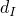 | [L](../popups/usb-int-iconventions-unitsym.md) | 初始炸药深度 | 无 |
| 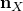 | 无量纲 | 自由表面法向的*X*方向余弦 | 无 |
|  | 无量纲 | 自由表面法向的*Y*方向余弦 | 无 |
| 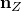 | 无量纲 | 自由表面法向的*Z*方向余弦 | 无 |
| 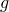 | [L/T2](../popups/usb-int-iconventions-unitsym.md) | 重力加速度 | 无 |
|  | [F/L2](../popups/usb-int-iconventions-unitsym.md) | 自由表面大气压力 | 无 |
|  | 无量纲 | 波浪效应参数 | 1.0 |
|  | 无量纲 | 气泡拖曳系数 | 0.0 |
| 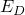 | 无量纲 | 气泡拖曳指数 | 2.0 |
|  | [T](../popups/usb-int-iconventions-unitsym.md) | 气泡模拟中最大允许时间 | 无 |
| 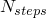 | 无量纲 | 气泡模拟中最大允许步数 | 1500 |
| 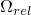 | 无量纲 | 气泡模拟相对误差容限参数 | 1×10^11 |
|  | 无量纲 | 气泡模拟绝对误差容限参数 | 1×10^11 |
|  | 无量纲 | 气泡模拟误差控制指数 | 0.2 |
|  | [M/L3](../popups/usb-int-iconventions-unitsym.md) | 流体质量密度 | 无 |
|  | [L/T](../popups/usb-int-iconventions-unitsym.md) | 流体声速 | 无 |

所有指定参数仅影响气泡幅值；问题中的其他物理参数是独立的。如果需要，您可以抑制气泡动力学中的波浪损失效应并引入经验流动拖曳。气泡机械模型的详细信息在["入射膨胀波场的载荷，" Abaqus理论指南第6.3.1节"](../stm/stm-link.md#stm-ldc-undexloads)中给出。

在水下爆炸事件中，气泡向上迁移朝向自由水面，并可能到达自由水面。如果气泡迁移在指定分析时间内到达自由水面，Abaqus在此点之后施加零幅值的载荷。

关于气泡模拟的模型数据写入数据（`.dat`）文件。在Abaqus/Standard分析期间，历史数据在每个增量写入输出数据库（`.odb`）文件。历史数据包括气泡半径和气泡在自由水面下的深度。作为参考，压力和声学载荷量也在数据文件中写入standoff点；这些载荷项包括直接平面波项和球面扩展（" afterflow"）效应（见["入射膨胀波场的载荷，" Abaqus理论指南第6.3.1节"](../stm/stm-link.md#stm-ldc-undexloads))。

对于首选接口，气泡形成的载荷效应可以通过使用UNDEX炸药属性定义来为球面入射波载荷定义。由于气泡模拟使用球面对称，入射波相互作用属性必须定义球面波。

| **输入文件用法：** | 使用以下选项使用UNDEX炸药属性定义指定气泡形成的载荷效应： |
| --- | --- |
| | ``` [*INCIDENT WAVE INTERACTION PROPERTY*](../key/key-link.md#usb-kws-mincidentwaveinteractionproperty), NAME=*波属性名称*, TYPE=SPHERE [*UNDEX CHARGE PROPERTY*](../key/key-link.md#usb-kws-mundexchargeproperty) *定义UNDEX炸药的数据* [*INCIDENT WAVE INTERACTION*](../key/key-link.md#usb-kws-hincidentwaveinteraction), PROPERTY=*波属性名称*, UNDEX *流体表面名称*, *源节点*, *standoff节点*, *参考幅值* ``` |

| **Abaqus/CAE用法：** | 使用以下输入使用UNDEX炸药属性定义指定气泡形成的载荷效应： |
| --- | --- |
| | 相互作用模块：**创建相互作用属性**：**名称**：*波属性名称*和**入射波**：**定义**：**球面**，**传播模型**：**UNDEX炸药**，输入定义UNDEX炸药的数据 **创建相互作用**：**入射波**：**定义**：**UNDEX**，**波属性**：*波属性名称*，输入定义UNDEX炸药的数据 使用以下输入使用表格数据在standoff点指定压力：载荷或相互作用模块：**创建幅值**：**名称**：*压力*并选择**表格** 相互作用模块：**创建相互作用**：**入射波**：选择standoff点：**定义**：**压力**，**压力幅值**：*压力* 使用以下输入使用表格数据指定源节点位置时间历史：载荷或相互作用模块：**创建幅值**：**名称**：*名称*并选择**表格** 载荷模块：**创建边界条件**：选择步：**位移/旋转**或**速度/角速度**：选择源节点作为区域并切换自由度，**幅值**：*名称* |

##### 对移动结构建模入射波载荷

要使用首选接口对分析期间结构（如船舶）与波源之间的相对运动效应建模，可以为源节点分配速度。假定整个流体-固体模型在载荷期间以相对于源节点的速度移动，且模型运动的速度相对于入射波传播速度较低。也就是说，在载荷计算中忽略了源的速度效应，但包含了源位置的变化。这等价于假定源和模型之间的相对运动处于低马赫数。相对运动仅能为瞬态分析指定。

除了在源节点上规定边界条件外，还必须在源节点上定义一个小质量单元。

| **输入文件用法：** | 使用以下选项为源节点分配速度： |
| --- | --- |
| | ``` [*BOUNDARY*](../key/key-link.md#usb-kws-hboundary), TYPE=DISPLACEMENT或VELOCITY, AMPLITUDE=*名称* *源节点*, *自由度* ``` |

| **Abaqus/CAE用法：** | 载荷模块：**创建边界条件**：选择步：**速度/角速度**或**位移/旋转**：选择区域并切换自由度，**幅值**：*名称* |
| --- | --- |

##### 指定反射效应

从源发出的波可能在到达指定standoff点之前从平面表面（如海床或海面）反射。因此，入射波载荷包括来自源的直接路径的波以及从平面反射的波。在Abaqus中，可以定义任意数量的这些平面，每个平面具有自己的位置、方向和反射系数。

如果未指定反射系数，则假定平面是非反射的；施加零反射压力。如果指定了反射系数，反射波的幅度根据公式用反射系数修改：

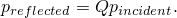

仅使用的实值。

反射平面仅允许用于以流体压力值定义的入射波。每个平面只考虑一次反射。如果多次连续反射的效应很重要，这些表面应该是有限元模型的一部分。如果使用总波公式，不应在有限元模型边界处使用反射平面，因为在这种情况下入射波会自动被该边界反射。

| **输入文件用法：** | 使用以下选项与[*INCIDENT WAVE INTERACTION*](../key/key-link.md#usb-kws-hincidentwaveinteraction)选项结合来定义入射波反射平面： |
| --- | --- |
| | ``` [*INCIDENT WAVE REFLECTION*](../key/key-link.md#usb-kws-hincidentwavereflection) ``` |

| **Abaqus/CAE用法：** | 在Abaqus/CAE中不支持入射波反射。 |
| --- | --- |

##### 规定压力的边界

声学单元节点处的声学压力自由度可以使用边界条件来规定。然而，由于在Abaqus分析中可以使用节点声学压力来指代该点的总压力或仅指散射分量，在某些情况下需要谨慎。

当使用总波公式时，单独的边界条件足以在边界上规定规定的总动态压力。

在没有入射波载荷的分析中，节点自由度通常等于该点的总声压。因此，其值可以以与其他Abaqus边界条件一致的方式使用边界条件来规定。例如，您可以将管道入口处所有节点处的声学压力设置为规定的幅值，以分析沿管道传播的波。水体的自由表面可以通过将表面处的声学压力设置为零来建模。

当使用入射波载荷时，散射波公式将节点声学自由度定义为等于散射压力。因此，该自由度的边界条件定义仅影响散射压力。在此公式中，节点处的总声压不能直接访问。在某些情况下仍需要规定总压力（例如，当建模水体的自由表面时）。在这种情况下，应使用以下方法之一。

如果具有规定总压力的流体表面是平面的、未断裂的和无限延伸的，则可以将入射波反射平面和边界条件一起使用来建模总压力在自由表面上为零的事实。与自由表面重合的"软"入射波反射平面将确保结构受到从自由表面反射的入射波载荷。将表面处的声学压力设置为零的边界条件将确保由结构发出的任何散射波被正确反射。流体中的散射波解必须考虑入射场现在包括源的反射以及这一事实来解释。如果具有规定总压力的流体表面是平面的但被物体（如浮船）断裂，这种建模技术仍然可以应用。然而，由于反射平面穿过船体，入射波的反射载荷被计算为此近似忽略了一些衍射效应，可能适用于也可能不适用于所有感兴趣的情况。

或者，流体的自由表面条件可以通过使用结构单元（如膜单元）而非声学单元对流体顶层建模来消除。然后使用基于表面的网格绑定约束（["网格绑定约束，" 第35.3.1节"](pt08ch35s03aus132.md)）或（在Abaqus/Standard中）声学-结构界面单元将"结构流体"表面和"声学流体"表面耦合；入射波载荷必须同时施加在"结构流体"和"声学流体"表面上。"结构流体"单元的材料属性应与相邻声学流体类似。在Abaqus/Explicit中，"结构流体"单元的厚度必须使得耦合约束两侧节点处的质量几乎相等。这种建模技术允许规定总压力的表面几何形状偏离未断裂的无限平面。作为这种技术的次要好处，您可以获得自由表面上的速度剖面，因为位移自由度现在在"结构流体"节点上被激活。如果需要非零压力边界条件，可以作为分布载荷施加在"结构流体"单元的另一侧。

| **输入文件用法：** | 使用以下选项与默认散射波公式一起用于第一种建模技术： |
| --- | --- |
| | ``` [*BOUNDARY*](../key/key-link.md#usb-kws-hboundary) [*INCIDENT WAVE REFLECTION*](../key/key-link.md#usb-kws-hincidentwavereflection) ``` 使用以下选项与默认散射波公式一起用于第二种建模技术： ``` [*TIE*](../key/key-link.md#usb-kws-mtie) [*INCIDENT WAVE INTERACTION*](../key/key-link.md#usb-kws-hincidentwaveinteraction) ``` 使用以下选项与总波公式一起： ``` [*BOUNDARY*](../key/key-link.md#usb-kws-hboundary) ``` |

| **Abaqus/CAE用法：** | 载荷模块：**创建BC**：为**类别**选择**其他**，为**所选步的类型**选择**声学压力** |
| --- | --- |

##### 在Abaqus/Explicit中使用CONWEP模型定义入射冲击波的空气冲击载荷

空气中的爆炸形成与周围空气相互作用的高度压缩气体，产生向外传播的冲击波。空气爆炸的载荷效应可以通过CONWEP模型凭借入射波载荷定义来为球面入射波（空气爆炸）或半球面入射波（表面爆炸）定义。

与声波不同，冲击波对应于压力、密度等在波前具有不连续性的冲击波。图34.4.6-3显示了一个典型冲击波压力历史。

**图34.4.6-3** 冲击波压力历史。


CONWEP模型使用基于爆炸源距离和引爆量的比例距离。对于给定的比例距离，模型提供以下经验数据：最大超压（高于大气压）、到达时间、正相位持续时间以及入射压力和反射压力的指数衰减系数。使用这些参数，可以构建如图34.4.6-3所示的入射压力和反射压力的整个时间历史。不需要使用standoff点。

由于冲击波导致的表面上的总压力是入射压力、反射压力和入射角的函数，入射角定义为加载表面法向与从表面指向爆炸源的矢量之间的角度。总压力定义为


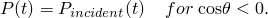

可以用幅值比例因子缩放由总压力引起的空气冲击载荷。

如果爆炸不在分析开始时发生，可以指定引爆时间。引爆时间需要以总时间给出；详见["约定，" 第1.2.2节"](pt01ch01s02aus02.md)中时间约定的描述。位置处的到达时间定义为波到达该位置后经过的时间。

CONWEP经验数据以特定单位给出，必须转换为分析中使用的单位。您需要指定将这些单位转换为SI单位的乘数。对于TNT当量中爆炸物质质量的指定，您可以选择任何方便的质量单位，可以与分析中使用的质量单位不同。对于压力载荷计算，您需要指定将分析中使用的长度、时间和压力单位转换为SI单位的乘数。[表34.4.6-3](pt07ch34s04aus125.md#conversion-multipliers)中给出了一些典型的转换乘数值。

**表34.4.6-3** 与CONWEP模型结合使用的SI单位转换乘数。
| 量 | 单位 | SI单位 | 转换为SI的乘数 |
| --- | --- | --- | --- |
| 质量 | ton | kg | 1000 |
| 质量 | lb | kg | 0.45359 |
| 长度 | mm | m | 0.001 |
| 长度 | ft | m | 0.3048 |
| 时间 | msec | sec | 0.001 |
| 压力 | MPa | Pa | 10^6 |
| 压力 | psi | Pa | 6894.8 |
| 压力 | psf | Pa | 47.88 |

对于任何给定量的炸药，CONWEP经验数据仅在距源的一定距离范围内有效。数据有效的最小距离对应于炸药半径。因此，如果加载表面任何部分距源的距离小于炸药半径，分析终止。对于大于最大有效范围的距离，使用线性插值直到扩展最大范围，此时反射压力降至零。超过扩展最大范围不施加载荷。

CONWEP经验数据不考虑中间物体的遮蔽或任何由于约束引起的效应。在使用CONWEP模型定义入射波相互作用时，不能使用入射波反射。

CONWEP压力载荷可以请求作为单元面变量输出到输出数据库文件（见["Abaqus/Explicit输出变量标识符，" 第4.2.2节"](pt02ch04s02xbv01.md))。

| **输入文件用法：** | 使用以下选项使用CONWEP炸药属性定义指定空气爆炸载荷效应： |
| --- | --- |
| | ``` [*INCIDENT WAVE INTERACTION PROPERTY*](../key/key-link.md#usb-kws-mincidentwaveinteractionproperty), NAME=*波属性名称*, TYPE=AIR BLAST或SURFACE BLAST [*CONWEP CHARGE PROPERTY*](../key/key-link.md#usb-kws-mconwepchargeproperty) *定义CONWEP炸药的数据* [*INCIDENT WAVE INTERACTION*](../key/key-link.md#usb-kws-hincidentwaveinteraction), PROPERTY=*波属性名称*, CONWEP *加载表面名称*, *源节点*, *引爆时间*, *幅值比例因子* ``` |

| **Abaqus/CAE用法：** | 使用以下选项使用CONWEP炸药属性定义指定空气爆炸载荷效应： |
| --- | --- |
| | 相互作用模块：**创建相互作用属性**：**名称**：*波属性名称*和**入射波**：**定义**：**空气爆炸**或**表面爆炸**：输入定义CONWEP炸药的数据 相互作用模块：**创建相互作用**：**名称**：*入射波名称*和**入射波**：选择源点：**CONWEP（空气/表面爆炸）**：选择区域：**CONWEP数据**：输入定义引爆时间和幅值比例因子的数据 |

#### 修改或移除入射波载荷

仅在特定步中规定的入射波载荷在该步中施加；先前的定义自动移除。因此，在后续两步中活动的入射波载荷应在每一步中规定。这类似于通过在步中释放该类型载荷为其他类型载荷指定的行为（见["施加载荷：概述，" 第34.4.1节"](pt07ch34s04aus120.md)）。

#### 替代入射波载荷接口

通常，替代入射波载荷接口的概念与首选接口相同；但是，指定入射波载荷的语法不同。首选入射波载荷接口在Abaqus/CAE中支持。替代接口在Abaqus/CAE中不支持。关于概念信息，请参阅["入射波载荷 due to external sources"](pt07ch34s04aus125.md#usb-prc-pacoustic-incidentwave")。

##### 规定几何属性和入射波速度（替代接口）

概念上，替代接口与首选接口相同；但用法不同。关于概念信息，请参阅["规定几何属性和入射波速度"](pt07ch34s04aus125.md#usb-prc-pacoustic-incidentwave-properties")。

| **输入文件用法：** | ``` [*INCIDENT WAVE PROPERTY*](../key/key-link.md#usb-kws-mincidentwaveproperty), NAME=*波属性名称*, TYPE=PLANE或SPHERE *指定声源和standoff点位置的数据行* [*INCIDENT WAVE FLUID PROPERTY*](../key/key-link.md#usb-kws-mincidentwavefluid) *体积模量*, *质量密度* [*INCIDENT WAVE*](../key/key-link.md#usb-kws-hincidentwave), PROPERTY=*波属性名称* ``` |
| --- | --- |

| **Abaqus/CAE用法：** | 替代入射波载荷接口在Abaqus/CAE中不受支持。 |
| --- | --- |

##### 定义源脉冲的时间历史（替代接口）

概念上，替代接口与首选接口相同；但用法不同。关于概念信息，请参阅["定义源脉冲的幅值"](pt07ch34s04aus125.md#usb-prc-pacoustic-incidentwave-source")。

| **输入文件用法：** | 使用以下选项以流体压力值的形式定义时间历史： |
| --- | --- |
| | ``` [*INCIDENT WAVE*](../key/key-link.md#usb-kws-hincidentwave), PRESSURE AMPLITUDE=*幅值数据表名称* *固体或流体表面名称*, *参考幅值* ``` 使用以下选项以流体粒子加速度值的形式定义时间历史： ``` [*INCIDENT WAVE*](../key/key-link.md#usb-kws-hincidentwave), ACCELERATION AMPLITUDE=*幅值数据表名称* *流体表面名称*, *参考幅值* ``` |

| **Abaqus/CAE用法：** | 替代入射波载荷接口在Abaqus/CAE中不受支持。 |
| --- | --- |

##### 为球面入射波载荷定义气泡载荷（替代接口）

概念上，替代接口与首选接口相同；但用法不同。关于概念信息，请参阅["为球面入射波载荷定义气泡载荷"](pt07ch34s04aus125.md#usb-prc-pacoustic-bubble")。

要使用Abaqus内部的模型定义气泡动力学，您可以指定气泡幅值。使用气泡载荷幅值通常类似于在Abaqus中使用任何其他幅值。

| **输入文件用法：** | 使用以下选项： |
| --- | --- |
| | ``` [*AMPLITUDE*](../key/key-link.md#usb-kws-mamplitude), DEFINITION=BUBBLE, NAME=*名称* [*INCIDENT WAVE PROPERTY*](../key/key-link.md#usb-kws-mincidentwaveproperty), TYPE=SPHERE, NAME=*波属性名称* [*INCIDENT WAVE*](../key/key-link.md#usb-kws-hincidentwave), PRESSURE AMPLITUDE=*名称* *固体或流体表面名称*, *参考幅值* ``` |

| **Abaqus/CAE用法：** | 替代入射波载荷接口在Abaqus/CAE中不受支持。 |
| --- | --- |

##### 指定反射效应（替代接口）

概念上，替代接口与首选接口相同；但用法不同。关于概念信息，请参阅["指定反射效应"](pt07ch34s04aus125.md#usb-prc-pacoustic-incidentwave-reflection")。

| **输入文件用法：** | 使用以下选项与[*INCIDENT WAVE*](../key/key-link.md#usb-kws-hincidentwave)选项结合来定义入射波反射平面： |
| --- | --- |
| | ``` [*INCIDENT WAVE REFLECTION*](../key/key-link.md#usb-kws-hincidentwavereflection) ``` |

| **Abaqus/CAE用法：** | 替代入射波载荷接口在Abaqus/CAE中不受支持。 |
| --- | --- |

##### 对移动结构建模入射波载荷（替代接口）

要建模入射波载荷历史期间结构（如船舶）刚性运动的效果，standoff点可以具有指定的速度。假定整个流体-固体模型在载荷期间以相对于源点的速度移动，且模型运动的速度相对于入射波传播速度较低。

| **输入文件用法：** | ``` [*INCIDENT WAVE PROPERTY*](../key/key-link.md#usb-kws-mincidentwaveproperty), NAME=*波属性名称* *指定standoff点速度的数据行* ``` |

| **Abaqus/CAE用法：** | 替代入射波载荷接口在Abaqus/CAE中不受支持。 |
| --- | --- |

#### 示例：靠近自由表面的潜艇

[图34.4.6-4](pt07ch34s04aus125.md#pacoustic-subnearfreesurf)所示的问题具有以下特征：自由表面、海床作为反射平面、湿固体表面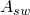、绑定到固体表面的流体表面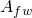，以及分离无限声学介质的有限建模域边界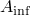。水下爆炸载荷的源*S*也显示在图中。

**图34.4.6-4** 靠近自由表面躺卧的潜艇上的入射波载荷。

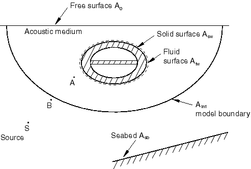

##### 散射波解

这里，声学介质中以及结构对入射波载荷响应的散射波响应是令人感兴趣的。在散射波公式中不考虑流体中的空化。同样，不对流体中的初始静水压力建模。

自由表面上的零动态声压边界条件要求在自由表面上有一个"软"反射平面，并在该自由表面节点上规定零散射压力边界条件。入射波载荷施加在流体表面和湿固体表面上。入射波载荷只能使用压力幅值类型，因为载荷包括固体表面。

standoff节点的好位置标记为[图34.4.6-4](pt07ch34s04aus125.md#pacoustic-subnearfreesurf)中的*A*。该节点位于流体中，靠近结构，比海床或自由表面的任何部分更靠近入射波源*S*。图中为强调而夸张地显示了standoff节点相对于加载表面的偏移。

辐射条件规定在声学表面上，使得与无限介质相交的散射波不会反射回计算域。海床用表面上的入射波反射平面建模。该海床表面上的反射损耗使用阻抗属性建模。

如果对非线性区域中结构的响应感兴趣，应使用Abaqus/Standard在静态分析中建立结构中的初始应力状态。然后将结构中的应力状态导入Abaqus/Explicit，并在声学分析中重新规定导致初始应力状态的固体表面上的载荷。

以下模板示意性地显示了一些用于使用散射波公式解决此问题的Abaqus输入文件选项：

```
[*HEADING](../key/key-link.md#usb-kws-mheading)
…
[*SURFACE*](../key/key-link.md#usb-kws-msurface), NAME= 
*定义润湿固体的声学表面的数据行*
[*SURFACE*](../key/key-link.md#usb-kws-msurface), NAME= 
*定义被流体润湿的固体表面的数据行*
[*SURFACE*](../key/key-link.md#usb-kws-msurface), NAME= 
*定义将建模区域与无限介质分离的声学表面的数据行*
[*INCIDENT WAVE INTERACTION PROPERTY*](../key/key-link.md#usb-kws-mincidentwaveinteractionproperty), NAME=IWPROP
[*AMPLITUDE*](../key/key-link.md#usb-kws-mamplitude), DEFINITION=TABULAR, NAME=PRESSUREVTIME
[*TIE*](../key/key-link.md#usb-kws-mtie), NAME=COUPLING
*, * 
[*STEP*](../key/key-link.md#usb-kws-hstep)
** 对于Abaqus/Standard分析：
[*DYNAMIC*](../key/key-link.md#usb-kws-hdynamic)
** 对于Abaqus/Explicit分析：
[*DYNAMIC*](../key/key-link.md#usb-kws-hdynamic), EXPLICIT
** 加载声学表面
[*INCIDENT WAVE INTERACTION*](../key/key-link.md#usb-kws-hincidentwaveinteraction), PRESSURE AMPLITUDE=PRESSUREVTIME,
PROPERTY=IWPROP
*, source node, standoff node, reference magnitude*
[*INCIDENT WAVE REFLECTION*](../key/key-link.md#usb-kws-hincidentwavereflection)
*海床上反射平面的数据行, seabed_Q* 
[*INCIDENT WAVE REFLECTION*](../key/key-link.md#usb-kws-hincidentwavereflection)
*自由表面上"软"反射平面的数据行。*
** 加载固体表面
[*INCIDENT WAVE INTERACTION*](../key/key-link.md#usb-kws-hincidentwaveinteraction), PRESSURE AMPLITUDE=PRESSUREVTIME,
PROPERTY=IWPROP
*, source node, standoff node, reference magnitude*
[*INCIDENT WAVE REFLECTION*](../key/key-link.md#usb-kws-hincidentwavereflection)
*海床上反射平面的数据行,  seabed_Q* 
[*INCIDENT WAVE REFLECTION*](../key/key-link.md#usb-kws-hincidentwavereflection)
*自由表面上"软"反射平面的数据行。*
[*BOUNDARY*](../key/key-link.md#usb-kws-hboundary)
** 自由表面上的零压力边界条件
*自由表面上的节点集, 8, 8, 0.0*
[*SIMPEDANCE*](../key/key-link.md#usb-kws-hsimpedance)
*, *
[*END STEP*](../key/key-link.md#usb-kws-hendstep)
```

##### 总波解

这里，声学介质中以及结构对入射波载荷响应的总波响应是令人感兴趣的。可以包括流体中的空化。同样，可以在流体中规定线性变化的初始静水压力。

自由表面上的零动态声压边界条件仅要求在该自由表面节点上规定零压力边界条件。不应在自由表面沿设置反射平面。入射波载荷仅施加在将建模区域与周围无限声学介质分离的流体表面上。不应直接在结构表面上施加任何入射波。如果认为入射波是平面的，则可以将加速度型幅值与入射波载荷一起使用。否则，必须将压力型幅值与入射波载荷一起使用。

standoff节点的理想位置取决于用于入射波载荷时间历史的幅值类型。如果入射波载荷时间历史是压力幅值类型，则可以使用[图34.4.6-4](pt07ch34s04aus125.md#pacoustic-subnearfreesurf)中显示的位置*A*。否则，可以使用位置*B*，该位置刚好处在边界上，比源*S*更靠近海床或自由表面的任何部分。

非反射阻抗条件规定在声学表面上，使得与无限介质相交的散射波部分不会反射回计算域。海床用表面上的入射波反射平面建模。

如果对非线性区域中结构的响应感兴趣，应使用Abaqus/Standard在静态分析中建立结构中的初始应力状态。然后将结构中的应力状态导入Abaqus/Explicit，并在声学分析中重新规定导致初始应力状态的固体表面上的载荷。

以下模板示意性地显示了一些用于使用总波公式解决此问题的输入文件选项：

```
[*HEADING](../key/key-link.md#usb-kws-mheading)
…
[*ACOUSTIC WAVE FORMULATION*](../key/key-link.md#usb-kws-macousticwaveform), TYPE=TOTAL WAVE
[*MATERIAL*](../key/key-link.md#usb-kws-mmaterial), NAME=CAVITATING_FLUID
[*ACOUSTIC MEDIUM*](../key/key-link.md#usb-kws-macousticmed), BULK MODULUS
*定义流体体积模量的数据行*
[*ACOUSTIC MEDIUM*](../key/key-link.md#usb-kws-macousticmed), CAVITATION LIMIT
*定义流体空化极限的数据行*
…
[*SURFACE*](../key/key-link.md#usb-kws-msurface), NAME= 
*定义润湿固体的声学表面的数据行*
[*SURFACE*](../key/key-link.md#usb-kws-msurface), NAME= 
*定义被流体润湿的固体表面的数据行*
[*SURFACE*](../key/key-link.md#usb-kws-msurface), NAME= 
*定义将建模区域与无限介质分离的声学表面的数据行*
[*INCIDENT WAVE INTERACTION PROPERTY*](../key/key-link.md#usb-kws-mincidentwaveinteractionproperty), NAME=IWPROP
[*AMPLITUDE*](../key/key-link.md#usb-kws-mamplitude), DEFINITION=TABULAR, NAME=PRESSUREVTIME
*在standoff点定义压力-时间历史的数据行*
[*TIE*](../key/key-link.md#usb-kws-mtie), NAME=COUPLING
*, * 
[*INITIAL CONDITIONS*](../key/key-link.md#usb-kws-minitialcond), TYPE=ACOUSTIC STATIC PRESSURE
*定义流体中初始线性静水压力的数据行*
[*STEP*](../key/key-link.md#usb-kws-hstep)
[*DYNAMIC*](../key/key-link.md#usb-kws-hdynamic), EXPLICIT
** 加载声学表面
[*INCIDENT WAVE INTERACTION*](../key/key-link.md#usb-kws-hincidentwaveinteraction), PRESSURE AMPLITUDE=PRESSUREVTIME, 
PROPERTY=IWPROP
*, source node, standoff node, reference magnitude*
[*INCIDENT WAVE REFLECTION*](../key/key-link.md#usb-kws-hincidentwavereflection)
*海床上反射平面的数据行, seabed_Q* 
[*BOUNDARY*](../key/key-link.md#usb-kws-hboundary)
** 自由表面上的零压力边界条件
*自由表面上的节点集, 8, 8, 0.0*
[*SIMPEDANCE*](../key/key-link.md#usb-kws-hsimpedance)
*, *
[*END STEP*](../key/key-link.md#usb-kws-hendstep)
```

#### 示例：深水中的潜艇

此问题与前一个靠近自由表面的潜艇示例类似，但有以下区别。此问题中没有自由表面；流体表面和流体介质完全包围结构。如果结构充分深地浸没在水中，静水压力可以认为是均匀的而不是随深度线性变化的。在这个假设下，如果需要，可以使用均匀压力载荷在结构周围建立结构中的初始应力状态。此外，如果结构充分深地浸没在水中，静水压力可能相对于入射波载荷显著；因此，流体中的空化可能不令人关注。

#### 示例：水面船

这里，水下爆炸载荷对水面船的影响是令人感兴趣的（见[图34.4.6-5](pt07ch34s04aus125.md#pacoustic-surfaceship)）。

**图34.4.6-5** 水面船上入射波载荷的建模。

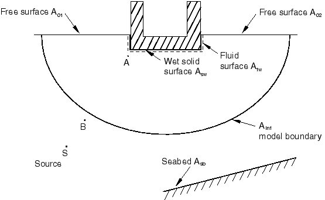

此问题与前一个靠近自由表面的潜艇示例类似，但有以下区别。流体的自由表面不连续，结构的一部分暴露在大气中。在散射波公式中，不像潜艇问题那样在此问题中使用与自由表面重合的"软"反射平面。为了能够在此情况下使用散射波公式，使用了用"结构流体"单元替换自由表面的建模技术。使用非声学单元（如膜单元）在自由表面处对流体层进行建模。这些单元使用网格绑定约束耦合到底层声学流体。非声学单元具有与流体本身相似的属性，因为这些单元正在替换自由表面附近的流体介质，应具有与相邻声学单元相似的高度。现在必须将具有散射波公式的入射波载荷也施加在这些新创建的表面上。这种技术的附加优点是可以获得载荷下自由表面的变形形状。

以下模板显示了一些用于此情况的Abaqus输入文件选项：

```
[*HEADING](../key/key-link.md#usb-kws-mheading)
…
[*SURFACE*](../key/key-link.md#usb-kws-msurface), NAME=A01_structuralfluid
*定义"结构流体"表面的数据行*
[*SURFACE*](../key/key-link.md#usb-kws-msurface), NAME=A01_acousticfluid
*定义相邻声学流体表面的数据行*
[*SURFACE*](../key/key-link.md#usb-kws-msurface), NAME=A02_structuralfluid
*定义"结构流体"表面的数据行*
[*SURFACE*](../key/key-link.md#usb-kws-msurface), NAME=A02_acousticfluid
*定义相邻声学流体表面的数据行*
[*SURFACE*](../key/key-link.md#usb-kws-msurface), NAME=Asw_solid 
*定义被流体润湿的实际固体表面的数据行*
[*SURFACE*](../key/key-link.md#usb-kws-msurface), NAME=Asw_fluid 
*定义与结构相邻的实际声学表面的数据行*
[*SURFACE*](../key/key-link.md#usb-kws-msurface), NAME= 
*定义将建模区域与无限介质分离的声学表面的数据行*
[*INCIDENT WAVE INTERACTION PROPERTY*](../key/key-link.md#usb-kws-mincidentwaveinteractionproperty), NAME=IWPROP
[*AMPLITUDE*](../key/key-link.md#usb-kws-mamplitude), DEFINITION=TABULAR, NAME=PRESSUREVTIME
*在standoff点定义压力-时间历史的数据行*
[*TIE*](../key/key-link.md#usb-kws-mtie), NAME=COUPLING
*Asw_fluid, Asw_solid
A01_acousticfluid, A01_structuralfluid
A02_acousticfluid, A02_structuralfluid* 
[*STEP*](../key/key-link.md#usb-kws-hstep)
** 对于Abaqus/Standard分析：
[*DYNAMIC*](../key/key-link.md#usb-kws-hdynamic)
** 对于Abaqus/Explicit分析：
[*DYNAMIC*](../key/key-link.md#usb-kws-hdynamic), EXPLICIT
** 加载声学表面
[*INCIDENT WAVE INTERACTION*](../key/key-link.md#usb-kws-hincidentwaveinteraction), PRESSURE AMPLITUDE=PRESSUREVTIME, 
PROPERTY=IWPROP
*A01_acousticfluid, source point, standoff point, reference magnitude*
[*INCIDENT WAVE REFLECTION*](../key/key-link.md#usb-kws-hincidentwavereflection)
*海床上反射平面的数据行, seabed_Q*
[*INCIDENT WAVE INTERACTION*](../key/key-link.md#usb-kws-hincidentwaveinteraction), PRESSURE AMPLITUDE=PRESSUREVTIME,
PROPERTY=IWPROP
*A02_acousticfluid, source point, standoff point, reference magnitude*
[*INCIDENT WAVE REFLECTION*](../key/key-link.md#usb-kws-hincidentwavereflection)
*海床上反射平面的数据行, seabed_Q*
[*INCIDENT WAVE INTERACTION*](../key/key-link.md#usb-kws-hincidentwaveinteraction), PRESSURE AMPLITUDE=PRESSUREVTIME, 
PROPERTY=IWPROP
*Asw_fluid, source point, standoff point, reference magnitude*
[*INCIDENT WAVE REFLECTION*](../key/key-link.md#usb-kws-hincidentwavereflection)
*海床上反射平面的数据行, seabed_Q*
** 加载固体表面
[*INCIDENT WAVE INTERACTION*](../key/key-link.md#usb-kws-hincidentwaveinteraction), PRESSURE AMPLITUDE=PRESSUREVTIME, 
PROPERTY=IWPROP
*A01_structuralfluid, source point, standoff point, reference magnitude*
[*INCIDENT WAVE REFLECTION*](../key/key-link.md#usb-kws-hincidentwavereflection)
*海床上反射平面的数据行, seabed_Q*
[*INCIDENT WAVE INTERACTION*](../key/key-link.md#usb-kws-hincidentwaveinteraction), PRESSURE AMPLITUDE=PRESSUREVTIME, 
PROPERTY=IWPROP
*A02_structuralfluid, source point, standoff point, reference magnitude*
[*INCIDENT WAVE REFLECTION*](../key/key-link.md#usb-kws-hincidentwavereflection)
*海床上反射平面的数据行, seabed_Q*
[*INCIDENT WAVE INTERACTION*](../key/key-link.md#usb-kws-hincidentwaveinteraction), PRESSURE AMPLITUDE=PRESSUREVTIME, 
PROPERTY=IWPROP
*Asw_solid, source point, standoff point, reference magnitude *
[*INCIDENT WAVE REFLECTION*](../key/key-link.md#usb-kws-hincidentwavereflection)
*海床上反射平面的数据行, seabed_Q* 
[*SIMPEDANCE*](../key/key-link.md#usb-kws-hsimpedance)
*, *
[*END STEP*](../key/key-link.md#usb-kws-hendstep)
```

与靠近自由表面的潜艇的总波公式分析相比，以下差异值得注意。如[图34.4.6-5](pt07ch34s04aus125.md#pacoustic-surfaceship)所示，具有零动态压力边界条件的自由表面现在分为两部分：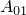和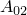。润湿船舶的流体表面（）和润湿船舶表面（）绑定在一起，但不环绕整个结构。除这些差异外，水面船问题的建模考虑与靠近自由表面潜艇的总波分析类似。

#### 示例：结构上的空气冲击载荷

这里，空气爆炸（空气中的爆炸）载荷对结构的影响是令人感兴趣的（见[图34.4.6-6](pt07ch34s04aus125.md#pacoustic-airblastbldg)）。

**图34.4.6-6** 结构上空气冲击载荷的建模。


由于空气介质的刚度和惯性可以忽略不计，声学介质未被建模。相反，入射波载荷直接施加在结构本身上。入射波载荷施加的固体表面如图34.4.6-6所示。由于声学介质未被建模，总波和散射波公式是相同的。

#### 示例：无入射波载荷的流体空化

您可能对Abaqus/Explicit中的声学问题建模感兴趣，其中载荷通过规定压力边界或指定压力共轭集中载荷施加。在这些问题中，即使声学介质可能发生空化，散射或总波公式的选择也不相关。


