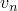
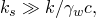

# 34.4.7 孔隙流体流动


**产品：** Abaqus/Standard  Abaqus/CAE

##### **参考**

- ["施加载荷：概述，" 第34.4.1节"](pt07ch34s04aus120.md)
- [*CFLOW*](../key/key-link.md#usb-kws-hcflow)
- [*DFLOW*](../key/key-link.md#usb-kws-hdflow)
- [*DSFLOW*](../key/key-link.md#usb-kws-hdsflow)
- [*FLOW*](../key/key-link.md#usb-kws-hflow)
- [*SFLOW*](../key/key-link.md#usb-kws-hsflow)
- ["定义表面孔隙流体流动，" Abaqus/CAE用户指南第16.9.22节"](../usi/usi-link.md#usi-lbi-loadeditors-surfpore)
- ["定义集中孔隙流体流动，" Abaqus/CAE用户指南第16.9.21节"](../usi/usi-link.md#usi-lbi-loadeditors-concpore)

### 概述

孔隙流体流动可以在耦合孔隙流体扩散/应力分析（见["耦合孔隙流体扩散和应力分析，" 第6.8.1节"](pt03ch06s08at26.md)）和地应力场过程中规定（见["地应力状态，" 第6.8.2节"](pt03ch06s08at27.md)）。孔隙流体流动可以通过以下方式规定：
- 在单元表面或表面上定义渗流系数和汇孔隙压力；
- 在单元表面或表面上定义仅排水渗流系数，仅当表面孔隙压力为正时应用；或
- 直接在节点、单元表面或表面上规定外向法向流动速度。

### 在固结分析中定义孔隙流体流动为当前孔隙压力的函数

在固结分析中，您可以在单元表面或表面上提供渗流系数和汇孔隙压力，以控制从建模区域内部到外部的法向孔隙流体流动。

表面条件假定孔隙流体流动与表面上该点的当前孔隙压力与某个参考孔隙压力值之间的差值成正比：


其中



是孔隙流体速度在表面外向法向方向上的分量；


是渗流系数；


是表面上该点的当前孔隙压力；以及


是参考孔隙压力值。

#### 指定基于单元的孔隙流体流动

要定义基于单元的孔隙流体流动，请指定单元或单元集名称；分布载荷类型；参考孔隙压力；以及参考渗流系数。在其上强制执行法向流动的单元表面由渗流分布载荷类型标识。可用渗流类型取决于单元类型（见[第六部分，"单元"](pt06.md)"）。

| **输入文件用法：** | ``` [*FLOW*](../key/key-link.md#usb-kws-hflow) *单元编号或单元集名称*, Q*n*, ,  ``` |
| --- | --- |

| **Abaqus/CAE用法：** | 在Abaqus/CAE中，孔隙流体流动不能定义为当前孔隙压力的函数。 |
| --- | --- |

#### 指定基于表面的孔隙流体流动

要定义基于表面的孔隙流体流动，请指定表面名称、渗流流动类型、参考孔隙压力和参考渗流系数。基于单元的表面（见["基于单元的表面定义，" 第2.3.2节"](pt01ch02s03aus17.md)）包含单元和面信息。

| **输入文件用法：** | ``` [*SFLOW*](../key/key-link.md#usb-kws-hsflow) *表面名称*, Q, ,  ``` |
| --- | --- |

| **Abaqus/CAE用法：** | 在Abaqus/CAE中，孔隙流体流动不能定义为当前孔隙压力的函数。 |
| --- | --- |

#### 定义仅排水流动

可以为基于单元或基于表面的孔隙流体流动指定仅排水流动类型，以表示孔隙流体仅从模型内部流向外部区域。仅排水流动表面条件假定当表面上的当前孔隙压力为正时，孔隙流体流动与该孔隙压力的大小成正比：


其中


是孔隙流体速度在表面外向法向方向上的分量；


是渗流系数；以及


是表面上该点的当前孔隙压力。

[图34.4.7-1](pt07ch34s04aus126.md#drainage-porepressure)说明了这个孔隙压力-速度关系。此表面条件设计用于总孔隙压力公式（见["耦合孔隙流体扩散和应力分析，" 第6.8.1节"](pt03ch06s08at26.md)），主要用于潜水面与自由排水的外部表面相交的情况。见["土坝中潜水面计算，" Abaqus例题问题指南第10.1.2节](../exa/exa-link.md#exa-soi-phreaticsurf)，了解此类计算的示例。

**图34.4.7-1** 仅排水孔隙压力-速度关系。


当表面孔隙压力为负时，约束将正确强制执行条件，即没有流体可以进入内部区域。当表面孔隙压力为正时，约束将允许流体从模型内部流向外部区域。当渗流系数值较大时，此流动将近似强制执行自由排水表面上孔隙压力应为零的要求。为实现此条件，有必要选择的值远大于底层单元材料的标准渗流系数：



其中

*k*

是底层材料的渗透率；


是流体比重；以及

*c*

是底层单元的特征长度。

对于大多数分析，的值将足够。较大的值可能导致模型条件不良。在所有情况下，自由排水流动类型表示不连续非线性行为，其使用可能需要适当的求解控制（见["常用控制参数，" 第7.2.2节"](pt03ch07s02aus50.md)）。

| **输入文件用法：** | 使用以下选项定义基于单元的仅排水流动： |
| --- | --- |
| | ``` [*FLOW*](../key/key-link.md#usb-kws-hflow) *单元编号或单元集名称*, Q*n*D,  ``` 使用以下选项定义基于表面的仅排水流动： ``` [*SFLOW*](../key/key-link.md#usb-kws-hsflow) *表面名称*, QD,  ``` |

| **Abaqus/CAE用法：** | 在Abaqus/CAE中，孔隙流体流动不能定义为当前孔隙压力的函数。 |
| --- | --- |

#### 修改或移除渗流系数和参考孔隙压力

渗流系数和参考孔隙压力可以按照["施加载荷：概述，" 第34.4.1节"](pt07ch34s04aus120.md)中所述进行添加、修改或移除。

#### 指定随时间变化的参考孔隙压力

参考孔隙压力的幅值可以通过引用幅值曲线来控制。如果不同流动部分需要不同的变化，请使用各自引用自己的幅值曲线重复流动定义。详见["施加载荷：概述，" 第34.4.1节"](pt07ch34s04aus120.md)和["幅值曲线，" 第34.1.2节"](pt07ch34s01aus115.md)。

#### 在用户子程序中定义非均匀流动

要定义非均匀流动，参考孔隙压力和渗流系数随位置、时间、孔隙压力等的变化可以通过用户子程序[`FLOW`](../sub/sub-link.md#sub-xsl-flow)定义。

| **输入文件用法：** | 使用以下选项定义非均匀基于单元的流动： |
| --- | --- |
| | ``` [*FLOW*](../key/key-link.md#usb-kws-hflow) *单元编号或单元集名称*, Q*n*NU ``` 使用以下选项定义非均匀基于表面的流动： ``` [*SFLOW*](../key/key-link.md#usb-kws-hsflow) *表面名称*, QNU ``` |

| **Abaqus/CAE用法：** | 用户子程序[`FLOW`](../sub/sub-link.md#sub-xsl-flow)在Abaqus/CAE中不受支持。 |
| --- | --- |

### 在固结分析中直接规定渗流流动速度和渗流流动

您可以直接规定通过表面的外向法向流动速度，或在节点上规定外向法向流动。

#### 规定基于单元的渗流流动速度

要规定基于单元的渗流流动速度，请指定单元或单元集名称、渗流类型和外向法向流动速度。定义渗流流动的单元表面由渗流类型标识。可用渗流类型取决于单元类型（见[第六部分，"单元"](pt06.md)"）。

| **输入文件用法：** | ``` [*DFLOW*](../key/key-link.md#usb-kws-hdflow) *单元编号或单元集名称*, S*n*,  ``` |
| --- | --- |

| **Abaqus/CAE用法：** | 载荷模块：**创建载荷**：为**类别**选择**流体**，为**所选步的类型**选择**表面孔隙流体**：选择区域：**分布**：选择解析场，**幅值**： |
| --- | --- |

#### 规定基于表面的渗流流动速度

要规定基于表面的渗流流动速度，请指定表面名称、渗流流动类型和孔隙流体速度。基于单元的表面（见["基于单元的表面定义，" 第2.3.2节"](pt01ch02s03aus17.md)）包含单元和面信息。

| **输入文件用法：** | ``` [*DSFLOW*](../key/key-link.md#usb-kws-hdsflow) *表面名称*, S,  ``` |
| --- | --- |

| **Abaqus/CAE用法：** | 载荷模块：**创建载荷**：为**类别**选择**流体**，为**所选步的类型**选择**表面孔隙流体**：选择区域：**分布**：**均匀**，**幅值**： |
| --- | --- |

#### 规定基于节点的渗流流动

要规定基于节点的渗流流动，请指定节点或节点集名称以及单位时间流动量的幅值。

| **输入文件用法：** | ``` [*CFLOW*](../key/key-link.md#usb-kws-hcflow) *节点编号或节点集名称*,, *幅值* ``` |
| --- | --- |

| **Abaqus/CAE用法：** | 载荷模块：**创建载荷**：为**类别**选择**流体**，为**所选步的类型**选择**集中孔隙流体**：选择区域：**幅值**：*幅值* |
| --- | --- |

#### 在增强单元的虚节点上规定渗流流动

对于增强单元（见["使用扩展有限元方法将不连续性建模为增强特征，" 第10.7.1节"](pt04ch10s07at36.md)），您可以在最初与指定实节点重合的虚节点上指定渗流流动。

或者，您可以直接在位于两个指定实角节点之间的单元边缘上的虚节点指定渗流流动。

| **输入文件用法：** | 使用以下选项指定最初与指定实节点重合的虚节点上的渗流流动： |
| --- | --- |
| | ``` [*CFLOW*](../key/key-link.md#usb-kws-hcflow), PHANTOM=NODE *节点编号*,, *幅值* ``` 使用以下选项指定位于单元边缘上的虚节点上的渗流流动： ``` [*CFLOW*](../key/key-link.md#usb-kws-hcflow), PHANTOM=EDGE *第一角节点编号*, *第二角节点编号*, *幅值* ``` |

| **Abaqus/CAE用法：** | 在Abaqus/CAE中不支持在增强单元的虚节点上规定渗流流动 |
| --- | --- |

#### 修改或移除渗流流动速度和渗流流动

渗流流动速度可以按照["施加载荷：概述，" 第34.4.1节"](pt07ch34s04aus120.md)中所述进行添加、修改或移除。

#### 指定随时间变化的流动速度和流动

渗流速度的幅值可以通过引用幅值曲线来控制。要为不同流动指定不同的变化，请使用各自引用自己的幅值曲线重复渗流流动速度或渗流流动定义。详见["施加载荷：概述，" 第34.4.1节"](pt07ch34s04aus120.md)和["幅值曲线，" 第34.1.2节"](pt07ch34s01aus115.md)。

#### 在用户子程序中定义非均匀流动速度

要定义非均匀基于单元或基于表面的流动，渗流量随位置、时间、孔隙压力等的变化可以通过用户子程序[`DFLOW`](../sub/sub-link.md#sub-xsl-dflow)定义。如果直接指定了可选的渗流速度，则此值在用于定义渗流量的变量中传递到用户子程序[`DFLOW`](../sub/sub-link.md#sub-xsl-dflow)。

| **输入文件用法：** | 使用以下选项定义非均匀基于单元的流动： |
| --- | --- |
| | ``` [*DFLOW*](../key/key-link.md#usb-kws-hdflow) *单元编号或单元集名称*, S*n*NU,  ``` 使用以下选项定义非均匀基于表面的流动： ``` [*DSFLOW*](../key/key-link.md#usb-kws-hdsflow) *表面名称*, SNU,  ``` |

| **Abaqus/CAE用法：** | 使用以下输入定义非均匀基于表面的流动： |
| --- | --- |
| | 载荷模块：**创建载荷**：为**类别**选择**流体**，为**所选步的类型**选择**表面孔隙流体**：选择区域：**分布：用户定义**，**幅值**： 在Abaqus/CAE中不支持非均匀基于单元的流动。 |


