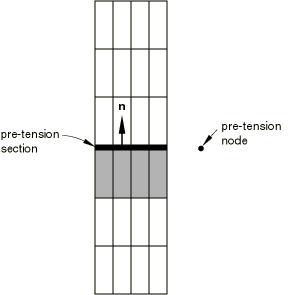
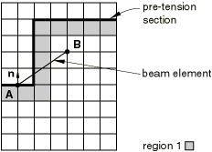
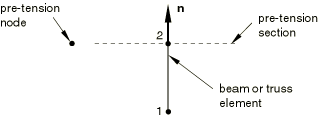
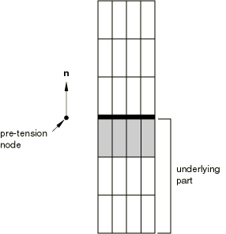

# 34.5.1 规定装配载荷


**产品：** Abaqus/Standard  Abaqus/CAE

##### **参考**

- ["规定条件：概述，" 第34.1.1节"](pt07ch34s01abo31.md)
- [*BOUNDARY*](../key/key-link.md#usb-kws-hboundary)
- [*CLOAD*](../key/key-link.md#usb-kws-hcload)
- [*PRE-TENSION SECTION*](../key/key-link.md#usb-kws-mpretension)
- [*SURFACE*](../key/key-link.md#usb-kws-msurface)
- [Abaqus/CAE用户指南第22章，"螺栓载荷"](../usi/usi-link.md#usi-adv-boltloads)

### 概述

装配载荷：
- 可用于模拟紧固件在结构中的载荷；
- 施加在用户定义的预紧截面上；
- 施加在与预紧截面关联的预紧节点上；和
- 需要规定预紧载荷或紧固调整。

### 装配载荷的概念

[图34.5.1-1](pt07ch34s05aus127.md#ppretension-assembly-exa)是一个简单示例，说明了装配载荷的概念。

**图34.5.1-1** 装配载荷示例。


容器*A*通过预紧螺栓来密封，螺栓固定盖子，使垫圈承受压力。在Abaqus/Standard中，通过在螺栓中添加一个"切割面"或预紧截面来模拟这种预紧（如图所示），并对其施加拉伸载荷。通过修改表面一侧的单元，Abaqus/Standard可以自动调整预紧截面处螺栓的长度，以达到规定的预紧量。在后续步骤中，可以阻止进一步的长度变化，使螺栓作为标准变形组件响应装配上的其他载荷。

### 对装配载荷建模

Abaqus/Standard允许您在通过连续体、桁架或梁单元建模的紧固件上规定装配载荷。建模装配载荷所需的步骤因用于建模紧固件的单元类型而略有不同。

#### 使用连续体单元建模紧固件

在连续体单元中，预紧截面定义为紧固件内部的一个表面，"切割"它为两部分（见[图34.5.1-2](pt07ch34s05aus127.md#ppretension-solid)）。对于由多个段组成的紧固件，预紧截面可以是一组表面。

**图34.5.1-2** 使用连续体单元定义的预紧截面。


基于单元的表面包含单元和面信息（见["基于单元的表面定义，" 第2.3.2节"](pt01ch02s03aus17.md)）。您必须将表面转换为可以施加预紧载荷的预紧截面，并为预紧截面分配一个控制节点。

| **输入文件用法：** | 使用以下选项对通过连续体单元建模的紧固件上的装配载荷建模： |
| --- | --- |
| | ``` [*SURFACE*](../key/key-link.md#usb-kws-msurface), TYPE=ELEMENT, NAME=*表面名称* [*PRE-TENSION SECTION*](../key/key-link.md#usb-kws-mpretension), SURFACE=*表面名称*, NODE=*n* ``` |

| **Abaqus/CAE用法：** | 载荷模块：**创建载荷**：为**类别**选择**机械**，为**所选步的类型**选择**螺栓载荷** |
| --- | --- |

##### 为预紧截面分配控制节点

装配载荷通过预紧节点在预紧截面上传递。预紧节点不应连接到模型中的任何单元。它只有一个自由度（自由度1），代表切割两侧在法向方向上的相对位移（见[图34.5.1-3](pt07ch34s05aus127.md#ppretension-normal)）。此节点的坐标不重要。

**图34.5.1-3** 预紧截面的法向；此法向应背离底层单元。



##### 定义预紧截面的法向

Abaqus/Standard计算截面的平均法向——在正向表面方向，背离用于生成表面的连续体单元——以确定施加预紧的方向。您也可以直接指定法向（当所需载荷方向与预紧截面的平均法向不同时）。在大位移分析中，法向不更新。

##### 识别预紧截面两侧的单元

对于所有通过至少一个节点连接到预紧截面的单元，Abaqus/Standard必须确定每个单元位于预紧截面的哪一侧。此过程对于规定的装配载荷正常工作至关重要。

用于定义截面的单元在此讨论中称为"基础单元"。与基础单元在截面同一侧的所有单元称为"底层单元"。所有连接到截面并与基础单元共享面（在二维问题中为边缘）的单元被添加到底层单元列表中。这是一个重复过程，使Abaqus/Standard能够找到几乎所有网格中未用于表面定义的底层单元——三角形；楔形；四面体；以及嵌入的梁、桁架、壳和膜单元（见[图34.5.1-4](pt07ch34s05aus127.md#ppretension-underlying)）。

**图34.5.1-4** 基础单元用于找到底层单元。


在大多数情况下，此过程会将所有连接到截面的单元分为两组，如图所示。在极少数情况下，此过程可能会将单元分为两个以上的区域，特别是当线单元跨越单元边界时。如[图34.5.1-5](pt07ch34s05aus127.md#ppretension-add-under)所示的一个示例，它有三个区域，其中区域1是底层区域。

**图34.5.1-5** 找到额外的底层单元。


对于区域1以外的每个区域，需要额外步骤来确定该区域位于截面的哪一侧。Abaqus/Standard为属于截面的该区域所有节点计算平均法向；并为所有这些节点计算平均位置（）。此外，它计算该区域剩余节点的平均位置（）。如果法向与矢量的点积为负，则假定该区域是底层区域并添加到区域1。此额外步骤在[图34.5.1-5](pt07ch34s05aus127.md#ppretension-add-under)中针对区域2和3说明。

对于[图34.5.1-6](pt07ch34s05aus127.md#ppretension-no-add-under)中所示的梁单元，此额外步骤会产生不正确的分离，因为该梁不被认为是底层单元。

**图34.5.1-6** 未找到额外的底层单元。



如果预紧截面具有奇特的形状，并且一个或多个跨越单元边界的线单元连接到它，请查阅数据（`.dat`）文件中给出的底层单元列表，以确保底层单元被正确列出。

仅连接到预紧截面上节点的单元（包括单节点单元，如SPRING1、DASHPOT1和MASS单元）不包括为底层单元：它们被认为是连接到截面的另一侧。

#### 使用桁架或梁单元建模紧固件

当使用桁架或梁单元对预紧组件建模时，预紧截面缩减为一个点。截面假定位于单元连接定义中最后一个节点的位置（有关梁和桁架单元的节点排序定义，请分别参见["梁单元库，" 第29.3.8节"](pt06ch29s03ael14.md)和["桁架单元库，" 第29.2.2节"](pt06ch29s02ael13.md)），其法向沿单元从第一个节点到最后一个节点的方向。因此，截面完全通过指定必须规定装配载荷的单元并将其与预紧节点关联来定义。

| **输入文件用法：** | 使用以下选项对通过梁或桁架单元建模的紧固件上的装配载荷建模： |
| --- | --- |
| | ``` [*PRE-TENSION SECTION*](../key/key-link.md#usb-kws-mpretension), ELEMENT=*单元编号*, NODE=*n* ``` |

| **Abaqus/CAE用法：** | 载荷模块：**创建载荷**：为**类别**选择**机械**，为**所选步的类型**选择**螺栓载荷** |
| --- | --- |

与基于表面的预紧截面一样，该节点只有一个自由度（自由度1），代表切割两侧在法向方向上的相对位移（见[图34.5.1-7](pt07ch34s05aus127.md#ppretension-truss-beam)）。节点的坐标不重要。

**图34.5.1-7** 使用桁架或梁单元定义的预紧截面。



##### 定义预紧截面的法向

Abaqus/Standard将法向计算为底层单元连接中从第一个节点到最后一个节点的矢量。或者，您可以直接指定截面的法向。此法向在大位移分析期间不更新。

### 定义多个预紧截面

您可以通过重复预紧截面定义输入来定义多个预紧截面。每个预紧截面应有自己的预紧节点。

### 与节点变换一起使用

局部坐标系（见["变换坐标系，" 第2.1.5节"](pt01ch02s01aus09.md)）不能在预紧节点上使用。它可以在位于预紧截面上的节点上使用。

### 施加规定的装配载荷

预紧载荷通过预紧节点在预紧截面上传递。

#### 规定预紧力

您可以向预紧节点施加集中载荷。此载荷是在预紧截面上传递的自动平衡力，沿法向方向作用在紧固件的底层部分上（包含用于定义预紧截面的单元的部分；见[图34.5.1-8](pt07ch34s05aus127.md#ppretension-load)）。

| **输入文件用法：** | ``` [*CLOAD*](../key/key-link.md#usb-kws-hcload) ``` |
| --- | --- |

| **Abaqus/CAE用法：** | 载荷模块：**创建载荷**：为**类别**选择**机械**，为**所选步的类型**选择**螺栓载荷**：选择表面，必要时选择基准轴：**方法：施加力** |
| --- | --- |

**图34.5.1-8** 规定的装配载荷在预紧节点处给出，并沿方向施加。



#### 规定紧固调整

您可以通过在预紧节点处使用非零边界条件来规定预紧截面的紧固调整（对应于预紧截面切割的组件长度在法向方向上的规定变化）。

| **输入文件用法：** | ``` [*BOUNDARY*](../key/key-link.md#usb-kws-hboundary) ``` |
| --- | --- |

| **Abaqus/CAE用法：** | 载荷模块：**创建载荷**：为**类别**选择**机械**，为**所选步的类型**选择**螺栓载荷**：选择表面，必要时选择基准轴：**方法：调整长度** |
| --- | --- |

#### 在分析期间控制预紧节点

通过在紧固件中施加初始预紧后，在步开始时使用边界条件将自由度的值固定在其当前值，您可以维持预紧截面的初始调整；此技术使预紧截面上的载荷能够根据外部施加的载荷变化以维持平衡。如果不维持截面的初始调整，紧固件中的力将保持恒定。

当预紧节点不受边界条件控制时，确保结构的组件受到运动约束；否则，结构可能由于存在刚体模式而散开。Abaqus/Standard如果在分析第一步中未找到预紧节点上的任何边界条件或载荷，将发出警告消息。

### 结果显示

Abaqus/Standard自动调整组件在预紧截面处的长度以达到规定的预紧量。此调整通过将底层单元中位于预紧截面上的节点相对于这些节点在连接到预紧截面的其他单元中出现时的相同节点移动来完成。因此，底层单元将显示为收缩，即使在施加预紧时它们承受拉应力。

### 使用装配载荷时的限制

装配载荷受以下限制：
- 装配载荷不能在子结构中规定。
- 如果执行子模型分析（["子模型：概述，" 第10.2.1节"](pt04ch10s02aus60.md)），任何预紧截面不应跨越指定驱动节点的区域。换句话说，预紧截面应完全出现在全局模型中不属于子模型的部分，或完全出现在属于子模型的全局模型部分。在后一种情况下，在执行子模型分析时，预紧截面也必须出现在子模型中。
- 预紧截面的节点不应通过多点约束连接到身体的其他部分（["一般多点约束，" 第35.2.2节"](pt08ch35s02aus130.md)）。这些节点可以通过方程连接到身体的其他部分（["线性约束方程，" 第35.2.1节"](pt08ch35s02aus129.md)）。但是，将预紧截面上的节点连接到位于截面底层侧的节点的方程引入了跨越预紧切割的约束，因此直接与预紧载荷的施加相互作用。另一方面，将预紧截面上的节点连接到截面另一侧的节点的方程不会影响预紧载荷的施加。

### 过程

任何使用具有位移自由度的单元类型的Abaqus/Standard过程都可以使用。在规定初始预紧时，静态分析是最可能使用的过程类型（["静态应力分析，" 第6.2.2节"](pt03ch06s02at01.md)）。也可以使用其他分析类型，如耦合温度-位移（["顺序耦合热应力分析，" 第16.1.2节"](pt04ch16s01at39.md)）或耦合热-电-结构（["完全耦合热-电-结构分析，" 第6.7.4节"](pt03ch06s07at23.md)）。一旦施加了初始预紧，可以例如使用静态或动态分析（["动力学分析过程：概述，" 第6.3.1节"](pt03ch06s03abo07.md)）在维持紧固调整的同时施加额外载荷。

### 输出

预紧截面上的总力是预紧节点处的反作用力加上在该节点上规定的任何集中载荷的总和。预紧截面上的总力可使用输出变量标识符TF获得（见["Abaqus/Standard输出变量标识符，" 第4.2.1节"](pt02ch04s02abv01.md)）。力沿法向方向。预紧截面上的剪切力不可用于输出。

预紧截面的紧固调整可用作预紧节点的位移。位移输出使用输出标识符U请求。由于在任何其他方向上没有调整，仅输出预紧截面的法向调整。

预紧截面上的应力分布不能直接获得；但是，底层单元中的应力可以容易地显示。或者，可以在预紧截面位置插入绑定接触对，以通过输出标识符CPRESS和CSHEAR启用应力分布输出。有关定义绑定接触的详细信息，请参阅["在Abaqus/Standard中定义绑定接触，" 第36.3.7节"](pt09ch36s03aus151.md)。

### 输入文件模板

```
[*HEADING*](../key/key-link.md#usb-kws-mheading)
*规定装配载荷；使用连续体单元的示例*
…
[*NODE*](../key/key-link.md#usb-kws-mnode)
*可选地定义预紧节点*
[*SURFACE*](../key/key-link.md#usb-kws-msurface), NAME=*名称*
*指定单元及其相关面的数据行以定义预紧截面*
[*PRE-TENSION SECTION*](../key/key-link.md#usb-kws-mpretension), SURFACE=*名称*, NODE=*预紧节点*
**
[*STEP*](../key/key-link.md#usb-kws-hstep)
** 在截面上施加预紧
[*STATIC*](../key/key-link.md#usb-kws-hstatic)
*控制时间增量的数据行*
[*CLOAD*](../key/key-link.md#usb-kws-hcload)
*预紧节点*, 1, *预紧值*
*或*
[*BOUNDARY*](../key/key-link.md#usb-kws-hboundary),AMPLITUDE=*幅值*
*预紧节点*, 1, 1, *紧固调整*
[*END STEP*](../key/key-link.md#usb-kws-hendstep)
[*STEP*](../key/key-link.md#usb-kws-hstep)
** 维持紧固调整并施加新载荷
[*STATIC*](../key/key-link.md#usb-kws-hstatic) *或* [*DYNAMIC*](../key/key-link.md#usb-kws-hdynamic)
*控制时间增量的数据行*
[*BOUNDARY*](../key/key-link.md#usb-kws-hboundary),FIXED
*预紧节点*, 1, 1
[*BOUNDARY*](../key/key-link.md#usb-kws-hboundary)
*规定其他边界条件的数据行*
[*CLOAD*](../key/key-link.md#usb-kws-hcload) *或* [*DLOAD*](../key/key-link.md#usb-kws-hdload)
*规定其他载荷条件的数据行*
…
[*END STEP*](../key/key-link.md#usb-kws-hendstep)
```


