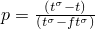
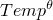
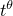
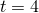
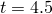

# 34.6.1 预定义场


**产品：** Abaqus/Standard  Abaqus/Explicit  Abaqus/CAE

##### **参考**

- ["规定条件：概述，" 第34.1.1节"](pt07ch34s01abo31.md)
- [*TEMPERATURE*](../key/key-link.md#usb-kws-htemperature)
- [*FIELD*](../key/key-link.md#usb-kws-hfield)
- [*PRESSURE STRESS*](../key/key-link.md#usb-kws-hpressure)
- [*MASS FLOW RATE*](../key/key-link.md#usb-kws-hmassflowrate)
- ["定义温度场，" Abaqus/CAE用户指南第16.11.9节"](../usi/usi-link.md#usi-lbi-helptopics-temp)

### 概述

本节描述如何在分析期间规定以下类型预定义场的值：
- 温度，
- 场变量，
- 等效压力应力，和
- 质量流率。

可以使用这些场的过程在["规定条件：概述，" 第34.1.1节"](pt07ch34s01abo31.md)中概述。

温度、场变量、等效压力应力和质量流率是随时间变化的、预定义的（不依赖于解的）场，存在于模型的整个空间域中。它们可以：
- 通过直接输入数据来定义，
- 通过读取先前分析期间生成的Abaqus结果文件（通常是Abaqus/Standard传热分析），或
- 在Abaqus/Standard用户子程序中定义。

温度也可以通过读取先前分析期间生成的Abaqus输出数据库文件来定义。在Abaqus/Standard中，场变量也可以通过读取先前分析期间生成的Abaqus输出数据库文件来定义。

场变量也可以设为依赖于解，这允许您在Abaqus材料模型中引入额外的非线性。

### 预定义温度

在应力/位移分析中，如果为材料给出了热膨胀系数，则预定义温度场与任何初始温度（["Abaqus/Standard和Abaqus/Explicit中的初始条件，" 第34.2.1节"](pt07ch34s02aus116.md)）之间的温度差异将产生热应变（["热膨胀，" 第26.1.2节"](pt05ch26s01abm52.md)）。预定义温度场也影响温度依赖的材料属性（如果有的话）。在Abaqus/Explicit中，温度依赖的材料属性可能比恒定属性导致更长的运行时间。

您在节点处定义温度的幅值和时间变化，Abaqus将温度插值到材料点。

| **输入文件用法：** | 使用以下选项指定预定义温度场： |
| --- | --- |
| | ``` [*TEMPERATURE*](../key/key-link.md#usb-kws-htemperature) ``` |

| **Abaqus/CAE用法：** | 载荷模块：**创建预定义场**：**步**：*分析步*：为**类别**选择**其他**，为**所选步的类型**选择**温度** |
| --- | --- |

#### 限制

请勿在纯传热分析、耦合热-电分析、完全耦合温度-位移分析或完全耦合热-电-结构分析中规定预定义温度场；而是规定边界条件（["Abaqus/Standard和Abaqus/Explicit中的边界条件，" 第34.3.1节"](pt07ch34s03aus118.md)）来规定温度自由度（11、12、...）。

预定义温度场不能在绝热分析步或任何基于模态的动力学分析步中规定。

要在重启分析中规定预定义温度场，相应的预定义场必须在原始分析中规定为初始温度（见["在Abaqus/Standard和Abaqus/Explicit中定义初始温度" in "初始条件，" 第34.2.1节"](pt07ch34s02aus116.md#usb-prc-pinitialcond-temp)）或预定义温度场。

### 预定义场变量

预定义场变量的用法和处理与温度完全类似。您可以规定模型所有节点上场的大小和时间变化，Abaqus会将值插值到材料点。

在规定场变量值时，必须指定正在定义的场变量编号；默认是场变量编号1。场变量必须从1开始连续编号。重复场变量定义以定义多个场变量。

场变量可以是先前模拟（如Abaqus或其他分析代码）生成的实场（如电磁场）。它也可以是您定义的虚拟场，用于在分析过程中修改某些材料属性。例如，假设您希望在响应期间将杨氏模量在30×10^6和35×10^6之间线性变化。[表34.6.1-1](pt07ch34s06aus128.md#usb-prc-pfields-samplemat)中所示的线弹性材料定义可以使用。

**表34.6.1-1** 示例材料定义。
| 场变量依赖数量：1 |
| --- |
| 杨氏模量 | 泊松比 | 场变量1的值 |
| 30.E6 | 0.3 | 1.0 |
| 35.E6 | 0.3 | 2.0 |

定义初始条件，将场变量1的初始值指定为节点集上的1.0。然后，在分析步中定义预定义场变量，将节点集上场变量1的值指定为2.0。杨氏模量将随步中场变量值从1.0斜升到2.0而平滑变化。

通过使属性依赖于场变量（如上所述）并为不同节点分配不同的场变量值，场变量也可用于随空间变化实际属性。

使属性依赖于场变量将增加所需的计算机时间，因为Abaqus必须执行必要的表查找。

在Abaqus/Standard应力/位移分析中，如果为材料给出了（相应场变量的）场膨胀系数，则预定义场变量与其初始值（["Abaqus/Standard和Abaqus/Explicit中的初始条件，" 第34.2.1节"](pt07ch34s02aus116.md)）之间的差异将产生类似于热应变的体积应变（["热膨胀，" 第26.1.2节"](pt05ch26s01abm52.md)）。

| **输入文件用法：** | 使用以下选项指定预定义场变量： |
| --- | --- |
| | ``` [*FIELD*](../key/key-link.md#usb-kws-hfield), VARIABLE=*n* ``` |

| **Abaqus/CAE用法：** | 预定义场变量在Abaqus/CAE中不受支持。 |
| --- | --- |

#### 限制

要在重启分析中规定预定义场变量，相应的预定义场必须在原始分析中规定为初始场变量值（见["在Abaqus/Standard和Abaqus/Explicit中定义预定义场变量的初始值" in "初始条件，" 第34.2.1节"](pt07ch34s02aus116.md#usb-prc-pinitialcond-field)）或预定义场变量。

### 预定义压力应力

您可以在质量扩散分析中将等效压力应力作为预定义场施加。压力应力的用法和处理与温度和场变量类似。在Abaqus中，等效压力应力在压缩时为正。

| **输入文件用法：** | 使用以下选项指定预定义等效压力应力场： |
| --- | --- |
| | ``` [*PRESSURE STRESS*](../key/key-link.md#usb-kws-hpressure) ``` |

| **Abaqus/CAE用法：** | 预定义等效压力应力在Abaqus/CAE中不受支持。 |
| --- | --- |

#### 限制

预定义等效压力应力场只能在质量扩散过程中规定（见["质量扩散分析，" 第6.9.1节"](pt03ch06s09at28.md)）。

要在重启分析中规定预定义等效压力应力场，相应的预定义场必须在原始分析中规定为初始压力应力（见["在Abaqus/Standard和Abaqus/Explicit中在质量扩散分析中定义初始压力应力" in "初始条件，" 第34.2.1节"](pt07ch34s02aus116.md#usb-prc-pinitialcond-pressurestress)）或预定义等效压力应力场。

### 预定义质量流率

您可以在传热分析中为强制对流/扩散单元指定单位面积质量流率（或通过一维单元的整个截面）。质量流率的用法和处理与温度和场变量类似。

| **输入文件用法：** | 使用以下选项指定预定义质量流率场： |
| --- | --- |
| | ``` [*MASS FLOW RATE*](../key/key-link.md#usb-kws-hmassflowrate) ``` |

| **Abaqus/CAE用法：** | 预定义质量流率在Abaqus/CAE中不受支持。 |
| --- | --- |

#### 限制

预定义质量流率场只能与传热过程中的强制对流/扩散单元一起规定（见["非耦合传热分析，" 第6.5.2节"](pt03ch06s05at18.md)）。

要在重启分析中规定预定义质量流率场，相应的预定义场必须在原始分析中通过使用初始质量流率（见["在Abaqus/Standard和Abaqus/Explicit中在强制对流传热单元中定义初始质量流率" in "初始条件，" 第34.2.1节"](pt07ch34s02aus116.md#usb-prc-pinitialcond-massflowrate)）或预定义质量流率场来规定。

### 从用户指定的结果文件读取场的初始值

Abaqus/Standard结果文件可用于指定以下初始值
- 温度（见["在Abaqus/Standard和Abaqus/Explicit中定义初始温度" in "初始条件，" 第34.2.1节"](pt07ch34s02aus116.md#usb-prc-pinitialcond-temp)）；
- 场变量（见["在Abaqus/Standard和Abaqus/Explicit中定义预定义场变量的初始值" in "初始条件，" 第34.2.1节"](pt07ch34s02aus116.md#usb-prc-pinitialcond-field)）；和
- 压力应力（见["在Abaqus/Standard和Abaqus/Explicit中在质量扩散分析中定义初始压力应力" in "初始条件，" 第34.2.1节"](pt07ch34s02aus116.md#usb-prc-pinitialcond-pressurestress)）。

必须从温度记录中读取场变量值（见下面的["从用户指定的结果文件读取场值"](pt07ch34s06aus128.md#usb-prc-pfields-readvalues-results)）。从结果文件读取数据时，也需要原始分析的零件（`.prt`）文件。

如果已将零增量结果请求输出到Abaqus/Standard结果文件（见["在步开始时获取结果" in "输出，" 第4.1.1节"](pt02ch04s01aus38.md#usb-out-ooutput-zeroinc)），您可以将预定义场的初始值定义为先前传热分析（场变量和温度）或应力/位移分析（压力应力）步开始时存在的值（零增量）。`.fil`文件扩展名是可选的。

### 从用户指定的输出数据库文件读取温度场的初始值

Abaqus/Standard输出数据库文件可用于指定温度的初始值（见["在Abaqus/Standard和Abaqus/Explicit中定义初始温度" in "初始条件，" 第34.2.1节"](pt07ch34s02aus116.md#usb-prc-pinitialcond-temp)）。从输出数据库文件读取数据时，也需要原始分析的零件（`.prt`）文件。可以在不同网格之间读取温度值，如["在Abaqus/Standard和Abaqus/Explicit中从用户指定的结果或输出数据库文件为不同网格插值初始温度" in "初始条件，" 第34.2.1节"](pt07ch34s02aus116.md#usb-prc-pinitialcond-temp-interpolate)中所述。

### 在Abaqus/Standard中从用户指定的输出数据库文件初始化预定义场变量

在Abaqus/Standard中，节点温度值（NT）、归一化浓度（NNC）和电位（EPOT）可用于初始化预定义场（见["在Abaqus/Standard和Abaqus/Explicit中定义预定义场变量的初始值" in "初始条件，" 第34.2.1节"](pt07ch34s02aus116.md#usb-prc-pinitialcond-field)）。从输出数据库文件读取数据时，也需要原始分析的零件（`.prt`）文件。标量节点值可以像["在Abaqus/Standard和Abaqus/Explicit中从用户指定输出数据库文件为不同网格映射标量节点输出变量定义预定义场变量初始值" in "初始条件，" 第34.2.1节"](pt07ch34s02aus116.md#usb-prc-pinitialcond-field-interpolate)中所述在不同的网格之间映射。

### 定义随时间变化的场

场的规定幅值可以随步中时间按照幅值函数变化。详见["规定条件：概述，" 第34.1.1节"](pt07ch34s01abo31.md)和["幅值曲线，" 第34.1.2节"](pt07ch34s01aus115.md)。

| **输入文件用法：** | 使用以下选项之一： |
| --- | --- |
| | ``` [*TEMPERATURE*](../key/key-link.md#usb-kws-htemperature), AMPLITUDE=*幅值名称* [*FIELD*](../key/key-link.md#usb-kws-hfield), AMPLITUDE=*幅值名称* [*PRESSURE STRESS*](../key/key-link.md#usb-kws-hpressure), AMPLITUDE=*幅值名称* [*MASS FLOW RATE*](../key/key-link.md#usb-kws-hmassflowrate), AMPLITUDE=*幅值名称* ``` |

| **Abaqus/CAE用法：** | 在Abaqus/CAE中仅预定义温度场可用。 |
| --- | --- |
| | 载荷模块：**创建预定义场**：**步**：*分析步*：为**类别**选择**其他**，为**所选步的类型**选择**温度**：选择区域：**分布**：**直接规定**或选择解析场或离散场，**幅值**：*幅值名称* |

### 场传播

默认情况下，在先前一般分析步中定义的所有场在后续一般步或后续连续线性扰动脉冲中保持不变。场不会在线性扰动脉冲之间传播。您可以定义相对于先前存在的场给定步的场。在每个新步中，可以修改现有场并规定额外场。如果为场规定额外值，则场的定义将扩展到先前未定义的节点。或者，您可以在步中释放先前应用的所有给定类型的场并规定新场。在这种情况下，必须重新规定要保留的该类型的所有场。

#### 修改场

默认情况下，当您修改现有温度、场变量、压力应力或质量流率时，场的所有现有值保持不变。

| **输入文件用法：** | 使用以下选项之一修改现有场或规定额外场： |
| --- | --- |
| | ``` [*TEMPERATURE*](../key/key-link.md#usb-kws-htemperature), OP=MOD [*FIELD*](../key/key-link.md#usb-kws-hfield), OP=MOD [*PRESSURE STRESS*](../key/key-link.md#usb-kws-hpressure), OP=MOD [*MASS FLOW RATE*](../key/key-link.md#usb-kws-hmassflowrate), OP=MOD ``` |

| **Abaqus/CAE用法：** | 在Abaqus/CAE中仅预定义温度场可用。 |
| --- | --- |
| | 载荷模块：**创建预定义场**或**预定义场管理器**：**编辑** |

#### 移除场

被移除的场将重置为初始条件给出的值，如果没有定义初始条件则重置为零。当场重置为其初始条件时，场定义中引用的幅值不适用。在Abaqus/Standard中，步中定义的幅值变化控制行为；在大多数Abaqus/Standard过程中，默认是将场斜降回其初始条件（见["定义分析，" 第6.1.2节"](pt03ch06s01abo05.md)）。在Abaqus/Explicit中，值始终在步中线性斜降回其初始条件。

如果温度、场变量、压力应力或质量流率重置为新值（不是其初始条件），则应用场定义中引用的幅值。

如果您选择在步中移除任何场，则该类型的场不会从先前一般步传播。在步中有效的该类型所有场必须重新规定。

| **输入文件用法：** | 使用以下选项之一释放先前应用的所有给定类型场并规定新场： |
| --- | --- |
| | ``` [*TEMPERATURE*](../key/key-link.md#usb-kws-htemperature), OP=NEW [*FIELD*](../key/key-link.md#usb-kws-hfield), OP=NEW [*PRESSURE STRESS*](../key/key-link.md#usb-kws-hpressure), OP=NEW [*MASS FLOW RATE*](../key/key-link.md#usb-kws-hmassflowrate), OP=NEW ``` 如果在任何场选项上使用了OP=NEW参数，则必须在步中同一类型的所有场选项上使用它。 |

| **Abaqus/CAE用法：** | 使用以下选项将温度场重置为初始步中规定的值（或如果未定义初始值则重置为零）： |
| --- | --- |
| | 载荷模块：温度场编辑器：**重置为初始** |

### 直接从备用输入文件读取场的值

预定义温度、场变量、压力应力或质量流率的数据可以包含在单独输入文件中（见["输入语法规则，" 第1.2.1节"](pt01ch01s02aus01.md)）。

| **输入文件用法：** | 使用以下选项之一： |
| --- | --- |
| | ``` [*TEMPERATURE*](../key/key-link.md#usb-kws-htemperature), INPUT=*文件名* [*FIELD*](../key/key-link.md#usb-kws-hfield), INPUT=*文件名* [*PRESSURE STRESS*](../key/key-link.md#usb-kws-hpressure), INPUT=*文件名* [*MASS FLOW RATE*](../key/key-link.md#usb-kws-hmassflowrate), INPUT=*文件名* ``` 如果省略INPUT参数，则假定数据行跟在关键字行之后。 |

| **Abaqus/CAE用法：** | 您不能在Abaqus/CAE中从单独输入文件读取场数据。 |
| --- | --- |

### 从用户指定文件读取场的值

在Abaqus/Standard传热或耦合热-电分析期间计算的节点温度可用于在后续分析中定义温度。温度必须已写入结果或输出数据库文件。

如果在Abaqus/Standard传热或耦合热-电分析期间将节点温度写入结果文件，它们可用于在后续分析中定义场变量。

在Abaqus/Standard中，如果将节点温度（NT）、归一化浓度（NNC）或电位（EPOT）的值写入输出数据库文件，它们可用于在后续Abaqus/Standard分析中定义场变量。

在Abaqus/Standard中，如果在机械分析期间计算的等效压力应力可用于后续质量扩散分析，则元素输出变量SINV必须已写入在节点处平均的结果文件（见["元素输出" in "输出到数据和结果文件，" 第4.1.2节"](pt02ch04s01aus39.md#usb-out-oprintfile-elementoutput)）。

一旦数据在结果文件或输出数据库文件中可用，可以将其作为预定义场读入后续分析。场变量和压力应力的数据可以从先前生成的结果文件读取。在Abaqus/Standard中，数据也可以从先前生成的输出数据库文件读取。温度数据可以从先前生成的结果或输出数据库文件读取。温度（和Abaqus/Standard中的场变量）的数据只能在输出数据库文件中读取以在不同的网格之间插值。从结果或输出数据库文件读取数据时，也需要原始分析的零件（`.prt`）文件。

当使用涉及梁和/或壳单元的Abaqus分析输出文件来定义温度时，必须确保在相应单元定义的整个截面温度点数在两个分析之间一致。不一致的温度点定义将导致预定义场量不正确传递。

#### 从用户指定结果文件读取场值

要从用户指定结果文件读取场值，数据必须已作为节点输出写入结果文件（见["节点输出" in "输出到数据和结果文件，" 第4.1.2节"](pt02ch04s01aus39.md#usb-out-oprintfile-nodaloutput)）。只能从结果文件读取节点量。由于场变量只能作为单元量（记录键9）写入结果文件，因此它们不能直接读入后续分析。在这种情况下，即使当前分析中的场变量与先前分析中的场变量相同，您也必须生成一个结果文件，将场数据放在温度记录中。多个场变量必须生成多个结果文件。

要生成结果文件，您可以编写程序创建结果文件（无需运行Abaqus分析），格式如[第5章，"文件输出格式"](pt02ch05.md)中所述。该章中显示了此类程序的示例。如果值将作为温度或场变量读取，数据必须作为节点量以记录键201写入。如果值将作为压力应力场读取，数据必须在节点处平均（如["输出到数据和结果文件，" 第4.1.2节"](pt02ch04s01aus39.md)中所解释）并作为记录键12写入。

##### 指定要读取的结果文件

您必须指定要从中读取温度、场变量或压力应力数据的結果文件名称。`.fil`文件扩展名是可选的。如果温度场同时存在`.fil`和`.odb`文件且未指定扩展名，将使用结果文件。

| **输入文件用法：** | ``` [*TEMPERATURE*](../key/key-link.md#usb-kws-htemperature), FILE=*文件* [*FIELD*](../key/key-link.md#usb-kws-hfield), FILE=*文件* [*PRESSURE STRESS*](../key/key-link.md#usb-kws-hpressure), FILE=*文件* ``` |
| --- | --- |

| **Abaqus/CAE用法：** | 在Abaqus/CAE中仅预定义温度场可用。 |
| --- | --- |
| | 载荷模块：**创建预定义场**：**步**：*分析步*：为**类别**选择**其他**，为**所选步的类型**选择**温度**：选择区域：**分布：从结果或输出数据库文件**，**文件名**：*文件* |

##### 创建循环温度历史

在Abaqus/Standard的直接循环分析中，温度值必须在步中循环：起始值必须等于结束值。要从非循环的先前传热分析创建循环温度历史，您可以设置起始时间*f*（相对于总步时间周期测量），在此之后从结果文件读取的温度将被斜降回其初始条件值。在任何时间点，温度值等于


其中，是初始条件值，是从结果文件在时间*t*获得的内插值，如图[图34.6.1-1](pt07ch34s06aus128.md#usb-prc-pfields-tempramp)所示。

**图34.6.1-1** 在后将温度斜降回其初始条件值以创建循环温度历史。


| **输入文件用法：** | 使用以下选项设置循环温度历史的起始时间： |
| --- | --- |
| | ``` [*TEMPERATURE*](../key/key-link.md#usb-kws-htemperature), FILE=*文件*, BTRAMP=*f* ``` |

| **Abaqus/CAE用法：** | 循环温度历史在Abaqus/CAE中不受支持。 |
| --- | --- |

#### 从用户指定输出数据库文件读取温度值

要从用户指定输出数据库文件读取温度值，温度必须已作为节点输出写入输出数据库文件（见["节点输出" in "输出到输出数据库，" 第4.1.3节"](pt02ch04s01aus40.md#usb-out-odboutput-nodaloutput)）。

##### 指定要为温度场读取的输出数据库文件

您必须指定要从中读取温度数据的输出数据库文件名称。如果结果和输出数据库文件同时存在，必须包含`.odb`扩展名。只有两个分析共用的零件实例的数据会被传输。如果零件实例名称不同，则必须激活一般插值功能。

| **输入文件用法：** | ``` [*TEMPERATURE*](../key/key-link.md#usb-kws-htemperature), FILE=*文件* ``` |
| --- | --- |

| **Abaqus/CAE用法：** | 载荷模块：**创建预定义场**：**步**：*分析步*：为**类别**选择**其他**，为**所选步的类型**选择**温度**：选择区域：**分布：从结果或输出数据库文件**，**文件名**：*文件* |
| --- | --- |

#### 使用来自用户指定输出数据库文件的节点标量输出值定义场

在Abaqus/Standard中，如果将节点温度（NT）、归一化浓度（NNC）或电位（EPOT）的值写入输出数据库文件，它们可用于在后续Abaqus/Standard分析中定义场变量。要从用户指定输出数据库文件读取这些值，它们必须已作为节点输出写入输出数据库文件（见["节点输出" in "输出到输出数据库，" 第4.1.3节"](pt02ch04s01aus40.md#usb-out-odboutput-nodaloutput)）。

##### 指定要为场变量读取的输出数据库文件

您必须指定要从中读取场变量数据的输出数据库文件名称。如果结果和输出数据库文件同时存在，必须包含`.odb`扩展名。

| **输入文件用法：** | ``` [*FIELD*](../key/link.md#usb-kws-hfield), FILE=*文件*, OUTPUT VARIABLE=*标量节点输出变量*, ``` |
| --- | --- |

| **Abaqus/CAE用法：** | 预定义场变量在Abaqus/CAE中不受支持。 |
| --- | --- |

#### 在网格之间插值数据

数据可以在相同网格之间、不同单元阶数的网格之间（传热分析中的一阶单元与热应力分析中的二阶单元）、或具有匹配单元维数的不同网格之间（实体单元对实体单元或壳单元对壳单元）映射。如果数据在相同网格之间映射，不需要额外计算。要在仅单元阶数不同的网格之间传输数据，必须激活中间节点功能。要在不同网格之间映射数据，必须激活一般插值功能。中间节点功能仅适用于温度。中间节点功能和一般插值功能是互斥的。

##### 将二阶应力单元与一阶传热单元一起使用（中间节点功能）

在某些情况下，使用一阶单元执行Abaqus/Standard传热分析然后使用二阶单元执行热应力分析是有意义的（例如，包含最适合一阶单元的潜热效应的传热分析可以继以使用二阶单元的应力分析，二阶单元通常具有更好的变形特性）。此外，传热分析中计算的一阶温度场与二阶应力/位移单元提供的一阶热应变场一致。

对于在传热分析和应力分析之间元素温度变量插值阶次发生变化的情况，必须根据传热单元角节点的热为应力/位移单元的中间节点分配温度。如果您指定需要中间节点温度，Abaqus将使用一阶插值从角节点插值二阶应力/位移单元的中间节点温度。如果在传热分析和应力分析都使用二阶单元的情况下激活中间节点功能，它将被忽略。一个例外是，如果在应力分析中使用了可变节点二阶应力/位移单元，激活中间节点功能将导致Abaqus使用一阶插值从角节点或中间节点插值可变节点单元中间面节点的热。

由于假定角节点温度是在先前传热分析中生成的，中间节点功能只能在从用户指定结果或输出数据库文件读取温度场值时使用。您必须确保传热分析期间计算的节点温度被写入结果或输出数据库文件。一旦在后续应力/位移分析中读取角节点温度，Abaqus会插值中间节点温度，以便所有节点都被分配了温度。

您必须确保属于要插值中间节点温度的所有单元的角节点温度都从传热分析结果或输出数据库文件读取。如果角节点温度使用直接数据输入、从结果文件或输出数据库文件读取以及用户子程序[`UTEMP`](../sub/sub-link.md#sub-xsl-utemp)的混合方式定义，则可能产生不现实的温度场。实际上，当在应力分析期间从结果或输出数据库文件读取整个网格的传热分析生成的温度时，计算中间节点温度的功能最有用。一旦在步中激活中间节点功能，该功能将在分析的剩余部分保持活动。

原始分析中存在但当前分析中不存在的节点的温度值将被忽略。同样，如果当前分析中存在额外节点（但不是中间节点），则无法通过读取输出文件来规定这些节点上的场值。

| **输入文件用法：** | 使用以下选项在仅单元阶数不同的网格之间插值温度： |
| --- | --- |
| | ``` [*TEMPERATURE*](../key/key-link.md#usb-kws-htemperature), FILE=*文件*, MIDSIDE ``` |

| **Abaqus/CAE用法：** | 载荷模块：**创建预定义场**：**步**：*分析步*：为**类别**选择**其他**，为**所选步的类型**选择**温度**：选择区域：**分布：从结果或输出数据库文件**，**文件名**：*文件*，**网格兼容性：兼容**，并切换**插值中间节点** |
| --- | --- |

##### 在不同网格之间插值温度（一般插值功能）

在某些情况下，传热分析的模型和热应力分析的模型可能需要不同的网格；例如，您可能希望在传热分析中对平滑温度分布建模，在热应力分析中对应力集中区域建模。在这种情况下，两个网格必须不同且彼此独立。Abaqus提供了一般插值功能，允许对传热和热应力分析使用不同的网格。

插值始终基于初始（未变形）配置。如果获得温度场的网格与热应力分析的初始（未变形）配置有很大不同，则插值可能无法正常工作，即使使用下面讨论的容差参数。

温度只能在从输出数据库文件读取时在不同网格之间插值。如果写入输出数据库文件的传热分析中需要插值的节点的温度未写入，则假定这些节点处的值为零，这可能导致应力分析中温度值不正确。同样，如果当前分析的网格中存在额外节点，则假定这些节点处的温度值为零。温度插值也可用于在子模型热应力分析中将温度指定为场变量，其中温度值直接从全局传热分析读取。

您可以指定用于定位传热分析中节点的插值容差。容差可以指定为绝对值或平均单元尺寸的分数。在多步热应力分析中，如果多个步从同一文件读取温度值，Abaqus只进行一次插值。如果每个步使用不同的插值容差值，插值将基于最大指定容差值。如果从热应力分析中的特定步执行重启分析，重启插值将基于该步指定的容差值。

| **输入文件用法：** | 使用以下选项在不同网格之间插值温度： |
| --- | --- |
| | ``` [*TEMPERATURE*](../key/key-link.md#usb-kws-htemperature), FILE=*文件*.odb`, INTERPOLATE ``` 使用以下选项将插值容差指定为绝对值： ``` [*TEMPERATURE*](../key/key-link.md#usb-kws-htemperature), FILE=*文件*.odb`, INTERPOLATE, ABSOLUTE EXTERIOR TOLERANCE=*容差* ``` 使用以下选项将插值容差指定为平均单元尺寸的分数： ``` [*TEMPERATURE*](../key/key-link.md#usb-kws-htemperature), FILE=*文件*.odb`, INTERPOLATE, EXTERIOR TOLERANCE=*容差* ``` |

| **Abaqus/CAE用法：** | 载荷模块：**创建预定义场**：**步**：*分析步*：为**类别**选择**其他**，为**所选步的类型**选择**温度**：选择区域：**分布：从结果或输出数据库文件**，**文件名**：*文件*.odb`，**网格兼容性：不兼容**，外部容差：**绝对**或**相对***容差* |
| --- | --- |

##### 使用用户指定区域在不同网格之间插值温度

当传热分析中的单元区域接近或接触时，不同网格插值功能可能导致不明确的温度关联。例如，考虑当前模型中的一个节点位于或接近传热分析中两个相邻部分之间的边界，且这些部分的温度不同。在插值时，Abaqus将从传热分析为此节点识别对应的父元素。这种父元素识别使用基于容差的搜索方法完成。因此，在这个例子中，父元素可能在相邻部分的任一个中找到，导致该节点处温度定义不明确。您可以通过指定要从中插值温度的源区域来消除这种歧义。源区域指传热分析，由单元集指定。目标区域指当前分析，由节点集指定。

| **输入文件用法：** | 使用以下选项通过用户指定区域在不同网格之间插值温度： |
| --- | --- |
| | ``` [*TEMPERATURE*](../key/key-link.md#usb-kws-htemperature), FILE=*文件*.odb`, INTERPOLATE, DRIVING ELSETS ``` |

| **Abaqus/CAE用法：** | 您不能在Abaqus/CAE中指定要插值温度的区域。 |
| --- | --- |

##### 在不同网格之间将标量节点输出变量插值到Abaqus/Standard中的场变量（一般插值功能）

Abaqus/Standard提供了一般插值功能，允许将一个分析中温度、归一化浓度和电位的节点值映射到网格不同的后续分析中的场变量。

插值始终基于初始（未变形）配置。如果获得场变量的网格与原始分析的热应力分析初始（未变形）配置有很大不同，则插值可能无法正常工作，即使使用下面讨论的容差参数。

温度、归一化浓度和电位只能在从输出数据库文件读取时在不同网格上插值到场变量。如果当前分析中需要插值的节点标量值未写入输出数据库文件，则假定这些节点处的值为零，这可能导致场变量不正确。同样，如果当前分析的网格中存在额外节点，则假定这些节点处场变量的值为零。

您可以指定用于在原始分析中定位节点的插值容差。容差可以指定为绝对值或平均单元尺寸的分数。在多步分析中，如果多个步从同一文件读取节点输出变量值，Abaqus只进行一次插值。如果每个步使用不同的插值容差值，插值将基于最大指定容差值。如果从原始分析中的特定步执行重启分析，重启插值将基于该步指定的容差值。

| **输入文件用法：** | 使用以下选项在不同网格之间插值标量节点输出变量： |
| --- | --- |
| | ``` [*FIELD*](../key/key-link.md#usb-kws-hfield), FILE=*文件*.odb`, OUTPUT VARIABLE=*标量节点输出变量*, INTERPOLATE ``` 使用以下选项将插值容差指定为绝对值： ``` [*FIELD*](../key/key-link.md#usb-kws-hfield), FILE=*文件*.odb`, OUTPUT VARIABLE=*标量节点输出变量*, INTERPOLATE, ABSOLUTE EXTERIOR TOLERANCE=*容差* ``` 使用以下选项将插值容差指定为平均单元尺寸的分数： ``` [*FIELD*](../key/key-link.md#usb-kws-hfield), FILE=*文件*.odb`, OUTPUT VARIABLE=*标量节点输出变量*, INTERPOLATE, EXTERIOR TOLERANCE=*容差* ``` |

| **Abaqus/CAE用法：** | 预定义场变量在Abaqus/CAE中不受支持。 |
| --- | --- |

#### 指定要从文件读取的步和增量

您可以分别指定要从中读取结果的第一个和最后一个步。同样，您可以分别指定要从中读取结果的第一个和最后一个增量。您可以指定这些值的任何组合。存在于Abaqus/Standard分析结果文件中的任何零增量文件输出（仅在请求零增量结果时写入；见["在输出中在步开始时获取结果，" 第4.1.1节"](pt02ch04s01aus38.md#usb-out-ooutput-zeroinc)）将被忽略。结果必须已写入指定步和增量的结果或输出数据库文件。

如果未指定要从中读取的第一个步，Abaqus将从结果或输出数据库文件中可用的第一个步开始读取结果。

如果未指定要从中读取的第一个增量，Abaqus将从要读取结果的第一个步中可用的第一个增量开始读取（如果结果文件中存在零增量文件输出，则是零增量之后的第一个增量）。

如果未指定要读取的最后一个步，则第一个要读取结果的步也将是最后一个步。

如果未指定要读取的最后一个增量，Abaqus将读取结果或输出数据库文件，直到达到要读取结果的最后一个步中最后一个可用增量。

| **输入文件用法：** | 使用以下选项之一： |
| --- | --- |
| | ``` [*TEMPERATURE*](../key/key-link.md#usb-kws-htemperature), FILE=*文件*, BSTEP=*bstep*, BINC=*binc*, ESTEP=*estep*, EINC=*einc* [*FIELD*](../key/key-link.md#usb-kws-hfield), FILE=*文件*, BSTEP=*bstep*, BINC=*binc*, ESTEP=*estep*, EINC=*einc* [*PRESSURE STRESS*](../key/key-link.md#usb-kws-hpressure), FILE=*文件*, BSTEP=*bstep*, BINC=*binc*, ESTEP=*estep*, EINC=*einc* ``` 例如，以下输入将从输出数据库文件`heat.odb`读取温度数据，从第2步第2增量开始，到第3步第5增量结束： ``` [*TEMPERATURE*](../key/key-link.md#usb-kws-htemperature), FILE=`heat.odb`, BSTEP=2, BINC=2, ESTEP=3, EINC=5 ``` |

| **Abaqus/CAE用法：** | 在Abaqus/CAE中仅预定义温度场可用。 |
| --- | --- |
| | 载荷模块：**创建预定义场**：**步**：*分析步*：为**类别**选择**其他**，为**所选步的类型**选择**温度**：选择区域：**分布：从结果或输出数据库文件**，**文件名**：*文件*，**起始步**：*bstep*，**起始增量**：*binc*，**结束步**：*estep*，和**结束增量**：*einc* |

#### 时间插值

当Abaqus从结果文件或输出数据库文件读取温度、场变量或等效压力应力数据时，它必须获取分析使用的时间点的场值。由于通常不在结果或输出数据库文件中存储对应这些时间点的数据，Abaqus将在文件中存储的时间点之间进行线性时间插值，以获取分析所需时间点的值。由于插值是线性的，您必须注意在结果或输出数据库文件中提供足够的数据，使此插值有意义。

对于此类插值，读取结果的时间周期确定如下：
- 周期从相关场的最新写入增量开始，该增量在起始增量之前。例如，如果您的结果文件包含增量5、10和15处的温度场数据；且您在读取这些结果时指定起始增量编号为10；则结果周期从与增量5关联的时间开始，因为那是紧随指定起始增量10之前的最新增量。您可以通过以增量频率1写入结果数据来确保结果开始时间与您指定的起始增量的开始时间匹配。
- 周期在结束增量完成时结束（用户指定或默认）。

如果分析需要在任何文件中有数据可用的第一个增量之前的时间点处的数据，Abaqus将在给定初始条件数据和文件中存储的第一个增量数据之间进行插值。

##### 为多个场读取结果

如果在相同步中读取多个场的数据，且对应于起始步和增量或结束步和增量的时间值对不同场不同，Abaqus将从任何文件中选择的 earliest时间点到 latest时间点在整个时间周期上插值。例如，假设温度文件中起始步的起始增量在3秒开始，结束步的结束增量在6秒结束。在同一步中，我们还读取场变量数据，其中起始步的起始增量在2秒开始，结束步的结束增量在5秒结束。在这种情况下，用于插值的时间周期为2秒到6秒。

##### 自动调整时间尺度

将步的周期设置为与读取文件的时间周期相等是方便的。否则，Abaqus将自动将从结果或输出数据库文件的时间周期缩放以匹配应力分析的时间周期。缩放因子为，其中是应力分析的周期，是从所有结果或输出数据库文件获得的总时间周期（如上所述）。

##### 在特定时间点获取结果

在Abaqus/Standard中，有时需要执行对应于特定时间点场值的计算。例如，假设输出文件中在增量10处有时间的温度数据，在增量15处有时间的温度数据，且您希望基于处的温度值执行静态分析。在这种情况下，Abaqus必须在和处的结果之间进行线性插值，以获得处的中间结果。为完成此任务，您应为静态分析步指定初始时间增量4.5和周期5.，并从输出文件读取温度数据，从第1步第1增量开始到第1步第15增量结束。指定起始增量1而不是10可确保是存储在输出文件中的整个时间周期，而不仅仅是增量10和15之间的周期；因此，输出文件数据与静态分析之间的缩放因子为单位一，4.5的初始时间具有所需含义。

##### 初始瞬态

为准确跟踪初始瞬态，Abaqus/Standard可以自动减小步的初始时间增量。如果用户指定的建议初始时间增量大于从Abaqus/Standard结果文件读取的第一个时间增量的缩放值，Abaqus/Standard将使用该缩放值。

#### 限制

存在以下限制：
- 温度和场变量不能从修改后的Riks静态分析步中的用户指定文件读取（["不稳定坍塌和后屈曲分析，" 第6.2.4节"](pt03ch06s02at03.md)）。
- 不能从耦合热-电分析中插值温度。
- 如果模型以零件实例装配的形式定义，则不能从结果文件读取等效压力应力。
- 在Abaqus/Explicit中，场变量不能从输出数据库文件读取。
- 压力应力不能从输出数据库文件读取。
- 不支持温度映射插值的单元包括强制传热单元完整库、具有非线性轴对称变形的轴对称单元、轴对称表面单元、静水流体单元、实体无限应力单元以及耦合热/电单元。其他不支持的特定单元包括：GKPS6、GKPE6、GKAX6、GK3D18、GK3D12M、GK3D4L、GK3D6L、GKPS4N、GKAX6N、GK3D18N、GK3D12MN、GK3D4LN和GK3D6LN。

### 在用户子程序中定义预定义场的值

在Abaqus/Standard中，您可以在用户子程序中规定节点处的预定义温度、场变量、等效压力应力或质量流率。温度值可以在用户子程序[`UTEMP`](../sub/sub-link.md#sub-xsl-utemp)中定义；场变量值在用户子程序[`UFIELD`](../sub/sub-link.md#sub-xsl-ufield)中定义；等效压力应力值在用户子程序[`UPRESS`](../sub/sub-link.md#sub-xsl-upress)中定义；质量流率在用户子程序[`UMASFL`](../sub/sub-link.md#sub-xsl-umasfl)中定义。

用户子程序（[`UTEMP`](../sub/sub-link.md#sub-xsl-utemp)、[`UFIELD`](../sub/sub-link.md#sub-xsl-ufield)、[`UPRESS`](../sub/sub-link.md#sub-xsl-upress)或[`UMASFL`](../sub/sub-link.md#sub-xsl-umasfl)）将为每个指定节点调用。直接输入的场值将被忽略。如果除了用户子程序外还指定了结果或输出数据库文件，则从结果或输出数据库文件读取的值将被传递到用户子程序中以供可能修改。

| **输入文件用法：** | 使用以下选项之一： |
| --- | --- |
| | ``` [*TEMPERATURE*](../key/key-link.md#usb-kws-htemperature), USER [*FIELD*](../key/key-link.md#usb-kws-hfield), USER [*PRESSURE STRESS*](../key/key-link.md#usb-kws-hpressure), USER [*MASS FLOW RATE*](../key/key-link.md#usb-kws-hmassflowrate), USER ``` |

| **Abaqus/CAE用法：** | 在Abaqus/CAE中仅预定义温度场可用。 |
| --- | --- |
| | 载荷模块：**创建预定义场**：**步**：*分析步*：为**类别**选择**其他**，为**所选步的类型**选择**温度**：选择区域：**分布：用户定义**或**从结果或输出数据库文件和用户定义** |

#### 更新多个预定义场变量

如果预定义了多个场变量，则一次只能在一个用户子程序[`UFIELD`](../sub/sub-link.md#sub-xsl-ufield)中重新定义一个场变量。在某些情况下，分析需要多个相对于解预定义但相互依赖的场变量。您可以指定在一点同时更新的场变量数*n*。Abaqus/Standard在每个指定节点将*n*个场变量的信息传递到[`UFIELD`](../sub/sub-link.md#sub-xsl-ufield)中。

您可以更新分析中使用的全部或部分场变量，但必须记住场变量从1开始连续编号。例如，如果您有四个场变量在分析中，并希望在子程序[`UFIELD`](../sub/sub-link.md#sub-xsl-ufield)中同时更新第二个和第三个变量，必须指定*n*=3。在这种情况下，Abaqus/Standard将前三个场变量的信息传递到子程序[`UFIELD`](../sub/sub-link.md#sub-xsl-ufield)中，您仅更新第二个和第三个变量。

| **输入文件用法：** | ``` [*FIELD*](../key/key-link.md#usb-kws-hfield), USER, NUMBER=*n* ``` |
| --- | --- |

| **Abaqus/CAE用法：** | 预定义场变量在Abaqus/CAE中不受支持。 |
| --- | --- |

### 定义依赖于解的场变量

在Abaqus/Standard中，可以在用户子程序[`USDFLD`](../sub/sub-link.md#sub-xsl-usdfld)中定义依赖于解的场变量。预定义场变量或初始场的值可以传递到用户子程序[`USDFLD`](../sub/sub-link.md#sub-xsl-usdfld)中，并可以在该程序中更改——见["材料数据定义，" 第21.1.2节"](pt05ch21s01aus109.md)。

[`USDFLD`](../sub/sub-link.md#sub-xsl-usdfld)中场变量的更改是局部的于材料点的，不影响节点值。

### 数据层次

如果在同一步中同时使用了结果或输出数据库文件输入和直接数据输入，且两者在同一节点定义了场，则直接数据输入优先。如果指定了用户子程序输入，则直接给出的值被忽略，用户子程序修改从结果或输出数据库文件读取的值。

### 单元类型注意事项

您可以在节点处规定预定义场的一个或多个值，取决于使用的单元类型。在选择预定义场规定形式时，应注意以下考虑事项。

#### 在质量扩散分析中使用

对于实体单元，只能在节点处给出一个值。由于质量扩散分析只能使用实体单元，因此在节点处定义等效压力应力只有这种方法。

#### 与梁和壳单元一起使用

梁和壳单元的温度和场变量规定存在以下可能性：
- 对于具有一般截面定义的壳和梁单元，截面中点的温度和场变量幅值由参考表面的值定义。忽略跨截面指定的这些变量的任何梯度。
- 对于需要数值积分的壳和梁单元截面，截面中点的温度和场变量幅值可以从参考表面的值和跨截面的梯度定义，或者通过给出截面多个点的值来定义。这两种方法之间的选择在截面定义中做出（详见["在分析期间使用积分壳截面定义截面行为"中"指定温度和场变量" in "使用，" 第29.6.5节"](pt06ch29s06alm19.md#usb-elm-eusingshellsection-temp)，和["在分析期间使用积分梁截面定义截面行为"中"指定温度和场变量" in "使用，" 第29.3.6节"](pt06ch29s03alm11.md#usb-elm-eusingbeamsection-temp)）。

有关与每个单元类型一起使用的详细信息，请参阅[第六部分，"单元"](pt06.md)。如果只给出一个值，默认是整个截面恒定幅值。

### 单元间温度和场变量兼容性

Abaqus假定任何单元所有节点上的场定义（包括初始条件）与为该单元选择的场定义方法兼容。可能会出现场定义从一个单元到下一个单元变化的情况（例如，当两个相邻壳单元在厚度方向具有不同数量的截面点时，或者当一个梁单元的场变量幅值通过给出截面多个点的值来定义，而相邻梁单元的场变量幅值从参考表面值和跨截面梯度定义时）。在这些情况下，应在这种单元之间的界面上使用单独的节点，并施加多点约束以使相应节点处的位移和转角相同（见["一般多点约束，" 第35.2.2节"](pt08ch35s02aus130.md)）；否则，界面节点上的场将用于每个相邻单元及其为该单元选择的场定义方法。


