# 35.2.2 广义多点约束


**产品：** Abaqus/Standard   Abaqus/Explicit   Abaqus/CAE   

##### **参考资料**

- ["运动约束：概述，" 第35.1.1节](pt08ch35s01abo32.md)
- [*MPC](../key/key-link.md#usb-kws-mmpc)
- ["定义MPC约束，" Abaqus/CAE用户指南第15.15.6节](../usi/usi-link.md#usi-itn-helptopic-multipoint)
- [Abaqus/CAE用户指南第24章，"连接器"](../usi/usi-link.md#usi-adv-connectors)

### 概述

多点约束（MPC）：
- 允许在模型的不同自由度之间施加约束；以及
- 可以非常通用（非线性和非齐次）。

最常用的约束可通过选择MPC类型并给出相关数据直接获得。下方描述了可用的MPC类型；仅在Abaqus/Standard中可用的MPC类型用(S)标记。

在Abaqus/Standard中，约束也可以通过用户子程序[`MPC`](../sub/sub-link.md#sub-xsl-mpc)给出。

线性约束可以直接通过定义线性约束方程给出（参见["线性约束方程，" 第35.2.1节](pt08ch35s02aus129.md)）。

在Abaqus/Explicit中，某些多点约束可以使用刚体更有效地建模（参见["刚体定义，" 第2.4.1节](pt01ch02s04aus22.md)）。

多种MPC类型也可与连接器单元一起使用（["连接器单元，" 第31.1.2节](pt06ch31s01alm25.md)）。虽然连接器单元施加相同的运动约束，但连接器不消除自由度。

MPC约束力不可用作输出量。因此，要输出MPC中规定的约束所需的力，您应该使用等效的连接器单元。连接器单元的力、力矩和运动输出随时可用，定义在["连接器单元库，" 第31.1.4节](pt06ch31s01ael25.md)。

### 识别MPC中涉及的节点

对于任何MPC类型，可以将节点集或单个节点作为输入。如果第一个条目是一个节点，则后续条目必须是节点。如果第一个条目是一个节点集，则后续条目可以是节点集或单个节点。后一种选项在每个节点集上的某个自由度取决于单个节点上的自由度时很有用，例如在某些对称条件或刚体模拟中。

如果使用节点集，则相应的集合条目将相互约束。如果提供排序的节点集作为输入，则必须确保节点的编号方式使得它们在排序后能够正确匹配。未排序节点集中的节点（参见["节点定义，" 第2.1.1节](pt01ch02s01aus05.md)）将按定义集合时给出的顺序使用。

在Abaqus/Standard中，多点约束不能用于在除参考节点之外的节点处连接两个刚体，因为多点约束使用自由度消除，刚体上的其他节点没有独立的自由度。在Abaqus/Explicit中，刚体参考节点或刚体上的任何其他节点都可以用于多点约束定义。

Abaqus/CAE使用连接器定义两点之间的多点约束，并使用约束定义区域内点与从属节点之间的多点约束。Abaqus/CAE不支持集到集的多点约束和未排序的节点集。

| **输入文件用法：** | ``` [*MPC](../key/key-link.md#usb-kws-mmpc) ``` |
| --- | --- |

| **Abaqus/CAE用法：** | 使用以下选项定义两点之间的多点约束： |
| --- | --- |
|  | 相互作用模块：****连接器****几何****创建线特征**** ****连接器****截面****创建****: **连接类别**：**MPC**，**MPC类型**：选择类型 ****连接器****分配****创建****: 选择线：**截面**：选择MPC连接器截面 使用以下选项定义区域内点与从属节点之间的多点约束：相互作用模块：****约束****创建****: **MPC约束**：选择控制点和区域；**MPC类型**：选择类型 |

### 与变换坐标系的使用

可以为连接到MPC的任何节点定义局部坐标系（参见["变换坐标系，" 第2.1.5节](pt01ch02s01aus09.md)）。用户定义的MPC有一些特殊考虑，如["MPC，" Abaqus用户子程序参考指南第1.1.14节](../sub/sub-link.md#sub-rtn-umpc)中所述。

### 在一个点定义多个多点约束

有关Abaqus/Standard和Abaqus/Explicit如何处理一个点的多个运动约束的详细信息，请参见["运动约束：概述，" 第35.1.1节](pt08ch35s01abo32.md)。

在Abaqus/Standard中，MPC通常通过消除给出的第一个节点处的自由度（从属自由度）来施加。MPC类型BEAM、CYCLSYM、LINK、PIN、REVOLUTE、TIE和UNIVERSAL由Abaqus/Standard在内部排序，以便节点用作从属节点的MPC是该MPC类型最后一个使用此节点的MPC。因此，这些MPC组可以任何顺序给出。但是，即使对于这些MPC，节点也只能用作一次从属节点。在其他情况下，从属自由度不应随后用于施加运动约束；这通常排除了将MPC定义中的第一个节点用作任何后续多点约束、方程约束、运动学耦合约束或绑定约束定义中的独立节点。

### 在隐式动态分析中使用MPC

在隐式动态分析中，Abaqus/Standard对位移严格强制执行MPC。速度和加速度由动态积分算子定义的关系从位移导出（参见["隐式动态分析，" Abaqus理论指南第2.4.1节](../stm/stm-link.md#stm-anl-dynamics)）。对于线性MPC（如PIN、TIE和网格细化MPC）以及几何线性分析，以这种方式获得的速度精确满足约束。但是，加速度仅近似满足约束。如果在几何非线性分析中使用非线性MPC（如BEAM、LINK和SLIDER），则速度和加速度都仅近似满足约束。在大多数情况下，近似是相当准确的，但在某些情况下，参与MPC的节点加速度可能会发生高频振荡。

### 在几何线性Abaqus/Standard分析中使用非线性MPC

如果在几何线性Abaqus/Standard分析中使用非线性MPC（参见["一般和线性扰动过程，" 第6.1.3节](pt03ch06s01aus44.md)），则MPC被线性化。例如，如果在几何非线性Abaqus/Standard分析中使用MPC LINK，则链接两个节点之间的距离保持不变。如果在几何线性Abaqus/Standard分析中使用，则两个节点之间的距离在投影到节点原始位置之间的方向后保持不变。只有当旋转和位移的大小不小的时候，这种差异才是明显的。

### 在用户子程序中定义MPC

在Abaqus/Standard中，您可以在用户子程序[`MPC`](../sub/sub-link.md#sub-xsl-mpc)中定义多点约束。

用户子程序中定义的约束只能使用同样存在于同一模型中某个单元上的自由度。例如，如果模型不包含具有旋转自由度的单元，则用户子程序[`MPC`](../sub/sub-link.md#sub-xsl-mpc)不能使用自由度4、5或6。可以通过在模型中某处添加合适的单元来引入所需的自由度来克服此限制。可以添加此单元，使其不影响模型的响应。

用户子程序中定义的约束应用于变换后的自由度。当在用户子程序中激活/停用MPC时，Abaqus/Standard会出现边界非线性。

| **输入文件用法：** | ``` [*MPC](../key/key-link.md#usb-kws-mmpc), USER ``` |
| --- | --- |

| **Abaqus/CAE用法：** | 使用以下选项之一： |
| --- | --- |
|  | 相互作用模块：**创建连接器截面**：选择**MPC**作为**连接类别**，选择**用户定义**作为**MPC类型** 相互作用模块：**创建约束**：**MPC约束**；选择**用户定义**作为**MPC类型** |

#### 指定用户子程序[`MPC`](../sub/sub-link.md#sub-xsl-mpc)的版本

您必须指定用户子程序将以自由度模式还是节点模式编码。

| **输入文件用法：** | 使用以下选项之一： |
| --- | --- |
|  | ``` [*MPC](../key/key-link.md#usb-kws-mmpc), USER, MODE=DOF [*MPC](../key/key-link.md#usb-kws-mmpc), USER, MODE=NODE ``` |

| **Abaqus/CAE用法：** | 使用以下选项之一： |
| --- | --- |
|  | 相互作用模块：**创建连接器截面**：选择**MPC**作为**连接类别**和**用户定义**作为**MPC类型**，选择**逐自由度**或**逐节点** 相互作用模块：**创建约束**：**MPC约束**：选择**用户定义**作为**MPC类型**，选择**逐自由度**或**逐节点** |

### 从备用输入文件读取数据

MPC定义的数据可以包含在单独的输入文件中。

| **输入文件用法：** | ``` [*MPC](../key/key-link.md#usb-kws-mmpc), INPUT=*file_name* ``` |
| --- | --- |
|  | 如果省略INPUT参数，则假定数据行跟在关键字行之后。 |

| **Abaqus/CAE用法：** | 在Abaqus/CAE中不支持从备用输入文件读取数据。 |
| --- | --- |

### 用于网格细化的MPC

| LINEAR | 此MPC是一阶单元网格细化的标准方法。它适用于所涉及节点的所有活动自由度，包括温度、压力和电势。在Abaqus/Explicit中，对于网格细化，特别是当要约束的一个或多个网格涉及带厚度的壳单元时，可能更倾向于使用基于曲面的绑定约束（参见["网格绑定约束，" 第35.3.1节](pt08ch35s03aus132.md)）。 |
| --- | --- |
| QUADRATIC(S) | 此MPC是二阶单元网格细化的标准方法。它适用于所涉及节点的所有活动自由度，但耦合温度-位移分析和耦合热电结构分析中的温度自由度以及耦合孔隙压力分析中的压力自由度除外。对于使用二阶孔隙压力或耦合温度位移单元的细化，必须将此MPC与P LINEAR或T LINEAR MPC结合使用。 |
| BILINEAR(S) | 此MPC是三维一阶实体单元网格细化的标准方法。它适用于所涉及节点的所有活动自由度，包括温度、压力和电势。 |
| C BIQUAD(S) | 此MPC是三维二阶实体单元网格细化的标准方法。它适用于所涉及节点的所有活动自由度，但耦合温度-位移分析和耦合热电结构分析中的温度自由度以及耦合孔隙压力分析中的压力自由度除外。对于使用三维孔隙压力或耦合温度位移单元的细化，必须将此MPC与P BILINEAR或T BILINEAR MPC结合使用。 |
| P LINEAR(S) | 此MPC可与QUADRATIC MPC结合用于二阶完全耦合孔隙流体流-位移单元的网格细化。它仅适用于压力自由度。对于声学分析，它应用与LINEAR MPC相同的约束。 |
| T LINEAR(S) | 此MPC可与QUADRATIC MPC结合用于二阶完全耦合温度-位移和完全耦合热电结构单元的网格细化。它仅适用于温度自由度。对于热传递分析，它应用与LINEAR MPC相同的约束。 |
| P BILINEAR(S) | 此MPC可与C BIQUAD MPC结合用于三维孔隙流体流-位移单元的网格细化。它仅适用于压力自由度。对于声学分析，它应用与BILINEAR MPC相同的约束。 |
| T BILINEAR(S) | 此MPC可与C BIQUAD MPC结合用于三维完全耦合温度-位移和完全耦合热电结构单元的网格细化。它仅适用于温度自由度。对于热传递分析，它应用与BILINEAR MPC相同的约束。 |

#### 将网格细化MPC与壳或梁单元一起使用

Abaqus/Standard壳单元S4R5、S8R5、S9R5和STRI65使用惩罚方法在单元边缘强制执行横向剪切约束。因此，使用网格细化MPC LINEAR和QUADRATIC可能导致弯曲行为的过度约束或"剪切锁定"。建议使用三角形单元创建过渡区域来进行这些单元的网格细化。

如果用作沿网格细化MPC使用的网格线上的加强件，Abaqus/Standard中的剪切柔性梁单元（如B31或B32）也会"锁定"。

对于Abaqus/Explicit中的壳单元，旋转自由度不受LINEAR MPC约束；因此，沿由约束节点定义的线形成铰链。

#### 使用MPC类型LINEAR

MPC类型LINEAR是一阶单元网格细化的标准方法。但是，在Abaqus/Explicit中，对于网格细化，特别是当要约束的一个或多个网格涉及带厚度的壳单元时，可能更倾向于使用基于曲面的绑定约束（参见["网格绑定约束，" 第35.3.1节](pt08ch35s03aus132.md)）。

此MPC约束节点*p*处的每个自由度，使其从节点*a*和*b*处的相应自由度线性插值（参见[图35.2.2-1](pt08ch35s02aus130.md#pmpc-linear)）。

**图35.2.2-1** LINEAR类型MPC。

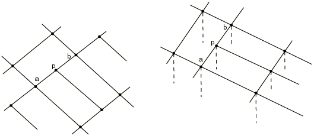

##### 输入数据

给出节点*p*、*a*和*b*，如图[图35.2.2-1](pt08ch35s02aus130.md#pmpc-linear)所示。

| **输入文件用法：** | ``` [*MPC](../key/key-link.md#usb-kws-mmpc) LINEAR, *p*, *a*, *b* ``` |
| --- | --- |

| **Abaqus/CAE用法：** | Abaqus/CAE不支持网格细化多点约束。 |
| --- | --- |

#### 使用MPC类型QUADRATIC

MPC类型QUADRATIC是二阶单元网格细化的标准方法。此MPC类型仅在Abaqus/Standard中可用。

此MPC约束节点*p*处（其中*p*是或）的每个自由度，使其从节点*a*、*b*和*c*处的相应自由度二次插值（图[图35.2.2-2](pt08ch35s02aus130.md#pmpc-quadratic)）。对于耦合温度-位移、耦合热电结构或孔隙压力单元，仅约束位移自由度。

**图35.2.2-2** QUADRATIC类型MPC。


##### 输入数据

给出节点*p*、*a*、*b*和*c*，如图[图35.2.2-2](pt08ch35s02aus130.md#pmpc-quadratic)所示，其中*p*是或。

| **输入文件用法：** | ``` [*MPC](../key/key-link.md#usb-kws-mmpc) QUADRATIC, *p*, *a*, *b*, *c* ``` |
| --- | --- |

| **Abaqus/CAE用法：** | Abaqus/CAE不支持网格细化多点约束。 |
| --- | --- |

#### 使用MPC类型BILINEAR

MPC类型BILINEAR是三维一阶实体单元网格细化的标准方法。此MPC类型仅在Abaqus/Standard中可用。

此MPC约束节点*p*处的每个自由度，使其从节点*a*、*b*、*c*和*d*处的相应自由度双线性插值（图[图35.2.2-3](pt08ch35s02aus130.md#pmpc-bilinear)）。

**图35.2.2-3** BILINEAR类型MPC。


##### 输入数据

给出节点*p*、*a*、*b*、*c*和*d*，如图[图35.2.2-3](pt08ch35s02aus130.md#pmpc-bilinear)所示。

| **输入文件用法：** | ``` [*MPC](../key/key-link.md#usb-kws-mmpc) BILINEAR, *p*, *a*, *b*, *c*, *d* ``` |
| --- | --- |

| **Abaqus/CAE用法：** | Abaqus/CAE不支持网格细化多点约束。 |
| --- | --- |

#### 使用MPC类型C BIQUAD

MPC类型C BIQUAD是三维二阶实体单元网格细化的标准方法。此MPC类型仅在Abaqus/Standard中可用。

此MPC约束节点*p*处的每个自由度，使其从八个节点*a*、*b*、*c*、*d*、*e*、*f*、*g*和*h*处的相应自由度通过约束双二次函数进行插值（图[图35.2.2-4](pt08ch35s02aus130.md#pmpc-cbiquadratic)）。对于耦合温度-位移、耦合热电结构或孔隙压力单元，仅约束位移自由度。

**图35.2.2-4** C BIQUAD类型MPC。

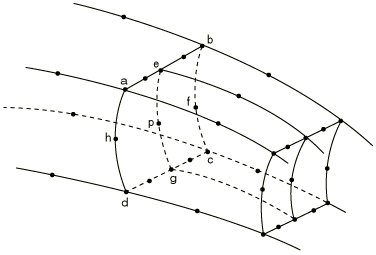

##### 输入数据

给出节点*p*、*a*、*b*、*c*、*d*、*e*、*f*、*g*和*h*，如图[图35.2.2-4](pt08ch35s02aus130.md#pmpc-cbiquadratic)所示。

| **输入文件用法：** | ``` [*MPC](../key/key-link.md#usb-kws-mmpc) C BIQUAD, *p*, *a*, *b*, *c*, *d*, *e*, *f*, *g*, *h* ``` |
| --- | --- |

| **Abaqus/CAE用法：** | Abaqus/CAE不支持网格细化多点约束。 |
| --- | --- |

#### 使用MPC类型P LINEAR和T LINEAR

P LINEAR MPC可与QUADRATIC MPC结合用于二阶完全耦合孔隙流体流-位移单元的网格细化。

T LINEAR MPC可与QUADRATIC MPC结合用于二阶完全耦合温度-位移和完全耦合热电结构单元的网格细化。

这些MPC类型仅在Abaqus/Standard中可用。

这些MPC约束节点*p*处的孔隙压力（P LINEAR）或温度（T LINEAR）自由度，使其从节点*a*和*b*处的自由度线性插值（图[图35.2.2-5](pt08ch35s02aus130.md#pmpc-plinear)）。

**图35.2.2-5** P LINEAR和T LINEAR MPC。

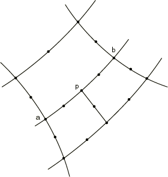

##### 输入数据

给出节点*p*、*a*和*b*，如图[图35.2.2-5](pt08ch35s02aus130.md#pmpc-plinear)所示。

| **输入文件用法：** | 使用以下选项定义P LINEAR MPC： |
| --- | --- |
|  | ``` [*MPC](../key/key-link.md#usb-kws-mmpc) P LINEAR, *p*, *a*, *b* ``` 使用以下选项定义T LINEAR MPC：``` [*MPC](../key/key-link.md#usb-kws-mmpc) T LINEAR, *p*, *a*, *b* ``` |

| **Abaqus/CAE用法：** | Abaqus/CAE不支持网格细化多点约束。 |
| --- | --- |

#### 使用MPC类型P BILINEAR和T BILINEAR

P BILINEAR MPC可与C BIQUAD MPC结合用于三维孔隙流体流-位移单元的网格细化。

T BILINEAR MPC可与C BIQUAD MPC结合用于三维完全耦合温度-位移和完全耦合热电结构单元的网格细化。

这些MPC类型仅在Abaqus/Standard中可用。

这些MPC约束节点*p*处的孔隙压力（P BILINEAR）或温度（T BILINEAR），使其从节点*a*、*b*、*c*和*d*处的孔隙压力或温度双线性插值（图[图35.2.2-6](pt08ch35s02aus130.md#pmpc-pbilinear)）。

**图35.2.2-6** P BILINEAR和T BILINEAR MPC。


##### 输入数据

给出节点*p*、*a*、*b*、*c*和*d*，如图[图35.2.2-6](pt08ch35s02aus130.md#pmpc-pbilinear)所示。

| **输入文件用法：** | 使用以下选项定义P BILINEAR MPC： |
| --- | --- |
|  | ``` [*MPC](../key/key-link.md#usb-kws-mmpc) P BILINEAR, *p*, *a*, *b*, *c*, *d* ``` 使用以下选项定义T BILINEAR MPC：``` [*MPC](../key/key-link.md#usb-kws-mmpc) T BILINEAR, *p*, *a*, *b*, *c*, *d* ``` |

| **Abaqus/CAE用法：** | Abaqus/CAE不支持网格细化多点约束。 |
| --- | --- |

### 用于连接和关节的MPC

| BEAM | 在两个节点之间提供刚性梁，将第一个节点的位移和旋转约束到第二个节点的位移和旋转，对应于两个节点之间存在刚性梁。 |
| --- | --- |
| CYCLSYM(S) | 约束节点以在模型中施加循环对称。 |
| ELBOW(S) | 将ELBOW31或ELBOW32单元的两个节点约束在一起，其中横截面方向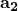发生变化（参见["具有变形横截面的管道和弯头：弯头单元，" 第29.5.1节](pt06ch29s05alm15.md)）。 |
| LINK | 在两个节点之间提供销钉刚性链接，以保持两个节点之间的距离恒定。修改第一个节点的位移以强制执行此约束。如果存在节点的旋转，则不参与此约束。 |
| PIN | 在两个节点之间提供销钉关节。此MPC使位移相等，但如果存在旋转，则使旋转彼此独立。 |
| REVOLUTE(S) | 提供旋转关节。 |
| SLIDER | 将节点保持在由另外两个节点定义的直线上，但允许沿线条移动的可能性，并允许线条改变长度。 |
| TIE | 使两个节点处的所有活动自由度相等。 |
| UNIVERSAL(S) | 提供万向关节。 |
| V LOCAL(S) | 允许约束节点处的速度以在局部体轴系中定义的第三个节点处的速度分量表示。这些局部速度分量可以被约束，从而在旋转体轴系中提供规定的速度边界条件。 |

有关这些用于连接和关节的MPC的基于单元的版本，请参见["连接器：概述，" 第31.1.1节](pt06ch31s01abo28.md)。

#### 使用MPC类型BEAM

MPC类型BEAM在两个节点之间提供刚性梁，将第一个节点的位移和旋转约束到第二个节点的位移和旋转，对应于两个节点之间存在刚性梁。

**图35.2.2-7** BEAM类型MPC。

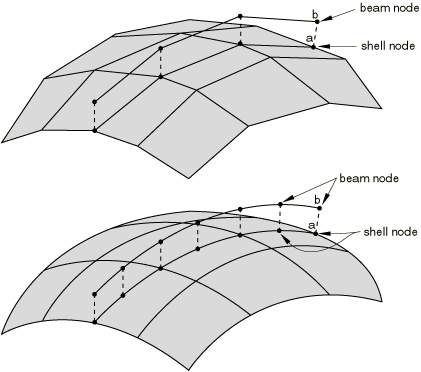

##### 输入数据

给出节点*a*和*b*，如图[图35.2.2-7](pt08ch35s02aus130.md#pmpc-lin-beam)所示。

| **输入文件用法：** | ``` [*MPC](../key/key-link.md#usb-kws-mmpc) BEAM, *a*, *b* ``` |
| --- | --- |

| **Abaqus/CAE用法：** | 使用以下选项之一： |
| --- | --- |
|  | 相互作用模块：**创建连接器截面**：选择**MPC**作为**连接类别**和**Beam**作为**MPC类型** 相互作用模块：**创建约束**：**MPC约束**；选择**Beam**作为**MPC类型** |

##### 将梁加强件约束到壳

使用梁作为壳上加强件的一般方法是用单独的节点定义梁和壳单元。然后可以使用BEAM类型MPC将这些节点相互约束。

在适用时，更经济的方法是为梁节点和壳节点使用相同的节点，然后在梁截面数据中定义梁横截面中心的偏移。[图35.2.2-8](pt08ch35s02aus130.md#pmpc-stiff-shell)显示连接到壳上的T形加强件，使用I梁横截面。这是通过将*l*（参见["梁横截面库，" 第29.3.9节](pt06ch29s03abm01.md)）设置为节点与下翼缘底面之间的距离，并将上翼缘的厚度设置为零来实现的。此方法可用于所有使用TRAPEZOID、I或ARBITRARY梁截面的梁单元。

**图35.2.2-8** 加强壳。


#### 使用MPC类型CYCLSYM

MPC类型CYCLSYM用于在循环对称结构的径向面（约束循环对称结构的径向面）上施加适当的约束（图[图35.2.2-9](pt08ch35s02aus130.md#pmpc-cyclsym)）。此MPC类型仅在Abaqus/Standard中可用。

MPC类型CYCLSYM通过使两个节点（*a*和*b*）处的径向、周向和轴向位移分量（以及旋转，如果活跃）相等来施加循环对称。对称轴可由另外两个额外节点（*c*和*d*）的原始坐标定义，这些节点不需要连接到结构中的任何单元。标量自由度（如温度）被设为相等。

**图35.2.2-9** MPC类型CYCLSYM。

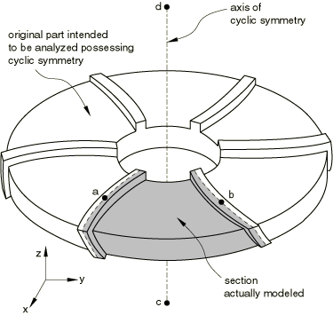

##### 输入数据

给出节点*a*、*b*和（可选）节点*c*和/或*d*，它们定义对称轴，如图[图35.2.2-9](pt08ch35s02aus130.md#pmpc-cyclsym)所示。节点集名称可以用来代替节点*a*和*b*。如果既未给出*c*也未给出*d*，则全局*z*轴被视为循环对称轴。如果仅给出节点*c*，则对称轴通过*c*并平行于全局*z*轴。因此，在二维情况下不需要节点*d*。

| **输入文件用法：** | ``` [*MPC](../key/key-link.md#usb-kws-mmpc) CYCLSYM, *a*, *b*, *c*, *d* ``` |
| --- | --- |

| **Abaqus/CAE用法：** | Abaqus/CAE不支持循环对称多点约束。 |
| --- | --- |

#### 使用MPC类型ELBOW

MPC类型ELBOW将ELBOW31或ELBOW32单元的两个节点约束在一起，其中横截面方向发生变化（参见["具有变形横截面的管道和弯头：弯头单元，" 第29.5.1节](pt06ch29s05alm15.md)）。此MPC类型仅在Abaqus/Standard中可用。

**图35.2.2-10** ELBOW类型MPC。

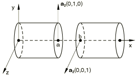

##### 输入数据

给出节点*a*和*b*，如图[图35.2.2-10](pt08ch35s02aus130.md#pmpc-elbow)所示。

| **输入文件用法：** | ``` [*MPC](../key/key-link.md#usb-kws-mmpc) ELBOW, *a*, *b* ``` |
| --- | --- |

| **Abaqus/CAE用法：** | 使用以下选项之一： |
| --- | --- |
|  | 相互作用模块：**创建连接器截面**：选择**MPC**作为**连接类别**和**Elbow**作为**MPC类型** 相互作用模块：**创建约束**：**MPC约束**；选择**Elbow**作为**MPC类型** |

#### 使用MPC类型LINK

MPC类型LINK在两个节点之间提供销钉刚性链接，以保持节点之间的距离恒定（图[图35.2.2-11](pt08ch35s02aus130.md#pmpc-link)）。修改第一个节点的位移以强制执行此约束。如果存在节点的旋转，则不参与此约束。

**图35.2.2-11** MPC类型LINK。

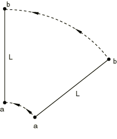

##### 输入数据

给出节点*a*和*b*，如图[图35.2.2-11](pt08ch35s02aus130.md#pmpc-link)所示。

| **输入文件用法：** | ``` [*MPC](../key/key-link.md#usb-kws-mmpc) LINK, *a*, *b* ``` |
| --- | --- |

| **Abaqus/CAE用法：** | 使用以下选项之一： |
| --- | --- |
|  | 相互作用模块：**创建连接器截面**：选择**MPC**作为**连接类别**和**Link**作为**MPC类型** 相互作用模块：**创建约束**：**MPC约束**；选择**Link**作为**MPC类型** |

#### 使用MPC类型PIN

MPC类型PIN在两个节点之间提供销钉关节。此MPC使全局位移相等，但如果存在旋转，则使旋转彼此独立（图[图35.2.2-12](pt08ch35s02aus130.md#pmpc-pin)）。

**图35.2.2-12** MPC类型PIN。

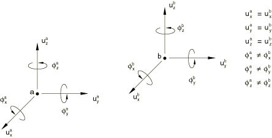

##### 输入数据

给出节点*a*和*b*，如图[图35.2.2-12](pt08ch35s02aus130.md#pmpc-pin)所示。

| **输入文件用法：** | ``` [*MPC](../key/key-link.md#usb-kws-mmpc) PIN, *a*, *b* ``` |
| --- | --- |

| **Abaqus/CAE用法：** | 使用以下选项之一： |
| --- | --- |
|  | 相互作用模块：**创建连接器截面**：选择**MPC**作为**连接类别**和**Pin**作为**MPC类型** 相互作用模块：**创建约束**：**MPC约束**；选择**Pin**作为**MPC类型** |

#### 使用MPC类型REVOLUTE

此MPC类型仅在Abaqus/Standard中可用。

旋转关节是一种关节，允许两个节点围绕在运动期间旋转的轴相对旋转（图[图35.2.2-13](pt08ch35s02aus130.md#pmpc-revolute)）。关节的轴在初始配置中定义为从节点*b*到节点*c*的线。如果这些节点重合，则假定轴为全局*z*轴。关节轴的旋转是节点*b*的旋转。

关节中的相对旋转是一个变量，存储为节点*c*上的自由度6。此自由度可以与模型中的其他单元一起使用，但应谨慎使用，因为自由度6的使用非标准。例如，SPRING1单元（接地弹簧）可以连接到此自由度。由于自由度衡量的是*相对*旋转，此弹簧将成为节点*a*和*b*之间的扭转弹簧。

节点*a*处的位移不被REVOLUTE MPC约束为与节点*b*处的位移相同。因此，关节定义通常必须通过在节点*a*和*b*之间使用PIN类型MPC或在这两个节点之间使用合适的刚度单元来完成。

["旋转MPC验证：曲柄的旋转，" Abaqus基准指南第1.3.8节](../bmk/bmk-link.md#bmk-anl-revolutempc)中提供了旋转关节和REVOLUTE MPC应用的示例。有关旋转关节的更多详细信息，请参见["旋转关节，" Abaqus理论指南第6.6.3节](../stm/stm-link.md#stm-ldc-revolutempc)。

**图35.2.2-13** 旋转关节。

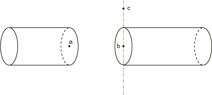

##### 输入数据

给出节点*a*、*b*和*c*，如图[图35.2.2-13](pt08ch35s02aus130.md#pmpc-revolute)所示。节点*c*上的自由度6定义了节点*a*和*b*之间的*相对*旋转；因此，此自由度不符合Abaqus中自由度的标准约定。

| **输入文件用法：** | ``` [*MPC](../key/key-link.md#usb-kws-mmpc) REVOLUTE, *a*, *b*, *c* ``` |
| --- | --- |

| **Abaqus/CAE用法：** | Abaqus/CAE不支持旋转关节多点约束。 |
| --- | --- |

#### 使用MPC类型SLIDER

MPC类型SLIDER将节点保持在由另外两个节点定义的直线上，但允许沿线条移动的可能性，并允许线条改变长度。

当从多层实体单元过渡到壳时，通常希望将实体单元自由边缘上的节点约束为保持在直线上。（此约束与壳理论一致。）SLIDER MPC可以执行此功能而不约束实体层的"变薄"行为。然后使用SS LINEAR MPC将此壳单元连接到该边缘。

在Abaqus/Standard中，当SLIDER MPC与壳-实体MPC之一（SS LINEAR、SS BILINEAR或SSF BILINEAR）一起使用时，它必须跟在壳-实体MPC之后。

##### 输入数据

对于图[图35.2.2-14](pt08ch35s02aus130.md#pmpc-slider-shell-solid)和[图35.2.2-15](pt08ch35s02aus130.md#pmpc-slider-tel-beam)中所示的每个节点*p*，为每行应保持直线的节点给出节点*p*、*a*和*b*。对于图[图35.2.2-14](pt08ch35s02aus130.md#pmpc-slider-shell-solid)中所示的每个节点*q*，给出节点*q*、*c*和*d*，依此类推，每行应保持直线的节点。

| **输入文件用法：** | ``` [*MPC](../key/key-link.md#usb-kws-mmpc) SLIDER, *p*, *a*, *b* SLIDER, *q*, *c*, *d* ``` |
| --- | --- |

| **Abaqus/CAE用法：** | Abaqus/CAE不支持滑块多点约束。 |
| --- | --- |

**图35.2.2-14** 在壳-实体交点处使用的SLIDER类型MPC。

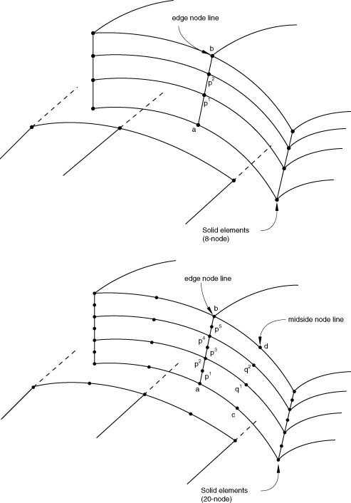

**图35.2.2-15** 用于建模伸缩梁的SLIDER类型MPC。

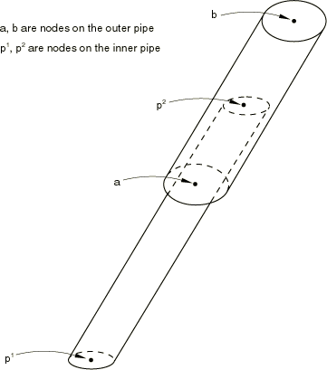

#### 使用MPC类型TIE

MPC类型TIE使两个节点处的全局位移和旋转以及所有其他活动自由度相等。如果两个节点处活动的自由度不同，则只有共同的自由度被约束。

MPC类型TIE通常用于在网格的两个相应节点要完全连接（"拉链"网格）时连接网格的两个部分。例如，当在圆柱体上生成网格时，0度和360度处的节点的解必须相同。这可以通过对其中一个网格极端的节点重新编号，或对每对相应节点使用此MPC来完成（图[图35.2.2-16](pt08ch35s02aus130.md#pmpc-tie)）。

**图35.2.2-16** TIE MPC使用示例。


##### 输入数据

给出节点*a*和*b*，如图[图35.2.2-16](pt08ch35s02aus130.md#pmpc-tie)所示。

| **输入文件用法：** | ``` [*MPC](../key/key-link.md#usb-kws-mmpc) TIE, *a*, *b* ``` |
| --- | --- |

| **Abaqus/CAE用法：** | 使用以下选项之一： |
| --- | --- |
|  | 相互作用模块：**创建连接器截面**：选择**MPC**作为**连接类别**和**Tie**作为**MPC类型** 相互作用模块：**创建约束**：**MPC约束**；选择**Tie**作为**MPC类型** |

#### 使用MPC类型UNIVERSAL

此MPC类型仅在Abaqus/Standard中可用。

万向关节是一种关节，允许两个节点围绕两个轴相对旋转，这两个轴刚性连接，每个轴随关节一端的旋转而旋转（图[图35.2.2-17](pt08ch35s02aus130.md#pmpc-universal)）。这种关节可用于耦合具有角度偏差的两个轴。关节的第一轴（连接到节点*b*）在初始配置中定义为从节点*b*到节点*c*的线。如果这些节点重合，则假定轴为全局*z*轴。关节的第二轴垂直于第一轴，位于由第一轴和节点*d*定义的平面内。

关节中的相对旋转存储为节点*c*和*d*上的自由度6。这些自由度可以与模型中的其他单元一起使用，但应谨慎使用，因为自由度6的使用非标准。例如，SPRING1单元（接地弹簧）可以连接到此自由度之一。由于自由度衡量的是*相对*旋转，此弹簧将成为约束该相对旋转分量的扭转弹簧。

节点*a*处的位移不被UNIVERSAL MPC约束为与节点*b*处的位移相同。因此，关节定义通常必须通过在节点*a*和*b*之间使用PIN类型MPC或在这两个节点之间使用合适的刚度单元来完成。

有关万向关节的更多详细信息，请参见["万向关节，" Abaqus理论指南第6.6.4节](../stm/stm-link.md#stm-ldc-universalmpc)。

**图35.2.2-17** 万向关节。


##### 输入数据

给出节点*a*、*b*、*c*和*d*，如图[图35.2.2-17](pt08ch35s02aus130.md#pmpc-universal)所示。节点*c*和*d*上的自由度6定义了关节中的*相对*旋转；因此，这些自由度不符合Abaqus中自由度的标准约定。

| **输入文件用法：** | ``` [*MPC](../key/key-link.md#usb-kws-mmpc) UNIVERSAL, *a*, *b*, *c*, *d* ``` |
| --- | --- |

| **Abaqus/CAE用法：** | Abaqus/CAE不支持万向关节多点约束。 |
| --- | --- |

#### 使用MPC类型V LOCAL

此MPC类型仅在Abaqus/Standard中可用。

如图[图35.2.2-18](pt08ch35s02aus130.md#pmpc-vlocal)所示，MPC类型V LOCAL约束与第一个节点（*a*）的自由度1、2和3相关的速度分量，使其等于沿局部旋转方向的第三个节点（*c*）处的速度分量。这些局部方向根据第二个节点（*b*）处的旋转进行旋转。在初始配置中，第一个局部方向是从MPC的第二个节点到第三个节点的方向（从*b*到*c*，如图[图35.2.2-18](pt08ch35s02aus130.md#pmpc-vlocal)中的箭头所示），或者如果这些节点重合，则为全局*z*轴。其他局部方向则由Abaqus此类方向的标准约定定义（参见["约定，" 第1.2.2节](pt01ch01s02aus02.md)）。在[图35.2.2-18](pt08ch35s02aus130.md#pmpc-vlocal)中，此MPC以相同方式应用于节点*d*、*e*和*f*。

MPC类型V LOCAL可用于在模型中定义复杂的运动。例如，MPC可用于在动态分析中建模汽车的转向，其结果惯性效应是人们感兴趣的。有关局部速度约束的更多详细信息，请参见["局部速度约束，" Abaqus理论指南第6.6.5节](../stm/stm-link.md#stm-ldc-vlocalmpc)。

**图35.2.2-18** 局部速度约束。

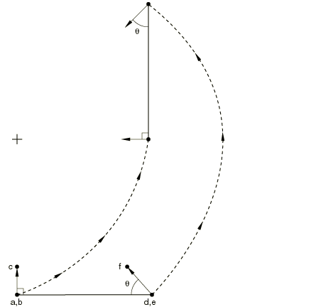

##### 输入数据

给出其速度分量被约束的节点（[图35.2.2-18](pt08ch35s02aus130.md#pmpc-vlocal)中的节点*a*或*d*）、其旋转定义局部方向旋转的节点（[图35.2.2-18](pt08ch35s02aus130.md#pmpc-vlocal)中的节点*b*或*e*），以及其速度分量在这些局部方向中的节点（[图35.2.2-18](pt08ch35s02aus130.md#pmpc-vlocal)中的节点*c*或*f*）。节点*a*和*b*（或*d*和*e*）可以相同。

| **输入文件用法：** | ``` [*MPC](../key/key-link.md#usb-kws-mmpc) V LOCAL, *a*, *b*, *c* V LOCAL, *d*, *e*, *f* ``` |
| --- | --- |

| **Abaqus/CAE用法：** | Abaqus/CAE不支持局部速度分量多点约束。 |
| --- | --- |

### 用于过渡的MPC

| SS LINEAR | 约束壳节点到实体节点线，用于线性单元（S4、S4R、C3D8、C3D8R、SAX1、CAX4等）。 |
| --- | --- |
| SS BILINEAR(S) | 约束壳节点到实体节点线，用于二次单元的边缘线（S8R、S8R5、C3D20、C3D20R、SAX2、CAX8等）。 |
| SSF BILINEAR(S) | 将二次壳单元（S8R、S8R5）的边中节点约束到20节点砖体（C3D20、C3D20R等）的面中线。 |

#### 建模壳到实体单元过渡

SLIDER、SS LINEAR、SS BILINEAR和SSF BILINEAR MPC允许从壳单元建模到实体单元建模在壳曲面上进行过渡。此建模技术可用于在壳-实体交点或其他不连续处获得解，在这些地方局部建模应使用完整的三维理论，但结构的其他部分可以建模为壳。壳到实体子模型功能（["子模型：概述，" 第10.2.1节](pt04ch10s02aus60.md)）和基于曲面的壳到实体耦合约束（["壳到实体耦合，" 第35.3.3节](pt08ch35s03aus134.md)）也可用于在这种情况下以更少的建模工作获得更准确的解。

在Abaqus/Standard中，MPC用法假定壳和实体单元之间的界面是一个曲面，包含沿着网格交线方向的壳法线，以便界面法线方向上实体网格侧的节点线是直线。（图[图35.2.2-14](pt08ch35s02aus130.md#pmpc-slider-shell-solid)和[图35.2.2-19](pt08ch35s02aus130.md#pmpc-sslinear)至[图35.2.2-20](pt08ch35s02aus130.md#pmpc-ssbilinear)中的线*a*、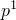、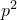、…、*b*应为直线。）它还假定实体单元的节点在界面曲面上均匀分布，如图[图35.2.2-14](pt08ch35s02aus130.md#pmpc-slider-shell-solid)和[图35.2.2-19](pt08ch35s02aus130.md#pmpc-sslinear)至[图35.2.2-20](pt08ch35s02aus130.md#pmpc-ssbilinear)所示。对于边缘上的每个壳节点，酌情使用MPC类型SS LINEAR、SS BILINEAR或SSF BILINEAR，将壳节点约束到贯穿厚度对应的实体单元节点线或面。然后，使用SLIDER MPC将贯穿厚度上每个内部节点约束为保持在由该线底部和顶部节点定义的直线上。有关示例，请参见["多点约束，" Abaqus验证指南第5.1.17节](../ver/ver-link.md#ver-msc-mpc)。

SS BILINEAR和SSF BILINEAR MPC不适用于可变节点实体单元（C3D27、C3D27H、C3D27R和C3D27RH）。

在Abaqus/Standard中，MPC类型SS LINEAR、SS BILINEAR和SSF BILINEAR消除壳节点处的所有位移分量和两个旋转分量，SLIDER MPC消除界面处每个内部实体单元节点的两个位移分量。因此，界面处所需的任何边界条件（如壳/实体界面与对称平面相交时所需的边界条件）应仅施加到界面实体单元侧的顶部和底部节点。

#### 使用MPC类型SS LINEAR

MPC类型SS LINEAR将壳角节点约束到线性单元实体单元边缘节点线（S4、S4R或S4R5；C3D8、C3D8R；SAX1；CAX4；等）。

约束的节点不需要正好位于这些线上，但建议它们靠近线条以获得有意义的结果。

**图35.2.2-19** SS LINEAR类型MPC。4节点壳到8节点砖体。

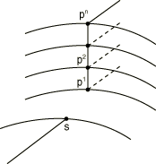

##### 输入数据

给出壳节点*S*，然后是贯穿实体单元网格厚度的相应线上的节点列表。在Abaqus/Explicit中，只能给出两个实体节点。参考[图35.2.2-19](pt08ch35s02aus130.md#pmpc-sslinear)，在Abaqus/Standard中给出*S*、、、…、，在Abaqus/Explicit中给出*S*、、，其中。壳节点号必须与实体网格节点号不同。

| **输入文件用法：** | 在Abaqus/Standard中使用以下选项： |
| --- | --- |
|  | ``` [*MPC](../key/key-link.md#usb-kws-mmpc) SS LINEAR, *S*, , , …,  ``` 在Abaqus/Explicit中使用以下选项：``` [*MPC](../key/key-link.md#usb-kws-mmpc) SS LINEAR, *S*, ,  ``` |

| **Abaqus/CAE用法：** | Abaqus/CAE不支持过渡多点约束。 |
| --- | --- |

#### 使用MPC类型SS BILINEAR

MPC类型SS BILINEAR将二次壳单元（S8R、S8R5）的角节点约束到20节点砖体的边缘节点线。此MPC类型仅在Abaqus/Standard中可用。

约束的节点不需要正好位于线上，但建议它靠近线条以获得有意义的结果。

**图35.2.2-20** SS BILINEAR类型MPC。8节点壳角到20节点砖体边缘。

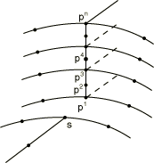

##### 输入数据

给出壳节点*S*，然后是贯穿实体单元网格厚度的相应线上的节点列表。参考[图35.2.2-20](pt08ch35s02aus130.md#pmpc-ssbilinear)，给出*S*、、、…、。壳节点号必须与实体网格节点号不同。

| **输入文件用法：** | ``` [*MPC](../key/key-link.md#usb-kws-mmpc) SS BILINEAR, *S*, , , …,  ``` |
| --- | --- |

| **Abaqus/CAE用法：** | Abaqus/CAE不支持过渡多点约束。 |
| --- | --- |

#### 使用MPC类型SSF BILINEAR

MPC类型SSF BILINEAR将二次壳单元（S8R、S8R5）的边中节点约束到实体20节点砖体的面中节点线。此MPC类型仅在Abaqus/Standard中可用。

约束的节点不需要正好位于线上，但建议它靠近线条以获得有意义的结果。

**图35.2.2-21** SSF BILINEAR类型MPC。8节点壳边中到20节点砖体面。

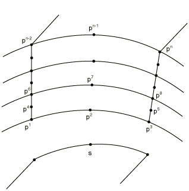

##### 输入数据

给出壳节点*S*，然后按顺序、、…、给出实体面上的节点列表，如图[图35.2.2-21](pt08ch35s02aus130.md#pmpc-ssfbilinear)所示。

| **输入文件用法：** | ``` [*MPC](../key/key-link.md#usb-kws-mmpc) SSF BILINEAR, *S*, , , …,  ``` |
| --- | --- |

| **Abaqus/CAE用法：** | Abaqus/CAE不支持过渡多点约束。 |
| --- | --- |


