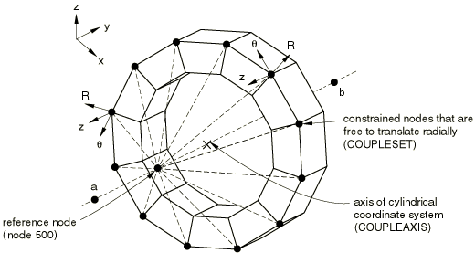

# 35.2.3 运动学耦合约束


**产品：** Abaqus/Standard   

##### **参考资料**

- ["运动约束：概述，" 第35.1.1节](pt08ch35s01abo32.md)
- [*KINEMATIC COUPLING](../key/key-link.md#usb-kws-mkinematiccoupling)

### 概述

运动学耦合约束：
- 将一组节点的运动限制到由参考节点定义的刚体运动；
- 仅能应用于约束节点上用户指定的特定自由度；
- 可以在约束节点的局部坐标系中指定；以及
- 可用于几何线性或非线性分析。

提供这种类型运动约束的首选方法在["耦合约束，" 第35.3.2节](pt08ch35s03aus133.md)中描述。

### 典型应用

运动学耦合约束在大量节点（"耦合"节点）被约束到单个节点的刚体运动且参与约束的自由度在局部坐标系中单独选择的情况下很有用。在许多此类情况下，MPC要么不可用，要么必须为每个约束节点单独规定。典型示例如[图35.2.3-1](pt08ch35s02aus131.md#pkinematic-wagonwheel)所示，其中运动学耦合约束用于为模型规定扭转运动而不约束径向运动。在其他应用中，运动学耦合约束可用于提供连续体和结构单元之间的耦合。

**图35.2.3-1** 用于在允许径向运动的同时向结构传递旋转的运动学耦合约束。



### 定义约束

运动学耦合约束需要指定参考节点、耦合节点以及这些节点处的约束自由度。参考节点同时具有平动和旋转自由度。

运动约束通过消除耦合节点处的自由度来施加。一旦耦合节点上的任何平动自由度组合被约束，额外的位移约束（如MPC、边界条件或其他运动学耦合定义）就不能应用于涉及运动学耦合约束的任何耦合节点。相同的限制也适用于旋转自由度。

| **输入文件用法：** | 约束所有可用自由度： |
| --- | --- |
|  | ``` [*KINEMATIC COUPLING](../key/key-link.md#usb-kws-mkinematiccoupling), REF NODE=*node* *coupling node number or node set* ``` 约束单个自由度：``` [*KINEMATIC COUPLING](../key/key-link.md#usb-kws-mkinematiccoupling), REF NODE=*node* *coupling node number or node set, dof* ``` 约束自由度范围：``` [*KINEMATIC COUPLING](../key/key-link.md#usb-kws-mkinematiccoupling), REF NODE=*node* *coupling node number or node set, first dof, last dof* ``` 要指定非连续列表的约束自由度，请在后续数据行上重复节点编号或节点集。例如，以下输入用于将节点10上的自由度1、2、3和6约束到参考节点5的运动：``` [*KINEMATIC COUPLING](../key/key-link.md#usb-kws-mkinematiccoupling), REF NODE=5 10, 1, 3 10, 6 ``` |

#### 平动自由度

通过消除耦合节点上指定的自由度来约束平动自由度。当指定所有平动自由度时，耦合节点跟随参考节点的刚体运动。

#### 旋转自由度

所选旋转自由度的所有组合都会产生与现有MPC类型相同的旋转行为。具体来说：
- 选择三个旋转自由度以及三个平动自由度等效于MPC类型BEAM。
- 选择两个旋转自由度等效于MPC类型REVOLUTE。
- 选择一个旋转自由度等效于MPC类型UNIVERSAL。

运动学耦合创建内部节点以强制执行与MPC类型REVOLUTE和UNIVERSAL等效的约束。这些节点具有与这些MPC类型中使用的附加节点相同的自由度，并包含在非线性分析的残差检查中。

#### 指定局部坐标系

耦合节点处的约束自由度可以在局部坐标系中指定，而不是（默认）全局坐标系（参见["方向，" 第2.2.5节](pt01ch02s02aus15.md)）。[图35.2.3-1](pt08ch35s02aus131.md#pkinematic-wagonwheel)说明使用运动学耦合约束的局部坐标系定义，将除一组节点的径向平移外的所有自由度约束到参考节点。在此示例中，定义了局部圆柱坐标系，其轴与结构轴重合。然后在此局部坐标系中指定耦合节点约束。在此示例中，约束节点连接到连续体单元；因此，只需指定平动自由度。

| **输入文件用法：** | ``` [*KINEMATIC COUPLING](../key/key-link.md#usb-kws-mkinematiccoupling), REF NODE=*node*, ORIENTATION=*name* ``` |
| --- | --- |
|  | 例如，以下输入用于指定[图35.2.3-1](pt08ch35s02aus131.md#pkinematic-wagonwheel)中所示的运动学耦合约束：``` [*ORIENTATION](../key/key-link.md#usb-kws-morientation), SYSTEM=CYLINDRICAL, NAME=COUPLEAXIS 0.0, -1.0, 0.0, 0.0, 1.0, 0.0 [*KINEMATIC COUPLING](../key/key-link.md#usb-kws-mkinematiccoupling), REF NODE=500, ORIENTATION=COUPLEAXIS COUPLESET, 2, 3 ``` |

### 约束方向和有限旋转

在几何非线性分析步骤中，无论约束的自由度是在全局坐标系还是在局部系统中指定，约束自由度的坐标系都将随参考节点旋转。因此，[图35.2.3-1](pt08ch35s02aus131.md#pkinematic-wagonwheel)所示的约束将在结构的任意旋转过程中实现自由的径向运动。在这种情况下，径向运动定义为垂直于结构轴的运动（在未变形配置中由图中的点*a*和*b*定义），该轴随参考节点旋转。因此，[图35.2.3-1](pt08ch35s02aus131.md#pkinematic-wagonwheel)中所示的自由径向膨胀不会参考参考节点一般旋转时平行于全局*y*轴的轴，而是参考随结构旋转的轴。约束方向的旋转不受约束自由度选择的影响。


