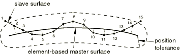
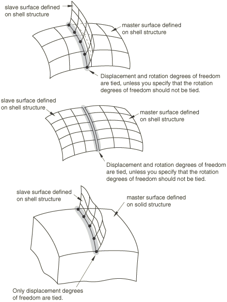
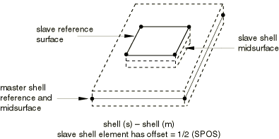
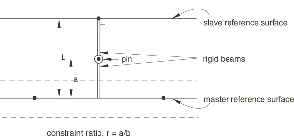

# 35.3.1 网格绑定约束


**产品：** Abaqus/Standard   Abaqus/Explicit   Abaqus/CAE   

##### **参考资料**

- ["曲面：概述，" 第2.3.1节](pt01ch02s03aus16.md)
- [*TIE](../key/key-link.md#usb-kws-mtie)
- ["定义绑定约束，" Abaqus/CAE用户指南第15.15.1节](../usi/usi-link.md#usi-itn-help-tied)
- ["使用接触和约束检测，" Abaqus/CAE用户指南第15.16节](../usi/usi-link.md#usi-itn-detectioneditor)

### 概述

基于曲面的绑定约束：
- 在整个模拟期间将两个曲面绑定在一起；
- 仅能与基于曲面的约束定义一起使用；
- 可用于机械、耦合温度-位移、耦合热电结构、声压、耦合声压-位移、耦合孔隙压力-位移、耦合热电或热传递模拟；
- 也可用于在曲面上创建约束，使其跟随三维梁的运动；
- 对于网格细化目的有用，特别是对于三维问题；
- 允许模型内网格密度的快速过渡；
- 将从属曲面上的每个节点约束为具有与主曲面上其最接近点相同的运动以及相同的温度、孔隙压力、声压或电势值；
- 默认考虑曲面下壳单元的初始厚度和偏移；以及
- 在可能的情况下消除被约束的从属曲面节点的自由度。

### 为一对曲面定义绑定约束

基于曲面的绑定约束可用于使一对曲面的平动和旋转运动以及所有其他活动自由度相等。默认情况下，如下所述，节点仅在曲面彼此接近的地方绑定。约束中的一个曲面被指定为从属曲面；另一个曲面是主曲面。必须为该约束分配一个名称，该名称可在Abaqus/CAE后处理中使用。

| **输入文件用法：** | ``` [*TIE](../key/key-link.md#usb-kws-mtie), NAME=*name* *slave_surface_name*, *master_surface_name* ``` |
| --- | --- |

| **Abaqus/CAE用法：** | 相互作用模块：**创建约束**：**绑定** |
| --- | --- |

### 定义要约束的曲面

基于单元或基于节点的曲面都可以用作从属曲面。任何曲面类型（基于单元、基于节点或解析）都可以用作主曲面。根据使用的绑定公式以及分析是在Abaqus/Standard还是Abaqus/Explicit中进行，您可能需要考虑一些曲面限制。提供了两种绑定公式：面-面公式（默认在Abaqus/Standard中使用）和更传统的节点-面公式（默认在Abaqus/Explicit中使用）；这些公式在本节后面详细讨论。[表35.3.1-1](pt08ch35s03aus132.md#table-tie-characteristics)和[表35.3.1-2](pt08ch35s03aus132.md#table-tie-surface-characteristics)提供了不同公式和分析代码的曲面限制比较。

**表35.3.1-1** 基于曲面的绑定公式特性比较。
| 绑定公式 | 优化应力精度 | 允许基于节点的曲面 | 允许刚性和可变形子区域的混合物 | 主从曲面之间共享的节点/面片的处理 |
| --- | --- | --- | --- | --- |
| 面-面（Abaqus/Standard或Abaqus/Explicit） | 是 | 回退到节点-面公式 | 否 | 从从属中消除 |
| Abaqus/Standard中的节点-面 | 否 | 是 | 否 | 从从属中消除 |
| Abaqus/Explicit中的节点-面 | 否 | 是 | 是 | 从主属中消除 |

**表35.3.1-2** 基于曲面的绑定公式允许的基于单元的曲面特性比较。
| 绑定公式 | 曲面特性（是=允许，否=不允许） |
| --- | --- |
| 双侧 | 不连续 | T交叉 | 基于边缘 |
| 面-面（Abaqus/Standard或Abaqus/Explicit） | 主：是从：否 | 主：是从：否 | 主：否从：是 | 如果任一曲面是基于边缘的，则回退到节点-面公式 |
| Abaqus/Standard中的节点-面 | 主：是从：否 | 主：是从：否 | 主：否从：是 | 主：是从：否 |
| Abaqus/Explicit中的节点-面 | 主：是从：否 | 主：是从：否 | 主：是从：否 | 主：是从：否 |

面-面公式通常避免绑定界面处的应力噪声。如[表35.3.1-1](pt08ch35s03aus132.md#table-tie-characteristics)和[表35.3.1-2](pt08ch35s03aus132.md#table-tie-surface-characteristics)中所示，面-面公式只有少数曲面限制：该公式在使用基于节点或基于边缘的曲面时回退到节点-面公式。面-面公式不允许曲面的刚性和可变形部分的混合物，主曲面不得包含T交叉。从属和主曲面共享的任何节点将不会用面-面公式绑定。这些表中针对面-面公式的这些评论对Abaqus/Standard和Abaqus/Explicit都适用。

对于更传统的节点-面公式，与面-面公式相比，Abaqus/Standard适用额外的曲面限制，而Abaqus/Explicit适用更少的限制。Abaqus/Standard中节点-面绑定公式的主曲面连接的相对严格限制如[表35.3.1-2](pt08ch35s03aus132.md#table-tie-surface-characteristics)所示：主曲面必须是单连通的，不得包含复杂的交叉（如T交叉）（有关各种连接特性曲面的示例，请参见["在Abaqus/Standard中定义接触对，" 第36.3.1节](pt09ch36s03aus145.md)）。

Abaqus/Explicit中节点-面公式的差异在[表35.3.1-1](pt08ch35s03aus132.md#table-tie-characteristics)中很明显：可以使用部分刚性曲面，从属和主曲面的共享部分的处理是此情况特有的。如果配对曲面都是基于单元的或都是基于节点的，则在此情况下，主从属曲面之间共享的节点和面片会自动从主曲面中消除，从而可以将多个从属曲面（定义在模型的各个区域上）绑定到在整个模型上定义的公共主曲面。这是大型模型中定义绑定约束的便捷方法，因为它无需为每个曲面配对定义专门的主曲面；但是，您仍必须注意从属曲面不包含它们应绑定到的相对曲面的部分（例如，如果主从属曲面相同，则不会生成任何绑定约束）。在Abaqus/Explicit的节点-面公式中，附加到从属和主曲面之间公共节点的的所有面片被排除与从属节点绑定。有时当网格从一个单元类型过渡到另一个单元类型或从一个单元尺寸过渡到另一个单元尺寸时，两个区域之间的界面上可能存在公共节点。通常，在两个区域的界面上定义绑定约束以将两个网格缝合在一起。在这种情况下，公共节点可能会绑定到界面上的相邻面片，并可能由于绑定调整而导致不良的网格变形。避免不良网格变形的一种可能方法是，为绑定对指定非常小的位置容差。当从属和主曲面在网格过渡区域边界处存在公共节点时，可能出现的另一种情况是，公共节点附近的从属节点可能无法绑定。这是因为附加到公共节点的主面片被排除了。因此，必须注意确保不同网格区域中的元素在界面上不共享公共节点。对于所有此类公共节点，应定义占据相同物理位置的重复节点。

| **输入文件用法：** | 使用[*SURFACE*](../key/key-link.md#usb-kws-msurface)选项定义约束中使用的从属和主曲面（参见["曲面：概述，" 第2.3.1节](pt01ch02s03aus16.md)）： |
| --- | --- |
|  | ``` [*SURFACE*](../key/key-link.md#usb-kws-msurface), NAME=*slave_surface_name* [*SURFACE*](../key/key-link.md#usb-kws-msurface), NAME=*master_surface_name* ``` |

| **Abaqus/CAE用法：** | 在Abaqus/CAE中，当提示选择曲面时，可以在视口中直接选择一个或多个面。此外，您可以使用曲面工具集将面和边缘定义为曲面的集合。 |
| --- | --- |

### 指定要约束的从属节点子集

默认情况下，Abaqus使用位置容差标准根据从属节点与主曲面之间的距离确定被约束的节点。或者，您可以指定包含要约束的从属节点的节点集，而不考虑它们与主曲面的距离。

#### 使用位置容差标准

默认位置容差标准确保节点仅在从属和主曲面在初始配置中彼此接近的地方绑定。例如，考虑[图35.3.1-1](pt08ch35s03aus132.md#tietwocomponents)中所示的情况。曲面`Comp1_surf`和`Comp2_surf`分别定义为覆盖组件1和组件2的所有暴露面。这两个曲面可以用作绑定约束中的从属和主曲面，以将两个组件绑定在所需区域，因为只有两个曲面初始界面处的节点被绑定。

**图35.3.1-1** 要绑定在一起的两个组件的示例。


位置容差的默认值通常只需很少的努力就能产生所需的绑定约束。下面提供了曲面之间距离的计算和位置容差默认值的详细信息。您可以根据需要修改位置容差。

| **输入文件用法：** | 使用以下选项使用默认位置容差： |
| --- | --- |
|  | ``` [*TIE](../key/key-link.md#usb-kws-mtie) ``` 使用以下选项指定位置容差：``` [*TIE](../key/key-link.md#usb-kws-mtie), POSITION TOLERANCE=*distance* ``` |

| **Abaqus/CAE用法：** | 相互作用模块：**创建约束**：**绑定**：**位置容差**：**指定距离** |
| --- | --- |

##### 计算曲面之间的距离

以下因素影响特定从属节点的曲面距离计算：
- 壳厚度。默认情况下，曲面之间的距离计算考虑壳厚度和基于单元的从属或主曲面的偏移效应：距离是从曲面的实际顶部或底部（距离另一曲面更近的一侧）测量的。或者，您可以指定在距离计算中应忽略曲面厚度和偏移，这也对用于解析初始间隙的节点位置调整有影响（稍后讨论）。 | **输入文件用法：** | 使用以下选项在距离计算中忽略曲面厚度和偏移： | | --- | --- | | | ``` [*TIE](../key/key-link.md#usb-kws-mtie), NO THICKNESS ``` | | **Abaqus/CAE用法：** | 相互作用模块：**创建约束**：**绑定**：**排除壳单元厚度** | | --- | --- |
- 是否使用面-面或节点-面约束公式（见下文）。如果位置容差有效，则对于任一公式，如果从属节点处计算的曲面之间的距离不超过，则在从属节点处生成约束。如果将面-面约束公式与基于单元的从属曲面和不是基于节点的主曲面一起使用，则额外的从属节点可能被绑定，因为在此类情况下位置容差标准有以下补充：如果曲面之间的距离在形成小于30°角的从属面（或二维中的线段）的很大一部分内处于内，则附加到该面（或线段）的所有从属节点被视为满足位置容差。
- 所涉及曲面的类型（基于单元、基于节点或解析）。

##### 基于单元的主曲面的位置容差

对于基于单元的主曲面，默认位置容差对于节点-面和面-面绑定公式分别为主面片对角线长度的5%或10%。当使用基于单元的主曲面时，从属曲面上特定点处的曲面距离基于主曲面上的最近点（可能在主曲面的边缘上或面片内）。[图35.3.1-2](pt08ch35s03aus132.md#surfbasedtie-element)

**图35.3.1-2** 无厚度基于单元主曲面周围的容差区域。



显示了无厚度的示例：节点2-14满足节点-面和面-面约束公式的位置容差标准。端从属线段（即可连接节点1和2的线段和连接节点14和15的线段）的很大一部分在所示位置容差内，因此节点1和15也将满足面-面约束公式的位置容差标准，只是因为从属和主曲面之间的角度在那些位置略大于30°。

##### 基于节点的主曲面的位置容差

基于节点的主曲面的默认位置容差基于主曲面中节点之间的平均距离。特定从属节点的曲面之间的距离基于最近的 主节点。如果此距离小于位置容差，Abaqus将在从属节点、最近的主节点以及与从属节点类似接近的其他主节点之间创建绑定约束。对于绑定界面上不匹配的网格，从属和主节点之间的距离可能比曲面之间的"正常"距离大得多，这可能导致在使用基于节点的主曲面的位置容差标准时产生混淆。[图35.3.1-3](pt08ch35s03aus132.md#surfbasedtie-node)显示了容差区域如何在基于节点的主曲面周围定义。面-面约束公式在基于节点的主曲面上回退到节点-面约束公式。

**图35.3.1-3** 无厚度基于节点主曲面周围的容差区域。


##### 解析刚性主曲面的位置容差

对于基于单元的从属曲面和解析刚性主曲面之间的绑定约束，默认位置容差对于节点-面和面-面绑定公式分别为主从属面片对角线长度的5%或10%。对于基于节点的从属曲面和解析刚性主曲面之间的绑定约束，默认位置容差是从属节点之间典型距离的5%。当使用解析刚性主曲面时，从属曲面上特定点处的曲面距离基于主曲面上的最近点。

#### 直接指定被约束的节点

此方法允许您直接控制哪些从属节点被绑定。

| **输入文件用法：** | ``` [*TIE](../key/key-link.md#usb-kws-mtie), TIED NSET=*node_set_label* ``` |
| --- | --- |

| **Abaqus/CAE用法：** | 在Abaqus/CAE中不支持直接指定被约束的节点。 |
| --- | --- |

#### 绑定约束对中的未约束节点

如上所述，除非从属节点包含在绑定节点集中或在与主曲面距离容差范围内（在分析开始时），否则Abaqus不会将从属节点约束到主曲面。任何不满足这些条件的从属节点将在整个模拟期间保持未约束状态；它们永远不会作为绑定约束的一部分与主曲面相互作用。在机械模拟中，未约束的从属节点可以自由穿透主曲面，除非在从属节点和主曲面之间定义了接触。Abaqus/Explicit中的通用接触算法自动为绑定约束对的被约束节点-主曲面组合生成接触排除，但不会为约束位置容差外的节点生成此类接触排除。在热、声、电或孔隙压力模拟中，未约束的从属节点不会与主曲面交换热量、流体压力、电流或孔隙流体压力。

##### 确定哪些从属节点已被绑定以及哪些从属节点未被绑定

对于每个绑定约束对，Abaqus创建一个包含将被绑定的从属节点的节点集和一个包含将保持未约束的从属节点的节点集。这些节点集可在Abaqus/CAE的后处理期间显示，其列为内部节点集。

此外，Abaqus在数据（`.dat`）文件中打印一个表，列出每个从属节点以及它将被绑定到的主曲面节点（如果请求了模型定义数据，参见["控制写入数据文件的分析输入文件处理器信息量"中的"输出，" 第4.1.1节](pt02ch04s01aus38.md#usb-out-ooutput-data-control)）。如果无法为给定的从属节点形成约束，Abaqus/Standard会在数据文件中发出警告消息。

在Abaqus/Explicit中，您还可以请求两个节点场输出变量：TIEDSTATUS将帮助您识别被约束和未被约束的从属节点，TIEADJUST将帮助您可视化对节点执行的调整（参见["Abaqus/Explicit输出变量标识符，" 第4.2.2节](pt02ch04s02xbv01.md)）。作为从属以及主绑定了多个绑定定义中的从属节点的绑定节点显示为"已绑定"，无论它是作为从属节点还是作为主节点被绑定。

在使用基于曲面的绑定约束创建模型时，使用Abaqus提供的信息识别任何未约束的节点并对模型进行任何必要的修改以约束它们是很重要的。

### 约束旋转自由度

默认情况下，当旋转自由度存在于从属和主曲面上时，Abaqus将约束旋转自由度（参见[图35.3.1-4](pt08ch35s03aus132.md#surfbasedtie-algorithm)）。

**图35.3.1-4** 基于曲面的绑定算法。



您可以指定不应绑定旋转自由度。

| **输入文件用法：** | ``` [*TIE](../key/key-link.md#usb-kws-mtie), NO ROTATION ``` |
| --- | --- |

| **Abaqus/CAE用法：** | 相互作用模块：**创建约束**：**绑定**：切换**如果适用则绑定旋转自由度** |
| --- | --- |

### 在Abaqus/Standard中约束循环对称结构的曲面

您可以在循环对称结构的边界面上强制执行适当的约束（参见["分析呈现循环对称性的模型，" 第10.4.3节](pt04ch10s04at34.md))。这使得可以定义循环对称模型的单个扇区及其循环对称轴，以定义360°模型的行为。循环对称模型可用于以下过程：静态；准静态；基于Lanczos求解器技术的特征频率提取；基于模态叠加的稳态动力学；和热传递。如果对循环对称模型执行特征频率提取，则循环对称约束中涉及的节点不能用于任何其他约束（例如，多点约束、方程、刚体、耦合或运动学耦合）。

| **输入文件用法：** | ``` [*TIE](../key/key-link.md#usb-kws-mtie), CYCLIC SYMMETRY ``` |
| --- | --- |
|  | 此参数只能与[*CYCLIC SYMMETRY MODEL*](../key/key-link.md#usb-kws-mcycsymmodel)选项一起使用。 |

| **Abaqus/CAE用法：** | 相互作用模块：****相互作用****创建****: **循环对称** |
| --- | --- |

### 基于曲面的绑定约束公式

Abaqus使用上述标准确定哪些从属节点将被绑定到主曲面。然后，Abaqus在这些从属节点和主曲面上的节点之间形成约束。为每个从属节点形成约束的一个关键方面是确定绑定系数。这些系数用于从主节点插值到绑定点的量。Abaqus可以使用两种方法之一来生成系数："面-面"方法或"节点-面"方法。

如果将在Abaqus/Standard中进行的分析导入到Abaqus/Explicit，反之亦然，则绑定约束不会被导入，必须重新定义。如果导入的分析本质上是原始分析的延续，则重要的是绑定约束尽可能相似。因此，您应确保使用相同的约束类型。如果在原始Abaqus/Standard分析中使用了默认方法，则应在Abaqus/Explicit分析中指定面-面方法。类似地，如果在原始Abaqus/Explicit分析中使用了默认方法，则应在Abaqus/Standard分析中指定节点-面方法。

#### "面-面"方法

"面-面"方法最大限度地减少了涉及不匹配网格的绑定界面的数值噪声。面-面方法在有限区域上以平均值方式强制执行约束，而不是像传统节点-面方法那样在离散点处强制执行。基于曲面的绑定约束的面-面公式类似于面-面接触公式（参见["Abaqus/Standard中的接触公式，" 第38.1.1节](pt09ch38s01aus177.md)）；但是，一个根本区别是每个基于曲面的绑定约束只涉及一个从属节点（和多个主节点），而每个面-面接触约束涉及多个从属节点。

面-面方法在Abaqus/Standard中默认使用，以下除外，在Abaqus/Explicit中是可选的。对于在Abaqus/Standard中绑定到壳单元的无限声学单元的情况，面-面方法的额外成本可能非常显著；因此，在这种情况下默认使用节点-面方法。如果面-面方法"默认开启"或明确指定，Abaqus在以下情况下自动为单个绑定约束回退到节点-面方法：
- 如果被绑定的任一曲面是基于节点的；
- 如果沿从属曲面法线方向的投影不与主曲面相交；或者
- 如果单侧从属和主曲面具有大致相同方向的曲面法线。

如果指定了面-面方法，Abaqus/Explicit可能会自动向模型添加少量人工质量以维持数值稳定性。

面-面方法通常每个约束涉及比节点-面方法更多的主节点，这往往会增加Abaqus/Standard中的求解器带宽，因此可能增加求解成本。在大多数应用中，额外成本很小，但在某些情况下成本可能变得相当显著。以下因素（尤其是组合时）可能导致面-面方法成本相当高：
- 模型中绑定节点（自由度）的很大一部分
- 主曲面比从属曲面更细化
- 多层绑定壳，使得一个绑定约束的主曲面充当另一个绑定约束的从属曲面

| **输入文件用法：** | ``` [*TIE](../key/key-link.md#usb-kws-mtie), TYPE=SURFACE TO SURFACE ``` |
| --- | --- |

| **Abaqus/CAE用法：** | 相互作用模块：**创建约束**：**绑定**：**离散化方法：面-面** |
| --- | --- |

#### "节点-面"方法

传统的"节点-面"方法（默认在Abaqus/Explicit中使用，在Abaqus/Standard中是可选的）将系数设置为从属节点投影到主曲面上的点处的插值函数。此方法对于复杂曲面更高效和鲁棒。

对于使用基于单元的主曲面建立绑定系数的节点-面方法，计算从属节点最近的曲面上的点，并确定将形成约束的主节点（参见[图35.3.1-5](pt08ch35s03aus132.md#surfbasedtie-constraint)）。例如，节点202、203、302和303用于约束节点*a*；节点204和304用于约束节点*b*；节点402用于约束节点*c*。

**图35.3.1-5** 搜索与节点*a*、*b*和*c*最近的基于单元主曲面。


| **输入文件用法：** | ``` [*TIE](../key/key-link.md#usb-kws-mtie), TYPE=NODE TO SURFACE ``` |
| --- | --- |

| **Abaqus/CAE用法：** | 相互作用模块：**创建约束**：**绑定**：**离散化方法：节点-面** |
| --- | --- |

#### 选择基于曲面的绑定约束的从属和主曲面

从属和主曲面的选择会对解的准确性产生重大影响，特别是如果使用"节点-面"方法。对于"面-面"方法，效果要小得多（并且准确性通常更好）。在这两种情况下，如果约束对中的两个曲面都是可变形曲面，则应选择具有较粗网格的曲面作为主曲面，以获得最佳精度。

在Abaqus/Standard中，刚性曲面不能作为绑定约束中的从属曲面。为了符合此规则，Abaus/Standard中自动解析过约束的能力（参见["过约束检查，" 第35.6.1节](pt08ch35s06aus138.md)）将在以下情况下修改绑定约束定义：
- 同一刚体的两个曲面之间的绑定约束被移除。
- 两个刚体曲面之间的绑定约束被相应刚体参考节点之间的BEAM型连接器取代。
- 使用纯刚性从属曲面和纯可变形主曲面指定的绑定约束被修改以反转主从分配，除非由于其他建模限制不可能这样做（这种情况下会发出错误消息）。

如果指定的从属曲面是部分刚性和部分可变形的，则不应用这些方法；Abaqus/Standard在这种情况下会发出错误消息。

在声学、结构-声学和弹性波传播问题中，在绑定高度不同细化的网格时应小心。如果两种介质具有不同的波速，则每种介质的最佳网格将具有不同的特征单元长度：较快的介质将具有较大的元素。如果这些网格的曲面用于绑定约束，则较细网格（较慢介质）的曲面应指定为从属。然而，在绑定曲面附近的区域，*两种*快速和慢速介质中的物理波现象通常具有较慢介质的特征长度尺度：即物理问题中最短的长度尺度。因此，如果这些现象很重要，则应将较快介质的网格细化到接触区域附近较慢介质的尺度。

### 调整曲面并考虑偏移

默认情况下，除下面提到的情况外，Abaqus将自动重新定位要在初始配置中绑定的从属节点，而不引起应变以解析间隙，使曲面刚好接触，考虑任何壳厚度（除非您已指定不应考虑厚度，如上面在位置容差标准上下文中所讨论的），但不考虑梁或膜厚度。一个例外是，在绑定曲面比组合半壳厚度更近的地方不进行调整。所有调整都是这样进行的：从属和主曲面永远不会被推离；也就是说，参考曲面只会由于调整而变得更近。

建议您允许自动调整发生，特别是当两个曲面都没有旋转时；在这种情况下，使用恒定偏移向量，因此当从属节点不正好位于主曲面上时，约束在刚体旋转下可能出现错误行为。如果从属曲面属于子结构，或者从属或主曲面是基于梁单元的曲面，则不进行调整；在后一种情况下，您应使用与另一曲面的所需偏移量定位梁单元节点。

| **输入文件用法：** | ``` [*TIE](../key/key-link.md#usb-kws-mtie), ADJUST=YES *or* NO ``` |
| --- | --- |

| **Abaqus/CAE用法：** | 相互作用模块：**创建约束**：**绑定**：切换**调整从属节点初始位置** |
| --- | --- |

#### 调整标准

如果满足以下两个条件，则考虑调整从属节点：
- 从属节点满足生成约束的任何适用标准（要么因为它满足位置容差标准，要么属于指定的被约束从属节点节点集，如前所述）。
- 从属节点距其在主参考曲面上的投影点的距离大于从属和主曲面的组合厚度，考虑元素参考曲面与相应元素中面之间的任何偏移。

对于基于单元的主曲面，从属节点将朝向主曲面上的最近点移动；对于基于节点的主曲面，从属节点将朝向最近的主节点移动。调整后的从属节点的正确位置由壳单元厚度和从属或主曲面的元素中面的任何指定参考曲面偏移的组合效应确定。[图35.3.1-6](pt08ch35s03aus132.md#tiedshellelems)显示了两个基于壳单元的曲面绑定在一起的示例中调整后的从属节点位置（在此示例中，一个元素参考曲面与元素中面偏移了0.5）。假定在调整之前曲面比[图35.3.1-6](pt08ch35s03aus132.md#tiedshellelems)中所示的更远；否则，将不会调整从属节点。

**图35.3.1-6** 绑定在一起的两个壳单元曲面的调整后从属节点位置。从属壳单元的偏移为0.5。



仅对包含在用户指定的绑定节点集中或满足上述容差标准的从属节点进行调整。

#### 重叠约束的调整

绑定约束的节点调整在分析开始时按约束定义的顺序顺序处理。如果不同的约束或接触定义涉及相同的节点，则某些调整可能导致先前处理的接触或约束定义缺乏顺应性。这些冲突在Abaqus/Explicit中不太可能发生，因为在Abaqus/Explicit中调整会自动按["重叠约束](pt08ch35s03aus132.md#usb-cni-ptiedconstraint-overlap)."中讨论的链接顺序处理。可以通过更改约束和接触定义的处理顺序在某些情况下避免这些冲突在Abaqus/Standard中：不同接触或约束定义中的公共节点应首先作为从属节点处理，然后作为主节点处理。

| **输入文件用法：** | 要更改约束和接触定义的顺序，请在输入文件中更改定义的顺序。约束和接触定义按其出现的顺序处理。 |
| --- | --- |

| **Abaqus/CAE用法：** | 要更改约束和接触定义的顺序，请在模型中更改约束和相互作用的名称。约束和相互作用按其名称的字母顺序处理。 |
| --- | --- |

#### 考虑绑定曲面之间的偏移

Abaqus允许绑定曲面之间存在间隙。如果您防止绑定曲面的节点调整，则此类间隙可能存在。如果执行了节点调整，即使有壳厚度，参考曲面之间也可能保持间隙。[图35.3.1-7](pt08ch35s03aus132.md#tieconstraints)显示了一些情况，其中可能需要绑定曲面对之间参考曲面的偏移以考虑壳或梁厚度。

**图35.3.1-7** 绑定约束应用于基于各种单元类型的曲面（h =从属和主曲面之间的偏移）。


当节点被有限距离分开时（至少一个曲面基于壳或梁单元时；或者当主曲面是解析刚性曲面时；或者在基于节点的曲面情况下，至少一个曲面上的节点具有活动的旋转自由度时），正确考虑了刚体运动。

Abaqus中曲面之间平动约束的性质取决于曲面之间是否存在偏移以及哪些曲面具有旋转自由度，如下所述。

##### 两个曲面都没有旋转自由度

如果两个曲面都没有旋转自由度，则从属节点的全局平动自由度和主曲面上最近点的平动自由度被约束为相同。当存在偏移时，Abaqus将通过固定偏移强制执行约束，就像当MPC中的节点不重合时的PIN型MPC一样。由于固定偏移不旋转，基于曲面的约束不会正确表示刚体旋转。当偏移为零时，约束将正确表示刚体运动。可以通过指定所有绑定的从属节点应移动到主曲面上来确保此行为。

##### 仅一个曲面具有旋转自由度

如果从属曲面具有旋转自由度而主曲面没有，则平动运动在主参考曲面上的最近点处受到约束。当参考曲面偏移时，将基于约束力乘以偏移距离对每个从属节点施加力矩。类似地，如果主曲面具有旋转自由度而从属曲面没有，则平动运动在每个从属节点处受到约束，如果存在偏移，则将力矩施加到主曲面上的相关节点。在任一情况下，基于曲面的约束在刚体旋转下将表现正确，而与偏移量无关。

##### 两个曲面都具有旋转自由度

如果两个曲面都有旋转自由度，都没有偏移，并且旋转被绑定，则每个从属节点像TIE型MPC一样被约束到主曲面。如果曲面之间存在偏移，则约束像从属节点与主参考曲面上最近点之间的BEAM型MPC一样作用。

如果旋转未绑定，Abaqus允许您选择平动约束的位置。它可以在主参考曲面、从属参考曲面或两者之间的任何位置强制执行。对于未绑定旋转的曲面，平动约束强制执行的位置将影响对每个曲面的力矩分布。最物理合理的选择是将约束定位在每个曲面的实际顶部或底部相遇的点处。然后，约束对曲面建模为完美的粘合剂，传递剪切应力到每个曲面。Abaqus将按如下方式选择平动约束的位置：
- 如果主曲面是基于壳单元的，则在主曲面的顶部或底部强制执行平动约束。
- 如果从属曲面是基于壳单元的而主曲面不是，则在从属曲面的顶部或底部强制执行平动约束。
- 否则，在主参考曲面上强制执行平动约束。

要覆盖这些默认位置，您可以为绑定约束指定约束比，等于应施加平动约束的从属节点与主参考曲面之间的分数距离。

**图35.3.1-8** 使用约束比规定平动约束的位置。



[图35.3.1-8](pt08ch35s03aus132.md#usb-constraintratio)显示使用约束比来规定两个壳曲面之间平动约束位置的示例，这两个壳曲面绑定在一起但没有旋转约束。主参考曲面和从属参考曲面之间的距离为*b*。规定的约束比*r*用于将平动约束定位在距主参考曲面距离*a*处。所有距离都沿从属节点与其在主参考曲面上的投影点之间的向量测量。约束行为然后类似于两个刚性梁销接在一起，如图所示。

| **输入文件用法：** | ``` [*TIE](../key/key-link.md#usb-kws-mtie), CONSTRAINT RATIO=*value* ``` |
| --- | --- |

| **Abaqus/CAE用法：** | 相互作用模块：**创建约束**：**绑定**：**约束比** |
| --- | --- |

### 将曲面约束到三维梁

绑定约束的主曲面可以基于三维梁单元。对于此情况，每个从属节点在未变形配置中投影到由梁单元节点形成的线上以找到投影点。在随后的分析中，每个从属节点的运动被刚性约束到其投影点的运动（平移和旋转）；即，每个从属节点及其投影点通过刚性梁连接。将其他单元约束到基于梁单元的主曲面允许对（复杂）梁截面与其周围环境之间的相互作用进行建模，而无需使用连续体和/或壳单元对梁进行建模。此功能对于建模声学-结构相互作用特别有用。

**注意：**Abaqus/CAE当前不支持基于梁单元的主曲面。

### 在非机械模拟中使用绑定约束

基于曲面的绑定约束功能可用于从属和主曲面上的节点自由度包括电势、孔隙压力、声压和/或温度的模型。除被约束的节点自由度类型外，Abaqus在非机械模拟中使用的绑定约束公式与机械模拟完全相同。通常，两个曲面共用的自由度被绑定，任何其他自由度不受约束。

结构-声学约束是此规则的例外。在这种情况下，会在内部形成流体表面声压与固体表面位移之间的适当关系（参见["声学、冲击和耦合声学-结构分析，" 第6.10.1节](pt03ch06s10at29.md)）。曲面上的位移和/或压力自由度是唯一受影响的自由度；旋转在此情况下被绑定约束忽略。

内部计算的结构-声学耦合条件使用与从属曲面单元相关的曲面面积和法线方向。结构-声学绑定约束的从属曲面不能是基于节点的曲面。在二维分析中，需要从属单元的平面外厚度。通常，此厚度是从属曲面单元的截面定义上指定的厚度。但是，当梁单元在具有声学单元的绑定约束对中形成从属曲面时，假设梁在平面外方向具有单位厚度。

在Abaqus/Standard中，您可以定义实体介质和沿延伸到无限的曲面的声学介质无限单元之间的耦合。这些曲面使用声学单元的边缘和实体介质无限单元的编号为"2"及更高的侧来定义。实体介质和声学无限单元的无限曲面只能通过基于曲面的绑定约束进行耦合。如[图35.3.1-9](pt08ch35s03aus132.md#usb-infinite-element-acoustic-coupling)所示，声学无限单元必须是从属单元，声学无限单元的边缘应位于距实体介质无限单元基础面片的指定位置容差范围内。

**图35.3.1-9** 使用基于曲面的绑定约束来规定实体介质和声学介质无限单元之间的耦合。


如果声学无限单元的基础面片要耦合到实体介质有限单元、实体介质无限单元或结构单元，则可以使用基于曲面的绑定约束或声学-结构相互作用单元。在Abaqus/Explicit中，不能在基于曲面的绑定约束中使用在实体介质无限单元上定义的曲面。

[表35.3.1-3](pt08ch35s03aus132.md#table-slave-master-pairings)列举了所有可能的情况。对于此表中未列出的其他从属-主配对，将发出错误消息。

**表35.3.1-3** 可能的从属-主曲面配对。
| 从属曲面 | 主曲面 | 绑定的自由度 |
| --- | --- | --- |
| 声学 | 声学 | 声压 |
| 声学 | 应力 | 平移 |
| 应力 | 声学 | 声压 |
| 应力 | 应力 | 平移和/或旋转 |
| 热-应力 | 应力 | 平移和/或旋转 |
| 应力 | 热-应力 | 平移和/或旋转 |
| 热-应力 | 热-应力 | 温度、平移和/或旋转 |
| 以下曲面配对仅在Abaqus/Standard中可用： |
| 热传递 | 热传递 | 温度 |
| 电-热 | 热传递 | 温度 |
| 热传递 | 电-热 | 温度 |
| 电-热 | 电-热 | 温度和电势 |
| 孔隙-应力 | 孔隙-应力 | 孔隙压力和平移 |
| 孔隙-应力 | 应力 | 平移 |
| 应力 | 孔隙-应力 | 平移 |

### 绑定约束与Abaqus/Standard中的绑定接触

在Abaqus/Standard中使用基于曲面的绑定约束而不是定义绑定接触（如["在Abaqus/Standard中定义绑定接触，" 第36.3.7节](pt09ch36s03aus151.md)中所讨论）具有以下优势：
- 从属曲面节点的自由度将被消除。
- 绑定约束在算子矩阵的正面大小方面更有效，因为每个从属节点关联的主曲面节点更少。
- 旋转自由度以及平动自由度都可以被绑定。
- 绑定约束更加通用，因为它们允许使用一般曲面。
- 考虑曲面偏移和壳厚度。

### 重叠约束

在具有多个绑定约束定义的模型中，不同绑定约束定义的从属和主曲面可能相交。如果两个绑定约束定义的主曲面部分或全部相同，或者被绑定的曲面是分层的（即，一个绑定约束定义的主曲面充当后续绑定约束的从属曲面），Abaqus将尝试将约束定义链接在一起。这将减少自由度数量并降低计算成本，从而缩短运行时间。但是，在具有多个绑定约束定义的模型中，如果一个绑定约束定义的主曲面节点是其他绑定约束定义的主曲面的一部分，则会发生过约束。在大多数情况下，过约束是由于冗余约束的存在，消除此冗余是安全的。但是，过约束也可能由于冲突约束导致，在这种情况下，问题源于您应该纠正的建模错误。如果重叠约束不相同，则移除哪个约束以避免过约束会影响模拟结果。建议尽可能对约束定义的主从属曲面进行排序，以避免相交的从属曲面。参见["重叠约束的调整](pt08ch35s03aus132.md#usb-cni-ptiedconstraint-adjust-overlap)"，了解重叠约束的初始无应变调整的讨论。

#### Abaqus/Standard中的过约束从属节点

如果发生过约束，Abaqus/Standard会发出错误消息，除非约束是冗余的或几乎冗余的，如下所述。如前所述，每个绑定约束涉及一个从属节点和一组具有非零绑定系数的主节点。Abaqus/Standard认为涉及相同从属节点的绑定约束几乎是冗余的，如果至少有一个节点在具有非零绑定系数的主节点集合中是公共的。在这种情况下，Abaqus/Standard不会发出错误消息，而是发出警告消息，并且仅强制执行其中一个约束。

基于曲面的绑定约束在Abaqus/Standard中通过消除从属曲面上的自由度来强制执行；因此，不应使用从属曲面上的节点来施加边界条件，也不应将它们用于任何后续绑定、多点、方程或运动学耦合约束（有关Abaqus/Standard中过约束的更完整讨论，请参见["过约束检查，" 第35.6.1节](pt08ch35s06aus138.md)）。

#### Abaqus/Explicit中的过约束从属节点

相反，Abaqus/Explicit用惩罚方法处理过约束，从而以平均值方式强制执行约束；在这些情况下，分析的计算成本可能会增加。

此外，如果Abaqus/Explicit中绑定约束定义的主曲面是部分刚性体而主曲面由可变形单元或基于节点的曲面组成，并且主曲面在后续绑定约束定义中充当从属曲面，则结果约束的解析可能证明计算密集。建议尽可能对约束定义的主从属曲面进行排序以避免这种情况。

#### 在Abaqus/Explicit中由于单元删除而使绑定约束在从属节点上失效

在Abaqus/Explicit中，当绑定曲面的底层单元因材料点失效而被删除时，绑定约束失效。当附加到从属节点的所有单元被删除时，或者从属节点绑定到的梁单元被删除时，从属节点与其相应主节点之间的绑定约束被删除。

### 限制

绑定约束存在以下限制：
- 基于曲面的绑定约束不能用于连接仅对厚度方向行为建模的垫圈单元。
- 在Abaqus/Standard中，刚性曲面不能作为约束对中的从属曲面。
- 在Abaqus/Standard中，绑定约束的从属节点不能作为另一个约束的从属节点。
- 在Abaqus/Explicit中，绑定约束不能用于将无限单元绑定到有限单元。要在Abaqus/Explicit中耦合无限和有限单元，单元必须共享节点。
- 具有非线性非对称变形的轴对称实体傅里叶单元不能形成基于单元的曲面；因此，此类曲面不能用于绑定约束。
- 在Abaqus/Standard中，如果基于节点曲面中包含的节点或使用单元边缘标识符定义的基于单元的曲面中包含的节点具有多个温度自由度，则绑定约束不能用于连接这些节点。


