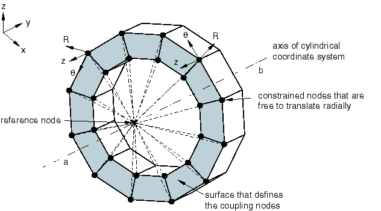
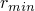
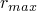
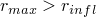
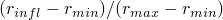
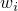
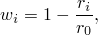
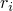
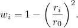

# 35.3.2 耦合约束


**产品：** Abaqus/Standard   Abaqus/Explicit   Abaqus/CAE   

##### **参考资料**

- ["曲面：概述，" 第2.3.1节](pt01ch02s03aus16.md)
- [*COUPLING](../key/key-link.md#usb-kws-mcoupling)
- [*KINEMATIC](../key/key-link.md#usb-kws-mkinematic)
- [*DISTRIBUTING](../key/key-link.md#usb-kws-mdistributing)
- ["定义耦合约束，" Abaqus/CAE用户指南第15.15.4节](../usi/usi-link.md#usi-itn-helptopic-coupling)

### 概述

基于曲面的耦合约束：
- 将曲面上节点集合的运动耦合到参考节点的运动；
- 当节点组耦合到由参考节点定义的刚体运动时，属于运动学类型；
- 当节点组以平均值方式约束到由参考节点定义的刚体运动时（通过允许通过在耦合节点指定的权重因子控制力的传递），属于分布类型；
- 自动选择在影响区域内位于曲面上的耦合节点；
- 可与二维或三维应力/位移单元一起使用；以及
- 可用于几何线性和非线性分析。

### 基于曲面的耦合定义

Abaqus中基于曲面的耦合约束在参考节点和称为"耦合节点"的节点组之间提供耦合。此选项提供的功能与Abaqus/Standard中基于曲面的用户界面的运动学耦合约束和分布耦合单元（DCOUP2D、DCOUP3D）相同。耦合节点通过指定曲面和可选的影响区域自动选择。下面讨论用于定义耦合节点的步骤。

对于分布耦合约束，如果曲面是基于单元的曲面，则自动计算分布权重因子。在这种情况下，权重因子基于每个耦合节点的受载面积，但沿壳边缘的曲面除外，在该处权重因子基于受载边缘长度。此外，分布权重因子可以使用多种加权方法之一进行修改，这些方法允许传递到耦合节点的力与距参考节点的径向距离成反比变化。

### 典型应用

当耦合节点组被约束到单个节点的刚体运动时，耦合约束非常有用。耦合约束可有效用于以下应用：
- 对模型施加载荷或边界条件。[图35.3.2-1](pt08ch35s03aus133.md#kinematic)说明使用运动学耦合约束来为模型规定扭转运动而不约束径向运动。**图35.3.2-1** 运动学耦合约束。[图35.3.2-2](pt08ch35s03aus133.md#distributing)说明分布耦合约束用于在需要节点间相对运动的边界上规定位移和旋转条件。在此示例中，在预期翘曲和/或变形的结构端面处规定了扭转。**图35.3.2-2** 分布耦合约束。
- 在模型上分布载荷，其中载荷分布可以用转动惯量表达式描述。此类情况的示例包括经典的螺栓模式和焊接模式分布表达式。
- 在连续体和结构单元之间进行维度转换。例如，分布耦合允许结构和实体单元之间的灵活耦合。
- 建模端部条件。例如，建模刚性端板或建模保持平面的实体截面可以使用运动学耦合定义轻松完成。
- 简化复杂约束的建模。在运动学耦合定义中，参与约束的自由度可以在局部坐标系中单独选择。
- 与其他约束（如连接器单元）建模相互作用。例如，可以通过两个分布耦合定义更真实地建模铰接部件，其参考节点通过铰接连接器单元连接。载荷传递然后在两组节点"云"之间发生，而不是在两个单节点之间发生。["单活塞发动机模型的子结构分析，" Abaqus实例问题指南第4.1.10节](../exa/exa-link.md#exa-mec-onepistoneng)说明了连接器单元与耦合约束结合使用以建模单活塞发动机的这种用途。

### 定义耦合约束

定义耦合约束需要指定参考节点（也称为约束控制点）、耦合节点和约束类型。耦合约束将参考节点与耦合节点相关联。必须为约束分配一个名称，该名称可在Abaqus/CAE后处理中使用。可以为参考节点指定节点编号或节点集名称。如果指定了节点集，则该节点集必须恰好包含一个节点。运动学耦合约束的参考节点同时具有平动和旋转自由度。耦合节点所在的曲面可以是基于节点的；基于单元的；或者，在Abaqus/Explicit中，两种曲面类型的组合。可以指定可选的影响半径，将耦合节点限制在曲面上的特定区域。下面讨论通过指定影响区域定义耦合节点的详细信息。

约束类型可以是运动学或分布的，如下所述。

| **输入文件用法：** | 使用以下选项： |
| --- | --- |
|  | ``` [*COUPLING](../key/key-link.md#usb-kws-mcoupling), CONSTRAINT NAME=*name*, REF NODE=*n*, SURFACE=*surface* [*KINEMATIC](../key/key-link.md#usb-kws-mkinematic) *or* [*DISTRIBUTING](../key/key-link.md#usb-kws-mdistributing) ``` |

| **Abaqus/CAE用法：** | 相互作用模块：**创建约束**：**耦合**：**耦合类型**：**运动学**、**连续体分布**或**结构分布** |
| --- | --- |

### 指定影响区域

默认情况下，属于整个曲面的耦合节点被选择用于耦合定义。可以通过定义影响半径将耦合节点限制在以参考节点为中心的球形区域内。

选择耦合节点用于约束定义的过程取决于曲面类型：
- 对于基于节点的曲面，由曲面定义的所有落在影响区域内的节点被选择用于耦合定义。
- 对于基于单元的曲面，确定完全或部分位于影响区域内的曲面面片。所有属于这些面片的节点（无论这些节点是否落在影响区域内）都被选择为耦合节点。当影响半径小于到最近耦合节点的距离时，Abaqus选择属于最近面片的所有节点。如果参考节点在曲面上的投影落在多个面片的边缘或顶点上，则包含该边缘或顶点的所有面片上的节点都被包括在耦合定义中。当影响半径小于到最近耦合节点的距离时，相邻表面必须具有一致的法线方向；否则，Abaqus会发出错误消息。
- 分布耦合约束必须至少包含两个耦合节点。如果找到的耦合节点少于两个，Abaqus会在输入文件预处理期间发出错误消息。

| **输入文件用法：** | ``` [*COUPLING](../key/key-link.md#usb-kws-mcoupling), CONSTRAINT NAME=*name*, REF NODE=*n*, SURFACE=*surface*, INFLUENCE RADIUS=*r* ``` |
| --- | --- |

| **Abaqus/CAE用法：** | 相互作用模块：**创建约束**：**耦合**：**影响半径**：**指定** |
| --- | --- |

### 运动学耦合约束

运动学耦合将耦合节点的运动约束到参考节点的刚体运动。约束可以应用于耦合节点上用户指定的自由度（相对于全局或局部坐标系）。

运动约束通过消除耦合节点上的自由度来施加。在Abaqus/Standard中，一旦耦合节点上的任何平动自由度组合被约束，额外的位移约束（如MPC、边界条件或其他运动学耦合定义）就不能应用于涉及运动学耦合约束的任何耦合节点。相同的限制也适用于旋转自由度。此限制不适用于Abaqus/Explicit。有关详细信息，请参见["运动约束：概述，" 第35.1.1节](pt08ch35s01abo32.md)。

| **输入文件用法：** | 使用以下两个选项来定义运动学耦合约束： |
| --- | --- |
|  | ``` [*COUPLING](../key/key-link.md#usb-kws-mcoupling) [*KINEMATIC](../key/key-link.md#usb-kws-mkinematic) *第一个自由度*, *最后一个自由度* ``` 例如，以下耦合约束用于将曲面`surfA`上的自由度1、2和6约束到参考节点1000：``` [*COUPLING](../key/key-link.md#usb-kws-mcoupling), CONSTRAINT NAME=C1, REF NODE=1000, SURFACE=surfA [*KINEMATIC](../key/key-link.md#usb-kws-mkinematic) 1, 2 6, ``` |

| **Abaqus/CAE用法：** | 相互作用模块：**创建约束**：**耦合**：**耦合类型**：**运动学**：切换自由度 |
| --- | --- |

#### 平动自由度

通过消除耦合节点上指定的自由度来约束平动自由度。当指定所有平动自由度时，耦合节点跟随参考节点的刚体运动。

#### 旋转自由度

通过消除耦合节点上指定的自由度来约束旋转自由度。

所选旋转自由度的所有组合都会产生与现有MPC类型相同的旋转行为：
- 选择三个旋转自由度以及三个平动自由度等效于MPC类型BEAM。
- 选择两个旋转自由度等效于Abaqus/Standard中的MPC类型REVOLUTE。
- 选择一个旋转自由度等效于Abaqus/Standard中的MPC类型UNIVERSAL。

在Abaqus/Standard中，运动学耦合通过创建内部节点来强制执行与MPC类型REVOLUTE和UNIVERSAL等效的约束。这些节点具有与这些MPC类型中使用的附加节点相同的自由度，并包含在非线性分析的残差检查中。

#### 指定局部坐标系

可以相对于局部坐标系而不是全局坐标系来指定运动学耦合约束（参见["方向，" 第2.2.5节](pt01ch02s02aus15.md))。[图35.3.2-1](pt08ch35s03aus133.md#kinematic)说明使用局部坐标系将除耦合节点径向平动自由度外的所有自由度约束到参考节点。在此示例中，定义了局部圆柱坐标系，其轴与结构轴重合。然后在此局部坐标系中指定耦合节点约束。

| **输入文件用法：** | ``` [*COUPLING](../key/key-link.md#usb-kws-mcoupling), ORIENTATION=*local* ``` |
| --- | --- |
|  | 例如，以下输入用于指定[图35.3.2-1](pt08ch35s03aus133.md#kinematic)中所示的运动学耦合约束：``` [*ORIENTATION](../key/key-link.md#usb-kws-morientation), SYSTEM=CYLINDRICAL, NAME=COUPLEAXIS 0.0, -1.0, 0.0, 0.0, 1.0, 0.0 [*COUPLING](../key/key-link.md#usb-kws-mcoupling), REF NODE=500, SURFACE=Endcap, ORIENTATION=COUPLEAXIS [*KINEMATIC](../key/key-link.md#usb-kws-mkinematic) 2, 3 ``` |

| **Abaqus/CAE用法：** | 相互作用模块：**创建约束**：**耦合**：**编辑**：选择局部坐标系 |
| --- | --- |

#### 约束方向和有限旋转

在几何非线性分析步骤中，无论约束的自由度是在全局坐标系还是在局部坐标系中指定，约束自由度的坐标系都将随参考节点旋转。

### 分布耦合约束

分布耦合将耦合节点的运动约束到参考节点的平动和旋转。这种约束以平均值方式强制执行，使得能够通过耦合节点处的权重因子控制载荷的传递。参考节点处的力和力矩要么仅作为耦合节点力分布（默认），要么作为耦合节点力和力矩分布进行分配。约束分布载荷，使得耦合节点处的力（和力矩）合力的结果与参考节点处的力和力矩等效。对于多于少数耦合节点的情况，力/力矩的分布不是仅由平衡决定的，而是使用分布权重因子来定义力分布。

参考节点处旋转自由度与云节点平均旋转之间的力矩约束可以在一个方向上释放（二维分析）或一、二、三个方向上释放（三维分析）。在三维分析中，可以在全局坐标系或局部坐标系中指定力矩约束方向。参考节点上所有可用的平动自由度始终耦合到耦合节点的平均平移。

在三维Abaqus/Standard分析中，如果通过仅指定自由度1到3释放所有三个力矩约束，则参考节点上仅激活平动自由度。如果只释放了一个或两个旋转自由度，则参考节点上会激活所有三个旋转自由度。在这种情况下，必须确保在未约束的旋转自由度上放置了适当的约束以避免数值奇异性。这通常通过使用边界条件或通过将参考节点连接到梁或壳等单元来实现，这些单元将为未约束的旋转自由度提供旋转刚度。

在Abaqus/Explicit中，释放一个或多个力矩约束可能导致显著的计算性能下降。当其他约束与耦合节点云相交时也是如此。在这些情况下，当模型中存在大量此类分布耦合或受限"云"很大时，性能下降尤为明显。因此，当遇到上述建模条件时，耦合节点云的大小限制为1000。为了缓解释放的力矩约束问题，可以使用以下建模技术（也可在Abaqus/Standard中使用）：约束分布耦合中的所有力矩，并在耦合的参考节点处使用适当的连接器单元（如REVOLUTE、HINGE、CARDAN或BUSHING）来建模释放的力矩。这种技术的优点是还能够指定有限的柔度，如"释放"旋转分量中的弹性、塑性或损伤。

| **输入文件用法：** | ``` [*DISTRIBUTING](../key/key-link.md#usb-kws-mdistributing) *第一个自由度*, *最后一个自由度* ``` |
| --- | --- |
|  | 如果未指定自由度，则耦合所有可用的自由度。如果指定了一个或多个旋转自由度但未指定所有可用的平动自由度，Abaqus会发出警告消息，并将所有可用的平动自由度添加到约束中。例如，以下耦合约束用于将参考节点1000上的自由度1-5约束到曲面`surfA`的平均平移和旋转：``` [*COUPLING](../key/key-link.md#usb-kws-mcoupling), CONSTRAINT NAME=C1, REF NODE=1000, SURFACE=surfA [*DISTRIBUTING](../key/key-link.md#usb-kws-mdistributing) 1, 5 ```在此示例中，参考节点和耦合节点之间的力矩约束将在6方向释放，但将在4和5方向强制执行。这在参考节点和耦合节点之间提供了类似"铰链"的旋转连接（参见["广义多点约束，" 第35.2.2节](pt08ch35s02aus130.md)）。 |

| **Abaqus/CAE用法：** | 相互作用模块：**创建约束**：**耦合**：**耦合类型**：**连续体分布**或**结构分布**：切换旋转自由度（Abaqus/CAE自动约束平动自由度） |
| --- | --- |

#### 基于节点的曲面

对于基于节点的曲面，使用用户定义的权重因子。曲面定义中指定的横截面积用作权重因子（参见["基于节点的曲面定义，" 第2.3.3节](pt01ch02s03aus18.md)）。

#### 基于单元的曲面

对于基于单元的曲面，权重因子由Abaqus计算。默认权重分布基于每个耦合节点的受载表面积，沿壳边缘的曲面除外，在该处权重分布基于受载边缘长度。计算默认权重因子的过程旨在确保如果规定了影响半径，默认权重分布随影响半径平滑变化。

##### 计算默认分布权重因子

计算分布权重因子的过程取决于是否指定了影响半径。
- 如果未指定影响半径，则整个曲面用于耦合定义。在这种情况下，位于曲面上的所有节点都包含在耦合定义中，每个耦合节点的分布权重因子等于受载表面积。
- 如果指定了影响半径，则按如下方式计算耦合节点处的默认分布权重因子：1. 计算每个曲面面片的"参与因子"。下面定义参与因子。2. 计算每个面片节点处的受载节点面积（或沿壳边缘的受载边缘长度），并乘以面片参与因子。3. 耦合节点分布权重因子计算为所有连接面片相应节点面积（上面计算）的总和。

##### 计算面片参与因子

参与因子定义当指定影响半径时，对分布权重因子有贡献的面片面积比例。参与因子在零和一之间变化。

要定义参与因子，计算距参考节点最近的面片节点的距离，，以及距参考节点最远的面片节点的距离，。
- 如果，其中是影响半径，所有面片节点都在影响区域内；使用等于一的参与因子。
- 如果，没有面片节点位于影响区域内；参与因子设置为零。
- 如果，面片部分位于影响区域内；面片被分配等于的参与因子。

如果所有耦合节点都在影响半径之外（即对于所有面片，），Abaqus选择属于最近面片的所有节点（如"指定影响区域"下所述），并使用等于一的参与因子。

##### 加权方法

您可以修改上面定义的默认权重分布。提供了多种加权方法，这些方法随距参考节点的径向距离单调递减。对于每种情况，基于受载表面积（或沿壳边缘的受载边缘长度）的默认权重分布按权重因子进行缩放。如果未指定加权方法，则使用均匀加权方法，其中所有权重因子都等于1.0。

##### 线性递减权重分布

线性递减加权方案



其中是耦合节点*i*处的权重因子，是耦合节点到参考节点的径向距离，是最远耦合节点的距离。

| **输入文件用法：** | ``` [*DISTRIBUTING](../key/key-link.md#usb-kws-mdistributing), WEIGHTING METHOD=LINEAR ``` |
| --- | --- |

| **Abaqus/CAE用法：** | 相互作用模块：**创建约束**：**耦合**：**耦合类型**：**连续体分布**或**结构分布**：**加权方法**：**线性** |
| --- | --- |

##### 二次多项式权重分布

由下式定义的二次多项式权重分布



| **输入文件用法：** | ``` [*DISTRIBUTING](../key/key-link.md#usb-kws-mdistributing), WEIGHTING METHOD=QUADRATIC ``` |
| --- | --- |

| **Abaqus/CAE用法：** | 相互作用模块：**创建约束**：**耦合**：**耦合类型**：**连续体分布**或**结构分布**：**加权方法**：**二次** |
| --- | --- |

##### 单调递减权重分布

根据三次多项式的单调递减权重分布


| **输入文件用法：** | ``` [*DISTRIBUTING](../key/key-link.md#usb-kws-mdistributing), WEIGHTING METHOD=CUBIC ``` |
| --- | --- |

| **Abaqus/CAE用法：** | 相互作用模块：**创建约束**：**耦合**：**耦合类型**：**连续体分布**或**结构分布**：**加权方法**：**三次** |
| --- | --- |

#### 指定局部坐标系

可以相对于局部坐标系而不是全局坐标系来指定分布耦合约束（参见["方向，" 第2.2.5节](pt01ch02s02aus15.md))。[图35.3.2-2](pt08ch35s03aus133.md#distributing)说明使用局部坐标系来释放在局部4和6方向上参考节点和耦合节点之间的力矩约束，提供"万向节式"旋转连接。在此示例中，定义了局部直角坐标系，其局部*y*轴与全局*z*轴重合。力矩约束在此局部坐标系中指定。

| **输入文件用法：** | ``` [*COUPLING](../key/key-link.md#usb-kws-mcoupling), ORIENTATION=*local* ``` |
| --- | --- |
|  | 例如，以下输入用于指定[图35.3.2-2](pt08ch35s03aus133.md#distributing)中所示的分布耦合约束：``` [*ORIENTATION](../key/key-link.md#usb-kws-morientation), SYSTEM=RECTANGULAR, NAME=COUPLEAXIS 0.0, 1.0, 0.0, 0.0, 0.0, 1.0 [*COUPLING](../key/key-link.md#usb-kws-mcoupling), REF NODE=500, SURFACE=Endcap, ORIENTATION=COUPLEAXIS [*DISTRIBUTING](../key/key-link.md#usb-kws-mdistributing) 1, 3 5, 5 ``` |

| **Abaqus/CAE用法：** | 相互作用模块：**创建约束**：**耦合**：**编辑**：选择局部坐标系 |
| --- | --- |

#### 定义曲面耦合方法

有两种方法可用于将参考节点的运动耦合到耦合节点的平均运动：连续体耦合方法和结构耦合方法。默认使用连续体耦合方法。

##### 连续体耦合方法

默认的连续体耦合方法将参考节点的平移和旋转耦合到耦合节点的平均平移。约束将参考节点处的力和力矩仅作为耦合节点力分布进行分配。在耦合节点处不分布力矩。当权重因子被解释为螺栓横截面积时，力分布等效于经典的螺栓模式力分布。约束在连接点和位于耦合节点加权位置中心的点之间强制执行刚性梁连接。更多详细信息，请参见["分布耦合单元，" Abaqus理论指南第3.9.8节](../stm/stm-link.md#stm-elm-distcouplingelem)。

| **输入文件用法：** | ``` [*DISTRIBUTING](../key/key-link.md#usb-kws-mdistributing), COUPLING=CONTINUUM ``` |
| --- | --- |

| **Abaqus/CAE用法：** | 相互作用模块：**创建约束**：**耦合**：**耦合类型**：**连续体分布** |
| --- | --- |

##### 结构耦合方法

结构耦合方法将参考节点的平移和旋转耦合到耦合节点的平移和旋转运动。该方法特别适用于壳的弯曲类应用，当耦合约束跨越小的节点斑块且参考节点选择在受限曲面上或非常接近受限曲面时。约束将参考节点处的力和力矩作为耦合节点力和力矩分布进行分配。要激活此耦合方法，所有耦合节点上的所有旋转自由度必须处于活跃状态（当约束应用于壳曲面时就是这种情况），并且必须指定所有自由度（默认）的约束。此外，为了使约束有意义，约束中使用的局部（或全局）*z*轴应该与受限曲面的平均法线方向平行。

关于平移，约束在参考节点和位于受限曲面附近的移动点之间强制执行刚性梁连接。此移动点的位置由受限曲面的近似当前曲率、耦合节点加权位置中心的当前位置（参见["分布耦合单元，" Abaqus理论指南第3.9.8节](../stm/stm-link.md#stm-elm-distcouplingelem)）和约束中使用的*z*轴确定。这种选择避免了使用多个分布耦合约束紧固壳表面对时的不现实接触相互作用（更多详细信息，请参见["可断裂结合，" 第37.1.9节](pt09ch37s01aus173.md)）。

关于旋转，约束在不同局部方向上有所不同。沿*z*轴（扭转方向），约束与通过连续体耦合方法强制执行的约束相同（参见["分布耦合单元，" Abaqus理论指南第3.9.8节](../stm/stm-link.md#stm-elm-distcouplingelem))。相反，垂直于*z*轴平面内的旋转约束将平面内参考节点旋转与参考节点附近耦合节点的平面内旋转相关联。当受限曲面很小且主要在弯曲模式下变形时，这种选择提供了更现实（更柔顺）的响应。

| **输入文件用法：** | ``` [*DISTRIBUTING](../key/key-link.md#usb-kws-mdistributing), COUPLING=STRUCTURAL ``` |
| --- | --- |

| **Abaqus/CAE用法：** | 相互作用模块：**创建约束**：**耦合**：**耦合类型**：**结构分布** |
| --- | --- |

#### 力矩释放和有限旋转

在几何非线性分析步骤中，定义力矩释放的自由度的坐标系随参考节点旋转，无论使用的是全局坐标系还是局部坐标系。

#### 共线耦合节点排列

分布耦合约束将参考节点处的力矩作为耦合节点之间的力分布进行传递，即使这些节点具有旋转自由度。因此，当耦合节点排列共线时，约束无法传递参考节点处力矩的所有分量。具体而言，与共线耦合节点排列平行的力矩分量将不会被传递。当出现这种情况时，会发出警告消息，识别出单元将不传递力矩的轴。

### 限制

- 分布耦合约束不能与非对称变形的轴对称单元一起使用。此单元类型与分布耦合约束不兼容。
- 如果将分布耦合约束与带扭转的轴对称单元一起使用，则约束不会在这些单元中包含扭转自由度5。它只会涉及平动自由度1和2。
- 具有大量耦合节点的分布耦合定义在Abaqus/Standard中会产生大的波前。这可能导致显著的内存使用和求解有限元平衡方程的长时间。
- 分布耦合约束在Abaqus/Standard中不能涉及超过46,000个自由度，这意味着二维和轴对称情况下每个约束最多23,000个节点，三维情况下每个约束最多15,333个节点。


