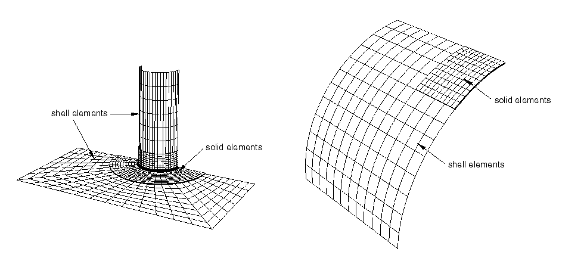
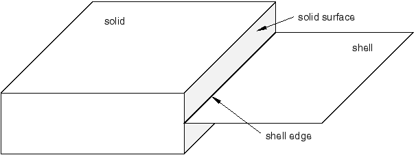
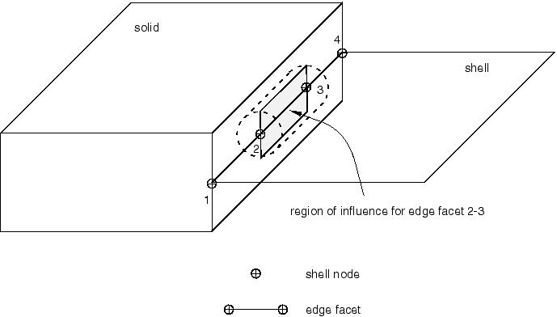
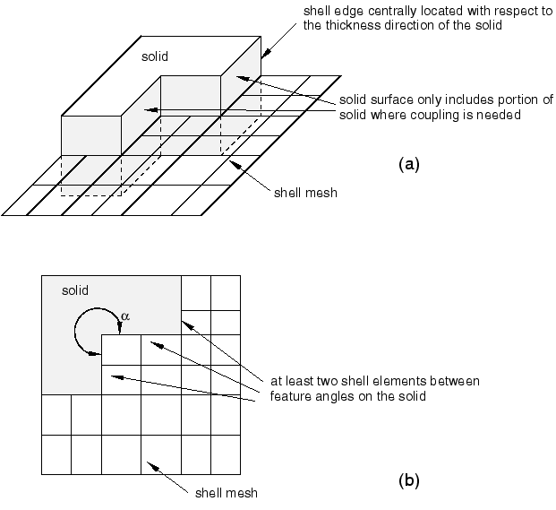

# 35.3.3 壳到实体耦合


**产品：** Abaqus/Standard   Abaqus/Explicit   Abaqus/CAE   

##### **参考资料**

- ["耦合约束，" 第35.3.2节](pt08ch35s03aus133.md)
- ["曲面：概述，" 第2.3.1节](pt01ch02s03aus16.md)
- [*SHELL TO SOLID COUPLING](../key/key-link.md#usb-kws-mshelltosolidcoupling)
- ["定义壳到实体耦合约束，" Abaqus/CAE用户指南第15.15.7节](../usi/usi-link.md#usi-itn-helptopic-stscoup)

### 概述

基于曲面的壳到实体耦合：
- 允许从壳单元建模到实体单元建模的过渡；
- 当局部建模需要使用完整的三维分析但结构的其他部分可以建模为壳时最有用；
- 使用一组内部定义的分布耦合约束，将壳模型边缘沿线节点"线"的运动耦合到实体曲面上节点组的运动；
- 自动选择在影响区域内位于实体曲面上的耦合节点；
- 可与三维应力/位移壳和实体（连续体）单元一起使用；
- 不要求实体和壳单元网格之间任何对齐；以及
- 可用于几何线性和非线性分析。

### 壳到实体耦合

Abaqus中的壳到实体耦合是一种基于曲面的技术，用于耦合壳单元到实体单元。[图35.3.3-1](pt08ch35s03aus134.md#shelltosolid1)展示了两个示例，摘自["管道接头的壳到实体子模型和壳到实体耦合，" Abaqus实例问题指南第1.1.10节](../exa/exa-link.md#exa-sta-shellsolidpipe)和["收缩圆柱问题，" Abaqus基准指南第2.3.2节](../bmk/bmk-link.md#bmk-elm-pinchcyl)。壳到实体耦合旨在用于网格细化研究，其中局部建模需要相对精细的贯穿厚度实体网格耦合到壳网格的边缘，如图[图35.3.3-2](pt08ch35s03aus134.md#shelltosolidinter1)所示。在这种情况下，Abaqus将组装约束，将每个壳节点的位移和旋转耦合到壳节点附近实体曲面的平均位移和旋转。

**图35.3.3-1** 壳到实体耦合的典型示例。



**图35.3.3-2** 壳到实体界面。


如图[图35.3.3-2](pt08ch35s03aus134.md#shelltosolidinter1)所示，耦合沿着由两个用户指定的曲面定义的壳到实体界面进行：基于边缘的壳曲面和基于单元或节点的实体曲面（参见["曲面：概述，" 第2.3.1节](pt01ch02s03aus16.md)）。壳曲面（[图35.3.3-3](pt08ch35s03aus134.md#shelltosolid2)）称为"壳边缘"。

**图35.3.3-3** 壳和实体曲面。



定义基于边缘的壳曲面的壳单元边缘称为"边缘面片"。边缘面片是根据底层壳单元是线性还是二次的，分为线性或二次线段。

壳到实体耦合通过在壳边缘上的节点和实体曲面上的节点之间自动创建一组内部分布耦合约束来强制执行（参见["耦合约束，" 第35.3.2节](pt08ch35s03aus133.md)）。Abaqus使用默认或用户定义的距离和容差参数（见下文）来确定壳边缘上的哪些节点将耦合到实体曲面上的哪些节点。对于参与耦合的每个壳节点，创建一个独特的内部分布耦合约束，其中壳节点充当参考节点，相关实体节点充当耦合节点。每个内部约束以自平衡方式将在壳节点处作用的力和力矩分布到相关耦合曲面节点组上。生成的约束线强制执行壳到实体耦合。

### 定义壳到实体耦合

定义壳到实体耦合约束需要指定约束名称、基于边缘的壳曲面和基于单元或节点的实体曲面。

| **输入文件用法：** | ``` [*SHELL TO SOLID COUPLING](../key/key-link.md#usb-kws-mshelltosolidcoupling), CONSTRAINT NAME=*name* *shell_surface*, *solid_surface* ``` |
| --- | --- |

| **Abaqus/CAE用法：** | 相互作用模块：**创建约束**：**壳到实体耦合** |
| --- | --- |

Abaqus自动确定两个曲面上哪些节点参与耦合，并创建适当的内部分布式耦合约束。您还可以通过指定位置容差和/或影响距离来控制两个曲面上哪些节点参与耦合，如下所述。

当请求模型定义数据时，生成的耦合约束定义被打印到数据文件（参见["控制写入数据文件的分析输入文件处理器信息量"中的"输出，" 第4.1.1节](pt02ch04s01aus38.md#usb-out-ooutput-data-control)）。Abaqus还将创建一个包含耦合中包含的所有实体节点的内部节点集；该节点集可以使用Abaqus/CAE的Visualization模块进行可视化。内部节点集的名称是分配给耦合约束的名称。

#### 控制耦合中包含的壳节点

*位置容差*决定了绝对距离，从实体曲面开始，所有要包含在耦合中的壳节点必须位于此范围内。位于此容差之外的壳节点不会耦合到实体曲面。

当使用基于单元的实体曲面时，壳节点与实体曲面之间的定义距离是从壳节点沿直线到实体曲面上最近点（可能在实体曲面的边缘上）的投影距离。使用基于单元的实体曲面时，默认位置容差是壳边缘上典型面片长度的5%。

对于基于节点的实体曲面，壳节点到曲面的定义距离是到实体曲面上最近节点的距离。使用基于节点的实体曲面时，默认位置容差基于实体曲面上节点之间的平均距离。

您可以为基于单元或基于节点的实体曲面指定非默认位置容差。

| **输入文件用法：** | ``` [*SHELL TO SOLID COUPLING](../key/key-link.md#usb-kws-mshelltosolidcoupling), POSITION TOLERANCE=*distance* ``` |
| --- | --- |

| **Abaqus/CAE用法：** | 相互作用模块：**创建约束**：**壳到实体耦合**：选择曲面：**位置容差**：选择**指定距离** |
| --- | --- |

#### 控制耦合中包含的实体节点

为每个边缘面片定义了几何容差，称为*影响距离*。对于要包含在耦合约束中的实体曲面上的给定节点或单元面片，其到至少一个边缘面片的垂直距离必须小于或等于为该边缘面片定义的影响距离。边缘面片的默认影响距离是底层壳单元厚度的一半。默认值自动考虑壳单元截面定义中包含的任何偏移或节点厚度。您可以指定非默认影响距离。

| **输入文件用法：** | ``` [*SHELL TO SOLID COUPLING](../key/key-link.md#usb-kws-mshelltosolidcoupling), INFLUENCE DISTANCE=*distance* ``` |
| --- | --- |

| **Abaqus/CAE用法：** | 相互作用模块：**创建约束**：**壳到实体耦合**：选择曲面：**影响距离**：选择**指定值** |
| --- | --- |

除了以下情况外，用户定义的影响距离在所有情况下都是可选的：当耦合中涉及的边缘面片与您指定了一般刚度的通用任意弹性壳截面定义相关联时。在这种情况下，由于壳厚度未直接定义，因此必须提供影响距离。

### 内部耦合约束的计算

本节概述了Abaqus用于计算内部壳到实体耦合约束的基本过程。

为每个位于距实体曲面位置容差范围内的壳节点创建一个独特的内部分布耦合约束。不会为位于此容差之外的壳节点创建内部耦合约束。壳节点充当参考节点，实体曲面上的一组节点充当耦合节点。Abaqus通过单独考虑每个壳边缘面片来找到实体曲面上的耦合节点并计算内部约束的权重因子。为每个边缘面片执行以下过程：

1. Abaqus找到位于当前边缘面片影响区域内（见下文）的实体单元曲面上的所有节点。这些节点包含在耦合约束中。
2. Abaqus然后为实体节点计算一组权重因子。权重因子是实体节点在影响区域内的受载面积以及实体节点相对于每个壳节点的相对位置的度量。对于基于节点的曲面，受载面积是定义曲面时指定的横截面积。对于基于单元的曲面，受载面积由Abaqus计算。每个耦合约束中所有权重因子的总和是影响区域内包含的实体曲面总受载面积的度量。
3. 对壳曲面中包含的所有壳边缘面片执行上述过程。如果壳节点属于多个边缘面片，则所有耦合节点和权重因子被组合成单个分布约束定义。沿壳边缘生成的约束线强制执行壳到实体耦合。

有两种情况：壳节点可能满足位置容差但未定义耦合约束。如果壳节点位于位置容差内但未通过边缘面片连接到也满足容差的至少一个其他壳节点，则不会为此壳节点创建耦合约束。在这种情况下，可能需要增加位置容差。或者，如果为与壳节点关联的至少两个实体节点计算的权重因子非零，则不会为此壳节点创建耦合约束。权重因子为零的最可能原因是影响距离太小。对于基于节点的曲面，如果使用默认横截面积，也可能产生零权重。对于壳到实体耦合，默认面积为零。

#### 边缘面片的影响区域

边缘面片的影响区域由圆柱体定义，其中心线是边缘面片，半径是边缘面片的影响距离。圆柱体的两端由两个边界平面定义，其法线是边缘面片两端的壳切线（参见[图35.3.3-4](pt08ch35s03aus134.md#shelltosolid3)）。

**图35.3.3-4** 边缘面片的影响区域。



在此示例中，为壳边缘2-3构造了影响区域。对于基于节点的实体曲面，只有位于影响区域内或边界上的节点被分配给当前边缘面片并包含在耦合定义中。对于基于单元的实体曲面，每个实体面片节点与面片曲面的一部分相关联。如果分配给给定实体节点的面片部分落在影响区域内，则该节点被包含在耦合定义中。

#### 使用基于单元的实体曲面上的法线来限制耦合中使用的实体节点

对于基于单元的实体曲面的情况，Abaqus会将影响区域内每个实体面片的法线与圆柱体中心线最近的实体曲面法线进行比较（参见[图35.3.3-4](pt08ch35s03aus134.md#shelltosolid3)）。通常，如果面片面法线不在中心线法线的20°以内，则实体曲面面上的节点不被包含在耦合定义中。对于[图35.3.3-4](pt08ch35s03aus134.md#shelltosolid3)所示的情况，此检查将防止实体网格的顶部和底部曲面节点耦合到壳节点，即使影响距离任意大且实体曲面定义包括实体几何的所有侧面。如果中心线位于或接近实体网格的特征边缘（其中法线未明确定义），则不使用此检查（见下文关于壳偏移的讨论）。

### 壳到实体耦合的注释、限制和建模建议

- 壳到实体耦合公式假定壳和实体单元之间的界面曲面垂直于壳。因此，虽然实体曲面可以在切向于壳边缘的方向上弯曲，但它应该在沿壳法线方向上是直的。这是对曲面几何的假设，而不是对网格的假设。实体曲面上的节点彼此不需要对齐，也不需要与壳节点对齐。
- 壳到实体耦合功能专为相对于壳厚度具有精细实体网格的分析而设计。建议在壳到实体界面上至少包含两个实体单元。沿壳到实体界面，壳边缘面片的长度通常应与实体单元面片的特征曲面尺寸相同。
- 壳到实体耦合算法设计中使用的一个假设是权重因子基于准确的节点受载面积，例如当使用基于单元的曲面时Abaqus自动计算的面积。因此，通常建议使用基于单元的实体曲面而不是基于节点的实体曲面。但是，在壳和实体网格彼此对齐的情况下，有时使用基于节点的实体曲面是有利的，特别是当预期是均匀解时。
- [图35.3.3-5](pt08ch35s03aus134.md#shelltosolid8)说明了一些推荐的壳到实体耦合建模实践。如果壳参考曲面没有偏移，壳边缘应相对于实体的厚度方向居中（[图35.3.3-5](pt08ch35s03aus134.md#shelltosolid8)(a)）。实体曲面应仅包括耦合所需的部分（[图35.3.3-5](pt08ch35s03aus134.md#shelltosolid8)(a)中所示的阴影区域）。**图35.3.3-5** 壳到实体界面的建模建议。
- 壳到实体界面可以围绕几何特征角（角落）定义，（[图35.3.3-5](pt08ch35s03aus134.md#shelltosolid8)(b)）。但是，建议特征角满足60 <  < 300。此外，如图[图35.3.3-5](pt08ch35s03aus134.md#shelltosolid8)(b)所示，在每个特征角之间至少应包含两个壳单元边缘。
- 如果为壳截面定义了偏移且参考壳边缘放置在实体曲面上的特征边缘处或附近（[图35.3.3-6](pt08ch35s03aus134.md#shelltosolid9)），则实体曲面应仅包括您要包含在耦合定义中的实体侧。例如，如果在[图35.3.3-6](pt08ch35s03aus134.md#shelltosolid9)中，实体的顶部包含在曲面定义中，则Abaqus会在耦合约束中包含曲面上顶部的节点，这不是您想要的。您只想将壳耦合到[图35.3.3-6](pt08ch35s03aus134.md#shelltosolid9)中实体的阴影区域。因此，实体曲面定义应仅包括此区域。
- 在解释壳到实体界面附近的局部应力和应变场时必须小心。当壳到实体界面包含角落或边缘时尤其如此。界面应放置在距实体网格中您感兴趣应力和应变场区域至少超过壳厚度的距离处。
- 壳到实体界面应位于壳理论是有效建模近似的模型区域中。
- 由壳单元制成的模型中可能存在角落或扭折。在这些角落或扭折处，壳单元仅近似于远离壳中面的材料分布。虽然壳和实体模型之间的全局力矩和力被正确传递，但壳到实体界面区域的局部应力和位移场可能不准确。
- 在壳到实体耦合中，仅耦合实体单元中的位移自由度和壳单元中的位移和旋转自由度。壳到实体耦合不耦合其他自由度，如温度、压力等。
- 壳到实体耦合可用于将三维壳耦合到除圆柱单元外的所有三维连续体单元（["圆柱实体单元库，" 第28.1.5节](pt06ch28s01ael04.md)）。


