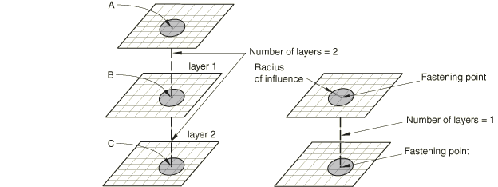
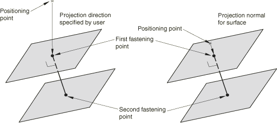
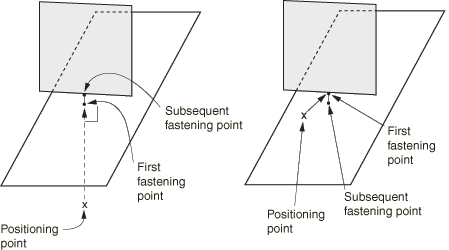
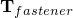
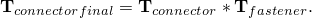

# 35.3.4 独立于网格的紧固件


**产品：** Abaqus/Standard   Abaqus/Explicit   Abaqus/CAE   

##### **参考资料**

- ["曲面：概述，" 第2.3.1节](pt01ch02s03aus16.md)
- ["耦合约束，" 第35.3.2节](pt08ch35s03aus133.md)
- ["连接器单元，" 第31.1.2节](pt06ch31s01alm25.md)
- [*FASTENER](../key/key-link.md#usb-kws-mfastener)
- [*FASTENER PROPERTY](../key/key-link.md#usb-kws-mfastenerproperty)
- ["关于紧固件，" Abaqus/CAE用户指南第29.1节](../usi/usi-link.md#usi-eng-fastener-overview)

### 概述

独立于网格的紧固件功能：
- 是一种定义两个或多个曲面之间点对点连接的便捷方法，如点焊或铆钉连接；
- 使用紧固件位置的空间坐标来定义独立于底层网格的点对点连接；
- 将连接器单元或BEAM MPC与分布耦合约束结合使用，以提供可位于两个或多个曲面之间的任何位置的连接，而不考虑每个曲面上的网格细化或节点位置；
- 可用于连接基于单元的可变形和刚性曲面；
- 可通过使用连接器行为定义的通用性来建模具有失效的刚性、弹性或非弹性连接；以及
- 仅在三维中可用。

### 引言

许多应用需要建模零件之间点对点连接。这些连接可能采用点焊、铆钉、螺钉、螺栓或其他类型的紧固机制的形式。在大型系统模型（如汽车或机身）中可能有数百甚至数千个此类连接。

紧固件可以位于要连接的零件之间的任何位置，而与网格无关。换句话说，紧固件的位置可以独立于要连接的曲面上节点的位置。相反，对每个被连接零件的附着的分布被传递到紧固点附近曲面上的几个节点。[图35.3.4-1](pt08ch35s03aus135.md#aspotweld-project)显示了一典型的单层和双层紧固件配置。

**图35.3.4-1** 典型的单层和双层紧固件配置。



每一层使用连接器单元或BEAM MPC将两个紧固点连接起来。每个紧固点使用分布耦合约束连接到曲面，该约束将每个紧固点的位移和旋转耦合到附近节点的平均位移和旋转。

Abaqus中的独立于网格的紧固件功能旨在以便捷的方式对这些连接进行建模。紧固件自动：
- 确定两个或多个曲面之间的节点位置和连接器单元或BEAM MPC的方向；
- 生成分布耦合约束，以独立于网格的方式将连接器单元或BEAM MPC连接到每个曲面；以及
- 计算完成独立于网格的连接的分布耦合约束的权重。

有关使用独立于网格紧固件的示例，请参见["带点焊的柱的屈曲，" Abaqus实例问题指南第1.2.3节](../exa/exa-link.md#exa-sta-bucklespotweld)。独立于网格的紧固件在Abaqus/CAE中称为基于点的紧固件。有关更多信息，请参见["关于紧固件，" Abaqus/CAE用户指南第29.1节](../usi/usi-link.md#usi-eng-fastener-overview)。也可以使用连接器单元、耦合约束等在Abaqus/CAE中组装紧固件。有关更多详细信息，请参见["关于组装的紧固件，" Abaqus/CAE用户指南第29.1.3节](../usi/usi-link.md#usi-eng-fastener-overview-assm)。

### 紧固件相互作用

紧固件在称为相互作用的组中定义，并被分配名称。每个相互作用定义一个或多个紧固件。单个紧固件的数量等于用于定位紧固件的定位点数量。每个曲面上的紧固点通过考虑定位点的位置来确定，如后续章节所述。

紧固件可以使用连接器单元或BEAM MPC定义。BEAM MPC允许对完美刚性连接进行建模；而连接器单元允许您对更复杂的行为进行建模，例如包括弹性、损伤、塑性和摩擦效应的可变形连接。

| **输入文件用法：** | ``` [*FASTENER](../key/key-link.md#usb-kws-mfastener), INTERACTION NAME=*name* ``` |
| --- | --- |

| **Abaqus/CAE用法：** | 相互作用模块：****特殊****紧固件****创建****: **名称**：*name*，**类型**：**基于点** |
| --- | --- |

#### 使用BEAM MPC定义紧固件

对于建模完美刚性连接，您无需使用连接器单元定义紧固件。相反，Abaqus可以在内部生成BEAM MPC，连接紧固件的紧固点。在这种方法是，您为紧固件相互作用分配一个包含用户定义节点列表的参考节点集。此参考节点集中的节点将用作定位点以定位紧固件。如果要建模单层紧固件，Abaqus会生成单个BEAM MPC，其中参考节点集中的每个节点成为BEAM MPC的第一个节点。每个BEAM MPC的第二个节点将由Abaqus在内部生成。如果要定义多层紧固件，Abaqus会生成链接的BEAM MPC集，其中参考节点集中的每个节点成为每个链接集中第一个BEAM MPC的第一个节点。每个链接集中的后续节点将由Abaqus在内部生成。对于多层紧固件，每个链接集包含与紧固件层数相同数量的BEAM MPC。

| **输入文件用法：** | 使用以下选项： |
| --- | --- |
|  | ``` [*FASTENER](../key/key-link.md#usb-kws-mfastener), INTERACTION NAME=*name*, REFERENCE NODE SET=*node set label* [*NSET](../key/key-link.md#usb-kws-mnset), NSET=*node set label* ``` |

| **Abaqus/CAE用法：** | 相互作用模块：****特殊****紧固件****创建****: **基于点**：选择定位点：**属性**：**截面**：**刚性MPC** |
| --- | --- |

#### 使用连接器单元定义紧固件

使用连接器单元作为点对点连接的基础允许对具有紧固件的非常复杂的行为进行建模。与连接器单元的其他用途一样，连接可以是完全刚性的，也可以允许局部连接器分量中的无约束相对运动。此外，可以使用可以包括弹性、阻尼、塑性、损伤和摩擦效应的连接器行为定义来指定可变形行为。有两种方法可以使用连接器单元定义紧固件来建模紧固点之间的行为。对于这两种方法，紧固件相互作用指的是包含连接器单元的单元集。您必须指定引用此单元集的连接器截面定义。在定义连接器方向时（如果需要），您应小心，如下["定义紧固件方向](pt08ch35s03aus135.md#usb-cni-afastener-orientation)"中所述。

##### 直接定义连接器单元

使用连接器单元指定紧固件的最可控方法是显式定义连接器单元并将其与单元集关联。紧固件相互作用引用单元集。紧固件相互作用中的每个紧固件对应于一个或多个连接器单元，具体取决于紧固件的层数（参见[图35.3.4-2](pt08ch35s03aus135.md#aspotweld-connectors)）。

**图35.3.4-2** 使用连接器单元建模的单层和多层紧固件。


每一层关联一个连接器单元，连接器单元的两个节点对应于两个相邻曲面的紧固点。指定多层紧固件时，每层的连接器单元应与相邻层的连接器单元共享节点。

对于单层紧固件，用于定位紧固件及其紧固点的定位点取为连接器单元第一个节点的节点坐标。对于多层紧固件，定位点取为与层数相同的链接连接器集中第一个连接器的第一个节点。本节末尾包含定义单层和多层紧固件的示例。

| **输入文件用法：** | 使用以下选项： |
| --- | --- |
|  | ``` [*FASTENER](../key/key-link.md#usb-kws-mfastener), INTERACTION NAME=*name*, ELSET=*element set label* *blank line* [*ELEMENT](../key/key-link.md#usb-kws-melement), TYPE=CONN3D2, ELSET=*element set label* [*CONNECTOR SECTION](../key/key-link.md#usb-kws-mconnectorsection), ELSET=*element set label* ``` |

| **Abaqus/CAE用法：** | 对于Abaqus/CAE中的基于点的紧固件，您不能直接定义连接器单元；连接器单元由Abaqus生成。 |
| --- | --- |

##### 由Abaqus生成的连接器单元

在这种方法中，您无需显式定义连接紧固件紧固点的连接器单元。紧固件相互作用引用空单元集。您必须指定引用此单元集的连接器截面定义。此外，您为紧固件相互作用分配一个包含用户定义节点列表的参考节点集。此参考节点集中的节点用作定位点以定位紧固件。

如果要建模单层紧固件，Abaqus会生成单个连接器单元，其中参考节点集中的每个节点成为连接器单元的第一个节点。每个连接器单元的第二个节点将由Abaqus在内部生成。如果要定义多层紧固件，Abaqus会生成链接的连接器单元集，其中参考节点集中的每个节点成为每个链接集中第一个连接器单元的第一个节点。每个链接集中的后续节点将由Abaqus在内部生成。对于多层紧固件，每个链接集包含与紧固件层数相同数量的连接器单元。连接器单元被赋予内部生成的单元编号并分配给命名用户指定的单元集。您可以使用此单元集来请求这些连接器单元的输出。但是，此单元集不应包含在另一个单元集定义中。

| **输入文件用法：** | 使用以下选项： |
| --- | --- |
|  | ``` [*FASTENER](../key/key-link.md#usb-kws-mfastener), INTERACTION NAME=*name*, ELSET=*element set label*, REFERENCE NODE SET=*node set label* *blank line* [*NSET](../key/key-link.md#usb-kws-mnset), NSET=*node set label* [*CONNECTOR SECTION](../key/key-link.md#usb-kws-mconnectorsection), ELSET=*element set label* ``` |

| **Abaqus/CAE用法：** | 相互作用模块：****特殊****紧固件****创建****: **基于点**：选择定位点：**属性**：**截面**：选择连接器截面 |
| --- | --- |

##### 示例：直接使用连接器单元定义单层紧固件

要直接使用连接器单元定义单层紧固件：
- 定义两个连接器单元，用户单元编号为100和200，用户节点编号分别为1、2和3、4，并将其包含在一个单元集中。节点1和3充当两个紧固件的定位点（参见[图35.3.4-2](pt08ch35s03aus135.md#aspotweld-connectors)）。
- 在紧固件相互作用和连接器截面定义中引用单元集。
- 为紧固件分配截面属性。假设在此示例中，允许紧固点之间的相对位移。因此，必须为紧固件分配具有可用运动分量的截面；例如，可以使用CARTESIAN截面。
- 紧固点之间的相对位移产生弹性变形。因此，紧固件之间的材料建模为线性弹性，使用连接器弹性的弹簧刚度为10000。

可以使用以下输入：
```
[*FASTENER](../key/key-link.md#usb-kws-mfastener), INTERACTION NAME=*fastinter*, ELSET=*fastconn*, PROPERTY=*fastprop*
*blank line*
surface1, surface2
[*ELEMENT](../key/key-link.md#usb-kws-melement), TYPE=CONN3D2, ELSET=*fastconn*
100, 1, 2
200, 3, 4
[*CONNECTOR SECTION](../key/key-link.md#usb-kws-mconnectorsection), ELSET=*fastconn*, BEHAVIOR=*behav*
CARTESIAN, 
[*CONNECTOR BEHAVIOR](../key/key-link.md#usb-kws-mconnectorbehavior), NAME=*behav*
[*CONNECTOR ELASTICITY](../key/key-link.md#usb-kws-mconnectorelasticity), COMPONENT=*1*
10000,
[*CONNECTOR ELASTICITY](../key/key-link.md#usb-kws-mconnectorelasticity), COMPONENT=*2*
10000,
[*CONNECTOR ELASTICITY](../key/key-link.md#usb-kws-mconnectorelasticity), COMPONENT=*3*
10000,
```

##### 示例：直接使用连接器单元定义多层紧固件

要直接使用连接器单元定义多层紧固件：
- 定义两个链接的连接器单元集，每个链接集恰好包含两个连接器。第一个链接集包括单元编号100和101，节点编号分别为1、2和2、3。第二个链接集包括单元编号200和201，节点编号分别为4、5和5、6。将连接器单元包含在一个单元集中。节点1和4充当两个紧固件的定位点（参见[图35.3.4-2](pt08ch35s03aus135.md#aspotweld-connectors)）。
- 在紧固件相互作用和连接器截面定义中引用单元集
- 为紧固件分配截面属性。假设在此示例中，要建模紧固点之间的刚性梁型行为；在这种情况下，必须为紧固件分配BEAM截面。

可以使用以下输入：
```
[*FASTENER](../key/key-link.md#usb-kws-mfastener), INTERACTION NAME=*fastinter*, ELSET=*fastconn*, PROPERTY=*fastprop*
*blank line*
surface1, surface2, surface3
[*ELEMENT](../key/key-link.md#usb-kws-melement), TYPE=CONN3D2, ELSET=*fastconn*
100, 1, 2
101, 2, 3
200, 4, 5
201, 5, 6
[*CONNECTOR SECTION](../key/key-link.md#usb-kws-mconnectorsection), ELSET=*fastconn*
BEAM, 
```

### 指定定位点、投影方法和紧固点

每个相互作用定义一个或多个紧固件。单个紧固件的数量等于用于定位紧固件的定位点数量。定位点是定义为紧固件位置并作为参考节点集分配给相互作用的节点。

通常，定位点应尽可能靠近要连接的曲面。指定定位点的参考节点可以是连接曲面节点之一，也可以单独定义。Abaqus通过首先将定位点投影到最近的曲面上来确定紧固件层附着到要连接的曲面的实际点。Abaqus提供以下投影方法来找出指定曲面上的紧固点以形成紧固件：
- 面-面
- 面-边缘
- 边缘-面
- 边缘-边缘
- 连接器方向

方法的选择取决于曲面的相对方向。

#### 紧固几乎平行的曲面

最常见的是，要紧固在一起的曲面几乎彼此平行；在这种情况下，紧固点位于远离曲面部边缘的面片上。面-面投影方法最适合这种情况。它也是默认的投影方法。

在面-面投影方法中，Abaqus沿垂直于曲面的有向线段将每个定位点投影到最近的曲面上。或者，您可以指定投影方向。当使用二维图形来识别定位点位置且这些位置在二维中精确已知但在第三维中不精确时，指定方向可能有用。在这种情况下，指定的方向通常是绘图平面的法线。

一旦确定了最近曲面上的紧固点，Abaqus通过沿紧固件法线方向（通常垂直于最近曲面）投影第一个紧固点来确定要连接的其他曲面或曲面中的点。[图35.3.4-3](pt08ch35s03aus135.md#aspotweld-config)显示了定位投影点的两种方式。当要紧固的曲面不完全平行时，Abaqus有时会将附着点设置在曲面上最近的边缘或角落，而不是沿紧固件法线方向。

**图35.3.4-3** 面-面投影方法的有向投影和法线投影以定位紧固点。



定位点（参考节点集中的节点）的位置可能与Abaqus找到的紧固点位置不一致。因此，当节点移动到紧固点时，定位点处的节点坐标可能从用户规定的值更改。如果定位点处的节点是用户定义单元连接性的一部分，则可能导致其连接性包含该节点的单元经历不可接受的初始扭曲。在这种情况下，建议您单独定义定位点处的节点。通常，您不应将此节点指定为连接曲面节点之一。

| **输入文件用法：** | 使用以下选项允许Abaqus定义投影方向： |
| --- | --- |
|  | ``` [*FASTENER](../key/key-link.md#usb-kws-mfastener), REFERENCE NODE SET=*node set label*, ATTACHMENT METHOD=FACETOFACE (default) *blank line* ``` 使用以下选项直接定义投影方向：``` [*FASTENER](../key/key-link.md#usb-kws-mfastener), REFERENCE NODE SET=*node set label*, ATTACHMENT METHOD=FACETOFACE (default) *x-component, y-component, z-component* ``` |

| **Abaqus/CAE用法：** | 使用以下输入允许Abaqus定义投影方向： |
| --- | --- |
|  | 相互作用模块：****特殊****紧固件****创建****: **基于点**：选择定位点：**域**选项卡：**方向向量**：**默认**，**标准**选项卡：**附着方法**：**面-面** 使用以下输入直接定义投影方向：相互作用模块：****特殊****紧固件****创建****: **基于点**：选择定位点：**域**选项卡：**方向向量**：**指定**，**标准**选项卡：**附着方法**：**面-面** |

#### 紧固几乎垂直的曲面

当您需要紧固彼此垂直或几乎垂直的曲面时；即形成T形交叉，面-边缘或边缘-面投影方法是合适的选择。[图35.3.4-4](pt08ch35s03aus135.md#aspotweld-fe-ef-nls)显示了点-边缘和边缘-点投影方法的附着。

**图35.3.4-4** 面-边缘和边缘-面投影方法，用于定位形成T形交叉的曲面的紧固点。



##### 在面上创建第一个紧固点

在面-边缘投影方法中，Abaqus沿垂直于曲面的有向线段将定位点投影到最近的曲面上。通过搜索剩余指定曲面上的最近点来找到后续紧固点。最近的紧固点可能落在曲面的边缘或角落上。

| **输入文件用法：** | ``` [*FASTENER](../key/key-link.md#usb-kws-mfastener), REFERENCE NODE SET=*node set label*, ATTACHMENT METHOD=FACETOEDGE *blank line* ``` |
| --- | --- |

| **Abaqus/CAE用法：** | 相互作用模块：****特殊****紧固件****创建****: **基于点**：选择定位点：**标准**：**附着方法**：**面-边缘** |
| --- | --- |

##### 在边缘上创建第一个紧固点

在边缘-面投影方法中，首先通过搜索指定曲面或曲面上的最近点来找到第一个紧固点。最近的点可能在曲面的边缘或角落上。对于后续紧固点，Abaqus沿垂直于曲面的有向线段投影前一个紧固点。

| **输入文件用法：** | ``` [*FASTENER](../key/key-link.md#usb-kws-mfastener), REFERENCE NODE SET=*node set label*, ATTACHMENT METHOD=EDGETOFACE *blank line* ``` |
| --- | --- |

| **Abaqus/CAE用法：** | 相互作用模块：****特殊****紧固件****创建****: **基于点**：选择定位点：**标准**：**附着方法**：**边缘-面** |
| --- | --- |

#### 紧固对接曲面

当需要在彼此对接的曲面之间形成紧固件时，边缘-边缘投影方法是合适的。在这种方法中，第一和后续紧固点都通过在指定曲面或曲面上搜索最近点来定位。在这种方潵中，紧固点可能位于曲面的边缘上。[图35.3.4-5](pt08ch35s03aus135.md#aspotweld-ee-nls)显示了边缘-边缘投影方法的附着。

**图35.3.4-5** 边缘-边缘投影方法，用于定位对接曲面的紧固点。


| **输入文件用法：** | ``` [*FASTENER](../key/key-link.md#usb-kws-mfastener), REFERENCE NODE SET=*node set label*, ATTACHMENT METHOD=EDGETOEDGE *blank line* ``` |
| --- | --- |

| **Abaqus/CAE用法：** | 相互作用模块：****特殊****紧固件****创建****: **基于点**：选择定位点：**标准**：**附着方法**：**边缘-边缘** |
| --- | --- |

#### 紧固不平行的曲面

当紧固彼此不平行的曲面时，您可以控制紧固件的精确位置和方向。要定义位置和方向，请为每个紧固件规定一个连接器单元，其节点位于特定位置。Abaqus维持连接器单元的位置和方向。

| **输入文件用法：** | ``` [*FASTENER](../key/key-link.md#usb-kws-mfastener), ELSET=*element set label*, ATTACHMENT METHOD=CONNECTORDIRECTION *blank line* ``` |
| --- | --- |

| **Abaqus/CAE用法：** | 在Abaqus/CAE中不支持选择连接器来控制紧固件的位置和方向。 |
| --- | --- |

### 指定要紧固的曲面

一旦指定了定位点，要紧固的曲面可以使用两种不同的方法指定。在第一种方法中，您直接指定要使用紧固件连接的曲面。在第二种方法中，您指定搜索区域，Abaqus自动识别要连接的曲面。但是，在第二种方法中，AbaUS不会区分重叠的面片。因此，如果要绑定重叠的面片，您应指定包含每个重叠面片的独立曲面，并使用第一种方法。只有定义在面上的基于单元的曲面可以绑定在一起（参见["基于单元的曲面定义，" 第2.3.2节](pt01ch02s03aus17.md)和["曲面操作，" 第2.3.6节](pt01ch02s03aus21.md)）。

#### 在用户指定的曲面上形成紧固件

如果您将多个曲面指定为相互作用定义的一部分，则要绑定的曲面仅限于这些曲面。通常，指定多个曲面是定义紧固件的首选方式；这种方法可以更精确地定义紧固件结构。每个紧固件的层数比指定的曲面数少一。在每个曲面上找到一个紧固点。

| **输入文件用法：** | ``` [*FASTENER](../key/key-link.md#usb-kws-mfastener) *first data line* *surface1, surface2, surface3, etc.* ``` |
| --- | --- |

| **Abaqus/CAE用法：** | 相互作用模块：****特殊****紧固件****创建****: **基于点**：**域**：**方法**：**通过接近度绑定指定曲面**，选择曲面 |
| --- | --- |
|  | 当您为单个曲面区域选择多个曲面时，Abaqus/CAE如["在用户指定的搜索区域内的曲面上形成紧固件](pt08ch35s03aus135.md#usb-cni-afastener-zone)"中所述，使用单曲面搜索方法组合多个曲面。 |

#### 控制用户指定曲面上紧固件的连接

默认情况下，紧固点的连接由它们沿紧固件投影方向的相对位置决定。例如，[图35.3.4-1](pt08ch35s03aus135.md#aspotweld-project)所示的两层示例的默认连接将紧固点A连接到点B（第1层）和点B连接到点C（第2层）。

当在用户指定的曲面上形成紧固件时，您可以控制紧固点的连接。当您指定其关联曲面的顺序时，您可以指定紧固点的连接由顺序定义。

| **输入文件用法：** | ``` [*FASTENER](../key/key-link.md#usb-kws-mfastener), UNSORTED *first data line* *surface1, surface2, surface3, etc.* ``` |
| --- | --- |
|  | 如果数据行上未包含用户指定的曲面，则忽略UNSORTED参数。 |

| **Abaqus/CAE用法：** | 相互作用模块：****特殊****紧固件****创建****: **基于点**：**域**：**方法**：**按指定顺序绑定**，选择曲面 |
| --- | --- |

#### 在用户指定的搜索区域内的曲面上形成紧固件

如果您没有指定任何曲面作为相互作用定义的一部分，AbaqUS会在以定位点为中心、半径为用户指定半径*R*的球体内搜索落在该球体内的所有单元面片上的紧固点。如果未指定搜索半径，Abaqus会根据每个定位点附近的单元厚度（对于壳单元面片）或特征单元长度（对于其他单元类型）计算默认搜索半径，倍数为5。

要细化搜索，您可以指定单个曲面定义，这将把面片搜索限制为属于该曲面的单元面片。在这种情况下，您必须定义至少包括每个连接曲面的组合曲面。也可以使用组合曲面（参见["曲面操作，" 第2.3.6节](pt01ch02s03aus21.md)，了解组合曲面的讨论）。

要进一步细化搜索，您可以为每个紧固件的层数指定一个正整数值*N*。Abaqus搜索距离定位点最近的个紧固点。如果使用BEAM MPC对紧固件进行建模，如果未找到所需数量的紧固点，则会发出警告消息。但是，如果使用连接器单元对紧固件进行建模且未找到所需数量的紧固点，Abaqus会发出错误消息。因此，在指定层数时，应确保搜索半径被指定为可以找到个紧固点。

如果将多个曲面列为紧固件定义的一部分，则忽略每个紧固件的层数。如果对多曲面情况使用用户指定的搜索半径，则Abaqus会在以定位点为中心、半径为用户指定半径*R*的球体内，搜索每个所列曲面中落在该球体内的所有面片。所列多曲面的位于该球体外的面片不包括在搜索中。可以为特定紧固件定义指定最多15层。

您应始终检查Abaqus生成的紧固件定义，以确保它们适合您的模型。

| **输入文件用法：** | ``` [*FASTENER](../key/key-link.md#usb-kws-mfastener), SEARCH RADIUS=*R*, NUMBER OF LAYERS=*N* *first data line* ``` |
| --- | --- |

| **Abaqus/CAE用法：** | 相互作用模块：****特殊****紧固件****创建****: **基于点**：**标准**：**搜索半径**：**指定**：*R*，**投影的最大层数**：**指定**：*N* |
| --- | --- |

### 定义影响半径

每个紧固点与紧固点附近曲面上的一组节点相关联，这组节点称为影响区域。然后，紧固点的运动通过分布式耦合约束以加权方式耦合到该区域中节点的运动。有几种加权选项可用，下一节将讨论。

要定义影响区域，Abaqus根据紧固件的几何特性、连接面片的特征长度以及使用的加权函数类型计算内部影响半径。默认影响半径始终选择为内部计算的影响半径、物理紧固件半径和投影点到最近节点的距离中的最大值。您也可以指定所需的影响半径。但是，Abaqus会覆盖小于计算默认影响半径的用户指定影响半径。在任何情况下，每个影响区域将包含至少三个节点。

| **输入文件用法：** | ``` [*FASTENER](../key/key-link.md#usb-kws-mfastener), RADIUS OF INFLUENCE=*distance* *blank line* ``` |
| --- | --- |

| **Abaqus/CAE用法：** | 相互作用模块：****特殊****紧固件****创建****: **基于点**：**调整**：**影响半径**：**指定**：*distance* |
| --- | --- |

### 定义加权方法

为紧固件相互作用创建的分布耦合约束可用的加权方法与Abaqus中基于曲面的耦合约束可用的方法相同（参见["耦合约束，" 第35.3.2节](pt08ch35s03aus133.md)）。除了基于面积的均匀加权方案外，还提供了多种加权方法，这些方法随距紧固点径向距离单调递减：线性、二次和三次多项式权重分布。默认情况下，Abaqus使用均匀加权方法。您可以修改默认权重分布。

Abaqus计算的高阶加权方法的默认影响半径更大，因为距离紧固点较远的节点的生成权重对紧固点运动的贡献相对较小。因此，为确保有足够的"模糊"效果，有必要通过增加默认影响半径的大小来增加影响区域中的节点数量。相比之下，对于均匀加权方案，距离紧固点较远的表面对紧固点运动的贡献显著。对于这种情况，默认选择的影响半径可以相对较小，因为即使影响区域中的节点数量较少，模糊效果也足够强。如果找到的云节点少于三个，增加影响半径可能有助于通过在耦合节点云中包含更多节点来形成紧固件。

| **输入文件用法：** | 使用以下选项指定均匀权重分布： |
| --- | --- |
|  | ``` [*FASTENER](../key/key-link.md#usb-kws-mfastener), WEIGHTING METHOD=UNIFORM *blank line* ``` 使用以下选项指定线性权重分布：``` [*FASTENER](../key/key-link.md#usb-kws-mfastener), WEIGHTING METHOD=LINEAR *blank line* ``` 使用以下选项指定二次多项式权重分布：``` [*FASTENER](../key/key-link.md#usb-kws-mfastener), WEIGHTING METHOD=QUADRATIC *blank line* ``` 使用以下选项指定三次多项式权重分布：``` [*FASTENER](../key/key-link.md#usb-kws-mfastener), WEIGHTING METHOD=CUBIC *blank line* ``` |

| **Abaqus/CAE用法：** | 相互作用模块：****特殊****紧固件****创建****: **基于点**：**公式**：**加权方法**：**均匀**、**线性**、**二次**或**三次** |
| --- | --- |

### 定义紧固件方向

每个紧固件都在随紧固件运动旋转的局部坐标系中制定。默认情况下，Abaqus通过将全局坐标系投影到根据空间中曲面的通常约定被绑定的曲面上来定义局部系统（参见["约定，" 第1.2.2节](pt01ch01s02aus02.md)）。以这种方式指定的局部方向使得每个紧固件的局部*z*轴垂直于距紧固件参考节点最近的曲面。

您可以通过为紧固件相互作用指定局部坐标系来覆盖默认局部系统。通常，用户定义的方向应使得方向局部*z*轴大致垂直于被连接的曲面，局部*x*和*y*轴大致与被连接的曲面相切。默认情况下，Abaqus调整用户定义的方向，使得每个紧固件的局部*z*轴垂直于距紧固件参考节点最近的曲面。在您希望精确定义局部方向的情况下，可以指定Abaqus不调整它们。

紧固件仅支持直角、圆柱和球面方向定义。作为方向定义的一部分的其他旋转将被忽略。

在几何非线性分析步骤中，局部方向随紧固件参考节点的运动而旋转。

#### 使用连接器单元时的局部坐标系

如果连接器单元用于对紧固件进行建模，则连接器截面上定义的局部坐标系，，对紧固件的局部坐标系，，进行运算，以确定连接器单元的最终局部坐标系，。换句话说，



在上述方程中，和被认为是正交旋转矩阵，其局部1、2和3方向分别是第一、第二和第三行。建模紧固件的连接器单元的局部坐标系应相对于紧固件的局部坐标系指定。Abaus/CAE的Visualization模块（Ababus/Viewer）中显示的方向在所有紧固件位置都是，除非您指定不将方向写入数据库；在这种情况下，仅显示。如果请求连接器场输出，则自动生成连接器节点处附加节点旋转的场输出，以确保随着分析的进行显示适当的连接器方向。否则，在分析开始时计算的方向始终显示，计算使用的更新方向除外。

例如，假设您使用HINGE连接器，并且希望释放的旋转自由度（位于连接器的局部1方向）垂直于被绑定的曲面。如果对紧固件使用默认局部坐标系（局部3方向垂直于曲面），则连接器的局部1方向应设置为(0., 0., 1.)；即紧固件的局部3方向。当与紧固件的局部坐标系复合时，连接器的局部1方向将垂直于曲面。请参见["独立于网格的点焊，" Abaqus验证指南第5.1.16节](../ver/ver-link.md#ver-msc-meshindepspotweld)，了解复合方向的示例。

| **输入文件用法：** | ``` [*FASTENER](../key/key-link.md#usb-kws-mfastener), ORIENTATION=*orientation name*, ADJUST ORIENTATION=NO *blank line* ``` |
| --- | --- |

| **Abaqus/CAE用法：** | 相互作用模块：****特殊****紧固件****创建****: **基于点**：**调整**：**紧固件CSYS**：**编辑**：选择局部坐标系，切换关闭**调整CSYS使局部Z轴垂直于最近曲面** |
| --- | --- |

##### 关于计算的说明

为了在使用连接器单元对紧固件进行建模时精确理解行为，需要对的默认定义进行一些说明。定位点始终投影到要绑定的最近曲面上。因此，参考节点相对于要被绑定曲面堆栈的坐标选择决定了用于计算局部方向的曲面。通常，在实际应用中这种选择关系不大，因为要绑定的曲面在紧固件区域或多或少彼此平行。

参考节点在最近曲面处的投影为连接器单元生成一个紧固点。每个紧固件的局部*z*轴（）垂直于该紧固点处的曲面。默认情况下，在最近曲面上生成的紧固点是第一个紧固点，因此也是第一个连接器节点。局部*z*轴指向的精确方向选择为使得与从连接器第一个节点到连接器第二个节点的单位向量的点积为正。如上所述，您可以通过指定未排序曲面来控制连接器中紧固点的连接。因此，您可以通过为参考节点选择适当的坐标和/或使用未排序曲面来控制局部*z*轴沿曲面法线的精确指向。

中的两个切向方向默认根据空间中曲面的通常约定计算（参见["约定，" 第1.2.2节](pt01ch01s02aus02.md)）。全局*X*轴投影到紧固点处最近曲面上，以确定中的局部*x*轴。如果全局*X*轴在0.1度内垂直于曲面，则中的局部*x*轴是最近曲面上全局*Z*轴的投影。然后中的局部*y*轴与局部*x*轴和*z*轴成直角，使得三个局部轴形成右手系。

在极少数情况下，的默认定义不适合您的应用时，您可以始终直接指定方向。如果您直接定义方向，Abaqus将首先检查您指定的局部*x*和*y*轴，以确定这两个轴中哪一个最接近当前面片的平面。如果局部*x*轴最近，Abaqs将重新计算局部*y*轴作为面片法线和指定的*x*轴的归一化叉积，然后计算新的局部*x*轴作为重新计算的*y*轴和面片法线的归一化叉积。如果局部*y*轴最近，Abaqus将重新计算局部*x*轴作为指定的*y*轴和面片法线的归一化叉积，然后计算新的局部*y*轴作为面片法线和重新计算的*x*轴的归一化叉积。

##### 常见建模实践

在大多数应用中，的默认选择与两个连接器节点上全局系统的选择相结合，将产生最合适的。您选择的连接类型取决于多个建模考虑，但通常BUSHING连接类型提供最佳选择。为简化讨论，考虑仅绑定两个曲面，这是一种非常常见的情况，如["耦合行为的连接器功能，" 第31.2.4节](pt06ch31s02alm30.md)中的点焊示例所示。对于这种常见选择，在最近曲面处具有垂直的局部*z*轴，并从第一个紧固点（第一个连接器节点）指向第二个紧固点（第二个连接器节点）。这种选择确保了对于承受拉力载荷的紧固件（紧固板被拉开），无论为定位点选择的坐标和/或使用未排序曲面如何，正力始终沿局部*z*轴（CTF3）在连接器中产生。相反，如果施加压力载荷（紧固板被压在一起），则在连接器中产生负力。

在大多数情况下，局部*x*和*y*轴定义的平面内的行为是各向同性的；因此，这两个轴的精确方向对您不太感兴趣。["耦合行为的连接器功能，" 第31.2.4节](pt06ch31s02alm30.md)中的点焊示例说明了这种典型情况，其中两个面内力（）和两个力矩（）的（各向同性）大小用于连接器单元的动力学行为。

如果您需要在切向平面内指定各向异性行为，则需要精确理解中方向是如何定义的。如上所述，定位点相对于要被绑定曲面堆栈的坐标选择和/或使用未排序曲面决定了默认局部轴的精确方向。在大多数情况下，您有两种常见的建模选择。在第一种情况下，您可以指定定位点的坐标恰好在或非常接近要放置第一个紧固点（连接器节点）的曲面上，并使用默认排序曲面。在这种情况下，您不需要单独指定要绑定的曲面。但在许多实际情况下，要绑定曲面的不精确几何形状和/或紧固件参考节点的坐标不精确使得难以一致地将参考节点放置在某个特定曲面附近。第二种建模技术包括使用排序曲面。参考节点相对于要被绑定曲面堆栈的精确位置并不重要，因为第一个紧固点总是在第一个指定曲面上。在这种情况下，您确实需要指定两个或多个要绑定的单独曲面。在极少数情况下，当这些建模技术都不适合您的应用时，您可以直接指定紧固件方向以精确匹配您的需求。

### 定义曲面耦合方法

有两种方法可用于将每个紧固点的运动耦合到紧固曲面上相关耦合节点的运动：连续体耦合方法和结构耦合方法。默认使用连续体耦合方法。

在许多情况下，当一对紧固曲面彼此接近时，如果使用连续体耦合方法，则可能会在两个曲面之间产生不现实的接触相互作用。在壳弯曲应用中尤其如此。此外，在许多情况下，如果两个曲面被撬开，连续体耦合方法可能会产生过度刚性的响应，特别是当紧固件半径较小时。结构耦合方法可用于缓解这些问题。

#### 连续体耦合方法

默认的连续体耦合方法将每个紧固点的平移和旋转耦合到每个紧固曲面上耦合节点组的平均平移。约束将紧固点处的力和力矩仅作为耦合节点力分布进行分配。当权重因子被解释为螺栓横截面积时，力分布等效于经典的螺栓模式力分布。对于每对紧固点和耦合节点组，约束在紧固点和位于耦合节点加权位置中心的点之间强制执行刚性梁连接。公式在["分布耦合单元，" Abaqus理论指南第3.9.8节](../stm/stm-link.md#stm-elm-distcouplingelem)中详细讨论。

| **输入文件用法：** | ``` [*FASTENER](../key/key-link.md#usb-kws-mfastener), COUPLING=CONTINUUM ``` |
| --- | --- |

| **Abaqus/CAE用法：** | 相互作用模块：****特殊****紧固件****创建****: **基于点**：**公式**：**耦合类型**：**连续体分布** |
| --- | --- |

#### 结构耦合方法

结构耦合方法将每个紧固点的平移和旋转耦合到每个紧固曲面上耦合节点组的平移和旋转运动。约束将紧固点处的力和力矩作为耦合节点力和力矩分布。要激活此耦合方法，所有耦合节点上的所有旋转自由度必须处于活跃状态（当壳体被绑定在一起时就是这种情况），并且所有自由度都必须被约束（这是默认设置；见下文["定义紧固件属性](pt08ch35s03aus135.md#usb-cni-afastener-dfastprop)"）。

关于平移，对于每对紧固点和耦合节点组，约束在紧固点和始终位于紧固曲面附近的移动点之间强制执行刚性梁连接。此移动点的位置由曲面当前曲率、耦合节点加权位置中心的当前位置和紧固件投影方向决定。这种选择避免了当曲面彼此接近时（通常是这种情况）紧固曲面之间的不现实接触相互作用。

关于旋转，对于每对紧固点和耦合节点组，约束在不同局部方向上有所不同。沿投影方向（扭转方向），约束与通过连续体耦合方法强制执行的约束相同（参见["分布耦合单元，" Abaqus理论指南第3.9.8节](../stm/stm-link.md#stm-elm-distcouplingelem))。相反，垂直于投影方向的平面内的旋转约束将紧固点处的面内旋转与紧固点附近耦合节点的面内旋转相关联。当紧固曲面被撬开时，这种选择提供了更现实的响应。

| **输入文件用法：** | ``` [*FASTENER](../key/key-link.md#usb-kws-mfastener), COUPLING=STRUCTURAL ``` |
| --- | --- |

| **Abaqus/CAE用法：** | 相互作用模块：****特殊****紧固件****创建****: **基于点**：**公式**：**耦合类型**：**结构分布** |
| --- | --- |

### 定义紧固件属性

每个紧固件相互作用定义必须引用属性，该属性定义紧固件的几何截面属性。

| **输入文件用法：** | 使用以下两个选项： |
| --- | --- |
|  | ``` [*FASTENER](../key/key-link.md#usb-kws-mfastener), PROPERTY=*fastener property name* [*FASTENER PROPERTY](../key/key-link.md#usb-kws-mfastenerproperty), NAME=*fastener property name* ``` |

| **Abaqus/CAE用法：** | 相互作用模块：****特殊****紧固件****创建****: **基于点**：**属性** |
| --- | --- |

#### 几何截面量

紧固件假定在连接的曲面上具有圆形投影。您需要指定紧固件的半径。

| **输入文件用法：** | ``` [*FASTENER PROPERTY](../key/key-link.md#usb-kws-mfastenerproperty) *r* ``` |
| --- | --- |

| **Abaqus/CAE用法：** | 相互作用模块：****特殊****紧固件****创建****: **基于点**：**属性**：**物理半径**：*r* |
| --- | --- |

#### 质量

在许多情况下，紧固件可能会为装配体增加质量。要对添加的质量进行建模，请指定分配给每个紧固件并聚集到紧固点的附加质量。

| **输入文件用法：** | ``` [*FASTENER PROPERTY](../key/key-link.md#usb-kws-mfastenerproperty), MASS=*mass value* ``` |
| --- | --- |

| **Abaqus/CAE用法：** | 相互作用模块：****特殊****紧固件****创建****: **基于点**：**属性**：**附加质量**：*mass value* |
| --- | --- |

#### 使用连接器单元释放在紧固件上的自由度

对于使用连接器单元建模的紧固件，可以通过规定具有无约束（可用）自由度的连接器截面类型来释放平动和旋转自由度。例如，可以使用HINGE连接器来释放连接器局部1方向中的旋转自由度。

#### 使用BEAM MPC释放在紧固件上的自由度

对于使用BEAM MPC建模的紧固件，紧固点处旋转自由度与耦合节点平均旋转之间的力矩约束可以沿一个、两个或三个方向释放。您可以在默认局部坐标系或用户定义的局部坐标系中指定力矩约束方向。紧固点处的三个平动自由度始终耦合到耦合节点的平均平移。您可以将紧固点的自由度指定为在紧固件属性定义中耦合到耦合节点平均运动的部分。

如果在紧固件属性定义中未指定自由度，则耦合所有六个自由度。如果您指定了一个或多个自由度但未指定所有可用的平动自由度，Abaqus会发出警告消息，并将所有可用的平动自由度添加到约束中。如果为紧固件相互作用指定了用户定义的局部方向，则局部自由度是相对于用户定义的坐标系而言的。

| **输入文件用法：** | ``` [*FASTENER PROPERTY](../key/key-link.md#usb-kws-mfastenerproperty) *section properties* *first dof*, *last dof* ``` |
| --- | --- |
|  | 例如，如果使用默认局部坐标系，则以下属性定义将释放连接部件绕曲面法线的相对旋转约束：``` [*FASTENER PROPERTY](../key/key-link.md#usb-kws-mfastenerproperty) *section properties* 1, 5 ``` 上述属性定义可用于近似铆钉连接。 |

| **Abaqus/CAE用法：** | Abaqus/CAE始终约束紧固件中的所有平动自由度。使用以下输入移除旋转自由度的约束： |
| --- | --- |
|  | 相互作用模块：****特殊****紧固件****创建****: **基于点**：**公式**：切换关闭**UR1**、**UR2**或**UR3** |

### 使用BEAM MPC建模的紧固件中的过约束

在使用BEAM MPC建模的紧固件模型中，存在几种可能过约束的情况。以下描述了Abaqus在求解器输入文件处理期间自动尝试检测和解析的两种潜在过约束。

#### 紧固件和刚体

紧固件可用于连接基于单元的可变形和刚性曲面。但是，如果使用BEAM MPC对紧固件进行建模，则在给定紧固件定义中涉及多个刚性曲面时可能会产生潜在过约束。Abaqus自动尝试通过在任何单个紧固件定义中最多允许一个刚性曲面来移除这些类型的过约束。如果检测到这种类型的过约束，则会生成警告消息。

例如，假设[图35.3.4-1](pt08ch35s03aus135.md#aspotweld-project)中的曲面A和C是同一刚体的一部分，曲面B是可变形的。Abaqus自动从紧固件定义中移除曲面A或曲面C，仅在可变形的曲面和剩余刚性曲面之间形成紧固件。如果曲面A和C属于两个不同的刚体，则它们各自的刚体参考节点将由内部生成的BEAM MPC连接。

另一个示例，假设[图35.3.4-1](pt08ch35s03aus135.md#aspotweld-project)中的所有三个曲面都是刚性的。在这种情况下，不会形成紧固件，曲面A、B和C的唯一刚体参考节点将由梁MPC连接。如果对已由BEAM MPC连接的刚体参考节点施加不一致的运动约束（如位移边界条件），则可能会产生无法解析的过约束。在这种情况下，您必须修改模型以解析过约束。可能的操作包括从紧固件定义中移除一些刚性曲面，或移除刚体参考节点上不一致的运动条件。

上述解决紧固件和刚体过约束的过程将保留原始模型的运动学。在Abaqus/Standard中，您可以绕过过约束检查并阻止模型预处理器中的自动模型修改（参见["过约束检查，" 第35.6.1节](pt08ch35s06aus138.md))。

#### 重叠的紧固件

如果任何相关分布耦合元件的所有耦合节点完全包含在一个或多个其他紧固件定义中，则使用刚性紧固件存在潜在过约束。当定位点之间的间距相对于网格中的典型单元尺寸较小时（这在汽车模型中很常见），就会发生这种情况。为了在这种请况下避免过约束，Abaqus对满足上述条件的所有紧固件分布耦合元件使用惩罚公式。惩罚分布耦合公式在一定程度上放宽了分布耦合元件参考节点与其耦合节点之间运动的约束。

### 输出

如果使用连接器单元对紧固件进行建模，则可以使用连接器单元输出变量来请求紧固件输出（参见["连接器单元，" 第31.1.2节](pt06ch31s01alm25.md)）。如果使用BEAM MPC对紧固件进行建模，则没有可用的紧固件输出。


