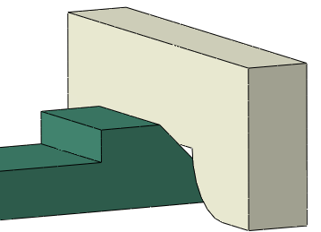
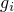
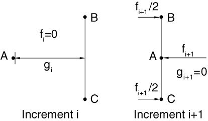

# 36.2.1 在Abaqus/Standard中定义一般接触相互作用


**产品：** Abaqus/Standard  Abaqus/CAE

##### **参考**

- ["接触相互作用分析：概述，" 第36.1.1节"](pt09ch36s01abo33.md)
- [*CONTACT*](../key/key-link.md#usb-kws-hcontact)
- [*CONTACT INCLUSIONS*](../key/key-link.md#usb-kws-hcontactinclusions)
- [*CONTACT EXCLUSIONS*](../key/key-link.md#usb-kws-hcontactexclusions)
- ["定义一般接触，" Abaqus/CAE用户指南第15.13.1节"](../usi/usi-link.md#usi-itn-help-general)

### 概述

Abaqus/Standard提供了两种用于建模接触和相互作用问题的算法：一般接触算法和接触对算法。见["接触相互作用分析：概述，" 第36.1.1节"](pt09ch36s01abo33.md)，了解两种算法的比较。本节描述如何在Abaqus/Standard分析中包含一般接触、如何指定可能参与一般接触相互作用的模型区域，以及如何从一般接触分析获取输出。

Abaqus/Standard中的一般接触算法：
- 作为模型定义的一部分规定；
- 允许非常简单的接触定义，对所涉及的表面类型几乎没有限制；
- 使用复杂的跟踪算法以确保有效施加适当的接触条件；
- 可以与接触对算法同时使用（即，一些相互作用可以用一般接触算法建模，而其他用接触对算法建模）；
- 可以与二维或三维表面一起使用；和
- 使用有限滑动、表面-表面接触公式。

### 定义一般接触相互作用

一般接触相互作用的定义包括指定：
- 一般接触算法和定义接触域（即彼此相互作用的表面），如本节所述；
- 接触表面属性（["Abaqus/Standard中一般接触的表面属性，" 第36.2.2节"](pt09ch36s02aus140.md)）；
- 机械接触属性模型（["Abaqus/Standard中一般接触的接触属性，" 第36.2.3节"](pt09ch36s02aus141.md)）；
- 与初始接触状态相关的控制（["控制Abaqus/Standard中的初始接触状态，" 第36.2.4节"](pt09ch36s02aus142.md)）；和
- 算法接触控制（["Abaqus/Standard中一般接触的数值控制，" 第36.2.6节"](pt09ch36s02aus144.md)）。

使用一般接触定义组件装配各个组件之间接触的分析示例在["棘轮 pawl-ratchet装置的冲击分析，" Abaqus例题问题指南第2.1.17节"](../exa/exa-link.md#exa-dyn-pawlratchet)中描述。

### 用于一般接触的表面

Abaqus/Standard中的一般接触算法在其使用的表面中允许相当通用的特性，如["接触相互作用分析：概述，" 第36.1.1节"](pt09ch36s01abo33.md)中所讨论。有关在Abaqus/Standard中为一般接触算法定义表面的详细信息，见["基于单元的表面定义，" 第2.3.2节"](pt01ch02s03aus17.md)。

指定接触域的方便方法是使用裁剪表面。这种表面可用于通过使用在原始配置中由指定矩形盒子包围的接触域来执行"盒子中的接触"。更多信息，见["操作表面，" 第2.3.6节"](pt01ch02s03aus21.md)。

此外，Abaqus/Standard自动定义一个全包容表面，用于规定接触域非常方便，如本节后面所述。全包容自动定义表面包含所有基于单元的表面片。

Abaqus/Standard中的一般接触算法提供建模表面-表面接触、边缘-表面接触和边缘-边缘接触的能力。表面-表面接触公式用作主要公式，可以将边缘-表面和边缘-边缘公式用作补充公式。边缘-表面接触公式也用于建模梁或桁架单元段与片面表面之间的接触。类似地，边缘-边缘接触公式也支持梁或桁架单元段之间的接触。见下面关于["边缘-表面接触的考虑"](pt09ch36s02aus139.md#usb-cni-acontactgeneralstd-e-to-s)"和["边缘-边缘接触的考虑"](pt09ch36s02aus139.md#usb-cni-acontactgeneralstd-e-to-e)"的更多信息。

一般接触算法不考虑涉及解析表面或基于节点的表面的接触，尽管这些表面类型可以包含在使用一般接触的分析中的接触对中。

### 在分析中包含一般接触

Abaqus/Standard中的一般接触在分析开始时定义。只能指定一个一般接触定义，且此定义在分析的每个步中都有效。

| **输入文件用法：** | 使用以下选项指示一般接触定义的开始： |
| --- | --- |
| | ``` [*CONTACT*](../key/key-link.md#usb-kws-hcontact) ``` 此选项只能在模型定义中出现一次。 |

| **Abaqus/CAE用法：** | 相互作用模块：**创建相互作用**：**步**：**初始**，**一般接触（Standard）** |
| --- | --- |

### 定义一般接触域

您通过定义一般接触包含和排除来指定可能彼此接触的模型区域。在模型定义中只允许一个接触包含定义和一个接触排除定义。

分析中的所有接触包含首先应用，然后应用所有接触排除，而不管它们指定的顺序如何。接触排除优先于接触包含。一般接触算法将仅考虑由接触包含定义指定且不由接触排除定义指定的那些相互作用。

一般接触相互作用通常通过为Abaqus/Standard提供的默认自动生成表面指定自接触来定义。一般接触算法中使用的所有表面可以跨越多个未连接的物体，因此此算法中的自接触不限于单个物体与自身的接触。例如，跨越两个物体的表面的自接触意味着物体之间的接触以及每个物体与自身的接触。

#### 指定接触包含

定义接触包含以指定应考虑接触目的的模型区域。

##### 为整个模型指定"自动"接触

您可以为Abaqus/Standard自动定义的默认未命名、全包容表面指定自接触。此默认表面包含除下面注释外的所有外部单元面。这是定义接触域的最简单方法。

默认表面不包含仅属于内聚单元的面。实际上，默认表面的生成就好像内聚单元不存在一样。见["使用内聚单元建模，" 第32.5.3节"](pt06ch32s05alm42.md)，了解与内聚单元相关的接触建模问题的进一步讨论。

| **输入文件用法：** | 使用以下两个选项为整个模型指定"自动"接触： |
| --- | --- |
| | ``` [*CONTACT*](../key/key-link.md#usb-kws-hcontact) [*CONTACT INCLUSIONS*](../key/key-link.md#usb-kws-hcontactinclusions), ALL EXTERIOR ``` 当使用ALL EXTERIOR参数时，[*CONTACT INCLUSIONS*](../key/key-link.md#usb-kws-hcontactinclusions)选项不应有数据行。 |

| **Abaqus/CAE用法：** | 相互作用模块：**创建相互作用**：**一般接触（Standard）**：**包含的表面对：全部*自接触** |
| --- | --- |

##### 指定单个接触相互作用

或者，您可以通过指定单个接触表面对来直接定义一般接触域。仅当中对中指定的两个表面重叠（或相同）时才建模自接触，且仅在重叠区域中建模。在某些情况下，可以通过仅包含在分析期间将经历接触的表面部分到一般接触域中来提高计算性能和稳健性。

多个表面对可以包含在接触域中。所有指定的表面必须是基于单元的表面。

| **输入文件用法：** | 使用以下两个选项指定单个接触相互作用： |
| --- | --- |
| | ``` [*CONTACT*](../key/key-link.md#usb-kws-hcontact) [*CONTACT INCLUSIONS*](../key/key-link.md#usb-kws-hcontactinclusions) *表面_1*, *表面_2* ``` 当省略ALL EXTERIOR参数时，必须指定至少一个数据行。两个数据行条目都可以留空，但每个数据行必须至少包含一个逗号；将为空数据行发出错误消息。如果省略第一个表面名称，则假定为默认未命名、全包容、自动生成的表面。如果省略第二个表面名称或与第一个表面名称相同，则假定为第一个表面与其自身的接触。两个数据行条目都留空等效于使用ALL EXTERIOR参数。 |

| **Abaqus/CAE用法：** | 相互作用模块：**创建相互作用**：**一般接触（Standard）**：**包含的表面对：选定的表面对**：**编辑**，在左侧列中选择表面，然后点击中间的箭头将它们转移到包含对列表 |
| --- | --- |

##### 示例

以下输入指定应在默认全包容、自动生成的表面与*表面_2*之间强制执行接触，包括任何重叠区域中的自接触：

```
[*CONTACT*](../key/key-link.md#usb-kws-hcontact)
[*CONTACT INCLUSIONS*](../key/key-link.md#usb-kws-hcontactinclusions)
 , *surface_2*
```

以下任一方法可用于定义*表面_1*的自接触：
```
[*CONTACT*](../key/key-link.md#usb-kws-hcontact)
[*CONTACT INCLUSIONS*](../key/key-link.md#usb-kws-hcontactinclusions)
*surface_1*, 
```

或
```
[*CONTACT*](../key/key-link.md#usb-kws-hcontact)
[*CONTACT INCLUSIONS*](../key/key-link.md#usb-kws-hcontactinclusions)
*surface_1*, *surface_1*
```

#### 指定接触排除

您可以通过指定要从接触中排除的模型区域来细化接触域定义。指定接触排除的可能动机包括：
- 避免物理上不合理的接触相互作用；
- 通过排除模型中不太可能相互作用的部分来提高计算性能。

将为所有指定的表面对忽略接触，即使这些相互作用在接触包含定义中直接指定或间接指定。

多个表面对可以从接触域中排除。所有指定的表面必须是基于单元的表面。请记住，表面可以定义为跨越多个未连接的物体，因此自接触排除不限于单物体接触的排除。

| **输入文件用法：** | 使用以下两个选项指定接触排除： |
| --- | --- |
| | ``` [*CONTACT*](../key/key-link.md#usb-kws-hcontact) [*CONTACT EXCLUSIONS*](../key/key-link.md#usb-kws-hcontactexclusions) *表面_1*, *表面_2* ``` 两个数据行条目都可以留空。如果省略第一个表面名称，则假定为默认未命名、全包容、自动生成的表面。如果省略第二个表面名称或与第一个表面名称相同，则从接触域中排除第一个表面与其自身的接触。 |

| **Abaqus/CAE用法：** | 相互作用模块：**创建相互作用**：**一般接触（Standard）**：**排除的表面对：编辑**，在左侧列中选择表面，然后点击中间的箭头将它们转移到排除对列表 |
| --- | --- |

##### 自动生成的接触排除

Abaqus/Standard在某些情况下自动为一般接触生成接触排除。
- 为避免这些相互作用约束的冗余（且可能不一致）施加，自动为使用接触对算法或基于表面的绑定约束定义的相互作用生成接触排除。例如，如果为`表面_1`和`表面_2`定义了接触对，且为整个模型定义了"自动"一般接触，则Abaqus/Standard为`表面_1`和`表面_2`之间的一般接触生成接触排除，以便这些表面之间的相互作用仅用接触对算法建模。这些自动生成的接触排除在整分析中有效。
- Abaqus/Standard自动为模型中每个刚性体的自接触生成接触排除，因为刚性体不可能与自身接触。
- 当您为特定一般接触表面对指定纯主-从接触表面加权时，自动生成与指定相反的主-从方向排除（见["Abaqus/Standard中一般接触的数值控制，" 第36.2.6节"](pt09ch36s02aus144.md)，了解更多关于此类接触排除的信息）。
- Abaqus/Standard为涉及一般接触域中断开体的接触分配默认纯主-从角色，默认情况下为主-从方向生成排除。通过替代纯主-从分配或平衡主-从分配覆盖默认纯主-从分配的选项在["Abaqus/Standard中一般接触的数值控制，" 第36.2.6节"](pt09ch36s02aus144.md)中讨论。
- 在模型初始配置中严重过闭合的表面部分自动生成接触排除。见["控制Abaqus/Standard中的初始接触状态，" 第36.2.4节"](pt09ch36s02aus142.md)，了解更多相关信息。

##### 示例

以下输入指定接触域基于全包容、自动生成的表面的自接触，但应忽略全包容、自动生成的表面与*表面_2*之间的接触（包括任何重叠区域中的自接触）：

```
[*CONTACT*](../key/key-link.md#usb-kws-hcontact)
[*CONTACT INCLUSIONS*](../key/key-link.md#usb-kws-hcontactinclusions), ALL EXTERIOR
[*CONTACT EXCLUSIONS*](../key/key-link.md#usb-kws-hcontactexclusions)
 , *surface_2*
```

以下任一方法可用于从接触域中排除*表面_1*的自接触：

```
[*CONTACT EXCLUSIONS*](../key/key-link.md#usb-kws-hcontactexclusions)
*surface_1*,
```

或
```
[*CONTACT EXCLUSIONS*](../key/key-link.md#usb-kws-hcontactexclusions)
*surface_1*, *surface_1*
```

### 边缘-表面接触的考虑

一般接触算法可以考虑三维边缘-表面接触。除了建模梁或桁架单元段与片面表面之间的接触外，它在解决某些相互作用方面比表面-表面接触公式更有效。当用作表面-表面接触公式的补充时，边缘-表面接触公式旨在避免一个表面的特征边缘局部穿透另一个表面相对平滑的部分，当活动接触区域中相应表面片的法向方向形成斜角时。[图36.2.1-1](pt09ch36s02aus139.md#edge-surface-needed)所示的模型将受益于补充边缘-表面接触施加，因为在插入载荷的某些时期活动接触区域对应于特征边缘。[图36.2.1-2](pt09ch36s02aus139.md#edge-surface-notneeded)所示的模型不需要补充边缘-表面接触施加，因为表面-表面接触公式能够充分抵抗穿透。

**图36.2.1-1** 涉及接触区域中表面法向之间斜角的特征边缘-表面接触的 snap-fit 示例。



**图36.2.1-2** 具有相对表面法向的活动接触区域周缘处特征边缘的示例。


表示梁和桁架单元的接触边缘具有圆形横截面，无论梁或桁架单元的实际横截面如何。表示桁架单元的接触边缘的半径由桁架截面定义上指定的横截面积导出（它等于等效横截面积的实心圆截面的半径）。对于具有圆形横截面的梁，接触边缘的半径等效于截面半径。对于具有非圆形横截面的梁，接触边缘的半径等于截面外接圆的半径。梁或桁架单元的边缘-表面接触通过将相关表面包含到一般接触域中来激活。默认情况下，全包容表面包含基于梁或桁架单元的表面。

默认情况下，当表面用于一般接触相互作用时，所有适用的片元都与具有至少45°特征角的实体和壳单元边缘一起包含在接触定义中。见["Abaqus/Standard中一般接触的表面属性中的特征边缘" in "表面属性，" 第36.2.2节"](pt09ch36s02aus140.md#usb-cni-asurfacepropassignstd-featedge)，了解与边缘-表面接触考虑的特征边缘相关的控制讨论。边缘-表面接触约束从不参与热、电或孔隙压力接触属性。例如，在耦合温度-位移分析中，表面-表面约束可以影响机械和热相互作用；但是，如果包含边缘-表面约束，它们将仅帮助抵抗穿透。

与特征边缘相关的接触面积取决于网格尺寸；因此，与边缘-表面接触相关的接触压力（单位面积力）取决于网格。

表面-表面和边缘-表面接触约束可能同时在同一节点活动。为帮助避免数值过约束问题，边缘-表面接触约束始终用惩罚方法施加。

### 边缘-边缘接触的考虑

一般接触算法可以可选地考虑边缘-边缘接触。可以包含实体和类壳表面上的特征边缘、壳周缘边缘以及表示梁（和桁架）的边缘。

两种边缘-边缘接触公式可用。第一种公式最初为具有厚度的梁之间的接触而开发，使用其中一个梁的径向方向作为接触方向（类似于管-管接触单元的做法，在["管-管接触单元，" 第40.3.1节"](pt09ch40s03alm65.md)中讨论）。此公式不仅适用于梁边缘，也适用于具有相关壳厚度的壳周缘边缘。另一种公式将接触法向方向基于所考虑接触的两个相应边缘之间的叉积；此公式主要关注非平行边缘之间的接触。

除了选择接触公式外，您必须指定特征角度标准以激活参与边缘-边缘接触的特征和周缘边缘。见["Abaqus/Standard中一般接触的表面属性中的特征边缘" in "表面属性，" 第36.2.2节"](pt09ch36s02aus140.md#usb-cni-asurfacepropassignstd-featedge)，了解与边缘-边缘接触考虑的特征边缘相关的控制讨论。如果仅存在梁边缘，仅指定接触公式就足够了。

梁-梁接触不能用于建模与底层实体或壳单元共享节点的类梁单元之间的接触（例如，用于建模纵向加筋的梁单元）。

| **输入文件用法：** | 使用以下选项激活边缘-边缘接触的两种公式： |
| --- | --- |
| | ``` [*CONTACT FORMULATION*](../key/key-link.md#usb-kws-hcontformulation), TYPE=EDGE TO EDGE, FORMULATION=BOTH ``` 使用以下选项停用边缘-边缘接触： ``` [*CONTACT FORMULATION*](../key/key-link.md#usb-kws-hcontformulation), TYPE=EDGE TO EDGE, FORMULATION=NO（默认） ``` 使用以下选项激活径向边缘-边缘接触公式： ``` [*CONTACT FORMULATION*](../key/key-link.md#usb-kws-hcontformulation), TYPE=EDGE TO EDGE, FORMULATION=RADIAL ``` 使用以下选项激活基于边缘方向叉积的边缘-边缘接触公式： ``` [*CONTACT FORMULATION*](../key/key-link.md#usb-kws-hcontformulation), TYPE=EDGE TO EDGE, FORMULATION=CROSS ``` |

| **Abaqus/CAE用法：** | 在Abaqus/CAE中不支持建模边缘-边缘接触。 |
| --- | --- |

### 输出

与接触相关的输出变量分为两类：节点变量（有时称为约束变量）和整个表面变量。此外，Abaqus输出与接触相互作用相关的诊断信息数组，如["Abaqus/Standard分析中的接触诊断，" 第39.1.1节"](pt09ch39s01aus183.md)和为一般接触生成的内部表面中所讨论。

有关与热、电和孔隙流体分析相关的变量的更详细讨论，见["接触属性模型"第37章"](../pt09ch37.md)中相关接触属性的部分。

#### 一般接触域和组件表面

Abaqus/Standard生成以下与一般接触相关的内部表面：
- `General_Contact_Faces`,
- `General_Contact_Edges`,
- `General_Contact_Faces_*k*`,和
- `General_Contact_Edges_*k*`,

其中`*k*`对应于自动分配的"组件编号"。没有组件编号的的一般接触的两个内部表面分别包含一般接触域中包含的所有表面片和所有特征边缘。

每个特征边缘组件表面`General_Contact_Edges_*k*`是对应面组件表面`General_Contact_Faces_*k*`的满足特征边缘标准的边缘子集。面组件表面彼此之间没有公共节点。默认情况下，较低编号的基于面的组件表面将作为基于表面-表面公式的高编号基于面的组件表面的主表面。组件编号不影响边缘-表面公式的考虑。组件表面在两种公式类型的诊断消息中被引用。

内部表面可以在Abaqus/CAE的 Visualization 模块中使用显示组查看。Abaqus/Standard生成的内部表面名称不应在模型定义中使用。

#### 节点接触变量

节点接触变量可以在Abaqus/CAE的 Visualization 模块中的接触表面上绘制等值线。节点接触变量包括接触压力和力、摩擦剪切应力和力、接触期间表面的相对切向运动（滑动）、表面之间的间隙、单位面积热或流体通量以及流体压力。写入输出数据库（`.odb`）文件的许多节点接触变量通常对所有接触节点可用，无论它们是作为从节点还是主节点。其他节点接触变量仅在作为从节点的节点处可用。大多数对数据（`.dat`）文件、结果（`.fil`）文件和实用程序子程序`GETVRMAVGATNODE`的接触输出与单个约束相关。对于对输出数据库（`.odb`）文件的接触输出，应用一些滤波来减少接触输出噪声。

##### 接触压力

接触压力分布在许多Abaqus分析中是关键关注点。您可以查看除解析刚性表面和基于刚性类型单元的离散刚性表面外的所有接触表面上的接触压力（后者限制不适用于一般接触）。您可以在接触压力等值线图旁边查看接触压力误差指标的等值线图，以深入了解接触压力解在感兴趣区域中的局部精度（见["影响自适应重新网格划分的误差指标选择，" 第12.3.2节"](pt04ch12s03aus84.md)，了解误差指标输出的进一步讨论）。

在某些情况下，您可能会观察到接触压力超出实际接触区域，由于以下因素：
- 等值线图通过插值节点值构建，这可能导致在接触区域外的片部分内出现非零值。例如，这种效果在角落处通常很明显，例如当两个相同大小、对齐的块接触时——如果接触表面缠绕在角落周围，接触压力等值线将略微延伸至角落周围。
- 为最小化活动接触区域内的接触应力噪声，Abaqus/Standard将节点接触应力计算为节点参与的活动接触约束值的加权平均值。应用一些滤波来减少为活动接触区域边缘（仅弱参与接触约束）的节点报告的接触应力值，但这种滤波不是"完美的"，可能导致接触区域大小显得有点夸大。类似地，接触状态输出也会受到活动接触区域边缘节点的影响。在这种情况下，接触状态可能在夸张区域中的节点处报告为闭合，即使它是开放的。

由于这些因素，试图从接触应力分布推断接触力分布可能有些误导。相反，您可以请求节点接触力输出，它准确表示分析中存在的接触力分布。

##### 由边缘-表面和边缘-边缘相互作用引起的接触应力

对于边缘-表面接触和径向公式的边缘-边缘接触，其中活动接触沿一条线，可以在Abaqus/Standard中请求输出变量CLINELOAD到输出数据库（`.odb`）。此接触载荷单位为单位长度力，与网格无关。只能由边缘-表面接触输出的接触应力（单位面积力）CSTRESSETOS可用于可视化边缘-表面约束活动的区域。边缘-表面公式通过将单位边缘长度的接触力除以代表性表面片长度来计算单位面积的接触应力。由于接触面积取决于网格尺寸，边缘-表面接触应力取决于网格。对于使用叉积公式的边缘-边缘接触，其中活动接触区域被理想化为一个点，可以请求与网格无关的输出变量CPOINTLOAD（单位为力）。

接触应力（CSTRESS）包含来自表面-表面、边缘-表面和边缘-边缘约束的贡献（如果活动的话）。在累积来自边缘-表面和边缘-边缘接触约束的贡献时，约束值除以代表性表面片长度或其平方值，以适当缩放它们具有单位面积力的单位。

边缘表示表面平滑性的不连续性，边缘附近的真实接触应力解通常以强梯度为特征。接触应力（CSTRESSERI）的误差指标输出通常在涉及边缘的约束重要的区域相当高。

#### 整个表面变量

在Abaqus/Standard中，一般接触的整个表面变量仅略微支持，因为这些变量默认与整体一般接触域相关，而不是与一般接触相关的单个表面。将整个表面变量限制为受一般接触域的一部分影响的唯一方法是指定输出请求中的节点集。整个表面变量计算为一般接触中作为从节点活动的所有节点（或可选地限制为特定节点集）的总和。例如，CFN是由于接触压力作用于从节点的总力。CFN和其他一般接触的整个表面变量通常用途不大，因为来自一般接触内不同相互作用的变量贡献通常会相互抵消，结果通常取决于主和从角色的内部分配。

#### 请求输出

某些接触变量必须作为一组请求。例如，要输出表面之间的间隙（COPEN），您必须请求变量CDISP（接触位移）。CDISP输出COPEN和CSLIP（接触期间表面的切向运动）。可用接触变量和标识符的完整列表在["Abaqus/Standard输出变量标识符，" 第4.2.1节"](pt02ch04s02abv01.md)中给出。

可以通过指定包含作为某些一般接触相互作用的从节点子集的节点集来限制输出请求。这些输出请求的形成说明可在以下部分找到：
- 要请求对数据（`.dat`）文件的输出，见["Abaqus/Standard表面输出" in "输出到数据和结果文件，" 第4.1.2节"](pt02ch04s01aus39.md#usb-out-oprintfile-surface)。
- 要请求对输出数据库（`.odb`）文件的输出，见["Abaqus/Standard和Abaqus/Explicit表面输出" in "输出到输出数据库，" 第4.1.3节"](pt02ch04s01aus40.md#usb-out-odboutput-surface)。

#### 切向结果的输出

Abaqus报告切向变量（摩擦剪切应力、粘性剪切应力和相对切向运动）的值，相对于在表面上定义的局部切向方向。局部切向方向的定义在["Abaqus/Standard中的接触公式中的表面局部切向方向，" 第38.1.1节"](pt09ch38s01aus177.md#usb-cni-acontactpairform-slipdir)中解释。这些方向并不总是对应于全局坐标系，它们在几何非线性分析中随接触对旋转。

Abaqus/Standard通过获取变量矢量与约束点关联的局部切向方向或的标量积来计算每个约束点的切向结果。变量名称末尾的数字指示变量是否对应于第一或第二局部切向方向。例如，CSHEAR1是第一个局部切向方向的摩擦剪切应力分量，而CSHEAR2是第二个局部切向方向的摩擦剪切应力分量。

##### 累积增量相对运动（滑动）的定义

Abaqus/Standard将增量相对运动（也称为滑动）定义为增量相对节点位移矢量与局部切向方向的标量积。增量相对节点位移矢量测量从节点相对于主表面运动的运动。增量滑动仅在从节点接触主表面时累积。在分析期间所有此类增量滑动的总和报告为CSLIP1和CSLIP2。关于此量计算的详细信息，见["物体之间的小滑动相互作用，" Abaqus理论指南第5.1.1节"](../stm/stm-link.md#stm-ifc-smslidcontact)；["变形体之间的有限滑动相互作用，" Abaqus理论指南第5.1.2节"](../stm/stm-link.md#stm-ifc-slidecontactelem)；和["变形体与刚性体之间的有限滑动相互作用，" Abaqus理论指南第5.1.3节"](../stm/stm-link.md#stm-ifc-defbodyrigidsurf)。

#### 扩展为间隙提供接触开口输出的范围

为降低计算成本，默认情况下避免在表面分离距离大于可能传递接触力（或热通量等）的最小间隙距离的区域进行监测潜在相互作用点的详细计算。因此，接触开口（COPEN）输出通常不在表面张开量相对于表面片尺寸较大的区域提供。您可以扩展Abaqus/Standard提供接触开口输出的范围；COPEN将提供到等于指定"跟踪厚度"的间隙距离。使用此控制可能会因额外的接触跟踪计算而增加计算成本，特别是如果您指定较大的跟踪厚度值。

| **输入文件用法：** | [*SURFACE INTERACTION*](../key/key-link.md#usb-kws-hsurfaceinteraction), TRACKING THICKNESS=*值* |
| --- | --- |

| **Abaqus/CAE用法：** | 您不能在Abaqus/CAE中调整默认跟踪厚度。 |
| --- | --- |

#### 整个模型接触相关能量变量

接触相关能量变量（如[表36.2.1-1](pt09ch36s02aus139.md#table-contact-energy)所示）在Abaqus/Standard中可用（见["Abaqus/Standard输出变量标识符，" 第4.2.1节"](pt02ch04s02abv01.md)）。在接触分析中使用接触相关能量的示例在["接触分析中的能量计算，" Abaqus例题问题指南第1.1.25节"](../exa/exa-link.md#exa-sta-contactenergy)中提供。

**表36.2.1-1** 接触相关能量输出变量。
| 描述 | 输出变量 |
| --- | --- |
| 摩擦耗散 | ALLFD |
| 弹性接触能量 | 与正接触约束相关的所有惩罚弹簧和"软化"接触约束中存储的能量 | ALLCCEN |
| 与切向接触约束相关的所有惩罚弹簧中存储的能量 | ALLCCET |
| 与正和切向接触约束相关的所有惩罚弹簧和"软化"接触约束中存储的能量（等于ALLCCEN和ALLCCET的总和） | ALLCCE |
| 与接触稳定化和接触阻尼相关的能量耗散 | 整个模型的法向接触方向 | ALLCCSDN |
| 整个模型的切向接触方向 | ALLCCSDT |
| 整个模型（等于ALLCCSDN和ALLCCSDT的总和） | ALLCCSD |
| 与接触约束"不连续功"相关的能量 | 占接触力做的功中不被其他接触能量变量 accounted for 的部分 | ALLCCDW |

输出变量ALLSD和ALLVD也 accounted for 与接触稳定化和接触阻尼相关的耗散能量。

弹性接触能量和与接触稳定化和接触阻尼相关的耗散能量与数值效应相关，在理想情况下这些将为零，如无限惩罚刚度或零稳定化刚度。与模型中其他基于物理的能量（如内能ALLIE）相比，这些输出变量的显著值有时表示解不准确。接触约束不连续功将趋于零，因为时间增量大小变得非常小。然而，如["接触分析中的能量计算，" Abaqus例题问题指南第1.1.25节"](../exa/exa-link.md#exa-sta-contactenergy)中所讨论，ALLCCDW具有显著值而不会导致解不准确是相当常见的。

修正外部功（ALLWK + ALLCCDW）在表示接触问题中的物理外部功方面通常是代表性的，等于存储和耗散能量的总和（见["接触分析中的能量计算，" Abaqus例题问题指南第1.1.25节"](../exa/exa-link.md#exa-sta-contactenergy)）。考虑一个特定接触约束在一个增量中有间隙距离，在下一个增量中闭合并有接触力）。积分接触力做功的梯形法则将平均力乘以相对增量运动。在这种情况下，对ALLCCDW的 resulting 贡献为负的。这种能量贡献是非物理的，在数值上当时间增量趋于零时会消失。当接触张开时，会发生类似的行为并有符号反转。ALLWK的数值积分在准确核算外部力突然变化方面也有限制。求和ALLWK和ALLCCDW通常会抵消相应的非物理能量贡献，对总能量平衡ETOTAL的净影响为零。

**图36.2.1-3** 一个接触点示例，说明对ALLCCDW的贡献。




