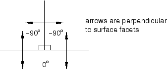
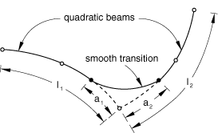
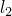
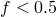

# 36.2.2 Abaqus/Standard中一般接触的表面属性


**产品：** Abaqus/Standard  Abaqus/CAE

##### **参考**

- ["在Abaqus/Standard中定义一般接触相互作用，" 第36.2.1节"](pt09ch36s02aus139.md)
- [*CONTACT*](../key/key-link.md#usb-kws-hcontact)
- [*SURFACE PROPERTY ASSIGNMENT*](../key/key-link.md#usb-kws-hsurfpropassign)
- ["为一般接触指定表面属性，" Abaqus/CAE用户指南第15.13.5节"](../usi/usi-link.md#usi-itn-help-general-surfprop)

### 概述

表面属性分配：
- 可用于指定表面区域的几何校正；
- 可用于更改基于结构元件的表面区域的接触厚度，或为基于实体元件的表面区域添加接触厚度；
- 可用于指定基于壳、膜、刚性和表面元件的表面区域的表面偏移；
- 可选择性地应用于一般接触域内的特定区域；和
- 不能应用于解析刚性表面。

### 分配表面属性

您可以为参与一般接触相互作用的表面分配非默认表面属性。这些属性仅在表面参与一般接触相互作用时才被考虑；在表面参与其他相互作用（如接触对）时不考虑。一般接触算法不考虑作为表面定义一部分指定的表面属性。

Abaqus/Standard中一般接触的表面属性在分析开始时分配，不能跨步修改。

用于指定具有非默认表面属性的区域的表面名称不必与用于指定一般接触域的表面名称对应。在许多情况下，接触相互作用将为大域定义，而将非默认表面属性分配给该域的子集。任何落在一般接触域之外的区域的表面属性分配将被忽略。如果指定区域重叠，最后分配优先。

| **输入文件用法：** | ``` [*SURFACE PROPERTY ASSIGNMENT*](../key/key-link.md#usb-kws-hsurfpropassign), PROPERTY ``` |
| --- | --- |
| | 此选项必须与[*CONTACT*](../key/key-link.md#usb-kws-hcontact)选项结合使用，下面讨论的PROPERTY参数的每个值最多应出现一次；数据行可以根据需要重复，以将表面属性分配给不同区域。 |

| **Abaqus/CAE用法：** | 相互作用模块：**创建相互作用**：**一般接触（Standard）**：**表面属性** |
| --- | --- |

### 表面几何校正

默认情况下，接触计算基于一般接触域中有限元表面的未平滑、片面表示。一种可选的接触平滑技术模拟接触计算中更现实的曲面表示，从而提高接触应力和压力精度。此接触平滑技术在["Abaqus/Standard中平滑接触表面，" 第38.1.3节"](pt09ch38s01aus179.md)中讨论。

### 表面厚度

默认表面厚度等于原始父单元厚度。或者，您可以指定表面厚度值或厚度缩放因子。可以为实体单元表面分配非零厚度；例如，对有限厚度表面涂层的影响建模。

#### 使用原始父单元厚度

默认表面厚度等于原始父单元厚度。

| **输入文件用法：** | ``` [*SURFACE PROPERTY ASSIGNMENT*](../key/key-link.md#usb-kws-hsurfpropassign), PROPERTY=THICKNESS *表面*, ORIGINAL（默认） ``` |
| --- | --- |
| | 如果省略表面名称，则假定为包含整个一般接触域的默认表面。 |

| **Abaqus/CAE用法：** | 相互作用模块：**创建相互作用**：**一般接触（Standard）**：**表面属性**：**表面厚度分配**：**编辑**：选择表面，点击箭头将表面转移到厚度分配列表，并在**厚度**列中输入ORIGINAL。 |
| --- | --- |

#### 指定表面厚度值

您可以直接指定表面厚度值。

| **输入文件用法：** | ``` [*SURFACE PROPERTY ASSIGNMENT*](../key/key-link.md#usb-kws-hsurfpropassign), PROPERTY=THICKNESS *表面*, *值* ``` |
| --- | --- |
| | 如果省略表面名称，则假定为包含整个一般接触域的默认表面。 |

| **Abaqus/CAE用法：** | 相互作用模块：**创建相互作用**：**一般接触（Standard）**：**表面属性**：**表面厚度分配**：**编辑**：选择表面，点击箭头将表面转移到厚度分配列表，并在**厚度**列中输入表面厚度幅值。 |
| --- | --- |

#### 对表面厚度应用缩放因子

您可以对任何表面厚度值应用缩放因子。例如，如果您指定原始父单元厚度应用于`surf1`并应用0.5的缩放因子，则当`surf1`参与一般接触相互作用时，将使用原始父单元厚度一半的值（包含在一般接触域中的所有其他表面将使用默认原始父单元厚度）。以这种方式缩放表面厚度可以在某些情况下避免初始过闭合。Abaqus/Standard将自动调整表面位置以解决与一般接触相关的初始过闭合（见["控制Abaqus/Standard中的初始接触状态，" 第36.2.4节"](pt09ch36s02aus142.md)）。但是，如果节点位置调整不可取（例如，如果它们会在原本平坦的部分中引入缺陷，导致不现实的屈曲模式），您可能更愿意减少表面厚度并完全避免过闭合。

| **输入文件用法：** | ``` [*SURFACE PROPERTY ASSIGNMENT*](../key/key-link.md#usb-kws-hsurfpropassign), PROPERTY=THICKNESS *表面*, *值或标签*, *缩放因子* ``` |
| --- | --- |
| | 如果省略表面名称，则假定为包含整个一般接触域的默认表面。 |

| **Abaqus/CAE用法：** | 相互作用模块：**创建相互作用**：**一般接触（Standard）**：**表面属性**：**表面厚度分配**：**编辑**：选择表面，点击箭头将表面转移到厚度分配列表，并输入**缩放因子**。 |
| --- | --- |

### 表面偏移

表面偏移是薄体中面与其参考平面（由节点坐标和单元连接定义）之间的距离。它通过将偏移分数（指定为表面厚度的分数）乘以表面厚度和单元片元法向来计算。这定义了中面的位置，从而定义了物体相对于参考表面的位置；参考表面上的节点坐标不会被修改。表面偏移只能为基于壳和类似单元的表面指定（即膜、刚性和表面单元）。为其他单元（如实体或梁单元）指定的表面偏移将被忽略。默认情况下，单元截面定义中指定的表面偏移将用于一般接触算法。

您可以将表面偏移指定为表面厚度的分数。表面偏移分数可以设置为等于用于表面父单元的偏移分数或指定值。为一般接触指定的表面偏移不会改变单元积分。

| **输入文件用法：** | 使用以下选项使用来自表面父单元的表面偏移分数（默认）： |
| --- | --- |
| | ``` [*SURFACE PROPERTY ASSIGNMENT*](../key/key-link.md#usb-kws-hsurfpropassign), PROPERTY=OFFSET FRACTION *表面*, ORIGINAL ``` 使用以下选项指定表面偏移分数的值： ``` [*SURFACE PROPERTY ASSIGNMENT*](../key/key-link.md#usb-kws-hsurfpropassign), PROPERTY=OFFSET FRACTION *表面*, *偏移* ``` 偏移可以指定为值或标签（SPOS或SNEG）。指定SPOS等效于指定值0.5；指定SNEG等效于指定值-0.5。 |

| **Abaqus/CAE用法：** | 相互作用模块：**创建相互作用**：**一般接触（Standard）**：**表面属性**：**壳/膜偏移分配**：**编辑**：选择表面，点击箭头将表面转移到偏移分配列表。在**偏移分数**列中，输入ORIGINAL以使用来自表面父单元的表面偏移分数，输入SPOS以使用0.5的表面偏移分数，输入SNEG以使用-0.5的表面偏移分数，或输入表面偏移分数的值。 |
| --- | --- |

### 特征边缘

模型的特征边缘在梁和桁架单元上以及实体和结构单元面的边缘（周缘及其他）上定义。Abaqus/Standard中的一般接触包括边缘-表面接触公式和边缘-边缘接触公式（作为表面-表面公式的补充），如["在Abaqus/Standard中定义一般接触相互作用，" 第36.2.1节"](pt09ch36s02aus139.md)中所讨论。默认情况下，边缘-表面接触公式考虑梁和桁架单元的"边缘"、周缘边缘以及对应于45°及更高初始几何特征角度的边缘。您可以为边缘-表面和边缘-边缘接触全局或局部控制特征边缘标准。特征边缘标准对梁和桁架单元的"边缘"没有影响——它们通过包含在接触域中被激活。

接触属性分配选项的某些方面仅适用于表面-表面公式（见["Abaqus/Standard中一般接触的接触属性，" 第36.2.3节"](pt09ch36s02aus141.md)，了解更多关于一般接触的接触属性的讨论）。边缘-表面和边缘-边缘公式始终使用惩罚施加方法，仅涉及位移自由度。例如，边缘-表面公式或交叉边缘-边缘公式对跨接触界面的热间隙传导没有贡献。

#### 指定截止特征角度

特征角度是两个连接到边缘的片元法向之间形成的角度。片元之间的角度基于初始配置。在片元凹面会合处产生负角度；因此，这些边缘从不包含在接触域中。[图36.2.2-1](pt09ch36s04aus156.md#feature-angles)显示了一些关于如何为不同边缘计算特征角度的示例。

**图36.2.2-1** 计算特征角度。


边缘A的特征角度为90°（和之间的角度）；边缘B的特征角度为25°（和之间的角度）。边缘C与三个片元形成T形交叉（[图36.2.2-2](pt09ch36s04aus156.md#t-intersection-angles)中以二维显示）；其特征角度为0°、90°和90°。

**图36.2.2-2** T形交叉的特征角度（例如，[图36.2.2-1](pt09ch36s04aus156.md#feature-angles)中边缘C）。



周缘边缘（例如，[图36.2.2-1](pt09ch36s04aus156.md#feature-angles)中边缘D）可以被认为是特征角度为180°的特殊类型的特征边缘。

如果特征角度标准生效（默认或因为您指定了），则具有大于或等于指定角度的特征角度的实体和壳体的几何边缘包含在一般接触域中。接触包含和排除选项（在["在Abaqus/Standard中定义一般接触相互作用，" 第36.2.1节"](pt09ch36s02aus139.md)中讨论）适用于表面-表面接触公式、边缘-表面接触公式和边缘-边缘接触公式（并进一步控制表面的哪些部分可能与任一公式相互作用）。在确定是否应将几何特征边缘包含在一般接触域中时考虑特征角度的符号。例如，如果指定了20°的截止特征角度，边缘A将在接触模型中被激活为特征边缘（因为90°的特征角度大于20°的截止），但边缘B和C不会被激活（因为边缘B处的特征角度为25°，边缘C处的最大特征角度为0°，都小于20°的截止）。截止特征角度不能设置为小于0°或大于180°。指定小的截止特征角度（例如，小于20°）可能会大大增加运行时间，而与较大截止角度（>20°）相比对结果影响不大。边缘-表面接触的默认特征角度截止为45°，而边缘-边缘接触的默认是不包含特征边缘。边缘-表面接触的边缘包含标准可以与边缘-边缘接触的边缘包含标准不同；两者完全独立。

[图36.2.2-3](pt09ch36s04aus156.md#feature-edges)进一步说明了特征角度如何用于确定哪些几何特征边缘在一般接触域中被激活。

**图36.2.2-3** 对于45°的截止特征角度，在一般接触域中被激活的特征边缘。


图右侧的表列出了模型中各个边缘的特征角度值。连接到壳片元但不在壳周缘上的边缘有多个对应的特征角度。边缘上最大的特征角度与默认或指定的截止特征角度进行比较。例如，如果45°的默认截止特征角度有效，边缘A、D和E将被考虑用于边缘-表面接触，而边缘B、C和F将被忽略用于边缘-表面接触。

| **输入文件用法：** | ``` [*SURFACE PROPERTY ASSIGNMENT*](../key/key-link.md#usb-kws-hsurfpropassign), PROPERTY=FEATURE EDGE CRITERIA *表面*, *边缘_到_表面_特征角度值*, , *边缘_到_边缘_特征角度值* ``` |
| --- | --- |
| | 如果省略表面名称，则假定为包含整个一般接触域的默认表面。 |

| **Abaqus/CAE用法：** | 使用以下选项为边缘-表面接触指定截止特征角度： |
| --- | --- |
| | 相互作用模块：**创建相互作用**：**一般接触（Standard）**：**表面属性**：**特征边缘标准分配**：**编辑**：选择表面，点击箭头将表面转移到特征分配列表，并在**特征边缘标准**列中输入截止特征角度的数值（度）。在Abaqus/CAE中不支持控制边缘-边缘接触的截止特征角度。 |

#### 指定仅应激活周缘边缘

您可以指定仅边缘-表面和/或边缘-边缘公式全局或局部考虑周缘边缘。周缘边缘出现在壳单元的"物理"周缘上，也出现在当身体上暴露片元的子集包含在一般接触域中时出现的"人造"边缘上。边缘作为接触域周缘上（或具有特定特征角度的几何边缘）的分类基于接触包含和接触排除定义以及网格特征。当结构单元与连续体单元共享节点时，周缘边缘将不会在结构单元上被激活，因为将它们指定为这样的标准不再满足。

| **输入文件用法：** | ``` [*SURFACE PROPERTY ASSIGNMENT*](../key/key-link.md#usb-kws-hsurfpropassign), PROPERTY=FEATURE EDGE CRITERIA *表面*, PERIMETER EDGES, , PERIMETER EDGES ``` |
| --- | --- |
| | 如果省略表面名称，则假定为包含整个一般接触域的默认表面。 |

| **Abaqus/CAE用法：** | 使用以下选项指定仅应包含用于边缘-表面接触的周缘边缘： |
| --- | --- |
| | 相互作用模块：**创建相互作用**：**一般接触（Standard）**：**表面属性**：**特征边缘标准分配**：**编辑**：选择表面，点击箭头将表面转移到特征分配列表，并在**特征边缘标准**列中输入PERIMETER。在Abaqus/CAE中不支持指定仅应包含用于边缘-边缘接触的周缘边缘。 |

#### 指定不应包含特征边缘

您可以指定不应全局或局部考虑边缘-表面公式的边缘。但是，这样做不会停用与梁和桁架单元关联的"接触边缘"。默认情况下，特征边缘不包含用于边缘-边缘接触。

| **输入文件用法：** | ``` [*SURFACE PROPERTY ASSIGNMENT*](../key/key-link.md#usb-kws-hsurfpropassign), PROPERTY=FEATURE EDGE CRITERIA *表面*, NO FEATURE EDGES ``` |
| --- | --- |
| | 如果省略表面名称，则假定为包含整个一般接触域的默认表面。 |

| **Abaqus/CAE用法：** | 使用以下选项指定不包含用于边缘-表面接触的特征边缘： |
| --- | --- |
| | 相互作用模块：**创建相互作用**：**一般接触（Standard）**：**表面属性**：**特征边缘标准分配**：**编辑**：选择表面，点击箭头将表面转移到特征分配列表，并在**特征边缘标准**列中输入NONE。 |

### 平滑梁段

对于径向梁-梁接触，Abaqus/Standard平滑两个梁（或桁架）之间的任何不连续过渡。[图36.2.2-4](pt09ch36s02aus140.md#beam-lin-smoothing)显示了一阶梁的平滑，[图36.2.2-5](pt09ch36s02aus140.md#beam-quad-smoothing)显示了二阶梁的平滑。

**图36.2.2-4** 线性梁之间的平滑。


**图36.2.2-5** 二次梁之间的平滑。



#### 控制平滑程度

您可以通过指定分数*f*来控制平滑程度。*f*的默认值为0.2。


其中和是在表面节点处连接的梁单元的长度，（见[图36.2.2-4](pt09ch36s02aus140.md#beam-lin-smoothing)和[图36.2.2-5](pt09ch36s02aus140.md#beam-quad-smoothing)）。Abaqus/Standard在与不连续存在的节点距离和的两点之间构建抛物线或三次段；此平滑段用于接触计算。因此，接触几何形状与梁单元几何形状不同。在三个或更多梁共享同一节点的地方不会发生这种平滑。

| **输入文件用法：** | ``` [*SURFACE PROPERTY ASSIGNMENT*](../key/key-link.md#usb-kws-hsurfpropassign), PROPERTY=BEAM SMOOTHING *表面*, *值* ``` |
| --- | --- |
| | 如果省略表面名称，则假定为由整个一般接触域中所有梁段组成的表面。 |

| **Abaqus/CAE用法：** | 在Abaqus/CAE中不支持控制梁段的平滑程度。 |
| --- | --- |


