# 36.2.5 Abaqus/Standard中一般接触的稳定化


**产品：** Abaqus/Standard  Abaqus/CAE

##### **参考**

- ["在Abaqus/Standard中定义一般接触相互作用，" 第36.2.1节"](pt09ch36s02aus139.md)
- [*CONTACT*](../key/key-link.md#usb-kws-hcontact)
- [*CONTACT STABILIZATION*](../key/key-link.md#usb-kws-hcontactstab)
- ["创建接触稳定化定义，" Abaqus/CAE用户指南第15.12.5节"](../usi/usi-link.md#usi-itn-helptopic-stabilization)
- ["为一般接触指定和修改接触稳定化分配，" Abaqus/CAE用户指南第15.13.4节"](../usi/usi-link.md#usi-itn-help-general-stabilassign)

### 概述

Abaqus/Standard中一般接触的接触稳定化：
- 通常有助于稳定静态分析中未约束的刚性体模式；
- 可以选择性地应用于一般接触域内的特定区域；和
- 可以随时间变化。

### 基于表面之间相对运动的粘性阻尼的稳定化

接触稳定化基于反对附近表面之间增量相对运动的粘性阻尼，与接触阻尼相同的方式（见["接触阻尼，" 第37.1.3节"](pt09ch37s01aus167.md)）。接触稳定化最常见的目的是在接触闭合和摩擦约束这些运动之前稳定其他未约束的"刚性体运动"。人工稳定化（如接触稳定化）的目标是提供足够的稳定化以实现稳健、高效的模拟，而不降低结果的准确性。在大多数情况下，接触稳定化默认不激活（例外在["Abaqus/Standard中接触建模常见困难"中的"单点接触"第39.1.2节"](pt09ch39s01aus184.md#usb-cni-acontacttrouble-pointstab)中讨论），因此如果分析中可能存在与未约束刚性体模式相关的收敛问题，您通常需要激活接触稳定化。一旦激活，接触稳定化是高度自动化的。

以下与接触稳定化相关的法向压力和剪切应力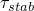的表达式涉及许多半自动化因素，以方便实现期望的稳定化特性：


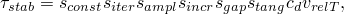

其中


是阻尼系数；

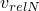和

分别是相对表面上附近点之间的相对法向和切向速度；


是常数缩放因子；

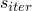

是迭代依赖缩放因子；

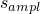

是时间依赖缩放因子；

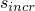

是基于增量号的缩放因子；


是基于分离距离的缩放因子；和


是切向稳定化的常数缩放因子。

阻尼系数和相对速度由Abaqus/Standard计算。阻尼系数等于接触表面底层单元的代表刚度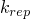乘以步的时间周期再乘以一个固定的、小分数。静态分析中的相对速度通过将相对增量位移和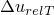除以时间增量大小来计算。

因此，以下接触稳定化表达式适用于静力学：

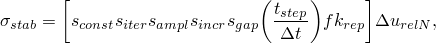

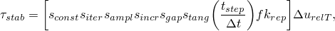

其中括号内的部分可以被认为是稳定化刚度（表示附近表面之间相对运动的阻力）。稳定化刚度与时间增量大小成反比，这是一个理想的特性。如果时间增量大小减小，稳定化刚度会增加，如果特定时间增量大小发生收敛困难，这在Abaqus/Standard中会自动发生。

### 为相互作用分配稳定化

可以为一般接触内特定相互作用全局或局部分配接触稳定化，并作为步定义的一部分指定。在大多数情况下，您只需要指定哪些相互作用有资格使用接触稳定化，而无需调整前面讨论的缩放因子。

| **输入文件用法：** | 使用以下选项指定哪些相互作用应使用接触稳定化： |
| --- | --- |
| | ``` [*CONTACT STABILIZATION*](../key/key-link.md#usb-kws-hcontactstab) *surf_1*, *surf_2* ``` 如果省略第一个表面名称，则假定为包含整个一般接触域的默认表面。如果省略第二个表面名称，则假定为第一个表面与其自身的接触。 |

| **Abaqus/CAE用法：** | 使用以下选项将接触稳定化定义分配给单个表面对： |
| --- | --- |
| | 相互作用模块：**创建相互作用**：**一般接触（Standard）**：**接触属性**：**稳定化分配**：**编辑**：在左侧列中选择表面和稳定化名称，点击中间的箭头将它们转移到接触稳定化分配列表 |

### 指定稳定化缩放因子

在某些情况下，您可能需要调整与接触稳定化相关的一个或多个缩放因子。您可以使用此选项的多个实例以为不同一般接触相互作用实现不同的缩放因子设置。

#### 常数缩放因子

如上稳定化压力和剪切应力表达式所示，缩放因子适用于法和切向稳定化，而缩放因子仅适用于切向稳定化。常数缩放因子的默认设置为指定相互作用的 unity。

的默认设置为零，因此默认情况下指定相互作用不存在切向稳定化刚度。在许多情况下，仅法向接触稳定化就足够了。其他分析可以从切向稳定化刚度中获益；但是，如果您指定了的非零设置，请记住，如果附近表面之间发生大的相对切向运动，切向接触稳定化通常会吸收大量能量。稳定化吸收大量能量是分析结果可能被稳定化显著影响的一个指示。法向接触稳定化不太可能吸收大量能量，因此往往对结果影响较小。

| **输入文件用法：** | ``` [*CONTACT STABILIZATION*](../key/key-link.md#usb-kws-hcontactstab), SCALE FACTOR=, TANGENT FRACTION= ``` |
| --- | --- |

| **Abaqus/CAE用法：** | 相互作用模块：****相互作用********接触稳定化********创建****：**缩放因子**：，**切向因子**： |
| --- | --- |

#### 迭代依赖缩放因子

为减少或消除接触稳定化显著影响报告解决方案的可能性，可以引入在增量迭代期间变化的缩放因子。在增量早期迭代中更有效的稳定化可以帮助避免在建立活动接触区域之前的数值问题。在后期迭代中更少或没有稳定化可以帮助提高增量最终收敛迭代的准确性。

您可以指定这些缩放因子。例如，指定"1,0"会导致缩放因子在初始迭代期间（直到各种收敛测量满足或接近满足）为 unity，然后在最终迭代中重置为零（有效关闭稳定化）直到再次满足收敛检查。

| **输入文件用法：** | ``` [*CONTACT STABILIZATION*](../key/key-link.md#usb-kws-hcontactstab), SCALE FACTOR=USER ADAPTIVE ``` |
| --- | --- |

#### 时间依赖缩放因子

缩放因子和控制接触稳定化的时间依赖性。默认情况下，等于步剩余部分的比例。另一个因子根据变化，其中是每个增量减少因子（默认等于0.1），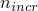是步内的增量号。这些默认值意味着稳定化在相同大小的连续增量中减少了一个数量级以上，并且在步的最终增量中不施加稳定化。对于接触稳定化旨在在建立接触的初始增量期间提供稳定化的大多数情况，默认值是合适的。

提供了两个调整时间依赖缩放因子的选项：您可以引用将管理的幅值曲线，并且可以指定的值（回忆前面给出的表达式）。例如，如果接触建立后不稳定模式仍然存在，您可能希望和在整个步中保持等于 unity，这可以通过引用具有常数一的幅值并将每个增量减少因子设置为一来实现。

| **输入文件用法：** | ``` [*AMPLITUDE*](../key/key-link.md#usb-kws-mamplitude), NAME=*名称* [*CONTACT STABILIZATION*](../key/key-link.md#usb-kws-hcontactstab), AMPLITUDE=*名称*, REDUCTION PER INCREMENT= ``` |
| --- | --- |

| **Abaqus/CAE用法：** | 载荷或相互作用模块：**创建幅值**：**名称**：*名称* 相互作用模块：****相互作用********接触稳定化********创建****：**减少因子**：，**幅值**：*名称* |
| --- | --- |

##### 在后续步中重置时间依赖缩放因子

除非指定了幅值引用，否则接触稳定化定义不影响后续步。如果指定了基于总时间的幅值，相同的幅值曲线继续管理后续步中的变化，直到为相互作用分配新的接触稳定化定义。如果指定了基于步时间的幅值，幅值曲线管理单个步的，并且在后续步中保持恒定（处于结束值），直到为相互作用分配新的接触稳定化定义。在这两种情况下，您也可以重置接触稳定化定义以从步中移除稳定化。重置确保先前步的接触稳定化选项不影响当前步。

| **输入文件用法：** | ``` [*CONTACT STABILIZATION*](../key/key-link.md#usb-kws-hcontactstab), RESET ``` |
| --- | --- |

| **Abaqus/CAE用法：** | 载荷或相互作用模块：**创建幅值**：**名称**：*名称* 相互作用模块：****相互作用********接触稳定化********创建****：**从先前步重置值** |
| --- | --- |

#### 间隙依赖缩放因子

缩放因子控制作为表面之间局部分离距离函数的接触稳定化。默认情况下，当间隙距离为零时此因子为 unity，当间隙距离大于或等于特征表面尺寸时此因子为零。您可以控制变为零的间隙距离。不建议为此阈值距离指定大的值，因为随着阈值距离增加，每个迭代的求解成本有增加的趋势（由于连接性增加）。

| **输入文件用法：** | ``` [*CONTACT STABILIZATION*](../key/key-link.md#usb-kws-hcontactstab), RANGE=*距离* ``` |
| --- | --- |

| **Abaqus/CAE用法：** | 相互作用模块：****相互作用********接触稳定化********创建****：**零稳定化距离**：**指定**：*距离* |
| --- | --- |

### 接触稳定化定义的层次

上面讨论的界面是指定一般接触接触稳定化的推荐方法；但是，接触稳定化可以通过其他两种方式为一般接触相互作用引入。在重叠情况下的优先级顺序如下：
- 第一优先级给予本节讨论的接触稳定化分配选项。
- 第二优先级给予["在Abaqus/Standard中调整接触控制"中"接触问题中刚性体运动的自动稳定化"第36.3.6节"](pt09ch36s03aus150.md#usb-cni-acontacttrouble-stabilize)中讨论的接触稳定化分配选项。
- 第三优先级给予["Abaqus/Standard中接触建模常见困难"中"单点接触"第39.1.2节"](pt09ch39s01aus184.md#usb-cni-acontacttrouble-pointstab)中讨论的默认接触稳定化。


