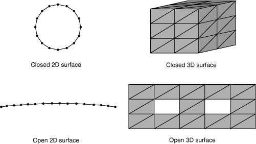
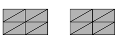
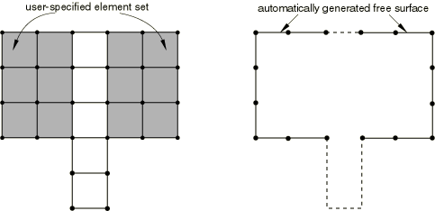
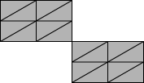

# 36.3.1 在Abaqus/Standard中定义接触对


**产品：** Abaqus/Standard  Abaqus/CAE

##### **参考**

- ["基于单元的表面定义，" 第2.3.2节"](pt01ch02s03aus17.md)
- ["基于节点的表面定义，" 第2.3.3节"](pt01ch02s03aus18.md)
- ["解析刚性表面定义，" 第2.3.4节"](pt01ch02s03aus19.md)
- ["接触相互作用分析概述，" 第36.1.1节"](pt09ch36s01abo33.md)
- [*CONTACT PAIR*](../key/key-link.md#usb-kws-hcontactpair)
- [*SURFACE*](../key/key-link.md#usb-kws-msurface)
- [*MODEL CHANGE*](../key/key-link.md#usb-kws-hmodelchange)
- ["定义表面-表面接触，" Abaqus/CAE用户指南第15.13.7节"](../usi/usi-link.md#usi-itn-help-surftosurf)
- ["定义自接触，" Abaqus/CAE用户指南第15.13.8节"](../usi/usi-link.md#usi-itn-help-self)
- ["使用接触和约束检测，" Abaqus/CAE用户指南第15.16节"](../usi/usi-link.md#usi-itn-detectioneditor)

### 概述

Abaqus/Standard中的接触对：
- 可用于定义力学、耦合温度-位移、耦合热-电-结构、耦合孔隙压力-位移、耦合热-电和热传递模拟中实体之间的相互作用；
- 是模型定义的一部分；
- 可以使用一对刚性或可变形表面或单个可变形表面形成；
- 不必使用具有匹配网格的表面；和
- 不能由一个二维表面和一个三维表面形成。

您可以在Abaqus/Standard中以两个可能相互作用的表面"接触对"的形式定义接触，或者以单个可能与自身相互作用的表面"自接触"的形式定义接触。Abaqus/Standard通过形成涉及来自各个表面的附近节点组的方程来施加接触条件，或者对于自接触的情况，来自同一表面的不同区域的方程。本节描述定义接触对的各个方面，并参考其他章节获取更多详细信息。

### 定义接触对

要定义接触对，您必须指明哪对表面可能彼此相互作用，或者哪些表面可能与自身相互作用。接触表面应扩展得足够远，以包含分析期间可能接触的所有区域；但是，包含永远不会接触的其他表面节点和面可能会导致显著的计算成本（例如，扩展从表面使其包含在整个分析过程中保持与主表面分离的许多节点，可能会显著增加内存使用，除非使用惩罚接触施加）。

每个接触对被分配一个接触公式（显式或默认），并且必须引用相互作用属性。关于各种可用接触公式的讨论（基于跟踪方法假设有限滑动还是小滑动——以及接触离散化是基于节点-表面还是表面-表面方法）在["Abaqus/Standard中的接触公式，" 第38.1.1节"](pt09ch38s01aus177.md)中提供。相互作用属性定义在["为Abaqus/Standard中的接触对分配接触属性，" 第36.3.3节"](pt09ch36s03aus147.md)中讨论。

#### 定义两个独立表面之间的接触

当接触对包含两个表面时，这两个表面不能包含任何相同的节点，您必须选择哪个表面作为从表面，哪个作为主表面。主表面和从表面的选择在["Abaqus/Standard中的接触公式，" 第38.1.1节"](pt09ch38s01aus177.md#usb-cni-acontactpairform-masterslave)中的"选择两表面接触对中的主从角色"中有详细讨论。对于由两个可变形表面组成的简单接触对，可以使用以下基本指南：
- 两个表面中较大的表面应作为主表面。
- 如果表面大小相当，较硬实体上的表面应作为主表面。
- 如果表面大小和硬度相当，网格较粗的表面应作为主表面。

默认使用有限滑动、节点-表面公式（Abaqus/CAE中的默认设置是有限滑动、表面-表面公式）。

##### 使用有限滑动、节点-表面公式定义接触对

提供有限滑动、节点-表面公式。

| **输入文件用法：** | ``` [*CONTACT PAIR*](../key/key-link.md#usb-kws-hcontactpair), INTERACTION=*interaction_property_name* *slave_surface_name*, *master_surface_name* ``` |
| --- | --- |
| | 您也可以直接指定接触离散化： ``` [*CONTACT PAIR*](../key/key-link.md#usb-kws-hcontactpair), INTERACTION=*interaction_property_name*, TYPE=NODE TO SURFACE *slave_surface_name*, *master_surface_name* ``` |

| **Abaqus/CAE用法：** | 相互作用模块：**创建相互作用**：**表面-表面接触（Standard）**：选择主表面，点击**表面**或**节点区域**，选择从表面，相互作用编辑器，**滑动公式：有限滑动**，**离散化方法：节点到表面**，**接触相互作用属性**：*interaction_property_name* |
| --- | --- |

##### 使用有限滑动、表面-表面公式定义接触对

基于节点的从表面不允许使用表面-表面离散化。有限滑动、表面-表面公式不支持某些接触功能，包括裂纹扩展（见["裂纹扩展分析，" 第11.4.3节"](pt04ch11s04aus69.md)）。

| **输入文件用法：** | 使用以下选项使用有限滑动、表面-表面公式定义接触约束： |
| --- | --- |
| | ``` [*CONTACT PAIR*](../key/key-link.md#usb-kws-hcontactpair), INTERACTION=*interaction_property_name*, TYPE=SURFACE TO SURFACE *slave_surface_name*, *master_surface_name* ``` |

| **Abaqus/CAE用法：** | 相互作用模块：**创建相互作用**：**表面-表面接触（Standard）**：选择主表面，点击**表面**，选择从表面，相互作用编辑器，**滑动公式：有限滑动**，**离散化方法：表面到表面**，**接触相互作用属性**：*interaction_property_name* |
| --- | --- |

##### 使用小滑动、节点-表面公式定义接触对

小滑动跟踪方法默认使用节点-表面离散化。关于分析中何时适合使用小滑动跟踪方法的说明，请参阅["Abaqus/Standard中的接触公式，" 第38.1.1节"](pt09ch38s01aus177.md#usb-cni-acontactpairform-smsliding)。

| **输入文件用法：** | ``` [*CONTACT PAIR*](../key/key-link.md#usb-kws-hcontactpair), INTERACTION=*interaction_property_name*, SMALL SLIDING *slave_surface_name*, *master_surface_name* ``` |
| --- | --- |
| | 您也可以直接指定接触离散化： ``` [*CONTACT PAIR*](../key/key-link.md#usb-kws-hcontactpair), INTERACTION=*interaction_property_name*, SMALL SLIDING, TYPE=NODE TO SURFACE *slave_surface_name*, *master_surface_name* ``` |

| **Abaqus/CAE用法：** | 相互作用模块：**创建相互作用**：**表面-表面接触（Standard）**：选择主表面，点击**表面**或**节点区域**，选择从表面，相互作用编辑器，**滑动公式：小滑动**，**离散化方法：节点到表面**，**接触相互作用属性**：*interaction_property_name* |
| --- | --- |

##### 使用小滑动、表面-表面公式定义接触对

基于节点的从表面不允许使用表面-表面离散化。

| **输入文件用法：** | ``` [*CONTACT PAIR*](../key/key-link.md#usb-kws-hcontactpair), INTERACTION=*interaction_property_name*, SMALL SLIDING, TYPE=SURFACE TO SURFACE *slave_surface_name*, *master_surface_name* ``` |
| --- | --- |

| **Abaqus/CAE用法：** | 相互作用模块：**创建相互作用**：**表面-表面接触（Standard）**：选择主表面，点击**表面**，选择从表面，相互作用编辑器，**滑动公式：小滑动**，**离散化方法：表面到表面**，**接触相互作用属性**：*interaction_property_name* |
| --- | --- |

#### 使用对称主-从接触对改善接触建模

对于节点-表面接触，使用Abaqus/Standard的严格主-从算法，主表面节点可能会不受阻力地穿透从表面。如果主表面比从表面更细化，或者在软体之间形成大的接触压力，这种穿透就会发生。细化从表面网格通常可以最小化主表面节点的穿透。如果细化技术不起作用或不切实际，如果两个表面都是具有可变形或可变形-刚性父单元的基于单元的表面，则可以使用对称主-从方法。要使用此方法，请使用相同的两个表面定义两个接触对，但为两个接触对切换主表面和从表面的角色。此方法使Abaqus/Standard将每个表面作为主表面处理，因此涉及额外的计算费用，因为必须为同一接触对执行两次接触搜索。必须将此方法提供的精度提高与额外的计算成本进行比较。

所有接触公式都可用于对称主-从接触对，并且可以使用上述相同选项应用。

| **输入文件用法：** | ``` [*CONTACT PAIR*](../key/key-link.md#usb-kws-hcontactpair), INTERACTION=*interaction_property_name* *surface_1*, *surface_2* *surface_2*, *surface_1* ``` |
| --- | --- |

| **Abaqus/CAE用法：** | 相互作用模块：**创建相互作用**：**表面-表面接触（Standard）**：选择主表面，点击**表面**，选择从表面将此相互作用复制到新相互作用，并编辑新相互作用。在相互作用编辑器中，点击**切换**以反转主表面和从表面。 |
| --- | --- |

##### 对称主-从接触对的限制

当施加非常硬或"硬"接触条件时，使用对称主-从接触对可能导致过约束问题。关于过约束和替代约束施加方法的讨论，请参阅["Abaqus/Standard中的接触约束施加方法，" 第38.1.2节"](pt09ch38s01aus178.md)。

对于软化接触条件，使用对称主-从接触对将导致与指定的压力-过闭合行为的偏差，因为两个接触对都对整体界面应力做出贡献而不考虑彼此。例如，如果指定了线性压力-过闭合关系，对称主-从接触对有效地将整体接触刚度加倍。

同样，如果指定了可选的剪切应力极限，使用对称主-从接触对将导致与摩擦模型的偏差（见["使用可选的剪切应力极限" in "摩擦行为，" 第37.1.5节"](pt09ch37s01aus169.md#usb-cni-afriction-taumax)），因为每个接触对观察到的接触应力大约是总界面应力的一半。

同样，对于对称主-从接触对，界面的结果可能难以解释。在这种情况下，界面两侧的表面都作为从表面，因此每个表面都有相关的接触约束值。表示接触压力的约束值彼此不独立。因此，数据（`.dat`）和结果（`.fil`）文件中报告的约束值仅代表总界面压力的一部分，必须求和才能获得总值。

在输出数据库中，机械接触变量在主表面和从表面的节点上报告（每个接触对），而不仅仅在形成约束的从表面上。因此，对称主-从接触对的每个表面有两组结果；当表面充当从表面时一次，当充当主表面时一次。对于节点接触压力，Abaqus/CAE的Visualization模块仅报告与节点相关的两个压力值中的最大值，当包含该节点的表面充当主表面或从表面时。即使在这种情况下，接触压力也不代表真实的界面压力。

除了接触压力外，对称主-从接触对的一些接触输出可能令人困惑。例如，Abaqus/Standard可能报告接触界面一侧的正开口距离，但界面另一侧的零开口距离（即接触）。这通常是由两个表面的形状或相对网格细化引起的。

#### 定义自接触

通过仅指定单个表面或两次指定相同表面来定义单个表面与其自身的接触。小滑动跟踪方法不能与自接触一起使用。

##### 使用节点-表面离散化定义自接触

Abaqus/Standard默认对自接触使用节点-表面接触离散化。

| **输入文件用法：** | 使用以下任一选项： |
| --- | --- |
| | ``` [*CONTACT PAIR*](../key/key-link.md#usb-kws-hcontactpair), INTERACTION=*interaction_property_name* *surface_1,* ``` ``` [*CONTACT PAIR*](../key/key-link.md#usb-kws-hcontactpair), INTERACTION=*interaction_property_name* *surface_1*, *surface_1* ``` |

| **Abaqus/CAE用法：** | 相互作用模块：**创建相互作用**：**自接触（Standard）**：选择表面，相互作用编辑器，**离散化方法：节点到表面**，**接触相互作用属性**：*interaction_property_name* |
| --- | --- |
| | 或 相互作用模块：**创建相互作用**：**表面-表面接触（Standard）**：选择表面，点击**表面**，再次选择表面，相互作用编辑器，**滑动公式：有限滑动**，**离散化方法：节点到表面**，**接触相互作用属性**：*interaction_property_name* |

##### 使用表面-表面离散化定义自接触

表面-表面离散化通常会导致自接触模拟更准确的建模。但是，由于自接触表面同时充当主表面和从表面，表面-表面离散化有时会显著增加求解成本。

| **输入文件用法：** | 使用以下任一选项： |
| --- | --- |
| | ``` [*CONTACT PAIR*](../key/key-link.md#usb-kws-hcontactpair), INTERACTION=*interaction_property_name*, TYPE=SURFACE TO SURFACE *surface_1,* ``` ``` [*CONTACT PAIR*](../key/key-link.md#usb-kws-hcontactpair), INTERACTION=*interaction_property_name*, TYPE=SURFACE TO SURFACE *surface_1*, *surface_1* ``` |

| **Abaqus/CAE用法：** | 相互作用模块：**创建相互作用**：**自接触（Standard）**：选择表面，相互作用编辑器，**离散化方法：表面到表面**，**接触相互作用属性**：*interaction_property_name* |
| --- | --- |
| | 或 相互作用模块：**创建相互作用**：**表面-表面接触（Standard）**：选择表面，点击**表面**，再次选择表面，相互作用编辑器，**滑动公式：有限滑动**，**离散化方法：表面到表面**，**接触相互作用属性**：*interaction_property_name* |

##### 自接触的限制

自接触仅对机械表面相互作用有效，仅限于基于单元表面的有限滑动。

对于使用表面-表面公式的二维自接触和所有三维自接触，自接触表面的节点可以同时是从节点和主表面的成员。在这些情况下，接触行为类似于对称主-从接触对，["使用对称主-从接触对改善接触建模"](pt09ch36s03aus145.md#usb-cni-acontactpair-symm)中讨论的问题适用。Abaqus/Standard自动对这些情况下的接触条件应用一些数值"软化"，如["Abaqus/Standard中的接触约束施加方法，" 第38.1.2节"](pt09ch38s01aus178.md)中所讨论。

直接施加硬接触条件是使用节点-表面公式的二维自接触的默认约束施加方法。在这种情况下，每个邻接于二维表面折叠到自身上的顶点的节点在分析期间自动分配从属角色或主角色。由于接触约束直接抵抗充当从节点的节点处的穿透，因此对于使用节点-表面公式的二维自接触中仅作为主节点充当的节点，存在一些未解决穿透的可能性。

### 选择接触对中使用的表面

创建表面的方法在["基于单元的表面定义，" 第2.3.2节"](pt01ch02s03aus17.md)；["基于节点的表面定义，" 第2.3.3节"](pt01ch02s03aus18.md)；和["解析刚性表面定义，" 第2.3.4节"](pt01ch02s03aus19.md)中讨论；这些章节讨论了各种表面类型的一般限制。关于各种接触公式的表面特性注意事项在["Abaqus/Standard中的接触公式，" 第38.1.1节"](pt09ch38s01aus177.md)中讨论。以下讨论接触定义中使用的表面的其他注意事项。

#### 类壳表面的方向注意事项

Abaqus/Standard要求主接触表面对于节点-表面接触和某些表面-表面接触公式是单侧的（见["影响接触公式的基本选择" in "Abaqus/Standard中的接触公式，" 第38.1.1节"](pt09ch38s01aus177.md#usb-cni-acontactpairform-choices)，了解更多详情）。这要求您考虑在具有正负方向的壳和膜等单元上定义的主表面的正确方向。对于节点-表面接触，从表面法向的方向无关紧要，但对于表面-表面接触，单侧从表面的方向会被考虑。

双侧基于单元的表面允许用于默认的表面-表面接触公式，尽管它们并不总是适用于深度初始穿透的情况。如果主表面和从表面都是双侧的，则接触法向方向的正面或负面方向将被选择，以最小化（或避免）每个接触约束的穿透。如果任一表面或两个表面都是单侧的，则接触法向方向的正面或负面方向将从单侧表面法向而不是从表面的相对位置确定。

当接触表面的方向与接触公式相关时，对于结构（梁和壳）、膜、桁架或刚性单元上的表面，您必须考虑以下方面：
- 相邻表面面必须具有一致的法向方向。如果相邻表面面在单侧表面上具有不一致的法线，并且该方向与接触公式相关，Abaqus/Standard将发出错误消息。
- 除了初始干涉配合问题（见["在Abaqus/Standard中建模接触干涉配合，" 第36.3.4节"](pt09ch36s03aus148.md)）外，从表面应位于主表面外法向的同一侧。如果在初始配置中，从表面位于主表面外法向的相反侧，Abaqus/Standard将检测表面的过闭合，并且如果过闭合严重，可能在寻找初始解时遇到困难。不正确的外法向规范通常会导致分析立即无法收敛。[图36.3.1-1](pt09ch36s03aus145.md#asurfover-good-bad-master)说明主表面外法向的正确和不正确规范。**图36.3.1-1** 主表面方向正确和不正确定义的示例。
- 如果单侧从表面和主表面具有大致相同方向的法向，则使用表面-表面离散化时将忽略接触（例如，如果从表面和主表面法向的点积为正，则不会施加接触）。

以下来自数据检查分析（见["Abaqus/Standard、Abaqus/Explicit和Abaqus/CFD执行，" 第3.2.2节"](pt01ch03s02abx02.md)）的输出可用于识别方向错误的主表面：- 初始间隙可以在Abaqus/CAE中以第一步骤增量0处变量COPEN的等值线图显示；初始过闭合对应于负间隙。
- Abaqus/Standard提供模型初始接触状态的详细打印输出。

#### 表面连接限制

根据接触公式的类型，某些连接限制适用于接触表面。各种接触公式的表面连接限制总结在[表36.3.1-1](pt09ch36s03aus145.md#table-connectivity-restrictions)中。如该表所示，主表面和从表面的连接限制有时是不同的。自接触表面同时充当主表面和从表面；因此，如果限制适用于主表面或从表面，它也适用于自接触。[表36.3.1-1](pt09ch36s03aus145.md#table-connectivity-restrictions)中提到的潜在连接限制如下所述：

**表36.3.1-1** 基于单元表面的连接特性允许用于各种接触公式的总结。
| 接触公式 | 连接特性 |
| --- | --- |
| 不连续（或仅在一个节点连接的三维面） | T形交叉 |
| 有限滑动、节点-表面 | 主表面：不允许从表面：允许 | 主表面：不允许从表面：允许 |
| 小滑动、节点-表面 | 主表面：允许从表面：允许 | 主表面：不允许从表面：允许 |
| 有限滑动、表面-表面 | 主表面：允许从表面：允许 | 主表面：允许从表面：允许 |
| 小滑动、表面-表面 | 主表面：允许从表面：允许 | 主表面：不允许从表面：允许 |

- 不连续表面：在许多情况下允许不连续接触表面，但有限滑动、节点-表面接触的主表面不能由两个或更多断开区域组成（它们必须在三维模型中跨单元边缘连续或在二维模型中跨节点连续）。[图36.3.1-2](pt09ch36s03aus145.md#acontsurf-continuous)显示连续表面的示例，而[图36.3.1-3](pt09ch36s03aus145.md#acontsurf-discontinuous-2d)和[图36.3.1-4](pt09ch36s03aus145.md#acontsurf-discontinuous-3d)显示不连续表面的示例。[图36.3.1-5](pt09ch36s03aus145.md#asurfover-auto-free-surf)显示由包含两个不相连单元组的单元集规范生成的自动自由表面。结果表面不连续，因为它由两条不相连的开放曲线组成，因此该表面作为有限滑动、节点-表面接触的主表面无效。**图36.3.1-2** 连续表面的示例。 **图36.3.1-3** 不连续二维表面的示例。 **图36.3.1-4** 不连续三维表面的示例。 **图36.3.1-5** 由不相连单元集的自动自由表面生成导致的不连续表面的示例。
- 仅在一个节点连接的三维表面：有限滑动、节点-表面接触公式也不允许三维主表面面仅在一个节点连接（它们必须在公共单元边缘上连接）。[图36.3.1-6](pt09ch36s03aus145.md#acontsurf-connect-by-point)显示两个面通过单个节点连接的表面示例。**图36.3.1-6** 两个面共享单个节点的三维表面示例。
- 具有T形交叉的表面：在某些情况下，接触表面不能在二维中共享公共主节点或在三维中共享公共主边缘的超过两个表面面。例如，[图36.3.1-7](pt09ch36s03aus145.md#acontsurf-t-intersection)显示具有T形交叉的表面示例，其中三个面在二维中共享公共节点或在三维中共享公共边缘。虽然对于节点-表面公式，超过两个表面面可以在二维中共享公共从节点或在三维中共享公共从边缘，但从面必须是单侧的，这排除了节点-表面公式最常见的T形交叉情况。**图36.3.1-7** 具有T形交叉的表面示例。

#### 解析刚性表面

解析刚性表面通常有效地用于高效建模曲线刚性几何体，如["解析刚性表面定义，" 第2.3.4节"](pt01ch02s03aus19.md)中所讨论。对于极少数情况，需要大量（数千个）线段来定义解析刚性表面，使用基于单元的刚性表面可以实现更好的性能（见["基于单元的表面定义，" 第2.3.2节"](pt01ch02s03aus17.md)）。

#### 三维梁和桁架表面

Abaqus/Standard不能使用三维梁或桁架形成主表面，因为单元没有足够的信息来创建唯一的表面法向。但是，这些单元可用于定义从表面。二维梁和桁架可用于形成主表面和从表面。

#### 基于边的表面

三维壳单元上的基于边的表面（["基于单元的表面定义，" 第2.3.2节"](pt01ch02s03aus17.md)）不能用于Abaqus/Standard中的接触分析。

#### 基于节点的表面的限制

当接触属性定义包括用户定义的软化接触属性或热或电相互作用时，应谨慎使用基于节点的表面，因为接触本构行为（依赖于接触压力、热通量或电流的精确计算）除非每个节点关联了精确的表面面积，否则不会正确施加。有关详细信息，请参阅["接触压力-闭合关系，" 第37.1.2节"](pt09ch37s01aus166.md)；["热接触属性，" 第37.2.1节"](pt09ch37s02aus174.md)；或["电接触属性，" 第37.3.1节"](pt09ch37s03aus175.md)。

### 移除和重新激活接触对

您可以暂时从模拟中移除接触对，这可以通过消除模拟期间不必要的接触搜索和表面方向更新来节省大量计算成本。接触对的移除和重新激活通常用于复杂成型过程，在分析的不同阶段需要多个工具与工件相互作用。

您不能从模拟中移除绑定接触对（见["在Abaqus/Standard中定义绑定接触，" 第36.3.7节"](pt09ch36s03aus151.md)）。

#### 移除接触对

移除接触对是一种有用的技术，用于解除组件的耦合，直到它们应该结合在一起（如制造过程模拟中的工具）。通过移除接触对并在适当时间引入，可以节省大量计算费用，从而消除了仅在相关时监测接触条件的需要。

| **输入文件用法：** | ``` [*MODEL CHANGE*](../key/key-link.md#usb-kws-hmodelchange), TYPE=CONTACT PAIR, REMOVE *slave_surface, master_surface* ``` |
| --- | --- |
| | 根据需要重复数据行。 |

| **Abaqus/CAE用法：** | 使用以下任一选项： |
| --- | --- |
| | 相互作用模块：**创建相互作用**：表面-表面接触或自接触相互作用编辑器：关闭**在此步骤中活动** 相互作用模块：相互作用管理器：选择相互作用，**停用** |

##### 移除与闭合接触对相关的接触力

如果表面在接触对被移除时处于接触中，Abaqus/Standard存储每个表面上每个节点对应的接触力（如果存在热相互作用则为热通量，如果是耦合热电分析则为电流）。Abaqus/Standard在移除步骤中自动将这些力（或热通量或电流）线性斜降为零。Abaqus/Standard始终立即移除机械表面相互作用的接触约束。

在瞬态过程中移除接触对时必须小心。在瞬态热传递、完全耦合温度-位移或完全耦合热-电-结构分析中，如果通量很高且步骤很长，这种斜降可能会对身体的其余部分产生冷却或加热效果。在动态分析中，如果力很大且步骤很长，动能可以被传递给模型的剩余部分。可以通过在分析之前的非常短的瞬态步骤中移除接触对来避免此问题。此步骤可以在单个增量中完成。

##### 使用允许的接触干涉来停用接触对

可以通过为接触对分配非常大的允许接触干涉来在分析期间停用具有机械接触相互作用的接触对（见["在Abaqus/Standard中建模接触干涉配合，" 第36.3.4节"](pt09ch36s03aus148.md)）。此方法的缺点是不会降低分析的计算成本，因为接触算法仍会在每个增量中计算接触对的接触条件。

#### 重新激活接触对

模拟中将使用的所有接触对必须在分析开始时创建；它们不能在模拟开始后创建。但是，可以创建接触对，在第一步开始时移除，然后在模拟期间稍后重新激活。

在Abaqus/CAE中，您可以在任何步骤中创建接触对。如果接触对是在初始步骤以外的步骤中创建的，Abaqus/CAE会自动在初始步骤中停用接触对，并在创建它的步骤中重新激活它。

| **输入文件用法：** | ``` [*MODEL CHANGE*](../key/key-link.md#usb-kws-hmodelchange), TYPE=CONTACT PAIR, ADD *slave_surface, master_surface* ``` |
| --- | --- |
| | 根据需要重复数据行。 |

| **Abaqus/CAE用法：** | 相互作用模块：**创建相互作用**：表面-表面接触或自接触相互作用编辑器：打开**在此步骤中活动** |
| --- | --- |

##### 重新激活过闭合接触对

当接触对被重新激活时，接触约束立即变为活动。在机械模拟中，接触对的表面可能在接触对处于非活动状态时移动，从而变得过闭合。当接触对被重新激活时，如果此过闭合太严重，Abaqus/Standard可能会在尝试施加突然激活的接触约束时遇到收敛问题。为避免此类问题，您可以为接触对指定大于接触对过闭合的允许干涉值*v*。Abaqus/Standard将在步骤期间将*v*斜降到零。有关指定允许干涉的详细信息，请参阅["在Abaqus/Standard中建模接触干涉配合，" 第36.3.4节"](pt09ch36s03aus148.md)。

### 输出

与接触对相互作用相关的输出变量分为两类：节点变量（有时称为约束变量）和整个表面变量。此外，Abaqus输出与接触相互作用相关的诊断信息数组，如["Abaqus/Standard分析中的接触诊断，" 第39.1.1节"](pt09ch39s01aus183.md)中所讨论。

有关与热、电和孔隙流体分析相关的变量的更详细讨论，请参阅[第37章"接触属性模型"](pt09ch37.md)中的相关接触属性部分。

#### 节点接触变量

节点接触变量可以在Abaqus/CAE的Visualization模块中的接触表面上绘制等值线。节点接触变量包括接触压力和力、摩擦剪切应力和力、接触期间表面的相对切向运动（滑移）、表面之间的间隙、单位面积热或流体通量、流体压力和单位面积电流。写入输出数据库（`.odb`）文件的许多节点接触变量通常对所有接触节点可用，无论它们是充当从节点还是主节点。其他节点接触变量仅在充当从节点的节点处可用。大多数到数据（`.dat`）文件、结果（`.fil`）文件和工具子程序`GETVRMAVGATNODE`的接触输出与单个约束相关。对于到输出数据库（`.odb`）文件的接触输出，应用了一些过滤以减少接触输出噪声。

接触压力分布在许多Abaqus分析中是关键关注点。您可以查看除解析刚性表面和基于刚性类型单元的离散刚性表面外的所有接触表面上的接触压力（后者限制不适用于一般接触）。您可以查看接触压力误差指示器的等值线图，靠近感兴趣区域接触压力解的等值线图，以深入了解接触压力解的局部精度（见["影响自适应重网格划分的误差指示器选择，" 第12.3.2节"](pt04ch12s03aus84.md)，了解更多关于误差指示器输出的讨论）。

在某些情况下，您可能会观察到接触压力超出实际接触区域，这是由于以下因素：
- 等值线图通过插值节点值构建，这可能导致在接触区域外的面部分出现非零值。例如，这种效果在角落处通常很明显，例如当两个相同大小、对齐的块接触时——如果接触表面环绕角落，接触压力等值线将略微延伸到角落周围。
- 为最小化活动接触区域内的接触应力噪声，Abaqus/Standard将节点接触应力计算为节点参与的活动接触约束相关值的加权平均值。应用了一些过滤来减少为位于活动接触区域边缘的节点（仅弱参与接触约束）报告的接触应力值，但这种过滤不是"完美的"，可能导致接触区域大小看起来有些夸大。类似地，接触状态输出也会受到位于活动接触区域边缘的节点的影响。在这种情况下，即使接触实际上是开放的，接触状态可能会在被夸大的区域中报告为闭合。

由于这些因素，试图从接触应力分布推断接触力分布可能有些误导。相反，您可以请求节点接触力输出，它准确地表示分析中存在的接触力分布。

#### 整个表面变量

整个表面变量是整个从表面的属性。这些变量作为历史输出记录，记录由于接触压力和摩擦应力导致的总力和力矩、压力和摩擦应力的中心（定义为表面上最接近表面质心的点，该点位于其合力的作用线上，对于该合力产生的合力矩最小），以及总接触面积（定义为所有存在接触力的面元之和）。每个变量名称的最后一个字母（除了变量CAREA）表示使用表面上的哪个接触力分布来计算结果：

| N | 使用法向接触力来推导结果量。 |
| --- | --- |
| S | 使用剪切接触力来推导结果量。 |
| T | 使用法向和剪切接触力的总和来推导结果量。 |

例如，CFN是由于接触压力的总力，CFS是由于摩擦应力的总力，CFT是由于接触压力和摩擦应力的总力。

每个总力矩输出变量不一定等于各自的力向量中心与合力向量的叉乘。作用在表面两个不同节点上的力可能具有相反方向的分量，因此这些节点力分量产生净力矩但不产生净力；因此，总力矩可能并非完全源于合力。力中心输出变量在表面节点力大致沿同一方向作用时最有意义。

#### 请求输出

某些接触变量必须作为一组请求。例如，要输出表面之间的间隙（COPEN），您必须请求变量CDISP（接触位移）。CDISP输出COPEN和CSLIP（接触期间表面的切向运动）。可用接触对变量和标识符的完整列表在["Abaqus/Standard输出变量标识符，" 第4.2.1节"](pt02ch04s02abv01.md)中给出。

输出请求可以限制为单个接触对或从表面的部分。您可以：
- 请求与给定接触对相关的输出；
- 请求与给定从表面相关的输出，包括该从表面所属的所有接触对的贡献；和
- 通过指定包含从表面节点子集的节点集来限制输出。

形成这些输出请求的说明可在以下章节中找到：
- 要请求输出到数据（`.dat`）文件，请参阅["Abaqus/Standard的表面输出" in "输出到数据和结果文件，" 第4.1.2节"](pt02ch04s01aus39.md#usb-out-oprintfile-surface)。
- 要请求输出到输出数据库（`.odb`）文件，请参阅["Abaqus/Standard和Abaqus/Explicit中的表面输出" in "输出到输出数据库，" 第4.1.3节"](pt02ch04s01aus40.md#usb-out-odboutput-surface)。

#### 小滑动和有限滑动接触的差异

对于小滑动接触问题，接触面积在输入文件预处理器中根据模型的未变形形状计算；因此，它在整个分析过程中不会改变，小滑动接触的接触压力根据此不变接触面积计算。此行为与有限滑动接触问题中的行为不同，有限滑动接触中接触面积和接触压力根据变形后的形状计算。

#### 切向结果的输出

Abaqus报告切向变量（摩擦剪切应力、粘性剪切应力和相对切向运动）相对于表面上定义的局部切向方向的值。局部切向方向的定义在["表面上的一点" in "Abaqus/Standard中的接触公式，" 第38.1.1节"](pt09ch38s01aus177.md#usb-cni-acontactpairform-slipdir)中解释。这些方向并不总是对应于全局坐标系，并且在几何非线性分析中随接触对旋转。

Abaqus/Standard通过获取变量向量与约束点相关的局部切向方向或的标量积来计算每个约束点的切向结果。变量名称末尾的数字表示变量是否对应于第一或第二局部切向方向。例如，CSHEAR1是第一个局部切向方向中的摩擦剪切应力分量，而CSHEAR2是第二个局部切向方向中的摩擦剪切应力分量。

##### 累积增量相对运动（滑移）的定义

Abaqus/Standard将增量相对运动（也称为滑移）定义为增量相对节点位移向量与局部切向方向的标量积。增量相对节点位移向量测量从节点相对于主表面运动的运动。增量滑移仅在从节点接触主表面时累积。分析期间所有此类增量滑移的总和报告为CSLIP1和CSLIP2。关于此量计算的详细信息，请参阅["实体之间的小滑动相互作用，" Abaqus理论指南第5.1.1节"](../stm/stm-link.md#stm-ifc-smslidcontact)；["可变形体之间的有限滑动相互作用，" Abaqus理论指南第5.1.2节"](../stm/stm-link.md#stm-ifc-slidecontactelem)；以及["可变形体与刚性体之间的有限滑动相互作用，" Abaqus理论指南第5.1.3节"](../stm/stm-link.md#stm-ifc-defbodyrigidsurf)。

#### 扩展为间隙提供接触开口输出的范围

为降低计算成本，默认情况下，避免了对表面分离距离大于可能传递接触力（或热通量等）的最小间隙距离的位置进行潜在相互作用点的详细计算。因此，接触开口（COPEN）输出通常不会为有限滑动接触提供，其中表面开口大于表面面元尺寸的一小部分。您可以扩展Abaqus/Standard提供接触开口输出的范围；COPEN将提供到等于指定"跟踪厚度"的间隙距离。使用此控件可能会增加计算成本，特别是如果您指定较大的跟踪厚度值，因为额外的接触跟踪计算。

| **输入文件用法：** | [*SURFACE INTERACTION*](../key/key-link.md#usb-kws-hsurfaceinteraction), TRACKING THICKNESS=*value* |
| --- | --- |

| **Abaqus/CAE用法：** | 您不能在Abaqus/CAE中调整默认跟踪厚度。 |
| --- | --- |

#### 轴对称模型的输出

在轴对称分析中，由于接触压力和摩擦应力，接触体之间传递的总力和力矩以与二维分析相同的方式计算。因此，沿*r*轴的总力分量为非零，总力矩分量包括沿*r*轴的总力的贡献。

#### 在轴对称分析中获得关于*z*轴可以传递的"最大扭矩"

当使用轴对称单元（单元类型CAX和CGAX）建模基于表面的接触时，Abaqus/Standard可以计算关于*z*轴可以传递的最大扭矩（输出变量CTRQ）。此功能通常在建模螺纹连接器时引起关注（见["螺纹连接的轴对称分析，" Abaqus示例问题指南第1.1.20节"](../exa/exa-link.md#exa-sta-threadedconnection)）。最大扭矩*T*定义为


其中*p*是跨界面传递的压力，*r*是到界面上一点处的半径，*s*是当前在*r*–*z*平面中沿界面的距离。"扭矩"的这个定义有效地假设了摩擦系数为1。

#### 整个模型接触相关能量变量

对于接触对，Abaqus/Standard中提供的与接触相关的能量变量与一般接触相同，如["整个模型接触相关能量变量" in "在Abaqus/Standard中定义一般接触相互作用，" 第36.2.1节"](pt09ch36s02aus139.md#usb-cni-acontactgeneralstd-contener)中所描述。


