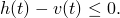
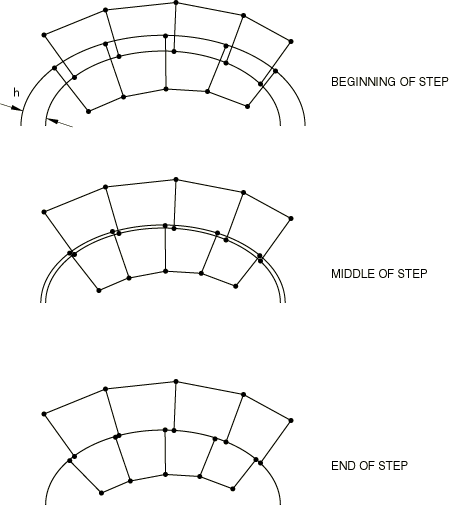
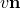
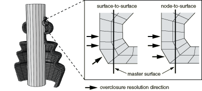

# 36.3.4 在Abaqus/Standard中建模接触干涉配合


**产品：** Abaqus/Standard  Abaqus/CAE

##### **参考**

- ["在Abaqus/Standard中定义接触对，" 第36.3.1节"](pt09ch36s03aus145.md)
- [*CONTACT INTERFERENCE*](../key/key-link.md#usb-kws-hcontactinterfer)
- ["定义表面-表面接触中的干涉配合选项，" Abaqus/CAE用户指南第15.13.7节"](../usi/usi-link.md#usi-itn-help-interferencefit)

### 概述

Abaqus/Standard中的干涉配合：
- 默认情况下，当接触公式计算模型初始配置中表面之间的过闭合时发生；
- 默认情况下在步骤的第一个增量中解决；
- 可以随时间在多个增量中逐渐解决；
- 导致模型中产生应力和应变，因为过闭合被解决；
- 可同时为基于表面的接触对和接触单元指定；和
- 不能为自接触指定。

Abaqus/Standard提供了替代方法，通过无应变调整来解决初始过闭合，并对不同于从初始配置计算的特定过闭合或间隙进行建模。这些方法在["在Abaqus/Standard接触对中调整初始表面位置和指定初始间隙，" 第36.3.5节"](pt09ch36s03aus149.md)中讨论。

### 解决过大的初始过闭合

如果模型初始配置中存在大的过闭合，Abaqus/Standard可能无法在单个增量中解决干涉配合。Abaqus/Standard提供了允许在多个增量中逐渐解决过闭合的替代方法。

在每个约束位置施加的默认接触约束是当前穿透为。当为正时存在穿透。要更改此约束，您可以指定允许的干涉，它将在步骤过程中斜降。指定的允许干涉修改接触约束如下：



因此，为指定正值会导致Abaqus/Standard忽略至该大小的穿透。[图36.3.4-1](pt09ch36s03aus148.md#acontact-interfer-fit)说明了一个典型的干涉配合问题。

**图36.3.4-1** 具有接触表面的干涉配合。



如果模型中的穿透为，您可以声明或请求自动收缩配合。在任一情况下，Abaqus/Standard将认为两个实体在模拟开始时恰好接触。随着步骤中允许干涉的减小，Abaqus/Standard推动表面分离，直到不再有允许的穿透。

有三种不同的方法来指定允许的干涉。默认情况下，在所有情况下，指定的允许干涉值在步骤开始时立即应用，然后在步骤中线性斜降至零，除非您指定定义特定允许干涉-时间变化的幅值曲线。建议您在单独于分析其余部分的步骤中指定允许干涉。具有部分解决干涉的加载响应可能会受到不利影响，因为附加载荷可能对干涉配合的解决产生不利影响。一旦过闭合被解决，您可以在新步骤中继续分析。

指定接触干涉时，输出变量COPEN不反映步骤期间的actual过闭合值；它仅在步骤结束时反映actual值。

您必须指定应应用允许干涉的接触对或接触单元。

| **输入文件用法：** | 使用以下选项为接触对定义允许干涉： |
| --- | --- |
| | ``` [*CONTACT INTERFERENCE*](../key/key-link.md#usb-kws-hcontactinterfer), TYPE=CONTACT PAIR *slave surface*, *master surface*,  ... ``` 使用以下选项为接触单元定义允许干涉： ``` [*CONTACT INTERFERENCE*](../key/key-link.md#usb-kws-hcontactinterfer), TYPE=ELEMENT *contact element set*,  ... ``` |

| **Abaqus/CAE用法：** | 相互作用模块：相互作用编辑器：**干涉配合**：**在步骤期间逐渐移除从节点过闭合**，**统一允许干涉**，**步骤开始时的大小：** |
| --- | --- |
| | Abaqus/CAE不支持基于单元的接触。 |

#### 为允许干涉使用非默认幅值曲线

您可以通过创建幅值曲线（详见["幅值曲线，" 第34.1.2节"](pt07ch34s01aus115.md)）然后从接触干涉定义中引用此曲线来定义随时间变化的允许接触干涉。但是，如果使用了Riks方法（见["不稳定坍塌和后屈曲分析，" 第6.2.4节"](pt03ch06s02at03.md)），则幅值将被忽略。

| **输入文件用法：** | ``` [*CONTACT INTERFERENCE*](../key/key-link.md#usb-kws-hcontactinterfer), AMPLITUDE=*amplitude_curve_name* ``` |
| --- | --- |

| **Abaqus/CAE用法：** | 相互作用模块：相互作用编辑器：**干涉配合**：**在步骤期间逐渐移除从节点过闭合**，**统一允许干涉**，**幅值**：*amplitude_curve_name* |
| --- | --- |

#### 移除或修改允许的接触干涉

默认情况下，仅修改特定接触干涉定义定义或重新定义的允许接触干涉。或者，您可以指定应从模型中移除所有先前定义的允许接触干涉，并且仅保留此定义定义的那些。

| **输入文件用法：** | 使用以下选项添加或修改允许接触干涉定义： |
| --- | --- |
| | ``` [*CONTACT INTERFERENCE*](../key/key-link.md#usb-kws-hcontactinterfer), OP=MOD ``` 使用以下选项移除所有先前定义的允许接触干涉： ``` [*CONTACT INTERFERENCE*](../key/key-link.md#usb-kws-hcontactinterfer), OP=NEW ``` |

| **Abaqus/CAE用法：** | Abaqus/CAE中的接触干涉与为之定义的相互作用一起传播。您不能在Abaqus/CAE中一次移除所有先前定义的接触干涉。 |
| --- | --- |

#### 为整个表面指定相同的允许接触干涉

可以为从表面上的每个节点或指定接触单元集中每个从节点指定单个允许干涉。各种接触单元族的从节点概念在其各自章节中讨论。指定的允许接触干涉包含在您请求详细接触打印输出时消息文件中报告的从节点当前穿透中。因此，任何穿透主表面小于允许干涉的从节点将报告为开放。

#### 使用自动"收缩"配合方法

此方法仅适用于分析的第一步，不需要干涉值。使用此方法，Abaqus/Standard为每个从节点分配不同的，等于该节点的初始穿透（如果点最初为开放则为零），但对于有限滑动、表面-表面公式的情况除外，在该情况下，相同的值（对应于接触对的最大穿透）被分配给所有最初闭合的约束。这些自动计算的允许接触干涉不包含在请求详细接触打印输出时消息文件中报告的当前穿透中。

使用自动"收缩"配合方法时，只能使用默认幅值曲线，即线性斜降至零。

| **输入文件用法：** | ``` [*CONTACT INTERFERENCE*](../key/key-link.md#usb-kws-hcontactinterfer), SHRINK ``` |
| --- | --- |

| **Abaqus/CAE用法：** | 相互作用模块：相互作用编辑器：**干涉配合**：**在步骤期间逐渐移除从节点过闭合**，**自动收缩配合** |
| --- | --- |

#### 使用偏移向量应用允许接触干涉

在此方法中，您指定统一允许干涉和方向。允许干涉值定义偏移向量的大小。在Abaqus/Standard确定接触条件之前，相对偏移被应用于从节点。在某些应用中，例如螺纹连接器的接触模拟，沿指定方向偏移表面比简单允许干涉更有效。

[图36.3.4-2](pt09ch36s03aus148.md#acontact-dir-def)说明了使用具有偏移向量的允许干涉与使用统一允许接触干涉可能导致的潜在差异。在情况(a)中，除了允许干涉外，还定义了偏移方向，而在情况(b)中，使用了标准方法，允许干涉。

**图36.3.4-2** 方向定义对干涉容纳的影响：a) 有方向，b) 无方向。


在两种情况下的大小相同，但在情况(a)中它小于穿透，在情况(b)中大于穿透。在情况(a)中，从节点*A*立即检测到接触，并且穿透沿线段滑动解决，因为节点*A*在Abaqus/Standard检查接触之前沿方向偏移。偏移后，Abaqus/Standard确定节点*A*最接近线段并将节点移动到该线段上。在情况(b)中，从节点*A*检测到与线段的接触，因为当节点*A*保持在其初始位置时，那是最接近的线段。因此，如果没有提供偏移方向，节点*A*将沿线段滑动。

| **输入文件用法：** | ``` [*CONTACT INTERFERENCE*](../key/key-link.md#usb-kws-hcontactinterfer) *slave surface*, *master surface*, , **X*-direction cosine of , *Y*-direction cosine of , *Z*-direction cosine of * ... ``` |
| --- | --- |

| **Abaqus/CAE用法：** | 相互作用模块：相互作用编辑器：**干涉配合**：**在步骤期间逐渐移除从节点过闭合**，**统一允许干涉**，**步骤开始时的大小：**，**沿方向：** |
| --- | --- |

### 表面-表面离散化的干涉配合

因为对于表面-表面接触，在每个约束位置周围的区域中以平均值施加接触条件，当表面-表面约束处于零穿透状态时，可能在从节点处观察到穿透或间隙。

大的干涉可能难以用有限滑动、表面-表面公式解决。使用此公式，过闭合倾向于沿从面元法向方向解决；使用节点-表面接触，过闭合倾向于沿主表面法向方向解决。[图36.3.4-3](pt09ch36s03aus148.md#rnb-chpinter-interffitcompare)说明了一个示例，其中不同的法向方向在干涉配合期间导致不期望的切向运动。在某些情况下，可能更倾向于使用节点-表面离散化来解决大的初始过闭合。

**图36.3.4-3** 大干涉配合示例中接触公式的比较。



### 摩擦和接触干涉

通常，实际装配过程被建模为干涉配合问题。如果需要摩擦界面属性，通常应在初始干涉解决后引入。初始干涉问题应在无摩擦条件下建模，因为物理装配过程通常不是精确建模的。摩擦可以在后续步骤中引入（见["在Abaqus/Standard分析期间更改摩擦属性" in "摩擦行为，" 第37.1.5节"](pt09ch37s01aus169.md#usb-cni-afriction-change-std)）。


