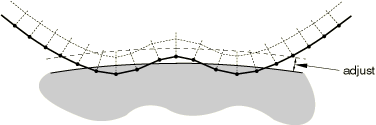
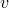

# 36.3.5 在Abaqus/Standard接触对中调整初始表面位置和指定初始间隙


**产品：** Abaqus/Standard  Abaqus/CAE

##### **参考**

- ["在Abaqus/Standard中定义接触对，" 第36.3.1节"](pt09ch36s03aus145.md)
- ["在Abaqus/Standard中建模接触干涉配合，" 第36.3.4节"](pt09ch36s03aus148.md)
- ["在Abaqus/Standard中定义绑定接触，" 第36.3.7节"](pt09ch36s03aus151.md)
- ["Abaqus/Standard中的接触公式，" 第38.1.1节"](pt09ch38s01aus177.md)
- [*CLEARANCE*](../key/key-link.md#usb-kws-mclearance)
- [*CONTACT PAIR*](../key/key-link.md#usb-kws-hcontactpair)
- ["定义表面-表面接触，" Abaqus/CAE用户指南第15.13.7节"](../usi/usi-link.md#usi-itn-help-surftosurf)
- ["使用接触和约束检测，" Abaqus/CAE用户指南第15.16节"](../usi/usi-link.md#usi-itn-detectioneditor)

### 概述

调整Abaqus/Standard接触对中表面的位置：
- 仅能在模拟开始时执行；
- 导致Abaqus/Standard移动从表面的节点，使它们精确接触主表面（对于表面-表面离散化和重叠相互作用定义有一些例外）；
- 不会在模型中产生任何应变；
- 可以消除当使用图形预处理器（如Abaqus/CAE）时由数值舍入引起的小间隙或穿透，从而防止可能的收敛问题；
- 当两个表面在整个分析过程中绑定在一起时是必需的；
- 不应用于纠正网格设计中的重大错误；
- 不能用于对称主-从接触；和
- 将考虑壳和膜厚度以及壳偏移（对于非默认有限滑动、节点-表面接触公式，这些因素在调整区域和调整中被考虑）（见["Abaqus/Standard中的接触公式，" 第38.1.1节"](pt09ch38s01aus177.md)）。

除了将两个表面调整到精确接触外，Abaqus/Standard还提供了各种方法来精确地以大小和方向定义两个表面之间的初始间隙。对负间隙或干涉配合的响应在["在Abaqus/Standard中建模接触干涉配合，" 第36.3.4节"](pt09ch36s03aus148.md)中讨论。

### 调整接触对中的表面

您可以通过指定浮点值*a*（作为主表面周围"调整区域"的深度）或节点集标签来让Abaqus/Standard调整接触对的从表面的位置。

默认情况下，Abaqus/Standard不调整接触对的从表面上的节点；相反，默认情况下，初始过闭合被当作干涉配合处理。

#### 仅适用于表面-表面接触的评论

以下几点适用于具有表面-表面离散化的接触对（关于表面-表面离散化的进一步讨论，请参阅["Abaqus/Standard中的接触公式，" 第38.1.1节"](pt09ch38s01aus177.md)）：
- 对从节点位置的无应变调整可能不会在相对于主表面测量时在从节点处实现完全零间隙。调整是为了在调整区域内每个从节点附近区域中以平均值实现表面之间的零间隙。
- 无应变调整的大小限制为典型面元长度的一半。对于超过此限制的初始过闭合实例，将为相关接触约束存储等于初始过闭合的允许穿透，使得在分析期间抵抗比初始过闭合更深的穿透，但不抵抗小于初始过闭合的穿透。
- 如果附加到它的从面（或二维中的线段）的显著部分在调整区域内，则调整区域外的一些从节点将发生无应变调整。

本节其余部分的讨论直接适用于节点-表面接触离散化（接触在离散点——从节点处施加），但应在上述关于表面-表面接触离散化的上下文中考虑。

#### 调整表面时使用"调整区域"

当您指定*a*（调整区域的深度）时，Abaqus/Standard形成从主表面延伸距离*a*的调整区域。Abaqus/Standard测量穿过从表面节点的主表面法向的距离。模型初始几何中位于"调整区域"内的从表面上的任何节点都被移动到主表面上。这些从节点的移动不会在模型中产生任何应变；它被视为模型定义的更改。[图36.3.5-1](pt09ch36s03aus149.md#aadjustsurf-initial)和[图36.3.5-2](pt09ch36s03aus149.md#aadjustsurf-after)显示了一个调整接触对表面的示例。如果为*a*指定负值，Abaqus/Standard将发出错误消息。

| **输入文件用法：** | ``` [*CONTACT PAIR*](../key/key-link.md#usb-kws-hcontactpair), ADJUST=*a* *slave_surface, master_surface* *...* ``` |
| --- | --- |

| **Abaqus/CAE用法：** | 相互作用模块：接触相互作用编辑器：**指定调整区域的容差**：*a* |
| --- | --- |

**图36.3.5-1** 显示"调整区域"的接触表面的初始配置。从表面以粗体显示。



**图36.3.5-2** 调整后接触表面的配置。调整区域内的节点和过闭合节点已被移动。


##### 使用调整区域调整过闭合的从节点

当您指定调整区域的深度时，Abaqus/Standard将初始配置中穿透主表面的任何从节点移动，使它们恰好接触主表面。为*a*指定0.0会导致Abaqus/Standard仅调整那些穿透主表面的从节点。[图36.3.5-3](pt09ch36s03aus149.md#aadjustsurf-zero)显示了为[图36.3.5-1](pt09ch36s03aus149.md#aadjustsurf-initial)中所示示例指定*a*=0.0的效果。

**图36.3.5-3** 当*a*=0时接触表面的调整配置。


如果您不让Abaqus/Standard调整从表面的位置，则初始配置中过闭合的从节点将在模拟开始时保持过闭合，这可能导致收敛问题。

#### 使用节点集标签调整表面

当仅应调整从节点的子集且指定*a*可能导致其他从节点的不当调整时，您可以指定节点集标签而不是调整区域深度。Abaqus/Standard仅调整属于该节点集的从表面上的节点。节点集可以包含根本不在从表面上的节点：Abaqus/Standard将忽略它们，仅调整作为从表面一部分的节点集中的节点。

Abaqus/Standard无论距离主表面多远，都会移动指定节点集中的任何从节点。从节点从初始配置的调整不会在被形成从表面的单元中产生应变。如果Abaqus/Standard调整距离主表面很远的从节点，单元可能会变得形状不佳，这可能导致收敛困难。

| **输入文件用法：** | ``` [*CONTACT PAIR*](../key/key-link.md#usb-kws-hcontactpair), ADJUST=*node_set_label* *slave_surface, master_surface* *...* ``` |
| --- | --- |

| **Abaqus/CAE用法：** | 相互作用模块：接触相互作用编辑器：**调整节点集中的从节点**：*node_set_label* |
| --- | --- |

##### 使用节点集标签调整过闭合的从节点

因为Abaqus/Standard仅调整指定节点集中的从节点，所以不在指定节点集中的任何过闭合从节点在模拟开始时保持过闭合。因此，如果需要调整的严重过闭合从节点未包含在节点集中，则使用节点集标签可能导致收敛问题。此行为与指定*a*时的行为不同，在后一种情况下，Abaqus/Standard调整从表面上所有过闭合的节点。

#### 重叠接触对的调整

节点调整定义在分析开始时按顺序处理。如果不同的约束或接触定义涉及相同的节点，则某些调整可能导致先前处理的接触或约束定义缺乏一致性。在某些情况下，可以通过更改约束和接触定义的处理顺序来避免这些冲突：不同接触或约束定义中的公共节点应首先作为从节点处理，然后作为主节点处理。

| **输入文件用法：** | 要更改约束和接触定义的处理顺序，请在输入文件中更改定义的顺序。约束和接触定义按其出现的顺序处理。 |
| --- | --- |

| **Abaqus/CAE用法：** | 要更改约束和接触定义的处理顺序，请在模型中更改约束和相互作用的名称。约束和相互作用按其名称的字母顺序处理。 |
| --- | --- |

### 何时调整接触表面对

在以下情况下，调整接触对中的表面是必需的或强烈推荐的：
- 当在整个分析过程中将两个表面绑定在一起时（见["在Abaqus/Standard中定义绑定接触，" 第36.3.7节"](pt09ch36s03aus151.md)）。
- 当使用小滑动或无限小滑动接触时（见["Abaqus/Standard中的接触公式，" 第38.1.1节"](pt09ch38s01aus177.md)）。
- 当通过定义允许的接触干涉来指定精确的初始间隙或初始过闭合时（见下面的["指定精确初始间隙或过闭合的替代方法"](pt09ch36s03aus149.md#usb-cni-aadjustsurfaces-contactinterference)）。

### 为小滑动接触定义精确的初始间隙或过闭合

当从节点坐标计算初始间隙或过闭合不够精确时（例如，如果初始间隙相对于坐标值非常小），您可以为从表面上的节点定义精确的初始间隙或过闭合值以及接触方向。

在每个从节点处计算的初始间隙或过闭合值（基于从节点和主表面的坐标）将被您指定的值覆盖。此过程在内部执行，不影响从节点的坐标。如果您定义了间隙，Abaqus/Standard将认为两个表面不接触，无论它们的节点坐标如何。如果您定义了过闭合，Abaqus/Standard将认为两个表面是干涉配合，并尝试在第一个增量中解决过闭合。如果定义的过闭合很大，您可能需要指定在多个增量中斜降的允许干涉。有关干涉配合的进一步讨论，请参阅["在Abaqus/Standard中建模接触干涉配合，" 第36.3.4节"](pt09ch36s03aus148.md)。

您只能为小滑动接触定义初始间隙或过闭合值（["Abaqus/Standard中的接触公式，" 第38.1.1节"](pt09ch38s01aus177.md)）。有关可用于建模有限滑动接触对之间间隙或过闭合的技术，请参阅下面的["指定精确初始间隙或过闭合的替代方法"](pt09ch36s03aus149.md#usb-cni-aadjustsurfaces-contactinterference)"。

#### 为表面指定统一间隙或过闭合

您可以通过识别接触对的主表面和从表面以及期望的初始间隙（正值为间隙；负值为过闭合）来为接触对指定统一间隙或过闭合。不需要其他数据。

| **输入文件用法：** | ``` [*CLEARANCE*](../key/key-link.md#usb-kws-mclearance), SLAVE=*surface_name*, MASTER=*surface_name*, VALUE= ``` |
| --- | --- |

| **Abaqus/CAE用法：** | 相互作用模块：接触相互作用编辑器：**间隙**：**初始间隙：从表面上的统一值**： |
| --- | --- |

#### 为表面指定空间变化的间隙或过闭合

或者，您可以通过识别接触对的主表面和从表面，并提供指定属于从表面节点或节点集的间隙的数据表，来为接触对指定空间变化的间隙或过闭合。任何未被识别的从表面节点将使用Abaqus/Standard从表面初始几何计算出的间隙。

| **输入文件用法：** | ``` [*CLEARANCE*](../key/key-link.md#usb-kws-mclearance), SLAVE=*surface_name*, MASTER=*surface_name*, TABULAR *node number or node set label, clearance value* ``` |
| --- | --- |
| | 根据需要重复数据行。 |

| **Abaqus/CAE用法：** | 您不能在Abaqus/CAE中使用数据表指定初始间隙或过闭合值。 |
| --- | --- |

##### 从外部文件读取空间变化的间隙或过闭合

Abaqus/Standard可以从外部文件读取接触对的空间变化间隙或过闭合。

| **输入文件用法：** | ``` [*CLEARANCE*](../key/key-link.md#usb-kws-mclearance), SLAVE=*surface_name*, MASTER=*surface_name*, TABULAR, INPUT=*file_name* ``` |
| --- | --- |

| **Abaqus/CAE用法：** | 您不能在Abaqus/CAE中使用外部输入文件指定初始间隙或过闭合值。 |
| --- | --- |

##### 指定接触计算的表面法向

通常，Abaqus/Standard根据离散表面的几何形状计算用于接触计算的表面法向，使用["Abaqus/Standard中的接触公式，" 第38.1.1节"](pt09ch38s01aus177.md)中描述的算法。指定空间变化的间隙或过闭合时，您可以通过指定此向量的分量来重新定义Abaqus/Standard与每个从节点一起使用的接触方向。该向量必须在全局笛卡尔坐标系中定义，它应定义主表面期望的外法向方向。

| **输入文件用法：** | ``` [*CLEARANCE*](../key/key-link.md#usb-kws-mclearance), SLAVE=*surface_name*, MASTER=*surface_name*, TABULAR *node number or node set label, clearance value, first normal component, second normal component, third normal component* ``` |
| --- | --- |
| | 根据需要重复数据行。 |

| **Abaqus/CAE用法：** | 您不能在Abaqus/CAE中重新定义接触方向，螺纹螺栓连接除外（见下面的["自动为螺纹螺栓连接生成接触法向方向"](pt09ch36s03aus149.md#usb-cni-aadjustsurfaces-clearance-bolt)）。 |
| --- | --- |

##### 自动为螺纹螺栓连接生成接触法向方向

或者，对于单螺纹螺栓连接，可以通过指定螺纹几何数据和用于定义螺栓/螺栓孔轴线上向量的两点来自动生成每个从节点的接触法向方向。螺栓或螺栓孔可以是从表面或主表面。但是，必须适当选择定义螺栓或螺栓孔轴线的向量。

例如，当选择螺栓表面作为主表面时，如果螺栓处于拉伸状态，向量应从螺栓尖端指向螺栓头部，如果螺栓处于压缩状态，则从头部指向尖端。如果选择螺栓表面作为从表面且螺栓处于拉伸状态，则应翻转螺栓轴线（即从头到尖端）并指定负的半螺纹角度。错误的螺栓轴线方向将不会激活接触相互作用，表面将不受约束。您应检查螺栓中的应力以确保接触已激活。

| **输入文件用法：** | ``` [*CLEARANCE*](../key/key-link.md#usb-kws-mclearance), SLAVE=*surface_name*, MASTER=*surface_name*, TABULAR, BOLT *half-thread angle, pitch, major bolt diameter, mean bolt diameter* *node number or node set label, clearance value, coordinates of points a and b on the axis of the bolt/bolt hole* ``` |
| --- | --- |
| | 根据需要重复第二数据行。 |

| **Abaqus/CAE用法：** | 相互作用模块：接触相互作用编辑器：**间隙**：**初始间隙**：**为单螺纹螺栓计算**或**为单螺纹螺栓指定**：*clearance value*，**从表面上的间隙区域**：**编辑区域**：选择区域，**螺栓方向向量**：**编辑**：选择轴，**半螺纹角度**：*half-thread angle*，**螺距**：*pitch*，**螺栓直径**：**大径**：*major bolt diameter*或**中径**：*mean bolt diameter* |
| --- | --- |

#### 可视化精确初始间隙或过闭合

当指定精确初始间隙或过闭合时，Abaqus/Standard不会调整从表面的坐标。因此，指定的间隙或过闭合不能在Abaqus/CAE中的模型中看到。因此，根据表面的初始几何形状和间隙或过闭合的大小，表面在Abaqus/CAE中可能看起来是开放或闭合的，而实际上它们恰好接触。然而，可以通过绘制变量COPEN的等值线图在Abaqus/CAE中显示actual间隙。

### 指定精确初始间隙或过闭合的替代方法

Abaqus/Standard提供了一种定义精确初始间隙或过闭合的替代方法，适用于小滑动和有限滑动接触对。在此方法中，您为接触对指定调整区域深度（如上["调整接触对中的表面"](pt09ch36s03aus149.md#usb-cni-aadjustsurfaces-adjust)"中所述），以在分析开始时将形成接触对的表面移动到恰好接触。然后，在模拟的第一步中，您为接触对指定允许的接触干涉（见["在Abaqus/Standard中建模接触干涉配合，" 第36.3.4节"](pt09ch36s03aus148.md)）。接触干涉定义必须引用幅值曲线；幅值曲线的形式取决于是定义间隙还是过闭合，如下所述。间隙或过闭合在表面上将是统一的。

| **输入文件用法：** | 使用以下所有选项： |
| --- | --- |
| | ``` [*CONTACT PAIR*](../key/key-link.md#usb-kws-hcontactpair), ADJUST=*a* *slave_surface, master_surface* [*AMPLITUDE*](../key/key-link.md#usb-kws-mamplitude), NAME=*amplitude_name* [*CONTACT INTERFERENCE*](../key/key-link.md#usb-kws-hcontactinterfer), AMPLITUDE=*amplitude_name* *slave_surface, master_surface*,  ``` |

| **Abaqus/CAE用法：** | 相互作用模块：接触相互作用编辑器：**指定调整区域的容差**：*a*，**干涉配合**：打开**统一允许干涉**，**幅值**：*amplitude_name*，**步骤开始时的大小**： |
| --- | --- |

#### 通过定义允许接触干涉来指定精确间隙

要通过定义允许接触干涉来指定精确间隙，幅值曲线应在整个步骤期间保持恒定大小。应为允许干涉指定正值。当在Abaqus/CAE中查看时，这些表面在接触时看起来会相互穿透。表面以使它们恰好接触的坐标开始模拟，但指定的干涉使它们表现得好像它们之间有间隙。

#### 通过定义允许接触干涉来指定精确过闭合

要通过定义允许接触干涉来指定精确过闭合，幅值曲线应在整个步骤期间从零斜升至统一，以允许Abaqus/Standard逐渐解决过闭合。应为允许干涉指定负值。当在Abaqus/CAE中查看时，表面以使它们恰好接触的坐标开始模拟，但指定的干涉使它们表现得好像是过闭合的。随着Abaqus/Standard解决过闭合，这些表面将看起来彼此分离。当两个表面之间的间隙等于距离时，表面将表现得好像是恰好接触的。


