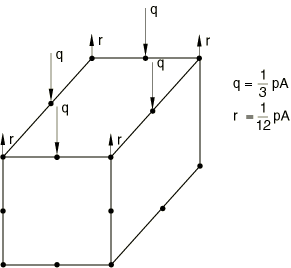

# 36.3.6 在Abaqus/Standard中调整接触控制


**产品：** Abaqus/Standard  Abaqus/CAE

##### **参考**

- ["在Abaqus/Standard中定义接触对，" 第36.3.1节"](pt09ch36s03aus145.md)
- [*CONTACT CONTROLS*](../key/key-link.md#usb-kws-hcontactcontrols)
- [*CONTACT PAIR*](../key/key-link.md#usb-kws-hcontactpair)
- ["定义表面-表面接触，" Abaqus/CAE用户指南第15.13.7节"](../usi/usi-link.md#usi-itn-help-surftosurf)
- ["定义自接触，" Abaqus/CAE用户指南第15.13.8节"](../usi/usi-link.md#usi-itn-help-self)
- ["在Abaqus/Standard分析中指定接触控制，" Abaqus/CAE用户指南第15.13.9节"](../usi/usi-link.md#usi-itn-help-std-controls)

### 概述

Abaqus/Standard中的接触控制：
- 对于大多数问题，不应修改默认设置；
- 可用于标准接触控制无法提供经济有效解决方案的问题；
- 可用于标准控制无法有效建立期望接触条件的问题；和
- 在某些情况下，可用于控制是否创建补充接触约束。

从Abaqus/Standard中的接触控制调整中受益的问题通常是具有复杂几何形状和大量接触界面的大型模型。

### 应用接触控制

您可以按步将接触控制应用到该步骤中活动的所有接触对和接触单元，或应用到单个接触对。这使得可以将接触控制应用到特定接触对以使模拟通过困难阶段。接触控制保持有效直到被更改或重置为其默认值。如果在任何给定步骤中为整个模型和特定接触对都声明了接触控制，则特定接触对的控制将覆盖该接触对整个模型的控制。

此外，您可以如下的["补充接触约束"](pt09ch36s03aus151.md#usb-cni-acontacttrouble-supplementary-constraints)"中所述，为单个接触对指定补充接触约束。

| **输入文件用法：** | 要将接触控制应用到所有接触对和接触单元： |
| --- | --- |
| | ``` [*CONTACT CONTROLS*](../key/key-link.md#usb-kws-hcontactcontrols) *contact control options* ``` 要将接触控制应用到特定接触对： ``` [*CONTACT CONTROLS*](../key/key-link.md#usb-kws-hcontactcontrols), SLAVE=*slave surface*, MASTER=*master surface* *contact control options* ``` 重复此选项以将接触控制应用到多个接触对。 |

| **Abaqus/CAE用法：** | Abaqus/CAE中的接触控制只能应用到特定接触对： |
| --- | --- |
| | 相互作用模块：****相互作用********接触控制********创建****：**Abaqus/Standard接触控制** 接触相互作用编辑器：**接触控制**：*contact controls name* |

#### 重置接触控制

您可以将所有接触控制重置为其默认值，或者可以重置特定接触对的控制。

| **输入文件用法：** | 要重置所有接触控制： |
| --- | --- |
| | ``` [*CONTACT CONTROLS*](../key/key-link.md#usb-kws-hcontactcontrols), RESET ``` 要重置特定接触对的控制： ``` [*CONTACT CONTROLS*](../key/key-link.md#usb-kws-hcontactcontrols), SLAVE=*slave surface*, MASTER=*master surface*, RESET ``` |

| **Abaqus/CAE用法：** | 相互作用模块：接触相互作用编辑器：**接触控制：（默认）** |
| --- | --- |
| | 您不能在Abaqus/CAE中一次重置所有接触控制。 |

### 接触问题中刚性体运动的自动稳定化

Abaqus/Standard提供接触稳定化，以帮助自动控制在静态问题中接触闭合和摩擦约束这种运动之前的刚性体运动。

建议您首先尝试通过建模技术（修改几何、施加边界条件等）来稳定刚性体运动。自动稳定化功能旨在用于清楚将建立接触但多个实体的精确定位在建模期间困难的情况。它不意味着模拟一般刚性体动力学；也不意味着用于接触抖动情况或解决配合表面之间的初始紧密间隙。

当使用自动接触稳定化时，Abaqus/Standard在所有从节点处激活接触对的相对运动的粘性阻尼，方式与接触阻尼相同（见["接触阻尼，" 第37.1.3节"](pt09ch37s01aus167.md)）。与大多数接触控制不同（接触控制延续到后续步骤直到被修改或重置），自动稳定化阻尼仅在指定该阻尼的步骤期间施加。在后续步骤中，即使接触未建立或由于接触对完全分离而稍后出现刚性体运动，稳定化也被移除。如果需要，您也应该为后续步骤指定稳定化。

默认情况下，阻尼系数：
- 基于底层单元的刚性和步骤时间自动为每个接触约束计算，
- 在法向和切向方向上平等地应用于所有接触对，
- 在步骤上线性斜降，
- 仅当接触表面之间的距离小于特征表面尺寸时激活，以及
- 对于使用接触单元建模的接触（如间隙接触单元、管-管接触单元等）为零。

虽然自动计算的阻尼系数通常提供足够的阻尼来消除刚性体模式而不对解产生重大影响，但不能保证该值是最优的甚至合适的。对于薄壳模型尤其如此，其中阻尼可能太高。因此，如果收敛行为有问题，您可能必须增加阻尼；如果它使解失真，则可能必须减少阻尼。第一种情况很明显，但后者需要事后检查。有几种方法可以执行此类检查。最简单的方法是考虑粘性阻尼耗散的能量与模型的更一般能量度量（如弹性应变能）之间的比率。这些量可以分别作为输出变量ALLSD和ALLSE获得。更详细的信息可以通过将接触阻尼应力CDSTRESS（具有各分量CDPRESS、CDSHEAR1和CDSHEAR2）与真实接触应力CSTRESS（具有各分量CPRESS、CSHEAR1和CSHEAR2）进行比较来获得。如果接触阻尼应力太高，您应该减少阻尼。比较应在接触牢固建立后进行；当接触未建立或仅部分建立时，接触阻尼应力总是相对较高。

增加或减少阻尼量的最简单方法是指定一个乘数，自动计算的阻尼系数将乘以该乘数。通常，您应该最初考虑更改默认阻尼（至少）一个数量级；如果这足以解决问题，您可以可以进行一些后续微调。在某些情况下，可能需要更大或更小的因子；只要获得收敛解且耗散的能量和接触阻尼应力足够小，这就不是问题。

也可以直接指定阻尼系数。阻尼系数的直接指定不容易，可能需要一些试错。出于效率原因，最好在缩小尺寸的类似模型上完成。如果直接指定阻尼系数，则忽略为默认阻尼系数指定的任何乘数因子。

| **输入文件用法：** | 要使用默认阻尼系数： |
| --- | --- |
| | ``` [*CONTACT CONTROLS*](../key/key-link.md#usb-kws-hcontactcontrols), STABILIZE ``` 要指定默认阻尼系数的缩放因子： ``` [*CONTACT CONTROLS*](../key/key-link.md#usb-kws-hcontactcontrols), STABILIZE=*factor* ``` 要直接指定阻尼系数： ``` [*CONTACT CONTROLS*](../key/key-link.md#usb-kws-hcontactcontrols), STABILIZE *damping coefficient* ``` |

| **Abaqus/CAE用法：** | 相互作用模块：Abaqus/Standard接触控制编辑器：**稳定化**：**自动稳定化**，**因子**：*factor*或**稳定化系数**：*damping coefficient* |
| --- | --- |

#### 在增量内更改稳定化

为减少或消除接触稳定化显著影响报告解决方案的可能性，可以引入在增量迭代期间变化的缩放因子。在增量早期迭代中更有效的稳定化可以帮助避免在建立一些接触之前的数值问题。在后期迭代中更少或没有稳定化可以帮助提高增量最终收敛迭代的准确性。

您可以指定这些缩放因子。例如，指定"1,0"会导致缩放因子在初始迭代期间（直到各种收敛测量满足或接近满足）为 unity，然后在最终迭代中重置为零（有效关闭稳定化）直到再次满足收敛检查。

| **输入文件用法：** | 要在增量内更改阻尼系数： |
| --- | --- |
| | ``` [*CONTACT CONTROLS*](../key/key-link.md#usb-kws-hcontactcontrols), STABILIZE=USER ADAPTIVE ``` |

#### 指定稳定化斜降因子

您可以指定步骤结束时的斜降因子。默认情况下，此值等于零，以便阻尼在步骤结束时完全消失。如果在步骤结束时刚性体模式未完全约束，为此因子输入非零值可能是有用的；例如，如果问题是无摩擦的，可能发生滑动运动但在滑动方向上没有净力。在这种情况下，通常希望使用用于斜降的值作为阻尼系数的乘数因子在下一步中保持小阻尼。如果需要，您可以通过将斜降因子设置为一来保持此阻尼水平。

| **输入文件用法：** | ``` [*CONTACT CONTROLS*](../key/key-link.md#usb-kws-hcontactcontrols), STABILIZE , *ramp-down factor* ``` |
| --- | --- |

| **Abaqus/CAE用法：** | 相互作用模块：Abaqus/Standard接触控制编辑器：**稳定化**：**自动稳定化**或**稳定化系数**，**步骤结束时阻尼的比例**：*ramp-down factor* |
| --- | --- |

#### 指定阻尼范围

默认情况下，施加阻尼的开口距离（阻尼范围）等于特征从表面面元尺寸；如果此类尺寸不可用（例如，对于基于节点的表面），则使用为整个模型获得的特征单元长度。对于小于一半阻尼范围的开口，阻尼为参考值的100%，从那里斜降至开口等于阻尼范围时的零。或者，您可以指定阻尼范围，直接覆盖计算值。如果阻尼应该仅适用于窄间隙，或者无论开口距离如何都应施加阻尼，这可能是有用的。在后一种情况下，应输入一个大的值。

| **输入文件用法：** | ``` [*CONTACT CONTROLS*](../key/key-link.md#usb-kws-hcontactcontrols), STABILIZE , , *damping range* ``` |
| --- | --- |

| **Abaqus/CAE用法：** | 相互作用模块：Abaqus/Standard接触控制编辑器：**稳定化**：**自动稳定化**或**稳定化系数**，**阻尼变为零的间隙：指定**：*damping range* |
| --- | --- |

#### 指定切向阻尼

默认情况下，切向方向的阻尼与法向方向的阻尼相同。但是，如果需要更低或更高的值，您可以减少或增加切向阻尼或将其设置为零。

| **输入文件用法：** | ``` [*CONTACT CONTROLS*](../key/key-link.md#usb-kws-hcontactcontrols), STABILIZE, TANGENT FRACTION=*value* ``` |
| --- | --- |

| **Abaqus/CAE用法：** | 相互作用模块：Abaqus/Standard接触控制编辑器：**稳定化**：**自动稳定化**或**稳定化系数**，**切向分数**：*value* |
| --- | --- |

### 与法向接触约束相关的接触控制

这些控制允许您指定接触界面上的节点可以违反"硬"接触条件。此外，这些控制可用于修改"软化"压力-闭合关系以及增强拉格朗日或惩罚接触约束施加的行为。无分离压力-闭合关系不能被接触控制修改。

节点可以以两种方式之一违反接触条件。首先，Abaqus/Standard可能认为该节点没有接触，即使该节点已穿透主表面一小段距离。其次，Abaqus/Standard可能认为节点有接触，即使该节点处接触表面之间传递的法向压力为负（即，正在传递拉应力）。

#### 修改增强拉格朗日或惩罚接触约束施加的行为

对于增强拉格朗日接触，您可以指定允许的穿透（直接指定或作为特征接触表面尺寸的分数），以允许违反不可穿透条件。此外，对于增强拉格朗日或惩罚接触，您可以缩放Abaqus/Standard计算的默认惩罚刚度。增强拉格朗日和惩罚约束施加方法的控制在["Abaqus/Standard中的接触约束施加方法，" 第38.1.2节"](pt09ch38s01aus178.md)中讨论。

### 在线姓扰动步骤中修改切向惩罚刚度

在线性扰动步骤中施加切向约束的惩罚刚度通常与在一般步骤中施加粘附的惩罚刚度不同。在扰动步骤中，当相应的法向约束在基础状态中活动且接触属性（表面相互作用）定义包括摩擦模型时，Abaqus/Standard激活切向接触约束。默认情况下，切向惩罚刚度等于默认法向惩罚刚度。

您可以按步缩放切向惩罚刚度来模拟粘附/滑动条件。此缩放仅影响指定它的扰动步骤；它不会延续到后续步骤。如果您希望在同一系列扰动步骤中应用相同的缩放因子，则必须在每个步骤中明确指定缩放因子。

某些依赖频率分析的程序（如复频率分析和基于子空间的稳态动力学分析）会受到先前频率分析有效的切向刚度缩放以及这些步骤有效的切向刚度缩放的影响。在这种情况下，建议这些步骤使用一致的缩放。对于其他基于频率分析的模态程序，切向刚度的缩放被忽略，仅考虑先前频率分析的效果。

| **输入文件用法：** | 要在线性扰动步骤中修改所有接触对的切向惩罚刚度： |
| --- | --- |
| | ``` [*CONTACT CONTROLS*](../key/key-link.md#usb-kws-hcontactcontrols), PERTURBATION TANGENT SCALE FACTOR=*factor* ``` 要在线性扰动步骤中修改特定接触对的切向惩罚刚度： ``` [*CONTACT CONTROLS*](../key/key-link.md#usb-kws-hcontactcontrols), PERTURBATION TANGENT SCALE FACTOR=*factor*, SLAVE=*slave surface*, MASTER=*master surface* ``` |

| **Abaqus/CAE用法：** | 在线姓扰动步骤中修改切向惩罚刚度在Abaqus/CAE中不支持。 |
| --- | --- |

### 线性扰动步骤中与压力相关的约束施加

在线性扰动步骤期间，接触约束通常对所有闭合接触界面完全施加，与基础状态中的局部法向压力无关。您可以使用两个控制压力系数和来放松基础状态中压力低的约束，甚至完全移除它们。法向和切向约束都受影响。对于基础状态中压力小于的情况，法向和切向约束通过将约束刚度设置为零而被有效移除。对于压力大于的情况，约束被完全施加。对于和之间的压力，约束刚度降低，并在和之间线性增加。在此压力范围内，即使对于否则将使用严格拉格朗日乘子施加的接触约束，有限接触刚度也是有效的。初始应力刚度项也被缩放。

所有其他法向和切向接触惩罚的控制都适用。基础状态中开放的约束不受影响。压力相关约束施加不能在一般步骤期间使用。

您可以按步指定与压力相关的约束施加。此指定影响指定它的扰动步骤；它不会延续到后续步骤。如果您希望在同一系列扰动步骤中应用相同的指定，则必须在每个步骤中明确指定它。

某些依赖频率分析的程序（如复频率分析和基于子空间的稳态动力学分析）会受到先前频率分析有效的指定以及这些步骤有效的指定的影响。在这种情况下，建议这些步骤使用一致的指定。对于其他基于频率分析的模态程序，指定被忽略，仅考虑先前频率分析的效果。

| **输入文件用法：** | 要在线性扰动步骤中为所有接触对指定基于基础状态压力的约束施加： |
| --- | --- |
| | ``` [*CONTACT CONTROLS*](../key/key-link.md#usb-kws-hcontactcontrols), PRESSURE DEPENDENT PERTURBATION=  ``` 要在线性扰动步骤中为特定接触对指定基于基础状态压力的约束施加： ``` [*CONTACT CONTROLS*](../key/key-link.md#usb-kws-hcontactcontrols), PRESSURE DEPENDENT PERTURBATION=, SLAVE=*slave surface*, MASTER=*master surface*  ``` |

| **Abaqus/CAE用法：** | 在线姓扰动步骤中基于基础状态压力的约束施加在Abaqus/CAE中不支持。 |
| --- | --- |

### 与二阶面相关的接触控制

二阶单元不仅提供更高的精度，而且更有效地捕获应力集中，比一阶单元更好地建模几何特征。基于二阶单元类型的表面与表面-表面接触公式配合良好，但在某些情况下，与节点-表面公式配合不佳（见["Abaqus/Standard中的接触公式，" 第38.1.1节"](pt09ch38s01aus177.md)，了解这些接触公式的讨论）。

某些二阶单元类型不适合与节点-表面接触公式和"硬"接触条件的严格施加结合作为从表面底层，因为当压力作用在单元面上时，等效节点力的分布。如[图36.3.6-1](pt09ch36s03aus151.md#eq-nodal-loads-contactcontrolsstd)所示，施加到没有面中节点的二阶单元面的恒定压力会在角节点处产生与压力相反方向的力。

**图36.3.6-1** "硬"接触模拟中施加到二阶单元面的恒定压力产生的等效节点载荷。



二阶单元中节点力的这种模糊性质可能导致Abaqus/Standard不充分地改变其内部接触逻辑。基于二阶四面体单元的从表面也可能对节点-表面接触公式有问题，因为对这些单元面的压力作用的等效节点力分布使得角节点处的力为零。

下面讨论Abaqus/Standard中可用的选项，以使涉及二阶从面的节点-表面接触对更容易使用。如果需要，您也可以使用表面-表面接触公式来避免潜在困难，这通常是更可取的。

#### 手动或自动调整单元类型

改进的10节点四面体单元（C3D10M等）不会对节点-表面接触公式造成根本困难，并且通常为具有节点-表面接触对的模型提供10节点二阶四面体单元（C3D10、C3D10I等）的可行替代方案。改进的10节点四面体单元与二阶四面体单元的特性权衡在["实体（连续体）单元，" 第28.1.1节"](pt06ch28s01alm01.md#usb-elm-esolidcont-modifiedelems)中的"改进的三角形和四面体单元"中讨论。如果需要，您必须对单元类型进行此调整，因为它不会自动发生。

Abaqus/Standard自动为与非绑定节点-表面接触对相关的大多数8节点从面元的底层（简化的）单元添加面中节点。对于三维18节点垫片单元，如果元素连接中未给出面中节点，也会自动生成面中节点。面中节点的存在导致对接触算法不模糊的节点力分布。单元族C3D20(RH)、C3D15(H)、S8R5和M3D8分别转换为族C3D27(RH)、C3D15V(H)、S9R5和M3D9。由于Abaqus/Standard不转换二阶耦合温度-位移、耦合热-电-结构和耦合孔隙压力-位移单元，因此您应使用替代方法来避免这些情况中节点-表面接触公式中简化单元的问题。当在任何用户定义的节点上指定值时，Abaqus/Standard会在自动生成的面中节点处插值节点量（如温度和场变量）。如果从表面用于绑定接触对，则Abaqus/Standard不转换二阶简化单元。

默认情况下，Abaqus/Standard不会自动为表面-表面接触对的从表面形成的二阶简化单元添加面中节点；但是，有一个选项可以启用与节点-表面接触对使用的自动添加面中节点的相同算法。

| **输入文件用法：** | |
| --- | --- |
| | ``` [*CONTACT PAIR*](../key/key-link.md#usb-kws-hcontactpair), TYPE=SURFACE TO SURFACE, MIDFACE NODES=YES ``` |

| **Abaqus/CAE用法：** | 您不能在Abaqus/CAE中启用表面-表面接触对的从表面底层简化单元的自动转换。 |
| --- | --- |

#### 补充接触约束

避免某些单元类型对节点-表面接触公式造成困难的另一种方法是在不更改底层单元公式的情况下添加补充接触约束。此方法仅适用于节点-表面接触对使用惩罚或增强拉格朗日约束施加或软化压力-闭合关系的情况，因为如果严格施加"硬"接触条件，它将导致过约束情况。补充接触约束有时有助于改善收敛行为或改善接触压力和底层单元应力的平滑度和准确性；但是，额外的约束存在降低收敛行为的一定风险。默认情况下，对于具有6节点从面的非改进单元和8节点从面的节点-表面接触对，除非严格施加"硬"接触条件，否则选择性地使用补充约束。您可以停用补充约束或为从表面底层的其他二阶单元类型添加激活补充约束。

| **输入文件用法：** | ``` [*CONTACT PAIR*](../key/key-link.md#usb-kws-hcontactpair), INTERACTION=*interaction_property_name*, SUPPLEMENTARY CONSTRAINTS=SELECTIVE *slave_surface_name*, *master_surface_name* ``` |
| --- | --- |
| | 使用以下选项为其他二阶单元类型添加补充接触约束： ``` [*CONTACT PAIR*](../key/key-link.md#usb-kws-hcontactpair), INTERACTION=*interaction_property_name*, SUPPLEMENTARY CONSTRAINTS=YES *slave_surface_name*, *master_surface_name* ``` 使用以下选项放弃补充接触约束： ``` [*CONTACT PAIR*](../key/key-link.md#usb-kws-hcontactpair), INTERACTION=*interaction_property_name*, SUPPLEMENTARY CONSTRAINTS=NO *slave_surface_name*, *master_surface_name* ``` |

| **Abaqus/CAE用法：** | 对于节点-表面接触公式： |
| --- | --- |
| | 相互作用模块：**创建相互作用**：**表面-表面接触（Standard）**：选择主表面；点击**表面**；选择从表面；相互作用编辑器；**使用补充接触点**：**选择性**、**始终**或**从不**；**接触相互作用属性**：*interaction_property_name* |

### 表面-表面接触对滑动时接触力重分布的平滑性

您可以控制表面-表面接触对滑动时节点接触力重分布的平滑性。默认设置（通常适当）导致节点力重分布的平滑性与从表面底层单元的阶次相同；即，线性单元的线性重分布平滑性，二阶单元的二次重分布平滑性。二次重分布平滑性通常倾向于改善收敛行为，并改善快速变化接触应力区域内接触应力的分辨率。然而，二次重分布平滑性倾向于增加每个约束涉及的节点数量，这可能增加方程求解器的计算成本。线性重分布平滑性倾向于提供活动接触区域边缘附近接触应力的更好分辨率，因此偶尔会产生更好的收敛行为。

| **输入文件用法：** | 使用以下选项指示表面-表面接触对滑动时接触力重分布的平滑性应与从表面底层单元的阶次相同： |
| --- | --- |
| | ``` [*CONTACT PAIR*](../key/key-link.md#usb-kws-hcontactpair), TYPE=SURFACE TO SURFACE, SLIDING TRANSITION=ELEMENT ORDER SMOOTHING *slave_surface_name*, *master_surface_name* ``` 使用以下选项指示表面-表面接触对滑动时接触力重分布的线性平滑性： ``` [*CONTACT PAIR*](../key/key-link.md#usb-kws-hcontactpair), TYPE=SURFACE TO SURFACE, SLIDING TRANSITION=LINEAR *slave_surface_name*, *master_surface_name* ``` 使用以下选项指示表面-表面接触对滑动时接触力重分布的二次平滑性： ``` [*CONTACT PAIR*](../key/key-link.md#usb-kws-hcontactpair), TYPE=SURFACE TO SURFACE, SLIDING TRANSITION=QUADRATIC *slave_surface_name*, *master_surface_name* ``` |

| **Abaqus/CAE用法：** | 您不能在Abaqus/CAE中更改默认的接触力重分布。 |
| --- | --- |


