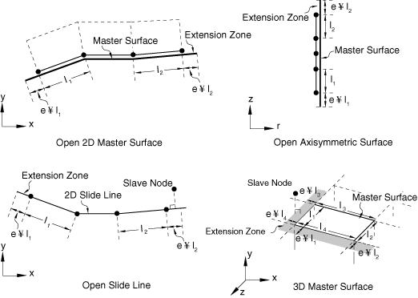

# 36.3.8 扩展主表面和滑移线


**产品：** Abaqus/Standard

##### **参考**

- ["在Abaqus/Standard中定义接触对，" 第36.3.1节"](pt09ch36s03aus145.md)
- ["Abaqus/Standard中接触建模常见困难，" 第39.1.2节"](pt09ch39s01aus184.md)
- [*CONTACT PAIR*](../key/key-link.md#usb-kws-hcontactpair)
- [*SLIDE LINE*](../key/key-link.md#usb-kws-mslideline)

### 概述

扩展主表面或滑移线：
- 可以防止节点在有限滑动问题中"掉落"或被困在主表面（或滑移线）后面；
- 允许从节点在小的和无限小滑动问题中从节点在分析开始时与主表面没有交点时找到主表面；
- 可以避免与接触建模相关的数值舍入困难；
- 不应代替适当的接触建模技术使用；
- 不应用来减少接触表面的底层单元数量；
- 仅适用于三维中主表面的周缘和二维中主表面的末端；和
- 仅适用于使用节点-表面离散化的接触对。

### 为小滑动、节点-表面接触扩展主表面

如果从节点在分析开始时找不到与主表面的交点，它将自由穿透主表面，因为不会形成局部切平面。这种问题通常发生在节点-表面接触中，当从节点与主表面的末端或周缘对齐时（不环绕矩形体的角落），如[图36.3.8-1](pt09ch36s03aus152.md#aextsurf-small-slide)所示，这可能是由于使用预处理器生成节点坐标时的数值舍入误差造成的。表面内部的主面没有扩展。如果[图36.3.8-1](pt09ch36s03aus152.md#aextsurf-small-slide)中的主表面被定义为环绕体角落，则不需要扩展主表面，因为从节点将使用["使用小滑动跟踪方法" in "Abaqus/Standard中的接触公式，" 第38.1.1节"](pt09ch38s01aus177.md#usb-cni-acontactpairform-smsliding)中讨论的投影方法投影到主表面上。[图36.3.8-1](pt09ch36s03aus152.md#aextsurf-small-slide)中所示的情况对于小滑动、表面-表面公式不是问题，因为约束公式考虑从节点附近从表面的区域。

**图36.3.8-1** 如果*e*=*0*，从节点未能找到与小滑动、节点-表面接触的主表面的交点。


对于节点-表面接触，您可以指定扩展区*e*的大小，作为末端线段或面元边缘长度的分数（见[图36.3.8-2](pt09ch36s03aus152.md#aextsurf-finite-slide)）。如果*e*设置为零，Abaqus将不扩展末端。给出的值必须介于0.0和0.2之间。节点-表面接触的默认值为0.1；表面扩展不适用于表面-表面接触。

| **输入文件用法：** | ``` [*CONTACT PAIR*](../key/key-link.md#usb-kws-hcontactpair), SMALL SLIDING, EXTENSION ZONE=*e* ``` |
| --- | --- |

**图36.3.8-2** 扩展区大小的定义。



### 在有限滑动、节点-表面接触中扩展主表面或滑移线

为防止从节点"掉落"或被困在主表面后面，可以为有限滑动、节点-表面接触将开放表面或滑移线扩展到其周缘边缘（三维）或末端节点（二维）之外。

您可以指定扩展区*e*的大小，作为末端线段或面元边缘长度的分数（见[图36.3.8-2](pt09ch36s03aus152.md#aextsurf-finite-slide)）。扩展区中的几何从末端线段或面元边缘外推。如果*e*设置为零，Abaqus/Standard将不扩展末端。给出的值必须介于0.0和0.2之间。节点-表面接触的默认值为0.1。表面扩展不适用于表面-表面接触；对于有限滑动、表面-表面接触，约束位于从面内，直到整个从面元几乎从主表面滑落，"掉落"才会发生。仅当其他防止"掉落"的建模技术不可行且从节点预计在解阶段或非收敛迭代期间在扩展区中短暂移动时，才应考虑有限滑动、节点-表面接触的扩展。

| **输入文件用法：** | 使用以下任一选项： |
| --- | --- |
| | ``` [*CONTACT PAIR*](../key/key-link.md#usb-kws-hcontactpair), EXTENSION ZONE=*e* [*SLIDE LINE*](../key/key-link.md#usb-kws-mslideline), ELSET=*element_set_name*, EXTENSION ZONE=*e* ``` |


