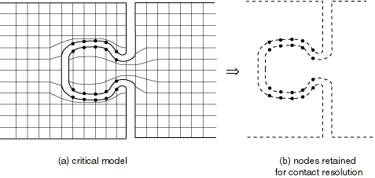

# 36.3.9 存在子结构时的接触建模

**产品：** Abaqus/Standard

##### **参考**

- ["基于单元的表面定义，" 第2.3.2节"](pt01ch02s03aus17.md)
- ["基于节点的表面定义，" 第2.3.3节"](pt01ch02s03aus18.md)
- ["使用子结构，" 第10.1.1节"](pt04ch10s01aus58.md)
- ["膜单元，" 第29.1.1节"](pt06ch29s01alm05.md)
- ["表面单元，" 第32.7.1节"](pt06ch32s07alm52.md)
- ["接触相互作用分析概述，" 第36.1.1节"](pt09ch36s01abo33.md)
- ["在Abaqus/Standard中定义接触对，" 第36.3.1节"](pt09ch36s03aus145.md)

### 概述

涉及子结构的Abaqus/Standard中的接触：
- 不是子结构定义的一部分；
- 需要保留子结构外表面的节点；
- 需要在保留的节点上定义接触表面；和
- 可以是一个子结构的外表面与另一个表面之间、一个子结构的外表面与另一个子结构的外表面之间，以及一个子结构的外表面与其自身之间。

### 定义子结构的接触表面

由于子结构仅由一组保留的节点自由度组成，它没有Abaqus/Standard可以定义接触表面的表面几何。必须使用以下方法之一来定义子结构的表面几何：
- 用表面单元对子结构的外表面进行网格划分，
- 用结构单元对子结构的外表面进行网格划分，
- 使用基于节点的表面，或
- 使用接触单元。

使用表面或结构单元对子结构表面进行网格划分为定义接触条件提供了最大的灵活性；该表面可以用作模拟中的主表面或从表面。使用基于节点的表面可能是最容易的方法，但基于节点的表面固有的限制（如不能作为主表面、需要定义节点接触面积以进行精确接触应力恢复以及缺乏接触应力的可视化）可能限制此方法的实用性。如果模型使用匹配的网格，接触单元可能是一种有用的方法。

#### 使用表面单元对子结构的表面进行网格划分

可以用子结构保留表面节点上的单元定义使用子结构建模的实体的表面几何（见["基于单元的表面定义，" 第2.3.2节"](pt01ch02s03aus17.md)）。这些单元可用于创建基于单元的表面，然后可以用作接触对的一部分。

尽可能建议您使用表面单元对子结构的外表面进行网格划分。表面单元将准确子结构定义表面几何，而不会向模型引入任何额外刚度；底层实体的刚度被构建到子结构中。有关表面单元的更多信息，请参阅["表面单元，" 第32.7.1节"](pt06ch32s07alm52.md)。

[图36.3.9-1](pt09ch36s03aus153.md#acontact-superelem)显示了两个接触实体都使用子结构建模的模拟。图中显示了保留在模型中的节点。如果是三维模型，将使用通用表面单元来重建原始网格的适当表面几何。

**图36.3.9-1** 接触模拟中的子结构。

##### 表面单元的限制

表面单元不能用于覆盖平面模型中的子结构。

表面单元也不能用于覆盖由具有面中节点的二阶三维单元（C3D27(R)(H)或C3D15V(H)）组成的子结构。具有面中节点的表面单元目前在Abaqus/Standard中不可用，并且8节点表面单元（SFM3D8）不太适合接触建模。

#### 使用结构单元对子结构的表面进行网格划分

虽然表面单元通常更适合用于子结构接触情况，但您也可以使用结构单元来定义子结构的表面几何。您可以在三维模型和轴对称模型中使用膜单元，在平面模型中使用桁架单元。定义单元具有非常小的厚度或面积，并定义其材料属性具有非常小的弹性模量，以便它们对模型刚度的贡献可以忽略不计。

如果[图36.3.9-1](pt09ch36s03aus153.md#acontact-superelem)中的模型是平面模型，将使用桁架单元连接节点并定义表面几何。桁架单元将具有非常小的横截面积，并引用具有非常低刚度的材料属性，以便它们不会向底层实体添加任何显著刚度。

##### 结构单元的限制

如果子结构将用作从表面，膜单元不能用于覆盖由C3D20(R)(H)型二阶三维实体单元组成的子结构。通常，Abaqus/Standard自动将C3D20(R)(H)实体单元转换为具有面中节点C3D27(R)(H)的单元，因为这类单元在接触模拟中表现更好。Abaqus/Standard还转换任何在用作从表面时没有面中节点的二阶三维结构单元（详见["Abaqus/Standard中接触建模常见困难，" 第39.1.2节"](pt09ch39s01aus184.md#usb-cni-acontacttrouble-3dsurf)）。因此，如果使用二阶膜单元（M3D8型）来重建由C3D20单元组成的子结构的表面拓扑，当表面用作从表面时，Abaqus/Standard将它们转换为M3D9单元。自动生成的面中节点将不对应任何保留节点，因此将具有零刚度。这些节点的刚度缺失将在分析期间导致数值问题。如果子结构表面上使用了C3D27(R)(H)型单元，则可以使用膜单元。

#### 使用基于节点的表面定义子结构的表面

如果子结构的保留节点与接触对的从表面相关联，则保留节点可以包含在基于节点的表面中（见["基于节点的表面定义，" 第2.3.3节"](pt01ch02s03aus18.md)）。在这种情况下，不需要用单元覆盖子结构的表面。

#### 使用接触单元定义子结构的表面

GAP单元（["间隙接触单元，" 第40.2.1节"](pt09ch40s02alm64.md)）可用于定义模型中的接触相互作用。这些单元要求在接触表面的相对侧存在匹配的节点，并且仅允许表面之间的小相对滑动。后一种假设通常与构建到子结构中的线性行为假设一致。

