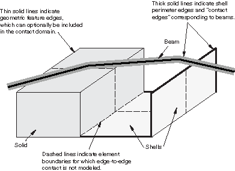
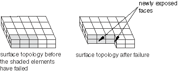

# 36.4.1 在Abaqus/Explicit中定义一般接触相互作用


**产品：** Abaqus/Explicit  Abaqus/CAE

##### **参考**

- ["接触相互作用分析概述，" 第36.1.1节"](pt09ch36s01abo33.md)
- [*CONTACT*](../key/key-link.md#usb-kws-hcontact)
- [*CONTACT INCLUSIONS*](../key/key-link.md#usb-kws-hcontactinclusions)
- [*CONTACT EXCLUSIONS*](../key/key-link.md#usb-kws-hcontactexclusions)
- ["定义一般接触，" Abaqus/CAE用户指南第15.13.1节"](../usi/usi-link.md#usi-itn-help-general)

### 概述

Abaqus/Explicit提供了两种用于建模接触和相互作用问题的算法：一般接触算法和接触对算法。关于这两种算法的比较，请参阅["接触相互作用分析概述，" 第36.1.1节"](pt09ch36s01abo33.md)。本节描述如何在Abaqus/Explicit分析中包含一般接触，如何指定可能参与一般接触相互作用的模型区域，以及如何从一般接触分析获取输出。

Abaqus/Explicit中的一般接触算法：
- 被指定为模型或历史定义的一部分；
- 允许非常简单的接触定义，对所涉及表面类型的限制很少；
- 使用复杂的跟踪算法以确保有效地施加适当的接触条件；
- 可以同时与接触对算法一起使用（即，一些相互作用可以用一般接触算法建模，而其他用接触对算法建模）；
- 只能与三维表面一起使用；
- 只能用于力学有限滑动接触分析；和
- 不支持运动约束施加（接触约束使用惩罚方法施加）。

### 定义一般接触相互作用

一般接触相互作用的定义包括指定：
- 一般接触算法和定义接触域（即相互作用的表面），如本节所述；
- 接触表面属性（["为Abaqus/Explicit中的一般接触分配表面属性，" 第36.4.2节"](pt09ch36s04aus156.md)）；
- 机械接触属性模型（["为Abaqus/Explicit中的一般接触分配接触属性，" 第36.4.3节"](pt09ch36s04aus157.md)）；
- 接触公式（["Abaqus/Explicit中一般接触的接触公式，" 第38.2.1节"](pt09ch38s02aus180.md)）；
- 接触表面之间的初始间隙（["控制Abaqus/Explicit中一般接触的初始接触状态，" 第36.4.4节"](pt09ch36s04aus158.md)）；和
- 算法接触控制（["Abaqus/Explicit中一般接触的接触控制，" 第36.4.5节"](pt09ch36s04aus159.md)）。

### 用于一般接触的表面

一般接触算法在其使用的表面中允许非常一般的特性，如["接触相互作用分析概述，" 第36.1.1节"](pt09ch36s01abo33.md)中所讨论。关于在Abaqus/Explicit中定义用于一般接触算法的表面的详细信息，请参阅["基于单元的表面定义，" 第2.3.2节"](pt01ch02s03aus17.md)；["基于节点的表面定义，" 第2.3.3节"](pt01ch02s03aus18.md)；["解析刚性表面定义，" 第2.3.4节"](pt01ch02s03aus19.md)；["欧拉表面定义，" 第2.3.5节"](pt01ch02s03aus20.md)；和["表面操作，" 第2.3.6节"](pt01ch02s03aus21.md)。二维表面不能用于一般接触算法。

指定接触域的方便方法是使用裁剪表面。此类表面可用于通过使用在原始配置中封闭在指定矩形盒中的接触域来执行"盒中接触"。有关更多信息，请参阅["表面操作，" 第2.3.6节"](pt01ch02s03aus21.md)。

此外，Abaqus/Explicit自动定义一个全包容表面，这对于规定接触域很方便，如本节后面所述。全包容自动定义的表面包括所有基于单元的表面面元以及所有解析刚性表面和所有欧拉材料上的表面。

一般接触算法产生接触力以抵抗节点-面、节点-解析刚性表面和边缘-边缘接触穿透。施加接触的主要机制是节点-面接触（接触对算法中使用的唯一机制）。如果接触域中存在解析刚性表面，一般接触算法也施加节点-解析刚性表面接触。

#### 边缘-边缘接触的考虑

一般接触算法也考虑边缘-边缘接触，这在施加不能被检测为节点穿透面的接触时非常有效。例如，梁段和壳周缘边缘之间的接触（见[图36.4.1-1](pt09ch36s04aus155.md#cont-domain-fig)）通常仅被检测为边缘-边缘接触。

**图36.4.1-1** 包括边缘-边缘接触的一般接触域。



术语"接触边缘"指的是表面面元的特征边缘（壳和实体上的）以及表示梁和桁架单元的线段。表示梁和桁架单元的接触边缘具有圆形横截面，而不管梁或桁架单元的实际横截面如何。表示桁架单元的接触边缘的半径由桁架截面定义上指定的横截面积导出（它等于具有等效横截面积的实心圆截面的半径）。对于具有圆形横截面的梁，接触边缘的半径等效于截面半径。对于具有非圆形横截面的梁，接触边缘的半径等于围绕截面外接圆的半径。如果连接的边缘具有不同的半径，则首先计算节点半径作为相邻接触边缘的最小半径，并且边缘横截面的半径从节点值在线性接触边缘长度上线性插值。壳单元边缘反映法向方向的壳厚度，并且不延伸超过周缘（类似于壳节点和面元）。对于节点-面元和边缘-边缘接触，几何特征都有一些数值平滑。

要为非圆柱形的边缘建模接触，可以使用基于表面的绑定约束将表面单元连接到边缘节点，并且可以在表面单元之间定义节点-面接触（见["表面单元，" 第32.7.1节"](pt06ch32s07alm52.md)）。该技术对于建模对接触定义重要但未使用底层单元几何建模的几何细节很有用。表面单元也可以围绕Abaqus减少了接触厚度的壳单元定义（即如果厚度超过表面面元边缘长度或对角线长度），以便可以建模真实的表面厚度。但是，将表面单元与一般接触一起使用需要与表面单元节点相关联的合理物理质量，并且必须注意不要在将质量从底层单元转移到表面单元时改变整体质量属性。

默认情况下，当表面用于一般接触相互作用时，所有适用的面元、解析刚性表面、节点、周缘边缘以及梁和桁架段都包含在接触定义中。您可以控制哪些特征边缘被考虑用于边缘-边缘接触，如["为Abaqus/Explicit中的一般接触分配表面属性，" 第36.4.2节"](pt09ch36s04aus156.md)中所讨论。几何特征边缘和周缘边缘不必明确包含在表面定义中（通过使用边缘标识符）以便考虑用于边缘-边缘接触。

#### 欧拉-拉格朗日接触

一般接触算法也施加欧拉材料与拉格朗日表面之间的接触。该算法自动补偿网格尺寸差异，以防止欧拉材料穿透拉格朗日表面。Abaqus/Explicit定义的全包容表面可用于施加模型中所有欧拉材料与所有拉格朗日实体之间的接触；您也可以在接触域中指定单个欧拉表面（见["欧拉表面定义，" 第2.3.5节"](pt01ch02s03aus20.md)）。欧拉-拉格朗日接触仅对在实体和壳单元上定义的拉格朗日表面施加。其他表面类型（如梁边缘和解析刚性表面）被忽略。欧拉材料之间的接触相互作用以及由于欧拉材料自接触而产生的相互作用由欧拉公式自然处理；这些相互作用不需要一般接触定义。有关更多信息，请参阅["欧拉分析中的相互作用，" 第14.1.1节"](pt04ch14s01aus90.md#usb-anl-aeuleriananal-int)。

#### 涉及DEM或SPH粒子的接触

一般接触算法施加以下类型的涉及DEM或SPH粒子的接触：
- DEM或SPH粒子与其他拉格朗日表面之间的接触；和
- DEM粒子之间的接触。

 有关涉及DEM和SPH粒子的接触的更多信息，请分别参阅["离散元方法，" 第15.1.1节"](pt04ch15s01aus94.md)和["光滑粒子流体动力学，" 第15.2.1节"](pt04ch15s02aus95.md)。

### 在分析中包含一般接触

如果步骤中没有出现一般接触定义，则前一步中活动的任何一般接触定义将被传播到当前步骤。

为方便起见，一般接触可以定义为模型数据。指定为模型数据的一般接触定义被认为是定义在分析的初始步骤或"步骤0"中；它可以在步骤1或后续步骤中修改或移除。

| **输入文件用法：** | 使用以下选项指示一般接触定义的开头： |
| --- | --- |
| | ``` [*CONTACT*](../key/key-link.md#usb-kws-hcontact) ``` 此选项每个步骤只能出现一次。 |

| **Abaqus/CAE用法：** | 相互作用模块：**创建相互作用**：**一般接触（Explicit）** |
| --- | --- |

#### 移除一般接触定义

您可以移除先前指定的一般接触定义并指定新的定义。

| **输入文件用法：** | ``` [*CONTACT*](../key/key-link.md#usb-kws-hcontact), OP=NEW ``` |
| --- | --- |

| **Abaqus/CAE用法：** | 相互作用模块：相互作用管理器：选择相互作用，**停用** |
| --- | --- |

#### 修改一般接触定义

或者，您可以更改现有的一般接触定义。在这种情况下，现有的一般接触定义保持活动，并且附加的指定信息被追加到一般接触定义中。

接触状态信息（如双侧表面的正确接触法向方向）跨步骤边界传递，即使接触域被修改。

| **输入文件用法：** | ``` [*CONTACT*](../key/key-link.md#usb-kws-hcontact), OP=MOD ``` |
| --- | --- |

| **Abaqus/CAE用法：** | 相互作用模块：相互作用管理器：选择相互作用，**编辑** |
| --- | --- |

##### 示例

修改一般接触定义的各个部分时被独立考虑。例如，在步骤1中指定了以下接触定义（本节后面讨论的各个选项）：

```
[*CONTACT*](../key/key-link.md#usb-kws-hcontact)
[*CONTACT INCLUSIONS*](../key/key-link.md#usb-kws-hcontactinclusions)
surf_1, 
[*CONTACT EXCLUSIONS*](../key/key-link.md#usb-kws-hcontactexclusions)
surf_a, surf_b
```

然后在步骤2中用以下输入修改此接触定义：
```
[*CONTACT*](../key/key-link.md#usb-kws-hcontact), OP=MOD
[*CONTACT INCLUSIONS*](../key/key-link.md#usb-kws-hcontactinclusions)
surf_2, surf_3 
[*CONTACT EXCLUSIONS*](../key/key-link.md#usb-kws-hcontactexclusions)
surf_a, surf_c
```

步骤2的等效接触定义可以指定如下：
```
[*CONTACT*](../key/key-link.md#usb-kws-hcontact), OP=NEW
[*CONTACT INCLUSIONS*](../key/key-link.md#usb-kws-hcontactinclusions)
surf_1,
surf_2, surf_3 
[*CONTACT EXCLUSIONS*](../key/key-link.md#usb-kws-hcontactexclusions)
surf_a, surf_b 
surf_a, surf_c
```

### 定义一般接触域

您通过定义一般接触包含和排除来指定可能彼此接触的模型区域。每个步骤只允许一个接触包含定义和一个接触排除定义。

分析中的所有接触包含首先被施加，然后所有接触排除被施加，无论它们指定的顺序如何。接触排除优先于接触包含。一般接触算法将仅考虑由接触包含定义指定且不由接触排除定义指定的那些相互作用。

一般接触相互作用通常通过指定对Abaqus/Explicit提供的默认自动生成表面的自接触来定义。一般接触算法中使用的所有表面可以跨越多个未连接实体，因此此算法中的自接触不限于单个实体与自身的接触。例如，跨越两个实体的表面的自接触意味着实体之间的接触以及每个实体与其自身的接触。

#### 指定接触包含

定义接触包含以指定应为接触目的考虑的模型区域。

##### 为整个模型指定"自动"接触

您可以为Abaqus/Explicit自动定义的默认未命名全包容表面指定自接触。此默认表面包含，以下述例外为准，模型中所有外部单元面、所有解析刚性表面以及所有基于梁和桁架单元的边缘，以及连接到这些面和边缘的节点；此外，特征边缘根据用户指定的标准被包含（见["为Abaqus/Explicit中的一般接触分配表面属性，" 第36.4.2节"](pt09ch36s04aus156.md)）。这是定义接触域的最简单方法。通过这种方法，为默认表面的节点、面元、解析刚性表面和接触边缘的所有节点-面元、节点-解析刚性表面和边缘-边缘相互作用建模接触。此默认表面不包括以下内容：
- 不能成为基于单元表面一部分的节点；例如，仅连接到点质量或连接器的节点。
- 仅属于内聚单元的面、边缘和节点。实际上，此默认表面的生成就好像内聚元素不存在一样。有关与内聚单元相关的接触建模问题的进一步讨论，请参阅["使用内聚单元建模，" 第32.5.3节"](pt06ch32s05alm42.md)。

| **输入文件用法：** | 使用以下两个选项为整个模型指定"自动"接触： |
| --- | --- |
| | ``` [*CONTACT*](../key/key-link.md#usb-kws-hcontact) [*CONTACT INCLUSIONS*](../key/key-link.md#usb-kws-hcontactinclusions), ALL EXTERIOR ``` 当使用ALL EXTERIOR参数时，[*CONTACT INCLUSIONS*](../key/key-link.md#usb-kws-hcontactinclusions)选项不应有数据行。 |

| **Abaqus/CAE用法：** | 相互作用模块：**创建相互作用**：**一般接触（Explicit）**：**包含的表面对：全部*与自接触** |
| --- | --- |

##### 指定单个接触相互作用

或者，您可以通过指定单个接触表面对来直接定义一般接触域。仅当中对中指定的两个表面重叠（或相同）时，才会对自接触建模，并且仅在重叠区域中建模。

多个表面对可以包含在接触域中。每对中至少有一个表面必须是基于单元的表面或解析刚性表面。

| **输入文件用法：** | 使用以下两个选项指定单个接触相互作用： |
| --- | --- |
| | ``` [*CONTACT*](../key/key-link.md#usb-kws-hcontact) [*CONTACT INCLUSIONS*](../key/key-link.md#usb-kws-hcontactinclusions) *surface_1*, *surface_2* ``` 当省略ALL EXTERIOR参数时，必须指定至少一个数据行。两个数据行条目中的任何一个都可以留空，但每个数据行必须至少包含一个逗号；将为空数据行发出错误消息。如果省略第一个表面名称，则假定为默认未命名、全包容、自动生成的表面。如果省略第二个表面名称或与第一个表面名称相同，则假定为第一个表面与其自身的接触。将两个数据行条目留空等效于使用ALL EXTERIOR参数。 |

| **Abaqus/CAE用法：** | 相互作用模块：**创建相互作用**：**一般接触（Explicit）**：**包含的表面对：所选表面对**：**编辑**：在左侧列中选择表面，点击中间的箭头将它们转移到包含对列表 |
| --- | --- |

##### 示例

以下输入指定应在默认全包容自动生成的表面与*surface_2*之间施加接触，包括任何重叠区域中的自接触：

```
[*CONTACT*](../key/key-link.md#usb-kws-hcontact)
[*CONTACT INCLUSIONS*](../key/key-link.md#usb-kws-hcontactinclusions)
 , *surface_2*
```

以下任一方法可用于定义*surface_1*的自接触：
```
[*CONTACT*](../key/key-link.md#usb-kws-hcontact)
[*CONTACT INCLUSIONS*](../key/key-link.md#usb-kws-hcontactinclusions)
*surface_1*, 
```

或
```
[*CONTACT*](../key/key-link.md#usb-kws-hcontact)
[*CONTACT INCLUSIONS*](../key/key-link.md#usb-kws-hcontactinclusions)
*surface_1*, *surface_1*
```

以下输入可用于将包含点质量的基于节点的表面引入接触域，并指定对默认全包容自动生成的表面的自接触：
```
[*CONTACT*](../key/key-link.md#usb-kws-hcontact)
[*CONTACT INCLUSIONS*](../key/key-link.md#usb-kws-hcontactinclusions)
 ,
 , node_based_surf
```

#### 指定接触排除

您可以通过指定要从接触中排除的模型区域来细化接触域定义。

指定接触排除的主要动机是避免物理上不合理的接触相互作用。例如，有限元模型可能包含多个成型工具，但并非所有工具同时参与成型过程；您可以指定接触排除以防止某些工具在某些步骤中参与接触模型。

您不需要担心为不太可能相互作用的模型部分指定接触排除，因为这些排除通常对计算性能的影响最小。

将为所有指定的表面对忽略接触，即使这些相互作用在接触包含定义中直接或间接指定。

多个表面对可以从接触域中排除。每对中至少有一个表面必须是基于单元的表面或解析刚性表面。请记住，表面可以定义为跨越多个未连接实体，因此自接触排除不限于单实体接触的排除。

您不能仅排除类壳表面的一侧。如果在定义基于单元的类壳表面时使用了侧面标识符（SPOS或SNEG），并且该表面被排除在接触之外，Abaqus/Explicit将排除与这些单元关联的所有面。

| **输入文件用法：** | 使用以下两个选项指定接触排除： |
| --- | --- |
| | ``` [*CONTACT*](../key/key-link.md#usb-kws-hcontact) [*CONTACT EXCLUSIONS*](../key/key-link.md#usb-kws-hcontactexclusions) *surface_1*, *surface_2* ``` 两个数据行条目中的任何一个都可以留空。如果省略第一个表面名称，则假定为默认未命名、全包容、自动生成的表面。如果省略第二个表面名称或与第一个表面名称相同，则排除第一个表面与其自身的接触。 |

| **Abaqus/CAE用法：** | 相互作用模块：**创建相互作用**：**一般接触（Explicit）**：**排除的表面对**：**编辑**：在左侧列中选择表面，点击中间的箭头将它们转移到排除对列表 |
| --- | --- |

##### 自动生成的接触排除

在某些情况下，Abaqus/Explicit自动为一般接触生成接触排除。
- 接触排除自动为使用接触对算法或基于表面的绑定约束定义的相互作用生成，以避免这些相互作用约束的冗余（可能不一致）施加。例如，如果为`surface_1`和`surface_2`定义了接触对，并且为整个模型定义了"自动"一般接触，则Abaqus/Explicit将为`surface_1`和`surface_2`之间的一般接触生成接触排除，以便这些表面之间的相互作用仅使用接触对算法建模。这些自动生成的接触排除仅在接触对算法或基于表面的绑定约束相互作用活动的步骤中有效。
- Abaqus/Explicit自动为模型中每个刚体的自接触生成接触排除，因为刚体不可能与自身接触。
- 当您为特定一般接触表面对指定纯主-从接触表面 weighting时，自动生成与指定相反的主-从 orientation的接触排除（有关此类接触排除的更多信息，请参阅["Abaqus/Explicit中一般接触的接触公式，" 第38.2.1节"](pt09ch38s02aus180.md)）。
- 一般接触算法，与接触对算法不同，基于底层单元的失效状态在接触域中激活和停用接触面和接触边缘。见下面的["建模表面侵蚀"](pt09ch36s04aus155.md#usb-cni-acontactgeneral-domain-surfaceerosion)"了解更多详情。

##### 示例

以下输入指定接触域基于全包容自动生成表面的自接触，但应忽略全包容自动生成的表面与*surface_2*之间的接触（包括任何重叠区域中的自接触）：

```
[*CONTACT*](../key/key-link.md#usb-kws-hcontact)
[*CONTACT INCLUSIONS*](../key/key-link.md#usb-kws-hcontactinclusions), ALL EXTERIOR
[*CONTACT EXCLUSIONS*](../key/key-link.md#usb-kws-hcontactexclusions)
 , *surface_2*
```

以下任一方法可用于从接触域中排除*surface_1*的自接触：

```
[*CONTACT EXCLUSIONS*](../key/key-link.md#usb-kws-hcontactexclusions)
*surface_1*,
```

或
```
[*CONTACT EXCLUSIONS*](../key/key-link.md#usb-kws-hcontactexclusions)
*surface_1*, *surface_1*
```

#### 建模表面侵蚀

一般接触允许使用基于单元的表面来建模分析中的表面侵蚀。如果定义了适当的"内部"表面，表面拓扑将演变以匹配未失效单元的外部。或者，如果只有一个实体可以侵蚀，可以使用基于节点的表面来建模表面侵蚀；此方法可以与一般接触或接触对算法一起使用。但是，即使只有一个实体可以侵蚀，也建议为侵蚀实体定义基于单元的表面，以避免基于节点表面的常见限制（见["基于节点的表面定义，" 第2.3.3节"](pt01ch02s03aus18.md)）。

一般接触算法基于底层单元的失效状态修改在接触域中活动的接触面和接触边缘列表（单元失效在["动态失效模型，" 第23.2.8节"](pt05ch23s02abm24.md)中讨论）。一般接触仅在其底层单元未失效且与未失效相邻单元的面不重合时才考虑面；因此，外部面最初是活动的，内部面最初是非活动的。一旦单元失效，其面从接触域中移除，并且任何已暴露的内部面被激活。当包含边缘的所有单元失效时，接触边缘被移除。随着单元侵蚀，不会创建新的接触边缘。基于此算法，活动接触域在分析过程中随着单元失效而演变（关于侵蚀实体的示例，请参见[图36.4.1-2](pt09ch36s04aus155.md#general-contact-erosion)）。

**图36.4.1-2** 侵蚀接触表面的拓扑。



您可以控制所有周围单元失效后接触节点是否保留在接触域中。默认情况下，这些节点保留在接触域中，并充当可以与仍属于接触域的面接触的自由浮点质量。您可以指定基于单元的表面的节点应在所有连接到的接触面和接触边缘侵蚀后侵蚀（即从接触域中移除）。有关此技术的进一步讨论，包括节点侵蚀的原因和理由，请参阅["Abaqus/Explicit中一般接触的接触控制，" 第36.4.5节"](pt09ch36s04aus159.md)。

##### 指定在实体单元上定义的表面的侵蚀

对于由可能失效的单元组成的实体单元网格，每个可能参与接触的面（外部和内部面）都应包含在接触域中。一般接触算法将在单元失效时根据需要激活和停用面。

例如，您定义一个包含模型中所有引用材料失效模型的实体单元的元素集`ELERODE`。首先，您必须创建一个包含这些单元所有内部和外部面的表面`SURFERODE`。您可以使用Abaqus/Explicit中的自动自由表面和内部表面生成方法来定义此表面。假设`ELERODE`中的所有单元都是C3D8R类型，您也可以通过直接指定面S1到S6来定义表面。请参阅["在实体、连续壳和内聚单元上创建表面" in "基于单元的表面定义，" 第2.3.2节"](pt01ch02s03aus17.md#usb-int-adeformablesurf-solid)，了解这三种方法的讨论。

接下来，您必须构建接触域。为整个模型定义"自动"一般接触是不够的，因为使用此方法创建的接触域不包含任何内部面。因此，您必须在接触包含定义中明确指定与可侵蚀表面的成对相互作用，如[表36.4.1-1](pt09ch36s04aus155.md#usb-cni-acontactgeneral-inctable)中所述。

**表36.4.1-1** 接触包含定义。
| 接触包含 | 输入文件语法 | Abaqus/CAE语法 |
| --- | --- | --- |
| 对默认全包容表面的自接触指定模型中每个外部面之间的接触 | ` , ` | 第一表面：（全部*）第二表面：（自） |
| 默认全包容表面与`SURFERODE`之间的接触指定每个外部面与`SURFERODE`之间的接触 | ` , SURFERODE` | 第一表面：（全部*）第二表面：SURFERODE |
| 对`SURFERODE`的自接触指定侵蚀实体之间的自接触 | `SURFERODE,` | 第一表面：SURFERODE第二表面：（自） |

或者，您可以通过首先定义一个名为`SURFALL`的表面来创建相同接触域的更简洁定义，该表面包括整个模型中的所有外部面和元素集`ELERODE`的所有内部面。在这种情况下，由于接触域中的所有面（外部和内部）在一个表面中定义，因此无需在外部和内部面之间明确指定接触。仅指定对`SURFALL`的自接触就足够了。

Abaqus/Explicit自动计算与内部面相关的非零接触厚度，该厚度基于单元尺寸，此默认值不能通过表面属性分配更改。

##### 指定在结构单元上定义的表面的侵蚀

对于结构单元，一般接触算法检查面（或梁和桁架单元上的"接触边缘"）的底层单元是否失效。一旦底层单元失效，面就被移除。与实体一样，结构单元上的特征边缘一旦所有周围面失效就被移除。周缘边缘（例如，壳单元网格周缘上的）一旦连接到的面失效就被移除。不会创建新的周缘边缘来符合面移除产生的新周缘。

##### 内存使用

用于描述表面拓扑的接触数据量与包含在接触域中的面数量成正比。与仅使用外部面定义接触域的分析相比，在接触域中包含大量内部面可能会显著增加内存使用。考虑在具有每侧*n*个单元的C3D8R单元立方体网格上创建表面。仅包含网格外部面的表面（适合在没有单元失效的情况下建模接触）将包含6*n*2个单元面。同时包含网格外部和内部面的表面（适合对网格中每个单元具有单元失效的接触建模）将包含6*n*3个单元面。对于大型网格，当在接触域中包含内部单元面以建模侵蚀时，内存使用容易增加一个数量级。因此，建议仅将可能参与接触的那些内部单元面包含在接触域中。

### 输出

组成一般接触域的表面除了接触分析输出变量外还可作为输出。

#### 一般接触域和组件表面

当定义一般接触域时，Abaqus/Explicit生成以下内部表面：
- `General_Contact_Faces_Step*k*`，
- `General_Contact_Edges_Step*k*`，和
- `General_Contact_Nodes_Step*k*`，

其中`*k*`是步骤编号。`General_Contact_Nodes_Step*k*`仅包含一般接触域中不在其他两个表面中的节点。例如，`General_Contact_Faces_Step2`将包含在步骤2的初始包含在一般接触域中的所有表面面（内部和外部）。这些表面包含在步骤开始时包含在接触域中的接触面、边缘和节点，并且不被修改以反映表面侵蚀。

Abaqus/Explicit还生成与"组件表面"关联的以下内部表面：
- `General_Contact_Faces_Step*k*_Comp*m*`和
- `General_Contact_Edges_Step*k*_Comp`*m*，

其中*m*是自动分配的"组件编号"。每个特征边缘组件表面`General_Contact_Edges_Step*k*_Comp*m*`具有相应面组件表面`General_Contact_Faces_*k*_Comp*k*`的面边缘子集（满足特征边缘标准）。面组件表面彼此之间没有公共节点。

内部表面可以使用Abaqus/CAE Visualization模块中的显示组查看（请参阅[Abaqus/CAE用户指南](../usi/usi-link.md#usi)）。Abaqus/Explicit使用的内部表面名称不应出现在输入文件中。

#### 一般接触输出变量

您可以将与一般接触相互作用相关的接触表面变量写入Abaqus输出数据库（`.odb`）文件（请参阅["Abaqus/Standard和Abaqus/Explicit中的表面输出" in "输出到输出数据库，" 第4.1.3节"](pt02ch04s01aus40.md#usb-out-odboutput-surface)，了解更多相关信息）。可用变量包括接触压力、法向接触力、摩擦力和整个表面结果量（即力、力矩、压力中心和接触总面积）。

##### 场输出

通用变量CSTRESS和CFORCE对于Abaqus/Explicit中的一般接触是有效的场输出请求。如果为一般接触域请求CSTRESS，则变量CPRESS（接触压力）可以在Abaqus/CAE中绘制等值线。如果为一般接触域请求CFORCE，则变量CNORMF（法向接触力）和CSHEARF（剪切接触力）可以在Abaqus/CAE中作为矢量符号图绘制。

对于一般接触，CPRESS计算为净接触法向力（CNORMF矢量）除以单位面积的大小（这是一个无符号值）。此报告接触压力的约定与用于接触对的约定不同。可以通过检查CNORMF的图来确定一般接触的净接触压力的作用方向。

CNORMF和CSHEARF是合力结果量。如果双侧表面在两侧都被接触，合力是表面每侧力的向量和（例如，对于被夹持在表面每侧具有大小相等方向相反的力的双侧表面，接触法向力将为零）。

##### 历史输出

有几个整个表面接触力派生变量可作为历史输出。您可以指定将从中计算接触力合力的表面。

由于一般接触在表面上产生的力分布用于计算表面力合力；接触对相互作用产生的力不包括在内，必须单独输出。表面的接触状态作为相对于原点的力（CFN、CFS和CFT）和力矩（CMN、CMS和CMT）合力输出。其他变量给出表面上力的中心（XN、XS和XT）（定义为表面上最接近表面质心的点，该点位于其合力的作用线上，对于该合力产生的合力矩最小）。每个变量名称的最后一个字母表示使用表面上哪个接触力分布来计算合力：字母N表示使用法向接触力来推导结果量；字母S表示使用剪切接触力来推导结果量；字母T表示使用法向和剪切接触力的总和来推导结果量。

每个总力矩输出变量不一定等于各个力中心向量与合力向量的叉乘。作用在表面两个不同节点上的力可能具有沿相反方向作用的分量，使得这些节点力分量产生净力矩但不产生净力；因此，总力矩可能并非完全源于合力。当表面节点力大致沿同一方向作用时，力中心输出变量最有意义。

可以使用输出变量CAREA请求给定时刻的接触总面积，定义为所有存在接触力的面元之和。CAREA报告的接触面积通常略大于合理网格化接触表面的真实接触面积；因此，应谨慎解释CAREA。CAREA输出与真实接触面积之间的差异随着网格密度增加而减小。在某些情况下，使用接触包含或排除将CAREA输出限制为较小的接触表面也可以减少差异。由于CAREA输出是真实接触面积的近似值，使用此输出推导力或应力值可能不会产生准确值；直接请求接触力和应力是获得准确结果的最合适方式。

#### 建模表面侵蚀时请求单元输出

在建模表面侵蚀时，请求单元场输出（输出变量STATUS）的附加元素输出很有用。然后可以在Abaqus/CAE的Visualization模块中从显示组中排除失效单元（单元状态为零），以便可以识别活动接触表面并查看活动接触表面上的接触结果。


