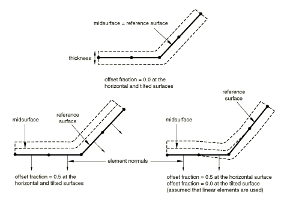

# 36.4.2 为Abaqus/Explicit中的一般接触分配表面属性


**产品：** Abaqus/Explicit  Abaqus/CAE

##### **参考**

- ["在Abaqus/Explicit中定义一般接触相互作用，" 第36.4.1节"](pt09ch36s04aus155.md)
- [*CONTACT*](../key/key-link.md#usb-kws-hcontact)
- [*SURFACE PROPERTY ASSIGNMENT*](../key/key-link.md#usb-kws-hsurfpropassign)
- ["为一般接触指定表面属性分配，" Abaqus/CAE用户指南第15.13.5节"](../usi/usi-link.md#usi-itn-help-general-surfprop)

### 概述

表面属性分配：
- 可用于更改基于结构单元的表面区域的接触厚度，或为基于实体单元的表面区域添加接触厚度；
- 可用于指定基于壳、膜、刚性和表面单元的表面区域的表面偏移；
- 可用于指定模型中哪些边缘应包含在一般接触域中；
- 可用于指定表面区域的几何校正；
- 可选择性地应用于一般接触域内的特定区域；和
- 不能应用于解析刚性表面。

### 分配表面属性

您可以为参与一般接触相互作用的表面分配非默认表面属性。这些属性仅在表面参与一般接触相互作用时才被考虑；当表面参与其他相互作用（如接触对）时不被考虑。一般接触算法不考虑作为表面定义一部分指定的表面属性。

表面属性分配在一般接触相互作用活动的所有分析步骤中传播。

用于指定具有非默认表面属性的区域的表面名称不必与用于指定一般接触域的表面名称对应。在许多情况下，接触相互作用将为大域定义，而将非默认表面属性分配给该域的子集。任何落在一般接触域之外的区域的表面属性分配将被忽略。如果指定区域重叠，最后分配优先。

| **输入文件用法：** | ``` [*SURFACE PROPERTY ASSIGNMENT*](../key/key-link.md#usb-kws-hsurfpropassign), PROPERTY ``` |
| --- | --- |
| | 此选项必须与[*CONTACT*](../key/key-link.md#usb-kws-hcontact)选项结合使用；对于下面讨论的PROPERTY参数的每个值，每个步骤最多应出现一次；数据行可以根据需要重复，以将表面属性分配给不同区域。 |

| **Abaqus/CAE用法：** | 相互作用模块：**创建相互作用**：**一般接触（Explicit）**：**表面属性** |
| --- | --- |

### 表面厚度

节点表面厚度的默认计算（详见下文）适用于大多数分析；一个例外是板材成型分析，其中板材的变薄显著影响接触。这种情况可以通过指定应使用递减的父单元厚度来建模。作为第三个替代方案，您可以指定表面厚度的值。可以为实体单元表面分配非零厚度；例如，对有限厚度表面涂层的影响建模。["基于单元的表面定义，" 第2.3.2节"](pt01ch02s03aus17.md)包含关于表面厚度空间变化的信息。

指定原始或递减厚度会导致基于节点的表面的零厚度；您可以为与一般接触算法一起使用的基于节点的表面指定非零厚度（接触对算法将不考虑此类表面的非零厚度）。

一般接触算法要求接触厚度不超过表面面元边缘长度或对角线长度的某个分数。此分数通常根据单元几何在20%到60%之间变化。一般接触算法将在必要时自动缩减接触厚度，而不影响底层单元的单元计算中使用的厚度。如果执行了此类缩减，状态（`.sta`）文件中会提供诊断信息。

要绕过此厚度限制，可以使用表面单元对接触表面进行建模（见["表面单元，" 第32.7.1节"](pt06ch32s07alm52.md)）。表面单元必须使用基于表面的绑定约束连接到底层单元（见["网格绑定约束，" 第35.3.1节"](pt08ch35s03aus132.md)），并且必须为表面单元关联合理的物理质量。这需要将大部分质量转移到表面单元，而不会明显改变整体质量属性。或者，可以使用接触控制设置来限制厚度缩减检查（见["Abaqus/Explicit中一般接触的接触控制，" 第36.4.5节"](pt09ch36s04aus159.md))。

一般接触算法默认避免接触对算法（见["为Abaqus/Explicit中的接触对分配表面属性，" 第36.5.2节"](pt09ch36s05aus161.md))在壳周缘处发生的"牛鼻"效应。壳单元边缘、节点和面元仅在法线方向反映壳厚度，不延伸超过周缘。接触控制设置可用于关闭牛鼻预防检查（见["Abaqus/Explicit中一般接触的接触控制，" 第36.4.5节"](pt09ch36s04aus159.md))。

#### 使用原始父单元厚度

默认情况下，基于壳、膜或刚性单元的表面的节点厚度等于周围单元的最小原始厚度（见[图36.4.2-1](pt09ch36s04aus156.md#agendefsurf-cont-thick1)和[表36.4.2-1](pt09ch36s04aus156.md#table-agendefsurf-thick1)）。

**图36.4.2-1** 表面厚度在面元边界之间的连续变化。


**表36.4.2-1** 对应于[图36.4.2-1](pt09ch36s04aus156.md#agendefsurf-cont-thick1)的厚度。
| 节点 | 单元 | 指定的单元厚度 | 节点表面厚度（相邻单元厚度的最小值） |
| --- | --- | --- | --- |
| 1 |  |  | 0.5 |
|  | a | 0.5 |  |
| 2 |  |  | 0.5 |
|  | b | 0.5 |  |
| 3 |  |  | 0.5 |
|  | c | 0.9 |  |
| 4 |  |  | 0.9 |
|  | d | 0.9 |  |
| 5 |  |  | 0.9 |

面元内的表面厚度从节点值插值；插值的表面厚度永远不会超过指定的单元或节点厚度，这可能对初始过闭合很重要。对于基于实体单元的表面区域，默认节点表面厚度为零。如果为底层单元定义了空间变化的节点厚度（见["节点厚度，" 第2.1.3节"](pt01ch02s01aus07.md)），节点表面厚度可能不完全对应于指定的节点厚度（见[图36.4.2-2](pt09ch36s04aus156.md#agendefsurf-cont-thick2)中的节点4和[表36.4.2-2](pt09ch36s04aus156.md#table-agendefsurf-thick2)）。

**图36.4.2-2** 节点表面厚度与指定节点厚度之间的小差异。


**表36.4.2-2** 对应于[图36.4.2-2](pt09ch36s04aus156.md#agendefsurf-cont-thick2)的厚度。
| 节点 | 单元 | 指定的节点厚度 | 单元厚度（指定节点厚度的平均值） | 节点表面厚度（相邻单元厚度的最小值） |
| --- | --- | --- | --- | --- |
| 1 |  | 0.5 |  | 0.5 |
|  | a |  | 0.5 |  |
| 2 |  | 0.5 |  | 0.5 |
|  | b |  | 0.5 |  |
| 3 |  | 0.5 |  | 0.5 |
|  | c |  | 0.7 |  |
| 4 |  | 0.9 |  | 0.7 |
|  | d |  | 0.9 |  |
| 5 |  | 0.9 |  | 0.9 |
|  | e |  | 0.9 |  |
| 6 |  | 0.9 |  | 0.9 |

节点表面厚度分布往往比指定的节点厚度分布更扩散（因为指定的节点厚度被平均以计算单元厚度，而节点表面厚度是周围单元厚度的最小值）。

| **输入文件用法：** | ``` [*SURFACE PROPERTY ASSIGNMENT*](../key/key-link.md#usb-kws-hsurfpropassign), PROPERTY=THICKNESS *surface*, ORIGINAL（默认） ``` |
| --- | --- |
| | 如果省略表面名称，则假定为包含整个一般接触域的默认表面。 |

| **Abaqus/CAE用法：** | 相互作用模块：**创建相互作用**：**一般接触（Explicit）**：**表面属性**：**壳/膜厚度分配**：**编辑**：选择表面，点击箭头将表面转移到厚度分配列表，并在**厚度**列中输入ORIGINAL。 |
| --- | --- |

#### 使用递减的父单元厚度

如果您指定应使用递减的父单元厚度，则仅父单元厚度的减少反映在接触表面厚度中；如果父单元厚度在分析期间实际上增加，接触厚度将保持不变。

| **输入文件用法：** | ``` [*SURFACE PROPERTY ASSIGNMENT*](../key/key-link.md#usb-kws-hsurfpropassign), PROPERTY=THICKNESS *surface*, THINNING ``` |
| --- | --- |
| | 如果省略表面名称，则假定为包含整个一般接触域的默认表面。 |

| **Abaqus/CAE用法：** | 相互作用模块：**创建相互作用**：**一般接触（Explicit）**：**表面属性**：**壳/膜厚度分配**：**编辑**：选择表面，点击箭头将表面转移到厚度分配列表，并在**厚度**列中输入THINNING。 |
| --- | --- |

#### 指定表面厚度的值

您可以直接指定表面厚度值。

| **输入文件用法：** | ``` [*SURFACE PROPERTY ASSIGNMENT*](../key/key-link.md#usb-kws-hsurfpropassign), PROPERTY=THICKNESS *surface*, *value* ``` |
| --- | --- |
| | 如果省略表面名称，则假定为包含整个一般接触域的默认表面。 |

| **Abaqus/CAE用法：** | 相互作用模块：**创建相互作用**：**一般接触（Explicit）**：**表面属性**：**壳/膜厚度分配**：**编辑**：选择表面，点击箭头将表面转移到厚度分配列表，并在**厚度**列中输入表面厚度幅值。 |
| --- | --- |

#### 对表面厚度应用缩放因子

您可以对任何表面厚度值应用缩放因子。例如，如果您指定递减的父单元厚度应用于`surf1`并应用0.5的缩放因子，则当`surf1`参与一般接触相互作用时，将使用递减父单元厚度一半的值（包含在一般接触域中的所有其他表面将使用默认原始父单元厚度）。以这种方式缩放表面厚度可以在某些情况下避免初始过闭合。Abaqus/Explicit将自动调整表面位置以解决初始过闭合（见["控制Abaqus/Explicit中一般接触的初始接触状态，" 第36.4.4节"](pt09ch36s04aus158.md)）。但是，如果节点位置调整不可取（例如，如果它们会在原本平坦的部分中引入缺陷，导致不现实的屈曲模式），您可能更愿意减少表面厚度并完全避免过闭合。

| **输入文件用法：** | ``` [*SURFACE PROPERTY ASSIGNMENT*](../key/key-link.md#usb-kws-hsurfpropassign), PROPERTY=THICKNESS *surface*, *value or label*, *scale_factor* ``` |
| --- | --- |
| | 如果省略表面名称，则假定为包含整个一般接触域的默认表面。 |

| **Abaqus/CAE用法：** | 相互作用模块：**创建相互作用**：**一般接触（Explicit）**：**表面属性**：**壳/膜厚度分配**：**编辑**：选择表面，点击箭头将表面转移到厚度分配列表，并输入**缩放因子**。 |
| --- | --- |

### 表面偏移

表面偏移是薄体中面与其参考平面（由节点坐标和单元连接定义）之间的距离。它通过将偏移分数（指定为表面厚度的分数）乘以表面厚度和单元面元法向来计算。这定义了中面的位置，从而定义了物体相对于参考表面的位置；参考表面上的节点坐标不会被修改。表面偏移只能为基于壳和类似单元的表面指定（即膜、刚性和表面单元）。为其他单元（如实体或梁单元）指定的表面偏移将被忽略。默认情况下，单元截面定义中指定的表面偏移将用于一般接触算法。

每个节点的表面偏移是该节点所连接面的最大和最小偏移的平均值。面元内点的偏移从节点值插值。[图36.4.2-3](pt09ch36s04aus156.md#surface-offsets)显示了一些关于接触表面相对于各种表面偏移组合的参考表面定位的示例。一般接触算法中使用的表面偏移被限制在厚度的0.5到0.5之间。

您可以将表面偏移指定为表面厚度的分数。表面偏移分数可以设置为等于用于表面父单元的偏移分数或指定值。为一般接触指定的表面偏移不会改变单元积分。

**图36.4.2-3** 为一般接触指定表面偏移。



| **输入文件用法：** | 使用以下选项使用来自表面父单元的表面偏移分数（默认）： |
| --- | --- |
| | ``` [*SURFACE PROPERTY ASSIGNMENT*](../key/key-link.md#usb-kws-hsurfpropassign), PROPERTY=OFFSET FRACTION *surface*, ORIGINAL ``` 使用以下选项指定表面偏移分数的值： ``` [*SURFACE PROPERTY ASSIGNMENT*](../key/key-link.md#usb-kws-hsurfpropassign), PROPERTY=OFFSET FRACTION *surface*, *offset* ``` 偏移可以指定为值或标签（SPOS或SNEG）。指定SPOS等效于指定值0.5；指定SNEG等效于指定值0.5。 |

| **Abaqus/CAE用法：** | 相互作用模块：**创建相互作用**：**一般接触（Explicit）**：**表面属性**：**壳/膜偏移分配**：**编辑**：选择表面，点击箭头将表面转移到偏移分配列表。在**偏移分数**列中，输入ORIGINAL以使用来自表面父单元的表面偏移分数，输入SPOS以使用0.5的表面偏移分数，输入SNEG以使用0.5的表面偏移分数，或输入表面偏移分数的值。 |
| --- | --- |

### 特征边缘

模型的几何特征边缘在梁和桁架单元上以及实体和结构单元面的边缘（周缘及其他）上定义。默认情况下，Abaqus/Explicit中一般接触算法中的边缘-边缘接触考虑周缘边缘以及梁和桁架单元的"接触边缘"。

您可以通过指定特征边缘标准来控制应激活哪些特征边缘在一般接触域中。默认情况下，仅激活周缘边缘。特征边缘标准对梁和桁架单元的"边缘"没有影响——它们通过包含在接触域中被激活。

#### 特征角度

特征角度是两个连接到边缘的面元法向之间形成的角度。面元之间的角度基于初始配置。在面元凹面会合处产生负角度；因此，这些边缘从不包含在接触域中。[图36.2.2-1](pt09ch36s04aus156.md#feature-angles)显示了一些关于如何为不同边缘计算特征角度的示例。

**图36.4.2-4** 计算特征角度。


边缘A的特征角度为90°（和之间的角度）；边缘B的特征角度为25°（和之间的角度）。边缘C与三个面元形成T形交叉（[图36.2.2-2](pt09ch36s04aus156.md#t-intersection-angles)中以二维显示）；其特征角度为0°、90°和90°。

**图36.4.2-5** T形交叉的特征角度（例如，[图36.2.2-1](pt09ch36s04aus156.md#feature-angles)中边缘C）。


周缘边缘（例如，[图36.2.2-1](pt09ch36s04aus156.md#feature-angles)中边缘D）可以被认为是特征角度为180°的特殊类型的特征边缘。

在确定是否应将几何特征边缘激活在一般接触域中时考虑特征角度的符号。例如，如果指定了20°的截止特征角度，边缘A将在接触模型中被激活为特征边缘（因为90° > 20°），但边缘B和C不会被激活：25° < 20°且边缘C的最大特征角度0° < 20°。

[图36.2.2-3](pt09ch36s04aus156.md#feature-edges)进一步说明了特征角度如何用于确定哪些几何特征边缘在一般接触域中被激活。

**图36.4.2-6** 对于20°的截止特征角度，在一般接触域中被激活的特征边缘。


图右侧的表列出了模型中各个边缘的特征角度值。连接到两个以上面元的边缘以及连接到两个壳面元的边缘有多个对应的特征角度。边缘上最大的特征角度与默认或指定的截止特征角度进行比较。例如，如果指定了20°的截止特征角度，边缘A、D和E将被考虑为特征边缘，而边缘B、C和F将被忽略用于边缘-边缘接触。

#### 指定仅应激活周缘边缘

默认情况下，仅周缘边缘被包含在一般接触域中。周缘边缘出现在壳单元的"物理"周缘上，也出现在当身体上暴露面元的子集包含在一般接触域中时出现的"人造"边缘上。当结构单元与连续体单元共享节点时，周缘边缘将不会在结构单元上被激活，因为将它们指定为这样的标准不再满足。

| **输入文件用法：** | ``` [*SURFACE PROPERTY ASSIGNMENT*](../key/key-link.md#usb-kws-hsurfpropassign), PROPERTY=FEATURE EDGE CRITERIA *surface*, PERIMETER EDGES（默认） ``` |
| --- | --- |
| | 如果省略表面名称，则假定为包含整个一般接触域的默认表面。 |

| **Abaqus/CAE用法：** | 相互作用模块：**创建相互作用**：**一般接触（Explicit）**：**表面属性**：**特征边缘标准分配**：**编辑**：选择表面，点击箭头将表面转移到特征分配列表，并在**特征边缘标准**列中输入PERIMETER。 |
| --- | --- |

#### 指定应激活的特定特征边缘

您可以选择表面上特定的特征边缘在域中被激活。包含元素标签和边缘标识符列表的表面（见"基于单元的表面定义"中的"定义基于边缘的表面"，[第2.3.2节"](pt01ch02s03aus17.md)）用于指定要激活的边缘。

| **输入文件用法：** | ``` [*SURFACE PROPERTY ASSIGNMENT*](../key/key-link.md#usb-kws-hsurfpropassign), PROPERTY=FEATURE EDGE CRITERIA *surface*, PICKED EDGES ``` |
| --- | --- |

| **Abaqus/CAE用法：** | 相互作用模块：**创建相互作用**：**一般接触（Explicit）**：**表面属性**：**特征边缘标准分配**：**编辑**：选择表面，点击箭头将表面转移到特征分配列表，并在**特征边缘标准**列中输入PICKED。 |
| --- | --- |

#### 指定应激活所有特征边缘

您可以选择激活给定表面中给定表面中的所有边缘在一般接触域中。这将激活给定表面中指定的所有面的所有边缘。

| **输入文件用法：** | ``` [*SURFACE PROPERTY ASSIGNMENT*](../key/key-link.md#usb-kws-hsurfpropassign), PROPERTY=FEATURE EDGE CRITERIA *surface*, ALL EDGES ``` |
| --- | --- |

| **Abaqus/CAE用法：** | 相互作用模块：**创建相互作用**：**一般接触（Explicit）**：**表面属性**：**特征边缘标准分配**：**编辑**：选择表面，点击箭头将表面转移到特征分配列表，并在**特征边缘标准**列中输入ALL。 |
| --- | --- |

#### 指定应停用所有特征边缘

您可以选择在一般接触域中停用所有特征边缘（包括周缘边缘）。此选项不停用与梁和桁架单元关联的"接触边缘"。

| **输入文件用法：** | ``` [*SURFACE PROPERTY ASSIGNMENT*](../key/key-link.md#usb-kws-hsurfpropassign), PROPERTY=FEATURE EDGE CRITERIA *surface*, NO FEATURE EDGES ``` |
| --- | --- |
| | 如果省略表面名称，则假定为包含整个一般接触域的默认表面。 |

| **Abaqus/CAE用法：** | 相互作用模块：**创建相互作用**：**一般接触（Explicit）**：**表面属性**：**特征边缘标准分配**：**编辑**：选择表面，点击箭头将表面转移到特征分配列表，并在**特征边缘标准**列中输入NONE。 |
| --- | --- |

#### 指定截止特征角度

如果您指定截止特征角度作为特征边缘标准，则周缘边缘和特征角度大于或等于指定角度的几何边缘在一般接触域中被激活。如前所述，您可以根据需要激活其他特征边缘。

| **输入文件用法：** | ``` [*SURFACE PROPERTY ASSIGNMENT*](../key/key-link.md#usb-kws-hsurfpropassign), PROPERTY=FEATURE EDGE CRITERIA *surface*, *feature_angle_value* ``` |
| --- | --- |
| | 如果省略表面名称，则假定为包含整个一般接触域的默认表面。 |

| **Abaqus/CAE用法：** | 相互作用模块：**创建相互作用**：**一般接触（Explicit）**：**表面属性**：**特征边缘标准分配**：**编辑**：选择表面，点击箭头将表面转移到特征分配列表，并在**特征边缘标准**列中输入截止特征角度的数值（度）。 |
| --- | --- |

#### 示例：为不同区域分配不同的特征边缘标准

您可以为一般接触域的不同区域分配不同的特征边缘标准。例如，下表所示的输入可用于指定`surf1`的边缘-边缘接触不考虑任何特征边缘，`surf2`仅考虑周缘边缘，以及`surf3`的特征角度大于30°的周缘边缘和特征边缘应被考虑：

| 输入文件语法 | Abaqus/CAE语法 |
| --- | --- |
| `surf1, NO FEATURE EDGES` | 表面：`surf1`，特征边缘标准：NONE |
| `surf2, PERIMETER EDGES` | 表面：`surf2`，特征边缘标准：PERIMETER |
| `surf3, 30` | 表面：`surf3`，特征边缘标准：30 |

#### 主要和次要特征边缘

在某些情况下，为了减少计算成本，可能需要将表面上有限数量的特征边缘（可能在表面法向有急剧梯度的位置）标识为"主要"特征边缘。可以使用更宽松的标准来指示表面上某些其他边缘为"次要"特征边缘。如果除了主要特征边缘外还指定了次要特征边缘，Abaqus/Explicit仅在主要特征边缘之间以及主要特征边缘和次要特征边缘之间施加边缘-边缘接触。边缘-边缘接触不在次要特征边缘之间施加。这确保了在模型中"真实"边缘的位置避免相互穿透，而无需在表面法向梯度只是中等的位置激活主要特征边缘。明智地选择主要和次要特征边缘的选择标准可以显著节省计算成本。

可以通过为表面指定次要特征边缘标准以及用于选择该表面的主要特征边缘的标准来为表面选择次要特征边缘。如果省略次要特征边缘标准，则仅为表面激活主要特征边缘。次要特征边缘的允许标准为：
- 未被选择为主要特征边缘的所有边缘；
- 未被选择为主要特征边缘的所有选定边缘；
- 未被选择为主要特征边缘的所有周缘边缘；和
- 未被选择为主要特征边缘的特征角度大于指定截止角度值的所有边缘。

次要特征边缘标准的允许值允许主要特征边缘和次要特征边缘标准的可能组合，如[表36.4.2-3](pt09ch36s04aus156.md#feat-edge-crit)所示。

**表36.4.2-3** 主要特征边缘和次要特征边缘标准的有效组合。
| 主要特征边缘标准 | 次要特征边缘标准 |
| --- | --- |
| 无特征边缘 | 所有剩余边缘、选定边缘、周缘边缘、截止角度 |
| 所有边缘 | 将忽略为次要特征边缘指定的任何标准 |
| 选定边缘 | 所有剩余边缘、周缘边缘、截止角度 |
| 周缘边缘 | 所有剩余边缘、选定边缘、截止角度 |
| 截止角度 | 所有剩余边缘、选定边缘、周缘边缘、截止角度 |

##### 指定所有剩余边缘作为次要特征边缘

您可以指定属于表面但未被选择为主要特征边缘的所有边缘成为次要特征边缘。

| **输入文件用法：** | ``` [*SURFACE PROPERTY ASSIGNMENT*](../key/key-link.md#usb-kws-hsurfpropassign), PROPERTY=FEATURE EDGE CRITERIA *surface*, *primary feature edge criterion*, ALL REMAINING EDGES ``` |
| --- | --- |
| | 如果省略表面名称，则假定为包含整个一般接触域的默认表面。 |

| **Abaqus/CAE用法：** | Abaqus/CAE不支持次要特征边缘。 |
| --- | --- |

##### 指定选定边缘作为次要特征边缘

您可以指定表面上尚未被选择为主要特征边缘的所有选定边缘成为次要特征边缘。

| **输入文件用法：** | ``` [*SURFACE PROPERTY ASSIGNMENT*](../key/key-link.md#usb-kws-hsurfpropassign), PROPERTY=FEATURE EDGE CRITERIA *surface*, *primary feature edge criterion*, PICKED EDGES ``` |
| --- | --- |
| | 如果省略表面名称，则假定为包含整个一般接触域的默认表面。 |

| **Abaqus/CAE用法：** | Abaqus/CAE不支持次要特征边缘。 |
| --- | --- |

##### 指定周缘边缘作为次要特征边缘

您可以指定表面上尚未被选择为主要特征边缘的所有周缘边缘成为次要特征边缘。

| **输入文件用法：** | ``` [*SURFACE PROPERTY ASSIGNMENT*](../key/key-link.md#usb-kws-hsurfpropassign), PROPERTY=FEATURE EDGE CRITERIA *surface*, *primary feature edge criterion*, PERIMETER EDGES ``` |
| --- | --- |
| | 如果省略表面名称，则假定为包含整个一般接触域的默认表面。 |

| **Abaqus/CAE用法：** | Abaqus/CAE不支持次要特征边缘。 |
| --- | --- |

##### 为次要特征边缘指定截止特征角度

您可以指定表面上特征角度大于指定值但未被选择为主要特征边缘的边缘成为次要特征边缘。如果为主要特征边缘也指定了角度值，则为次要特征边缘指定的角度值必须小于为主要边缘指定的值。

| **输入文件用法：** | ``` [*SURFACE PROPERTY ASSIGNMENT*](../key/key-link.md#usb-kws-hsurfpropassign), PROPERTY=FEATURE EDGE CRITERIA *surface*, *primary feature edge criterion*, *feature_angle_value* ``` |
| --- | --- |
| | 如果省略表面名称，则假定为包含整个一般接触域的默认表面。 |

| **Abaqus/CAE用法：** | Abaqus/CAE不支持次要特征边缘。 |
| --- | --- |

##### 指定边缘仅作为次要特征边缘激活

对于特定表面，您可能不想激活任何主要特征边缘；相反，您可能希望将表面上的所有或某些边缘激活为次要特征边缘（以在与模型中另一表面上的主要特征边缘之间施加这些次要特征边缘之间的接触）。在这种情况下，您可以指定不应激活任何特征边缘作为表面的主要特征边缘标准，而使用任何选择标准作为次要特征边缘。

| **输入文件用法：** | ``` [*SURFACE PROPERTY ASSIGNMENT*](../key/key-link.md#usb-kws-hsurfpropassign), PROPERTY=FEATURE EDGE CRITERIA *surface*, NO FEATURE EDGES, *secondary feature edge criterion* ``` |
| --- | --- |
| | 如果省略表面名称，则假定为包含整个一般接触域的默认表面。 |

| **Abaqus/CAE用法：** | Abaqus/CAE不支持次要特征边缘。 |
| --- | --- |

### 表面几何校正

默认情况下，接触计算基于一般接触域中有限元表面的未平滑、面元表示。真实表面几何与面元表面几何之间的差异可能导致解中显著的噪声。可选的接触平滑技术模拟接触计算中更现实的曲面表示。这些技术允许具有不连续表面法向的离散化表面在分析过程中更接近地近似平滑表面的行为。表面校正对结果的改进包括更准确的接触应力和在接触表面相对滑动时更少的解噪声。

可以使用表面属性分配为一般接触域中的表面指定接触平滑。可以使用单个表面属性分配指定要平滑的所有表面，以及每个表面的适当几何校正方法。可以采用三种几何校正方法：
- 圆周平滑方法适用于近似旋转表面一部分的表面。
- 球形平滑方法适用于近似球面一部分的表面。
- 环形平滑方法适用于近似环面一部分的表面（即绕轴旋转的圆弧）。

对于每个表面，您必须指定适当的几何校正方法以及旋转轴的近似轴（对于圆周或环形平滑）或球形中心（对于球形平滑）。对于环形平滑，您还必须指定圆弧中心距旋转轴的距离，并且连接点（Xa, Ya, Za）和圆弧中心的线应垂直于旋转轴。

| **输入文件用法：** | 使用以下选项应用几何校正： |
| --- | --- |
| | ``` [*SURFACE PROPERTY ASSIGNMENT*](../key/key-link.md#usb-kws-hsurfpropassign), PROPERTY=GEOMETRIC CORRECTION *data lines to define smoothing regions (see below)* Use the following data line to apply circumferential smoothing to a surface with an axis of symmetry passing through points (Xa, Ya, Za) and (Xb, Yb, Zb): *surface*, CIRCUMFERENTIAL, *Xa*, *Ya*, *Za*, *Xb*, *Yb*, *Zb* Use the following data line to apply spherical smoothing to a surface with a spherical center at point (Xa, Ya, Za): *surface*, SPHERICAL, *Xa*, *Ya*, *Za* Use the following data line to apply toroidal smoothing to a surface with an axis of symmetry passing through points (Xa, Ya, Za) and (Xb, Yb, Zb) with the center of the revolved circular arc at a distance *R* from the axis of symmetry: *surface*, TOROIDAL, *Xa*, *Ya*, *Za*, *Xb*, *Yb*, *Zb*, *R* Repeat the data lines as many times as necessary to define the appropriate geometry corrections for all surfaces in the contact domain. ``` |

| **Abaqus/CAE用法：** | 接触表面平滑只能在Abaqus/CAE中的本机几何模型上应用。Abaqus/CAE可以自动检测一般接触域中可平滑的所有圆周、球形和环形表面并应用适当的平滑。 |
| --- | --- |
| | 使用以下选项启用模型的自动表面平滑：相互作用模块：**创建相互作用**：**一般接触（Explicit）**：**表面属性**：**表面平滑分配**：**编辑**：打开**自动为几何面分配平滑** 使用以下选项手动将平滑应用于表面：相互作用模块：**创建相互作用**：**一般接触（Explicit）**：**表面属性**：**表面平滑分配**：**编辑**：选择表面，点击箭头将表面转移到平滑分配列表。在**平滑选项**列中，选择**REVOLUTION**以应用圆周平滑，选择**SPHERICAL**以应用球形平滑，选择**TOROIDAL**以应用环形平滑，或选择**NONE**以防止表面平滑。 |

#### 几何校正的考虑

接触平滑技术假设表面节点的初始位置位于真实初始表面几何上，C3D10M单元的边缘中节点除外。即使C3D10M单元的边缘中节点不在真实初始几何上，此平滑技术仍然有效（使用Abaqus/CAE网格化的模型始终将边缘中节点放置在真实初始几何上，但其他网格预处理器可能不是这种情况）。

接触平滑的效果往往在涉及小变形的分析中最显著，并且平滑技术在涉及表面之间大相对运动的情况下效果很好。对于大变形的分析，此平滑技术通常对解的影响微乎其微。然而，在某些情况下——特别是底层单元可能失效的情况——平滑可能在变形后降低解的准确性。

#### 几何校正的效果

接触表面平滑的影响可以通过具有小间隙的同心圆柱体接触的简单模型来证明。在[图36.4.2-7](pt09ch36s04aus156.md#usb-cni-smooth-cyl)中所示的匹配网格没有初始过闭合；因此，没有初始无应变初始位移调整。然而，如果内圆柱旋转，由于主表面的线性面元表示导致检测到接触，圆柱会产生应力（见[图36.4.2-8](pt09ch36s04aus156.md#usb-cni-smooth-cylstress)）。当圆周平滑技术应用于两个圆柱的接触表面时，这种行为得到改善。

**图36.4.2-7** 具有匹配网格的同心圆柱。


**图36.4.2-8** 圆柱旋转时的应力。


