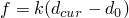
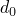
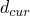
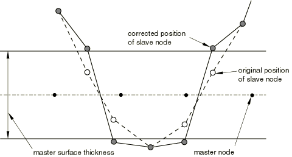

# 36.4.4 控制Abaqus/Explicit中一般接触的初始接触状态


**产品：** Abaqus/Explicit

##### **参考**

- ["在Abaqus/Explicit中定义一般接触相互作用，" 第36.4.1节"](pt09ch36s04aus155.md)
- [*CONTACT*](../key/key-link.md#usb-kws-hcontact)
- [*CONTACT CLEARANCE*](../key/key-link.md#usb-kws-hcontactclearance)
- [*CONTACT CLEARANCE ASSIGNMENT*](../key/key-link.md#usb-kws-hcontclearassign)
- ["生成变形形状图，" Abaqus/CAE用户指南第43.5节"](../usi/usi-link.md#usv-def-produce)

### 概述

包含在一般接触域中的表面相互作用的初始间隙：
- 自动设置为零以解决小的初始过闭合（例如，当使用图形预处理器（如Abaqus/CAE）时由数值舍入引起的小穿透）；
- 可以指定以解决不能自动解决的大初始过闭合；
- 可以指定以分离纠缠的双侧表面；
- 可以指定以为表面之间的初始间隙建模；
- 在不产生模型中任何应变或动量的情况下被施加；
- 不应指定以纠正网格设计中的重大错误；和
- 可用于识别裂纹扩展分析中的初始绑定节点集。

### 模拟第一步中初始过闭合的默认调整

Abaqus/Explicit自动调整表面位置以去除模拟第一步中存在于一般接触域中的小初始过闭合。调整通过无应变初始位移进行。这种自动的表面位置调整旨在仅纠正与网格生成相关的小不匹配，即使在通过用户子程序[`VUINTERACTION`](../sub/sub-link.md#sub-xsl-vuinteraction)定义相互作用时也会执行此操作。

来自单独接触、边界条件、绑定约束、耦合约束和刚体约束的冲突调整可能导致初始过闭合的不完全解决。例如，当从节点被夹在两个主面元之间时会发生这种情况。无法通过重新定位节点解决的初始过闭合被存储为临时接触偏移，以避免分析开始时产生大的接触力。惩罚接触力计算为；其中*k*是惩罚刚度，是初始未解决的穿透距离，是当前穿透距离。如果曾经减少到低于被重置为。

由于双侧面元缺乏唯一的外法向方向，双侧表面的大初始穿透解决可能很困难。初始穿透仅在从节点位于底层单元厚度内时被检测到，并且初始穿透将通过将从节点移动到最近的自由表面来解决，如[图36.4.4-1](pt09ch36s04aus158.md#agendefsurf-bad-init-two-dual)所示。

**图36.4.4-1** 涉及两个双侧表面的接触的初始过闭合校正。



被困在双侧主表面相对侧上的从节点通常会导致严重问题，这些问题可能在分析后期才变得明显。初始交叉的表面也表明单侧表面的建模问题，因为固体内部从节点的初始搜索限制在大约面元尺寸15%的距离内；穿透深度超过此限制的从节点被算法忽略，不调整初始过闭合。

初始过闭合信息——包括节点调整数据、接触偏移、交叉表面、无法校正的节点以及任何警告——被写入状态（`.sta`）文件、消息（`.msg`）文件和输出数据库（`.odb`）文件。用于报告重大初始穿透的默认容差（可能表示模型定义的错误）取决于接触类型。节点-表面接触使用接触面元的特征长度，边缘-边缘接触使用跟踪边缘的长度，节点-解析刚性表面接触使用典型单元尺寸。有关过闭合警告的更多信息，请参阅["Abaqus/Explicit分析中的接触诊断，" 第39.2.1节"](pt09ch39s02aus185.md)和[Abaqus/CAE用户指南第41章"查看诊断输出"](../usi/usi-link.md#usv-output)。

### 模拟后续步骤中过闭合表面的默认调整

在以下情况下，初始穿透被存储为不产生接触力的临时接触偏移：
- 如果一般接触域是在第一步以外的步骤中创建的（即，接触定义跟随没有定义接触的步骤），或
- 如果将Abaqus/Standard分析导入Abaqus/Explicit且接触相互作用未通过用户子程序[`VUINTERACTION`](../sub/sub-link.md#sub-xsl-vuinteraction)定义。

但是，深穿透可能不会被正确处理；它们可能被忽略，或者在穿透超过壳中面的情况下，可能使用错误的接触方向。可以请求初始过闭合和交叉表面诊断以诊断这些问题（见["Abaqus/Explicit分析中的接触诊断，" 第39.2.1节"](pt09ch39s02aus185.md)）。

如果一般接触域在第一步之后扩展，Abaqus/Explicit不会采取特殊操作来逐渐解决新引入相互作用的初始穿透：惩罚接触力将与穿透成比例地施加，或者穿透可能被忽略。此外，初始过闭合和交叉表面诊断不适用于这些新相互作用。

### 指定初始间隙和控制初始过闭合调整

在某些情况下，默认算法不会正确解决初始过闭合，或者需要建模表面之间的精确初始间隙（即正间隙）。具体来说，深穿透可能被忽略，纠缠的双侧表面可能无法正确分离（见[图36.4.4-1](pt09ch36s04aus158.md#agendefsurf-bad-init-two-dual)），并且离散模型中曲线表面之间的间隙可能与非离散模型不一致。要解决这些问题，您可以定义接触间隙并将其分配给接触相互作用。以下给出了示例。

#### 定义接触间隙

您必须为每个接触间隙定义分配一个名称，用于将间隙定义与接触相互作用关联。

| **输入文件用法：** | ``` [*CONTACT CLEARANCE*](../key/key-link.md#usb-kws-hcontactclearance), NAME=*clearance_name* ``` |
| --- | --- |

##### 通过调整节点坐标或创建接触偏移来施加间隙

通过调整节点坐标或创建接触偏移将间隙应用于模型。默认情况下，接触间隙通过调整节点坐标来解决，而不在模型中产生应变或动量（此方法仅能在分析的第一步中使用）。或者，可以为间隙规范创建接触偏移。这些偏移是永久的（与默认初始过闭合解决过程中创建的临时偏移相反），并且不会随着表面分离而斜降至零。如果由于来自单独接触、边界条件、绑定约束、耦合约束或刚体约束的冲突调整而无法解决间隙违规，则也将为通过节点调整指定的间隙创建接触偏移。间隙可以通过接触偏移施加在新建整个接触域的步骤中（即在前一步没有定义接触的步骤）和导入分析的第一步中。

| **输入文件用法：** | 使用以下选项通过调整节点坐标来施加接触间隙（默认）： |
| --- | --- |
| | ``` [*CONTACT CLEARANCE*](../key/key-link.md#usb-kws-hcontactclearance), NAME=*clearance_name*, ADJUST=YES ``` 使用以下选项通过创建接触偏移来施加接触间隙： ``` [*CONTACT CLEARANCE*](../key/key-link.md#usb-kws-hcontactclearance), NAME=*clearance_name*, ADJUST=NO ``` |

##### 设置初始间隙的值

您可以将间隙定义为整个相互作用的单个值，或定义为节点分布以定义每个从节点的间隙（见["分布定义，" 第2.8.1节"](pt01ch02s08aus26.md)）。如果定义了分布且从节点的间隙被省略，间隙值将从主节点的值插值。如果既没有为从节点也没有为最近主面元的所有节点指定间隙值，则从节点将被忽略。

对于实体单元表面的从节点，间隙值必须为非负值。如果未给出值或分布，默认值为0.0。

| **输入文件用法：** | ``` [*CONTACT CLEARANCE*](../key/key-link.md#usb-kws-hcontactclearance), NAME=*clearance_name*, CLEARANCE=*value* or *distribution_name* ``` |
| --- | --- |

##### 定义搜索区域

您可以指定搜索距离以定义表面上下方和上方的"区域"。位于这些区域内的从节点将获得相对于其最近主面的指定间隙值，无论其初始位置如何（过闭合或大于所定义间隙的初始间隙）。最近点为周缘边缘的节点将被排除在间隙规范之外。

实体单元的每个搜索距离的默认值大约是从节点所连接单元尺寸的十分之一。结构单元（如壳单元）的每个搜索距离的默认值是从节点关联的厚度。

| **输入文件用法：** | ``` [*CONTACT CLEARANCE*](../key/key-link.md#usb-kws-hcontactclearance), NAME=*clearance_name*, SEARCH ABOVE=*value*, SEARCH BELOW=*value* ``` |
| --- | --- |

##### 定义搜索节点集

作为指定搜索距离的替代方案，您可以指定搜索节点集，包含已为其定义间隙的从节点。属于此节点集的从节点将获得相对于其最近主面的指定间隙值，无论其初始位置如何（过闭合或大于所定义间隙的初始间隙）。如果指定了搜索节点集，则不会将间隙应用于不属于指定搜索节点集的从节点。

当指定搜索节点集时，存在与实体单元的最大单元尺寸或与节点关联的结构单元（如壳单元）的厚度相关联的默认搜索距离值。任何超出搜索距离的节点位置都不会被调整。

| **输入文件用法：** | ``` [*CONTACT CLEARANCE*](../key/key-link.md#usb-kws-hcontactclearance), NAME=*clearance_name*, SEARCH NSET=*node set name* ``` |
| --- | --- |

#### 为接触相互作用分配接触间隙

您可以为一般接触域中的节点-面相互作用（自接触相互作用除外）分配初始间隙定义。初始间隙定义不能分配给节点-解析刚性表面相互作用。对于节点-面相互作用，定义的两个表面之间的间隙适用于每个表面中的从节点与另一整个表面之间的相互作用。当使用节点调整来解决间隙违规时，调整是为了在初始配置中满足每个从节点相对于其最近主面的间隙规范。接触偏移被设置为初始配置中每个从节点与其最近主面之间的间隙违规值，然后在分析期间相对于另一整个表面将从此值偏移从节点。

指定的表面必须是单侧的，不能包含复杂的面交叉（即，边缘不能连接到两个以上的面）或不连续的法向。在实体单元上定义的表面将自动满足这些要求。这些限制源于双侧单元表面上间隙的定义：如果节点在表面法向定义的上方（下方），则节点相对于表面具有正（负）间隙值（见[图36.4.4-2](pt09ch36s04aus158.md#agencont-clear-conv)）。节点相对于双侧单元表面上的负间隙不表示穿透状态，而是表示节点与表面底层单元的另一侧有间隙。

**图36.4.4-2** 双侧单元的接触间隙符号约定。


默认情况下，间隙被应用于接触域中存在的表面对的所有主-从视图。此外，如果指定了通过节点调整解决的表面之间的间隙，则可以将节点调整过程引导为表面对的一个主-从视图执行调整（这仅适用于节点调整过程，不适用于分析中表面之间使用的接触公式）。

| **输入文件用法：** | 使用以下选项为给定表面对的所有主-从视图指定间隙（默认）： |
| --- | --- |
| | ``` [*CONTACT CLEARANCE ASSIGNMENT*](../key/key-link.md#usb-kws-hcontclearassign) *surface_1*, *surface_2*, *clearance_name* ``` 使用以下选项指定第二表面节点与第一表面面之间的间隙（第一表面被视为主表面）： ``` [*CONTACT CLEARANCE ASSIGNMENT*](../key/key-link.md#usb-kws-hcontclearassign) *surface_1*, *surface_2*, *clearance_name*, MASTER ``` 使用以下选项指定第一表面节点与第二表面面之间的间隙（第一表面被视为从表面）： ``` [*CONTACT CLEARANCE ASSIGNMENT*](../key/key-link.md#usb-kws-hcontclearassign) *surface_1*, *surface_2*, *clearance_name*, SLAVE ``` |

#### 示例

解决初始过闭合的默认算法不会检测到大于从节点所连接面元尺寸约15%的实体表面穿透。[图36.4.4-3](pt09ch36s04aus158.md#agendeep-solid-penet)显示了两个具有大初始穿透的实体单元，这些穿透在默认初始过闭合解决过程中不会被检测到。

**图36.4.4-3** 未检测到的实体单元大穿透。


可以为此模型的过闭合部分显式定义零间隙以解决初始过闭合。按如下方式定义间隙定义：

```
[*CONTACT CLEARANCE*](../key/key-link.md#usb-kws-hcontactclearance), NAME=c1, ADJUST=YES, SEARCH BELOW=0.2
SEARCH ABOVE=0.0
```

并将其分配给`surf1`和`surf2`之间的相互作用：
```
[*CONTACT*](../key/key-link.md#usb-kws-hcontact)
[*CONTACT CLEARANCE ASSIGNMENT*](../key/key-link.md#usb-kws-hcontclearassign)
surf1, surf2, c1
```

结果调整如[图36.4.4-4](pt09ch36s04aus158.md#agendeep-solid-penet2)所示。调整节点坐标可能会通过创建最初不存在的缺陷来降低网格几何形状，可能会减少单元尺寸并相应地减少稳定时间增量大小，或者可能导致单元反转并阻止分析继续。在这种情况下，最好绕过节点坐标调整并指定存储接触偏移。

**图36.4.4-4** 实体单元大穿透的解决。


初始过闭合调整算法还必须被引导以分离纠缠的双侧表面。[图36.4.4-1](pt09ch36s04aus158.md#agendefsurf-bad-init-two-dual)显示了为纠缠壳表面做的默认调整，假设`surf3`的节点具有固定边界条件。[图36.4.4-5](pt09ch36s04aus158.md#agentangled-shell2)显示了以下间隙定义和分配所做的调整：

```
[*CONTACT CLEARANCE*](../key/key-link.md#usb-kws-hcontactclearance), NAME=c2, ADJUST=YES, SEARCH BELOW=1.5,
SEARCH ABOVE=0.0
...
[*CONTACT*](../key/key-link.md#usb-kws-hcontact)
[*CONTACT CLEARANCE ASSIGNMENT*](../key/key-link.md#usb-kws-hcontclearassign)
surf3, surf4, c2
```

**图36.4.4-5** 纠缠双侧表面的分离。


如果`surf3`的节点没有固定，则可以将间隙相互作用设置为纯主-从（将`surf3`定义为主表面），以防止修改`surf3`的几何形状。

在网格几何重要或节点调整冲突的情况下，应创建接触偏移。当通过节点调整为空曲面部指定间隙时，冲突的节点调整是常见问题。节点调整往往会改变弯曲表面的曲率，因为间隙"约束"只能在表面网格重合（且指定了零间隙）或表面平坦的情况下才能满足（见[图36.4.4-6](pt09ch36s04aus158.md#agencurved-surf-gap)）。

**图36.4.4-6** 在同心圆形表面之间指定统一的初始间隙。


### 识别潜在的部分绑定表面

您可以指定搜索节点集，以识别在VCCT裂纹扩展分析中哪些从节点将被标记为初始绑定。请参阅["裂纹扩展分析，" 第11.4.3节"](pt04ch11s04aus69.md)了解更多详情。

| **输入文件用法：** | 使用以下选项： |
| --- | --- |
| | ``` [*CONTACT CLEARANCE*](../key/key-link.md#usb-kws-hcontactclearance), NAME=*clearance_name*, SEARCH NSET=*node set name* [*CONTACT CLEARANCE ASSIGNMENT*](../key/key-link.md#usb-kws-hcontclearassign) *surface_1*, *surface_2*, *clearance_name* ``` |


