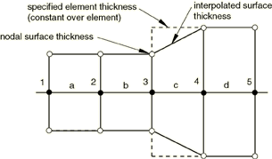
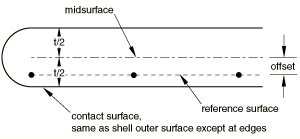
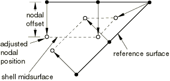
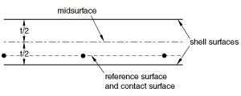
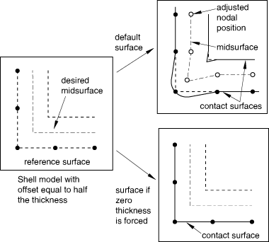
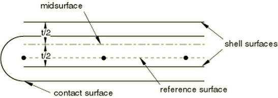

# 36.5.2 为Abaqus/Explicit中的接触对分配表面属性


**产品：** Abaqus/Explicit  Abaqus/CAE

##### **参考**

- ["在Abaqus/Explicit中定义接触对，" 第36.5.1节"](pt09ch36s05aus160.md)
- [*CONTACT PAIR*](../key/key-link.md#usb-kws-hcontactpair)
- [*SURFACE*](../key/key-link.md#usb-kws-msurface)
- ["定义接触相互作用属性"中的"机械接触属性选项的几何属性" Abaqus/CAE用户指南第15.14.1节"](../usi/usi-link.md#usi-itn-help-prop-contact-mech-geometric)

### 概述

本节描述如何修改在Abaqus/Explicit中用接触对算法定义的接触相互作用的表面属性，包括表面厚度和偏移。

### 壳、膜或刚性单元厚度以及壳或刚性单元偏移

要在分析开始时在接触中定义壳、膜或刚性单元上的表面，必须在定义节点坐标时考虑单元厚度；否则，接触对中的表面将过闭合。表面厚度和表面偏移默认继承自底层壳和膜单元。对于基于刚性单元的表面，默认表面厚度和偏移对应于刚性体定义的厚度和偏移（见["刚性单元，" 第30.3.1节"](pt06ch30s03alm23.md)）。对于基于实体单元的表面，表面厚度和偏移为零。

默认情况下，基于壳、膜或刚性单元的表面的节点厚度等于周围单元的最小厚度（见[图36.5.2-1](pt09ch36s05aus161.md#adefsurf-cont-thick1)和[表36.5.2-1](pt09ch36s05aus161.md#table-adefsurf-thick1)）。面元内的表面厚度从节点值插值；插值的表面厚度永远不会超过指定的单元或节点厚度，这可能对初始过闭合很重要。

如果为底层单元定义了空间变化的节点厚度（见["节点厚度，" 第2.1.3节"](pt01ch02s01aus07.md)），节点表面厚度可能不完全对应于指定的节点厚度（见[图36.5.2-2](pt09ch36s05aus161.md#adefsurf-cont-thick2)中的节点4和[表36.5.2-2](pt09ch36s05aus161.md#table-adefsurf-thick2)）。节点表面厚度分布往往比指定的节点厚度分布更扩散（因为指定的节点厚度被平均以计算单元厚度，而节点表面厚度是周围单元厚度的最小值）。

下面讨论表面厚度和偏移的影响，以及修改表面厚度和避免表面偏移的方法。

**图36.5.2-1** 表面厚度在面元边界之间的连续变化。



**表36.5.2-1** 对应于[图36.5.2-1](pt09ch36s05aus161.md#adefsurf-cont-thick1)的厚度。
| 节点 | 单元 | 指定的单元厚度 | 节点表面厚度（相邻单元厚度的最小值） |
| --- | --- | --- | --- |
| 1 |  |  | 0.5 |
|  | a | 0.5 |  |
| 2 |  |  | 0.5 |
|  | b | 0.5 |  |
| 3 |  |  | 0.5 |
|  | c | 0.9 |  |
| 4 |  |  | 0.9 |
|  | d | 0.9 |  |
| 5 |  |  | 0.9 |

**图36.5.2-2** 节点表面厚度与指定节点厚度之间的小差异。


**表36.5.2-2** 对应于[图36.5.2-2](pt09ch36s05aus161.md#adefsurf-cont-thick2)的厚度。
| 节点 | 单元 | 指定的节点厚度 | 单元厚度（指定节点厚度的平均值） | 节点表面厚度（相邻单元厚度的最小值） |
| --- | --- | --- | --- | --- |
| 1 |  | 0.5 |  | 0.5 |
|  | a |  | 0.5 |  |
| 2 |  | 0.5 |  | 0.5 |
|  | b |  | 0.5 |  |
| 3 |  | 0.5 |  | 0.5 |
|  | c |  | 0.7 |  |
| 4 |  | 0.9 |  | 0.7 |
|  | d |  | 0.9 |  |
| 5 |  | 0.9 |  | 0.9 |
|  | e |  | 0.9 |  |
| 6 |  | 0.9 |  | 0.9 |

#### 表面厚度和偏移的影响

在接触对算法中考虑厚度将导致表面在单元平面中超出父单元边界，偏移量等于其厚度的一半。例如，这种半圆形形状的表面扩展将导致在壳边界上的节点到达相对表面之前，就建立了壳边缘与相对表面之间的接触。这种扩展对于单侧和双侧表面都存在。[图36.5.2-3](pt09ch36s05aus161.md#adefsurf-edge-contact)演示了这个概念。当使用一般接触算法时，这种"牛鼻"扩展被避免（["在Abaqus/Explicit中定义一般接触相互作用，" 第36.4.1节"](pt09ch36s04aus155.md)）。壳或刚性偏移对表面的影响如[图36.5.2-4](pt09ch36s05aus161.md#adeform-offset1)所示。如果存在大的偏移，在角落附近可能导致表面定义不佳，如[图36.5.2-5](pt09ch36s05aus161.md#adeform-offset2)所示。定义模型时应考虑这一点。如果偏移幅度大于任何底层壳单元边缘长度的一半，将发出警告消息。然而，在尖角处，偏移小于父单元尺寸的一半也可能导致接触表面定义不佳（在这种情况下不会给出警告）。

**图36.5.2-3** 无零表面厚度时边缘接触的接触表面扩展。


**图36.5.2-4** 存在壳偏移时的接触表面扩展。



**图36.5.2-5** 存在大壳偏移时角落附近定义不佳的表面示例。



#### 控制接触计算中表面厚度和偏移的影响

您可以控制仅在接触计算中使用的厚度和偏移；它们不影响基于表面的约束。这些设置主要用于自接触表面，因为对于这些表面您不能强制零厚度，如下所述。

自接触表面不应包含比其边缘或对角线长度更厚的面元。由于算法在每个面元边缘周围使用半径为接触厚度一半的半圆形管道，极大的厚度将导致节点看起来穿透附近的面元，即使在平坦的自接触表面中也是如此（见[图36.5.2-6](pt09ch36s05aus161.md#adeform-offset4)）。

**图36.5.2-6** 自接触表面中大厚度导致的不期望穿透。


您可以通过单个因子*f*来缩放表面上所有面元的有效厚度。或者，您可以仅调整厚度与最小边缘或对角线长度比超过指定值*r*的表面面元的厚度；由于面元尺寸的变化，面元厚度调整量可能在分析期间变化。如果在初始配置中自接触表面的厚度与单元尺寸比超过1.0，将发出错误消息，建议您调整厚度。

对于双侧表面或将参与自接触的表面，不应为*f*或*r*指定极小的值，因为这些表面必须具有与面元尺寸相比不可忽略的接触厚度。对于仅参与两表面接触的表面，设置*f*=0.0是可以接受的；但是，使用如下所述的方法强制零表面厚度在计算上更有效。还可以通过将缩放因子*f*设置为零来强制偏移但不强制表面模型中的厚度。

| **输入文件用法：** | 使用以下选项通过单个因子缩放表面厚度： |
| --- | --- |
| | ``` [*SURFACE*](../key/key-link.md#usb-kws-msurface), NAME=*name*, SCALE THICK=*f* ``` 使用以下选项调整厚度与单元尺寸比： ``` [*SURFACE*](../key/key-link.md#usb-kws-msurface), NAME=*name*, MAX RATIO=*r* ``` |

| **Abaqus/CAE用法：** | 您不能在Abaqus/CAE中缩放接触表面的厚度。 |
| --- | --- |

#### 强制零表面厚度和偏移

您可以强制表面厚度和偏移为零，而不是继承底层壳、膜或刚性单元的厚度和偏移。在这种情况下，接触表面被视为参考表面（见[图36.5.2-7](pt09ch36s05aus161.md#adeform-no-thick)）。

**图36.5.2-7** 具有零厚度和偏移的接触表面。



对于用作单侧（自）接触的表面，您不能忽略厚度。如果接触对中的一个表面是双侧表面，只能对两个表面中的一个强制零厚度：涉及双侧表面的接触对中至少有一个表面必须具有非零厚度。强制零表面厚度的能力对于执行关于模型厚度或偏移的参数研究很有用，因为您可以更改厚度和偏移，而不必移动网格来控制表面之间的初始分离。

| **输入文件用法：** | ``` [*SURFACE*](../key/key-link.md#usb-kws-msurface), NAME=*name*, NO THICK ``` |
| --- | --- |

| **Abaqus/CAE用法：** | 您不能在Abaqus/CAE中强制表面厚度为零。 |
| --- | --- |

##### 示例

默认厚度和偏移处理通常使接触计算最准确。但是，当指定了半个原始壳厚度偏移时，强制零表面厚度将给出表面一侧的准确表示。这种方法在角落附近（特别是角落的外侧）可能比强制偏移和厚度更准确，如[图36.5.2-8](pt09ch36s05aus161.md#adeform-offset3)所示。

**图36.5.2-8** 当壳偏移是原始壳厚度的一半时强制零表面厚度。



#### 强制零表面偏移

对于需要忽略偏移影响但仍需要在接触计算中建模厚度的情况，您可以强制仅表面偏移为零而不影响表面厚度。在这种情况下，接触表面是假想壳、膜或刚性单元的外表面，其参考平面位于参考表面（见[图36.5.2-9](pt09ch36s05aus161.md#adeform-no-offset)）。

**图36.5.2-9** 具有零偏移的接触表面。



如果偏移强制会导致定义不佳，则此方法可用于自接触表面（自接触表面必须强制厚度）。

| **输入文件用法：** | ``` [*SURFACE*](../key/key-link.md#usb-kws-msurface), NAME=*name*, NO OFFSET ``` |
| --- | --- |

| **Abaqus/CAE用法：** | 您不能在Abaqus/CAE中强制表面偏移为零。 |
| --- | --- |

### 为接触对相互作用定义额外的接触厚度

除了已经为接触对表面底层单元定义的任何单元厚度或中面偏移外，您还可以为接触对相互作用指定接触偏移。对于小滑动，这包括由初始间隙定义的接触偏移（见["在Abaqus/Explicit中调整接触对初始表面位置和指定初始间隙，" 第36.5.4节"](pt09ch36s05aus163.md#usb-cni-aexpadjustsurfaces-clearance)中的"精确指定初始间隙值"）。指定的偏移值将被施加为分离两个表面的层的附加厚度，而不是作为接触对中每个表面的附加厚度。此值可以是正的或负的。此技术通常与软化行为结合使用（见["接触压力-闭合关系，" 第37.1.2节"](pt09ch37s01aus166.md)）来建模两个接触表面之间薄层的厚度。

| **输入文件用法：** | ``` [*SURFACE INTERACTION*](../key/key-link.md#usb-kws-hsurfaceinteraction), PAD THICKNESS=*value* ``` |
| --- | --- |

| **Abaqus/CAE用法：** | 相互作用模块：接触属性编辑器：****机械********几何属性****：打开**界面层厚度（Explicit）**：*value* |
| --- | --- |


