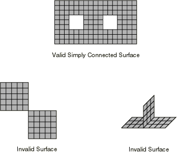

# 36.5.1 在Abaqus/Explicit中定义接触对


**产品：** Abaqus/Explicit  Abaqus/CAE

##### **参考**

- ["基于单元的表面定义，" 第2.3.2节"](pt01ch02s03aus17.md)
- ["基于节点的表面定义，" 第2.3.3节"](pt01ch02s03aus18.md)
- ["解析刚性表面定义，" 第2.3.4节"](pt01ch02s03aus19.md)
- ["接触相互作用分析概述，" 第36.1.1节"](pt09ch36s01abo33.md)
- [*CONTACT CONTROLS*](../key/key-link.md#usb-kws-hcontactcontrols)
- [*CONTACT PAIR*](../key/key-link.md#usb-kws-hcontactpair)
- [*SURFACE*](../key/key-link.md#usb-kws-msurface)
- ["定义表面-表面接触，" Abaqus/CAE用户指南第15.13.7节"](../usi/usi-link.md#usi-itn-help-surftosurf)
- ["定义自接触，" Abaqus/CAE用户指南第15.13.8节"](../usi/usi-link.md#usi-itn-help-self)

### 概述

Abaqus/Explicit提供了两种用于建模接触和相互作用问题的算法：一般接触算法和接触对算法。关于这两种算法的比较，请参阅["接触相互作用分析概述，" 第36.1.1节"](pt09ch36s01abo33.md)。本节描述如何在Abaqus/Explicit中定义表面的接触对以进行接触模拟。

Abaqus/Explicit中的接触对：
- 是模型历史定义的一部分，可以按步创建、修改和移除（与Abaqus/Standard不同，接触对是模型数据）；
- 使用复杂的跟踪算法以确保有效地施加适当的接触条件；
- 可以同时与一般接触算法一起使用（即，一些相互作用可以用接触对建模，而其他用一般接触算法建模）；
- 可以使用一对刚性或可变形表面或单个可变形表面形成；
- 不必使用具有匹配网格的表面；
- 不能由一个二维表面和一个三维表面形成；和
- 不能用于由一阶单元和二阶单元组成的表面的自接触。

### 定义接触对相互作用

在Abaqus/Explicit中，接触对相互作用的定义包括指定：
- 接触对算法和相互作用的表面，如本节所述；
- 接触表面属性（["为Abaqus/Explicit中的接触对分配表面属性，" 第36.5.2节"](pt09ch36s05aus161.md)）；
- 机械接触属性模型（["为Abaqus/Explicit中的接触对分配接触属性，" 第36.5.3节"](pt09ch36s05aus162.md)）；
- 接触公式（["Abaqus/Explicit中接触对的接触公式，" 第38.2.2节"](pt09ch38s02aus181.md)）；
- 接触约束施加方法（["Abaqus/Explicit中的接触约束施加方法，" 第38.2.3节"](pt09ch38s02aus182.md)）；和
- 算法接触控制（["Abaqus/Explicit中使用接触对的接触建模常见困难，" 第39.2.2节"](pt09ch39s02aus186.md)）。

### 定义包含两个表面的接触对

要定义接触对，您必须指明哪对表面将相互作用。表面指定的顺序仅在指定非默认加权因子时重要（详见["Abaqus/Explicit中接触对的接触公式，" 第38.2.2节"](pt09ch38s02aus181.md#usb-cni-acontactpair-exppair)中的"接触表面加权"）。有关定义用于接触对的表面的信息，请参阅["基于单元的表面定义，" 第2.3.2节"](pt01ch02s03aus17.md)；["基于节点的表面定义，" 第2.3.3节"](pt01ch02s03aus18.md)；和["解析刚性表面定义，" 第2.3.4节"](pt01ch02s03aus19.md)。

| **输入文件用法：** | ``` [*CONTACT PAIR*](../key/key-link.md#usb-kws-hcontactpair) *surface_1_name*, *surface_2_name* ``` |
| --- | --- |

| **Abaqus/CAE用法：** | 相互作用模块：**创建相互作用**：**表面-表面接触（Explicit）**：选择第一个表面，点击**表面**，选择第二个表面 |
| --- | --- |

### 定义自接触

通过仅指定单个表面或两次指定相同表面来定义单个表面与其自身的接触。

| **输入文件用法：** | 使用以下任一选项： |
| --- | --- |
| | ``` [*CONTACT PAIR*](../key/key-link.md#usb-kws-hcontactpair) *surface_1,* [*CONTACT PAIR*](../key/key-link.md#usb-kws-hcontactpair) *surface_1, surface_1* ``` |

| **Abaqus/CAE用法：** | 相互作用模块：**创建相互作用**：**自接触（Explicit）**：选择表面或**表面-表面接触（Explicit）**：选择表面，点击**表面**，再次选择表面 |
| --- | --- |

#### 自接触的限制

对自接触的接触对强制执行以下限制：
- 平衡主-从接触算法将始终用于接触对（不能为接触对指定非默认加权因子）。
- 对于壳或膜单元上的自接触表面，必须考虑接触厚度（见["基于单元的表面定义，" 第2.3.2节"](pt01ch02s03aus17.md)）；即，零表面厚度（见["为Abaqus/Explicit中的接触对分配表面属性，" 第36.5.2节"](pt09ch36s05aus161.md#usb-cni-acontactpairsurfaces-nothick)会导致Abaqus/Explicit发出错误消息。默认情况下，接触厚度等于当前厚度。
- 自接触的接触厚度不应超过面元的边缘长度或对角线长度。如有需要，您可以减少接触厚度；请参阅["为Abaqus/Explicit中的接触对分配表面属性，" 第36.5.2节"](pt09ch36s05aus161.md#usb-cni-acontactpairsurfaces-controlthick)中的"控制在接触计算中表面厚度和偏移的影响"。
- 必须使用专用有限滑动跟踪算法。不支持使用小滑动接触公式并会导致Abaqus/Explicit发出错误消息。
- 接触将在自接触表面上任何节点与同一表面任何其他点之间被识别，包括壳或膜的两侧（即，壳和膜上的自接触独立于表面定义中指定的面标识符）。

### 移除和添加接触对

接触对的移除和添加：
- 可用于模拟复杂成型过程，其中多个工具需要在不同阶段与工件相互作用；
- 可用于扩展表面以防止一个表面滑离另一个表面；
- 可以通过消除不必要的接触搜索来节省大量计算成本；和
- 可用于更改接触对的定义。

#### 添加接触对

默认情况下，指定的接触对被添加到模型中活动接触对的列表中。

第一步后引入的接触对应避免初始穿透，因为可能导致大的节点加速度和严重的单元变形（见["在Abaqus/Explicit中调整接触对初始表面位置和指定初始间隙，" 第36.5.4节"](pt09ch36s05aus163.md)）。在同一步骤中通过删除然后添加来重新定义接触对也可能导致问题，因为与接触中的从节点关联的"状态"信息将被重新初始化。例如，如果接触状态被重新初始化，具有穿透双侧主表面中面的惩罚接触从节点将被允许穿过主表面。

| **输入文件用法：** | ``` [*CONTACT PAIR*](../key/key-link.md#usb-kws-hcontactpair), OP=ADD ``` |
| --- | --- |

| **Abaqus/CAE用法：** | 相互作用模块：**创建相互作用** |
| --- | --- |

#### 移除接触对

移除接触对是模拟多个工具将接触同一工件的复杂成型过程的有用技术。一旦不再需要接触对，移除它就消除了监测接触条件的需要并降低了模拟成本。

| **输入文件用法：** | ``` [*CONTACT PAIR*](../key/key-link.md#usb-kws-hcontactpair), OP=DELETE ``` |
| --- | --- |

| **Abaqus/CAE用法：** | 相互作用模块：相互作用管理器：**停用** |
| --- | --- |

### 接触对中使用表面的一般限制

以下一般限制（除["基于单元的表面定义，" 第2.3.2节"](pt01ch02s03aus17.md)中讨论的限制外）适用于接触对中使用的所有表面：
- 表面的表面法向必须指向可能接触的另一表面，除非表面是双侧的，如下所述。
- 如果底层单元可能失效，则不应在接触对中使用基于单元的表面（有关更多信息，请参阅["动态失效模型，" 第23.2.8节"](pt05ch23s02abm24.md)）。在这种情况下，请使用一般接触（["在Abaqus/Explicit中定义一般接触相互作用，" 第36.4.1节"](pt09ch36s04aus155.md)）或基于节点的表面（["基于节点的表面定义，" 第2.3.3节"](pt01ch02s03aus18.md)）。
- 表面必须是连续的，如下所述。
- 连续单元和结构单元不能混合在同一表面定义中。
- 变形单元不能与组成刚体一部分的单元组合来定义单个表面。

这些限制不适用于与一般接触算法一起使用的表面（["在Abaqus/Explicit中定义一般接触相互作用，" 第36.4.1节"](pt09ch36s04aus155.md)）。

以下限制适用于形成运动接触对的表面：
- 刚性表面必须始终是主表面。
- 从表面必须是变形体的一部分。
- 基于节点的表面只能用作从表面。

以下限制适用于形成惩罚接触对的表面：
- 解析刚性表面必须始终是主表面。
- 基于节点的表面只能用作从表面。

#### 定向表面法向

表面法向的方向对于两个接触表面之间接触的正确检测可能至关重要。在最近点，形成接触对的单侧主表面的法向应始终指向从表面。如果在模型的初始配置中，单侧主表面的法向指向其从表面的相反方向，Abaqus/Explicit将检测到从表面穿透主表面。Abaqus/Explicit将在模拟开始之前尝试用无应变位移解决此接触对的初始过闭合（见["在Abaqus/Explicit中调整接触对初始表面位置和指定初始间隙，" 第36.5.4节"](pt09ch36s05aus163.md)）。如果过闭合太严重，Abaqus/Explicit可能难以进行模拟。在大多数这些情况下，分析将立即终止，并发出关于严重变形单元的错误消息。

您必须特别注意检查在壳、膜或刚性单元上创建的解析刚性表面或单侧表面是否具有正确的方向。通过运行数据检查分析（["Abaqus/Standard、Abaqus/Explicit和Abaqus/CFD执行，" 第3.2.2节"](pt01ch03s02abx02.md)）并检查Abaqus/CAE中的变形配置，通常可以快速轻松地检测表面方向错误。如果发生了大位移，可能是由于错误的表面方向。

刚性和可变形表面正确和不正确定向的示例如[图36.5.1-1](pt09ch36s05aus160.md#asurfover-exp-good-bad-rigid)所示。

**图36.5.1-1** 具有刚性表面的正确和不正确定向示例。


对于双侧表面，不需要所有底层壳或膜单元的法向具有一致的正向：如果可能，Abaqus/Explicit将定义表面，使其面元具有一致的法向，即使底层单元不具有一致的法向。如果单元法向都一致，则面元法向将与单元法向相同；否则，将为表面选择任意正向。对于双侧表面，正向仅在与接触压力输出变量CPRESS的符号相关时才有意义，如["基于单元的表面定义，" 第2.3.2节"](pt01ch02s03aus17.md)中所讨论。

#### 定义连续表面

接触对表面不能由两个或更多断开区域组成。解析刚性表面的定义自动确保这些表面是连续的。但是，必须注意定义用单元形成的表面，使它们在三维模型中跨单元边缘或在二维模型中通过节点连续。这种连续性要求对什么构成有效或无效表面定义有几个含义。在二维中，表面必须是具有两个终端的简单非相交曲线或闭合环。[图36.5.1-2](pt09ch36s05aus160.md#asurfover-exp-good-bad-2d)显示了在接触对中使用的有效和无效二维表面的示例。

**图36.5.1-2** 有效和无效的2D表面。


在三维中，属于有效表面的单元面的边缘可以在表面的周缘上或与其他面共享。形成接触对表面的两个单元面不能仅在共享节点处连接；它们必须在公共单元边缘上连接。单元边缘不能被两个以上的表面面元共享。[图36.5.1-3](pt09ch36s05aus160.md#asurfover-exp-good-bad-3d)说明了在接触对中使用的有效和无效三维表面。

**图36.5.1-3** 有效和无效的3D表面。



连续性要求适用于自动生成自由表面和用单元面标识符定义的表面（见["基于单元的表面定义，" 第2.3.2节"](pt01ch02s03aus17.md)）。[图36.5.1-4](pt09ch36s05aus160.md#aexpsurfover-auto-free-surf)显示由包含两个不相连单元组的元素集规范生成的自动自由表面。结果表面不连续，因为它由两条不相连的开放曲线组成。

**图36.5.1-4** 自动自由表面生成。


### 二维接触模拟的限制

以下限制适用于定义二维（平面）或轴对称问题的接触模拟：
- 接触对不能涉及平面表面和轴对称表面。此限制仅适用于变形和基于单元的刚性表面。
- 不建议定义包含在面外方向（"深度"）具有不同尺寸的平面单元形成的两个表面的接触对，并将发出警告消息。在这种情况下，摩擦应力基于加权平均深度计算，第一个表面的加权等于用户指定的接触表面加权因子。二维梁单元基表面的面外厚度始终假定为一。因此，作用在这种表面上的接触压力可以也被视为线力。
- 当多个接触对涉及相同刚性表面（由平面单元形成）与不同平面变形表面的接触时，变形表面必须都具有相同的深度；否则，将发出警告消息。用于计算接触应力的深度值将从这些变形表面之一中获取，但此选择无法预测。

### 三维梁和桁架单元接触模拟中的限制

不能在三维梁或桁架单元上形成基于单元的表面，因此必须使用基于节点的表面来定义这些单元上的表面。由于必须使用基于节点的表面，三维梁或桁架单元上的表面必须在纯主-从接触对中形成从表面。因此，不可能有两个三维梁或桁架结构相互接触。

### 输出

您可以将与接触对相互作用相关的接触表面变量写入Abaqus输出数据库（`.odb`）文件。机械接触分析的表面变量包括接触压力和力、摩擦剪切应力和力、接触期间表面的相对切向运动（滑移）、整个表面结果量（即力、力矩、压力中心和接触总面积）、绑定节点的状态，以及关于轴对称单元*z*轴可以传递的最大扭矩。

有关请求接触表面输出的更多讨论，请参阅["输出到输出数据库，" 第4.1.3节"](pt02ch04s01aus40.md#usb-out-odboutput-surface)中的"Abaqus/Standard和Abaqus/Explicit中的表面输出"。热相互作用的输出在["热接触属性，" 第37.2.1节"](pt09ch37s02aus174.md)中讨论。

#### 场输出

通用变量CSTRESS、CFORCE、FSLIP和FSLIPR是Abaqus/Explicit有效的场输出请求。如果为接触对请求CSTRESS，则变量CPRESS（接触压力）、CSHEAR1（局部1方向中的接触牵引力），如果接触相互作用是三维的，还有CSHEAR2（局部2方向中的接触牵引力）可以在Abaqus/CAE中为接触对中的每个离散（即非解析）表面绘制等值线。

接触压力（CPRESS）在与接触对算法一起使用的表面上的等值线将使用以下约定显示：正压力表示表面正侧上的压缩接触。表面的正侧可以通过在Abaqus/CAE的Visualization模块中绘制表面法向来确定。按照此约定，对于双侧表面的负侧（背面）上的接触，CPRESS的符号将反转，因此如果在双侧表面的背面发生接触，可能会看到CPRESS的负值。如果来自不同接触对的接触同时发生在双侧表面的两侧，则分别为每个接触对给出CPRESS值。

如果为接触对请求CFORCE，则变量CNORMF（法向接触力）和CSHEARF（剪切接触力）可以在Abaqus/CAE中作为矢量符号图绘制，用于接触对中的每个离散（即非解析）表面。

如果请求FSLIPR，则FSLIPR（接触中从节点的滑移率大小）可以为接触对中的每个从表面在Abaqus/CAE中绘制等值线。此外，对于涉及解析刚性表面和所有二维接触相互作用的三维接触相互作用，如果请求FSLIPR，基于局部切向方向的净滑移率分量（FSLIPR1，在三维中还有FSLIPR2）也可以为接触对中的每个从表面在Abaqus/CAE中绘制等值线。只要从节点不接触，所有滑移率变量都为零。

如果请求FSLIP，则FSLIPEQ（从节点在接触时整个滑移路径的长度）可以为接触对中的每个从表面在Abaqus/CAE中绘制等值线。此外，对于涉及解析刚性表面和所有二维接触相互作用的三维接触相互作用，如果请求FSLIP，基于局部切向方向的净滑移分量（FSLIP1，在三维中还有FSLIP2）也可以为接触对中的每个从表面在Abaqus/CAE中绘制等值线。这些滑移变量等价于随时间积分的滑移率变量：FSLIPEQ、FSLIP1和FSLIP2分别等价于FSLIPR、FSLIPR1和FSLIPR2随时间的积分。因此，这些滑移变量仅考虑从节点接触时发生的相对运动。

#### 历史输出

有几个整个表面接触变量可作为历史输出可用。这些变量将表面的接触状态记录为相对于原点的力（CFN、CFS和CFT）和力矩（CMN、CMS和CMMT）结果。其他变量给出表面上压力的中心（XN、XS和XT）（定义为表面上最接近表面质心的点，该点位于其合力的作用线上，对于该合力产生的合力矩最小）。每个变量名称的最后一个字母（除了变量CAREA）表示使用表面上哪个接触力分布来计算合力：字母N表示使用法向接触力来推导结果量；字母S表示使用剪切接触力来推导结果量；字母T表示使用法向和剪切接触力的总和来推导结果量。这些历史输出变量将被写入输出数据库两次，每个涉及接触对的表面一次。

每个总力矩输出变量不一定等于各个力中心向量与合力向量的叉乘。作用在表面两个不同节点上的力可能具有相反方向的分量，使得这些节点力分量产生净力矩但不产生净力；因此，总力矩可能并非完全源于合力。当表面节点力大致沿同一方向作用时，力中心输出变量最有意义。

可以使用输出变量CAREA请求给定时刻的接触总面积，定义为所有存在接触力的面元之和。CAREA报告的接触面积通常略大于合理网格化接触表面的真实接触面积；因此，应谨慎解释CAREA。CAREA输出与真实接触面积之间的差异随着网格密度增加而减小。使用接触包含或排除将CAREA输出限制为较小的接触表面也可以在某些情况下减少差异。由于CAREA输出是真实接触面积的近似值，使用此输出推导力或应力值可能不会产生准确值；直接请求接触力和应力是获得准确结果的最合适方式。

可从Abaqus/Explicit模拟获取绑定表面状态的详细历史输出。详细信息请参阅["可断裂 bonds，" 第37.1.9节"](pt09ch37s01aus173.md)。

#### 在轴对称分析中获得关于*z*轴可以传递的"最大扭矩"

当使用轴对称（CAX）单元建模基于表面的接触时，Abaqus/Explicit可以计算关于*z*轴可以传递的最大扭矩（输出变量CTRQ）。最大扭矩*T*定义为


其中*p*是跨界面传递的压力，*r*是到界面上一点处的半径，*s*是当前在*r*–*z*平面中沿界面的距离。"扭矩"的这个定义有效地假设了摩擦系数为1。


