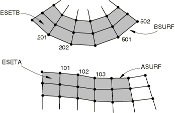

# 36.5.3 为Abaqus/Explicit中的接触对分配接触属性


**产品：** Abaqus/Explicit  Abaqus/CAE

##### **参考**

- ["机械接触属性概述，" 第37.1.1节"](pt09ch37s01aus165.md)
- ["接触压力-闭合关系，" 第37.1.2节"](pt09ch37s01aus166.md)
- ["接触阻尼，" 第37.1.3节"](pt09ch37s01aus167.md)
- ["摩擦行为，" 第37.1.5节"](pt09ch37s01aus169.md)
- ["用户定义的界面本构行为，" 第37.1.6节"](pt09ch37s01aus170.md)
- ["可断裂 bonds，" 第37.1.9节"](pt09ch37s01aus173.md)
- [*CONTACT PAIR*](../key/key-link.md#usb-kws-hcontactpair)
- [*SURFACE INTERACTION*](../key/key-link.md#usb-kws-hsurfaceinteraction)
- ["交互属性编辑器，" Abaqus/CAE用户指南第15.9.3节"](../usi/usi-link.md#usi-itn-manage-propeditor)

### 概述

接触属性：
- 定义了当表面处于接触状态时控制其行为的机械和热表面相互作用模型；和
- 被分配给各个接触对。

### 为接触对分配接触属性定义

如果需要非默认接触属性，您可以引用控制两个表面相互作用的接触属性定义。

多个接触对可以引用相同的接触属性定义。

| **输入文件用法：** | 同时使用以下两个选项： |
| --- | --- |
| | ``` [*CONTACT PAIR*](../key/key-link.md#usb-kws-hcontactpair), INTERACTION=*interaction_property_name* *surface_1*, *surface_2* [*SURFACE INTERACTION*](../key/key-link.md#usb-kws-hsurfaceinteraction), NAME=*interaction_property_name* ``` |

| **Abaqus/CAE用法：** | 相互作用模块： |
| --- | --- |
| | **创建相互作用属性**：**名称：***interaction_property_name*，**接触相互作用编辑器**：**接触相互作用属性**：*interaction_property_name* |

#### 示例

[图36.5.3-1](pt09ch36s05aus162.md#acontactmech-exp-fric)显示了该示例中使用的网格。为此示例，使用了平衡主-从接触对。接触对的属性定义（`GRATING`）使用摩擦模型，其中=0.4。

**图36.5.3-1** 具有摩擦的表面相互作用。



```
[*HEADING*](../key/key-link.md#usb-kws-mheading)
…
[*SURFACE*](../key/key-link.md#usb-kws-msurface), NAME=ASURF
ESETA,
[*SURFACE*](../key/key-link.md#usb-kws-msurface), NAME=BSURF
ESETB,
…
[*STEP*](../key/key-link.md#usb-kws-hstep)
Step1
[*DYNAMIC*](../key/key-link.md#usb-kws-hdynamic), EXPLICIT
…
[*CONTACT PAIR*](../key/key-link.md#usb-kws-hcontactpair), INTERACTION=GRATING
ASURF, BSURF
[*SURFACE INTERACTION*](../key/key-link.md#usb-kws-hsurfaceinteraction), NAME=GRATING
[*FRICTION*](../key/key-link.md#usb-kws-hfriction)
0.4
```

### 更改接触属性

接触属性模型作为接触对分析的模型或历史数据定义。您可以从步骤到步骤修改接触属性；但是，应删除旧接触对并使用新相互作用重新定义。

#### 示例

例如，可以使用以下输入来更改在前面示例启动的分析的第二步中`ASURF`和`BSURF`之间接触使用的摩擦系数：

```
[*STEP*](../key/key-link.md#usb-kws-hstep)
Step2
[*DYNAMIC*](../key/key-link.md#usb-kws-hdynamic), EXPLICIT
…
[*CONTACT PAIR*](../key/key-link.md#usb-kws-hcontactpair), INTERACTION=GRATING,OP=DELETE
ASURF, BSURF
[*SURFACE INTERACTION*](../key/key-link.md#usb-kws-hsurfaceinteraction), NAME=GRATING_NEW
[*FRICTION*](../key/key-link.md#usb-kws-hfriction)
0.5
[*CONTACT PAIR*](../key/key-link.md#usb-kws-hcontactpair), INTERACTION=GRATING_NEW
ASURF, BSURF
```


